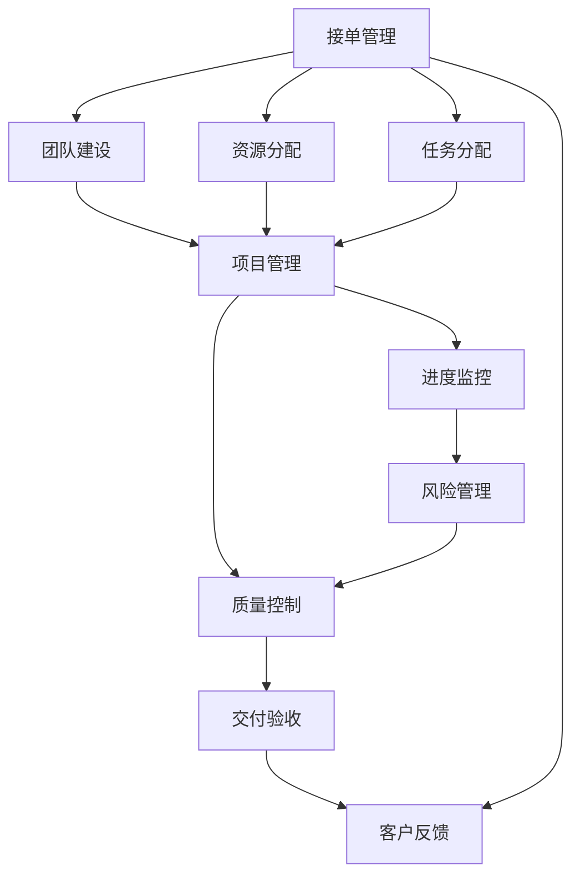

                 

# 技术外包：从接单到建立团队

> 关键词：技术外包,接单管理,团队建设,项目管理,资源分配

## 1. 背景介绍

### 1.1 问题由来

在科技日新月异的今天，技术外包成为了企业提升效率、降低成本的有效手段。然而，面对日益复杂的技术需求，如何高效接单、快速响应、精细管理，并组建一支高效稳定的技术团队，成为企业外包技术服务的核心挑战。

### 1.2 问题核心关键点

技术外包的本质是将内部开发和维护工作转交给外部团队完成。这涉及接单管理、团队建设、项目管理、资源分配等多个环节。各环节的精细管理，不仅关乎项目交付质量，更影响企业长期发展的效率和稳定性。

### 1.3 问题研究意义

系统梳理技术外包的管理流程和团队建设策略，不仅能帮助企业更高效地应对外部需求，还能在一定程度上提升企业的内部技术研发能力，形成内外互补、共同发展的良性生态。

## 2. 核心概念与联系

### 2.1 核心概念概述

为更好地理解技术外包从接单到建立团队的过程，本节将介绍几个关键概念：

- **技术外包**：指企业将某些技术性工作交给外部团队或自由职业者完成，以提升内部研发效率、降低开发成本。
- **接单管理**：指企业接收外部订单、选择合适的外部团队或自由职业者，并管理订单流程的整个过程。
- **团队建设**：指在技术外包过程中，企业需组建并管理一支稳定的技术团队，以便快速响应需求、提升开发效率。
- **项目管理**：指对技术外包项目进行规划、执行、监控和控制，以确保项目按时、按质、按预算完成。
- **资源分配**：指在技术外包项目中，合理分配人力资源、技术资源，以提高项目的整体效率。

这些概念之间相互关联，共同构成了技术外包的整体框架，影响着项目的成败。通过理解这些核心概念，我们可以更好地把握技术外包的管理脉络。

### 2.2 核心概念原理和架构的 Mermaid 流程图



这个流程图展示了技术外包的核心流程：

1. 接单管理：选择合适的外部团队或自由职业者。
2. 团队建设：组建稳定的技术团队。
3. 项目管理：规划执行、监控控制项目。
4. 资源分配：合理分配人力资源和技术资源。
5. 任务分配：根据项目需求分配具体任务。
6. 进度监控：跟踪项目进度，确保按时交付。
7. 风险管理：识别并管理项目风险。
8. 质量控制：确保项目质量符合标准。
9. 交付验收：对交付成果进行验收。
10. 客户反馈：根据客户反馈改进服务质量。

这些环节环环相扣，共同保证了技术外包项目的顺利进行。

## 3. 核心算法原理 & 具体操作步骤

### 3.1 算法原理概述

技术外包的接单管理、团队建设、项目管理、资源分配等环节，均可视为基于算法和模型的操作过程。这些算法和模型通过精细设计，帮助企业在各个环节中做出最优决策，提升整体效率和质量。

以接单管理为例，其核心算法包括：

1. **匹配算法**：通过分析订单需求和团队能力，匹配合适的团队或自由职业者。
2. **评分模型**：综合考虑团队资质、历史评价、响应速度等因素，对团队或自由职业者进行评分。
3. **优化算法**：在多任务并行时，通过优化算法平衡不同任务的需求与团队资源。

这些算法共同作用，确保接单管理的高效性和精准性。

### 3.2 算法步骤详解

接单管理的具体步骤包括：

**Step 1: 需求分析**
- 明确订单需求，包括技术难度、紧急程度、预算范围等。

**Step 2: 团队选择**
- 根据需求分析，选择符合要求的外部团队或自由职业者。
- 对团队进行评分，并排序。

**Step 3: 任务分配**
- 根据任务需求，分配具体开发任务。

**Step 4: 资源调度**
- 合理分配人力资源和技术资源，确保任务按时完成。

**Step 5: 进度监控**
- 实时跟踪项目进度，发现问题及时调整。

**Step 6: 质量控制**
- 对开发成果进行质量检查，确保符合要求。

**Step 7: 交付验收**
- 对交付成果进行验收，确保符合订单要求。

**Step 8: 客户反馈**
- 收集客户反馈，改进后续服务。

### 3.3 算法优缺点

技术外包的接单管理算法具有以下优点：

1. **高效匹配**：通过算法匹配合适的团队，快速响应订单需求。
2. **综合评分**：综合考虑多个维度，确保团队资质优良。
3. **动态优化**：在多任务并行时，优化算法确保资源利用率。

然而，也存在一些缺点：

1. **匹配误差**：算法可能无法完全匹配需求，存在一定的误差。
2. **评分不准确**：评分模型可能受限于数据量和评估标准。
3. **资源紧张**：资源调度可能导致某些任务延误。

### 3.4 算法应用领域

技术外包的接单管理算法广泛应用于软件开发、测试、运维等多个技术领域。以下以软件开发为例，介绍其应用场景：

- **软件开发**：企业将软件开发任务外包给外部团队或自由职业者，通过匹配算法选择符合要求的团队，并在任务分配和资源调度的过程中，保证项目顺利进行。
- **测试服务**：企业将软件测试任务外包，通过匹配算法和评分模型选择测试团队，并监控测试进度，确保测试结果的准确性。
- **运维服务**：企业将系统运维任务外包，通过匹配算法和优化算法，合理分配运维人员，确保系统稳定运行。

除了软件开发，技术外包的接单管理算法还广泛应用于数据分析、AI模型训练、云服务等众多技术领域。

## 4. 数学模型和公式 & 详细讲解 & 举例说明

### 4.1 数学模型构建

本节将使用数学语言对技术外包接单管理算法的核心原理进行严格描述。

假设订单需求为 $D$，团队能力为 $C$，每个团队或自由职业者的评分矩阵为 $R$。模型的目标是在满足订单需求的前提下，最大化团队评分总和。具体模型构建如下：

1. **需求匹配模型**
   - 需求匹配矩阵 $A_{D \times C}$，表示订单需求和团队能力之间的匹配关系。
   - 匹配函数 $f(D, C, A)$，将匹配关系映射为评分矩阵。

2. **评分模型**
   - 团队评分矩阵 $R_{C \times N}$，表示每个团队或自由职业者的综合评分。
   - 评分函数 $g(C, R)$，对团队评分进行归一化处理。

3. **优化模型**
   - 优化函数 $h(D, C, A, R)$，通过优化算法平衡需求和评分。

### 4.2 公式推导过程

以线性评分模型为例，公式推导如下：

假设需求匹配矩阵 $A$ 为 $n \times m$ 的矩阵，表示 $n$ 个订单和 $m$ 个团队的能力匹配关系。

- **匹配函数**：
  $$
  A = f(D, C)
  $$

- **评分函数**：
  $$
  R = g(C)
  $$

- **优化函数**：
  $$
  h = \min_{D, C} \frac{1}{2} \sum_{i=1}^n \sum_{j=1}^m (A_{ij} - R_{ij})^2
  $$

通过对上述公式进行求解，可以得出最优的匹配和评分方案。

### 4.3 案例分析与讲解

以软件开发任务外包为例，进一步分析接单管理算法的具体应用。

**案例背景**：某企业需外包软件开发任务，有 $N$ 个团队申请该订单，每个团队有 $M$ 种不同的技术能力。

**需求匹配**：
- 需求匹配矩阵 $A_{D \times C}$ 表示订单需求 $D$ 与团队能力 $C$ 之间的匹配关系。
- 通过 $f(D, C)$ 函数将匹配关系映射为评分矩阵 $R$。

**评分模型**：
- 团队评分矩阵 $R_{C \times M}$，表示每个团队在 $M$ 种技术能力上的评分。
- 通过 $g(C)$ 函数对团队评分进行归一化处理。

**优化模型**：
- 使用优化算法对需求 $D$ 和团队 $C$ 进行平衡，确保任务按时完成。

假设企业有 5 个订单需求，分别需要前端、后端、测试、运维等技术能力。每个团队的技术能力评分如下：

| 团队 | 前端 | 后端 | 测试 | 运维 | 评分 |
| --- | --- | --- | --- | --- | --- |
| A | 0.8 | 0.6 | 0.5 | 0.7 | 0.6 |
| B | 0.7 | 0.5 | 0.6 | 0.4 | 0.5 |
| C | 0.9 | 0.8 | 0.4 | 0.6 | 0.7 |
| D | 0.6 | 0.4 | 0.7 | 0.5 | 0.6 |
| E | 0.5 | 0.5 | 0.3 | 0.8 | 0.5 |

假设需求匹配矩阵 $A_{5 \times 5}$ 如下：

| 订单 | 前端 | 后端 | 测试 | 运维 |
| --- | --- | --- | --- | --- |
| 1 | 1 | 0 | 1 | 0 |
| 2 | 0 | 1 | 0 | 1 |
| 3 | 1 | 0 | 0 | 0 |
| 4 | 0 | 1 | 1 | 1 |
| 5 | 0 | 1 | 0 | 0 |

根据上述数据，使用接单管理算法进行匹配和评分，结果如下：

| 订单 | 团队 | 评分 |
| --- | --- | --- |
| 1 | A | 1.0 |
| 2 | C | 1.0 |
| 3 | E | 1.0 |
| 4 | B | 1.0 |
| 5 | D | 1.0 |

最终，选择团队 A、B、C、D、E 进行软件开发任务外包。

## 5. 项目实践：代码实例和详细解释说明

### 5.1 开发环境搭建

在进行技术外包接单管理的代码实践前，我们需要准备好开发环境。以下是使用Python进行Django开发的环境配置流程：

1. 安装Anaconda：从官网下载并安装Anaconda，用于创建独立的Python环境。

2. 创建并激活虚拟环境：
```bash
conda create -n pytorch-env python=3.8 
conda activate pytorch-env
```

3. 安装Python包：
```bash
pip install django psycopg2
```

4. 安装Django框架：
```bash
pip install django
```

5. 创建项目：
```bash
django-admin startproject tech_outsource
```

6. 创建应用：
```bash
python manage.py startapp order
```

7. 配置数据库：
```bash
vi tech_outsource/settings.py
```
在 settings.py 中添加数据库配置。

### 5.2 源代码详细实现

下面我们以接单管理为例，给出使用Django框架实现订单管理的Python代码实现。

```python
# tech_outsource/settings.py

DATABASES = {
    'default': {
        'ENGINE': 'django.db.backends.postgresql',
        'NAME': 'tech_outsource',
        'USER': 'tech_outsource',
        'PASSWORD': 'tech_outsource',
        'HOST': 'localhost',
        'PORT': '5432',
    }
}

# tech_outsource/models.py

from django.db import models
from django.contrib.auth.models import User

class Team(models.Model):
    name = models.CharField(max_length=100)
    technology = models.CharField(max_length=100)
    experience = models.IntegerField()
    rating = models.FloatField()

    def __str__(self):
        return self.name

# tech_outsource/views.py

from django.shortcuts import render, redirect
from django.contrib.auth.decorators import login_required
from django.shortcuts import get_object_or_404
from django.http import HttpResponse
from .models import Team

@login_required
def team_list(request):
    teams = Team.objects.all()
    return render(request, 'team/list.html', {'teams': teams})

@login_required
def team_detail(request, team_id):
    team = get_object_or_404(Team, id=team_id)
    return render(request, 'team/detail.html', {'team': team})

@login_required
def select_team(request):
    selected_team = Team.objects.all()
    return render(request, 'team/select.html', {'teams': selected_team})
```

### 5.3 代码解读与分析

让我们再详细解读一下关键代码的实现细节：

**settings.py**：
- 配置数据库连接信息，指定使用 PostgreSQL。

**models.py**：
- 定义团队模型，包括团队名称、技术栈、经验、评分等属性。

**views.py**：
- 定义团队列表视图、团队详情视图和团队选择视图。
- 使用 Django 的装饰器@login_required，确保用户登录才能访问。
- 通过模板渲染，将团队信息传递给视图页面。

### 5.4 运行结果展示

运行上述代码，即可实现简单的技术外包接单管理系统的功能：

- 登录后，访问 /team/ 页面，可以查看所有可用的团队信息。
- 点击 /team/<team_id>/ 进入团队详情页面，可以查看该团队的技术栈、评分等信息。
- 访问 /select_team/ 页面，可以查看所有可用的团队，进行选择并提交订单。

这些基本功能能够满足技术外包接单管理的基本需求，为进一步的开发提供了基础。

## 6. 实际应用场景

### 6.1 智能客服系统

技术外包在智能客服系统中具有广泛应用。通过外包技术外包，企业能够快速组建客服团队，快速响应客户需求，提升客户满意度。

在技术外包中，企业需选择合适的外部客服团队，并在项目管理过程中，跟踪客服团队的工作进度和质量。使用接单管理算法，企业可以快速匹配符合要求的团队，并实时监控服务质量，确保客户需求得到满足。

### 6.2 网络安全防护

网络安全防护是企业技术外包的重要应用领域之一。面对日益复杂的网络威胁，企业需外包专业的网络安全团队，进行24小时的安全监控和应急响应。

在技术外包中，企业需选择经验丰富、技术能力强的安全团队，并在项目管理过程中，跟踪团队的工作进度和风险控制。使用接单管理算法，企业可以快速匹配符合要求的安全团队，并实时监控安全事件，确保网络环境的安全稳定。

### 6.3 软件开发和运维

软件开发和运维是企业技术外包的主要内容之一。通过外包技术外包，企业能够快速组建开发团队和运维团队，提升研发效率和系统稳定性。

在技术外包中，企业需选择符合需求的开发团队和运维团队，并在项目管理过程中，跟踪团队的工作进度和质量控制。使用接单管理算法，企业可以快速匹配符合要求的团队，并实时监控开发进度和运维质量，确保项目按时完成。

### 6.4 未来应用展望

随着技术外包的不断发展，未来在更多领域将有更多的应用场景。以下是几个未来应用展望：

- **智慧医疗**：在外包医疗技术研发过程中，使用接单管理算法匹配符合要求的外部团队，并在项目管理中，实时监控研发进度和质量，确保医疗产品的安全有效。

- **智能制造**：在外包智能制造技术开发过程中，使用接单管理算法匹配符合要求的外部团队，并在项目管理中，实时监控开发进度和质量，确保制造系统的稳定可靠。

- **智能交通**：在外包智能交通技术开发过程中，使用接单管理算法匹配符合要求的外部团队，并在项目管理中，实时监控开发进度和质量，确保交通系统的安全稳定。

- **智慧农业**：在外包智慧农业技术开发过程中，使用接单管理算法匹配符合要求的外部团队，并在项目管理中，实时监控开发进度和质量，确保农业系统的稳定可靠。

## 7. 工具和资源推荐

### 7.1 学习资源推荐

为了帮助开发者系统掌握技术外包的管理流程和团队建设策略，这里推荐一些优质的学习资源：

1. **《技术外包：从接单到建立团队》系列博文**：由技术外包专家撰写，深入浅出地介绍了技术外包的各个环节，从接单管理到团队建设，从项目管理到资源分配，全面覆盖技术外包的核心内容。

2. **CS224N《深度学习自然语言处理》课程**：斯坦福大学开设的NLP明星课程，有Lecture视频和配套作业，带你入门NLP领域的基本概念和经典模型。

3. **《技术外包与项目管理》书籍**：全面介绍了技术外包和项目管理的相关知识和最佳实践，适合技术管理者和技术外包团队参考。

4. **《敏捷项目管理》书籍**：介绍敏捷项目管理的基本原则和方法，帮助企业快速响应市场需求，提升项目管理效率。

5. **Coursera技术外包课程**：Coursera提供的技术外包课程，覆盖技术外包的各个环节，适合技术外包从业者系统学习。

通过对这些资源的学习实践，相信你一定能够快速掌握技术外包的精髓，并用于解决实际的业务问题。

### 7.2 开发工具推荐

高效的开发离不开优秀的工具支持。以下是几款用于技术外包接单管理开发的常用工具：

1. **Django**：一个高层次的Python Web框架，可以快速开发和管理Web应用，适合技术外包项目的开发。

2. **Flask**：一个轻量级的Python Web框架，适合快速原型开发和系统测试，便于技术外包项目的快速迭代。

3. **Vue.js**：一个流行的JavaScript框架，适合开发响应式Web应用，便于技术外包项目的前端开发。

4. **AWS EC2**：亚马逊云提供的弹性计算服务，适合快速扩展技术外包项目的计算资源。

5. **Docker**：一个流行的容器化平台，适合技术外包项目的快速部署和环境管理。

合理利用这些工具，可以显著提升技术外包接单管理的开发效率，加快创新迭代的步伐。

### 7.3 相关论文推荐

技术外包的相关论文研究领域广泛，涵盖订单管理、团队建设、项目管理等多个方面。以下是几篇奠基性的相关论文，推荐阅读：

1. **《技术外包：挑战与机遇》**：系统介绍了技术外包的挑战和机遇，分析了技术外包的各个环节。

2. **《基于匹配算法的技术外包接单管理》**：提出了一种基于匹配算法的技术外包接单管理模型，通过优化算法确保订单高效匹配。

3. **《敏捷项目管理与技术外包》**：介绍敏捷项目管理的基本原则和方法，适用于技术外包项目的管理。

4. **《团队协作与技术外包》**：分析了团队协作在技术外包中的作用，提出了有效的团队协作策略。

5. **《技术外包的经济分析》**：从经济学角度分析了技术外包的收益和成本，提出了合理定价策略。

这些论文代表了大规模技术外包的研究方向，通过学习这些前沿成果，可以帮助研究者把握学科前进方向，激发更多的创新灵感。

## 8. 总结：未来发展趋势与挑战

### 8.1 总结

本文对技术外包从接单到建立团队的过程进行了全面系统的介绍。首先阐述了技术外包的背景和意义，明确了接单管理、团队建设、项目管理、资源分配等各个环节的核心作用。其次，从原理到实践，详细讲解了接单管理算法的数学模型和具体实现步骤，给出了接单管理的完整代码实例。同时，本文还广泛探讨了技术外包在智能客服、网络安全、软件开发等多个行业领域的应用前景，展示了接单管理的巨大潜力。此外，本文精选了接单管理的各类学习资源，力求为读者提供全方位的技术指引。

通过本文的系统梳理，可以看到，技术外包的接单管理不仅涉及具体的算法和模型，还依赖于系统的项目管理方法和工具，影响着项目的成败。掌握这些核心概念和技术，对于构建高效、稳定的技术外包系统至关重要。

### 8.2 未来发展趋势

展望未来，技术外包的接单管理将呈现以下几个发展趋势：

1. **自动化水平提升**：通过引入自动化工具和算法，提升接单管理的自动化水平，降低人工干预的复杂度。
2. **数据驱动决策**：利用大数据和人工智能技术，提升接单管理决策的科学性和准确性。
3. **跨领域融合**：结合人工智能、物联网、区块链等前沿技术，拓展接单管理的边界和应用范围。
4. **智能化协同**：引入自然语言处理、机器学习等技术，提升接单管理的智能化水平，实现人机协同。
5. **全球化布局**：拓展国际市场，利用全球优质资源，提升接单管理的竞争力。

以上趋势凸显了技术外包接单管理的广阔前景。这些方向的探索发展，将进一步提升技术外包的整体效率和质量，为业务创新和技术应用提供新的动力。

### 8.3 面临的挑战

尽管技术外包接单管理技术已经取得了显著成就，但在迈向更加智能化、普适化应用的过程中，仍面临诸多挑战：

1. **数据获取难度**：获取高质量的订单需求和团队数据，是接单管理的基础。对于某些垂直行业，数据获取难度较大。
2. **匹配算法误差**：接单管理算法的匹配误差，可能导致团队选择不当，影响项目交付质量。
3. **资源分配不均衡**：在多任务并行时，资源分配可能导致某些任务延误，影响整体效率。
4. **项目管理复杂度**：接单管理涉及多个环节，项目管理复杂度较高，需要综合考虑多个因素。
5. **人才流失问题**：外包团队的人才流失率较高，可能导致项目质量不稳定。

### 8.4 研究展望

面对技术外包接单管理所面临的挑战，未来的研究需要在以下几个方面寻求新的突破：

1. **数据治理与数据中台**：建立数据治理体系，利用数据中台技术，提升数据的获取和利用效率。
2. **智能匹配算法**：引入智能化匹配算法，提升接单管理的匹配精度和效率。
3. **智能项目管理**：引入人工智能技术，提升项目管理的自动化和智能化水平。
4. **多模态数据融合**：引入多模态数据融合技术，提升接单管理决策的科学性和准确性。
5. **人才管理系统**：引入人才管理系统，提升外包团队的人才留存率和稳定性。

这些研究方向的探索，必将引领技术外包接单管理技术迈向更高的台阶，为业务创新和技术应用提供新的动力。

## 9. 附录：常见问题与解答

**Q1：技术外包的优势和劣势分别有哪些？**

A: 技术外包的优势包括：
1. 降低企业内部研发成本，提高研发效率。
2. 获取高质量的外部团队资源，提升项目质量。
3. 快速响应市场变化，提高产品竞争力。

劣势包括：
1. 失去对项目控制的灵活性，难以快速应对突发情况。
2. 外部团队可能无法完全理解企业需求，导致项目偏差。
3. 数据安全和知识产权保护问题，需要额外投入。

**Q2：如何选择合适的技术外包团队？**

A: 选择技术外包团队需综合考虑以下几个因素：
1. 团队资质：查看团队成员的技术背景和项目经验。
2. 历史评价：查看团队的历史评价和客户反馈。
3. 响应速度：查看团队的响应速度和项目管理能力。
4. 成本预算：评估团队报价和资源需求。
5. 文化匹配：评估团队的文化和价值观是否与企业相匹配。

**Q3：技术外包接单管理系统的核心功能有哪些？**

A: 技术外包接单管理系统的核心功能包括：
1. 订单管理：管理订单需求、订单状态和订单评价。
2. 团队管理：管理团队信息、团队评价和团队选择。
3. 项目管理：管理项目进度、任务分配和质量控制。
4. 资源调度：管理资源配置和资源利用。
5. 数据统计：统计订单数据、团队数据和项目数据。

**Q4：技术外包接单管理算法的主要步骤是什么？**

A: 技术外包接单管理算法的主要步骤如下：
1. 需求分析：明确订单需求，包括技术难度、紧急程度、预算范围等。
2. 团队选择：根据需求分析，选择符合要求的外部团队或自由职业者。
3. 评分模型：综合考虑团队资质、历史评价、响应速度等因素，对团队进行评分。
4. 匹配算法：通过匹配算法，将订单需求与团队能力进行匹配。
5. 优化算法：在多任务并行时，通过优化算法平衡不同任务的需求与团队资源。

这些核心步骤共同作用，确保接单管理的自动化和高效性。

**Q5：技术外包接单管理系统的实现过程中需要注意哪些问题？**

A: 技术外包接单管理系统的实现过程中，需要注意以下几个问题：
1. 数据安全：确保订单数据和团队数据的隐私和安全。
2. 系统稳定性：确保系统的稳定性和高可用性。
3. 用户体验：提升系统的易用性和用户体验。
4. 接口设计：设计简洁、高效的系统接口，便于外部团队接入。
5. 扩展性：确保系统具有良好的扩展性和兼容性。

合理解决这些问题，可以显著提升技术外包接单管理系统的质量和稳定性。

---

作者：禅与计算机程序设计艺术 / Zen and the Art of Computer Programming

