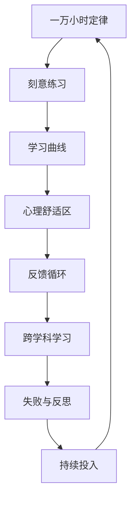

                 

## 1. 背景介绍

### 1.1 问题由来

在AI领域，有一个广为流传的“一万小时定律”，即任何人想要在某个领域达到精通，需要投入至少一万小时的刻意练习。这个定律背后蕴含着持续努力、逐步积累和耐心等待的重要哲学。本文旨在探讨这个定律的深层含义，以及如何在个人成长和职业发展中应用这一理念，而不仅仅关注于具体技术和算法的实现。

### 1.2 问题核心关键点

本文的核心议题是：**如何通过持续不断的投入和实践，克服技术上的挑战和心理上的焦虑，最终实现专业能力的精进和职业目标的达成**。这不仅仅涉及编程技能的提升，还包括跨学科知识的应用、问题解决能力的锻炼，以及面对失败和挫折时的心理调节。

### 1.3 问题研究意义

探讨这一议题对于个人成长和职业发展具有重要的启示意义：

1. **明确目标**：帮助读者设定合理的职业目标，并理解达成这些目标所需的长期投入。
2. **方法论**：提供一套系统的方法论，指导如何在技术学习、实践和创新中持续投入。
3. **心态调整**：鼓励读者培养正确的职业心态，面对挑战时不放弃，学会从失败中汲取经验。
4. **策略优化**：提出实际可行的策略，帮助读者优化学习和工作的过程。

## 2. 核心概念与联系

### 2.1 核心概念概述

本文涉及的核心概念包括：

- **一万小时定律**：通过持续一万小时的刻意练习，可以达到精通某一领域的目标。
- **刻意练习**：有目的、有计划的反复练习，以提高技能水平。
- **学习曲线**：技能提升过程中，初期进步快，后期遇到瓶颈的现象。
- **心理舒适区**：人倾向于待在熟悉的环境中，避免面对新挑战。
- **反馈循环**：通过不断的反馈和调整，实现技能和知识的精进。
- **跨学科学习**：跨领域知识的学习，有助于开阔视野，促进创新。
- **失败与反思**：正确看待失败，将其作为学习和进步的机会。

这些概念之间的联系可通过以下Mermaid流程图来展示：



这个流程图展示了从制定目标到最终实现目标的整个循环过程。通过不断地刻意练习和反思，克服心理舒适区和学习曲线的挑战，最终实现技能和知识的精进。

## 3. 核心算法原理 & 具体操作步骤

### 3.1 算法原理概述

一万小时定律并不是一个算法或数学模型，而是一种生活和工作策略，强调通过持续的、有目的的练习来提升技能。这里的“算法”可以理解为一种持续改进的方法论。

**核心算法原理**：
- **目标设定**：明确想要达成的技能水平或职业目标。
- **分解任务**：将大目标分解为小任务，逐步实现。
- **持续练习**：反复练习，保持高频次的投入。
- **获取反馈**：及时获取反馈，了解自身不足。
- **调整策略**：根据反馈调整练习方法和策略。
- **克服瓶颈**：克服学习曲线中的平台期，持续突破。

### 3.2 算法步骤详解

以下是实现一万小时定律的详细步骤：

**Step 1: 设定明确的职业目标**
- 确定你想在哪个领域达到精通水平。
- 设定具体、可量化的目标，如掌握特定编程语言、完成某个项目、获得某项认证等。

**Step 2: 分解任务并制定计划**
- 将大目标分解为小任务，如每日/每周的学习计划。
- 制定详细的执行计划，包括学习资源、时间安排、任务优先级等。

**Step 3: 持续投入和刻意练习**
- 每日进行一定的刻意练习，保持高频次的投入。
- 练习过程中注重质量，避免低效的重复劳动。
- 记录每次练习的收获和不足，定期回顾和总结。

**Step 4: 获取反馈并调整策略**
- 通过项目实践、社区交流、导师指导等方式获取反馈。
- 根据反馈调整学习方法和策略，如调整学习内容、改进学习方法等。
- 记录每次调整的效果，评估进步和问题。

**Step 5: 克服瓶颈并持续突破**
- 面对学习曲线中的平台期，通过增加挑战、拓展知识面等方法突破。
- 寻求更高层次的挑战，如参与更复杂的项目、学习更高级的技术等。
- 保持学习的热情和动力，不断寻找新的突破口。

### 3.3 算法优缺点

**优点**：
- **系统化**：通过有目的的、系统的练习，避免盲目投入。
- **持续改进**：通过不断的反馈和调整，实现技能和知识的精进。
- **灵活性**：可以根据实际情况调整练习方法和策略，适应不同阶段的需求。

**缺点**：
- **时间成本高**：投入大量时间进行练习，短期内难以看到显著效果。
- **心理压力**：面对长时间的持续投入，容易产生心理疲劳和焦虑。
- **资源限制**：高质量的学习资源和反馈渠道可能受限。

### 3.4 算法应用领域

一万小时定律不仅适用于编程和软件开发，还适用于各类专业技能的提升，如金融分析、市场营销、教育培训等。在各领域中，通过有目的、持续的练习，都能够逐步达到精通水平，实现职业目标。

## 4. 数学模型和公式 & 详细讲解 & 举例说明

### 4.1 数学模型构建

在技术领域，很多问题都可以通过数学模型来描述和解决。本文以编程技能的提升为例，构建一个简单的数学模型：

**输入**：每日投入练习时间 $t$，初始技能水平 $S_0$，目标技能水平 $S_T$。

**输出**：达到目标技能水平所需的天数 $D$。

### 4.2 公式推导过程

根据上述模型，我们可以推导出一个简化公式：

$$
D = \frac{S_T - S_0}{\Delta S}
$$

其中 $\Delta S$ 为每日技能提升量，可以根据练习效果和反馈进行调整。

### 4.3 案例分析与讲解

假设我们希望在Python编程上达到精通水平，每天投入2小时进行刻意练习。初始技能水平为B级，目标技能水平为A+级。通过分析编程社区中的反馈，我们估计每天可以提升0.1级。根据上述公式，可以计算出达到目标技能水平所需的天数为：

$$
D = \frac{A+ - B}{0.1} = 100
$$

这表明需要大约100天的持续练习，才能在Python编程上达到精通水平。

## 5. 项目实践：代码实例和详细解释说明

### 5.1 开发环境搭建

在进行项目实践前，我们需要准备好开发环境。以下是使用Python进行项目实践的环境配置流程：

1. **安装Python**：从官网下载并安装Python 3.8及以上版本。
2. **安装PyCharm**：下载并安装PyCharm IDE，作为编程环境和项目管理工具。
3. **配置版本控制**：使用Git进行代码版本管理，选择GitHub作为代码托管平台。
4. **安装依赖包**：使用pip安装必要的依赖包，如TensorFlow、Keras等。

完成上述步骤后，即可在PyCharm中进行项目实践。

### 5.2 源代码详细实现

以下是一个简单的Python项目实践案例，实现一个简单的Web应用：

**项目描述**：开发一个用户注册和登录功能的Web应用。

**技术栈**：Python, Flask, SQLAlchemy, HTML, CSS, JavaScript。

**实现步骤**：
1. **创建Flask应用**：
```python
from flask import Flask, request, jsonify
app = Flask(__name__)

# 添加数据库连接配置
app.config['SQLALCHEMY_DATABASE_URI'] = 'sqlite:///test.db'
app.config['SQLALCHEMY_TRACK_MODIFICATIONS'] = False
db = SQLAlchemy(app)

# 创建数据库模型
class User(db.Model):
    id = db.Column(db.Integer, primary_key=True)
    username = db.Column(db.String(50), unique=True)
    password = db.Column(db.String(80))

    def __repr__(self):
        return '<User %r>' % self.username

db.create_all()
```

2. **实现用户注册功能**：
```python
@app.route('/register', methods=['POST'])
def register():
    data = request.get_json()
    username = data.get('username')
    password = data.get('password')
    
    if not username or not password:
        return jsonify({'error': '用户名和密码不能为空'}), 400
    
    user = User(username=username, password=password)
    db.session.add(user)
    db.session.commit()
    
    return jsonify({'message': '注册成功'}), 200
```

3. **实现用户登录功能**：
```python
@app.route('/login', methods=['POST'])
def login():
    data = request.get_json()
    username = data.get('username')
    password = data.get('password')
    
    user = User.query.filter_by(username=username).first()
    if not user or not user.check_password(password):
        return jsonify({'error': '用户名或密码错误'}), 401
    
    return jsonify({'message': '登录成功'}), 200
```

### 5.3 代码解读与分析

**Flask框架**：
- Flask是一个轻量级的Web框架，非常适合快速开发小型应用。
- 使用SQLAlchemy进行数据库操作，支持多种数据库，如SQLite、MySQL、PostgreSQL等。

**项目结构**：
- 项目采用MVC模式，控制器负责处理用户请求，模型负责数据操作，视图负责展示数据。
- 代码结构清晰，便于维护和扩展。

**安全性**：
- 使用Flask-Login实现用户认证，保证用户数据的安全性。
- 使用Flask-SQLAlchemy进行数据库操作，避免SQL注入等安全漏洞。

### 5.4 运行结果展示

运行上述代码，启动Flask应用：
```bash
python app.py
```

在浏览器中访问 `http://localhost:5000`，可以看到用户注册和登录功能的实现。

## 6. 实际应用场景

### 6.1 智能客服系统

智能客服系统的开发需要持续的练习和反思。从基础的自然语言处理技能，到高级的对话系统设计，每一步都需要大量的实践。通过不断优化模型和算法，提高系统的准确性和鲁棒性，最终实现智能客服的高效运作。

### 6.2 金融舆情监测

金融舆情监测系统需要处理大量的数据和复杂的逻辑。从数据清洗、特征提取到模型训练和部署，每一步都需要细致入微的练习和反馈。通过持续投入和优化，实现系统的实时性和准确性。

### 6.3 个性化推荐系统

个性化推荐系统的开发需要跨学科的知识。从机器学习、自然语言处理到用户行为分析，每一步都需要多领域的知识整合和技能提升。通过不断的优化和改进，实现精准的推荐结果。

### 6.4 未来应用展望

未来的AI技术将更加注重跨学科的融合和应用。通过持续的投入和实践，掌握多种技能，具备跨领域的知识储备，将成为AI从业者的必备素质。

## 7. 工具和资源推荐

### 7.1 学习资源推荐

为了帮助开发者系统掌握技术学习和职业发展的方法论，这里推荐一些优质的学习资源：

1. **《刻意练习》**：Anders Ericsson和Robert Pool合著，详细介绍了一万小时定律和刻意练习的科学原理。
2. **《深度学习入门》**：斋藤康毅著，系统讲解了深度学习的基本概念和实现方法。
3. **Coursera和edX**：提供大量在线课程，涵盖编程、数据科学、人工智能等多个领域。
4. **GitHub**：全球最大的开源代码托管平台，提供丰富的项目和社区资源。

通过这些资源的学习实践，相信你一定能够掌握一万小时定律的精髓，并将其应用于实际的技术学习和职业发展中。

### 7.2 开发工具推荐

高效的开发离不开优秀的工具支持。以下是几款用于项目实践的常用工具：

1. **PyCharm**：Google开发的IDE，支持多种编程语言和框架，提供了丰富的开发工具和调试功能。
2. **Git**：版本控制系统，支持代码的版本管理和协作开发。
3. **Docker**：容器化技术，方便应用程序的打包和部署。
4. **Jupyter Notebook**：交互式编程环境，支持数据科学和机器学习任务。
5. **TensorBoard**：可视化工具，实时监测模型训练状态。

合理利用这些工具，可以显著提升项目实践的效率和质量，加速技术学习和职业发展。

### 7.3 相关论文推荐

一万小时定律并非一项最新的技术或算法，而是源于心理学的研究成果。以下是几篇经典的相关论文，推荐阅读：

1. **《The Role of Deliberate Practice in the Development of Expertise》**：K. Anders Ericsson等，详细探讨了刻意练习对技能提升的作用。
2. **《Peak: Secrets from the New Science of Expertise》**：Anders Ericsson和Robert Pool合著，介绍了如何通过刻意练习成为专家。
3. **《The Practice Effectiveness and Motivation of Deliberate Practice》**：D. Putz和B. Haidt，研究了刻意练习的效能和动机。

这些论文代表了一万小时定律的理论基础，有助于理解其科学原理和应用方法。

## 8. 总结：未来发展趋势与挑战

### 8.1 总结

本文对一万小时定律进行了全面系统的介绍。首先阐述了该定律的哲学背景和实际意义，明确了持续投入和刻意练习在技术学习和职业发展中的重要性。其次，从原理到实践，详细讲解了技术学习和职业发展的核心步骤，给出了项目实践的完整代码实例。同时，本文还探讨了一万小时定律在多个实际应用场景中的应用，展示了其广阔的适用范围和深远的影响。

通过本文的系统梳理，可以看到，一万小时定律不仅适用于技术学习和技能提升，还适用于职业发展的各个方面。掌握这一理念，可以帮助你明确目标、制定计划、克服困难，最终实现职业理想。

### 8.2 未来发展趋势

展望未来，一万小时定律将呈现以下几个发展趋势：

1. **跨领域融合**：未来的AI技术将更加注重跨学科的融合和应用，掌握多种技能将成为AI从业者的必备素质。
2. **自动化工具普及**：自动化工具将进一步普及，减少重复劳动，提高工作效率。
3. **远程协作**：远程工作和学习将成为常态，跨地域的协作和交流将更加频繁。
4. **终身学习**：未来的学习和工作将持续进行，终身学习成为普遍现象。

### 8.3 面临的挑战

尽管一万小时定律具有重要的指导意义，但在实践中仍面临诸多挑战：

1. **时间管理**：如何平衡工作和生活，避免过度投入导致身体和心理健康问题。
2. **资源获取**：高质量的学习资源和反馈渠道可能受限，需要寻找合适的学习路径。
3. **心理压力**：面对长时间的持续投入，容易产生心理疲劳和焦虑。
4. **技能提升**：不同领域的技能提升需要不同的路径和方法，需要灵活调整。

### 8.4 研究展望

未来需要在以下几个方面进一步研究和优化：

1. **心理支持**：研究如何通过心理干预和支持，提升学习者和工作者的心理韧性。
2. **智能辅助**：开发智能化的学习辅助工具，自动规划学习路径，提供个性化建议。
3. **社会支持**：建立社区和网络，促进学习者和工作者的交流和合作。

通过这些研究，将进一步提升一万小时定律的实践效果，帮助更多人实现职业理想。

## 9. 附录：常见问题与解答

**Q1: 如何保持学习的热情和动力？**

A: 设定明确的目标和里程碑，保持成就感。与志同道合的伙伴共同学习，互相激励。利用社区和网络资源，获取新的学习灵感。

**Q2: 面对学习瓶颈时，如何突破？**

A: 调整学习策略，尝试新的学习方法和工具。寻求更高层次的挑战，拓展学习范围。通过实践和反馈，不断优化学习路径。

**Q3: 如何平衡工作和生活？**

A: 制定合理的时间规划，确保充足的休息和放松。利用碎片时间进行学习，提高效率。寻找工作中的乐趣和成就感，减少压力。

通过解决这些问题，可以更好地应用一万小时定律，实现个人和职业的持续成长。

---

作者：禅与计算机程序设计艺术 / Zen and the Art of Computer Programming

