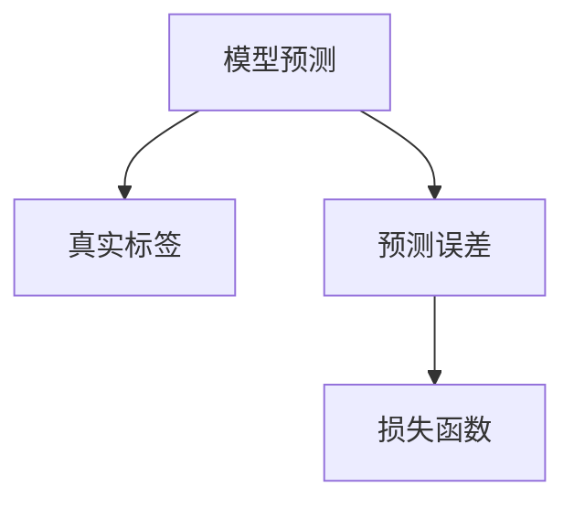

                 

# 损失函数 (Loss Function) 原理与代码实例讲解

> 关键词：损失函数,计算损失,优化算法,模型评估,梯度下降,交叉熵

## 1. 背景介绍

损失函数(Loss Function)是大数据、机器学习和深度学习领域中重要的概念，是衡量模型预测值与真实值差异的数学工具。在训练神经网络、优化模型参数时，损失函数起到至关重要的作用。好的损失函数不仅可以评估模型性能，还可以指导模型更新方向，优化模型的预测效果。本文将详细介绍损失函数的基本原理，并结合具体代码实例，讲解损失函数的实现与优化。

## 2. 核心概念与联系

### 2.1 核心概念概述

为了更好地理解损失函数，我们先简要介绍几个核心概念：

- **模型预测**：神经网络接收输入数据后，通过前向传播计算得到预测结果。模型预测通常与真实标签值不同，需要通过损失函数计算两者之间的差异。
- **真实标签**：训练数据集中每个样本的实际标签值，通常是分类或回归任务的输出。
- **预测误差**：模型预测值与真实标签值之间的差距，称为预测误差。
- **损失函数**：定义了预测误差与真实标签之间的关系，通常为一个标量值。在训练过程中，优化算法会根据损失函数的值调整模型参数，使预测误差最小化。

### 2.2 核心概念关系图

以下是损失函数相关的核心概念关系图：



这个图展示了模型预测、真实标签、预测误差和损失函数之间的关系。模型预测值与真实标签之间存在差异，即预测误差。损失函数将预测误差映射为标量值，作为优化算法的目标。

## 3. 核心算法原理 & 具体操作步骤

### 3.1 算法原理概述

损失函数是衡量模型预测误差的重要工具，其计算公式通常包含模型预测值和真实标签值。在训练过程中，优化算法会根据损失函数的变化调整模型参数，使预测误差最小化。损失函数的性质和设计对训练效果有重要影响。

#### 3.1.1 常见损失函数

常见的损失函数包括：

- **均方误差(MSE) loss**：用于回归问题，衡量预测值与真实值之间的平均差异。
- **交叉熵损失(Cross Entropy) loss**：用于分类问题，衡量模型输出的概率分布与真实标签的差异。
- **Kullback-Leibler divergence loss**：衡量两个概率分布之间的差异，常用于生成模型训练。
- **Huber loss**：结合了均方误差和绝对误差，对异常值具有鲁棒性。

### 3.2 算法步骤详解

#### 3.2.1 定义损失函数

首先，我们需要定义一个符合当前任务需求的损失函数。以下以二分类任务为例，介绍如何定义交叉熵损失函数：

```python
from torch import nn

# 定义交叉熵损失函数
criterion = nn.CrossEntropyLoss()
```

#### 3.2.2 计算损失值

在训练过程中，我们通常使用批量数据(Batch Data)计算损失值。以二分类任务为例，计算损失值的过程如下：

```python
import torch

# 假设有10个样本，每个样本有一个输入特征和对应的真实标签
inputs = torch.randn(10, 5)
labels = torch.randint(0, 2, (10, 1))

# 将标签转换为独热编码形式，方便计算交叉熵
labels_one_hot = torch.zeros(10, 2)
labels_one_hot.scatter_(1, labels, 1)

# 定义模型和损失函数
model = nn.Linear(5, 2)
criterion = nn.CrossEntropyLoss()

# 前向传播计算预测值
outputs = model(inputs)

# 计算损失值
loss = criterion(outputs, labels_one_hot)
```

#### 3.2.3 优化损失值

得到损失值后，我们可以使用优化算法调整模型参数，使损失值最小化。以随机梯度下降(SGD)算法为例，优化损失值的过程如下：

```python
# 定义优化器
optimizer = torch.optim.SGD(model.parameters(), lr=0.1)

# 反向传播计算梯度
loss.backward()

# 更新模型参数
optimizer.step()
```

### 3.3 算法优缺点

损失函数的设计和选择直接影响模型的训练效果。以下是损失函数的优缺点：

#### 3.3.1 优点

- **评估模型性能**：损失函数是衡量模型预测误差的重要工具，可以帮助评估模型性能。
- **指导参数更新**：优化算法会根据损失函数的值调整模型参数，使预测误差最小化。
- **通用性强**：损失函数的设计通常具有通用性，适用于各种深度学习模型和任务。

#### 3.3.2 缺点

- **选择需要依据**：不同任务需要选择不同的损失函数，选择不当可能影响模型性能。
- **参数设置复杂**：损失函数参数设置不当可能导致过拟合或欠拟合问题。
- **计算复杂度高**：一些复杂的损失函数计算复杂度高，影响训练速度。

### 3.4 算法应用领域

损失函数在机器学习、深度学习和自然语言处理等领域有广泛应用。

- **图像分类**：用于衡量模型输出概率分布与真实标签的差异。
- **自然语言处理**：用于衡量模型生成的文本与参考文本之间的差异。
- **推荐系统**：用于衡量模型推荐结果与用户实际行为的差异。
- **强化学习**：用于衡量模型行为与预期奖励之间的差异。

## 4. 数学模型和公式 & 详细讲解 & 举例说明

### 4.1 数学模型构建

损失函数是一个标量函数，通常定义在模型预测值和真实标签之间。其形式为：

$$
L(\mathbf{y}, \mathbf{\hat{y}}) = f(\mathbf{y}, \mathbf{\hat{y}})
$$

其中，$\mathbf{y}$ 表示真实标签，$\mathbf{\hat{y}}$ 表示模型预测值。$f$ 为损失函数的映射关系，通常是某个标量函数。

#### 4.1.1 均方误差损失函数

均方误差损失函数用于回归问题，计算公式如下：

$$
L_{MSE}(\mathbf{y}, \mathbf{\hat{y}}) = \frac{1}{2} \sum_{i=1}^{N} (\mathbf{y}_i - \mathbf{\hat{y}}_i)^2
$$

其中，$N$ 为样本数量。均方误差损失函数将预测值与真实值之间的平均差异映射为标量值。

#### 4.1.2 交叉熵损失函数

交叉熵损失函数用于分类问题，计算公式如下：

$$
L_{CE}(\mathbf{y}, \mathbf{\hat{y}}) = -\frac{1}{N} \sum_{i=1}^{N} \sum_{j=1}^{C} y_{ij} \log \hat{y}_{ij}
$$

其中，$C$ 为类别数量。交叉熵损失函数衡量模型输出的概率分布与真实标签的差异。

### 4.2 公式推导过程

以交叉熵损失函数为例，推导其公式过程如下：

假设有一个样本，真实标签为 $y$，模型预测的输出概率为 $\hat{y} = (\hat{y}_1, \hat{y}_2, ..., \hat{y}_C)$，其中 $C$ 为类别数量。根据交叉熵定义，损失函数可以表示为：

$$
L_{CE}(y, \hat{y}) = -\sum_{i=1}^{C} y_i \log \hat{y}_i
$$

将其扩展到样本集，得到：

$$
L_{CE}(y, \hat{y}) = -\frac{1}{N} \sum_{i=1}^{N} \sum_{j=1}^{C} y_{ij} \log \hat{y}_{ij}
$$

这就是交叉熵损失函数的推导过程。

### 4.3 案例分析与讲解

假设有一个二分类任务，真实标签 $y = [1, 0, 0, 1]$，模型预测的输出概率为 $\hat{y} = [0.9, 0.1, 0.0, 0.1]$。使用交叉熵损失函数计算其值：

$$
L_{CE}(y, \hat{y}) = -\frac{1}{4} \sum_{i=1}^{4} \sum_{j=1}^{2} y_{ij} \log \hat{y}_{ij} = -\frac{1}{4}(1 \times \log(0.9) + 0 \times \log(0.1) + 0 \times \log(0.0) + 1 \times \log(0.1)) = 0.181
$$

## 5. 项目实践：代码实例和详细解释说明

### 5.1 开发环境搭建

在进行损失函数代码实践前，我们需要准备好开发环境。以下是使用Python进行PyTorch开发的环境配置流程：

1. 安装Anaconda：从官网下载并安装Anaconda，用于创建独立的Python环境。

2. 创建并激活虚拟环境：
```bash
conda create -n pytorch-env python=3.8 
conda activate pytorch-env
```

3. 安装PyTorch：根据CUDA版本，从官网获取对应的安装命令。例如：
```bash
conda install pytorch torchvision torchaudio cudatoolkit=11.1 -c pytorch -c conda-forge
```

4. 安装TensorFlow：
```bash
pip install tensorflow
```

5. 安装各类工具包：
```bash
pip install numpy pandas scikit-learn matplotlib tqdm jupyter notebook ipython
```

完成上述步骤后，即可在`pytorch-env`环境中开始损失函数实践。

### 5.2 源代码详细实现

以下是一个简单的交叉熵损失函数代码实现，包含定义、计算和优化：

```python
import torch
import torch.nn as nn
import torch.optim as optim

# 定义模型和交叉熵损失函数
model = nn.Linear(5, 2)
criterion = nn.CrossEntropyLoss()

# 定义优化器
optimizer = optim.SGD(model.parameters(), lr=0.01)

# 假设有一个样本，真实标签为 0，模型预测的输出概率为 [0.1, 0.9]
inputs = torch.tensor([[0.1, 0.9]])
labels = torch.tensor([0])

# 前向传播计算预测值
outputs = model(inputs)

# 计算损失值
loss = criterion(outputs, labels)

# 反向传播计算梯度
loss.backward()

# 更新模型参数
optimizer.step()

print('Loss:', loss.item())
```

### 5.3 代码解读与分析

**定义模型和损失函数**：
- 首先，我们定义了一个线性模型和一个交叉熵损失函数。
- 交叉熵损失函数使用了PyTorch的`nn.CrossEntropyLoss`类，该类在定义时自动将标签转换为独热编码形式，方便计算交叉熵。

**计算损失值**：
- 使用前向传播计算预测值，使用交叉熵损失函数计算损失值。
- 注意，模型输入是一个二维张量，标签是一个一维张量，需要根据模型输出形状调整标签形状。

**反向传播计算梯度**：
- 使用`loss.backward()`计算梯度，自动更新模型参数。

**更新模型参数**：
- 使用`optimizer.step()`更新模型参数，完成一次优化迭代。

**输出损失值**：
- 输出损失值，用于评估模型性能。

## 6. 实际应用场景

### 6.1 图像分类

损失函数在图像分类任务中广泛应用。以ImageNet数据集为例，常用的损失函数包括均方误差损失函数和交叉熵损失函数。通过训练深度卷积神经网络，可以实现高精度的图像分类任务。

### 6.2 自然语言处理

损失函数在自然语言处理任务中也扮演重要角色。以机器翻译为例，模型需要将源语言翻译为目标语言，并使用交叉熵损失函数衡量翻译质量。通过训练基于注意力机制的神经网络，可以实现高精度的机器翻译。

### 6.3 推荐系统

损失函数在推荐系统中也有广泛应用。以协同过滤算法为例，通过计算预测值与实际行为之间的差异，可以优化推荐模型的性能。通过训练基于矩阵分解的神经网络，可以实现高效的推荐系统。

### 6.4 未来应用展望

未来，随着深度学习和机器学习的不断发展，损失函数的应用领域将更加广泛。以下列出了一些可能的应用方向：

- **无人驾驶**：用于衡量模型预测的路径与实际行驶路径的差异，优化无人驾驶系统的性能。
- **医疗诊断**：用于衡量模型预测的诊断结果与实际诊断结果的差异，优化医疗诊断系统的性能。
- **智能制造**：用于衡量模型预测的生产参数与实际生产参数的差异，优化智能制造系统的性能。
- **金融风控**：用于衡量模型预测的风险与实际风险的差异，优化金融风控系统的性能。

## 7. 工具和资源推荐

### 7.1 学习资源推荐

为了帮助开发者系统掌握损失函数的原理和应用，这里推荐一些优质的学习资源：

1. 《深度学习》（Ian Goodfellow等著）：经典教材，涵盖深度学习基础、模型训练、损失函数等多个方面，适合初学者和中级开发者。
2. Coursera《Deep Learning Specialization》课程：由Andrew Ng教授主讲，系统讲解深度学习的基本原理和实际应用，包括损失函数的使用。
3. Kaggle《Deep Learning with PyTorch》课程：由Bharath Ramsundar主讲，深入讲解PyTorch库的使用和损失函数的实现。
4. TensorFlow官方文档：详细介绍TensorFlow库的损失函数实现和优化算法，适合深入学习。

通过对这些资源的学习实践，相信你一定能够快速掌握损失函数的基本原理和实际应用。

### 7.2 开发工具推荐

高效的开发离不开优秀的工具支持。以下是几款用于损失函数开发的常用工具：

1. PyTorch：基于Python的开源深度学习框架，灵活动态的计算图，适合快速迭代研究。
2. TensorFlow：由Google主导开发的开源深度学习框架，生产部署方便，适合大规模工程应用。
3. Keras：基于Python的高层深度学习库，适合快速原型开发和实验。
4. JAX：由Google开发的自动微分库，支持高效计算和自动求导。

合理利用这些工具，可以显著提升损失函数开发的效率，加快创新迭代的步伐。

### 7.3 相关论文推荐

损失函数在大数据、机器学习和深度学习领域的发展取得了诸多突破，以下是几篇奠基性的相关论文，推荐阅读：

1. "Loss Functions for Deep Neural Networks"（Ian Goodfellow等著）：详细介绍了各种损失函数的基本原理和应用场景，适合深入学习。
2. "Understanding the difficulty of training deep feedforward neural networks"（Yoshua Bengio等著）：探讨了深度学习模型的训练难度和损失函数的选择问题，适合高级开发者。
3. "Cross-Entropy Loss for Multi-Task Learning"（Joachim Weichselbaum等著）：研究了多任务学习中的损失函数设计和优化算法，适合探索多任务学习的应用。

这些论文代表了大数据、机器学习和深度学习领域的最新研究成果，值得深入阅读和研究。

## 8. 总结：未来发展趋势与挑战

### 8.1 总结

本文详细讲解了损失函数的基本原理、常见类型和实际应用。通过对比分析，我们了解到了损失函数在深度学习模型训练中的重要性和影响。通过具体代码实现，我们掌握了损失函数的计算方法和优化策略。

通过本文的系统梳理，可以看到，损失函数是大数据、机器学习和深度学习领域的重要工具，对于模型训练和优化具有关键作用。未来，随着大数据和深度学习技术的不断发展，损失函数的应用将更加广泛和深入。

### 8.2 未来发展趋势

未来，损失函数的发展将呈现以下几个趋势：

1. **多样化选择**：随着深度学习任务的不断拓展，需要更多样化的损失函数来满足不同的需求。例如，对抗生成网络使用Wasserstein距离损失函数，生成模型使用VEM损失函数等。
2. **高效计算**：随着大规模模型的出现，损失函数的计算复杂度增加，需要更高效的计算方法和优化算法，如矩阵分解、稀疏化存储等。
3. **鲁棒性提升**：现有的损失函数对异常值和噪声敏感，需要设计更加鲁棒和稳定的损失函数，提高模型的泛化能力和鲁棒性。
4. **融合其他技术**：将损失函数与其他技术结合，如因果推断、博弈论等，提高模型的可解释性和稳定性。
5. **应用拓展**：将损失函数应用于更多领域，如自动驾驶、智能制造、金融风控等，提升各个领域的智能化水平。

### 8.3 面临的挑战

尽管损失函数在深度学习模型训练中发挥了重要作用，但仍面临诸多挑战：

1. **计算复杂度高**：一些复杂的损失函数计算复杂度高，影响训练速度。
2. **参数设置困难**：不同任务需要选择合适的损失函数，参数设置不当可能导致过拟合或欠拟合问题。
3. **泛化能力不足**：现有损失函数对异常值和噪声敏感，可能导致模型的泛化能力不足。
4. **可解释性问题**：一些复杂的损失函数缺乏可解释性，难以理解和调试。
5. **鲁棒性问题**：损失函数对异常值和噪声敏感，可能导致模型的鲁棒性不足。

### 8.4 研究展望

未来，损失函数的研究将在以下几个方面进行深入探索：

1. **高效计算方法**：研究更高效的计算方法，如矩阵分解、稀疏化存储等，提升损失函数的计算效率。
2. **鲁棒性增强**：设计更加鲁棒和稳定的损失函数，提高模型的泛化能力和鲁棒性。
3. **可解释性提升**：引入因果推断、博弈论等技术，提高损失函数的可解释性。
4. **应用拓展**：将损失函数应用于更多领域，提升各个领域的智能化水平。

## 9. 附录：常见问题与解答

**Q1：什么是损失函数？**

A: 损失函数是衡量模型预测值与真实值差异的工具，通常用于训练深度学习模型。

**Q2：常见的损失函数有哪些？**

A: 常见的损失函数包括均方误差损失函数、交叉熵损失函数、Kullback-Leibler divergence损失函数、Huber损失函数等。

**Q3：如何选择适合的损失函数？**

A: 选择合适的损失函数需要根据任务类型和数据特点进行综合考虑。例如，回归任务使用均方误差损失函数，分类任务使用交叉熵损失函数。

**Q4：如何优化损失函数？**

A: 优化损失函数需要选择合适的优化算法和参数设置。常用的优化算法包括随机梯度下降、Adam等，参数设置需要根据任务特点进行调整。

**Q5：损失函数对模型性能的影响是什么？**

A: 损失函数对模型的训练效果和预测性能有重要影响。合适的损失函数可以使模型收敛更快，预测误差更小。

---

作者：禅与计算机程序设计艺术 / Zen and the Art of Computer Programming

