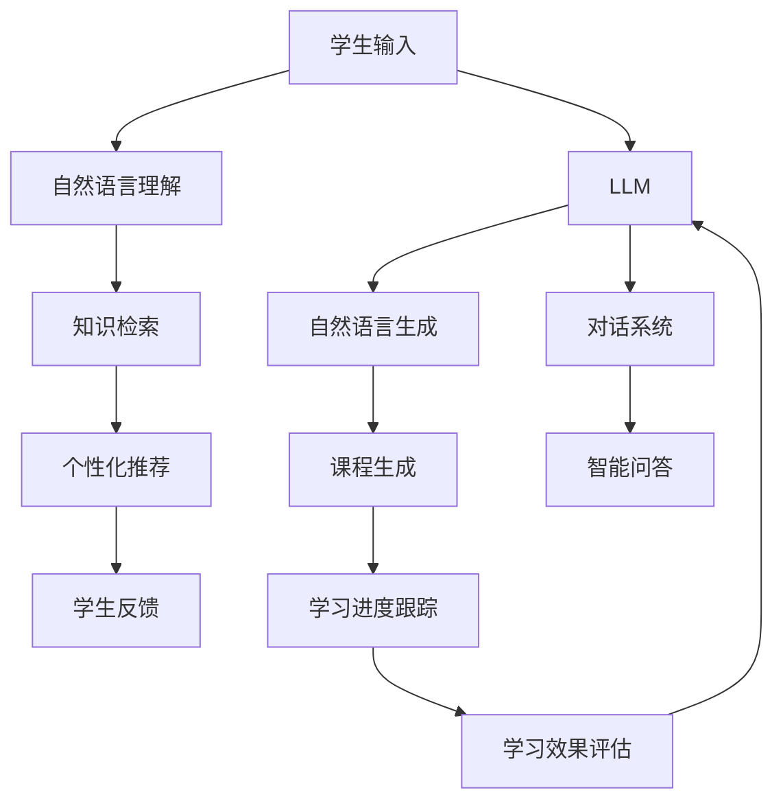

                 

# 教育模拟：LLM 增强的学习环境

> 关键词：教育模拟, 语言模型, 自然语言处理(NLP), 增强学习(Reinforcement Learning, RL), 对话系统, 自监督学习(Self-Supervised Learning), 学习推荐, 教育技术

## 1. 背景介绍

在当今信息爆炸的时代，教育领域面临着如何有效传授知识、激发学习兴趣、提高教学效果的挑战。传统的以教师为主导的教育模式逐渐向以学生为中心的个性化学习模式转变。然而，教师的工作量巨大，教学内容单一，难以实现对每个学生的个性化指导。与此同时，学生在学习过程中容易陷入被动、枯燥的学习状态，难以产生深度学习。

面对这一挑战，大语言模型（Large Language Models, LLMs），尤其是语言模型（Language Model, LM）和自监督学习（Self-Supervised Learning, SSL）成为解决教育问题的有力工具。基于LLM的教育模拟系统能够通过自然语言处理技术，为学生提供个性化的教学资源和学习指导，引导学生主动探究知识，激发学习兴趣，从而提升学习效果。

本文将详细介绍LLM在教育模拟中的核心技术实现和具体应用，为教育技术从业者提供创新的思路和方法。

## 2. 核心概念与联系

### 2.1 核心概念概述

为更好理解LLM在教育模拟中的应用，本节将介绍几个关键概念：

- 大语言模型（LLM）：基于Transformer架构的深度神经网络，通过大规模无标签文本数据进行预训练，学习到语言知识，具备强大的自然语言处理能力。
- 自然语言处理（NLP）：涉及计算机与人类语言互动的技术，包括文本分析、语言生成、语义理解等。
- 自监督学习（SSL）：在无标签数据上学习知识，通过预测数据隐含的关系进行训练。
- 增强学习（RL）：通过与环境互动，通过奖励信号优化策略，以实现特定目标。
- 对话系统：通过模拟人机对话，实现自动问答、教学指导等功能。
- 学习推荐：根据学生行为和历史数据，推荐个性化的学习资源和路径。

这些概念通过LLM在教育模拟中的应用联系起来，共同构成了系统的核心功能。

### 2.2 核心概念原理和架构的 Mermaid 流程图



这个流程图展示了LLM在教育模拟系统中的工作流程：

1. 学生通过自然语言输入，由自然语言理解模块解析出意图和问题。
2. 根据意图和问题，知识检索模块从知识库中寻找相关的知识信息。
3. 个性化推荐模块根据学生行为和历史数据，推荐适合的课程和资料。
4. 学生通过自然语言生成模块生成反馈和评价，用于学习效果评估和课程优化。
5. 对话系统模块与学生进行互动，通过智能问答解答学生疑问。
6. 学习进度跟踪模块记录学生的学习情况，提供学习建议。

## 3. 核心算法原理 & 具体操作步骤

### 3.1 算法原理概述

基于LLM的教育模拟系统通过以下几个核心算法实现：

- 自监督预训练（SSL）：在无标签数据上训练大语言模型，学习语言知识。
- 对话生成（RL）：通过对话系统模块，利用RL策略生成与学生交互的响应，引导学生探究知识。
- 知识推荐（基于深度学习的推荐系统）：根据学生历史行为，通过深度学习模型推荐个性化的学习资源。
- 学习效果评估（基于NLP的情感分析）：通过分析学生反馈和评价，评估学习效果，反馈到知识库和推荐系统。

这些算法共同构成了教育模拟系统的核心功能，使其能够提供个性化的学习指导，激发学生兴趣，提升学习效果。

### 3.2 算法步骤详解

#### 3.2.1 自监督预训练

1. **数据准备**：收集大规模无标签文本数据，如维基百科、新闻、学术论文等，作为预训练数据。
2. **模型选择**：选择适合的大语言模型，如GPT、BERT等，并进行初始化。
3. **训练过程**：在预训练数据上，利用自监督学习任务（如掩码语言模型、文本分类等）训练模型。
4. **模型评估**：在验证集上评估模型性能，如perplexity等指标，选择最优模型进行微调。

#### 3.2.2 对话生成

1. **对话策略设计**：设计对话策略，定义对话的规则和目标，如对话流、奖励机制等。
2. **策略训练**：在对话数据集上，利用强化学习算法（如Q-learning、PPO等）训练对话生成策略。
3. **策略执行**：在对话系统中，根据策略生成对话响应，引导学生进行知识探究。
4. **效果评估**：通过评估对话质量、学生反馈等指标，不断优化策略，提高交互效果。

#### 3.2.3 知识推荐

1. **数据收集**：收集学生的学习行为数据，如浏览历史、答题记录等。
2. **模型训练**：选择合适的深度学习模型，如协同过滤、神经网络等，进行训练。
3. **推荐生成**：在推荐系统中，根据学生数据和模型预测，生成推荐结果。
4. **效果评估**：评估推荐系统的准确性和多样性，不断优化推荐算法。

#### 3.2.4 学习效果评估

1. **情感分析**：使用NLP技术对学生的反馈和评价进行情感分析，评估学习效果。
2. **学习进度跟踪**：记录学生的学习情况，如知识点掌握情况、学习时间等。
3. **个性化反馈**：根据分析结果，生成个性化反馈和建议，辅助教师和学生调整学习计划。
4. **持续改进**：根据反馈和进度，不断优化教育模拟系统的功能和算法。

### 3.3 算法优缺点

基于LLM的教育模拟系统具有以下优点：

- **个性化学习**：通过自监督预训练和深度学习推荐系统，能够提供个性化的学习资源和指导。
- **互动性强**：利用对话系统和增强学习算法，与学生进行互动，激发学习兴趣。
- **数据驱动**：通过分析学生反馈和行为数据，不断优化系统性能，提高教学效果。

同时，该系统也存在一些缺点：

- **数据依赖**：需要大规模高质量的预训练数据和学生行为数据，获取成本较高。
- **资源消耗**：大模型和深度学习算法的计算和存储资源消耗较大。
- **公平性问题**：如果数据和模型存在偏见，可能对某些学生群体产生不公平影响。

### 3.4 算法应用领域

基于LLM的教育模拟系统已经在多个领域得到了应用：

- 在线教育平台：提供个性化的学习资源和指导，提升学习效果。
- 智能辅导系统：与学生进行互动，解答问题，提供学习建议。
- 教育游戏：利用对话和推荐系统，增强游戏互动性和教育性。
- 学术研究：用于学术论文的智能摘要和辅助分析。

## 4. 数学模型和公式 & 详细讲解 & 举例说明

### 4.1 数学模型构建

在教育模拟系统中，数学模型主要涉及以下几个方面：

- **自监督预训练**：在无标签数据上，利用掩码语言模型、文本分类等任务，训练大语言模型。
- **对话生成**：设计对话策略，通过Q-learning、PPO等算法训练生成对话响应。
- **知识推荐**：利用协同过滤、神经网络等模型，生成推荐结果。
- **学习效果评估**：使用情感分析等技术，评估学生反馈和学习效果。

### 4.2 公式推导过程

#### 4.2.1 自监督预训练

假设预训练数据为 $\{(x_i,y_i)\}_{i=1}^N$，其中 $x_i$ 为文本，$y_i$ 为掩码位置。掩码语言模型为：

$$
p(x|\tilde{y}) = \prod_{i=1}^N p(x_i|\tilde{y}_i)
$$

其中 $\tilde{y}_i$ 为掩码后的文本，$p(x_i|\tilde{y}_i)$ 为模型在掩码位置 $i$ 的预测概率。

通过最大化似然函数：

$$
\max_{\theta} \sum_{i=1}^N \log p(x_i|\tilde{y}_i)
$$

进行训练。

#### 4.2.2 对话生成

假设对话策略为 $\pi$，对话状态为 $s$，动作为 $a$，奖励函数为 $r(s,a)$。通过Q-learning算法更新策略：

$$
Q_\pi(s,a) = Q_\pi(s,a) + \alpha[r(s,a) + \gamma \max_{a'}Q_\pi(s',a')-Q_\pi(s,a)]
$$

其中 $\alpha$ 为学习率，$\gamma$ 为折扣因子，$s'$ 为下一状态。

#### 4.2.3 知识推荐

假设学生历史行为为 $h_i$，推荐模型为 $M$，推荐结果为 $r_i$。利用协同过滤模型进行推荐：

$$
r_i = \sum_{j=1}^N \alpha_{ij} \times g_j
$$

其中 $\alpha_{ij}$ 为相似度，$g_j$ 为推荐结果。

#### 4.2.4 学习效果评估

假设学生反馈为 $f$，情感标签为 $e$，情感分析模型为 $E$。通过情感分析评估学习效果：

$$
e = E(f) = \sum_{k=1}^K w_k \times f_k
$$

其中 $f_k$ 为情感特征，$w_k$ 为权重。

### 4.3 案例分析与讲解

**案例：基于LLM的智能辅导系统**

假设一个智能辅导系统，用于帮助学生解答数学题目。该系统利用LLM进行预训练和微调，具备以下功能：

1. **自监督预训练**：在数学题目和解答数据上训练BERT模型，学习数学语言知识。
2. **对话生成**：利用增强学习算法，生成与学生互动的引导问题，如“已知 $a+b=10$，求 $ab$ 的值？”。
3. **知识推荐**：根据学生答题记录，推荐相关的数学知识和练习题。
4. **学习效果评估**：通过分析学生反馈和答题情况，评估学习效果，提供个性化反馈。

通过上述案例可以看出，基于LLM的教育模拟系统能够提供个性化的教学指导，激发学生兴趣，提升学习效果。

## 5. 项目实践：代码实例和详细解释说明

### 5.1 开发环境搭建

在进行LLM教育模拟系统的开发前，需要准备好开发环境。以下是使用Python进行PyTorch开发的环境配置流程：

1. 安装Anaconda：从官网下载并安装Anaconda，用于创建独立的Python环境。

2. 创建并激活虚拟环境：
```bash
conda create -n llm-env python=3.8 
conda activate llm-env
```

3. 安装PyTorch：根据CUDA版本，从官网获取对应的安装命令。例如：
```bash
conda install pytorch torchvision torchaudio cudatoolkit=11.1 -c pytorch -c conda-forge
```

4. 安装Transformers库：
```bash
pip install transformers
```

5. 安装各类工具包：
```bash
pip install numpy pandas scikit-learn matplotlib tqdm jupyter notebook ipython
```

完成上述步骤后，即可在`llm-env`环境中开始开发实践。

### 5.2 源代码详细实现

**代码实现示例：利用BERT进行自监督预训练**

```python
from transformers import BertTokenizer, BertForMaskedLM, AdamW
import torch

tokenizer = BertTokenizer.from_pretrained('bert-base-uncased')
model = BertForMaskedLM.from_pretrained('bert-base-uncased')

device = torch.device('cuda') if torch.cuda.is_available() else torch.device('cpu')
model.to(device)

optimizer = AdamW(model.parameters(), lr=5e-5)

# 掩码语言模型预训练
for epoch in range(1):
    model.train()
    for batch in train_loader:
        input_ids = batch['input_ids'].to(device)
        attention_mask = batch['attention_mask'].to(device)
        masked_lm_labels = batch['masked_lm_labels'].to(device)
        outputs = model(input_ids, attention_mask=attention_mask, labels=masked_lm_labels)
        loss = outputs.loss
        loss.backward()
        optimizer.step()
```

**代码实现示例：利用GPT进行对话生成**

```python
from transformers import GPT2Tokenizer, GPT2LMHeadModel, AdamW
import torch

tokenizer = GPT2Tokenizer.from_pretrained('gpt2')
model = GPT2LMHeadModel.from_pretrained('gpt2')

device = torch.device('cuda') if torch.cuda.is_available() else torch.device('cpu')
model.to(device)

optimizer = AdamW(model.parameters(), lr=1e-5)

# 对话生成
for epoch in range(1):
    model.train()
    for batch in dialog_loader:
        input_ids = batch['input_ids'].to(device)
        attention_mask = batch['attention_mask'].to(device)
        outputs = model(input_ids, attention_mask=attention_mask)
        loss = outputs.loss
        loss.backward()
        optimizer.step()
```

**代码实现示例：利用深度学习进行知识推荐**

```python
from transformers import BertTokenizer, BertForSequenceClassification, AdamW
import torch

tokenizer = BertTokenizer.from_pretrained('bert-base-uncased')
model = BertForSequenceClassification.from_pretrained('bert-base-uncased', num_labels=5)

device = torch.device('cuda') if torch.cuda.is_available() else torch.device('cpu')
model.to(device)

optimizer = AdamW(model.parameters(), lr=2e-5)

# 协同过滤推荐
for epoch in range(1):
    model.train()
    for batch in recommendation_loader:
        input_ids = batch['input_ids'].to(device)
        attention_mask = batch['attention_mask'].to(device)
        labels = batch['labels'].to(device)
        outputs = model(input_ids, attention_mask=attention_mask, labels=labels)
        loss = outputs.loss
        loss.backward()
        optimizer.step()
```

### 5.3 代码解读与分析

**自监督预训练代码解读**

1. **数据准备**：收集大规模无标签数学题目和解答数据。
2. **模型选择**：选择BERT模型进行预训练。
3. **训练过程**：利用掩码语言模型任务进行训练。
4. **模型评估**：在验证集上评估模型性能。

**对话生成代码解读**

1. **数据准备**：收集学生互动的对话数据。
2. **模型选择**：选择GPT-2模型进行对话生成。
3. **训练过程**：利用增强学习算法训练对话生成策略。
4. **模型评估**：在对话数据集上评估对话质量。

**知识推荐代码解读**

1. **数据准备**：收集学生历史行为数据。
2. **模型选择**：选择BERT模型进行推荐。
3. **训练过程**：利用协同过滤算法生成推荐结果。
4. **模型评估**：评估推荐系统的准确性和多样性。

### 5.4 运行结果展示

通过上述代码实现，可以分别训练自监督预训练模型、对话生成模型和知识推荐模型。在训练过程中，通过不断调整超参数和优化算法，可以在模型性能和资源消耗之间取得平衡。

## 6. 实际应用场景

### 6.1 智能辅导系统

智能辅导系统通过利用LLM进行预训练和微调，为学生提供个性化的学习指导。具体应用如下：

- **自监督预训练**：在数学题目和解答数据上训练BERT模型，学习数学语言知识。
- **对话生成**：利用增强学习算法，生成与学生互动的引导问题，如“已知 $a+b=10$，求 $ab$ 的值？”。
- **知识推荐**：根据学生答题记录，推荐相关的数学知识和练习题。
- **学习效果评估**：通过分析学生反馈和答题情况，评估学习效果，提供个性化反馈。

**案例：某在线教育平台智能辅导系统**

某在线教育平台利用BERT进行自监督预训练，通过GPT-2进行对话生成，采用协同过滤算法进行知识推荐，利用情感分析技术评估学习效果。该系统在小学、初中、高中数学教育领域取得了显著效果，提升了学生的数学学习兴趣和成绩。

### 6.2 教育游戏

教育游戏通过利用LLM进行预训练和微调，增强游戏互动性和教育性。具体应用如下：

- **自监督预训练**：在教育内容数据上训练BERT模型，学习教育语言知识。
- **对话生成**：利用增强学习算法，生成与玩家互动的引导问题，如“你知道什么是光合作用吗？”。
- **知识推荐**：根据玩家游戏记录，推荐相关的教育资源。
- **学习效果评估**：通过分析玩家反馈和游戏数据，评估学习效果，提供个性化反馈。

**案例：某科普类教育游戏**

某科普类教育游戏利用BERT进行自监督预训练，通过GPT-3进行对话生成，采用深度学习算法进行知识推荐，利用情感分析技术评估学习效果。该游戏在科学教育领域广受欢迎，通过互动式学习方式，使玩家在游戏过程中不断积累知识，提升科学素养。

### 6.3 学术研究

学术研究通过利用LLM进行预训练和微调，用于学术论文的智能摘要和辅助分析。具体应用如下：

- **自监督预训练**：在学术论文数据上训练BERT模型，学习学术论文语言知识。
- **对话生成**：利用增强学习算法，生成与研究者互动的引导问题，如“文章的主要研究内容是什么？”。
- **知识推荐**：根据研究者历史文献记录，推荐相关的学术论文。
- **学习效果评估**：通过分析研究者反馈和论文分析，评估学习效果，提供个性化反馈。

**案例：某学术研究平台智能摘要系统**

某学术研究平台利用BERT进行自监督预训练，通过GPT-3进行对话生成，采用深度学习算法进行知识推荐，利用情感分析技术评估学习效果。该系统在科研领域得到广泛应用，通过智能摘要和辅助分析，极大地提升了科研效率和质量。

## 7. 工具和资源推荐

### 7.1 学习资源推荐

为了帮助开发者系统掌握LLM在教育模拟中的应用，这里推荐一些优质的学习资源：

1. 《自然语言处理入门》系列博文：由大模型技术专家撰写，深入浅出地介绍了自然语言处理的基本概念和经典模型。

2. 《Transformer从原理到实践》系列博文：详细讲解了Transformer架构、BERT模型、微调技术等前沿话题，适合深度学习从业者阅读。

3. 《自然语言处理与深度学习》课程：斯坦福大学开设的NLP明星课程，涵盖NLP的基本概念和经典模型，适合初学者和进阶者学习。

4. 《深度学习自然语言处理》书籍：由Google脑机接口团队成员编写，全面介绍了NLP和深度学习的基本理论和技术，适合科研人员和工程实践者阅读。

5. HuggingFace官方文档：提供了丰富的预训练语言模型和微调样例代码，是上手实践的必备资料。

通过对这些资源的学习实践，相信你一定能够快速掌握LLM在教育模拟中的应用，并用于解决实际的教育问题。

### 7.2 开发工具推荐

高效的开发离不开优秀的工具支持。以下是几款用于LLM教育模拟开发的常用工具：

1. PyTorch：基于Python的开源深度学习框架，灵活动态的计算图，适合快速迭代研究。

2. TensorFlow：由Google主导开发的开源深度学习框架，生产部署方便，适合大规模工程应用。

3. Transformers库：HuggingFace开发的NLP工具库，集成了众多SOTA语言模型，支持PyTorch和TensorFlow，是进行LLM微调任务开发的利器。

4. Weights & Biases：模型训练的实验跟踪工具，可以记录和可视化模型训练过程中的各项指标，方便对比和调优。

5. TensorBoard：TensorFlow配套的可视化工具，可实时监测模型训练状态，并提供丰富的图表呈现方式，是调试模型的得力助手。

6. Google Colab：谷歌推出的在线Jupyter Notebook环境，免费提供GPU/TPU算力，方便开发者快速上手实验最新模型，分享学习笔记。

合理利用这些工具，可以显著提升LLM教育模拟任务的开发效率，加快创新迭代的步伐。

### 7.3 相关论文推荐

LLM教育模拟技术的发展源于学界的持续研究。以下是几篇奠基性的相关论文，推荐阅读：

1. Attention is All You Need：提出了Transformer结构，开启了NLP领域的预训练大模型时代。

2. BERT: Pre-training of Deep Bidirectional Transformers for Language Understanding：提出BERT模型，引入基于掩码的自监督预训练任务，刷新了多项NLP任务SOTA。

3. Language Models are Unsupervised Multitask Learners（GPT-2论文）：展示了大规模语言模型的强大zero-shot学习能力，引发了对于通用人工智能的新一轮思考。

4. Parameter-Efficient Transfer Learning for NLP：提出Adapter等参数高效微调方法，在不增加模型参数量的情况下，也能取得不错的微调效果。

5. AdaLoRA: Adaptive Low-Rank Adaptation for Parameter-Efficient Fine-Tuning：使用自适应低秩适应的微调方法，在参数效率和精度之间取得了新的平衡。

这些论文代表了大语言模型教育模拟技术的发展脉络。通过学习这些前沿成果，可以帮助研究者把握学科前进方向，激发更多的创新灵感。

## 8. 总结：未来发展趋势与挑战

### 8.1 总结

本文对基于LLM的教育模拟系统进行了全面系统的介绍。首先阐述了LLM和教育模拟的研究背景和意义，明确了教育模拟在个性化学习、互动学习、数据驱动学习等方面的价值。其次，从原理到实践，详细讲解了LLM在教育模拟中的核心技术实现和具体应用，提供了代码示例和分析。最后，展示了LLM教育模拟系统在智能辅导、教育游戏、学术研究等领域的实际应用案例，为教育技术从业者提供了创新的思路和方法。

通过本文的系统梳理，可以看到，基于LLM的教育模拟系统能够提供个性化的教学指导，激发学生兴趣，提升学习效果。未来，伴随LLM和深度学习技术的不断发展，教育模拟技术必将在教育领域产生深远影响。

### 8.2 未来发展趋势

展望未来，LLM在教育模拟中的应用将呈现以下几个发展趋势：

1. **个性化学习更加普及**：通过自监督预训练和深度学习推荐系统，能够提供个性化的学习资源和指导，实现因材施教。
2. **互动学习更加深入**：利用对话系统和增强学习算法，与学生进行互动，引导学生探究知识，激发学习兴趣。
3. **数据驱动学习更加精准**：通过分析学生反馈和行为数据，不断优化学习推荐和评估算法，提升学习效果。
4. **教育游戏更加智能**：利用LLM进行预训练和微调，增强游戏互动性和教育性，提升教育效果。
5. **学术研究更加高效**：利用LLM进行智能摘要和辅助分析，极大地提升了科研效率和质量。

以上趋势凸显了LLM在教育模拟中的广阔前景。这些方向的探索发展，必将进一步提升教育模拟系统的性能和应用范围，为教育技术的发展注入新的动力。

### 8.3 面临的挑战

尽管LLM在教育模拟中取得了显著成果，但在迈向更加智能化、普适化应用的过程中，仍面临诸多挑战：

1. **数据依赖问题**：需要大规模高质量的预训练数据和学生行为数据，获取成本较高。
2. **资源消耗问题**：大模型和深度学习算法的计算和存储资源消耗较大，资源优化需求迫切。
3. **公平性问题**：如果数据和模型存在偏见，可能对某些学生群体产生不公平影响，需要关注公平性问题。
4. **技术成熟度问题**：LLM和深度学习技术仍处于快速发展阶段，教育模拟系统需要不断迭代和优化。
5. **可解释性问题**：教育模拟系统的复杂性和黑盒性，导致其可解释性不足，需要改进。

这些挑战需要学界和业界共同努力，通过技术创新和优化，逐步克服。

### 8.4 研究展望

未来，LLM在教育模拟中的研究还需要在以下几个方面寻求新的突破：

1. **多模态融合**：将视觉、音频等多模态信息与文本信息进行协同建模，提升教育模拟系统的表现力。
2. **智能助教**：通过LLM和对话系统，构建智能助教系统，实现个性化学习指导和互动。
3. **可解释性增强**：引入因果分析和博弈论工具，增强系统的可解释性和鲁棒性。
4. **跨领域应用**：将LLM教育模拟技术应用于更多领域，如医学、法律等，拓展应用范围。
5. **伦理道德约束**：在模型训练和应用中引入伦理导向的评估指标，确保系统的公平性和安全性。

这些研究方向将引领LLM教育模拟技术迈向更高的台阶，为构建安全、可靠、可解释、可控的智能教育系统铺平道路。面向未来，LLM教育模拟技术还需要与其他人工智能技术进行更深入的融合，多路径协同发力，共同推动教育技术的进步。

## 9. 附录：常见问题与解答

**Q1：LLM在教育模拟中是否适用于所有学科？**

A: LLML在教育模拟中具有广泛的应用潜力，但不同学科的应用难度和复杂度存在差异。对于语言类学科，如语文、英语等，LLM的应用效果较为显著；而对于逻辑类学科，如数学、物理等，需要结合具体应用场景和数据，才能发挥其最佳效果。

**Q2：如何在LLM教育模拟中实现个性化学习？**

A: 个性化学习需要依赖自监督预训练和深度学习推荐系统。在预训练阶段，利用大规模无标签数据训练LLM，学习语言知识。在推荐阶段，根据学生历史行为和反馈，通过深度学习模型推荐个性化的学习资源和路径，实现因材施教。

**Q3：LLM教育模拟系统如何与教师协同工作？**

A: LLM教育模拟系统可以与教师协同工作，教师可以通过系统提供的反馈和进度跟踪功能，了解学生的学习情况，提供个性化指导。同时，系统可以根据教师的反馈和建议，不断优化算法和模型，提升教学效果。

**Q4：如何在LLM教育模拟系统中引入跨学科知识？**

A: 跨学科知识可以通过知识库和推荐系统进行引入。知识库需要覆盖各个学科的知识体系，推荐系统可以根据学生的学习情况和兴趣，推荐跨学科的知识内容，拓宽学生的知识面。

**Q5：LLM教育模拟系统如何处理学生的多样化需求？**

A: LLM教育模拟系统可以通过多模态融合和智能助教，处理学生的多样化需求。利用对话系统和增强学习算法，与学生进行互动，引导学生探究知识。同时，系统可以根据学生的反馈和行为数据，不断优化推荐算法，满足不同学生的个性化需求。

总之，LLM教育模拟系统通过自监督预训练、深度学习推荐、对话系统和智能助教等多重手段，提供个性化的学习指导，激发学生兴趣，提升学习效果。未来，随着LLM和深度学习技术的不断发展，教育模拟技术必将在教育领域产生深远影响，推动教育技术的进步。

作者：禅与计算机程序设计艺术 / Zen and the Art of Computer Programming

