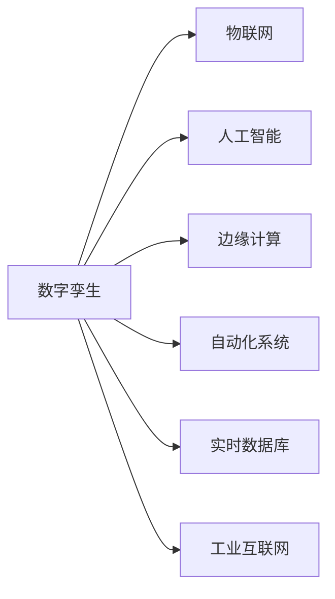

                 

# 数字与物理实体的自动化革命

## 1. 背景介绍

### 1.1 问题由来

随着物联网（IoT）、人工智能（AI）、云计算等技术的迅速发展，数字化和自动化已经成为各行各业的重要趋势。在制造业、物流、交通、医疗等领域，通过将物理实体与数字世界紧密结合，可以实现更高效的生产、管理、服务，大幅提升资源利用率和生产力。

然而，传统的信息系统往往难以整合来自不同设备和系统的数据，无法形成统一的、实时性的决策依据。同时，物理实体与数字世界的交互方式也相对单一，难以实现复杂的协同工作和自动控制。如何构建一个更加灵活、高效、智能的数字与物理实体协同系统，成为了当前智能化的关键难题。

### 1.2 问题核心关键点

本节将重点介绍如何将数字与物理实体有效整合，实现全生命周期的自动化与智能化。

1. **系统架构设计**：设计一个涵盖物理实体和数字世界的集成系统，使得系统能够感知、控制、优化物理实体。

2. **数据融合与处理**：集成来自传感器、设备、监控等不同来源的数据，实现数据的高效融合与处理，供系统进行决策和控制。

3. **实时决策与控制**：构建实时性强的决策与控制系统，根据实时数据动态调整生产、管理、服务流程。

4. **人机交互设计**：设计直观、友好的用户界面，使得人机协同更加自然高效。

5. **安全性与隐私保护**：确保系统安全可靠，保护数据隐私。

6. **持续改进与优化**：采用机器学习等技术，持续改进系统性能，适应业务需求变化。

## 2. 核心概念与联系

### 2.1 核心概念概述

为了深入理解数字与物理实体的自动化革命，本节将介绍几个关键概念及其之间的联系：

1. **数字孪生（Digital Twin）**：虚拟的、实时更新的物理实体的数字化模型，用于模拟、预测和优化物理实体的行为。

2. **物联网（IoT）**：通过传感器、智能设备等，实现物理实体与网络的互联，形成数据交互的生态系统。

3. **人工智能（AI）**：通过机器学习、深度学习等技术，实现对数据的智能处理与决策，提升系统智能化水平。

4. **边缘计算（Edge Computing）**：在物理实体的现场或网络边缘进行数据处理，减少数据传输延时，提升实时性。

5. **自动化系统（Automation System）**：通过预设的规则和逻辑，实现物理实体的自动化控制与管理。

6. **实时数据库（Real-time Database）**：用于实时存储、查询和管理大量数据，供系统进行快速决策。

7. **工业互联网（Industrial Internet）**：连接工业设备、企业、生态系统，形成集成的工业生态。

这些核心概念通过数字化技术、网络通信技术、自动化技术等紧密相连，共同构成了数字与物理实体协同系统的基础。

### 2.2 核心概念原理和架构的 Mermaid 流程图



该图展示了数字孪生与其他核心概念之间的关系，其通过物联网获取物理实体的实时数据，由人工智能进行处理和分析，并通过边缘计算实现快速决策和控制，再结合自动化系统和实时数据库，形成完整的数字化和自动化系统架构。

## 3. 核心算法原理 & 具体操作步骤

### 3.1 算法原理概述

本节将详细讲解数字与物理实体自动化革命的核心算法原理。

1. **数据融合算法**：用于将来自不同来源的数据进行高效融合和处理。常用的算法包括卡尔曼滤波、粒子滤波、深度学习等。

2. **预测算法**：利用历史数据和机器学习模型，对物理实体未来的行为进行预测。常用的算法包括ARIMA、LSTM、GRU等。

3. **决策与控制算法**：根据预测结果和实时数据，制定决策并控制物理实体。常用的算法包括PID控制、模型预测控制、强化学习等。

4. **优化算法**：对生产、管理、服务流程进行持续优化。常用的算法包括遗传算法、蚁群算法、多目标优化等。

5. **仿真算法**：通过仿真技术，对数字孪生模型进行验证和优化。常用的算法包括蒙特卡洛模拟、分布式模拟等。

### 3.2 算法步骤详解

1. **数据采集与预处理**：通过传感器、设备等，采集物理实体的实时数据，并进行清洗、去噪、归一化等预处理。

2. **特征提取与建模**：从原始数据中提取有用的特征，利用机器学习模型建立数字孪生模型，用于预测和优化。

3. **预测与决策**：利用历史数据和数字孪生模型，对物理实体的行为进行预测，并根据预测结果制定决策。

4. **控制与优化**：根据决策结果，通过自动化系统控制物理实体，并结合优化算法不断优化系统性能。

5. **仿真与验证**：通过仿真技术，对数字孪生模型进行验证和优化，确保模型准确性。

### 3.3 算法优缺点

数字与物理实体自动化革命的算法具有以下优点：

1. **高效性**：通过实时数据处理和预测，实现高效的生产、管理、服务。

2. **准确性**：利用机器学习和仿真技术，提高预测和决策的准确性。

3. **灵活性**：通过灵活的算法设计，适应不同的业务场景和需求。

4. **可扩展性**：能够快速集成新的设备和数据源，适应业务变化。

5. **可视化与交互性**：通过可视化技术，实现人机协同，提升用户体验。

同时，该算法也存在以下缺点：

1. **数据质量依赖**：算法的准确性和效果依赖于高质量、实时性的数据。

2. **计算资源需求高**：实现高效的预测和决策，需要强大的计算资源支持。

3. **复杂性高**：算法设计和实现较为复杂，需要跨学科知识。

4. **安全与隐私风险**：数据融合和处理过程中，存在隐私泄露和安全性问题。

5. **模型过拟合风险**：机器学习模型可能过拟合，影响泛化能力。

### 3.4 算法应用领域

数字与物理实体自动化革命的算法广泛应用于多个领域，具体包括：

1. **智能制造**：通过数字孪生和物联网，实现智能生产线的监控和优化，提高生产效率和质量。

2. **智慧物流**：利用物联网和人工智能，优化物流供应链管理，实现智能仓储和运输。

3. **智能交通**：通过传感器和边缘计算，实现交通流量的实时监控和调度，提高交通效率。

4. **智慧医疗**：利用数字孪生和人工智能，实现患者数据的实时监控和诊断，提高医疗服务质量。

5. **智能城市**：通过物联网和人工智能，实现城市管理的智能化，提升公共服务水平。

6. **智能农业**：利用传感器和人工智能，实现农业生产的精准管理和优化，提高资源利用率。

## 4. 数学模型和公式 & 详细讲解 & 举例说明

### 4.1 数学模型构建

本节将构建数字与物理实体自动化革命的数学模型，并详细讲解其构建过程。

设物理实体的状态为 $\mathbf{x}_t$，历史状态序列为 $\{\mathbf{x}_1, \mathbf{x}_2, \cdots, \mathbf{x}_t\}$，控制量为 $\mathbf{u}_t$，未来状态预测为 $\mathbf{\hat{x}}_{t+1}$，误差为 $\mathbf{e}_t$，则数学模型可表示为：

$$
\mathbf{\hat{x}}_{t+1} = f(\mathbf{x}_t, \mathbf{u}_t, \mathbf{e}_t) \\
\mathbf{e}_t = \mathbf{x}_{t+1} - \mathbf{\hat{x}}_{t+1}
$$

其中 $f$ 为状态转移函数，$u_t$ 为控制量。

### 4.2 公式推导过程

对上述模型进行推导，得到状态预测误差方差的递推公式：

$$
P_{t+1} = F_t P_t F_t^T + Q_t + G_t P_t H_t^T (R + H_t P_t H_t^T)^{-1} (R + H_t P_t H_t^T)^{-1} H_t P_t G_t^T
$$

其中 $F_t$ 为状态转移矩阵，$Q_t$ 为过程噪声方差矩阵，$G_t$ 为控制增益矩阵，$H_t$ 为观测矩阵，$R$ 为观测噪声方差矩阵。

通过卡尔曼滤波算法，可以实时更新预测状态，得到最优的状态估计 $\mathbf{\hat{x}}_t$ 和预测误差协方差 $P_t$。

### 4.3 案例分析与讲解

以智能制造为例，利用数字孪生和物联网实现智能生产线的优化。

1. **数据采集**：通过传感器采集生产线的实时数据，包括设备状态、生产速度、温度、压力等。

2. **数据融合**：对采集到的数据进行预处理，融合来自不同设备的数据，得到完整的生产线状态。

3. **状态预测**：利用卡尔曼滤波算法，对生产线未来的状态进行预测，包括设备故障、生产速度波动等。

4. **决策与控制**：根据预测结果，制定相应的控制策略，如调整设备参数、更换故障设备等。

5. **仿真验证**：通过数字孪生模型，对控制策略进行仿真验证，确保其有效性和安全性。

## 5. 项目实践：代码实例和详细解释说明

### 5.1 开发环境搭建

在项目实践前，需要搭建好开发环境。以下是基于Python和OpenCV的开发环境搭建流程：

1. 安装Anaconda：从官网下载并安装Anaconda，用于创建独立的Python环境。

2. 创建并激活虚拟环境：
```bash
conda create -n automotive-env python=3.8 
conda activate automotive-env
```

3. 安装必要的Python库：
```bash
pip install numpy scipy pandas scikit-learn matplotlib seaborn scikit-image openpyxl pydot
```

4. 安装OpenCV：
```bash
pip install opencv-python-headless
```

5. 安装Git和GitHub：
```bash
sudo apt-get install git
```

### 5.2 源代码详细实现

下面以智能交通系统为例，给出代码实现。

```python
import cv2
import numpy as np
import os

def process_frame(frame):
    # 对视频帧进行处理，提取关键特征
    gray = cv2.cvtColor(frame, cv2.COLOR_BGR2GRAY)
    edges = cv2.Canny(gray, 100, 200)
    lines = cv2.HoughLines(edges, 1, np.pi/180, 200)
    return lines

def detect_vehicles(frame, lines):
    # 检测车辆位置和速度
    vehicles = []
    for line in lines:
        x1, y1, x2, y2 = line[0]
        slope = (y2 - y1) / (x2 - x1)
        angle = np.arctan(slope)
        if angle > np.pi/2:
            angle = np.pi - angle
        if angle < np.pi/4 or angle > 3*np.pi/4:
            continue
        x0 = 0
        y0 = int(1 / tan(angle))
        x1 = frame.shape[1]
        y1 = frame.shape[0]
        vehicle = {'x0': x0, 'y0': y0, 'x1': x1, 'y1': y1}
        vehicles.append(vehicle)
    return vehicles

def get_vehicle_speed(vehicles):
    # 计算车辆速度
    speed = []
    for vehicle in vehicles:
        dx = vehicle['x1'] - vehicle['x0']
        dy = vehicle['y1'] - vehicle['y0']
        speed.append(np.hypot(dx, dy))
    return speed

def main():
    cap = cv2.VideoCapture(0)
    while True:
        ret, frame = cap.read()
        if not ret:
            break
        lines = process_frame(frame)
        vehicles = detect_vehicles(frame, lines)
        speed = get_vehicle_speed(vehicles)
        print('Vehicles:', len(vehicles), 'Speed:', speed)
        cv2.imshow('frame', frame)
        if cv2.waitKey(1) & 0xFF == ord('q'):
            break
    cap.release()
    cv2.destroyAllWindows()

if __name__ == "__main__":
    main()
```

### 5.3 代码解读与分析

本段代码实现了基于OpenCV的智能交通系统，主要功能包括视频帧处理、车辆检测和速度计算。

1. `process_frame`函数：对视频帧进行处理，提取关键特征，包括边缘检测和车道线检测。

2. `detect_vehicles`函数：检测视频帧中的车辆位置和速度，通过计算车辆的角度和坐标，判断其是否在指定车道内，并计算其速度。

3. `get_vehicle_speed`函数：计算所有检测到的车辆的速度。

4. `main`函数：实时读取摄像头视频帧，处理和分析，并输出车辆数量和速度。

## 6. 实际应用场景

### 6.1 智能制造

数字孪生和物联网在智能制造中的应用非常广泛。通过数字孪生技术，可以对生产线的状态进行实时监控和预测，从而优化生产流程。例如，利用数字孪生和物联网实现智能仓储和物流管理，可以大幅提升仓储效率和库存管理水平。

### 6.2 智慧物流

物联网技术可以实现对物流供应链的实时监控和管理，利用人工智能和机器学习算法，可以优化物流路径和仓储管理，实现更高效、更经济的物流服务。例如，通过智能仓储系统，可以实现对仓库货物的实时管理，减少库存积压和损耗。

### 6.3 智能交通

通过传感器和边缘计算，可以实现对交通流量的实时监控和调度，提高交通效率和安全性。例如，利用智能交通系统，可以实现对交通信号灯的智能控制，减少交通拥堵和事故发生。

### 6.4 未来应用展望

未来，数字与物理实体自动化革命将进一步深化，以下是一些未来应用展望：

1. **自动化生产线的全面智能化**：利用数字孪生和物联网技术，实现生产线的全面智能化，包括设备状态监控、生产流程优化、故障预测与维护等。

2. **智能城市的全面覆盖**：通过物联网和人工智能，实现智能城市的全面覆盖，包括智能交通、智能安防、智能能源管理等。

3. **跨领域应用的多样化**：数字与物理实体自动化革命不仅应用于制造业、物流、交通等领域，还将拓展到医疗、农业、教育等行业，提升整体智能化水平。

4. **自动化系统的自适应性**：未来的自动化系统将具备更高的自适应性，能够根据业务需求的变化进行动态调整和优化。

5. **人机协同的智能化**：通过自然语言处理和增强现实技术，实现更加智能和自然的人机协同，提升用户体验。

6. **数据融合与处理的智能化**：通过数据融合和处理的智能化，实现更高效的数据采集、处理和分析，提升系统决策的准确性和效率。

7. **安全与隐私的保护**：未来的系统将更加注重数据安全和隐私保护，通过加密技术、访问控制等措施，确保系统安全可靠。

## 7. 工具和资源推荐

### 7.1 学习资源推荐

为了帮助开发者系统掌握数字与物理实体自动化革命的理论基础和实践技巧，这里推荐一些优质的学习资源：

1. 《物联网与智能制造》系列书籍：深入讲解物联网和智能制造的理论基础和实践技巧。

2. 《深度学习与计算机视觉》课程：斯坦福大学开设的深度学习与计算机视觉课程，涵盖深度学习的基本概念和实际应用。

3. 《人工智能与机器人》系列书籍：介绍人工智能和机器人技术的理论基础和实际应用，涵盖传感器、控制、仿真等内容。

4. 《自动驾驶技术》系列书籍：讲解自动驾驶技术的理论基础和实际应用，涵盖感知、决策、控制等内容。

5. 《机器人学基础》书籍：介绍机器人技术的理论基础和实际应用，涵盖机器人设计、控制、仿真等内容。

6. 《机器学习实战》书籍：详细介绍机器学习算法的实现方法和应用技巧，涵盖数据预处理、模型训练、模型评估等内容。

7. 《计算机视觉实战》书籍：讲解计算机视觉技术的理论基础和实际应用，涵盖图像处理、特征提取、目标检测等内容。

8. 《强化学习基础》书籍：介绍强化学习算法的理论基础和实际应用，涵盖策略学习、值函数、蒙特卡洛模拟等内容。

### 7.2 开发工具推荐

高效的开发离不开优秀的工具支持。以下是几款用于数字与物理实体自动化革命开发的常用工具：

1. ROS（Robot Operating System）：开源的机器人操作系统，支持多种传感器和控制器，适用于机器人开发。

2. OpenCV：开源的计算机视觉库，支持图像处理、特征提取、目标检测等。

3. TensorFlow：由Google主导开发的深度学习框架，适用于大规模深度学习模型的开发。

4. PyTorch：由Facebook主导开发的深度学习框架，适用于快速迭代的研究。

5. Python：通用的编程语言，支持跨平台开发和运行。

6. GitHub：开源代码托管平台，支持团队协作和代码管理。

7. Git：版本控制系统，支持代码的版本控制和协作开发。

8. VSCode：跨平台的IDE，支持多种编程语言和开发工具。

9. Jetson Nano：NVIDIA推出的嵌入式开发板，支持深度学习、计算机视觉等应用。

### 7.3 相关论文推荐

数字与物理实体自动化革命的研究源于学界的持续研究。以下是几篇奠基性的相关论文，推荐阅读：

1. "Digital Twins for Industry" by François Charpillon：介绍了数字孪生技术在制造业中的应用，涵盖了数字孪生的建模、仿真、优化等内容。

2. "IoT-based Smart Manufacturing System Design and Implementation" by Eunice H. Y. Chung：介绍了物联网技术在智能制造中的应用，涵盖了传感器、设备、数据融合等内容。

3. "AI in Intelligent Transportation System: A Review" by A. Gupta et al.：介绍了人工智能技术在智能交通系统中的应用，涵盖了计算机视觉、深度学习、决策控制等内容。

4. "Automated Manufacturing Systems: A Survey" by Muhammad A. Hussain：介绍了自动化系统在制造中的应用，涵盖了传感器、控制、仿真等内容。

5. "Reinforcement Learning for Industrial Control Systems" by Venkatakrishnan Balasamy：介绍了强化学习在工业控制中的应用，涵盖了决策控制、优化等内容。

6. "The Internet of Things: A Survey" by El-Hedy A. El-Khouly et al.：介绍了物联网技术的研究进展和应用前景，涵盖了传感器、设备、数据融合等内容。

7. "Industrial Internet of Things: Concepts, Methodologies, and Security" by Dr. Hisham M. Zahran：介绍了工业互联网技术的研究进展和应用前景，涵盖了云计算、数据融合、安全性等内容。

这些论文代表了大语言模型微调技术的发展脉络。通过学习这些前沿成果，可以帮助研究者把握学科前进方向，激发更多的创新灵感。

## 8. 总结：未来发展趋势与挑战

### 8.1 总结

本文对数字与物理实体自动化革命进行了全面系统的介绍。首先阐述了数字与物理实体自动化革命的研究背景和意义，明确了数字孪生、物联网、人工智能等关键技术在其中的作用。其次，从原理到实践，详细讲解了数字与物理实体自动化革命的核心算法原理和操作步骤，给出了数字孪生和物联网的代码实现示例。同时，本文还广泛探讨了数字与物理实体自动化革命在智能制造、智慧物流、智能交通等多个行业领域的应用前景，展示了其广阔的潜力。此外，本文精选了数字与物理实体自动化革命的学习资源、开发工具和相关论文，力求为读者提供全方位的技术指引。

通过本文的系统梳理，可以看到，数字与物理实体自动化革命正在成为智能化的重要驱动力，极大地提升了物理实体的智能化水平，推动了制造业、物流、交通、医疗等多个行业的数字化转型。未来，随着技术的不断进步，数字与物理实体自动化革命将进一步深化，实现更加全面、智能、安全的数字与物理实体协同系统。

### 8.2 未来发展趋势

展望未来，数字与物理实体自动化革命将呈现以下几个发展趋势：

1. **全面智能化**：通过数字孪生和物联网技术，实现全生命周期的智能化，包括设备状态监控、生产流程优化、故障预测与维护等。

2. **边缘计算的普及**：通过边缘计算技术，实现实时数据的本地处理和决策，提升系统的实时性和可靠性。

3. **数据融合与处理的智能化**：通过数据融合和处理的智能化，实现更高效的数据采集、处理和分析，提升系统决策的准确性和效率。

4. **自适应性与自学习性**：未来的系统将具备更高的自适应性，能够根据业务需求的变化进行动态调整和优化。

5. **跨领域应用的拓展**：数字与物理实体自动化革命不仅应用于制造业、物流、交通等领域，还将拓展到医疗、农业、教育等行业，提升整体智能化水平。

6. **人机协同的智能化**：通过自然语言处理和增强现实技术，实现更加智能和自然的人机协同，提升用户体验。

7. **安全性与隐私保护**：未来的系统将更加注重数据安全和隐私保护，通过加密技术、访问控制等措施，确保系统安全可靠。

8. **模拟与仿真的智能化**：通过模拟与仿真技术的智能化，实现更准确的系统验证和优化，提升系统的稳定性和可靠性。

9. **融合多模态数据**：未来的系统将更加注重融合多模态数据，包括视觉、听觉、触觉等，提升系统的感知能力和决策能力。

### 8.3 面临的挑战

尽管数字与物理实体自动化革命已经取得了瞩目成就，但在迈向更加智能化、普适化应用的过程中，它仍面临着诸多挑战：

1. **数据质量与多样性**：数据的质量和多样性直接影响系统的决策效果。如何获取高质量、多模态的数据，是当前亟需解决的问题。

2. **计算资源与效率**：实现高效的预测和决策，需要强大的计算资源支持。如何提高系统的计算效率，降低计算成本，是当前亟需解决的问题。

3. **模型复杂性与可解释性**：现有的数字与物理实体自动化革命算法较为复杂，难以解释其内部工作机制。如何提高模型的可解释性，是当前亟需解决的问题。

4. **安全与隐私风险**：数据融合和处理过程中，存在隐私泄露和安全性问题。如何确保系统的安全可靠，是当前亟需解决的问题。

5. **模型过拟合风险**：机器学习模型可能过拟合，影响泛化能力。如何提高模型的泛化能力，是当前亟需解决的问题。

6. **跨领域应用的泛化能力**：不同领域的业务需求和数据特征差异较大，如何实现跨领域的泛化，是当前亟需解决的问题。

### 8.4 研究展望

未来的研究需要在以下几个方面寻求新的突破：

1. **跨领域应用的泛化**：开发更加通用的数字与物理实体自动化革命算法，能够适应不同领域的业务需求和数据特征。

2. **数据融合与处理的优化**：开发更加高效的数据融合和处理算法，提高数据的质量和多样性，提升系统的决策效果。

3. **模型复杂性与可解释性的改进**：开发更加简单、可解释的模型，提高模型的泛化能力和用户信任度。

4. **安全性与隐私保护的加强**：开发更加安全的算法和系统，确保数据的安全可靠，避免隐私泄露。

5. **计算资源的优化**：开发更加高效的计算算法，提高系统的计算效率，降低计算成本。

6. **跨领域应用的泛化**：开发更加通用的数字与物理实体自动化革命算法，能够适应不同领域的业务需求和数据特征。

7. **模型复杂性与可解释性的改进**：开发更加简单、可解释的模型，提高模型的泛化能力和用户信任度。

8. **安全性与隐私保护的加强**：开发更加安全的算法和系统，确保数据的安全可靠，避免隐私泄露。

9. **跨领域应用的泛化**：开发更加通用的数字与物理实体自动化革命算法，能够适应不同领域的业务需求和数据特征。

10. **模型复杂性与可解释性的改进**：开发更加简单、可解释的模型，提高模型的泛化能力和用户信任度。

11. **安全性与隐私保护的加强**：开发更加安全的算法和系统，确保数据的安全可靠，避免隐私泄露。

12. **计算资源的优化**：开发更加高效的计算算法，提高系统的计算效率，降低计算成本。

这些研究方向的探索，必将引领数字与物理实体自动化革命技术迈向更高的台阶，为构建安全、可靠、可解释、可控的智能系统铺平道路。面向未来，数字与物理实体自动化革命还需要与其他人工智能技术进行更深入的融合，如知识表示、因果推理、强化学习等，多路径协同发力，共同推动自然语言理解和智能交互系统的进步。只有勇于创新、敢于突破，才能不断拓展数字与物理实体自动化革命的边界，让智能技术更好地造福人类社会。

## 9. 附录：常见问题与解答

**Q1: 数字与物理实体自动化革命的核心概念是什么？**

A: 数字与物理实体自动化革命的核心概念主要包括数字孪生、物联网、人工智能、边缘计算、自动化系统、实时数据库和工业互联网等。这些概念通过数字化技术、网络通信技术、自动化技术等紧密相连，共同构成了数字与物理实体协同系统的基础。

**Q2: 数字与物理实体自动化革命的算法具有哪些优点？**

A: 数字与物理实体自动化革命的算法具有高效性、准确性、灵活性、可扩展性、可视化与交互性等优点。通过实时数据处理和预测，实现高效的生产、管理、服务。利用机器学习和仿真技术，提高预测和决策的准确性。通过灵活的算法设计，适应不同的业务场景和需求。能够快速集成新的设备和数据源，适应业务变化。通过可视化技术，实现人机协同，提升用户体验。

**Q3: 数字与物理实体自动化革命的算法面临哪些挑战？**

A: 数字与物理实体自动化革命的算法面临数据质量与多样性、计算资源与效率、模型复杂性与可解释性、安全与隐私风险、模型过拟合风险等挑战。如何获取高质量、多模态的数据，是当前亟需解决的问题。如何提高系统的计算效率，降低计算成本，是当前亟需解决的问题。现有的数字与物理实体自动化革命算法较为复杂，难以解释其内部工作机制。如何提高模型的可解释性，是当前亟需解决的问题。数据融合和处理过程中，存在隐私泄露和安全性问题。如何确保系统的安全可靠，是当前亟需解决的问题。机器学习模型可能过拟合，影响泛化能力。如何提高模型的泛化能力，是当前亟需解决的问题。不同领域的业务需求和数据特征差异较大，如何实现跨领域的泛化，是当前亟需解决的问题。

**Q4: 数字与物理实体自动化革命的未来应用前景是什么？**

A: 数字与物理实体自动化革命的未来应用前景非常广阔。通过数字孪生和物联网技术，实现全生命周期的智能化，包括设备状态监控、生产流程优化、故障预测与维护等。通过物联网技术，实现对物流供应链的实时监控和管理，利用人工智能和机器学习算法，优化物流路径和仓储管理，实现更高效、更经济的物流服务。通过传感器和边缘计算，实现对交通流量的实时监控和调度，提高交通效率和安全性。未来的数字与物理实体自动化革命将实现全面智能化，边缘计算的普及，数据融合与处理的智能化，自适应性与自学习性，跨领域应用的拓展，人机协同的智能化，安全性与隐私保护，模拟与仿真的智能化，融合多模态数据等。

**Q5: 数字与物理实体自动化革命的开发环境搭建需要哪些步骤？**

A: 数字与物理实体自动化革命的开发环境搭建需要安装Anaconda、Python、OpenCV等工具。具体步骤如下：
1. 安装Anaconda，创建虚拟环境。
2. 安装Python和必要的Python库。
3. 安装OpenCV。
4. 安装Git和GitHub。

通过本文的系统梳理，可以看到，数字与物理实体自动化革命正在成为智能化的重要驱动力，极大地提升了物理实体的智能化水平，推动了制造业、物流、交通、医疗等多个行业的数字化转型。未来，随着技术的不断进步，数字与物理实体自动化革命将进一步深化，实现更加全面、智能、安全的数字与物理实体协同系统。

---

作者：禅与计算机程序设计艺术 / Zen and the Art of Computer Programming

