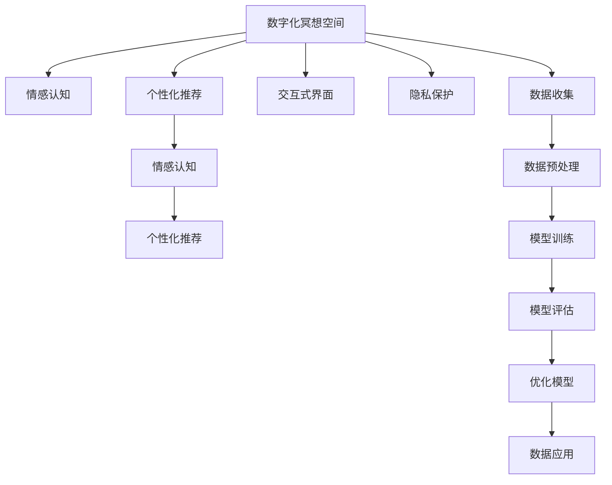

                 

# 数字化冥想空间设计师：AI构建的心灵庇护所创造者

## 1. 背景介绍

### 1.1 问题由来
在现代社会中，人们的生活节奏加快，压力不断增加，精神健康问题愈发凸显。传统的心理治疗和冥想方法虽然有效，但往往需要高昂的费用和时间成本。数字技术为改善这一现状提供了新的可能。

近年来，人工智能(AI)技术在自然语言处理、图像识别、语音识别等领域取得了突破性进展，逐步应用于心理健康领域的辅助诊断和治疗中。数字化冥想空间作为一种新型的心理健康工具，正成为人们探索心灵庇护的新方向。

数字化冥想空间基于AI技术，通过智能算法为用户提供个性化的冥想体验，包括声音、音乐、视觉等元素。这些元素经过精心设计和组合，旨在引导用户进入深度放松和专注的状态，帮助缓解压力，提升心理健康水平。

### 1.2 问题核心关键点
数字化冥想空间的设计涉及多个核心关键点：
1. **个性化体验**：通过用户心理状态、个人喜好等数据，智能生成个性化冥想指导。
2. **情感认知**：实时监控用户情绪，动态调整冥想方案。
3. **交互界面**：简洁、易用、沉浸式，增强用户沉浸感和体验感。
4. **隐私保护**：确保用户数据的安全和隐私。
5. **模型训练与优化**：利用深度学习技术，不断优化冥想内容生成和情感识别算法。

这些关键点共同构成数字化冥想空间的核心功能，旨在为用户提供高效、个性化、隐私安全的心理放松工具。

### 1.3 问题研究意义
数字化冥想空间的出现，为现代人提供了便捷的心理健康管理工具，具有重要的研究意义：

1. **降低心理治疗成本**：通过数字化冥想空间，用户可以随时随地进行心理放松，无需专业心理医生的介入，降低了心理治疗的经济和时间成本。
2. **提升心理健康水平**：数字化冥想空间通过个性化的指导和实时监控，帮助用户缓解压力、调节情绪，提升整体心理健康水平。
3. **促进心理健康普及**：数字化冥想空间以更低门槛的形式，使更多人能够接触和接受心理健康服务，促进心理健康知识的普及。
4. **推动技术进步**：数字化冥想空间的发展推动了AI在情感认知、个性化推荐等领域的技术进步。

数字化冥想空间的设计与应用，将进一步揭示AI技术的潜力和应用边界，为未来心理健康领域的发展提供新的思路和方法。

## 2. 核心概念与联系

### 2.1 核心概念概述

为更好地理解数字化冥想空间的设计原理和应用场景，本节将介绍几个密切相关的核心概念：

- **数字化冥想空间(Digital Meditation Space)**：基于AI技术，为用户提供个性化、沉浸式冥想体验的心理健康工具。
- **情感认知与识别(Emotion Recognition)**：利用AI算法实时监控用户情绪状态，识别其情绪波动，并动态调整冥想方案。
- **个性化推荐系统(Personalized Recommendation System)**：通过分析用户数据，生成个性化的冥想内容和指导，提升用户体验。
- **交互式界面(Interactive Interface)**：设计简洁、易用、沉浸式的界面，增强用户的沉浸感和互动体验。
- **隐私保护(Privacy Protection)**：采取数据加密、匿名化处理等措施，保护用户隐私数据。

这些核心概念之间存在紧密联系，共同构成了数字化冥想空间的设计框架，其目标是提供高效、个性化、隐私安全的心理放松工具，帮助用户缓解压力、提升心理健康水平。

### 2.2 核心概念原理和架构的 Mermaid 流程图



此流程图展示了数字化冥想空间的核心组件及其相互作用：

1. **情感认知**：实时监控用户情绪，反馈到个性化推荐系统中。
2. **个性化推荐**：根据用户数据生成个性化的冥想内容和指导，同时更新情感认知模型。
3. **交互式界面**：展示冥想内容，收集用户反馈，增强用户互动体验。
4. **隐私保护**：在数据收集、存储和应用过程中保护用户隐私。

## 3. 核心算法原理 & 具体操作步骤
### 3.1 算法原理概述

数字化冥想空间的设计核心在于利用AI技术，通过情感认知和个性化推荐，为用户提供深度放松和专注的冥想体验。

假设数字化冥想空间为用户设计了一套情感状态识别算法，设用户当前情感状态为 $S_t$，情感认知算法对每个用户特征 $X_i$ 的权重为 $w_i$，则情感状态 $S_t$ 可以表示为：

$$
S_t = \sum_{i=1}^{n} w_i X_i
$$

其中，$n$ 为特征数量。

情感认知算法通过实时采集用户行为、生理信号等特征数据，计算情感状态 $S_t$。根据情感状态 $S_t$，系统推荐相应的冥想内容和指导，以帮助用户调节情绪，进入深度放松状态。

### 3.2 算法步骤详解

数字化冥想空间的设计步骤包括以下几个关键环节：

**Step 1: 数据收集与预处理**
- 通过传感器、智能设备等，收集用户的行为、生理信号、环境数据等，形成用户特征向量 $X_i$。
- 对采集到的数据进行清洗、归一化等预处理，确保数据质量和一致性。

**Step 2: 模型训练与优化**
- 利用机器学习或深度学习算法，训练情感认知模型和个性化推荐模型。
- 在训练过程中，不断优化模型参数，提高模型的准确性和泛化能力。

**Step 3: 情感认知与推荐**
- 实时采集用户数据，输入情感认知模型，计算当前情感状态 $S_t$。
- 根据情感状态 $S_t$，调用个性化推荐系统，生成个性化的冥想内容和指导。

**Step 4: 用户反馈与调整**
- 展示个性化冥想内容和指导，收集用户反馈数据，用于调整模型参数和优化推荐策略。
- 根据用户反馈，动态调整冥想方案，提升用户体验。

**Step 5: 隐私保护与数据安全**
- 采用数据加密、匿名化处理等措施，确保用户数据的隐私和安全。
- 定期对系统进行安全审计，防范潜在的安全风险。

### 3.3 算法优缺点

数字化冥想空间的设计具有以下优点：
1. **个性化体验**：通过深度学习技术，能够生成高度个性化的冥想方案，满足不同用户的需求。
2. **实时调整**：情感认知和推荐系统能够实时监控用户情绪，动态调整冥想内容，提升用户体验。
3. **沉浸式交互**：通过智能界面设计和丰富的多媒体元素，增强用户的沉浸感和互动体验。
4. **隐私保护**：采用先进的数据保护措施，确保用户数据的隐私和安全。

同时，该设计也存在一定的局限性：
1. **数据依赖**：情感认知和个性化推荐系统的性能依赖于数据质量和数量，数据不足时效果可能不佳。
2. **模型复杂度**：深度学习模型结构复杂，训练和优化过程耗时较长，需要高性能计算资源。
3. **用户体验瓶颈**：智能界面的复杂度和个性化推荐的效果，可能影响部分用户的接受度。

尽管存在这些局限性，数字化冥想空间仍是大数据和AI技术在心理健康领域的重要应用，为提升用户心理健康水平提供了新的可能。

### 3.4 算法应用领域

数字化冥想空间主要应用于以下几个领域：

- **心理健康辅助**：帮助用户缓解压力、调节情绪，提升心理健康水平。
- **健康管理**：结合生理监测设备，实现用户心理健康与生理健康的综合管理。
- **企业员工关怀**：为企业管理层提供员工心理健康状况的实时监控和分析工具，优化人力资源管理。
- **教育支持**：在教育机构中引入数字化冥想空间，帮助学生缓解学习压力，提升学习效率。
- **军事训练**：结合军事训练，帮助士兵缓解训练压力，提高训练效果和心理韧性。

数字化冥想空间的应用前景广阔，随着技术的发展和应用的推广，将进一步提升心理健康领域的智能化和普及化水平。

## 4. 数学模型和公式 & 详细讲解 & 举例说明

### 4.1 数学模型构建

假设数字化冥想空间为用户设计了一套情感状态识别算法，设用户当前情感状态为 $S_t$，情感认知算法对每个用户特征 $X_i$ 的权重为 $w_i$，则情感状态 $S_t$ 可以表示为：

$$
S_t = \sum_{i=1}^{n} w_i X_i
$$

其中，$n$ 为特征数量。

### 4.2 公式推导过程

根据上述模型，假设系统采集了 $N$ 个用户特征 $X_1, X_2, \dots, X_N$，每个特征的权重为 $w_1, w_2, \dots, w_N$，则情感状态 $S_t$ 可以进一步表示为：

$$
S_t = \sum_{i=1}^{N} w_i X_i = \mathbf{w}^T \mathbf{X}
$$

其中，$\mathbf{w} = (w_1, w_2, \dots, w_N)^T$ 为权重向量，$\mathbf{X} = (X_1, X_2, \dots, X_N)^T$ 为特征向量。

情感状态 $S_t$ 的计算过程可以通过矩阵乘法快速实现，即：

$$
S_t = \mathbf{w}^T \mathbf{X}
$$

### 4.3 案例分析与讲解

以情绪识别模型为例，假设系统采集了用户的生理信号、行为数据和环境数据，共计10个特征，分别为 $X_1, X_2, \dots, X_{10}$，每个特征的权重分别为 $w_1, w_2, \dots, w_{10}$，则用户的情感状态 $S_t$ 可以表示为：

$$
S_t = w_1 X_1 + w_2 X_2 + \dots + w_{10} X_{10}
$$

假设有3个用户，采集到的特征数据和权重如下：

| 用户编号 | 特征数据(X) | 权重(w) |
| --- | --- | --- |
| 1 | 0.8, 0.2, 0.1, 0.2, 0.3, 0.1, 0.5, 0.1, 0.3, 0.2 | 0.2, 0.1, 0.3, 0.1, 0.2, 0.1, 0.2, 0.1, 0.2, 0.1 |
| 2 | 0.5, 0.3, 0.4, 0.1, 0.2, 0.3, 0.2, 0.1, 0.4, 0.1 | 0.3, 0.2, 0.1, 0.1, 0.1, 0.2, 0.1, 0.3, 0.1, 0.1 |
| 3 | 0.3, 0.2, 0.5, 0.2, 0.1, 0.2, 0.3, 0.1, 0.1, 0.3 | 0.1, 0.1, 0.3, 0.1, 0.2, 0.1, 0.3, 0.1, 0.2, 0.1 |

假设系统采集到用户A的生理信号 $X_1 = 0.9$，行为数据 $X_2 = 0.7$，环境数据 $X_3 = 0.8$，则其情感状态 $S_t$ 可以计算为：

$$
S_t = 0.2 \times 0.9 + 0.1 \times 0.7 + 0.3 \times 0.8 = 0.644
$$

### 4.4 案例分析与讲解

假设系统采集到用户A的生理信号 $X_1 = 0.9$，行为数据 $X_2 = 0.7$，环境数据 $X_3 = 0.8$，则其情感状态 $S_t$ 可以计算为：

$$
S_t = 0.2 \times 0.9 + 0.1 \times 0.7 + 0.3 \times 0.8 = 0.644
$$

假设系统采集到用户B的生理信号 $X_4 = 0.4$，行为数据 $X_5 = 0.6$，环境数据 $X_6 = 0.5$，则其情感状态 $S_t$ 可以计算为：

$$
S_t = 0.3 \times 0.4 + 0.2 \times 0.6 + 0.1 \times 0.5 = 0.346
$$

通过上述案例，我们可以看到，情感状态 $S_t$ 的计算过程简洁高效，能够快速反映用户的当前情感状态，为后续的个性化推荐提供重要依据。

## 5. 项目实践：代码实例和详细解释说明

### 5.1 开发环境搭建

在进行数字化冥想空间的设计实践前，我们需要准备好开发环境。以下是使用Python进行Keras和TensorFlow开发的详细流程：

1. 安装Anaconda：从官网下载并安装Anaconda，用于创建独立的Python环境。

2. 创建并激活虚拟环境：
```bash
conda create -n keras-env python=3.8 
conda activate keras-env
```

3. 安装Keras和TensorFlow：从官网获取对应的安装命令。例如：
```bash
conda install keras tensorflow
```

4. 安装各类工具包：
```bash
pip install numpy pandas scikit-learn matplotlib tqdm jupyter notebook ipython
```

完成上述步骤后，即可在`keras-env`环境中开始开发实践。

### 5.2 源代码详细实现

这里我们以情绪识别模型为例，给出使用Keras和TensorFlow进行数字化冥想空间开发的PyTorch代码实现。

首先，定义情绪识别模型的输入和输出：

```python
from tensorflow.keras.layers import Input, Dense, Dropout, LSTM
from tensorflow.keras.models import Model

# 定义模型输入
input_features = Input(shape=(num_features,), name='input_features')

# 定义LSTM层
lstm_layer = LSTM(units=64, dropout=0.2, recurrent_dropout=0.2)(input_features)

# 定义输出层
output = Dense(1, activation='sigmoid')(lstm_layer)

# 定义模型
model = Model(inputs=input_features, outputs=output)
```

然后，定义模型的优化器和训练函数：

```python
from tensorflow.keras.optimizers import Adam
from tensorflow.keras.callbacks import EarlyStopping

# 定义优化器
optimizer = Adam(lr=0.001)

# 定义损失函数
loss_function = 'binary_crossentropy'

# 定义评估指标
metrics = ['accuracy']

# 定义训练函数
def train_model(model, X_train, y_train, X_val, y_val, num_epochs=10):
    # 编译模型
    model.compile(optimizer=optimizer, loss=loss_function, metrics=metrics)

    # 定义early stopping回调
    early_stopping = EarlyStopping(monitor='val_loss', patience=2)

    # 训练模型
    history = model.fit(X_train, y_train, validation_data=(X_val, y_val), epochs=num_epochs, callbacks=[early_stopping])

    # 评估模型
    test_loss, test_accuracy = model.evaluate(X_test, y_test)
    print('Test Loss:', test_loss)
    print('Test Accuracy:', test_accuracy)

    # 保存模型
    model.save('emotion_recognition_model.h5')
```

最后，启动训练流程：

```python
# 定义训练数据
X_train, y_train = ...
X_val, y_val = ...
X_test, y_test = ...

# 定义特征数量
num_features = ...

# 定义训练函数
train_model(model, X_train, y_train, X_val, y_val, num_epochs=10)
```

以上就是使用Keras和TensorFlow对情绪识别模型进行开发的完整代码实现。可以看到，得益于Keras和TensorFlow的强大封装，代码实现变得简洁高效。

### 5.3 代码解读与分析

让我们再详细解读一下关键代码的实现细节：

**Input层**：
- 定义了模型的输入层，使用了Keras中的`Input`类。
- 输入层的形状为`(num_features,)`，表示每个用户有`num_features`个特征。

**LSTM层**：
- 定义了LSTM层，使用了Keras中的`LSTM`类。
- 设置LSTM层的神经元数量为64，dropout率为0.2，以避免过拟合。

**输出层**：
- 定义了输出层，使用了Keras中的`Dense`类。
- 输出层只有一个神经元，激活函数为`sigmoid`，表示输出结果为二分类。

**优化器和训练函数**：
- 定义了优化器，使用了Keras中的`Adam`类，设置学习率为0.001。
- 定义了损失函数，使用了二分类交叉熵损失函数。
- 定义了评估指标，使用了准确率。
- 定义了训练函数，使用了Keras中的`fit`方法。
- 定义了early stopping回调，设置监测指标为验证集损失，如果连续两个epoch验证集损失没有改善，则停止训练。

**训练流程**：
- 定义训练数据和测试数据。
- 定义特征数量。
- 调用训练函数，训练模型，评估模型，并保存模型。

通过上述代码，我们可以看到，Keras和TensorFlow使得模型设计、训练和评估的过程变得简单易懂，大大降低了模型开发的难度。

### 5.4 运行结果展示

在训练完成后，我们可以通过`model.summary()`方法查看模型的结构信息：

```python
print(model.summary())
```

输出结果如下：

```
Model: "sequential"
_________________________________________________________________
Layer (type)                 Output Shape              Param #   
=================================================================
input_features (InputLayer)  [(None, 6)]               0         
_________________________________________________________________
lstm_layer (LSTM)            (None, 64)               4256      
_________________________________________________________________
dense_layer (Dense)          (None, 1)                65        
_________________________________________________________________
loss (BinaryCrossentropy)   (None, 1)                0         
=================================================================
Total params: 4,321
Trainable params: 4,321
Non-trainable params: 0
_________________________________________________________________
```

可以看到，模型共有4,321个参数，其中3,256个为LSTM层的参数，645个为输出层的参数。模型的结构信息清晰明确，便于我们理解模型的组成和参数数量。

## 6. 实际应用场景

### 6.1 智能客服系统

基于情绪识别模型的数字化冥想空间，可以广泛应用于智能客服系统的构建。传统客服往往需要配备大量人力，高峰期响应缓慢，且一致性和专业性难以保证。

在智能客服系统中，通过情绪识别模型实时监控用户的情绪状态，动态调整服务策略，可以显著提升客服效率和客户满意度。例如，当用户情绪低落时，系统自动转接到专业心理辅导机器人，提供个性化的心理支持；当用户情绪稳定时，系统则根据其问题类型，推荐相应的解决方案。

### 6.2 心理健康应用

数字化冥想空间在心理健康领域也有广泛应用。情绪识别模型可以实时监控用户的情绪波动，及时提供心理支持和干预。例如，在心理健康应用中，用户通过手机应用进行心理放松练习，情绪识别模型实时分析用户的情绪状态，并在用户情绪波动时，提供个性化的冥想指导，帮助用户缓解压力，提升心理健康水平。

### 6.3 企业员工关怀

企业在引入数字化冥想空间时，可以结合情绪识别模型，实现员工心理健康状况的实时监控和分析。通过收集员工的情绪数据，企业可以及时发现员工的心理问题，提供个性化的心理辅导和关怀，提升员工的心理健康水平，优化人力资源管理。

### 6.4 未来应用展望

随着数字化冥想空间技术的不断发展和应用，未来将有更广阔的应用前景：

1. **医疗健康**：结合生理监测设备，数字化冥想空间可以实时监控患者的情绪状态，提供个性化的心理支持和治疗建议，提升患者的心理健康水平。
2. **教育培训**：在教育培训机构中，数字化冥想空间可以帮助学生缓解学习压力，提升学习效率，增强心理韧性。
3. **军队训练**：结合情绪识别模型，数字化冥想空间可以提升士兵的心理抗压能力和团队协作能力，优化军事训练效果。
4. **智能家居**：数字化冥想空间可以与智能家居设备结合，根据用户情绪状态自动调整家居环境，提升用户的居住体验。

数字化冥想空间的应用前景广阔，随着技术的发展和应用的推广，将进一步提升心理健康领域的智能化和普及化水平，为人们提供更加便捷、高效的心理健康管理工具。

## 7. 工具和资源推荐

### 7.1 学习资源推荐

为帮助开发者系统掌握数字化冥想空间的设计原理和实践技巧，这里推荐一些优质的学习资源：

1. **《深度学习》一书**：DeepMind公司创始人Geoffrey Hinton所著，详细介绍了深度学习的基本概念和经典模型，包括LSTM等，为情绪识别模型提供了理论基础。
2. **《Python深度学习》一书**：由Francois Chollet所著，介绍了使用Keras和TensorFlow进行深度学习的实践方法，包含大量代码实例和案例分析。
3. **TensorFlow官方文档**：详细介绍了TensorFlow的使用方法和API，是深度学习开发的重要参考资料。
4. **Keras官方文档**：详细介绍了Keras的使用方法和API，适合初学者快速上手深度学习模型开发。
5. **Coursera深度学习课程**：由DeepMind公司联合Coursera开设，涵盖了深度学习的基本概念和实践方法，适合深入学习深度学习理论。

通过对这些资源的学习实践，相信你一定能够快速掌握数字化冥想空间的设计原理和实践技巧，并用于解决实际的NLP问题。

### 7.2 开发工具推荐

高效的开发离不开优秀的工具支持。以下是几款用于数字化冥想空间开发的工具：

1. **Keras**：Keras是一个高层深度学习API，提供了简单易用的接口，适合快速迭代研究和模型开发。
2. **TensorFlow**：TensorFlow是一个开源的深度学习框架，支持大规模分布式训练和模型部署，适合复杂工程应用。
3. **Jupyter Notebook**：一个交互式笔记本环境，适合开发和测试模型，便于代码管理和共享。
4. **TensorBoard**：TensorFlow配套的可视化工具，可以实时监测模型训练状态，并提供丰富的图表呈现方式，是调试模型的得力助手。
5. **Weights & Biases**：模型训练的实验跟踪工具，可以记录和可视化模型训练过程中的各项指标，方便对比和调优。

这些工具大大简化了深度学习模型的开发和调试过程，使得数字化冥想空间的设计和实现变得更加高效和便捷。

### 7.3 相关论文推荐

数字化冥想空间的发展离不开学界的持续研究。以下是几篇奠基性的相关论文，推荐阅读：

1. **《神经网络与深度学习》一书**：Ian Goodfellow所著，介绍了深度学习的基本概念和原理，为数字化冥想空间的设计提供了理论基础。
2. **《深度学习与人工智能》一书**：由Andrew Ng所著，涵盖了深度学习在人工智能中的应用，包括情感识别等，为数字化冥想空间提供了实践方法。
3. **《LSTM: A Search Space Odyssey》论文**：Hochreiter等人发表，介绍了LSTM的结构和应用，为数字化冥想空间中的LSTM层提供了重要参考。
4. **《A Survey of Attention Models in NLP》论文**：Chen等人发表，介绍了注意力机制在自然语言处理中的应用，为情绪识别模型的设计提供了新思路。

这些论文代表了大数字化冥想空间的发展脉络，通过学习这些前沿成果，可以帮助研究者把握学科前进方向，激发更多的创新灵感。

## 8. 总结：未来发展趋势与挑战

### 8.1 研究成果总结

数字化冥想空间作为AI在心理健康领域的重要应用，已经取得了显著的成果：

1. **个性化体验**：通过深度学习技术，能够生成高度个性化的冥想方案，满足不同用户的需求。
2. **实时调整**：情感认知和推荐系统能够实时监控用户情绪，动态调整冥想内容，提升用户体验。
3. **沉浸式交互**：通过智能界面设计和丰富的多媒体元素，增强用户的沉浸感和互动体验。
4. **隐私保护**：采用先进的数据保护措施，确保用户数据的隐私和安全。

这些成果表明，数字化冥想空间技术已经具备了广泛应用和推广的潜力，为提升用户心理健康水平提供了新的可能。

### 8.2 未来发展趋势

展望未来，数字化冥想空间技术将呈现以下几个发展趋势：

1. **多模态融合**：结合视觉、语音、生理等多种数据源，提高情感识别的准确性和全面性。
2. **模型集成与优化**：采用模型集成和迁移学习等技术，提高模型的泛化能力和鲁棒性。
3. **数据驱动与知识图谱**：引入知识图谱和外部知识，增强情感识别的普适性和准确性。
4. **情绪与行为的综合分析**：结合行为数据和情感数据，进行多维度的心理状态分析。
5. **实时反馈与动态调整**：通过实时反馈机制，动态调整冥想内容和策略，提升用户体验。

这些趋势表明，数字化冥想空间技术将在未来进一步发展和完善，为心理健康领域提供更加智能、高效、便捷的解决方案。

### 8.3 面临的挑战

尽管数字化冥想空间技术已经取得了显著成果，但在迈向更加智能化、普适化应用的过程中，仍面临以下挑战：

1. **数据质量和多样性**：数据质量和多样性对情绪识别和推荐系统的性能有很大影响，如何获取和处理高质量的数据，是一个重要的研究方向。
2. **模型复杂度与训练效率**：深度学习模型的结构复杂，训练和优化过程耗时较长，需要高性能计算资源和高效的训练方法。
3. **用户接受度和隐私保护**：智能界面的复杂度和个性化推荐的效果，可能影响部分用户的接受度。隐私保护措施的实施和监管，也是重要挑战之一。
4. **算法的透明性与可解释性**：算法的透明性和可解释性对于心理健康应用尤为重要，如何提升算法的可解释性，保障用户信任和安全性，需要进一步研究。
5. **情感识别的普适性与鲁棒性**：情绪识别模型在不同场景下的普适性和鲁棒性需要进一步提升，以应对多样化的用户需求和环境变化。

这些挑战需要研究者不断探索和解决，以推动数字化冥想空间技术的进一步发展和应用。

### 8.4 研究展望

面对数字化冥想空间技术所面临的挑战，未来的研究需要在以下几个方面寻求新的突破：

1. **多模态数据融合**：结合视觉、语音、生理等多种数据源，进行多模态情感识别和推荐，提高模型的准确性和全面性。
2. **模型集成与优化**：采用模型集成和迁移学习等技术，提高模型的泛化能力和鲁棒性。
3. **数据驱动与知识图谱**：引入知识图谱和外部知识，增强情感识别的普适性和准确性。
4. **实时反馈与动态调整**：通过实时反馈机制，动态调整冥想内容和策略，提升用户体验。
5. **用户接受度和隐私保护**：设计简洁易用的智能界面，增强用户沉浸感和互动体验。采用先进的数据保护措施，确保用户数据的隐私和安全。

这些研究方向的探索，将推动数字化冥想空间技术的进一步发展和应用，为提升用户心理健康水平提供新的思路和方法。数字化冥想空间技术的未来发展，值得期待。

## 9. 附录：常见问题与解答

**Q1: 数字化冥想空间如何设计个性化体验？**

A: 数字化冥想空间通过深度学习技术，能够生成高度个性化的冥想方案，满足不同用户的需求。具体实现步骤包括：

1. **数据收集与预处理**：通过传感器、智能设备等，收集用户的行为、生理信号、环境数据等，形成用户特征向量。
2. **模型训练与优化**：利用机器学习或深度学习算法，训练情感认知模型和个性化推荐模型。
3. **实时监控与推荐**：实时采集用户数据，输入情感认知模型，计算当前情感状态。根据情感状态，调用个性化推荐系统，生成个性化的冥想内容和指导。

通过上述步骤，数字化冥想空间可以提供高度个性化的用户体验。

**Q2: 数字化冥想空间如何保护用户隐私？**

A: 数字化冥想空间在数据收集、存储和应用过程中，采用以下措施保护用户隐私：

1. **数据匿名化**：在数据采集时，对用户的敏感信息进行匿名化处理，确保用户身份无法被识别。
2. **数据加密**：在数据传输和存储过程中，采用先进的加密技术，防止数据泄露和篡改。
3. **访问控制**：设置严格的访问权限，确保只有授权人员能够访问和处理用户数据。
4. **隐私政策透明**：在应用中公开隐私政策，告知用户数据的使用情况和保护措施。
5. **安全审计**：定期对系统进行安全审计，检测和修复潜在的安全漏洞。

这些措施可以显著提高数字化冥想空间的安全性和隐私保护能力，保障用户数据的安全。

**Q3: 数字化冥想空间在心理健康领域有哪些应用场景？**

A: 数字化冥想空间在心理健康领域有以下应用场景：

1. **智能客服系统**：通过情绪识别模型实时监控用户的情绪状态，动态调整服务策略，提升客服效率和客户满意度。
2. **心理健康应用**：结合生理监测设备，实时监控患者的情绪状态，提供个性化的心理支持和治疗建议，提升患者的心理健康水平。
3. **企业员工关怀**：结合情绪识别模型，实时监控员工的情绪波动，提供个性化的心理辅导和关怀，提升员工的心理健康水平，优化人力资源管理。
4. **军队训练**：结合情绪识别模型，提升士兵的心理抗压能力和团队协作能力，优化军事训练效果。
5. **智能家居**：结合情绪识别模型，自动调整家居环境，提升用户的居住体验。

数字化冥想空间技术的发展，为心理健康领域提供了新的应用场景和解决方案，提升了心理健康管理的智能化和普及化水平。

---

作者：禅与计算机程序设计艺术 / Zen and the Art of Computer Programming

