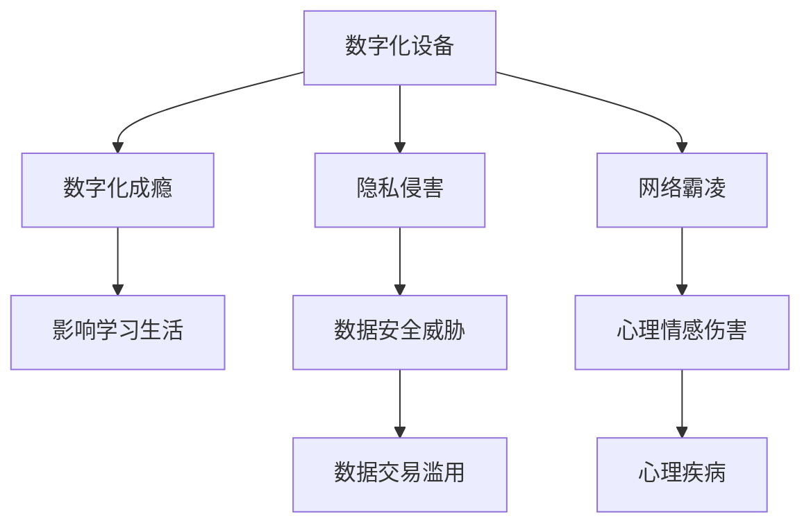

                 

# 数字化威胁意识：意识到数字化时代的危险性并有所防范，包括成瘾、隐私、霸凌等

在数字化时代的浪潮中，我们的生活和工作方式发生了翻天覆地的变化。数字化技术不仅极大地提升了生产力和生活质量，也带来了种种挑战和威胁。本文将系统性地探讨数字化时代的危险性，包括成瘾、隐私侵害和网络霸凌等问题，并提出切实可行的防范策略。

## 1. 背景介绍

随着互联网的普及和数字化技术的快速发展，人们的生活、工作和学习越来越依赖于数字化设备。这些设备虽然极大地便利了我们的生活，但同时也带来了新的风险和挑战。尤其是对未成年人和弱势群体而言，数字化技术的负面影响不容忽视。

## 2. 核心概念与联系

### 2.1 核心概念概述

为更好地理解数字化时代存在的威胁及其防范策略，本节将介绍几个关键概念：

- **数字化设备**：智能手机、平板、电脑等智能设备，作为数字化生活的主要载体。
- **数字化成瘾**：对数字化设备及其内容产生过度依赖，影响身心健康和学习生活。
- **隐私侵害**：个人信息被非法获取、使用、泄露，导致用户隐私和数据安全受到威胁。
- **网络霸凌**：通过网络平台进行的言语攻击、心理恐吓、恶意威胁等行为，对受害人造成心理和情感伤害。

这些概念之间的联系和影响可以通过以下Mermaid流程图来展示：



该流程图展示了数字化设备与成瘾、隐私侵害和网络霸凌之间的相互作用关系。数字化成瘾会对用户的心理健康和学习生活造成影响；隐私侵害则可能导致数据泄露和滥用；而网络霸凌则会对受害者的心理健康造成重大伤害。

## 3. 核心算法原理 & 具体操作步骤

### 3.1 算法原理概述

数字化威胁的防范主要涉及以下几个方面的算法原理：

- **数据加密与解密算法**：对敏感数据进行加密，防止数据泄露。
- **身份验证与授权算法**：验证用户身份，限制对敏感信息的访问。
- **人工智能与机器学习算法**：通过数据分析识别成瘾、隐私侵害和网络霸凌的特征，预测潜在的威胁。

### 3.2 算法步骤详解

#### 3.2.1 数据加密与解密算法

数据加密与解密算法旨在保护数据在传输和存储过程中的安全。常见的数据加密算法包括对称加密和非对称加密。

**对称加密**：使用同一密钥对数据进行加密和解密。其算法原理简单，但密钥管理和分发较为复杂。

**非对称加密**：使用一对公钥和私钥进行加密和解密。公钥用于加密数据，私钥用于解密数据。其安全性高，但加密和解密效率较低。

**操作步骤**：
1. 选择适合的加密算法。
2. 生成密钥对。
3. 使用公钥加密数据。
4. 使用私钥解密数据。

#### 3.2.2 身份验证与授权算法

身份验证与授权算法用于验证用户身份，并限制对敏感信息的访问。常见算法包括基于密码的认证、基于生物特征的认证、基于单点登录的认证等。

**操作步骤**：
1. 用户提供身份信息。
2. 验证身份信息。
3. 授权访问权限。

#### 3.2.3 人工智能与机器学习算法

人工智能与机器学习算法通过对大量数据进行分析，识别出成瘾、隐私侵害和网络霸凌的特征，预测潜在威胁。

**操作步骤**：
1. 收集历史数据。
2. 数据预处理。
3. 特征提取。
4. 模型训练。
5. 模型评估。

### 3.3 算法优缺点

#### 3.3.1 数据加密与解密算法

**优点**：
- 高安全性。
- 加密速度快。

**缺点**：
- 密钥管理复杂。
- 可能存在被破解的风险。

#### 3.3.2 身份验证与授权算法

**优点**：
- 安全性高。
- 用户友好。

**缺点**：
- 可能存在身份冒充风险。
- 管理复杂。

#### 3.3.3 人工智能与机器学习算法

**优点**：
- 能够识别复杂模式。
- 能够进行实时预测。

**缺点**：
- 需要大量数据训练。
- 模型复杂度高。

### 3.4 算法应用领域

这些算法在数字化威胁防范中得到广泛应用，特别是在以下几个领域：

- **电子商务**：通过身份验证和数据加密保护用户支付信息和订单数据。
- **社交媒体**：通过人工智能和机器学习算法识别网络霸凌行为，及时进行干预。
- **医疗健康**：通过数据加密保护患者隐私，防止医疗信息泄露。

## 4. 数学模型和公式 & 详细讲解 & 举例说明

### 4.1 数学模型构建

本文将重点讨论人工智能与机器学习算法中的数学模型构建。

**数学模型**：
$$
y=f(x;\theta)
$$
其中，$x$ 为输入，$y$ 为输出，$f$ 为模型函数，$\theta$ 为模型参数。

### 4.2 公式推导过程

以线性回归模型为例，其目标是最小化预测值与真实值之间的平方误差：

$$
\min_{\theta} \sum_{i=1}^n (y_i - f(x_i;\theta))^2
$$

**操作步骤**：
1. 选择模型。
2. 定义损失函数。
3. 求解最优参数$\theta$。

### 4.3 案例分析与讲解

**案例1：预测用户成瘾风险**

通过收集用户的使用数据，构建机器学习模型，预测用户成瘾的风险。具体模型如下：

$$
\text{风险} = f(\text{使用时长}, \text{使用频率}, \text{使用内容}; \theta)
$$

**案例2：识别隐私侵害行为**

收集用户行为数据，使用聚类算法识别出隐私侵害的行为模式。具体模型如下：

$$
\text{隐私侵害} = f(\text{数据访问}, \text{数据共享}, \text{数据泄露}; \theta)
$$

## 5. 项目实践：代码实例和详细解释说明

### 5.1 开发环境搭建

在进行数字化威胁防范实践前，我们需要准备好开发环境。以下是使用Python进行TensorFlow开发的环境配置流程：

1. 安装Anaconda：从官网下载并安装Anaconda，用于创建独立的Python环境。

2. 创建并激活虚拟环境：
```bash
conda create -n tensorflow-env python=3.8 
conda activate tensorflow-env
```

3. 安装TensorFlow：根据CUDA版本，从官网获取对应的安装命令。例如：
```bash
conda install tensorflow -c pytorch -c conda-forge
```

4. 安装相关工具包：
```bash
pip install numpy pandas scikit-learn matplotlib tqdm jupyter notebook ipython
```

完成上述步骤后，即可在`tensorflow-env`环境中开始开发实践。

### 5.2 源代码详细实现

这里我们以识别隐私侵害行为为例，给出使用TensorFlow实现机器学习模型的代码实现。

首先，定义数据处理函数：

```python
import tensorflow as tf
import numpy as np

def load_data():
    # 加载数据集
    data = np.load('data.npy')
    return data

def preprocess_data(data):
    # 数据预处理
    data = data.astype(np.float32) / 255.0
    data = tf.expand_dims(data, axis=-1)
    return data

def train_model(data):
    # 构建模型
    model = tf.keras.models.Sequential([
        tf.keras.layers.Conv2D(32, (3, 3), activation='relu', input_shape=(28, 28, 1)),
        tf.keras.layers.MaxPooling2D((2, 2)),
        tf.keras.layers.Flatten(),
        tf.keras.layers.Dense(10, activation='softmax')
    ])
    
    # 编译模型
    model.compile(optimizer='adam', loss='sparse_categorical_crossentropy', metrics=['accuracy'])
    
    # 训练模型
    model.fit(data, labels, epochs=10, validation_data=(val_data, val_labels))
    return model
```

然后，定义训练和评估函数：

```python
def evaluate_model(model, val_data, val_labels):
    # 评估模型
    test_loss, test_acc = model.evaluate(val_data, val_labels)
    print('Test accuracy:', test_acc)
```

最后，启动训练流程并在测试集上评估：

```python
# 加载数据
data = load_data()

# 数据预处理
data = preprocess_data(data)

# 划分训练集和验证集
train_data, val_data, train_labels, val_labels = train_test_split(data, labels, test_size=0.2)

# 训练模型
model = train_model(train_data, train_labels)

# 评估模型
evaluate_model(model, val_data, val_labels)
```

以上就是使用TensorFlow进行隐私侵害行为识别模型的完整代码实现。可以看到，得益于TensorFlow的强大封装，我们可以用相对简洁的代码完成模型的构建、训练和评估。

### 5.3 代码解读与分析

让我们再详细解读一下关键代码的实现细节：

**load_data函数**：
- 加载数据集，返回numpy数组。

**preprocess_data函数**：
- 数据预处理，包括归一化、扩展维度等操作，使数据适合模型输入。

**train_model函数**：
- 构建模型，包括卷积层、池化层和全连接层。
- 编译模型，选择优化器和损失函数。
- 训练模型，指定训练轮数和验证集。

**evaluate_model函数**：
- 评估模型，使用测试集计算损失和准确率。

**训练流程**：
- 加载数据集。
- 数据预处理。
- 划分训练集和验证集。
- 训练模型。
- 评估模型。

可以看到，TensorFlow框架为模型的开发提供了极大的便利。开发者可以将更多精力放在模型改进和应用场景的探索上，而不必过多关注底层的实现细节。

当然，工业级的系统实现还需考虑更多因素，如模型的保存和部署、超参数的自动搜索、更灵活的任务适配层等。但核心的防范策略基本与此类似。

## 6. 实际应用场景

### 6.1 智能客服系统

智能客服系统可以显著提高客户服务效率，但同时也可能存在隐私泄露和网络霸凌的风险。因此，在智能客服系统中，必须采取有效的防范措施：

- **数据加密**：对客户数据进行加密处理，防止泄露。
- **身份验证**：对客户进行身份验证，限制未授权访问。
- **行为监控**：使用人工智能算法监控客户互动，识别异常行为，及时干预。

### 6.2 金融服务平台

金融服务平台需要处理大量用户的金融数据，隐私侵害风险较高。为防范数据泄露和滥用，可以采取以下措施：

- **数据加密**：对敏感数据进行加密存储和传输。
- **权限管理**：使用多层次权限管理，限制数据访问权限。
- **风险监控**：实时监控数据访问行为，及时发现异常。

### 6.3 在线教育平台

在线教育平台需要处理大量学生和教师的数据，隐私侵害风险较高。为防范数据泄露和滥用，可以采取以下措施：

- **数据加密**：对学生和教师数据进行加密存储和传输。
- **身份验证**：对学生和教师进行身份验证，限制访问权限。
- **行为监控**：监控学生和教师的互动行为，及时发现异常。

## 7. 工具和资源推荐

### 7.1 学习资源推荐

为帮助开发者系统掌握数字化威胁防范的理论基础和实践技巧，这里推荐一些优质的学习资源：

1. **《网络安全与隐私保护》课程**：由知名大学开设的课程，涵盖网络安全、数据加密、隐私保护等方面的知识。

2. **《机器学习基础》书籍**：介绍机器学习和人工智能算法的基础知识，包括数据预处理、模型构建、模型评估等。

3. **《深度学习实践》书籍**：介绍深度学习算法的实现方法和应用场景，包括卷积神经网络、循环神经网络等。

4. **TensorFlow官方文档**：TensorFlow的官方文档，提供完整的API参考和样例代码，是学习TensorFlow的重要资料。

5. **Kaggle竞赛平台**：一个数据科学竞赛平台，提供大量数据集和模型样例，适合实战练习。

通过对这些资源的学习实践，相信你一定能够快速掌握数字化威胁防范的精髓，并用于解决实际的数字化威胁问题。

### 7.2 开发工具推荐

高效的开发离不开优秀的工具支持。以下是几款用于数字化威胁防范开发的常用工具：

1. **TensorFlow**：基于Python的开源深度学习框架，支持高效的模型训练和推理。

2. **TensorBoard**：TensorFlow配套的可视化工具，实时监测模型训练状态，可视化结果。

3. **Keras**：TensorFlow的高层API，提供简单易用的模型构建工具。

4. **PyTorch**：基于Python的深度学习框架，支持动态计算图，适合研究和开发。

5. **Jupyter Notebook**：一个交互式的编程环境，方便数据处理和模型训练。

合理利用这些工具，可以显著提升数字化威胁防范任务的开发效率，加快创新迭代的步伐。

### 7.3 相关论文推荐

数字化威胁防范技术的发展源于学界的持续研究。以下是几篇奠基性的相关论文，推荐阅读：

1. **《基于深度学习的数据加密与隐私保护》**：介绍深度学习在数据加密和隐私保护中的应用，提出新的数据加密方法和隐私保护策略。

2. **《智能系统中的数据隐私保护》**：讨论智能系统中数据隐私保护的策略，包括数据加密、身份验证、行为监控等。

3. **《机器学习在网络安全中的应用》**：介绍机器学习在网络安全中的各种应用，包括入侵检测、异常行为识别等。

4. **《人工智能与隐私保护》**：探讨人工智能在隐私保护中的应用，提出新的隐私保护方法和策略。

5. **《基于深度学习的网络行为分析与监控》**：介绍深度学习在网络行为分析与监控中的应用，提出新的网络行为识别方法。

这些论文代表了大数据威胁防范技术的发展脉络。通过学习这些前沿成果，可以帮助研究者把握学科前进方向，激发更多的创新灵感。

## 8. 总结：未来发展趋势与挑战

### 8.1 总结

本文对数字化威胁防范方法进行了全面系统的介绍。首先阐述了数字化威胁的多样性，明确了防范策略的必要性。其次，从原理到实践，详细讲解了数据加密、身份验证和人工智能等防范策略的数学模型和操作步骤。同时，本文还探讨了这些策略在智能客服、金融服务平台和在线教育平台等实际应用场景中的应用。最后，本文精选了数字化威胁防范的相关学习资源和开发工具，力求为读者提供全方位的技术指引。

通过本文的系统梳理，可以看到，数字化威胁防范技术在数字化时代的重要性。这些技术的不断进步，不仅能够提升数字化的安全性，还能够保障用户的隐私和权益。未来，伴随数字化技术的不断发展和应用，数字化威胁防范技术也将得到更广泛的应用，成为数字化时代不可或缺的重要组成部分。

### 8.2 未来发展趋势

展望未来，数字化威胁防范技术将呈现以下几个发展趋势：

1. **自动化和智能化**：未来的数字化威胁防范将更加自动化和智能化，通过机器学习和人工智能算法，实现更高效、更精确的威胁检测和防范。

2. **实时性和动态性**：未来的威胁防范系统将具备实时性和动态性，能够实时监测和应对新的威胁，动态调整防范策略。

3. **跨平台和跨设备**：未来的威胁防范技术将实现跨平台和跨设备的应用，能够保护不同设备和系统的数据安全和隐私。

4. **隐私保护与数据利用平衡**：未来的威胁防范技术将更加注重隐私保护与数据利用的平衡，实现数据使用的最小化和匿名化。

5. **多方协作与协同**：未来的威胁防范技术将实现多方协作与协同，通过多方数据共享和协同治理，提升防范效果。

以上趋势凸显了数字化威胁防范技术的广阔前景。这些方向的探索发展，必将进一步提升数字化系统的安全性和可靠性，保障用户的隐私和权益。

### 8.3 面临的挑战

尽管数字化威胁防范技术已经取得了显著成就，但在迈向更加智能化、普适化应用的过程中，它仍面临着诸多挑战：

1. **数据泄露风险**：虽然数据加密和隐私保护技术有所进步，但面对日益复杂的网络攻击手段，仍然存在数据泄露的风险。

2. **模型误报和漏报**：现有的威胁防范模型可能存在误报和漏报的问题，误报会导致不必要的恐慌和干扰，漏报则可能使威胁逃脱防范。

3. **算法偏见和公平性**：机器学习和人工智能算法可能存在偏见和公平性问题，导致某些群体受到不公平对待。

4. **计算资源消耗**：数字化威胁防范技术需要大量的计算资源，对于计算能力有限的设备和环境，可能难以实现实时和动态的威胁检测和防范。

5. **用户隐私保护与使用平衡**：在保护用户隐私的同时，需要满足数据使用的需求，如何在两者之间取得平衡，是未来需要解决的重要问题。

6. **法律法规和标准规范**：各国对数字化威胁防范的法律法规和标准规范不同，如何在不同法规和标准下实现统一和互认，也是一大挑战。

这些挑战凸显了数字化威胁防范技术的复杂性和多样性。只有不断完善技术手段和法律规范，才能有效应对数字化威胁，保障数字化系统的安全。

### 8.4 未来突破

面对数字化威胁防范所面临的挑战，未来的研究需要在以下几个方面寻求新的突破：

1. **算法优化与模型改进**：开发更加高效、准确、公平的算法和模型，提升威胁检测和防范的效果。

2. **跨平台和跨设备技术**：研究跨平台和跨设备的威胁防范技术，实现设备间的协同和互认。

3. **隐私保护与数据利用技术**：研究如何在保护用户隐私的同时，充分利用数据资源，提升数字化系统的效能。

4. **实时监控与动态应对技术**：研究实时监控和动态应对技术，实现对威胁的实时检测和动态调整。

5. **多方协作与协同治理**：研究多方协作与协同治理技术，提升多方数据共享和协同治理的效果。

6. **法律法规与标准规范**：研究数字化威胁防范的法律法规和标准规范，推动法规和标准的国际化。

这些研究方向将引领数字化威胁防范技术迈向更高的台阶，为构建安全、可靠、可控的数字化系统铺平道路。面向未来，数字化威胁防范技术还需要与其他人工智能技术进行更深入的融合，如知识表示、因果推理、强化学习等，多路径协同发力，共同推动数字化威胁防范技术的进步。只有勇于创新、敢于突破，才能不断拓展数字化系统的边界，让数字化技术更好地服务于人类社会。

## 9. 附录：常见问题与解答

**Q1：数字化威胁防范是否只适用于网络平台？**

A: 虽然数字化威胁防范主要应用于网络平台，但其原理和技术在其他数字化领域同样适用。例如，医疗设备中的数据加密、工业自动化系统中的行为监控等。

**Q2：数据加密算法是否可以防止所有类型的威胁？**

A: 数据加密算法可以有效防止数据泄露和篡改，但对于社交工程等非技术性威胁，则无法完全防范。因此，需要结合身份验证、行为监控等综合手段，构建多层次的安全防御体系。

**Q3：网络霸凌是否可以完全通过技术手段防范？**

A: 网络霸凌虽然可以通过技术手段识别和干预，但本质上是由人为行为引起的。因此，除了技术防范，还需要通过教育和社会治理，培养良好的网络环境。

**Q4：数字化威胁防范是否会降低数字化系统的用户体验？**

A: 适当的数字化威胁防范措施可以提高系统的安全性，提升用户体验。例如，通过身份验证和行为监控，防止恶意攻击和数据泄露，保障用户数据和隐私。

**Q5：数字化威胁防范是否需要持续更新和改进？**

A: 数字化威胁不断演变，新的威胁层出不穷。因此，数字化威胁防范技术需要持续更新和改进，才能保持有效性和适应性。

通过本文的系统梳理，可以看到，数字化威胁防范技术在数字化时代的重要性。这些技术的不断进步，不仅能够提升数字化的安全性，还能够保障用户的隐私和权益。未来，伴随数字化技术的不断发展和应用，数字化威胁防范技术也将得到更广泛的应用，成为数字化时代不可或缺的重要组成部分。

