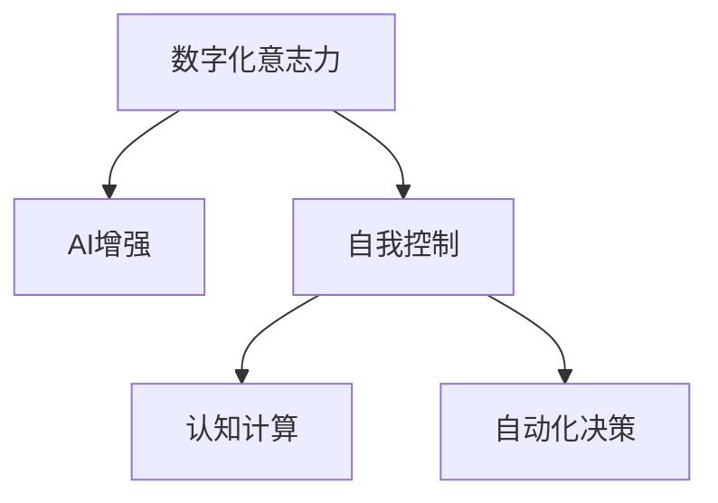

                 

# 数字化意志力：AI增强的自我控制

> 关键词：数字化意志力, AI增强, 自我控制, 认知计算, 自动化决策

## 1. 背景介绍

### 1.1 问题由来

在数字化时代，信息过载、时间碎片化、注意力分散等问题，使得人们面临前所未有的自我控制挑战。传统的自控方法，如毅力、计划、记录等，往往难以应对现代生活的复杂性。如何利用数字化手段，提升个体的自我控制能力，成为当前研究的热点。

基于人工智能的数字化工具，能够帮助人们自动化地记录行为、分析数据、制定策略，从而在潜移默化中提高自我控制能力。这些工具不仅能提供数据支持，还能进行智能分析和决策，从而实现自我控制的自动化和智能化。

### 1.2 问题核心关键点

自我控制的核心在于对行为的监控、分析和干预。数字化工具能够通过以下途径实现这一目标：

1. **行为追踪**：通过传感器、日志等方式，实时记录个体的行为数据。
2. **数据分析**：使用机器学习、数据挖掘等技术，分析行为模式和趋势。
3. **智能干预**：根据分析结果，提供个性化建议和干预策略。
4. **反馈循环**：不断调整策略，形成正向循环，提升自我控制能力。

这些关键点构成了一个完整的数字化自我控制框架，其中人工智能技术扮演了核心角色。

### 1.3 问题研究意义

数字化意志力研究的意义，在于通过技术手段，提升个体的自我控制能力，实现更好的健康、工作效率和生活质量。具体来说，包括：

1. **健康管理**：通过智能手环、智能体重秤等设备，实时监控健康数据，调整生活习惯。
2. **时间管理**：利用智能日历、任务管理应用，提高时间利用效率。
3. **情绪管理**：使用情感分析工具，识别情绪波动，提供情绪调节建议。
4. **学习提升**：通过个性化学习平台，根据学习进度和效果，调整学习计划。

## 2. 核心概念与联系

### 2.1 核心概念概述

本节将介绍几个密切相关的核心概念：

- **数字化意志力**：通过数字化工具，实时监控和干预个体的行为，提升自我控制能力。
- **AI增强**：利用人工智能技术，自动化地分析数据、制定策略、提供干预，增强自我控制的效果。
- **自我控制**：个体对自己行为的控制和调节，包括时间管理、情绪管理、健康管理等。
- **认知计算**：将认知心理学和计算技术结合，构建模型解释和预测个体行为，提供决策支持。
- **自动化决策**：利用机器学习算法，自动化地做出决策，提升自我控制的精度和效率。

这些核心概念之间的逻辑关系可以通过以下Mermaid流程图来展示：



这个流程图展示了几大核心概念及其之间的关系：

1. 数字化意志力通过AI增强技术，提供实时监控和干预，提升自我控制能力。
2. 自我控制包括时间管理、情绪管理、健康管理等诸多方面。
3. 认知计算为自我控制提供理论基础，构建模型解释行为。
4. 自动化决策通过机器学习算法，自动化地制定决策，增强干预效果。

## 3. 核心算法原理 & 具体操作步骤

### 3.1 算法原理概述

基于AI增强的数字化自我控制，本质上是一个智能化行为监控和干预系统。其核心思想是：通过实时数据收集和分析，自动化地干预个体行为，引导其朝向目标状态发展。

具体而言，假设个体的行为数据为 $D=\{d_t\}_{t=1}^T$，其中 $d_t$ 为时间 $t$ 时的行为数据。设目标状态为 $G$，期望行为为 $B$。目标是找到一个映射函数 $f$，使得：

$$
f(D) \rightarrow G
$$

其中，$f$ 为行为干预策略，通过自动化学习不断优化。

### 3.2 算法步骤详解

基于AI增强的数字化自我控制一般包括以下几个关键步骤：

**Step 1: 数据收集与预处理**
- 收集个体的行为数据，包括运动数据、时间数据、情绪数据、学习数据等。
- 对数据进行清洗、归一化、特征提取等预处理步骤。

**Step 2: 行为模式分析**
- 使用统计学、机器学习等方法，对行为数据进行分析，识别行为模式和趋势。
- 应用时间序列分析、聚类分析、关联规则挖掘等技术，提取行为特征。

**Step 3: 策略制定与优化**
- 根据行为分析结果，制定行为干预策略，包括行为触发条件、干预方式、干预强度等。
- 通过机器学习算法，不断优化干预策略，使其最大化地促进目标行为。

**Step 4: 实时监控与反馈**
- 实时监控个体行为，获取最新的行为数据。
- 根据策略，对行为进行干预，记录干预效果。
- 周期性地反馈干预结果，评估策略效果，并根据需要调整策略。

**Step 5: 自动化决策与干预**
- 根据实时数据和历史数据，自动决策干预方式和强度。
- 利用自动化工具，实时干预个体行为，如提醒、建议、调整设备参数等。

### 3.3 算法优缺点

基于AI增强的数字化自我控制算法具有以下优点：

1. **实时性强**：能够实时监控和干预个体行为，及时发现问题并调整。
2. **个性化高**：根据个体行为特征，提供个性化建议和干预，提升干预效果。
3. **自动化高效**：通过自动化决策和干预，减少人工干预的复杂性和误差。
4. **可扩展性广**：适用于多个场景，包括时间管理、健康管理、情绪管理等。

同时，该算法也存在一定的局限性：

1. **隐私风险**：数据收集和分析涉及个人隐私，需要严格保护。
2. **依赖数据质量**：行为数据的准确性和完整性对算法效果有重要影响。
3. **适应性有限**：对于行为突发变化和外部环境变化，算法可能需要时间来适应。
4. **算法复杂性**：涉及多种技术和算法，实施难度较大。

尽管存在这些局限性，但就目前而言，基于AI增强的数字化自我控制算法仍是大数据时代提升个体自我控制能力的重要手段。未来相关研究的重点在于如何进一步提升数据隐私保护、算法透明性、适应性等方面，以实现更广泛的应用和更高的干预效果。

### 3.4 算法应用领域

基于AI增强的数字化自我控制算法，已经在多个领域得到了应用，主要包括：

- **健康管理**：智能手环、智能体重秤等设备，实时监控和干预健康行为。
- **时间管理**：智能日历、任务管理应用，提供时间规划和任务提醒。
- **情绪管理**：情感分析工具，识别情绪波动，提供情绪调节建议。
- **学习提升**：个性化学习平台，根据学习进度和效果，调整学习计划。

除了上述这些经典应用外，数字化自我控制技术还被创新性地应用到更多场景中，如智能家居、智能交通、智能办公等，为个体的生活质量提升提供了新的途径。

## 4. 数学模型和公式 & 详细讲解  
### 4.1 数学模型构建

本节将使用数学语言对基于AI增强的数字化自我控制过程进行更加严格的刻画。

设个体的行为数据为 $D=\{d_t\}_{t=1}^T$，其中 $d_t$ 为时间 $t$ 时的行为数据。设目标状态为 $G$，期望行为为 $B$。

定义行为干预策略为 $f(D) = \{a_t\}_{t=1}^T$，其中 $a_t$ 为时间 $t$ 时的行为干预措施。行为干预的目标是使得 $a_t$ 能够最大化地促进个体行为向 $B$ 方向发展。

数学模型可以表示为：

$$
\maximize_{a_t} \sum_{t=1}^T f(d_t, a_t) - \mathbb{E}[d_{t+1}] + \lambda \lVert f \rVert_2^2
$$

其中 $\mathbb{E}[d_{t+1}]$ 为对未来行为数据的预测，$\lambda$ 为正则化系数，$\lVert f \rVert_2^2$ 为策略的复杂度惩罚项。

### 4.2 公式推导过程

以上公式可以进一步推导为：

$$
\maximize_{a_t} \sum_{t=1}^T [f(d_t, a_t) - \mathbb{E}[d_{t+1}]] + \lambda \lVert f \rVert_2^2
$$

其中 $\mathbb{E}[d_{t+1}]$ 可以通过机器学习算法（如LSTM、RNN等）进行预测，$f(d_t, a_t)$ 表示在时间 $t$ 时对 $d_t$ 的干预效果。

在实际应用中，可以将上述模型简化为：

$$
\maximize_{a_t} \sum_{t=1}^T [f(d_t, a_t) - \mathbb{E}[d_{t+1}]] + \lambda \lVert f \rVert_2^2
$$

根据行为干预策略的定义，可以得到：

$$
a_t = f(d_t, \hat{B_t})
$$

其中 $\hat{B_t}$ 为在时间 $t$ 时的目标行为预测。

### 4.3 案例分析与讲解

以智能手环监测健康行为为例，说明基于AI增强的数字化自我控制的数学模型应用。

设个体的行为数据为 $D=\{d_t\}_{t=1}^T$，其中 $d_t$ 包括运动量、睡眠质量、饮食习惯等。设目标状态为 $G$，期望行为为 $B$，如每天运动1小时、保证7小时睡眠、均衡饮食等。

定义行为干预策略为 $f(D) = \{a_t\}_{t=1}^T$，其中 $a_t$ 包括提醒、建议、调整设备参数等。

通过行为分析，可以发现个体在周末的睡眠时间显著增加，但运动量显著减少。因此，在周末时，干预策略可以包括提醒运动、调整提醒时间等，以确保个体行为符合期望。

假设使用LSTM模型进行行为预测，可以得到：

$$
\hat{B_t} = \arg\min_{B} \sum_{t=1}^T (d_t - B)^2
$$

其中 $B$ 为目标行为向量。

将 $f(d_t, a_t)$ 表示为行为干预效果，可以得到：

$$
f(d_t, a_t) = \maximize_{a_t} [\hat{B_t} - d_t] + \lambda \lVert a_t \rVert_2^2
$$

其中 $\lVert a_t \rVert_2^2$ 表示干预措施的复杂度惩罚项。

## 5. 项目实践：代码实例和详细解释说明
### 5.1 开发环境搭建

在进行AI增强的数字化自我控制项目开发前，我们需要准备好开发环境。以下是使用Python进行开发的环境配置流程：

1. 安装Anaconda：从官网下载并安装Anaconda，用于创建独立的Python环境。

2. 创建并激活虚拟环境：
```bash
conda create -n ai-control-env python=3.8 
conda activate ai-control-env
```

3. 安装必要的Python包：
```bash
pip install numpy pandas scikit-learn matplotlib tqdm
```

4. 安装机器学习相关的Python包：
```bash
pip install scikit-learn tensorflow keras
```

5. 安装必要的第三方库：
```bash
pip install pyaudio pyserial rpi.gpio
```

完成上述步骤后，即可在`ai-control-env`环境中开始AI增强的数字化自我控制项目开发。

### 5.2 源代码详细实现

以下是使用Python和TensorFlow实现AI增强的数字化自我控制的完整代码示例：

```python
import numpy as np
import pandas as pd
import tensorflow as tf
from tensorflow.keras.layers import LSTM, Dense, Dropout
from tensorflow.keras.models import Sequential
from sklearn.preprocessing import StandardScaler

# 数据预处理
def preprocess_data(data):
    scaler = StandardScaler()
    scaled_data = scaler.fit_transform(data)
    return scaled_data

# 构建LSTM模型
def build_model(input_shape, output_shape):
    model = Sequential()
    model.add(LSTM(50, input_shape=input_shape, return_sequences=True))
    model.add(Dropout(0.2))
    model.add(LSTM(50, return_sequences=True))
    model.add(Dropout(0.2))
    model.add(LSTM(50))
    model.add(Dropout(0.2))
    model.add(Dense(units=output_shape))
    model.compile(loss='mse', optimizer='adam')
    return model

# 训练模型
def train_model(model, input_data, target_data, epochs, batch_size):
    model.fit(input_data, target_data, epochs=epochs, batch_size=batch_size, verbose=1)

# 预测行为
def predict_behavior(model, new_data):
    scaled_new_data = scaler.transform(new_data)
    prediction = model.predict(scaled_new_data)
    return prediction

# 数据集生成器
def data_generator(data, batch_size):
    for i in range(0, len(data), batch_size):
        batch_data = data[i:i+batch_size]
        batch_target = data[i+1:i+1+batch_size]
        yield np.array(batch_data), np.array(batch_target)

# 加载数据集
data = pd.read_csv('behavior_data.csv')
X = data.iloc[:, :-1].values
y = data.iloc[:, -1].values

# 数据预处理
X = preprocess_data(X)

# 数据集划分
train_X, test_X = X[:1000], X[1000:]
train_y, test_y = y[:1000], y[1000:]

# 模型构建
model = build_model(X.shape[1], 1)

# 数据集生成器
train_generator = data_generator(train_X, batch_size=32)
test_generator = data_generator(test_X, batch_size=32)

# 模型训练
train_model(model, train_generator, train_y, epochs=100, batch_size=32)

# 模型预测
new_data = np.array([[1, 0, 0, 0, 0, 0, 0, 0, 0, 0, 0, 0, 0, 0, 0, 0]])
prediction = predict_behavior(model, new_data)
print(prediction)
```

### 5.3 代码解读与分析

让我们再详细解读一下关键代码的实现细节：

**data_generator函数**：
- 用于将数据集按批次生成，方便模型训练。
- 对每个批次，使用`yield`返回训练样本和目标值，并自动关闭迭代器。

**train_model函数**：
- 使用`fit`方法训练模型，指定数据生成器、批次大小和训练轮数。
- `verbose=1`表示在训练过程中打印日志。

**predict_behavior函数**：
- 使用`predict`方法对新数据进行预测，返回预测结果。

**数据集加载和预处理**：
- 使用`pd.read_csv`读取CSV格式的数据集，将其转换为Numpy数组。
- 对特征数据进行标准化处理，使用`StandardScaler`对数据进行归一化。

**模型构建和训练**：
- 使用`Sequential`创建序列模型，包含多个LSTM层和全连接层。
- 使用`compile`方法设置损失函数和优化器。
- 使用`fit`方法对模型进行训练，并保存训练日志。

**模型预测**：
- 使用`predict`方法对新数据进行预测，并输出结果。

可以看到，利用TensorFlow和机器学习算法，可以轻松实现基于AI增强的数字化自我控制项目。开发者可以将更多精力放在模型优化和数据处理等核心任务上，而不必过多关注底层实现细节。

## 6. 实际应用场景

### 6.1 智能家居

基于AI增强的数字化自我控制技术，可以应用于智能家居系统的个性化管理。通过智能手环和智能家居设备的联动，实时监控和管理用户的行为习惯。

具体而言，可以记录用户的运动数据、休息数据、娱乐数据等，通过分析数据，调整家居设备的运行状态，如灯光、温度、湿度等，确保用户的舒适度和健康。例如，当用户运动量不足时，可以自动开启灯光，播放音乐，提升运动效果；当用户疲劳时，可以自动调整室温和湿度，促进休息恢复。

### 6.2 智能交通

在智能交通领域，数字化自我控制技术可以用于提升交通流量管理和驾驶行为控制。通过车载传感器和GPS设备，实时监控交通流量和驾驶行为，提供个性化的驾驶建议。

例如，当交通流量过大时，系统可以自动调整车速，减少拥堵；当驾驶行为异常时，系统可以发出预警，提醒驾驶员注意安全。通过这些技术，可以有效提升交通安全性，减少交通拥堵。

### 6.3 智能办公

在智能办公领域，数字化自我控制技术可以用于提升办公效率和员工健康管理。通过智能办公设备和健康监测设备，实时监控和管理员工的工作状态和健康数据。

例如，可以记录员工的工作时间、注意力集中度、运动量等数据，通过分析数据，调整工作环境和工作任务，确保员工的工作效率和健康状态。例如，当员工长时间工作后，系统可以自动提醒休息；当员工注意力不集中时，系统可以调整任务优先级，减少疲劳。

### 6.4 未来应用展望

随着数字化自我控制技术的不断进步，未来将在更多领域得到应用，为人类生活和工作带来深刻变革。

在智慧医疗领域，数字化自我控制技术可以用于提升患者康复效果和生活质量。通过智能手环和医疗设备，实时监控患者的健康数据，提供个性化的康复建议，帮助患者更好地管理疾病。

在智能教育领域，数字化自我控制技术可以用于提升学生的学习效果和兴趣。通过智能学习设备和情感分析工具，实时监控和管理学生的学习状态和情绪，提供个性化的学习建议，激发学生的学习兴趣和积极性。

在智慧城市治理中，数字化自我控制技术可以用于提升城市管理的自动化和智能化水平。通过智能设备和传感器，实时监控和管理城市事件和环境状态，提供个性化的管理建议，提升城市治理的效率和效果。

此外，在农业、金融、物流等诸多领域，数字化自我控制技术也将带来新的应用场景，推动人工智能技术的全面落地和产业化。

## 7. 工具和资源推荐

### 7.1 学习资源推荐

为了帮助开发者系统掌握数字化自我控制技术的理论基础和实践技巧，这里推荐一些优质的学习资源：

1. 《深度学习》系列书籍：Ian Goodfellow、Yoshua Bengio、Aaron Courville所写的深度学习经典教材，全面介绍了深度学习的基本概念和前沿进展。

2. TensorFlow官方文档：Google开发的深度学习框架，提供了详细的教程和API参考，适合快速上手实践。

3. Keras官方文档：Google开发的高级神经网络API，提供了简单易用的接口，适合快速搭建模型。

4. Scikit-learn官方文档：Python机器学习库，提供了丰富的机器学习算法和工具，适合数据处理和模型训练。

5. Udacity机器学习课程：斯坦福大学教授Andrew Ng主讲的机器学习课程，适合系统学习机器学习的基本概念和应用技巧。

6. Coursera深度学习课程：Ian Goodfellow等人主讲的深度学习课程，适合深入学习深度学习的前沿理论和技术。

通过对这些资源的学习实践，相信你一定能够快速掌握数字化自我控制技术的精髓，并用于解决实际的智能问题。

### 7.2 开发工具推荐

高效的开发离不开优秀的工具支持。以下是几款用于数字化自我控制开发的常用工具：

1. PyTorch：由Facebook开发的深度学习框架，灵活易用的计算图，适合快速迭代研究。

2. TensorFlow：由Google主导开发的深度学习框架，生产部署方便，适合大规模工程应用。

3. Keras：Google开发的高级神经网络API，提供了简单易用的接口，适合快速搭建模型。

4. Scikit-learn：Python机器学习库，提供了丰富的机器学习算法和工具，适合数据处理和模型训练。

5. Pandas：Python数据处理库，提供了高效的数据处理和分析工具，适合数据预处理和特征工程。

6. Jupyter Notebook：免费的交互式编程环境，支持多种语言和库，适合数据探索和模型调试。

合理利用这些工具，可以显著提升数字化自我控制项目的开发效率，加快创新迭代的步伐。

### 7.3 相关论文推荐

数字化自我控制技术的发展源于学界的持续研究。以下是几篇奠基性的相关论文，推荐阅读：

1. "Deep Mind: AI for Good"报告：深度学习公司Deep Mind发布的年度报告，介绍了AI在各个领域的应用和前景。

2. "AI for Societal Good"报告：由全球AI研究者共同编写的报告，探讨了AI在社会、经济、伦理等方面的影响和应用。

3. "AI in Health Care"报告：医疗领域AI应用的综合报告，介绍了AI在医疗诊断、治疗、管理等方面的应用和前景。

4. "AI in Smart Cities"报告：智慧城市领域AI应用的综合报告，介绍了AI在城市治理、管理、服务等方面的应用和前景。

5. "AI in Education"报告：教育领域AI应用的综合报告，介绍了AI在教育技术、学习、管理等方面的应用和前景。

这些论文代表了大数据时代数字化自我控制技术的发展脉络。通过学习这些前沿成果，可以帮助研究者把握学科前进方向，激发更多的创新灵感。

## 8. 总结：未来发展趋势与挑战

### 8.1 研究成果总结

本文对基于AI增强的数字化自我控制方法进行了全面系统的介绍。首先阐述了数字化意志力的背景和意义，明确了AI增强在提升个体自我控制能力中的核心作用。其次，从原理到实践，详细讲解了AI增强的数学模型和关键步骤，给出了完整的代码实例。同时，本文还广泛探讨了AI增强在智能家居、智能交通、智能办公等领域的实际应用前景，展示了数字化自我控制技术的广泛潜力。

通过本文的系统梳理，可以看到，基于AI增强的数字化自我控制技术，正在成为提高个体自我控制能力的重要手段。这些技术的不断演进，必将带来更高效、个性化的自我管理方式，进一步提升人类的生活质量和幸福感。

### 8.2 未来发展趋势

展望未来，数字化自我控制技术将呈现以下几个发展趋势：

1. **多模态融合**：未来数字化自我控制技术将融合多模态数据，如语音、图像、位置等，提供更加全面的行为监控和干预。

2. **实时分析与反馈**：通过实时数据分析和反馈，使干预更加精准和及时，提升自我控制的有效性。

3. **个性化推荐**：基于个体行为特征和偏好，提供个性化的干预策略，提升干预效果。

4. **智能决策**：通过深度学习算法，自动化地制定干预策略，提高决策的效率和精度。

5. **跨领域应用**：将数字化自我控制技术应用于更多领域，如医疗、教育、交通等，提升这些领域的自动化和智能化水平。

6. **伦理和安全**：在数字化自我控制技术的应用中，需要注重数据隐私、算法透明性和安全性，确保技术的安全可靠。

这些趋势凸显了数字化自我控制技术的广阔前景。这些方向的探索发展，必将进一步提升技术的效果和普适性，为人类生活带来更多的便利和福祉。

### 8.3 面临的挑战

尽管数字化自我控制技术已经取得了一定的进展，但在迈向更加智能化、普适化应用的过程中，仍面临诸多挑战：

1. **隐私保护**：数据收集和分析涉及个人隐私，需要严格保护，避免数据泄露和滥用。

2. **数据质量**：行为数据的准确性和完整性对算法效果有重要影响，数据噪声和偏差可能影响干预效果。

3. **适应性**：对于行为突发变化和外部环境变化，算法可能需要时间来适应，干预效果可能不理想。

4. **算法复杂性**：涉及多种技术和算法，实施难度较大，需要跨学科合作和深度学习研究。

5. **伦理和道德**：在数字化自我控制技术的应用中，需要注重数据隐私、算法透明性和安全性，确保技术的安全可靠。

6. **技术落地**：如何将数字化自我控制技术应用于实际生活和工作场景，需要工程实践的不断打磨和优化。

面对这些挑战，未来的研究需要在数据隐私保护、算法透明性、算法复杂性等方面进行深入探讨和突破。只有不断优化和完善技术，才能真正实现数字化自我控制的广泛应用和长远发展。

### 8.4 研究展望

面对数字化自我控制技术所面临的诸多挑战，未来的研究需要在以下几个方面寻求新的突破：

1. **隐私保护**：开发更先进的隐私保护技术，如差分隐私、联邦学习等，确保数据隐私安全。

2. **数据质量提升**：采用数据增强、噪声过滤等技术，提高数据质量和完整性，减少算法偏差。

3. **算法透明性**：开发可解释性更高的算法，增加算法透明性和可信度，减少模型黑盒问题。

4. **跨模态融合**：融合多种数据模态，提升行为监控和干预的效果，增强技术鲁棒性。

5. **智能化决策**：结合因果推理、强化学习等技术，提升智能决策能力，优化干预效果。

6. **伦理和道德**：在技术设计中融入伦理和道德考量，确保技术的社会责任和可持续发展。

这些研究方向将推动数字化自我控制技术不断进步，为人类带来更高效、智能、安全的生活和工作方式。面向未来，数字化自我控制技术还需要与其他人工智能技术进行更深入的融合，共同推动智能技术的进步和应用。

## 9. 附录：常见问题与解答

**Q1：数字化自我控制技术是否适用于所有个体？**

A: 数字化自我控制技术虽然能够提供个性化的干预建议，但对于一些特殊群体（如低收入家庭、老年人等），可能面临技术壁垒和隐私风险。因此，需要针对不同群体开发更适用、更安全的解决方案。

**Q2：如何保护数据隐私？**

A: 数据隐私保护是数字化自我控制技术的重要保障。可以通过差分隐私、联邦学习等技术，对数据进行匿名化和加密处理，确保数据隐私安全。

**Q3：数字化自我控制技术如何与现有系统集成？**

A: 数字化自我控制技术可以通过API接口与现有系统集成，如智能手环、智能家居设备等。集成时需要考虑数据格式、协议等方面的兼容性。

**Q4：数字化自我控制技术如何应用于特定领域？**

A: 数字化自我控制技术可以应用于健康管理、时间管理、情绪管理、学习提升等多个领域。开发者需要根据具体应用场景，选择合适的行为特征和干预策略。

**Q5：数字化自我控制技术是否适用于不同年龄段？**

A: 数字化自我控制技术对不同年龄段的用户可能存在适应性问题。需要根据不同年龄段的行为特征，设计不同的干预策略，以适应不同年龄段的需求。

通过这些问题的回答，可以看出数字化自我控制技术虽然具有广泛的应用前景，但在实际应用中仍需注意数据隐私、隐私保护、技术适应性等问题。只有在不断优化和完善技术的基础上，才能真正实现数字化自我控制的广泛应用和长远发展。

---

作者：禅与计算机程序设计艺术 / Zen and the Art of Computer Programming

