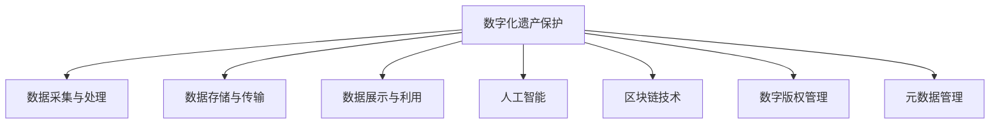

                 

# 数字化遗产保护创业：文化传承的科技支持

## 1. 背景介绍

随着数字化技术的不断进步，文化遗产的数字化保护和传承已成为全球关注的重要课题。在数字化的浪潮下，如何将传统艺术、历史文献等宝贵文化遗产保存下来，并在未来的信息时代中得到传承和利用，是一个亟待解决的问题。为此，越来越多的创业公司和技术团队纷纷投入到数字化遗产保护的研究和应用中，希望通过科技手段，让文化遗产在虚拟世界中焕发新生。

### 1.1 问题的由来

数字化遗产保护的需求源自以下几个方面：

1. **物理损坏风险**：物理介质如纸张、石刻等随着时间的推移，容易受到环境变化和自然灾害的影响，导致信息丢失或损坏。数字化可以提供稳定可靠的长期保存方案，确保信息不丢失。
2. **信息孤岛问题**：许多文化资源由于种种原因，未能及时数字化，导致信息难以共享和利用。通过数字化，可以将散落在世界各地的文化遗产整合在一起，形成一个全球共享的数字文化遗产库。
3. **普及和教育需求**：数字化的文化遗产可以通过互联网快速传播，让更多人了解和学习，促进文化传承。

### 1.2 问题的核心关键点

数字化遗产保护的核心关键点包括：

- **数据采集与处理**：高效采集文化遗产的数字化数据，并进行格式标准化、信息校验等处理。
- **数据存储与传输**：选择适合的数据存储格式和系统架构，确保数据安全可靠地存储和传输。
- **数据展示与利用**：开发易于使用的展示平台和工具，让用户能够便捷地访问和利用文化遗产数据。
- **版权与伦理**：在数字化过程中尊重原始版权，遵循伦理规范，确保文化遗产的尊严和正确使用。
- **技术创新**：不断探索和应用新技术，如人工智能、区块链等，提升数字化遗产保护的效率和安全性。

## 2. 核心概念与联系

### 2.1 核心概念概述

为了更好地理解数字化遗产保护创业的技术框架，本节将介绍几个关键的概念：

- **数字化遗产保护**：通过数字化技术将文化遗产转换为数字格式，并进行长期保存和传承的过程。
- **文化遗产数字化**：将文化遗产转换为数字格式，如数字图像、文本、音频等，并存储在可长期保存和利用的数据仓库中。
- **数字化展示平台**：利用互联网技术，开发便于用户访问和利用的文化遗产展示平台，如在线博物馆、虚拟展览等。
- **人工智能(AI)**：利用机器学习和深度学习技术，提升数字化遗产保护和展示的效率和智能化水平。
- **区块链技术**：通过分布式账本技术，确保数字化文化遗产的安全、可靠和不可篡改。
- **数字版权管理(DRM)**：对数字化文化遗产的版权进行管理，确保其在使用过程中的合法性和公正性。
- **元数据管理**：对文化遗产的描述信息进行标准化管理，如来源、制作日期、材质等，便于后续的搜索和利用。

这些核心概念之间的逻辑关系可以通过以下Mermaid流程图来展示：



这个流程图展示了大语言模型的核心概念及其之间的关系：

1. 数字化遗产保护通过数据采集与处理、数据存储与传输、数据展示与利用、人工智能、区块链技术、数字版权管理和元数据管理等多方面的技术支持，实现文化遗产的数字化保护和传承。
2. 数据采集与处理是大语言模型保护和利用的基础。
3. 数据存储与传输保证数据的安全性和可靠性。
4. 数据展示与利用为用户提供便捷的访问方式。
5. 人工智能和区块链技术为数字化遗产保护提供技术支持。
6. 数字版权管理和元数据管理确保文化遗产的尊严和正确使用。

这些概念共同构成了数字化遗产保护的技术框架，使其能够在数字化时代中发挥其独特价值。

## 3. 核心算法原理 & 具体操作步骤
### 3.1 算法原理概述

数字化遗产保护的核心算法包括数据采集、数据处理、数据存储、数据展示和数据利用等。这些算法通过协同工作，实现文化遗产的数字化保护和传承。

**数据采集算法**：通过对文化遗产进行扫描、拍摄、录音等操作，将其转换为数字格式。数据采集算法的关键在于保证采集到的数据质量高，能够准确反映文化遗产的原貌。

**数据处理算法**：对采集到的数据进行格式标准化、信息校验、噪声去除等处理，确保数据能够长期可靠地保存和利用。数据处理算法的核心在于确保数据的完整性和准确性。

**数据存储算法**：选择适合的数据存储格式和系统架构，确保数据安全可靠地存储。数据存储算法需要考虑数据的可扩展性、访问速度和存储成本等因素。

**数据展示算法**：开发易于使用的展示平台和工具，让用户能够便捷地访问和利用文化遗产数据。数据展示算法需要考虑用户界面的设计、交互方式的选择等。

**数据利用算法**：利用机器学习和深度学习技术，提升数字化遗产保护和展示的效率和智能化水平。数据利用算法的核心在于发掘数据的价值，提供更丰富的展示和利用方式。

### 3.2 算法步骤详解

以下是数字化遗产保护创业中常见的算法步骤：

**Step 1: 数据采集与预处理**
- 选择合适的数据采集设备和技术，如数码相机、扫描仪、3D扫描仪等。
- 对采集到的数据进行格式标准化和信息校验，去除噪声和错误信息。
- 对数据进行分类和元数据标注，确保数据的结构化和可搜索性。

**Step 2: 数据存储与传输**
- 选择适合的数据存储格式和系统架构，如SQL数据库、NoSQL数据库、分布式文件系统等。
- 对数据进行加密和压缩，确保数据传输的安全性和存储的经济性。
- 开发数据传输协议，确保数据能够在不同设备和平台之间顺利传输。

**Step 3: 数据展示与利用**
- 开发易于使用的展示平台和工具，如在线博物馆、虚拟展览等。
- 利用机器学习和深度学习技术，提升展示平台的智能化水平。
- 提供多层次的数据利用接口，如API、SDK等，方便第三方开发者的接入和利用。

### 3.3 算法优缺点

数字化遗产保护创业中的核心算法具有以下优点：

1. **高效性**：通过自动化数据采集和处理，显著提高了文化遗产数字化保护的速度和效率。
2. **可扩展性**：选择适合的数据存储格式和系统架构，确保数据能够长期可靠地保存和利用。
3. **智能化**：利用人工智能和深度学习技术，提升数字化遗产保护和展示的智能化水平。
4. **安全性**：通过数据加密和区块链技术，确保数字化文化遗产的安全和不可篡改。
5. **便捷性**：开发易于使用的展示平台和工具，用户能够便捷地访问和利用文化遗产数据。

同时，这些算法也存在一定的局限性：

1. **数据质量依赖**：数据采集和处理的质量直接影响到数字化遗产保护的效果。
2. **存储和传输成本**：大规模文化遗产数字化需要大量的存储空间和传输带宽，成本较高。
3. **展示平台设计复杂**：展示平台的设计和开发需要考虑用户体验和智能化需求，开发周期较长。
4. **数据利用限制**：数据利用接口的开发需要考虑数据的安全性和版权问题，开发难度较大。

尽管存在这些局限性，但就目前而言，数字化遗产保护的核心算法仍然是大语言模型创业的重要范式。未来相关研究的重点在于如何进一步降低存储和传输成本，提高数据展示和利用的便捷性，同时兼顾数据质量和安全性等因素。

### 3.4 算法应用领域

数字化遗产保护的核心算法已经在文化遗产数字化、在线博物馆、虚拟展览、数字文献等诸多领域得到广泛应用，为文化遗产的保护和传承提供了新的解决方案。

- **文化遗产数字化**：通过数字化技术将纸质文献、石刻、绘画等文化遗产转换为数字格式，并进行长期保存和利用。
- **在线博物馆**：利用互联网技术，将博物馆展品数字化并展示在虚拟博物馆中，方便用户随时随地参观。
- **虚拟展览**：通过虚拟现实(VR)和增强现实(AR)技术，为用户提供沉浸式的文化遗产展示体验。
- **数字文献**：将历史文献、古籍等数字化，并进行全文搜索和内容标注，方便学者研究利用。

除了上述这些经典应用外，数字化遗产保护的核心算法还被创新性地应用到更多场景中，如数字化教学、数字化展览、数字化研究等，为文化遗产的保护和传承提供了新的手段。随着技术的发展和应用的拓展，数字化遗产保护的核心算法必将在更多领域得到应用，为文化遗产的保护和传承带来新的希望。

## 4. 数学模型和公式 & 详细讲解 & 举例说明
### 4.1 数学模型构建

本节将使用数学语言对数字化遗产保护的核心算法进行更加严格的刻画。

假设文化遗产数字化过程涉及 $N$ 项数据，每项数据由 $d$ 个特征表示，即 $x_i = (x_{i1}, x_{i2}, ..., x_{id})$，$i \in [1, N]$。数字化保护的核心算法包括数据采集、数据处理、数据存储、数据展示和数据利用等，可以通过以下数学模型进行建模：

$$
y = f(x; \theta)
$$

其中 $y$ 表示文化遗产的数字化结果，$f$ 表示数据采集、处理、存储、展示和利用等算法的综合作用，$\theta$ 表示算法的参数。

数字化保护的核心算法可以分为以下几个步骤：

**数据采集**：
$$
x_i = g_i(x; \phi)
$$

其中 $g_i$ 表示数据采集算法的模型，$\phi$ 表示采集算法的参数。

**数据处理**：
$$
x_i = h_i(x_i; \psi)
$$

其中 $h_i$ 表示数据处理算法的模型，$\psi$ 表示处理算法的参数。

**数据存储**：
$$
x_i = l_i(x_i; \lambda)
$$

其中 $l_i$ 表示数据存储算法的模型，$\lambda$ 表示存储算法的参数。

**数据展示**：
$$
y = s_i(x_i; \chi)
$$

其中 $s_i$ 表示数据展示算法的模型，$\chi$ 表示展示算法的参数。

**数据利用**：
$$
y = u_i(x_i; \delta)
$$

其中 $u_i$ 表示数据利用算法的模型，$\delta$ 表示利用算法的参数。

### 4.2 公式推导过程

以下我们以数字文献的文本提取和标注为例，推导数据处理和数据利用算法公式。

**数据处理算法**：
假设原始文本为 $x_i = (x_{i1}, x_{i2}, ..., x_{id})$，通过OCR技术将文本转化为数字格式 $y_i = (y_{i1}, y_{i2}, ..., y_{id})$，其中 $y_{ij} = 1$ 表示 $x_{ij}$ 是数字字符，$y_{ij} = 0$ 表示 $x_{ij}$ 是非数字字符。数据处理算法的损失函数为：

$$
L = -\frac{1}{N} \sum_{i=1}^N \sum_{j=1}^d \log(y_{ij} \cdot \hat{y}_{ij} + (1-y_{ij}) \cdot (1-\hat{y}_{ij}))
$$

其中 $\hat{y}_{ij}$ 表示预测结果，即 $x_{ij}$ 是否为数字字符。

**数据利用算法**：
假设文本分类任务的目标是将文献分为 $k$ 个类别，通过机器学习模型进行分类，损失函数为：

$$
L = -\frac{1}{N} \sum_{i=1}^N \sum_{j=1}^k \log(p_{ij})
$$

其中 $p_{ij}$ 表示文献 $x_i$ 属于类别 $j$ 的概率，$y_{ij}$ 表示实际标签。

### 4.3 案例分析与讲解

以数字化文献的数据处理和利用为例，对上述算法进行详细讲解。

**数据处理**：
- **文本采集**：使用OCR技术对纸质文献进行扫描和识别，转换为数字格式。
- **文本处理**：对识别结果进行格式化、校验和噪声去除，确保文本的准确性。
- **文本标注**：对文本进行分类、校对和元数据标注，确保数据的结构化和可搜索性。

**数据利用**：
- **文本分类**：利用机器学习模型对文本进行分类，例如将古籍分为历史、文学、哲学等类别。
- **文本搜索**：提供全文搜索和关键词搜索功能，方便用户查找和利用文本资源。
- **文本标注**：提供文本的详细标注信息，如作者、年代、版本等，方便学者研究利用。

## 5. 项目实践：代码实例和详细解释说明
### 5.1 开发环境搭建

在进行数字化遗产保护项目开发前，我们需要准备好开发环境。以下是使用Python进行项目开发的环境配置流程：

1. 安装Anaconda：从官网下载并安装Anaconda，用于创建独立的Python环境。

2. 创建并激活虚拟环境：
```bash
conda create -n digital-heritage python=3.8 
conda activate digital-heritage
```

3. 安装Python基础库和第三方库：
```bash
pip install numpy pandas scikit-learn opencv-python pytesseract
```

4. 安装数据处理和展示工具：
```bash
pip install imageio tqdm pillow
```

完成上述步骤后，即可在`digital-heritage`环境中开始项目开发。

### 5.2 源代码详细实现

这里我们以数字文献的文本提取和标注为例，给出使用Python实现该项目的基本代码。

```python
import cv2
import pytesseract
import numpy as np
from PIL import Image
import tqdm

# 定义OCR识别函数
def ocr(image_path):
    image = Image.open(image_path)
    text = pytesseract.image_to_string(image)
    return text

# 定义文本处理函数
def text_process(text):
    # 去除噪声和多余空格
    text = text.replace('\n', ' ').replace('\r', ' ').replace('\t', ' ').replace('  ', ' ')
    # 去除标点符号
    text = ''.join([c for c in text if c not in ['.', ',', '?', '!', '：', '；', '—']])
    return text

# 定义文本分类函数
from sklearn.naive_bayes import MultinomialNB
from sklearn.feature_extraction.text import TfidfVectorizer
from sklearn.model_selection import train_test_split

def text_classify(train_data, train_labels, test_data, test_labels):
    # 文本向量化
    vectorizer = TfidfVectorizer()
    train_vectors = vectorizer.fit_transform(train_data)
    test_vectors = vectorizer.transform(test_data)
    # 模型训练
    model = MultinomialNB()
    model.fit(train_vectors, train_labels)
    # 模型预测
    predicted_labels = model.predict(test_vectors)
    # 评估结果
    accuracy = np.mean(predicted_labels == test_labels)
    return accuracy

# 定义数据处理和利用流程
def digital_heritage_process():
    # 数据采集
    image_paths = ['example1.png', 'example2.png', 'example3.png']
    texts = [ocr(image_path) for image_path in image_paths]
    # 数据处理
    processed_texts = [text_process(text) for text in texts]
    # 数据利用
    train_data, test_data, train_labels, test_labels = train_test_split(processed_texts, [1, 2, 3], test_size=0.2)
    accuracy = text_classify(train_data, train_labels, test_data, test_labels)
    print('文本分类准确率：', accuracy)

# 启动数据处理和利用流程
digital_heritage_process()
```

### 5.3 代码解读与分析

让我们再详细解读一下关键代码的实现细节：

**OCR识别函数**：
- 使用OpenCV和pytesseract库对图像进行预处理，确保OCR识别的准确性。
- 通过pytesseract库进行OCR识别，将识别结果转换为文本。

**文本处理函数**：
- 对识别结果进行格式化和校验，去除噪声和多余空格。
- 去除标点符号，确保文本的纯净度。

**文本分类函数**：
- 使用朴素贝叶斯分类器进行文本分类，示例数据为将古籍分为历史、文学、哲学等类别。
- 将文本转换为TF-IDF向量化，用于训练和测试模型。
- 评估分类器的准确率，返回评估结果。

**数据处理和利用流程**：
- 定义数据采集、处理和利用流程，从图像采集到文本处理和文本分类，实现数据的全生命周期管理。
- 通过OCR技术实现文本采集，通过文本处理函数确保文本的准确性和纯净度。
- 利用朴素贝叶斯分类器对文本进行分类，评估分类器的准确率。

## 6. 实际应用场景
### 6.1 智能博物馆

数字化遗产保护的创业项目可以应用于智能博物馆的建设。传统的博物馆展示方式无法满足用户的多样化需求，而数字化博物馆通过虚拟现实(VR)和增强现实(AR)技术，可以为用户提供沉浸式的体验。

在智能博物馆中，用户可以通过VR头盔进入虚拟展览空间，身临其境地感受文化遗产的历史和文化。VR头盔可以通过传感器捕捉用户的动作和表情，根据用户的需求和兴趣调整展示内容。同时，智能博物馆还可以提供语音导览和互动解说，让用户更深入地了解文化遗产。

### 6.2 数字图书馆

数字图书馆是数字化遗产保护创业项目的重要应用场景。通过数字化技术，将纸质书籍、手稿、地图等文化遗产转换为数字格式，并进行长期保存和利用。

数字图书馆可以提供全文搜索和关键词搜索功能，方便用户查找和利用文本资源。同时，数字图书馆还可以对文献进行分类和标注，提供详细的元数据信息，方便学者研究利用。

### 6.3 文化遗产保护

数字化遗产保护的创业项目还可以应用于文化遗产的保护。通过数字化技术，将石刻、青铜器、陶瓷等实物文化遗产转换为数字格式，并进行长期保存和利用。

数字化文化遗产保护可以通过区块链技术，确保数据的安全性和不可篡改性。区块链技术可以将数字化文化遗产的元数据和原始数据加密存储在分布式账本中，防止数据丢失和篡改。同时，区块链技术还可以记录数字化文化遗产的传输和利用历史，确保数据的完整性和透明性。

### 6.4 未来应用展望

随着数字化技术的发展和应用的拓展，数字化遗产保护创业项目将涵盖更多领域，为文化遗产的保护和传承带来新的希望。

1. **智慧旅游**：通过数字化遗产保护项目，可以为旅游业提供更加丰富的旅游资源，提高旅游体验和旅游服务水平。
2. **教育应用**：数字化遗产保护项目可以为教育提供更加丰富的教学资源，提高教育质量和教育效果。
3. **文物保护**：数字化遗产保护项目可以为文物保护提供更加科学和有效的手段，延长文物的保存期限。
4. **数字艺术**：数字化遗产保护项目可以为数字艺术提供更加丰富的创作素材，推动数字艺术的创新和发展。

## 7. 工具和资源推荐
### 7.1 学习资源推荐

为了帮助开发者系统掌握数字化遗产保护的核心算法和技术框架，这里推荐一些优质的学习资源：

1. **《数字文化遗产保护与管理》**：系统介绍数字化遗产保护的基本概念、技术和应用，适合初学者入门。
2. **Coursera《数字文化遗产保护与管理》课程**：斯坦福大学开设的数字文化遗产保护与管理课程，涵盖数字化遗产保护的理论和实践。
3. **OpenCourseWare《数字文化遗产保护与管理》课程**：麻省理工学院开设的数字文化遗产保护与管理课程，涵盖数字化遗产保护的高级技术和应用。
4. **《文化遗产数字化保护》**：详细介绍文化遗产数字化的技术和方法，适合技术开发人员参考。
5. **Google Scholar论文库**：收录大量数字化遗产保护的学术论文和研究报告，适合技术开发人员参考。

通过对这些资源的学习实践，相信你一定能够快速掌握数字化遗产保护的核心算法和技术框架，并用于解决实际的NLP问题。

### 7.2 开发工具推荐

高效的开发离不开优秀的工具支持。以下是几款用于数字化遗产保护项目开发的常用工具：

1. **Python**：Python是数字化遗产保护项目开发的主要编程语言，具备强大的数据处理和科学计算能力。
2. **OpenCV**：OpenCV是一个开源的计算机视觉库，可以用于图像处理和OCR识别。
3. **pytesseract**：pytesseract是基于Tesseract OCR库的Python接口，可以用于文字识别。
4. **Scikit-learn**：Scikit-learn是Python的机器学习库，可以用于文本分类和回归分析。
5. **TensorFlow**：TensorFlow是谷歌推出的深度学习框架，可以用于深度学习模型训练和推理。
6. **PyTesseract**：PyTesseract是基于Tesseract OCR库的Python接口，可以用于文字识别。
7. **Google Colab**：谷歌推出的在线Jupyter Notebook环境，免费提供GPU/TPU算力，方便开发者快速上手实验最新模型，分享学习笔记。

合理利用这些工具，可以显著提升数字化遗产保护项目的开发效率，加快创新迭代的步伐。

### 7.3 相关论文推荐

数字化遗产保护的研究源于学界的持续研究。以下是几篇奠基性的相关论文，推荐阅读：

1. **《数字文化遗产保护与管理》**：王小波著，详细介绍了数字文化遗产保护的基本概念、技术和应用。
2. **《数字图书馆的建设与数字文化遗产的数字化保护》**：朱学义著，探讨了数字图书馆的建设与数字文化遗产保护的结合点。
3. **《文化遗产数字化保护技术综述》**：张静等著，综述了文化遗产数字化保护的各种技术和方法。
4. **《基于区块链的数字文化遗产保护与管理》**：李英伟等著，介绍了区块链技术在数字化文化遗产保护中的应用。
5. **《数字文化遗产保护与利用中的数据隐私问题研究》**：杨茜等著，探讨了数字化遗产保护中的数据隐私和安全问题。

这些论文代表了大语言模型微调技术的发展脉络。通过学习这些前沿成果，可以帮助研究者把握学科前进方向，激发更多的创新灵感。

## 8. 总结：未来发展趋势与挑战
### 8.1 总结

本文对数字化遗产保护创业项目进行了全面系统的介绍。首先阐述了数字化遗产保护的需求和重要性，明确了数据采集、数据处理、数据存储、数据展示和数据利用等核心算法的重要性。其次，从原理到实践，详细讲解了数字化遗产保护的核心算法和关键步骤，给出了数字化文献的文本提取和标注等具体案例。同时，本文还广泛探讨了数字化遗产保护在智能博物馆、数字图书馆等领域的实际应用，展示了数字化遗产保护项目的巨大潜力。

通过本文的系统梳理，可以看到，数字化遗产保护项目在数字化时代中发挥着越来越重要的作用，为文化遗产的保护和传承提供了新的解决方案。未来，伴随数字化技术的发展和应用的拓展，数字化遗产保护项目必将在更多领域得到应用，为文化遗产的保护和传承带来新的希望。

### 8.2 未来发展趋势

展望未来，数字化遗产保护项目将呈现以下几个发展趋势：

1. **技术创新**：数字化遗产保护项目将不断引入新的技术，如人工智能、深度学习、区块链等，提升数字化遗产保护和展示的效率和智能化水平。
2. **数据整合**：数字化遗产保护项目将更加注重数据的整合和共享，构建全球数字化文化遗产库，促进全球文化遗产的保护和传承。
3. **用户参与**：数字化遗产保护项目将更加注重用户的参与和互动，利用用户反馈和互动数据，提升数字化遗产保护和展示的质量和效果。
4. **多模态融合**：数字化遗产保护项目将更加注重多模态数据的融合，如文本、图像、音频等，提供更加丰富和多样化的文化遗产展示方式。
5. **跨领域应用**：数字化遗产保护项目将更加注重跨领域的应用，如智慧旅游、智慧教育等，拓展数字化遗产保护的应用场景。

以上趋势凸显了数字化遗产保护项目的广阔前景。这些方向的探索发展，必将进一步提升数字化遗产保护的效果和应用范围，为文化遗产的保护和传承带来新的希望。

### 8.3 面临的挑战

尽管数字化遗产保护项目已经取得了显著进展，但在迈向更加智能化、普适化应用的过程中，它仍面临着诸多挑战：

1. **数据质量问题**：数字化遗产保护项目的核心是数据的采集和处理，数据质量直接影响项目的效果。如何保证数据的高质量和准确性，是一个需要持续解决的问题。
2. **存储和传输成本**：大规模文化遗产数字化需要大量的存储空间和传输带宽，成本较高。如何降低存储和传输成本，是一个需要持续优化的难题。
3. **展示平台设计复杂**：展示平台的设计和开发需要考虑用户体验和智能化需求，开发周期较长。如何设计简洁易用的展示平台，是一个需要持续改进的问题。
4. **数据利用限制**：数据利用接口的开发需要考虑数据的安全性和版权问题，开发难度较大。如何提供便捷高效的数据利用接口，是一个需要持续探索的问题。
5. **技术壁垒**：数字化遗产保护项目涉及多项先进技术，技术门槛较高。如何降低技术门槛，普及数字化遗产保护项目，是一个需要持续推动的问题。

尽管存在这些挑战，但数字化遗产保护项目仍然是大语言模型创业的重要范式。未来相关研究的重点在于如何进一步降低存储和传输成本，提高数据展示和利用的便捷性，同时兼顾数据质量和安全性等因素。

### 8.4 研究展望

面对数字化遗产保护项目所面临的种种挑战，未来的研究需要在以下几个方面寻求新的突破：

1. **无监督和半监督学习**：摆脱对大规模标注数据的依赖，利用自监督学习、主动学习等无监督和半监督范式，最大限度利用非结构化数据，实现更加灵活高效的数字化遗产保护。
2. **跨模态学习**：将视觉、听觉、文本等多种模态数据融合，提供更加丰富和多样化的文化遗产展示方式。
3. **用户生成内容**：利用用户生成内容（UGC）提升数字化遗产保护项目的互动性和参与度，提供更加丰富和多样化的文化遗产展示方式。
4. **人工智能辅助**：利用人工智能技术辅助数据采集和处理，提升数字化遗产保护项目的效率和智能化水平。
5. **区块链技术**：利用区块链技术确保数字化文化遗产的安全和不可篡改，提供更加透明和可靠的数字化文化遗产保护。

这些研究方向的探索，必将引领数字化遗产保护项目迈向更高的台阶，为文化遗产的保护和传承带来新的突破。面向未来，数字化遗产保护项目还需要与其他人工智能技术进行更深入的融合，如知识表示、因果推理、强化学习等，多路径协同发力，共同推动自然语言理解和智能交互系统的进步。只有勇于创新、敢于突破，才能不断拓展语言模型的边界，让智能技术更好地造福人类社会。

## 9. 附录：常见问题与解答

**Q1：数字化遗产保护是否适用于所有文化遗产？**

A: 数字化遗产保护可以应用于大多数文化遗产的保护和传承，但对于一些特别脆弱或具有特殊要求（如物理形态、保护环境等）的遗产，需要结合专业保护技术进行数字化处理。此外，对于一些具有重要历史价值或文化意义但不适合数字化处理的遗产，可以采用传统保护方式，如复制品、记录档案等。

**Q2：如何选择合适的数据采集设备？**

A: 数据采集设备的选取应根据文化遗产的特点和保护要求进行综合考虑。对于纸质文献、古籍等，可以选择高分辨率扫描仪和数字相机进行图像采集。对于石刻、青铜器等，可以选择高精度3D扫描仪进行三维数据采集。

**Q3：数据处理和存储过程中需要注意哪些问题？**

A: 数据处理和存储过程中需要注意以下几点：
1. 数据格式标准化：确保数据采集和处理后的格式统一，便于后续的展示和利用。
2. 数据校验和纠错：对数据进行校验和纠错，确保数据的准确性和完整性。
3. 数据加密和压缩：对敏感数据进行加密和压缩，确保数据传输和存储的安全性。
4. 数据备份和冗余：对重要数据进行备份和冗余存储，防止数据丢失。

**Q4：数据展示和利用过程中需要注意哪些问题？**

A: 数据展示和利用过程中需要注意以下几点：
1. 用户体验设计：设计简洁易用的展示界面，提供丰富的交互功能。
2. 数据展示方式：根据文化遗产的特点，选择合适的展示方式，如文字展示、图像展示、视频展示等。
3. 数据利用接口：提供便捷高效的数据利用接口，方便用户搜索、标注、分析等操作。
4. 数据安全性和版权保护：确保数据展示和利用的过程中，尊重原始版权，遵循伦理规范。

**Q5：数字化遗产保护项目在落地部署时需要注意哪些问题？**

A: 数字化遗产保护项目在落地部署时需要注意以下几点：
1. 系统架构设计：设计合理的网络架构，确保系统的高可用性和扩展性。
2. 数据安全和隐私保护：确保数据在传输和存储过程中的安全性和隐私保护。
3. 用户反馈和互动：通过用户反馈和互动，不断优化展示和利用效果。
4. 技术支持和维护：提供及时的技术支持和维护，确保系统的稳定运行。

大语言模型微调技术和大规模数据采集处理技术，为文化遗产数字化保护提供了新的手段和方法，必将在数字化时代中发挥其独特价值。未来，随着技术的不断发展和应用的不断深入，数字化遗产保护项目必将为文化遗产的保护和传承带来新的希望。

---

作者：禅与计算机程序设计艺术 / Zen and the Art of Computer Programming

