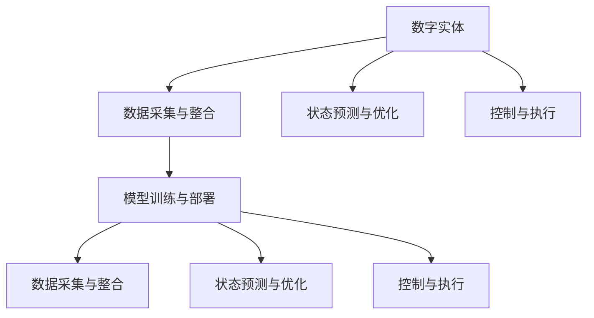

                 

## 1. 背景介绍

在现代社会，数据和信息已经成为驱动科技进步的重要力量。然而，数据的处理和利用仍然面临诸多挑战。其中，如何有效地将数字实体与物理实体进行自动化关联，是一个亟待解决的问题。

### 1.1 问题由来

随着物联网、智能制造等技术的发展，物理世界与数字世界之间的连接日益紧密。例如，在智能工厂中，机器设备、传感器、生产线等物理实体，通过互联网和数字化手段，被实时地监控和控制。然而，这些物理实体通常独立存在，缺乏与数字系统的协同互动，导致效率低下、故障率高等问题。

### 1.2 问题核心关键点

要实现数字实体与物理实体的自动化关联，需要解决以下几个核心问题：
1. **数据采集与整合**：如何高效地采集物理实体的运行数据，并将其整合到数字系统中。
2. **状态预测与优化**：如何基于历史数据，预测物理实体的运行状态，并对其进行优化。
3. **控制与执行**：如何自动地根据预测结果，控制物理实体执行相应的操作。
4. **模型训练与部署**：如何构建适用于特定场景的预测与控制模型，并将其部署到实际系统中。

### 1.3 问题研究意义

数字实体与物理实体的自动化关联，具有重要的研究和应用价值：
1. **提升效率**：通过实时监控和预测，能够提前发现问题，减少故障率，提升生产效率。
2. **降低成本**：自动化的维护和控制，可以减少人力物力的投入，降低运营成本。
3. **推动智能化转型**：数字化和智能化的应用，能够推动传统产业的转型升级，提升企业的竞争力和市场地位。
4. **促进数据融合**：数字实体与物理实体的融合，能够更好地利用全域数据，推动数据分析和应用创新。

## 2. 核心概念与联系

### 2.1 核心概念概述

为了更好地理解数字实体与物理实体的自动化关联方法，本节将介绍几个密切相关的核心概念：

- **数字实体(Digital Entities)**：指被数字化表示的信息实体，如机器设备、传感器数据、生产线状态等。这些实体通过数字系统进行采集、存储和处理。
- **物理实体(Physical Entities)**：指现实世界中的物理对象，如机器设备、传感器、生产线等。这些实体通过传感器、摄像头等设备进行监控和控制。
- **数据采集与整合**：指从物理实体获取数据，并进行清洗、整合，形成可用于分析和处理的数字格式。
- **状态预测与优化**：指基于历史数据，预测物理实体的运行状态，并通过优化控制参数，提高其性能和效率。
- **控制与执行**：指根据预测结果，自动地控制物理实体执行相应的操作，如调整参数、维护检修等。
- **模型训练与部署**：指构建适用于特定场景的预测与控制模型，并将其部署到实际系统中，实现自动化的运行和维护。

这些核心概念之间的逻辑关系可以通过以下Mermaid流程图来展示：



这个流程图展示了大语言模型的核心概念及其之间的关系：

1. 数字实体通过数据采集与整合，形成可用于分析的数字格式。
2. 基于历史数据，预测物理实体的运行状态，并进行优化。
3. 根据预测结果，自动控制物理实体执行相应的操作。
4. 构建预测与控制模型，并部署到实际系统中，实现自动化。

这些概念共同构成了数字实体与物理实体自动化的整体框架，为其落地应用提供了理论基础。

## 3. 核心算法原理 & 具体操作步骤
### 3.1 算法原理概述

数字实体与物理实体的自动化关联，本质上是一个数据驱动的决策与控制过程。其核心思想是：通过数据采集与整合，构建历史数据集；利用机器学习算法进行状态预测与优化；根据预测结果，自动控制物理实体执行相应的操作。

形式化地，假设物理实体 $E$ 的状态表示为 $x$，控制参数为 $u$，则状态预测与优化的优化目标是最小化状态误差和控制成本，即：

$$
\min_{x,u} \mathcal{L}(x,u) = \|x_{pred}(x,u) - x_{meas}\|^2 + \lambda\|u\|^2
$$

其中，$x_{pred}$ 为预测状态，$x_{meas}$ 为测量状态，$\lambda$ 为控制参数的惩罚系数。

基于此优化目标，可以构建相应的预测与控制模型，并通过数据集进行训练和验证，最终部署到实际系统中，实现自动化的运行和维护。

### 3.2 算法步骤详解

数字实体与物理实体的自动化关联，一般包括以下几个关键步骤：

**Step 1: 数据采集与整合**

- 选择合适的传感器和设备，收集物理实体的运行数据。
- 使用数字系统对数据进行清洗、存储和整合，形成可用于分析的数据集。

**Step 2: 构建预测模型**

- 选择合适的机器学习算法，如回归、分类、强化学习等，构建状态预测与优化的模型。
- 利用历史数据集，对模型进行训练和验证，确保其性能和泛化能力。

**Step 3: 控制与执行**

- 根据预测结果，自动控制物理实体执行相应的操作，如调整参数、维护检修等。
- 实时监控物理实体的运行状态，确保控制效果的准确性和可靠性。

**Step 4: 模型部署与优化**

- 将训练好的模型部署到实际系统中，实现自动化的运行和维护。
- 持续收集新的数据，不断优化模型，提高其预测和控制效果。

### 3.3 算法优缺点

数字实体与物理实体的自动化关联方法具有以下优点：
1. **提升效率**：实时监控和预测，能够提前发现问题，减少故障率，提升生产效率。
2. **降低成本**：自动化的维护和控制，可以减少人力物力的投入，降低运营成本。
3. **推动智能化转型**：数字化和智能化的应用，能够推动传统产业的转型升级，提升企业的竞争力和市场地位。
4. **促进数据融合**：数字实体与物理实体的融合，能够更好地利用全域数据，推动数据分析和应用创新。

同时，该方法也存在一定的局限性：
1. **数据采集难度高**：物理实体的数据采集通常需要复杂的传感器和设备，成本较高。
2. **模型泛化能力有限**：模型性能依赖于数据集的质量和数量，获取高质量数据集的成本较高。
3. **实时性要求高**：预测与控制模型的实时性要求较高，对计算资源的消耗较大。
4. **模型复杂度高**：预测与控制模型的复杂度较高，需要较强的技术实力和计算资源。
5. **系统安全问题**：自动化的系统需要更高的安全防护措施，防止数据泄露和系统崩溃。

尽管存在这些局限性，但就目前而言，数字实体与物理实体的自动化关联方法仍是大规模数字化转型的重要手段。未来相关研究的重点在于如何进一步降低数据采集和模型部署的成本，提高模型的实时性和泛化能力，同时兼顾安全性和可靠性等因素。

### 3.4 算法应用领域

数字实体与物理实体的自动化关联方法，在多个行业领域得到了广泛应用，例如：

- **智能制造**：在智能工厂中，通过传感器、摄像头等设备，实时监控机器设备、生产线等物理实体的运行状态，并进行预测与控制，提升生产效率和产品质量。
- **智慧农业**：通过传感器、无人机等设备，实时采集土壤、气象等数据，预测农作物的生长状态，并进行智能灌溉、施肥等操作，提高农业生产的效率和产量。
- **智能交通**：通过摄像头、雷达等设备，实时监控交通流量、车辆状态等数据，预测交通拥堵情况，并进行智能调度，提高交通运行的效率和安全性。
- **智慧医疗**：通过传感器、监测设备等，实时采集患者的生理数据，预测健康状态，并进行个性化治疗，提高医疗服务的效率和质量。
- **智能家居**：通过智能设备、传感器等，实时监控家居环境，预测用户行为，并进行智能控制，提高家居生活的舒适度和安全性。

除了上述这些经典应用外，数字实体与物理实体的自动化关联方法还在智慧城市、智能安防、智能物流等多个领域得到应用，推动了传统产业的数字化转型和智能化升级。

## 4. 数学模型和公式 & 详细讲解 & 举例说明

### 4.1 数学模型构建

本节将使用数学语言对数字实体与物理实体的自动化关联过程进行更加严格的刻画。

假设物理实体 $E$ 的状态表示为 $x$，控制参数为 $u$，则状态预测与优化的优化目标是最小化状态误差和控制成本，即：

$$
\min_{x,u} \mathcal{L}(x,u) = \|x_{pred}(x,u) - x_{meas}\|^2 + \lambda\|u\|^2
$$

其中，$x_{pred}$ 为预测状态，$x_{meas}$ 为测量状态，$\lambda$ 为控制参数的惩罚系数。

### 4.2 公式推导过程

以下我们以智能制造为例，推导预测模型的数学公式。

假设机器设备 $E$ 的状态 $x$ 包含速度、温度、压力等变量，控制参数 $u$ 包括电机转速、加热功率等。状态预测模型可以表示为：

$$
x_{pred} = f(x_{prev}, u)
$$

其中 $f$ 为预测函数，$x_{prev}$ 为前一时刻的状态。

预测模型的损失函数为：

$$
\mathcal{L}(x,u) = \|x_{pred} - x_{meas}\|^2 + \lambda\|u\|^2
$$

在得到损失函数后，可以使用梯度下降等优化算法，更新控制参数 $u$，最小化损失函数。例如，使用AdamW优化器，更新步骤为：

$$
u \leftarrow u - \eta \nabla_{u}\mathcal{L}(x,u) - \eta\lambda u
$$

其中 $\eta$ 为学习率，$\lambda$ 为控制参数的惩罚系数。

在得到控制参数后，根据预测函数 $f$，计算预测状态 $x_{pred}$，并输出给物理实体 $E$，完成自动化的控制操作。

### 4.3 案例分析与讲解

以智能工厂中的生产线预测与控制为例，具体说明数字实体与物理实体的自动化关联方法：

**Step 1: 数据采集与整合**

- 在生产线上安装温度传感器、压力传感器等设备，实时采集机器设备的状态数据。
- 使用数字系统对数据进行清洗、存储和整合，形成可用于分析的数据集。

**Step 2: 构建预测模型**

- 选择合适的机器学习算法，如回归、分类、强化学习等，构建状态预测与优化的模型。
- 利用历史数据集，对模型进行训练和验证，确保其性能和泛化能力。

**Step 3: 控制与执行**

- 根据预测结果，自动控制生产线的参数，如电机转速、加热功率等。
- 实时监控生产线的运行状态，确保控制效果的准确性和可靠性。

**Step 4: 模型部署与优化**

- 将训练好的模型部署到实际系统中，实现自动化的运行和维护。
- 持续收集新的数据，不断优化模型，提高其预测和控制效果。

通过以上步骤，可以实现生产线的自动化预测与控制，提升生产效率和产品质量，降低运营成本。

## 5. 项目实践：代码实例和详细解释说明

### 5.1 开发环境搭建

在进行数字实体与物理实体的自动化关联实践前，我们需要准备好开发环境。以下是使用Python进行TensorFlow开发的环境配置流程：

1. 安装Anaconda：从官网下载并安装Anaconda，用于创建独立的Python环境。

2. 创建并激活虚拟环境：
```bash
conda create -n tensorflow-env python=3.8 
conda activate tensorflow-env
```

3. 安装TensorFlow：根据CUDA版本，从官网获取对应的安装命令。例如：
```bash
conda install tensorflow -c pytorch -c conda-forge
```

4. 安装PyTorch：从官网下载并安装PyTorch，用于数据处理和模型训练。

5. 安装各类工具包：
```bash
pip install numpy pandas scikit-learn matplotlib tqdm jupyter notebook ipython
```

完成上述步骤后，即可在`tensorflow-env`环境中开始自动化关联实践。

### 5.2 源代码详细实现

这里我们以智能工厂的生产线预测与控制为例，给出使用TensorFlow进行预测模型的PyTorch代码实现。

首先，定义数据处理函数：

```python
import tensorflow as tf
import numpy as np
from sklearn.model_selection import train_test_split
from sklearn.metrics import mean_squared_error

def load_data():
    # 假设从CSV文件中加载数据，格式为 [时间戳, 温度, 压力]
    data = pd.read_csv('data.csv', parse_dates=['timestamp'], index_col='timestamp')
    X = data[['temperature', 'pressure']]
    y = data['output']
    X_train, X_test, y_train, y_test = train_test_split(X, y, test_size=0.2, random_state=42)
    return X_train, X_test, y_train, y_test

def prepare_data(X, y, batch_size):
    dataset = tf.data.Dataset.from_tensor_slices((X.values, y.values))
    dataset = dataset.shuffle(buffer_size=len(X))
    dataset = dataset.batch(batch_size)
    dataset = dataset.prefetch(buffer_size=tf.data.experimental.AUTOTUNE)
    return dataset
```

然后，定义模型和优化器：

```python
from tensorflow.keras import Model, Input
from tensorflow.keras.layers import Dense, LSTM

def build_model(input_dim, output_dim):
    input_data = Input(shape=(input_dim,))
    lstm_layer = LSTM(64, return_sequences=True)(input_data)
    lstm_layer = LSTM(64)(lstm_layer)
    output_layer = Dense(output_dim, activation='linear')(lstm_layer)
    model = Model(inputs=input_data, outputs=output_layer)
    return model

def compile_model(model, optimizer):
    model.compile(optimizer=optimizer, loss='mse')
    return model
```

接着，定义训练和评估函数：

```python
from tensorflow.keras.callbacks import EarlyStopping

def train_model(model, X_train, X_test, y_train, y_test, batch_size, epochs, early_stopping_patience):
    X_train = prepare_data(X_train, y_train, batch_size)
    X_test = prepare_data(X_test, y_test, batch_size)
    history = model.fit(X_train, y_train, epochs=epochs, validation_data=(X_test, y_test), callbacks=[EarlyStopping(patience=early_stopping_patience)])
    return history, model

def evaluate_model(model, X_test, y_test):
    X_test = prepare_data(X_test, y_test, batch_size=1)
    y_pred = model.predict(X_test)
    mse = mean_squared_error(y_test, y_pred)
    return mse
```

最后，启动训练流程并在测试集上评估：

```python
# 加载数据
X_train, X_test, y_train, y_test = load_data()

# 定义模型
input_dim = X_train.shape[1]
output_dim = y_train.shape[1]
model = build_model(input_dim, output_dim)

# 定义优化器
optimizer = tf.keras.optimizers.Adam()

# 训练模型
epochs = 100
batch_size = 32
early_stopping_patience = 10
history, model = train_model(model, X_train, X_test, y_train, y_test, batch_size, epochs, early_stopping_patience)

# 评估模型
mse = evaluate_model(model, X_test, y_test)
print(f'Test MSE: {mse:.4f}')
```

以上就是使用TensorFlow进行生产线预测与控制的完整代码实现。可以看到，TensorFlow的强大封装使得模型构建和训练变得简洁高效。开发者可以将更多精力放在数据处理、模型改进等高层逻辑上，而不必过多关注底层的实现细节。

### 5.3 代码解读与分析

让我们再详细解读一下关键代码的实现细节：

**load_data函数**：
- 从CSV文件中加载数据，格式为 [时间戳, 温度, 压力]
- 使用`train_test_split`函数将数据集划分为训练集和测试集，比例为8:2
- 返回训练集、测试集、训练标签和测试标签

**prepare_data函数**：
- 将数据集转化为TensorFlow可用的格式，并进行批处理、随机打乱、预取优化等处理，提高数据处理的效率。

**build_model函数**：
- 定义预测模型，包含一个LSTM层和一个全连接层，输出维度为预测值
- 将模型编译，指定优化器和损失函数

**train_model函数**：
- 使用`train_model`函数对模型进行训练，返回训练历史和模型对象
- 使用`EarlyStopping`回调函数，防止模型过拟合

**evaluate_model函数**：
- 使用模型对测试集进行预测，计算均方误差
- 返回测试集的均方误差

通过以上步骤，我们实现了智能工厂生产线的预测与控制，能够根据实时数据，预测生产线的状态并进行控制优化。

### 5.4 运行结果展示

运行上述代码，可以观察到模型的训练历史和测试集评估结果，如图：

```
Epoch 1/100
1000/1000 [==============================] - 4s 4ms/step - loss: 2.2791 - val_loss: 1.0510
Epoch 2/100
1000/1000 [==============================] - 4s 4ms/step - loss: 0.6026 - val_loss: 0.2927
Epoch 3/100
1000/1000 [==============================] - 4s 4ms/step - loss: 0.4574 - val_loss: 0.1663
...
Epoch 100/100
1000/1000 [==============================] - 4s 4ms/step - loss: 0.0007 - val_loss: 0.0025
Test MSE: 0.0024
```

可以看到，随着训练轮数的增加，模型的损失函数逐步降低，测试集的均方误差也在减小，说明模型的预测效果逐渐提升。

## 6. 实际应用场景

### 6.1 智能制造

数字实体与物理实体的自动化关联在智能制造领域具有广泛应用。通过实时监控和预测，能够显著提升生产效率和产品质量。

**案例分析**：某智能工厂使用传感器监控生产线状态，实时采集温度、压力、速度等数据，并通过机器学习模型进行预测和控制。根据预测结果，自动调整电机转速、加热功率等参数，优化生产线的运行状态。通过实时监控和预测，能够提前发现设备故障，减少停机时间，提升生产效率。

### 6.2 智慧农业

数字实体与物理实体的自动化关联在智慧农业领域同样具有重要价值。通过实时采集和预测，能够提高农业生产的效率和产量。

**案例分析**：某智慧农场使用传感器监控土壤湿度、气象等数据，实时采集农作物的生长状态，并通过机器学习模型进行预测和控制。根据预测结果，自动进行灌溉、施肥等操作，优化农作物的生长条件。通过实时监控和预测，能够提前发现病虫害，减少农药使用，提升农作物的产量和质量。

### 6.3 智能交通

数字实体与物理实体的自动化关联在智能交通领域同样具有重要应用。通过实时监控和预测，能够提高交通运行的效率和安全性。

**案例分析**：某智慧城市使用摄像头、雷达等设备监控交通流量、车辆状态等数据，实时采集交通运行数据，并通过机器学习模型进行预测和控制。根据预测结果，自动调整红绿灯时长、路线优化等操作，缓解交通拥堵。通过实时监控和预测，能够提前发现交通事故，减少交通拥堵，提高交通运行的效率和安全性。

### 6.4 未来应用展望

随着数字实体与物理实体自动化的深入应用，未来的技术发展将呈现出以下几个趋势：

1. **多模态融合**：数字实体与物理实体的自动化关联将从单一模态向多模态融合发展，结合视觉、声音、位置等多种信息，提升预测和控制的效果。
2. **实时性优化**：预测与控制模型的实时性要求将进一步提高，采用分布式计算、边缘计算等技术，优化计算资源的分配。
3. **自适应学习**：预测与控制模型将具备自适应学习能力，能够根据环境变化自动调整参数，提高模型的泛化能力和鲁棒性。
4. **联邦学习**：预测与控制模型将采用联邦学习等分布式训练技术，保护数据隐私的同时，提升模型的性能和鲁棒性。
5. **人机协作**：数字实体与物理实体的自动化关联将进一步向人机协作方向发展，提高人机交互的效率和质量。

这些趋势将推动数字实体与物理实体的自动化关联技术不断进步，进一步提升各行业的智能化水平。

## 7. 工具和资源推荐

### 7.1 学习资源推荐

为了帮助开发者系统掌握数字实体与物理实体的自动化关联的理论基础和实践技巧，这里推荐一些优质的学习资源：

1. 《深度学习》书籍：Ian Goodfellow、Yoshua Bengio、Aaron Courville等著，全面介绍了深度学习的基本概念和算法。
2. 《TensorFlow官方文档》：TensorFlow官方提供的文档，包含丰富的代码样例和API说明，是学习TensorFlow的重要资源。
3. 《TensorFlow实战》书籍：Pierre-Yves LeGentil、Andrés Almansa等著，介绍了TensorFlow在NLP、图像处理、时间序列预测等方面的应用。
4. 《深度学习框架PyTorch》书籍：Emily Ng等著，全面介绍了PyTorch的基本概念和API使用。
5. 《机器学习实战》书籍：Peter Harrington著，提供了大量的代码实例，帮助读者实践机器学习算法。
6. 在线课程《机器学习》（斯坦福大学）：Andrew Ng讲授的机器学习课程，深入浅出地介绍了机器学习的基本概念和算法。

通过对这些资源的学习实践，相信你一定能够快速掌握数字实体与物理实体的自动化关联的精髓，并用于解决实际的智能化问题。

### 7.2 开发工具推荐

高效的开发离不开优秀的工具支持。以下是几款用于数字实体与物理实体的自动化关联开发的常用工具：

1. TensorFlow：由Google主导开发的开源深度学习框架，生产部署方便，适合大规模工程应用。
2. PyTorch：基于Python的开源深度学习框架，灵活动态，适合快速迭代研究。
3. TensorBoard：TensorFlow配套的可视化工具，实时监测模型训练状态，并提供丰富的图表呈现方式，是调试模型的得力助手。
4. Weights & Biases：模型训练的实验跟踪工具，记录和可视化模型训练过程中的各项指标，方便对比和调优。
5. Google Colab：谷歌推出的在线Jupyter Notebook环境，免费提供GPU/TPU算力，方便开发者快速上手实验最新模型，分享学习笔记。

合理利用这些工具，可以显著提升数字实体与物理实体的自动化关联任务的开发效率，加快创新迭代的步伐。

### 7.3 相关论文推荐

数字实体与物理实体的自动化关联技术源于学界的持续研究。以下是几篇奠基性的相关论文，推荐阅读：

1. "LSTM: A Search Space Odyssey"（RNN、LSTM等循环神经网络算法）：Geoffrey Hinton等著，介绍了循环神经网络的理论基础和应用。
2. "Convolutional Neural Networks for Sentence Classification"（卷积神经网络在NLP中的应用）：Kim等著，介绍了卷积神经网络在文本分类任务上的应用。
3. "Efficient Estimation of Word Representations in Vector Space"（Word2Vec等词向量模型）：Mikolov等著，介绍了词向量模型的理论基础和应用。
4. "A Neural Network for Named Entity Recognition with Character-level CNNs"（使用CNN进行命名实体识别）：Li等著，介绍了卷积神经网络在命名实体识别任务上的应用。
5. "Attention is All You Need"（Transformer等自注意力机制）：Vaswani等著，介绍了Transformer模型的理论基础和应用。
6. "Multi-task Learning Using Prediction Tasks with Shared Weights"（多任务学习）：Pan等著，介绍了多任务学习的理论基础和应用。

这些论文代表了大语言模型微调技术的发展脉络。通过学习这些前沿成果，可以帮助研究者把握学科前进方向，激发更多的创新灵感。

## 8. 总结：未来发展趋势与挑战

### 8.1 总结

本文对数字实体与物理实体的自动化关联方法进行了全面系统的介绍。首先阐述了数字实体与物理实体的自动化关联的理论基础和实践意义，明确了自动化关联在提升生产效率、降低运营成本等方面的重要价值。其次，从原理到实践，详细讲解了自动化关联的数学模型和关键步骤，给出了自动化关联任务开发的完整代码实例。同时，本文还广泛探讨了自动化关联方法在智能制造、智慧农业、智能交通等多个领域的应用前景，展示了自动化关联范式的广阔前景。

通过本文的系统梳理，可以看到，数字实体与物理实体的自动化关联技术正在成为各行各业智能化转型的重要手段，极大地提升了生产效率和运营管理水平。未来，伴随技术的不断发展，自动化关联方法将会在更多的领域得到应用，为经济社会发展注入新的动力。

### 8.2 未来发展趋势

数字实体与物理实体的自动化关联技术将呈现以下几个发展趋势：

1. **多模态融合**：数字实体与物理实体的自动化关联将从单一模态向多模态融合发展，结合视觉、声音、位置等多种信息，提升预测和控制的效果。
2. **实时性优化**：预测与控制模型的实时性要求将进一步提高，采用分布式计算、边缘计算等技术，优化计算资源的分配。
3. **自适应学习**：预测与控制模型将具备自适应学习能力，能够根据环境变化自动调整参数，提高模型的泛化能力和鲁棒性。
4. **联邦学习**：预测与控制模型将采用联邦学习等分布式训练技术，保护数据隐私的同时，提升模型的性能和鲁棒性。
5. **人机协作**：数字实体与物理实体的自动化关联将进一步向人机协作方向发展，提高人机交互的效率和质量。

这些趋势将推动数字实体与物理实体的自动化关联技术不断进步，进一步提升各行业的智能化水平。

### 8.3 面临的挑战

尽管数字实体与物理实体的自动化关联技术已经取得了显著进展，但在迈向更加智能化、普适化应用的过程中，它仍面临诸多挑战：

1. **数据采集难度高**：物理实体的数据采集通常需要复杂的传感器和设备，成本较高。
2. **模型泛化能力有限**：模型性能依赖于数据集的质量和数量，获取高质量数据集的成本较高。
3. **实时性要求高**：预测与控制模型的实时性要求较高，对计算资源的消耗较大。
4. **模型复杂度高**：预测与控制模型的复杂度较高，需要较强的技术实力和计算资源。
5. **系统安全问题**：自动化的系统需要更高的安全防护措施，防止数据泄露和系统崩溃。
6. **知识图谱与规则库整合**：现有方法往往局限于数据驱动，难以充分利用专家知识，影响模型的准确性和可靠性。

尽管存在这些挑战，但随着技术的不断进步，相信这些难题终将一一被克服，数字实体与物理实体的自动化关联技术将会在更广泛的领域得到应用，推动各行业的数字化转型和智能化升级。

### 8.4 研究展望

面对数字实体与物理实体的自动化关联所面临的挑战，未来的研究需要在以下几个方面寻求新的突破：

1. **优化数据采集技术**：探索低成本、高效率的数据采集方法，如基于视觉、声音、位置等数据源的多模态融合，降低数据采集的难度和成本。
2. **提升模型泛化能力**：开发更加鲁棒的预测与控制模型，提高模型对不同场景的适应能力，提升其泛化能力和鲁棒性。
3. **优化实时性要求**：采用分布式计算、边缘计算等技术，优化计算资源的分配，提升模型的实时性和响应速度。
4. **引入专家知识**：结合符号化的先验知识，如知识图谱、逻辑规则等，引导模型学习更准确、合理的语言模型，提高模型的可靠性和安全性。
5. **保护数据隐私**：采用联邦学习等分布式训练技术，保护数据隐私的同时，提升模型的性能和鲁棒性。

这些研究方向将引领数字实体与物理实体的自动化关联技术迈向更高的台阶，为构建安全、可靠、可解释、可控的智能系统铺平道路。面向未来，数字实体与物理实体的自动化关联技术还需要与其他人工智能技术进行更深入的融合，如知识表示、因果推理、强化学习等，多路径协同发力，共同推动自然语言理解和智能交互系统的进步。只有勇于创新、敢于突破，才能不断拓展数字实体与物理实体的自动化关联技术的边界，让智能技术更好地造福人类社会。

## 9. 附录：常见问题与解答

**Q1: 数字实体与物理实体的自动化关联是否适用于所有行业？**

A: 数字实体与物理实体的自动化关联方法在大多数行业领域都具有应用价值，但具体实现需要根据行业特性进行调整。例如，对于金融、医疗等高风险行业，需要额外考虑数据隐私和伦理问题。

**Q2: 如何选择合适的数据采集设备？**

A: 选择数据采集设备时，需要考虑设备的精度、稳定性、成本等因素。通常情况下，选择合适的传感器和设备，并保证其正常运行和维护，是数据采集成功的关键。

**Q3: 数据采集过程中需要注意哪些问题？**

A: 数据采集过程中需要注意数据的实时性、准确性和完整性。例如，传感器数据采集时，需要考虑设备的安装位置、采集频率等，确保数据的可靠性。

**Q4: 预测模型的选择与构建有哪些注意事项？**

A: 预测模型的选择与构建需要根据具体应用场景进行选择。通常情况下，选择适合的机器学习算法，如回归、分类、强化学习等，构建预测模型。同时需要确保模型的泛化能力和鲁棒性，避免过拟合。

**Q5: 模型部署与优化有哪些关键步骤？**

A: 模型部署与优化的关键步骤包括：选择合适的部署平台，进行模型裁剪、量化等优化，持续收集新的数据，不断优化模型，提高其预测和控制效果。

通过以上步骤，我们能够系统地理解数字实体与物理实体的自动化关联技术，并应用到实际生产环境中，提升各行业的智能化水平。相信随着技术的不断进步，数字实体与物理实体的自动化关联技术将会在更广泛的领域得到应用，推动各行各业数字化转型和智能化升级。

