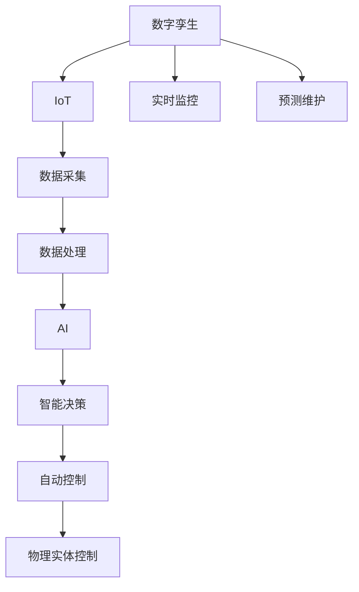

                 

## 1. 背景介绍

在当今数字化转型加速的时代，数字实体与物理实体的自动化已成为工业界和学术界关注的焦点。数字实体（Digital Entities）通常指虚拟世界中的对象、程序、数据等，而物理实体（Physical Entities）则包括现实世界中的各种实体，如机器、设备、物品等。这种自动化技术的目标是实现数字实体与物理实体之间更高效、更智能的互动和控制，从而提升生产效率、降低运营成本，并在复杂系统中实现更高的精度和响应速度。

### 1.1 问题由来

随着物联网（IoT）、工业4.0、智慧城市等概念的兴起，数字化和自动化技术的应用场景日益广泛。数字实体与物理实体的自动化需求在多个领域中愈发显著：

- **制造业**：通过数字孪生技术，实现对物理实体的实时监控和预测维护，减少设备故障，提高生产效率。
- **能源行业**：利用智能电网、能源管理系统等，对物理实体的运行状态进行精细化管理和优化。
- **交通系统**：通过智能交通系统、自动驾驶等技术，实现对物理实体的智能调度和管理。
- **医疗健康**：通过远程监控、智能诊断系统等，提高医疗服务的精准度和效率。
- **城市管理**：通过智能传感器、大数据分析等技术，实现对城市运行状态的实时监测和控制。

### 1.2 问题核心关键点

数字实体与物理实体的自动化面临以下核心挑战：

- **数据融合**：如何高效地整合和处理来自物理实体的数据，如传感器数据、摄像头图像等，并与数字实体进行无缝对接。
- **智能决策**：如何构建基于机器学习和人工智能的模型，实现对物理实体的智能控制和决策。
- **系统安全**：如何确保自动化的安全性和可靠性，避免数据泄露、系统崩溃等风险。
- **用户体验**：如何设计用户友好的交互界面，提升系统的可用性和接受度。
- **多模态融合**：如何实现不同类型数据（如文本、图像、视频）的融合和交互。

解决这些核心问题，需要跨学科的协作和技术融合，涉及计算机科学、控制工程、机械工程、电子工程、物理学等多个领域。

## 2. 核心概念与联系

### 2.1 核心概念概述

为了更好地理解数字实体与物理实体的自动化过程，我们首先定义一些核心概念：

- **数字孪生（Digital Twin）**：一个虚拟的数字模型，反映物理实体的全部或部分状态和行为。通过数字孪生技术，可以实现对物理实体的实时监控和预测。
- **物联网（IoT）**：通过传感器、嵌入式系统等技术，将物理实体连接到互联网，实现数据的采集和传输。
- **人工智能（AI）**：通过机器学习和深度学习等技术，构建智能模型，实现对数据的高效处理和决策。
- **自动控制（Automatic Control）**：使用算法对物理系统进行自动调节和控制，实现精确的动态响应。

这些概念之间具有紧密的联系，共同构成了数字实体与物理实体自动化的基础。例如，数字孪生依赖于IoT技术获取物理实体数据，通过AI技术进行数据处理和决策，最终由自动控制技术实现对物理实体的实时调控。

### 2.2 核心概念原理和架构的 Mermaid 流程图



这个流程图展示了数字实体与物理实体自动化的基本架构，从数据采集、处理到智能决策、控制，各个环节相互连接，形成一个闭环系统。

## 3. 核心算法原理 & 具体操作步骤

### 3.1 算法原理概述

数字实体与物理实体的自动化主要依赖于以下几个核心算法：

- **数据融合算法**：用于整合来自不同来源、不同格式的数据，形成一个统一的数据集。常用的数据融合算法包括卡尔曼滤波、粒子滤波等。
- **智能决策算法**：基于机器学习和深度学习的模型，对数据进行分析和决策。常用的算法包括决策树、随机森林、深度神经网络等。
- **自动控制算法**：用于对物理系统进行实时控制和调节。常用的控制算法包括PID控制器、模型预测控制（MPC）等。
- **自然语言处理（NLP）算法**：用于处理来自人类用户的指令和反馈，实现人机交互。常用的NLP算法包括自然语言理解（NLU）、自然语言生成（NLG）等。

这些算法在数字实体与物理实体的自动化中发挥着重要作用，共同构成了自动化系统的核心功能模块。

### 3.2 算法步骤详解

数字实体与物理实体的自动化通常包含以下几个步骤：

1. **数据采集与预处理**：通过传感器、摄像头、RFID等技术，从物理实体采集数据。对采集的数据进行去噪、归一化、数据补全等预处理，以提高数据质量。

2. **数据融合**：将来自不同传感器、不同时间、不同维度的数据进行整合，形成一个统一的数据集。常用的数据融合算法包括卡尔曼滤波、粒子滤波等。

3. **智能决策**：基于机器学习和深度学习的模型，对融合后的数据进行分析和决策。常用的模型包括决策树、随机森林、深度神经网络等。

4. **自动控制**：通过自动控制算法，对物理系统进行实时控制和调节。常用的控制算法包括PID控制器、模型预测控制（MPC）等。

5. **人机交互**：通过自然语言处理（NLP）算法，处理来自人类用户的指令和反馈，实现人机交互。常用的NLP算法包括自然语言理解（NLU）、自然语言生成（NLG）等。

6. **系统集成与优化**：将上述各模块集成到自动化系统中，通过优化算法（如遗传算法、粒子群优化等）对系统进行整体优化。

### 3.3 算法优缺点

数字实体与物理实体的自动化算法具有以下优点：

- **高效处理数据**：通过数据融合和智能决策算法，能够高效处理大量数据，实现对物理系统的精细化管理。
- **实时响应**：通过自动控制算法，能够实现对物理系统的实时响应和调控，提高系统的动态性能。
- **人机交互友好**：通过自然语言处理算法，能够实现直观、易用的用户交互界面，提升用户体验。

然而，这些算法也存在一些缺点：

- **数据质量依赖性高**：算法的效果很大程度上依赖于数据的质量和完整性，数据采集和预处理环节出现问题可能导致系统失效。
- **模型复杂度大**：复杂的机器学习模型和自动控制算法，需要大量的计算资源和数据量，对硬件和算力提出了较高要求。
- **模型可解释性差**：许多现代机器学习模型如深度神经网络等，具有"黑盒"性质，难以解释其内部工作机制。

### 3.4 算法应用领域

数字实体与物理实体的自动化算法已经在多个领域得到了广泛应用：

- **制造业**：通过数字孪生技术，实现对物理设备的实时监控和预测维护，提高生产效率，降低设备故障率。
- **能源行业**：利用智能电网、能源管理系统，实现对物理设备运行状态的精细化管理和优化。
- **交通系统**：通过智能交通系统、自动驾驶技术，实现对交通流的智能调度和管理，提升交通效率。
- **医疗健康**：通过远程监控、智能诊断系统，提高医疗服务的精准度和效率。
- **城市管理**：通过智能传感器、大数据分析，实现对城市运行状态的实时监测和控制，提升城市管理水平。

## 4. 数学模型和公式 & 详细讲解 & 举例说明

### 4.1 数学模型构建

数字实体与物理实体的自动化涉及多个数学模型，以下我们以一个简单的控制系统为例，构建基本的数学模型。

设物理系统的状态向量为 $\mathbf{x}(t)$，控制量为 $u(t)$，输出量为 $y(t)$，系统的状态方程和输出方程分别为：

$$
\dot{\mathbf{x}}(t) = f(\mathbf{x}(t), u(t))
$$

$$
y(t) = h(\mathbf{x}(t))
$$

其中，$f$ 和 $h$ 分别表示状态方程和输出方程的非线性函数。

### 4.2 公式推导过程

对于线性系统，假设状态方程和输出方程分别为：

$$
\dot{\mathbf{x}}(t) = A\mathbf{x}(t) + B u(t)
$$

$$
y(t) = C\mathbf{x}(t) + D u(t)
$$

其中，$A$、$B$、$C$、$D$ 为系统的状态矩阵、控制矩阵、输出矩阵和反馈矩阵。

通过对上述方程进行拉普拉斯变换，可得到系统的传递函数：

$$
G(s) = \frac{Y(s)}{U(s)} = \frac{C(sI-A) + D}{sI-A}
$$

其中，$I$ 为单位矩阵，$A$、$B$、$C$、$D$ 的拉普拉斯变换分别为 $A(s)$、$B(s)$、$C(s)$、$D(s)$。

### 4.3 案例分析与讲解

以一个简单的PID控制器为例，分析其工作原理和参数设置方法。

PID控制器是一种常用的自动控制算法，其控制律为：

$$
u(t) = K_p e(t) + K_i \int_0^t e(\tau) d\tau + K_d \dot{e}(t)
$$

其中，$K_p$、$K_i$、$K_d$ 分别为比例、积分和微分参数，$e(t) = r(t) - y(t)$ 为误差。

通过设置合适的 $K_p$、$K_i$、$K_d$，可以实现对系统的精确控制。PID控制器参数的优化通常采用试凑法或自适应算法，例如基于模型的PID参数自适应算法（MPC-PID）等。

## 5. 项目实践：代码实例和详细解释说明

### 5.1 开发环境搭建

要实现数字实体与物理实体的自动化，首先需要搭建一个开发环境。以下是一个Python开发环境搭建的步骤：

1. 安装Anaconda：从官网下载并安装Anaconda，用于创建独立的Python环境。

2. 创建并激活虚拟环境：
```bash
conda create -n autocomp/env python=3.8 
conda activate autocomp/env
```

3. 安装必要的Python库：
```bash
pip install numpy scipy matplotlib pandas scikit-learn jupyter notebook
```

4. 安装机器学习和深度学习库：
```bash
pip install scikit-learn tensorflow keras
```

5. 安装自动控制库：
```bash
pip install control librosa
```

完成上述步骤后，即可在`autocomp/env`环境中开始项目开发。

### 5.2 源代码详细实现

以下是一个基于PID控制器的简单的Python代码实现，用于控制一个物理系统：

```python
import numpy as np
import matplotlib.pyplot as plt
from scipy.integrate import odeint

# 定义状态方程和控制律
def f(x, u, t):
    return np.array([x[0] + 2*x[1] + 3*u, 2*x[0] - x[1] - 5*u])

def u(t, x):
    return -2*x[0] - x[1] + 3

# 定义初始状态和控制参数
x0 = np.array([1.0, 1.0])
Kp = 2.0
Ki = 0.1
Kd = 0.001
dt = 0.01
T = 10.0

# 定义求解器
def simulate():
    # 创建时间数组
    t = np.arange(0.0, T, dt)
    
    # 创建状态数组
    x = np.zeros((len(t), 2))
    x[0] = x0
    
    # 计算状态和控制律
    for i in range(1, len(t)):
        x[i] = x[i-1] + dt*f(x[i-1], u(t[i-1], x[i-1]))
        u[i-1] = u(t[i-1], x[i-1])
    
    # 绘制状态轨迹
    plt.plot(t, x[:,0], 'r-', label='x')
    plt.plot(t, x[:,1], 'b-', label='y')
    plt.legend()
    plt.xlabel('Time')
    plt.ylabel('State')
    plt.show()

# 运行模拟
simulate()
```

这个代码实现了一个简单的PID控制器，用于控制一个线性二阶系统的状态。通过调整控制参数，可以实现对系统的精确控制。

### 5.3 代码解读与分析

让我们再详细解读一下关键代码的实现细节：

**simulate函数**：
- `t`：时间数组，步长为`dt`，从0到`T`。
- `x`：状态数组，初始化为`x0`。
- 在每一时间步，通过`f`函数计算状态变化，并使用`u`函数计算控制律。

**f函数**：
- `x`：状态向量。
- `u`：控制量。
- 返回状态变化向量，包括状态方程和控制律。

**u函数**：
- `x`：状态向量。
- 返回控制量，由PID控制律计算得到。

**运行模拟**：
- 在每一时间步，计算状态变化和控制律，并将结果存储到`x`和`u`数组中。
- 最后使用`matplotlib`库绘制状态轨迹。

这个代码实现了基本的PID控制过程，可以用于模拟和控制简单的物理系统。在实际应用中，还需要结合具体系统，调整控制参数，优化控制算法，以实现更精准、稳定的控制效果。

## 6. 实际应用场景

数字实体与物理实体的自动化技术已经在多个领域得到了广泛应用：

### 6.1 智能制造

在制造业中，通过数字孪生技术，可以实现对物理设备的实时监控和预测维护。例如，利用传感器采集设备运行数据，通过数据融合和智能决策算法，预测设备故障，提前进行维护，减少停机时间和维修成本。

### 6.2 智能电网

在能源行业中，利用智能电网技术，实现对物理设备的精细化管理和优化。例如，通过物联网技术采集电网运行数据，利用数据分析和机器学习算法，预测电力需求和故障，优化电力分配和输配电策略，提高电网稳定性和效率。

### 6.3 智能交通

在交通系统中，通过智能交通系统、自动驾驶技术，实现对交通流的智能调度和管理。例如，利用摄像头、雷达等传感器采集交通数据，通过数据分析和深度学习算法，预测交通流量和路况，优化交通信号灯和路网管理，提升交通效率和安全性。

### 6.4 智慧医疗

在医疗健康领域，通过远程监控、智能诊断系统，提高医疗服务的精准度和效率。例如，利用传感器采集患者生理数据，通过数据分析和机器学习算法，监测患者健康状况，提供个性化医疗建议和治疗方案。

### 6.5 智慧城市

在城市管理中，通过智能传感器、大数据分析，实现对城市运行状态的实时监测和控制。例如，利用物联网技术采集城市运行数据，通过数据分析和机器学习算法，预测城市运行趋势，优化资源分配和管理，提升城市管理水平和居民生活质量。

## 7. 工具和资源推荐

### 7.1 学习资源推荐

为了帮助开发者系统掌握数字实体与物理实体的自动化技术，这里推荐一些优质的学习资源：

1. **《控制系统基础》**：一本经典的控制理论教材，涵盖控制系统的基本原理和设计方法。

2. **《机器学习》**：斯坦福大学Andrew Ng开设的机器学习课程，讲解机器学习的基本概念和常用算法。

3. **《深度学习》**：深度学习领域权威教材，讲解深度学习的基本原理和应用实例。

4. **《物联网技术》**：讲解物联网技术的基本概念和应用场景，涵盖传感器、通信协议等内容。

5. **《自然语言处理》**：讲解自然语言处理的基本概念和常用算法，涵盖文本分类、情感分析、机器翻译等内容。

通过对这些资源的学习实践，相信你一定能够快速掌握数字实体与物理实体的自动化技术，并用于解决实际的工程问题。

### 7.2 开发工具推荐

高效的开发离不开优秀的工具支持。以下是几款用于数字实体与物理实体自动化开发的常用工具：

1. **PyTorch**：基于Python的开源深度学习框架，灵活动态的计算图，适合快速迭代研究。

2. **TensorFlow**：由Google主导开发的开源深度学习框架，生产部署方便，适合大规模工程应用。

3. **OpenAI Gym**：用于模拟和测试强化学习算法的开源平台，适合研究动态系统的控制。

4. **MATLAB**：数学计算和数据可视化工具，适合进行数学建模和仿真。

5. **Wireshark**：网络协议分析工具，适合进行网络数据采集和分析。

6. **Eclipse Paho**：开源的MQTT客户端，适合进行物联网设备的数据通信。

合理利用这些工具，可以显著提升数字实体与物理实体自动化的开发效率，加快创新迭代的步伐。

### 7.3 相关论文推荐

数字实体与物理实体的自动化技术的发展源于学界的持续研究。以下是几篇奠基性的相关论文，推荐阅读：

1. **《A Survey of Data Fusion and Its Application to IoT》**：综述数据融合技术在物联网中的应用，探讨各种数据融合算法的效果和应用场景。

2. **《Machine Learning and Artificial Intelligence in Energy》**：探讨机器学习和人工智能在能源行业中的应用，包括智能电网、能源管理系统等。

3. **《Autonomous Vehicle Control Algorithms》**：综述自动控制算法在自动驾驶中的应用，包括PID控制器、模型预测控制等。

4. **《Natural Language Processing》**：综述自然语言处理技术的基本概念和应用，涵盖文本分类、情感分析、机器翻译等内容。

5. **《Smart Grid Energy Management》**：探讨智能电网技术在能源管理中的应用，包括数据采集、数据分析、智能调度等内容。

6. **《Internet of Things Security》**：探讨物联网安全性的基本概念和防范措施，包括数据加密、认证技术等内容。

这些论文代表了大规模实体自动化技术的发展脉络。通过学习这些前沿成果，可以帮助研究者把握学科前进方向，激发更多的创新灵感。

## 8. 总结：未来发展趋势与挑战

### 8.1 总结

本文对数字实体与物理实体的自动化技术进行了全面系统的介绍。首先阐述了数字实体与物理实体的自动化背景和意义，明确了自动化技术在各个领域中的重要应用。其次，从原理到实践，详细讲解了数字实体与物理实体的自动化算法，给出了自动化任务开发的完整代码实例。同时，本文还广泛探讨了自动化技术在智能制造、智能电网、智能交通、智慧医疗等多个领域的应用前景，展示了自动化技术的前景广阔。此外，本文精选了自动化技术的各类学习资源，力求为读者提供全方位的技术指引。

通过本文的系统梳理，可以看到，数字实体与物理实体的自动化技术正在成为各行业的重要技术手段，极大地提升了系统效率和智能化水平，赋能传统行业数字化转型。未来，伴随技术不断演进，自动化技术将进一步拓展其应用范围和深度，为各个行业带来革命性变化。

### 8.2 未来发展趋势

展望未来，数字实体与物理实体的自动化技术将呈现以下几个发展趋势：

1. **多模态融合**：未来的自动化系统将更加注重不同类型数据（如文本、图像、视频）的融合和交互，实现全面感知和理解。

2. **智能决策优化**：基于机器学习和深度学习的智能决策算法将不断优化，提升系统的预测和控制能力。

3. **边缘计算**：随着物联网设备的普及，边缘计算技术将更加重要，实现本地数据处理和决策，降低网络带宽和延迟。

4. **自适应控制**：自适应控制算法将不断发展，提升系统对环境变化的响应速度和鲁棒性。

5. **人机协作**：人机协作技术将不断提升，实现更加高效、自然的用户交互。

6. **安全性和隐私保护**：随着自动化系统的广泛应用，安全性、隐私保护将成为重要研究方向。

以上趋势凸显了数字实体与物理实体的自动化技术的前景广阔。这些方向的探索发展，必将进一步提升自动化系统的性能和应用范围，为各行各业带来更深远的变革。

### 8.3 面临的挑战

尽管数字实体与物理实体的自动化技术已经取得了显著成果，但在迈向更广泛应用的过程中，仍面临诸多挑战：

1. **数据质量和管理**：数据质量直接影响算法的性能，如何采集、存储和管理大规模数据，是自动化系统面临的重要挑战。

2. **系统复杂性**：自动化系统涉及多个环节和组件，如何实现各环节的协同工作，是一个复杂的系统工程。

3. **安全和隐私**：自动化系统的广泛应用，带来了数据泄露、系统崩溃等安全风险，如何保障系统的安全性和隐私，是一个重要课题。

4. **计算资源需求**：复杂的算法和系统实现，需要大量的计算资源，如何优化资源使用，是一个重要的研究方向。

5. **用户体验**：自动化系统的设计需要考虑用户体验，如何设计用户友好的交互界面，是一个重要的研究方向。

6. **标准化和互操作性**：自动化系统涉及多个设备和平台，如何实现标准化和互操作性，是一个重要的挑战。

面对这些挑战，未来的研究需要在数据管理、系统设计、安全保障、资源优化、用户体验和标准化等方面寻求新的突破，以实现数字实体与物理实体的自动化技术的全面发展。

### 8.4 研究展望

未来的研究需要在以下几个方面寻求新的突破：

1. **数据管理技术**：研究高效的数据采集、存储和管理技术，确保数据质量，优化数据处理流程。

2. **系统设计方法**：研究系统设计方法，实现各环节的协同工作，提升系统性能和可靠性。

3. **安全性和隐私保护**：研究数据加密、访问控制等安全技术，确保系统的安全性和隐私保护。

4. **资源优化算法**：研究高效的资源优化算法，实现自动化的计算资源管理，降低成本。

5. **用户体验设计**：研究用户体验设计方法，设计直观、易用的交互界面，提升系统的接受度和可用性。

6. **标准化和互操作性**：研究标准化和互操作性技术，确保系统之间的协同工作。

这些研究方向将引领数字实体与物理实体的自动化技术迈向更高的台阶，为实现更高效、更智能、更安全的自动化系统提供新的思路和方法。

## 9. 附录：常见问题与解答

**Q1：数字实体与物理实体自动化的核心算法是什么？**

A: 数字实体与物理实体自动化的核心算法主要包括数据融合、智能决策、自动控制、自然语言处理等。

**Q2：如何实现数字实体与物理实体的自动化？**

A: 实现数字实体与物理实体的自动化需要整合数据融合、智能决策、自动控制、自然语言处理等多个技术模块。

**Q3：数字实体与物理实体自动化的应用场景有哪些？**

A: 数字实体与物理实体自动化的应用场景非常广泛，包括智能制造、智能电网、智能交通、智慧医疗、智慧城市等。

**Q4：数字实体与物理实体自动化的未来发展趋势是什么？**

A: 数字实体与物理实体自动化的未来发展趋势包括多模态融合、智能决策优化、边缘计算、自适应控制、人机协作、安全性和隐私保护等。

**Q5：数字实体与物理实体自动化面临的主要挑战是什么？**

A: 数字实体与物理实体自动化面临的主要挑战包括数据质量和管理、系统复杂性、安全和隐私、计算资源需求、用户体验、标准化和互操作性等。

综上所述，数字实体与物理实体的自动化技术正在逐步走向成熟，未来将会有更广泛的应用和更深远的影响。通过不断地技术创新和优化，数字实体与物理实体的自动化技术将为各行各业带来新的变革，推动人类社会的进步和发展。

---

作者：禅与计算机程序设计艺术 / Zen and the Art of Computer Programming

