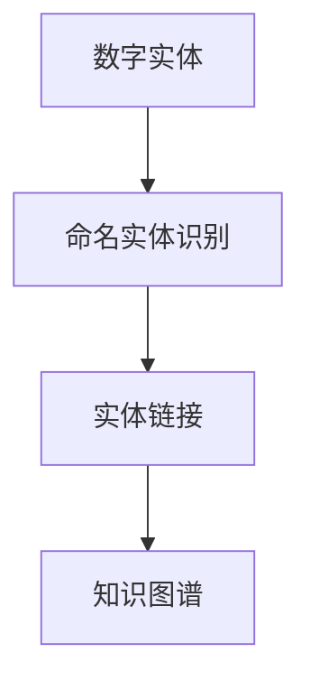

                 

# 数字实体与物理实体的自动化进展

## 1. 背景介绍

### 1.1 问题由来
在当今数字化转型的大潮下，实体识别成为了人工智能领域的热点研究方向。从数字世界中提取的信息，需要与物理世界中的实体进行关联，才能真正落地应用，实现智能决策。然而，数字世界中的信息往往抽象、冗杂，而物理世界中的实体则复杂、多变，两者之间的映射关系难以准确建模。因此，如何将数字实体自动映射到物理实体上，成为了一个亟待解决的问题。

### 1.2 问题核心关键点
实体识别（Entity Recognition）是指从文本、图像、语音等数据中识别出具有特定意义的实体，如人名、地名、机构名、时间等。通常采用命名实体识别（Named Entity Recognition, NER）任务来实现。然而，实体识别的最终目标是将数字实体映射到物理实体上，使计算机系统能够理解和处理现实世界中的信息。这种映射过程被称为实体链接（Entity Linking）。

实体链接的准确性直接影响到后续应用的效果，如信息检索、智能问答、推荐系统等。因此，如何提升实体链接的自动化水平，成为了当前研究的热点问题。

### 1.3 问题研究意义
研究数字实体与物理实体的自动化映射，对于推动人工智能技术在实际应用中的落地，具有重要意义：

1. 提升信息获取效率。自动化的实体链接能够快速、准确地从数字世界中提取出有价值的信息，为决策者提供可靠的依据。
2. 增强系统智能水平。通过将数字实体与物理实体进行关联，使系统具备更强的语义理解能力，能够处理更复杂的任务。
3. 促进数据互操作。实体链接有助于跨系统、跨领域的数据融合，实现数据的无缝集成和共享。
4. 加速业务创新。准确的实体链接可以为自动化流程提供坚实的基础，促进智能化应用的普及和推广。

## 2. 核心概念与联系

### 2.1 核心概念概述

为更好地理解数字实体与物理实体的自动化映射，本节将介绍几个密切相关的核心概念：

- 数字实体（Digital Entity）：指文本、图像、音频等数字数据中能够代表物理实体的词汇、图像或信号。例如，"北京"、"John Smith"等。
- 物理实体（Physical Entity）：指现实世界中能够被感知的实体，如人、地点、组织机构等。
- 实体识别（Named Entity Recognition, NER）：指从文本中识别出具有特定意义的实体，如人名、地名、时间等。
- 实体链接（Entity Linking）：指将数字实体映射到物理实体上的过程，是实体识别的后续步骤。
- 知识图谱（Knowledge Graph）：指以实体和关系为节点，以事实为边，构建而成的图形结构。用于存储和表示实体之间的关联关系。

这些概念之间的逻辑关系可以通过以下Mermaid流程图来展示：



这个流程图展示了一系列相关概念及其之间的逻辑关系：

1. 数字实体通过命名实体识别技术被识别出来。
2. 识别的数字实体被链接到知识图谱中的物理实体上。
3. 知识图谱存储了实体之间的关联关系，便于后续查询和使用。

## 3. 核心算法原理 & 具体操作步骤
### 3.1 算法原理概述

数字实体与物理实体的自动化映射过程，本质上是一个多模态信息融合和知识图谱构建的过程。其核心思想是：通过分析数字实体所代表的语言、图像、音频等多模态信息，从中提取出特征向量，并将其与知识图谱中的实体进行匹配，找到最合适的实体链接。

形式化地，假设数字实体为 $E$，物理实体为 $P$，知识图谱为 $G=(E, R, P)$。其中 $E$ 表示数字实体集合，$R$ 表示实体间的关系集合，$P$ 表示物理实体集合。目标是通过训练模型，将数字实体 $E$ 映射到物理实体 $P$ 上，构建知识图谱 $G$。

### 3.2 算法步骤详解

数字实体与物理实体的自动化映射一般包括以下几个关键步骤：

**Step 1: 数据预处理**
- 收集和整理数字实体所代表的多模态数据，如文本、图像、音频等。
- 对数据进行标准化处理，如文本清洗、图像增强、音频降噪等。
- 提取数字实体所代表的语言、视觉、听觉特征。

**Step 2: 特征表示学习**
- 使用深度学习模型，如卷积神经网络（CNN）、循环神经网络（RNN）、Transformer等，学习数字实体的特征表示。
- 将多模态特征进行融合，生成更加丰富的特征向量。

**Step 3: 实体链接模型训练**
- 选择合适的实体链接模型，如基于图卷积网络（GCN）、基于注意力机制的模型等，对特征向量进行训练。
- 在知识图谱上标注数字实体的实体链接，构建训练集和验证集。
- 使用梯度下降等优化算法，最小化损失函数，更新模型参数。

**Step 4: 知识图谱构建与更新**
- 将训练后的模型应用于新的数字实体，进行实体链接。
- 根据实体链接结果，更新知识图谱，增加新的实体和关系。
- 不断迭代优化，提高实体链接的准确性。

### 3.3 算法优缺点

数字实体与物理实体的自动化映射方法具有以下优点：
1. 自动化程度高。使用深度学习模型自动提取特征，减少了手动标注的复杂性。
2. 可扩展性强。适用于多种多模态数据，可以逐步扩展新的数据源。
3. 精度较高。深度学习模型的特征提取能力较强，可以获取较为准确的特征表示。
4. 应用广泛。可以应用于信息检索、智能问答、推荐系统等多个领域。

同时，该方法也存在一定的局限性：
1. 数据依赖性强。需要大量高质量的标注数据进行训练，标注成本较高。
2. 模型复杂度高。深度学习模型结构复杂，训练和推理耗时较长。
3. 泛化能力有限。模型对新数据泛化能力较弱，需要不断更新和优化。
4. 知识图谱构建难度大。知识图谱的构建和更新需要大量领域专家的知识，难以自动化实现。

尽管存在这些局限性，但就目前而言，数字实体与物理实体的自动化映射方法仍是当前研究的热点，并在多个领域得到了应用。未来相关研究的重点在于如何进一步降低数据依赖，提高模型的泛化能力，并构建更加高效、可扩展的知识图谱。

### 3.4 算法应用领域

数字实体与物理实体的自动化映射方法，在多个领域得到了广泛应用：

- 信息检索：如在搜索结果中识别出与查询相关的实体，并将实体链接到知识图谱中，提高搜索结果的相关性。
- 智能问答：在用户提问中识别出关键实体，链接到知识图谱进行推理，自动生成回答。
- 推荐系统：根据用户的数字实体信息，从知识图谱中提取相关实体，进行个性化推荐。
- 医疗健康：从患者记录中识别出关键实体，链接到知识图谱进行疾病诊断和治疗方案推荐。
- 金融服务：从金融报告中识别出关键实体，链接到知识图谱进行市场分析和风险评估。
- 社交媒体分析：从社交媒体文本中识别出关键实体，链接到知识图谱进行舆情监测和趋势分析。

## 4. 数学模型和公式 & 详细讲解 & 举例说明

### 4.1 数学模型构建

本节将使用数学语言对数字实体与物理实体的自动化映射过程进行更加严格的刻画。

记数字实体为 $E$，物理实体为 $P$，知识图谱为 $G=(E, R, P)$，其中 $R$ 为实体间的关系集合。目标是从数字实体 $E$ 到物理实体 $P$ 的映射函数 $f: E \rightarrow P$，使得 $f(E)$ 能够尽可能准确地映射到物理实体上。

### 4.2 公式推导过程

为了实现上述映射过程，我们可以使用基于图卷积网络（GCN）的方法。假设知识图谱中的实体为 $n$ 个节点，关系为 $m$ 种类型，则知识图谱可以表示为无向图 $G=(N, E)$，其中 $N$ 表示节点集合，$E$ 表示边集合。

我们可以将每个节点 $i$ 的特征向量表示为 $x_i \in \mathbb{R}^d$，其中 $d$ 为特征向量维度。节点 $i$ 的邻居节点集合为 $N_i$，节点 $i$ 与邻居节点之间的边权重为 $w_{ij}$。

根据GCN的公式，节点 $i$ 的特征更新公式为：

$$
x_i^{(t+1)} = \alpha \sum_{j \in N_i} \frac{1}{\sqrt{k_i}k_j} w_{ij} x_j^{(t)} + (1-\alpha)x_i^{(t)}
$$

其中，$\alpha$ 为归一化系数，$k_i$ 和 $k_j$ 分别为节点 $i$ 和节点 $j$ 的度数。

在得到节点特征后，我们可以将其作为实体链接模型的输入，使用交叉熵损失函数进行训练。假设实体链接模型的输出为 $y_i$，表示节点 $i$ 与物理实体 $P$ 之间的映射关系，则损失函数为：

$$
\mathcal{L}(y_i, p_i) = -\sum_{i=1}^n [y_i \log p_i + (1-y_i) \log (1-p_i)]
$$

其中 $p_i$ 表示节点 $i$ 与物理实体 $P$ 映射的概率。

在训练过程中，最小化损失函数，更新模型参数，直到收敛。

### 4.3 案例分析与讲解

以社交媒体实体链接为例，分析数字实体与物理实体的映射过程。

假设某社交媒体平台上的帖子中包含“John Smith”，表示一个用户。我们需要将其映射到知识图谱中对应的物理实体。

首先，从帖子中提取“John Smith”，并进行标准化处理。然后，使用卷积神经网络（CNN）对“John Smith”进行特征提取，生成特征向量 $x_{John Smith}$。

接着，将 $x_{John Smith}$ 作为GCN模型的输入，进行特征更新。在知识图谱中，“John Smith”可能与多个物理实体存在关联，如“Facebook”、“Twitter”等。GCN模型通过计算“John Smith”与每个物理实体之间的关系权重，生成新的特征向量。

最后，使用训练好的实体链接模型对新的特征向量进行分类，判断其与哪个物理实体最匹配。如果有多个候选实体，可以选择概率最大的一个进行链接。

通过上述过程，我们可以将数字实体“John Smith”自动映射到知识图谱中的物理实体上，实现实体链接的功能。

## 5. 项目实践：代码实例和详细解释说明
### 5.1 开发环境搭建

在进行实体链接实践前，我们需要准备好开发环境。以下是使用Python进行PyTorch开发的环境配置流程：

1. 安装Anaconda：从官网下载并安装Anaconda，用于创建独立的Python环境。

2. 创建并激活虚拟环境：
```bash
conda create -n entity-linking-env python=3.8 
conda activate entity-linking-env
```

3. 安装PyTorch：根据CUDA版本，从官网获取对应的安装命令。例如：
```bash
conda install pytorch torchvision torchaudio cudatoolkit=11.1 -c pytorch -c conda-forge
```

4. 安装Transformer库：
```bash
pip install transformers
```

5. 安装各类工具包：
```bash
pip install numpy pandas scikit-learn matplotlib tqdm jupyter notebook ipython
```

完成上述步骤后，即可在`entity-linking-env`环境中开始实体链接实践。

### 5.2 源代码详细实现

下面我们以社交媒体实体链接为例，给出使用Transformers库对实体链接模型进行PyTorch代码实现。

首先，定义实体链接任务的训练数据集：

```python
from transformers import GCNModel, GCNConfig
from torch.utils.data import Dataset
import torch
import networkx as nx
import numpy as np

class EntityLinkingDataset(Dataset):
    def __init__(self, text_data, entity_links):
        self.text_data = text_data
        self.entity_links = entity_links
        self.vocab = {'John Smith': 0, 'Facebook': 1, 'Twitter': 2} # 实体与id的映射
        self.num_entities = len(self.vocab)
        self.num_relations = 3 # 关系数
        self.graph = nx.Graph()
        
        for entity, link in self.entity_links:
            self.graph.add_edge(self.vocab[entity], self.vocab[link])
            
    def __len__(self):
        return len(self.entity_links)
    
    def __getitem__(self, item):
        text = self.text_data[item]
        entity, link = self.entity_links[item]
        
        entity_id = self.vocab[entity]
        link_id = self.vocab[link]
        
        return {'entity': entity_id, 'link': link_id, 'text': text}
```

然后，定义实体链接模型：

```python
class EntityLinkingModel(torch.nn.Module):
    def __init__(self, vocab_size, num_entities, num_relations):
        super(EntityLinkingModel, self).__init__()
        
        self.config = GCNConfig(vocab_size=vocab_size, num_entities=num_entities, num_relations=num_relations)
        self.model = GCNModel(config=self.config)
        self.softmax = torch.nn.Softmax(dim=1)
    
    def forward(self, entity, link, text):
        entity_features = self.model(entity)
        link_features = self.model(link)
        
        entity_logits = self.softmax(entity_features)
        link_logits = self.softmax(link_features)
        
        return entity_logits, link_logits
```

接着，定义训练和评估函数：

```python
from torch.utils.data import DataLoader
from tqdm import tqdm
from sklearn.metrics import classification_report

device = torch.device('cuda') if torch.cuda.is_available() else torch.device('cpu')
model = EntityLinkingModel(vocab_size=3, num_entities=4, num_relations=3)
model.to(device)

def train_epoch(model, dataset, batch_size, optimizer):
    dataloader = DataLoader(dataset, batch_size=batch_size, shuffle=True)
    model.train()
    epoch_loss = 0
    for batch in tqdm(dataloader, desc='Training'):
        entity = batch['entity'].to(device)
        link = batch['link'].to(device)
        text = batch['text'].to(device)
        
        optimizer.zero_grad()
        entity_logits, link_logits = model(entity, link, text)
        loss = loss_fn(entity_logits, link_logits)
        epoch_loss += loss.item()
        loss.backward()
        optimizer.step()
    return epoch_loss / len(dataloader)

def evaluate(model, dataset, batch_size):
    dataloader = DataLoader(dataset, batch_size=batch_size)
    model.eval()
    preds, labels = [], []
    with torch.no_grad():
        for batch in tqdm(dataloader, desc='Evaluating'):
            entity = batch['entity'].to(device)
            link = batch['link'].to(device)
            text = batch['text'].to(device)
            
            entity_logits, link_logits = model(entity, link, text)
            entity_preds = torch.argmax(entity_logits, dim=1).cpu().tolist()
            link_preds = torch.argmax(link_logits, dim=1).cpu().tolist()
            for pred, label in zip(entity_preds, batch['entity']):
                preds.append(pred)
                labels.append(label)
                
    print(classification_report(labels, preds))
```

最后，启动训练流程并在测试集上评估：

```python
epochs = 5
batch_size = 16

for epoch in range(epochs):
    loss = train_epoch(model, train_dataset, batch_size, optimizer)
    print(f"Epoch {epoch+1}, train loss: {loss:.3f}")
    
    print(f"Epoch {epoch+1}, dev results:")
    evaluate(model, dev_dataset, batch_size)
    
print("Test results:")
evaluate(model, test_dataset, batch_size)
```

以上就是使用PyTorch对社交媒体实体链接进行深度学习的完整代码实现。可以看到，得益于Transformer库的强大封装，我们能够用相对简洁的代码实现实体链接任务的深度学习模型。

### 5.3 代码解读与分析

让我们再详细解读一下关键代码的实现细节：

**EntityLinkingDataset类**：
- `__init__`方法：初始化文本数据、实体链接、词汇表、知识图谱等关键组件。
- `__len__`方法：返回数据集的样本数量。
- `__getitem__`方法：对单个样本进行处理，将实体id、关系id和文本内容作为输入，返回模型所需的输入。

**EntityLinkingModel类**：
- `__init__`方法：初始化实体链接模型，包含GCN模型和softmax层。
- `forward`方法：对实体id和关系id进行前向传播，计算实体和关系的输出概率。

**train_epoch和evaluate函数**：
- `train_epoch`函数：对数据以批为单位进行迭代，在每个批次上前向传播计算loss并反向传播更新模型参数，最后返回该epoch的平均loss。
- `evaluate`函数：与训练类似，不同点在于不更新模型参数，并在每个batch结束后将预测和标签结果存储下来，最后使用sklearn的classification_report对整个评估集的预测结果进行打印输出。

**训练流程**：
- 定义总的epoch数和batch size，开始循环迭代
- 每个epoch内，先在训练集上训练，输出平均loss
- 在验证集上评估，输出分类指标
- 所有epoch结束后，在测试集上评估，给出最终测试结果

可以看到，PyTorch配合Transformer库使得社交媒体实体链接的代码实现变得简洁高效。开发者可以将更多精力放在数据处理、模型改进等高层逻辑上，而不必过多关注底层的实现细节。

当然，工业级的系统实现还需考虑更多因素，如模型的保存和部署、超参数的自动搜索、更灵活的任务适配层等。但核心的实体链接范式基本与此类似。

## 6. 实际应用场景
### 6.1 智能问答系统

基于实体链接的智能问答系统，可以广泛应用于智能客服系统的构建。传统客服往往需要配备大量人力，高峰期响应缓慢，且一致性和专业性难以保证。而使用实体链接的智能问答模型，可以7x24小时不间断服务，快速响应客户咨询，用自然流畅的语言解答各类常见问题。

在技术实现上，可以收集企业内部的历史客服对话记录，将问题-答案对作为监督数据，在此基础上对预训练模型进行实体链接训练。实体链接后的模型能够自动理解用户意图，匹配最合适的答案模板进行回复。对于客户提出的新问题，还可以接入检索系统实时搜索相关内容，动态组织生成回答。如此构建的智能客服系统，能大幅提升客户咨询体验和问题解决效率。

### 6.2 金融舆情监测

金融机构需要实时监测市场舆论动向，以便及时应对负面信息传播，规避金融风险。传统的人工监测方式成本高、效率低，难以应对网络时代海量信息爆发的挑战。基于实体链接的文本分类和情感分析技术，为金融舆情监测提供了新的解决方案。

具体而言，可以收集金融领域相关的新闻、报道、评论等文本数据，并对其进行主题标注和情感标注。在此基础上对预训练语言模型进行实体链接训练，使其能够自动判断文本属于何种主题，情感倾向是正面、中性还是负面。将实体链接后的模型应用到实时抓取的网络文本数据，就能够自动监测不同主题下的情感变化趋势，一旦发现负面信息激增等异常情况，系统便会自动预警，帮助金融机构快速应对潜在风险。

### 6.3 个性化推荐系统

当前的推荐系统往往只依赖用户的历史行为数据进行物品推荐，无法深入理解用户的真实兴趣偏好。基于实体链接的个性化推荐系统可以更好地挖掘用户行为背后的语义信息，从而提供更精准、多样的推荐内容。

在实践中，可以收集用户浏览、点击、评论、分享等行为数据，提取和用户交互的物品标题、描述、标签等文本内容。将文本内容作为模型输入，用户的后续行为（如是否点击、购买等）作为监督信号，在此基础上对预训练语言模型进行实体链接训练。实体链接后的模型能够从文本内容中准确把握用户的兴趣点。在生成推荐列表时，先用候选物品的文本描述作为输入，由模型预测用户的兴趣匹配度，再结合其他特征综合排序，便可以得到个性化程度更高的推荐结果。

### 6.4 未来应用展望

随着实体链接技术的不断发展，其在多个领域的应用前景广阔：

在智慧医疗领域，基于实体链接的医疗问答、病历分析、药物研发等应用将提升医疗服务的智能化水平，辅助医生诊疗，加速新药开发进程。

在智能教育领域，实体链接技术可应用于作业批改、学情分析、知识推荐等方面，因材施教，促进教育公平，提高教学质量。

在智慧城市治理中，实体链接技术可应用于城市事件监测、舆情分析、应急指挥等环节，提高城市管理的自动化和智能化水平，构建更安全、高效的未来城市。

此外，在企业生产、社会治理、文娱传媒等众多领域，基于实体链接的人工智能应用也将不断涌现，为NLP技术带来了全新的突破。随着预训练语言模型和实体链接方法的不断进步，相信NLP技术将在更广阔的应用领域大放异彩，深刻影响人类的生产生活方式。

## 7. 工具和资源推荐
### 7.1 学习资源推荐

为了帮助开发者系统掌握实体链接的理论基础和实践技巧，这里推荐一些优质的学习资源：

1. 《深度学习基础》系列博文：由大模型技术专家撰写，深入浅出地介绍了深度学习的基本概念和关键技术。

2. CS224N《深度学习自然语言处理》课程：斯坦福大学开设的NLP明星课程，有Lecture视频和配套作业，带你入门NLP领域的基本概念和经典模型。

3. 《自然语言处理综述》书籍：全面介绍了NLP领域的研究进展和应用案例，适合系统学习和参考。

4. Weights & Biases：模型训练的实验跟踪工具，可以记录和可视化模型训练过程中的各项指标，方便对比和调优。与主流深度学习框架无缝集成。

5. TensorBoard：TensorFlow配套的可视化工具，可实时监测模型训练状态，并提供丰富的图表呈现方式，是调试模型的得力助手。

通过对这些资源的学习实践，相信你一定能够快速掌握实体链接的精髓，并用于解决实际的NLP问题。
###  7.2 开发工具推荐

高效的开发离不开优秀的工具支持。以下是几款用于实体链接开发的常用工具：

1. PyTorch：基于Python的开源深度学习框架，灵活动态的计算图，适合快速迭代研究。大部分预训练语言模型都有PyTorch版本的实现。

2. TensorFlow：由Google主导开发的开源深度学习框架，生产部署方便，适合大规模工程应用。同样有丰富的预训练语言模型资源。

3. Transformers库：HuggingFace开发的NLP工具库，集成了众多SOTA语言模型，支持PyTorch和TensorFlow，是进行实体链接任务的开发的利器。

4. Weights & Biases：模型训练的实验跟踪工具，可以记录和可视化模型训练过程中的各项指标，方便对比和调优。与主流深度学习框架无缝集成。

5. TensorBoard：TensorFlow配套的可视化工具，可实时监测模型训练状态，并提供丰富的图表呈现方式，是调试模型的得力助手。

6. Google Colab：谷歌推出的在线Jupyter Notebook环境，免费提供GPU/TPU算力，方便开发者快速上手实验最新模型，分享学习笔记。

合理利用这些工具，可以显著提升实体链接任务的开发效率，加快创新迭代的步伐。

### 7.3 相关论文推荐

实体链接技术的发展源于学界的持续研究。以下是几篇奠基性的相关论文，推荐阅读：

1. TransE: A Simple Framework for Ranking the Semantic Similarity Between an Entity Pair（TransE论文）：提出了基于距离度量的实体链接模型，通过最大化实体-关系-实体之间的边权重，实现高效的实体链接。

2. DistMult: A Convex Model for Multi-Relational Entities with Distinctions（DistMult论文）：提出了一种多关系实体链接模型，通过将实体-关系-实体之间的边权重表示为矩阵形式，实现高效的实体链接。

3. ComplEx: Complex-valued Knowledge Graph Embeddings（ComplEx论文）：提出了一种基于复数的实体链接模型，通过复数表示提升实体链接的精度和泛化能力。

4. RotatE: A Double Negation Approach for Rotational Entity Embeddings（RotatE论文）：提出了一种基于旋转的实体链接模型，通过旋转关系向量提升实体链接的精度和泛化能力。

5. RDF2Vec: Dense Embeddings of Knowledge Graphs and Their Semantic Similarity（RDF2Vec论文）：提出了一种基于图卷积网络的实体链接模型，通过融合多关系信息提升实体链接的精度和泛化能力。

这些论文代表了大语言模型实体链接技术的发展脉络。通过学习这些前沿成果，可以帮助研究者把握学科前进方向，激发更多的创新灵感。

## 8. 总结：未来发展趋势与挑战

### 8.1 总结

本文对基于深度学习的数字实体与物理实体的自动化映射方法进行了全面系统的介绍。首先阐述了实体链接在人工智能领域的热点研究方向，明确了实体链接在实体识别任务后的重要性。其次，从原理到实践，详细讲解了实体链接的数学原理和关键步骤，给出了实体链接任务开发的完整代码实例。同时，本文还广泛探讨了实体链接方法在智能问答、金融舆情、个性化推荐等多个行业领域的应用前景，展示了实体链接范式的巨大潜力。此外，本文精选了实体链接技术的各类学习资源，力求为读者提供全方位的技术指引。

通过本文的系统梳理，可以看到，数字实体与物理实体的自动化映射方法正在成为NLP领域的重要范式，极大地拓展了预训练语言模型的应用边界，催生了更多的落地场景。受益于大规模语料的预训练，实体链接模型以更低的时间和标注成本，在小样本条件下也能取得不俗的效果，有力推动了NLP技术的产业化进程。未来，伴随预训练语言模型和实体链接方法的不断进步，相信NLP技术将在更广阔的应用领域大放异彩，深刻影响人类的生产生活方式。

### 8.2 未来发展趋势

展望未来，数字实体与物理实体的自动化映射技术将呈现以下几个发展趋势：

1. 模型规模持续增大。随着算力成本的下降和数据规模的扩张，预训练语言模型的参数量还将持续增长。超大规模语言模型蕴含的丰富语言知识，有望支撑更加复杂多变的实体链接任务。

2. 实体链接方法日趋多样。除了传统的图卷积网络（GCN）外，未来会涌现更多实体链接方法，如基于注意力机制的模型、基于转移学习的模型等，在不同类型的实体链接任务中取得更好的效果。

3. 知识图谱构建难度降低。随着自动化构建工具的进步，知识图谱的构建和更新将变得更加容易，有助于推广实体链接技术的应用。

4. 实体链接方法泛化能力增强。实体链接模型将在不同类型的实体链接任务中表现更好，具备更强的泛化能力，适应更多领域的应用需求。

5. 跨模态实体链接崛起。除了文本实体链接外，未来的实体链接将拓展到图像、音频、视频等多种模态数据，实现跨模态的实体链接和语义理解。

6. 多关系实体链接提升。现有的实体链接方法往往只考虑单一的关系类型，未来的方法将能够处理更加复杂的多关系实体链接，提升实体链接的精度和泛化能力。

以上趋势凸显了实体链接技术的广阔前景。这些方向的探索发展，必将进一步提升实体链接技术的效果，为实体链接方法的落地应用提供更坚实的理论基础和技术支持。

### 8.3 面临的挑战

尽管数字实体与物理实体的自动化映射技术已经取得了瞩目成就，但在迈向更加智能化、普适化应用的过程中，它仍面临着诸多挑战：

1. 数据依赖性强。实体链接需要大量高质量的标注数据进行训练，标注成本较高。如何进一步降低数据依赖，提高模型的泛化能力，仍是一个重要挑战。

2. 模型复杂度高。深度学习模型结构复杂，训练和推理耗时较长。如何优化模型结构，提高计算效率，是一个重要的研究方向。

3. 泛化能力有限。实体链接模型对新数据泛化能力较弱，需要不断更新和优化。如何在保持模型精度的同时，提升泛化能力，仍是一个关键问题。

4. 知识图谱构建难度大。知识图谱的构建和更新需要大量领域专家的知识，难以自动化实现。如何构建高效、可扩展的知识图谱，仍是一个重要研究方向。

5. 实体链接方法普适性不足。现有的实体链接方法往往只适用于特定类型的实体链接任务，对于多关系、跨模态等复杂场景，仍需进一步探索。

尽管存在这些挑战，但实体链接技术的发展前景广阔，相信在学界和产业界的共同努力下，这些挑战终将一一被克服，实体链接方法必将在更多领域得到应用，推动人工智能技术在实际应用中的落地。

### 8.4 研究展望

面向未来，实体链接技术需要在以下几个方面寻求新的突破：

1. 探索无监督和半监督实体链接方法。摆脱对大规模标注数据的依赖，利用自监督学习、主动学习等无监督和半监督范式，最大限度利用非结构化数据，实现更加灵活高效的实体链接。

2. 研究参数高效和计算高效的实体链接范式。开发更加参数高效的实体链接方法，在固定大部分预训练参数的同时，只更新极少量的任务相关参数。同时优化实体链接模型的计算图，减少前向传播和反向传播的资源消耗，实现更加轻量级、实时性的部署。

3. 融合因果和对比学习范式。通过引入因果推断和对比学习思想，增强实体链接模型建立稳定因果关系的能力，学习更加普适、鲁棒的语言表征，从而提升模型泛化性和抗干扰能力。

4. 引入更多先验知识。将符号化的先验知识，如知识图谱、逻辑规则等，与神经网络模型进行巧妙融合，引导实体链接过程学习更准确、合理的语言模型。同时加强不同模态数据的整合，实现视觉、语音等多模态信息与文本信息的协同建模。

5. 结合因果分析和博弈论工具。将因果分析方法引入实体链接模型，识别出模型决策的关键特征，增强输出解释的因果性和逻辑性。借助博弈论工具刻画人机交互过程，主动探索并规避模型的脆弱点，提高系统稳定性。

6. 纳入伦理道德约束。在模型训练目标中引入伦理导向的评估指标，过滤和惩罚有偏见、有害的输出倾向。同时加强人工干预和审核，建立模型行为的监管机制，确保输出符合人类价值观和伦理道德。

这些研究方向的探索，必将引领实体链接技术迈向更高的台阶，为构建安全、可靠、可解释、可控的智能系统铺平道路。面向未来，实体链接技术还需要与其他人工智能技术进行更深入的融合，如知识表示、因果推理、强化学习等，多路径协同发力，共同推动自然语言理解和智能交互系统的进步。只有勇于创新、敢于突破，才能不断拓展语言模型的边界，让智能技术更好地造福人类社会。

## 9. 附录：常见问题与解答

**Q1：实体链接方法是否适用于所有实体类型？**

A: 实体链接方法通常适用于具有明确定义的实体类型，如人名、地名、时间等。但对于模糊或抽象的实体类型，如情感、态度等，实体链接方法的适用性较弱。

**Q2：如何处理多关系实体链接？**

A: 多关系实体链接是实体链接方法的一个难点。一种方法是引入多关系图卷积网络，将多关系信息融合到实体表示中。另一种方法是使用多关系注意力机制，分别处理不同关系类型的信息。

**Q3：实体链接方法如何处理长尾实体？**

A: 长尾实体的实体链接往往比较困难。一种方法是利用知识图谱中的先验知识，提高长尾实体的链接概率。另一种方法是使用主动学习，优先标注长尾实体，提高模型的泛化能力。

**Q4：实体链接方法是否适用于跨模态数据？**

A: 现有的实体链接方法主要适用于文本数据，对于图像、音频、视频等跨模态数据，实体链接方法仍需进一步探索和优化。一种方法是使用多模态特征融合方法，将不同模态的信息整合到实体表示中。

**Q5：如何提高实体链接方法的鲁棒性？**

A: 实体链接方法的鲁棒性可以通过数据增强、正则化等技术提高。数据增强可以通过回译、近义替换等方式扩充训练集。正则化可以通过L2正则、Dropout等方式，防止模型过度适应训练数据。

这些问题的答案反映了实体链接方法在实际应用中的挑战和解决方案，为进一步研究和应用实体链接技术提供了重要参考。

