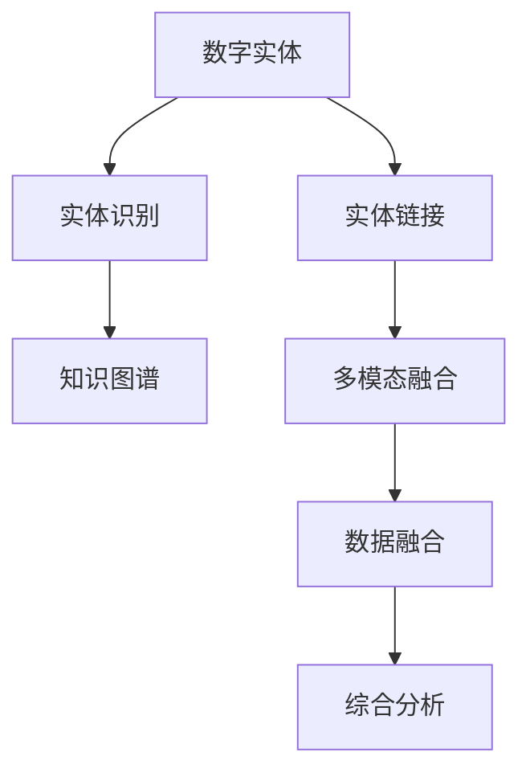

                 

# 数字实体自动化的应用前景

## 1. 背景介绍

### 1.1 问题由来
随着数字化、信息化时代的到来，数字实体在各行各业中的应用变得越来越广泛。无论是电商平台、社交媒体，还是智能家居、金融交易，数字实体无处不在。然而，这些数字实体的管理、维护、更新等自动化操作依然面临诸多挑战。数字实体往往包含大量的文本、图片、音频等多模态信息，而当前的自动化技术在处理多模态信息方面仍存在较大局限性。本文将系统探讨数字实体自动化的应用前景，希望能为相关领域的研究者提供一些新的思路和灵感。

### 1.2 问题核心关键点
数字实体自动化涉及数据预处理、信息提取、实体链接、数据融合等多个环节。其核心问题包括：
- 如何高效、准确地从海量文本中提取出实体信息？
- 如何在不同来源的实体数据之间建立有效的链接关系？
- 如何将不同模态的数据融合为一个统一的视图，进行综合分析和处理？
- 如何自动化地更新和维护数字实体信息，保证数据的准确性和时效性？

这些问题不仅是技术挑战，更是智能系统高效运作的关键所在。

### 1.3 问题研究意义
数字实体自动化的研究对提升社会治理、经济管理、科学研究等领域的信息化水平具有重要意义。通过自动化技术，可以实现对数字实体的快速识别、高效处理和灵活更新，从而大幅提升信息处理的效率和质量。具体来说，数字实体自动化可以：
- 提升决策效率。自动化的数字实体信息能够为决策者提供更精确、及时的参考依据。
- 降低运营成本。自动化技术可以减少人力成本，同时降低错误率，提升整体运营效率。
- 增强数据安全。数字实体自动化的自动化流程可以减少人为操作的干预，降低数据泄露和篡改的风险。
- 推动跨领域应用。数字实体信息在多个领域都有广泛应用，能够为跨领域的信息化合作提供数据支撑。

## 2. 核心概念与联系

### 2.1 核心概念概述

为了更好地理解数字实体自动化的核心技术和应用方法，本节将介绍一些关键概念：

- **数字实体（Digital Entity）**：指各类具有实际意义或定义的数据，如人物、地点、机构、事件、时间等，在信息技术领域中通常称为“实体”。
- **实体识别（Named Entity Recognition, NER）**：指从文本中识别出具有特定意义的实体，并进行分类标注的过程。
- **实体链接（Entity Linking）**：指将识别出的实体与外部知识库中的实体进行关联，确定其实体类型和具体信息的过程。
- **多模态融合（Multi-modal Fusion）**：指将不同模态的数据（如文本、图像、语音等）融合为一个统一视图，进行综合分析和处理。
- **知识图谱（Knowledge Graph）**：指由节点和边构成的图结构，用于表示实体之间的关系和属性，是数字实体自动化的重要支撑。

这些核心概念之间的逻辑关系可以通过以下Mermaid流程图来展示：



这个流程图展示了数字实体自动化的核心概念及其之间的关系：

1. 数字实体经过实体识别，从文本中提取出来。
2. 识别出的实体与外部知识库进行链接，确定其具体信息。
3. 通过多模态融合，将不同来源的实体数据融合为一个统一的视图。
4. 融合后的数据进行综合分析，形成更具价值的洞察。

## 3. 核心算法原理 & 具体操作步骤
### 3.1 算法原理概述

数字实体自动化的核心算法包括实体识别、实体链接、多模态融合等。以实体识别为例，其基本原理是通过自然语言处理（NLP）技术，从文本中自动识别出具有特定意义的实体，并进行分类标注。

具体来说，实体识别通常包括两个步骤：

1. **分词与词性标注**：将文本切分成词汇单元，并标注每个词汇的词性。
2. **实体识别与分类**：对每个词汇进行实体性判断，并根据上下文信息进行实体分类，如人名、地名、机构名等。

实体识别的算法原理可以表示为：

$$
\text{NER}(\text{Text}) = \text{BiLSTM-CRF}(\text{BiLSTM}(\text{Word Embedding}(\text{Text})))
$$

其中，$\text{BiLSTM-CRF}$ 是一个双向长短时记忆网络（BiLSTM）与条件随机场（CRF）的组合模型，$\text{Word Embedding}$ 是将文本转换为向量表示的嵌入层。

### 3.2 算法步骤详解

以实体识别为例，实体识别的具体步骤如下：

1. **文本预处理**：对输入文本进行分词、词性标注等预处理。
2. **特征提取**：使用BiLSTM-CRF模型对每个词汇进行特征提取，得到上下文依赖关系。
3. **分类标注**：通过CRF模型对每个词汇进行实体性判断，并分类标注为不同类型的实体。
4. **后处理**：对分类结果进行后处理，如合并重叠的实体、去除噪声实体等。

以Transformer模型为例，其实体识别步骤如下：

1. **输入文本编码**：将输入文本转换为向量表示。
2. **特征提取**：通过Transformer模型对文本进行特征提取，得到上下文依赖关系。
3. **分类标注**：使用分类头对每个词汇进行实体性判断，并分类标注为不同类型的实体。
4. **后处理**：对分类结果进行后处理，如合并重叠的实体、去除噪声实体等。

### 3.3 算法优缺点

数字实体自动化的算法具有以下优点：
1. **高效性**：自动化技术可以大幅提升实体识别的效率，减少人工操作的时间成本。
2. **准确性**：通过精确的模型训练和算法优化，实体识别的准确率可以得到显著提升。
3. **可扩展性**：算法可以处理不同规模和类型的文本数据，适应多种应用场景。

同时，该算法也存在以下局限性：
1. **依赖语料**：算法需要大量的标注数据进行训练，数据的质量和数量直接影响模型的效果。
2. **上下文理解不足**：在处理长文本时，模型可能无法理解复杂的上下文关系，导致实体识别错误。
3. **多模态处理复杂**：不同模态的数据需要不同的处理方式，融合后的效果可能不如单模态数据。
4. **模型训练复杂**：模型的训练需要大量的计算资源和时间，对硬件设备要求较高。

### 3.4 算法应用领域

数字实体自动化在多个领域都有广泛应用，包括但不限于：

- **医疗领域**：从电子病历中提取患者的基本信息、诊断信息、治疗方案等实体，用于辅助医生诊断和治疗。
- **金融领域**：从金融报告、新闻报道中提取公司信息、股票价格、市场趋势等实体，用于金融分析和投资决策。
- **媒体领域**：从新闻报道、社交媒体中提取事件、人物、地点等实体，用于新闻自动化和舆情监测。
- **教育领域**：从教育资源中提取知识点、教学方法、学生信息等实体，用于个性化教育和智能推荐。

## 4. 数学模型和公式 & 详细讲解  
### 4.1 数学模型构建

数字实体自动化的核心算法涉及多个步骤，包括文本编码、特征提取、实体识别等。以BiLSTM-CRF模型为例，其数学模型可以表示为：

1. **文本编码**
   - 使用BiLSTM模型对文本进行编码，得到每个词汇的上下文依赖关系。
   $$
   \text{BiLSTM}(\text{Word Embedding}(\text{Text})) = \{\text{h}_t\}_{t=1}^N
   $$

2. **特征提取**
   - 将BiLSTM编码后的结果作为输入，通过CRF模型对每个词汇进行实体性判断和分类。
   $$
   \text{BiLSTM-CRF}(\{\text{h}_t\}_{t=1}^N) = \{\text{y}_t\}_{t=1}^N
   $$

3. **分类标注**
   - 对每个词汇进行分类标注，标注结果包括实体类型和实体边界。
   $$
   \text{NER}(\text{Text}) = \{\text{y}_t\}_{t=1}^N
   $$

其中，$\text{h}_t$ 表示第 $t$ 个词汇的BiLSTM编码结果，$\text{y}_t$ 表示第 $t$ 个词汇的分类结果。

### 4.2 公式推导过程

以BiLSTM-CRF模型为例，其实体识别的推导过程如下：

1. **文本编码**
   - 将文本中的每个词汇转换为向量表示，使用BiLSTM模型对文本进行编码，得到每个词汇的上下文依赖关系。
   $$
   \text{BiLSTM}(\text{Word Embedding}(\text{Text})) = \{\text{h}_t\}_{t=1}^N
   $$

2. **特征提取**
   - 将BiLSTM编码后的结果作为输入，通过CRF模型对每个词汇进行实体性判断和分类。
   $$
   \text{BiLSTM-CRF}(\{\text{h}_t\}_{t=1}^N) = \{\text{y}_t\}_{t=1}^N
   $$

3. **分类标注**
   - 对每个词汇进行分类标注，标注结果包括实体类型和实体边界。
   $$
   \text{NER}(\text{Text}) = \{\text{y}_t\}_{t=1}^N
   $$

其中，$\text{h}_t$ 表示第 $t$ 个词汇的BiLSTM编码结果，$\text{y}_t$ 表示第 $t$ 个词汇的分类结果。

### 4.3 案例分析与讲解

以医疗领域的电子病历实体识别为例，其流程如下：

1. **文本预处理**：对电子病历文本进行分词、词性标注等预处理。
2. **文本编码**：将文本中的每个词汇转换为向量表示，使用BiLSTM模型对文本进行编码。
3. **特征提取**：将BiLSTM编码后的结果作为输入，通过CRF模型对每个词汇进行实体性判断和分类。
4. **后处理**：对分类结果进行后处理，如合并重叠的实体、去除噪声实体等。

以Transformer模型为例，其实体识别步骤如下：

1. **输入文本编码**：将输入文本转换为向量表示。
2. **特征提取**：通过Transformer模型对文本进行特征提取，得到上下文依赖关系。
3. **分类标注**：使用分类头对每个词汇进行实体性判断，并分类标注为不同类型的实体。
4. **后处理**：对分类结果进行后处理，如合并重叠的实体、去除噪声实体等。

## 5. 项目实践：代码实例和详细解释说明
### 5.1 开发环境搭建

在进行数字实体自动化实践前，我们需要准备好开发环境。以下是使用Python进行HuggingFace Transformers库开发的环境配置流程：

1. 安装Anaconda：从官网下载并安装Anaconda，用于创建独立的Python环境。

2. 创建并激活虚拟环境：
```bash
conda create -n transformers-env python=3.8 
conda activate transformers-env
```

3. 安装PyTorch：根据CUDA版本，从官网获取对应的安装命令。例如：
```bash
conda install pytorch torchvision torchaudio cudatoolkit=11.1 -c pytorch -c conda-forge
```

4. 安装HuggingFace Transformers库：
```bash
pip install transformers
```

5. 安装各类工具包：
```bash
pip install numpy pandas scikit-learn matplotlib tqdm jupyter notebook ipython
```

完成上述步骤后，即可在`transformers-env`环境中开始数字实体自动化的开发。

### 5.2 源代码详细实现

下面我们以医疗领域的电子病历实体识别为例，给出使用HuggingFace Transformers库进行实体识别的PyTorch代码实现。

首先，定义实体识别的数据处理函数：

```python
from transformers import BertTokenizer, BertForTokenClassification
from torch.utils.data import Dataset
import torch

class ElectronicHealthRecordDataset(Dataset):
    def __init__(self, texts, tags, tokenizer, max_len=128):
        self.texts = texts
        self.tags = tags
        self.tokenizer = tokenizer
        self.max_len = max_len
        
    def __len__(self):
        return len(self.texts)
    
    def __getitem__(self, item):
        text = self.texts[item]
        tags = self.tags[item]
        
        encoding = self.tokenizer(text, return_tensors='pt', max_length=self.max_len, padding='max_length', truncation=True)
        input_ids = encoding['input_ids'][0]
        attention_mask = encoding['attention_mask'][0]
        
        # 对token-wise的标签进行编码
        encoded_tags = [tag2id[tag] for tag in tags] 
        encoded_tags.extend([tag2id['O']] * (self.max_len - len(encoded_tags)))
        labels = torch.tensor(encoded_tags, dtype=torch.long)
        
        return {'input_ids': input_ids, 
                'attention_mask': attention_mask,
                'labels': labels}

# 标签与id的映射
tag2id = {'O': 0, 'B-PATIENT': 1, 'I-PATIENT': 2, 'B-DISEASE': 3, 'I-DISEASE': 4, 'B-MEDICATION': 5, 'I-MEDICATION': 6}
id2tag = {v: k for k, v in tag2id.items()}

# 创建dataset
tokenizer = BertTokenizer.from_pretrained('bert-base-cased')

train_dataset = ElectronicHealthRecordDataset(train_texts, train_tags, tokenizer)
dev_dataset = ElectronicHealthRecordDataset(dev_texts, dev_tags, tokenizer)
test_dataset = ElectronicHealthRecordDataset(test_texts, test_tags, tokenizer)
```

然后，定义模型和优化器：

```python
from transformers import BertForTokenClassification, AdamW

model = BertForTokenClassification.from_pretrained('bert-base-cased', num_labels=len(tag2id))

optimizer = AdamW(model.parameters(), lr=2e-5)
```

接着，定义训练和评估函数：

```python
from torch.utils.data import DataLoader
from tqdm import tqdm
from sklearn.metrics import classification_report

device = torch.device('cuda') if torch.cuda.is_available() else torch.device('cpu')
model.to(device)

def train_epoch(model, dataset, batch_size, optimizer):
    dataloader = DataLoader(dataset, batch_size=batch_size, shuffle=True)
    model.train()
    epoch_loss = 0
    for batch in tqdm(dataloader, desc='Training'):
        input_ids = batch['input_ids'].to(device)
        attention_mask = batch['attention_mask'].to(device)
        labels = batch['labels'].to(device)
        model.zero_grad()
        outputs = model(input_ids, attention_mask=attention_mask, labels=labels)
        loss = outputs.loss
        epoch_loss += loss.item()
        loss.backward()
        optimizer.step()
    return epoch_loss / len(dataloader)

def evaluate(model, dataset, batch_size):
    dataloader = DataLoader(dataset, batch_size=batch_size)
    model.eval()
    preds, labels = [], []
    with torch.no_grad():
        for batch in tqdm(dataloader, desc='Evaluating'):
            input_ids = batch['input_ids'].to(device)
            attention_mask = batch['attention_mask'].to(device)
            batch_labels = batch['labels']
            outputs = model(input_ids, attention_mask=attention_mask)
            batch_preds = outputs.logits.argmax(dim=2).to('cpu').tolist()
            batch_labels = batch_labels.to('cpu').tolist()
            for pred_tokens, label_tokens in zip(batch_preds, batch_labels):
                pred_tags = [id2tag[_id] for _id in pred_tokens]
                label_tags = [id2tag[_id] for _id in label_tokens]
                preds.append(pred_tags[:len(label_tags)])
                labels.append(label_tags)
                
    print(classification_report(labels, preds))
```

最后，启动训练流程并在测试集上评估：

```python
epochs = 5
batch_size = 16

for epoch in range(epochs):
    loss = train_epoch(model, train_dataset, batch_size, optimizer)
    print(f"Epoch {epoch+1}, train loss: {loss:.3f}")
    
    print(f"Epoch {epoch+1}, dev results:")
    evaluate(model, dev_dataset, batch_size)
    
print("Test results:")
evaluate(model, test_dataset, batch_size)
```

以上就是使用PyTorch对BERT模型进行实体识别的完整代码实现。可以看到，得益于HuggingFace Transformers库的强大封装，我们可以用相对简洁的代码完成BERT模型的加载和实体识别。

### 5.3 代码解读与分析

让我们再详细解读一下关键代码的实现细节：

**ElectronicHealthRecordDataset类**：
- `__init__`方法：初始化文本、标签、分词器等关键组件。
- `__len__`方法：返回数据集的样本数量。
- `__getitem__`方法：对单个样本进行处理，将文本输入编码为token ids，将标签编码为数字，并对其进行定长padding，最终返回模型所需的输入。

**tag2id和id2tag字典**：
- 定义了标签与数字id之间的映射关系，用于将token-wise的预测结果解码回真实的标签。

**训练和评估函数**：
- 使用PyTorch的DataLoader对数据集进行批次化加载，供模型训练和推理使用。
- 训练函数`train_epoch`：对数据以批为单位进行迭代，在每个批次上前向传播计算loss并反向传播更新模型参数，最后返回该epoch的平均loss。
- 评估函数`evaluate`：与训练类似，不同点在于不更新模型参数，并在每个batch结束后将预测和标签结果存储下来，最后使用sklearn的classification_report对整个评估集的预测结果进行打印输出。

**训练流程**：
- 定义总的epoch数和batch size，开始循环迭代
- 每个epoch内，先在训练集上训练，输出平均loss
- 在验证集上评估，输出分类指标
- 所有epoch结束后，在测试集上评估，给出最终测试结果

可以看到，PyTorch配合HuggingFace Transformers库使得BERT实体识别的代码实现变得简洁高效。开发者可以将更多精力放在数据处理、模型改进等高层逻辑上，而不必过多关注底层的实现细节。

当然，工业级的系统实现还需考虑更多因素，如模型的保存和部署、超参数的自动搜索、更灵活的任务适配层等。但核心的实体识别范式基本与此类似。

## 6. 实际应用场景
### 6.1 智能客服系统

数字实体自动化的应用场景之一是智能客服系统。传统的客服系统需要大量人力来处理用户咨询，而数字实体自动化技术可以显著提升客服系统的自动化水平。

在智能客服系统中，可以收集用户的对话记录，从中提取实体信息，如用户姓名、身份证号码、产品信息等。根据实体信息，系统能够快速判断用户的意图，自动回复相关问题，提升客户满意度。同时，数字实体自动化技术还可以从多轮对话中抽取关键信息，形成对话摘要，供客服人员参考。

### 6.2 金融舆情监测

金融舆情监测是数字实体自动化的另一个重要应用场景。金融机构需要实时监控市场舆情，及时发现和应对负面信息，保障市场稳定。

在金融舆情监测中，可以通过数字实体自动化技术，从新闻报道、社交媒体、市场报告等海量数据中提取实体信息，如公司名称、股票代码、事件类型等。根据这些信息，系统能够快速分析和判断舆情变化趋势，及时预警风险，帮助金融机构制定应对策略。

### 6.3 媒体内容推荐

在媒体内容推荐中，数字实体自动化技术可以帮助推荐系统更准确地理解用户兴趣。传统推荐系统通常基于用户历史行为数据进行推荐，而数字实体自动化技术可以通过用户输入的文本内容，自动识别出用户感兴趣的主题和事件，如体育赛事、明星动态等，从而提升推荐的精准度。

具体来说，推荐系统可以通过实体识别和链接技术，从用户输入的文本中提取实体信息，如体育赛事名称、明星名字等。根据这些实体信息，系统可以更精准地匹配用户兴趣，推荐相关的媒体内容，提升用户体验。

### 6.4 未来应用展望

随着数字实体自动化技术的不断发展，其应用前景将更加广泛。未来，数字实体自动化技术将在更多领域得到应用，为各个行业的智能化转型提供新的动力。

在智慧城市治理中，数字实体自动化技术可以用于交通管理、环境监测、公共安全等方面，提升城市管理的自动化水平，构建更安全、高效的未来城市。

在智能家居领域，数字实体自动化技术可以用于智能设备和家庭场景的识别，提升智能家居的智能化水平，提升用户生活体验。

在医疗领域，数字实体自动化技术可以用于电子病历信息提取和分析，辅助医生诊断和治疗，提升医疗服务水平。

在教育领域，数字实体自动化技术可以用于学习资源和课程的推荐，提升个性化教育水平，帮助学生更高效地学习。

## 7. 工具和资源推荐
### 7.1 学习资源推荐

为了帮助开发者系统掌握数字实体自动化的理论基础和实践技巧，这里推荐一些优质的学习资源：

1. 《自然语言处理基础》系列博文：由NLP领域的知名专家撰写，系统介绍了实体识别、实体链接等核心概念和技术。
2. CS229《机器学习》课程：斯坦福大学开设的机器学习课程，涵盖了NLP中的许多基础算法和模型。
3. 《深度学习理论与实践》书籍：全面介绍了深度学习在NLP领域的应用，包括实体识别、多模态融合等技术。
4. HuggingFace官方文档：提供了丰富的预训练语言模型和实体识别样例代码，是入门实践的必备资料。
5. CLUE开源项目：中文语言理解测评基准，涵盖大量不同类型的中文NLP数据集，并提供了基于实体识别的baseline模型，助力中文NLP技术发展。

通过对这些资源的学习实践，相信你一定能够快速掌握数字实体自动化的精髓，并用于解决实际的NLP问题。
###  7.2 开发工具推荐

高效的开发离不开优秀的工具支持。以下是几款用于数字实体自动化开发的常用工具：

1. PyTorch：基于Python的开源深度学习框架，灵活动态的计算图，适合快速迭代研究。大多数预训练语言模型都有PyTorch版本的实现。
2. TensorFlow：由Google主导开发的开源深度学习框架，生产部署方便，适合大规模工程应用。同样有丰富的预训练语言模型资源。
3. HuggingFace Transformers库：提供了丰富的预训练模型和实体识别技术，是进行数字实体自动化开发的利器。
4. Weights & Biases：模型训练的实验跟踪工具，可以记录和可视化模型训练过程中的各项指标，方便对比和调优。与主流深度学习框架无缝集成。
5. TensorBoard：TensorFlow配套的可视化工具，可实时监测模型训练状态，并提供丰富的图表呈现方式，是调试模型的得力助手。
6. Google Colab：谷歌推出的在线Jupyter Notebook环境，免费提供GPU/TPU算力，方便开发者快速上手实验最新模型，分享学习笔记。

合理利用这些工具，可以显著提升数字实体自动化任务的开发效率，加快创新迭代的步伐。

### 7.3 相关论文推荐

数字实体自动化的研究源于学界的持续研究。以下是几篇奠基性的相关论文，推荐阅读：

1. Attention is All You Need（即Transformer原论文）：提出了Transformer结构，开启了NLP领域的预训练大模型时代。
2. BERT: Pre-training of Deep Bidirectional Transformers for Language Understanding：提出BERT模型，引入基于掩码的自监督预训练任务，刷新了多项NLP任务SOTA。
3. Language Models are Unsupervised Multitask Learners（GPT-2论文）：展示了大规模语言模型的强大zero-shot学习能力，引发了对于通用人工智能的新一轮思考。
4. Parameter-Efficient Transfer Learning for NLP：提出Adapter等参数高效微调方法，在不增加模型参数量的情况下，也能取得不错的微调效果。
5. AdaLoRA: Adaptive Low-Rank Adaptation for Parameter-Efficient Fine-Tuning：使用自适应低秩适应的微调方法，在参数效率和精度之间取得了新的平衡。

这些论文代表了大规模语言模型和实体识别技术的发展脉络。通过学习这些前沿成果，可以帮助研究者把握学科前进方向，激发更多的创新灵感。

## 8. 总结：未来发展趋势与挑战

### 8.1 总结

本文对数字实体自动化的应用前景进行了全面系统的探讨。首先，系统介绍了数字实体自动化的背景和意义，明确了实体识别、实体链接、多模态融合等核心问题。其次，从算法原理和实现细节，详细讲解了数字实体自动化的关键步骤和模型设计。最后，通过实际应用场景和未来展望，展示了数字实体自动化的广泛应用前景。

通过本文的系统梳理，可以看到，数字实体自动化技术在多个领域都有广泛应用，能够显著提升信息处理的效率和质量。未来，随着技术的不断进步，数字实体自动化技术将在更多领域得到应用，为各行各业的智能化转型提供新的动力。

### 8.2 未来发展趋势

展望未来，数字实体自动化的发展趋势将呈现以下几个方向：

1. **多模态融合的深化**：随着多模态数据的普及，数字实体自动化技术将更加注重融合不同模态的数据，提升信息的完整性和准确性。
2. **跨领域应用的拓展**：数字实体自动化技术将拓展到更多领域，如医疗、金融、媒体、教育等，推动各行各业的智能化转型。
3. **实时处理的提升**：数字实体自动化技术将进一步提升实时处理能力，支持快速响应用户需求，提升用户体验。
4. **自动化流程的优化**：数字实体自动化技术将优化自动化流程，减少人工干预，提升系统稳定性和可靠性。
5. **知识图谱的融合**：数字实体自动化技术将与知识图谱结合，构建更加全面、准确的知识表示系统，提升信息检索和推理能力。

这些趋势展示了数字实体自动化的广阔前景，将为数字化时代的各个行业带来新的突破和创新。

### 8.3 面临的挑战

尽管数字实体自动化技术在多个领域取得了显著进展，但仍面临一些挑战：

1. **数据质量问题**：数字实体自动化的效果依赖于高质量的标注数据，数据质量不高将严重影响模型性能。
2. **跨模态融合的困难**：不同模态的数据需要不同的处理方法，融合后的效果可能不如单模态数据，难以建立统一的数据视图。
3. **系统复杂性**：数字实体自动化技术涉及多个环节，系统设计复杂，需要综合考虑算法、数据、接口等多个因素。
4. **隐私和安全问题**：数字实体自动化的应用涉及到大量的用户隐私信息，如何保障数据安全和用户隐私成为重要问题。
5. **伦理道德问题**：数字实体自动化的应用需要考虑伦理道德问题，避免偏见和歧视，确保算法的公平性和透明度。

这些挑战需要学界和业界共同努力，进一步提升数字实体自动化技术的成熟度，推动其在更多领域的应用。

### 8.4 研究展望

未来，数字实体自动化的研究将在以下几个方面进行探索：

1. **无监督和半监督实体识别**：探索无监督和半监督实体识别方法，减少对标注数据的依赖，提高实体识别的鲁棒性和泛化能力。
2. **跨模态融合的算法优化**：优化跨模态融合算法，提升不同模态数据的融合效果，构建更加全面的信息视图。
3. **实时处理技术的提升**：提升数字实体自动化技术的实时处理能力，支持快速响应用户需求，提升用户体验。
4. **自动化流程的优化**：优化数字实体自动化流程，减少人工干预，提升系统稳定性和可靠性。
5. **知识图谱的深度融合**：将知识图谱与数字实体自动化技术深度融合，构建更加全面、准确的知识表示系统，提升信息检索和推理能力。

这些研究方向将推动数字实体自动化技术的不断进步，为各行业智能化转型提供更加强大的技术支撑。

## 9. 附录：常见问题与解答

**Q1：数字实体自动化是否适用于所有领域？**

A: 数字实体自动化的核心算法是基于自然语言处理技术，适用于各种文本数据丰富的领域。但其效果受限于数据质量和文本特性，对于非文本数据或文本结构化程度较低的领域，效果可能较差。

**Q2：数字实体自动化的准确性如何保障？**

A: 数字实体自动化的准确性依赖于高质量的标注数据和算法模型的优化。通常需要在标注数据集上进行充分的训练和调参，选择适合的模型和算法，并进行评估和验证，以确保模型的准确性。

**Q3：数字实体自动化的部署难度如何？**

A: 数字实体自动化技术的部署难度较大，需要考虑算力、存储、接口等多个因素。但随着深度学习框架和开源工具的不断优化，部署难度正在逐步降低，许多预训练模型和工具已经提供了便捷的部署方案。

**Q4：数字实体自动化的应用场景有哪些？**

A: 数字实体自动化的应用场景包括医疗、金融、媒体、教育、智能家居等多个领域。在实际应用中，可以根据具体需求，选择适合的实体识别和链接算法，构建不同的应用系统。

**Q5：数字实体自动化的未来发展趋势是什么？**

A: 数字实体自动化的未来发展趋势包括多模态融合、跨领域应用、实时处理、自动化流程优化、知识图谱融合等。随着技术的不断进步，数字实体自动化技术将在更多领域得到应用，为各行各业的智能化转型提供新的动力。

这些解答希望能够帮助读者更好地理解数字实体自动化的应用前景和面临的挑战，为未来的研究和实践提供参考。

---

作者：禅与计算机程序设计艺术 / Zen and the Art of Computer Programming

