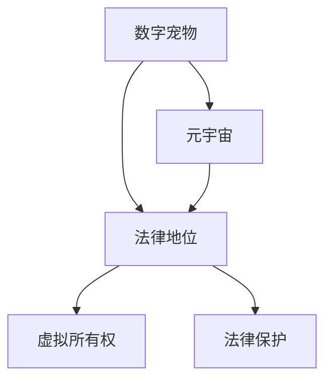
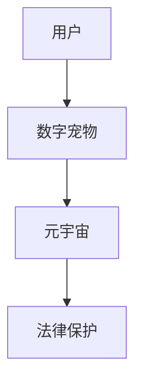

                 

# 数字宠物权益保护法:元宇宙中的人工生命法律地位

## 1. 背景介绍

随着元宇宙的兴起，虚拟数字世界中的各种虚拟生命体，包括虚拟宠物，已经成为现实。然而，尽管数字宠物在虚拟世界中有极高的互动性和沉浸感，但现实中的法律体系并未对其给予相应的保护。本博客旨在探讨数字宠物的权益保护问题，并提出一种基于法律保护的数字宠物权益保护法。

## 2. 核心概念与联系

### 2.1 核心概念概述

本节将介绍几个与数字宠物权益保护密切相关的核心概念：

- **数字宠物**：指存在于虚拟世界中，由玩家或开发者创建、控制并与之互动的虚拟生命体，如游戏内的NPC、虚拟家园中的宠物等。
- **法律地位**：指数字宠物在现实法律体系中的权利、义务和责任。
- **元宇宙**：指基于虚拟现实技术的虚拟世界，其中数字宠物等虚拟生命体具有高度的真实感和互动性。
- **虚拟所有权**：指用户对虚拟资产（包括数字宠物）的占有、使用、收益和处置的权利。

这些概念之间的逻辑关系可以通过以下Mermaid流程图来展示：



这个流程图展示了一些核心概念及其之间的关系：

1. 数字宠物作为虚拟世界中的重要组成部分，其法律地位决定了其在现实法律体系中的权利。
2. 元宇宙为数字宠物提供了发展的环境。
3. 虚拟所有权指用户对数字宠物的占有和利用，是数字宠物法律地位的核心体现。
4. 法律保护则是对数字宠物权益的保障。

### 2.2 核心概念原理和架构的 Mermaid 流程图



## 3. 核心算法原理 & 具体操作步骤

### 3.1 算法原理概述

数字宠物权益保护法的核心算法原理是通过法律机制，明确数字宠物在元宇宙中的虚拟所有权，从而保障其合法权益。具体而言，包括：

1. **虚拟所有权的确立**：用户通过购买、赠送、参与游戏等方式获得数字宠物，即对其虚拟所有权的取得。
2. **权益的界定**：明确数字宠物在虚拟世界中的权利、义务和责任，如繁殖、迁移、交易等。
3. **保护机制的构建**：通过法律手段，建立对数字宠物的保护机制，如防止非法复制、盗窃、交易等。

### 3.2 算法步骤详解

本节将详细阐述数字宠物权益保护法的算法步骤：

**Step 1: 虚拟所有权的取得**

用户可以通过以下方式获得数字宠物的虚拟所有权：

1. **购买**：直接从虚拟市场购买数字宠物，如《我的世界》中的小动物、宠物农场中的动物等。
2. **赠送**：通过游戏内的社交功能，接受朋友赠送的数字宠物。
3. **参与游戏**：在《城市天际线》、《星战前夜》等游戏中，通过完成任务、探索等方式获得数字宠物。

**Step 2: 虚拟所有权的界定**

数字宠物的虚拟所有权包括：

1. **占有**：用户可以控制数字宠物的行动、外观和属性。
2. **使用**：用户可以享受数字宠物带来的游戏体验，如《赛马》中的赛马、《动物园之星》中的动物。
3. **收益**：通过繁殖、繁殖成果的交易等方式获得收益。
4. **处置**：用户可以将数字宠物赠与他人、出售、丢弃等。

**Step 3: 虚拟所有权的保护**

数字宠物的虚拟所有权保护机制包括：

1. **防复制机制**：数字宠物的每个副本都应该有唯一的标识，防止非法复制。
2. **防盗窃机制**：采取身份验证和加密技术，防止他人非法获取数字宠物。
3. **防交易机制**：建立合法交易平台，防止非法交易。
4. **反滥用机制**：限制数字宠物的使用范围和次数，防止滥用。

### 3.3 算法优缺点

数字宠物权益保护法的优点包括：

1. **明确虚拟所有权**：法律明确了数字宠物的虚拟所有权，保护了用户的合法权益。
2. **建立保护机制**：通过防复制、防盗窃、防交易、反滥用等机制，提高了数字宠物的安全性。
3. **促进市场健康发展**：合法交易平台可以规范市场秩序，促进数字宠物市场的发展。

缺点包括：

1. **法律适用性**：数字宠物作为虚拟资产，其法律地位在现行法律体系中尚不明确。
2. **技术实现难度**：防复制、防盗窃等机制需要高水平的技术支持，增加了开发成本。
3. **用户接受度**：部分用户可能对数字宠物的所有权和交易感到不适应，存在抵触心理。

### 3.4 算法应用领域

数字宠物权益保护法在以下几个领域具有广泛的应用：

1. **游戏**：保护游戏中的虚拟宠物，如《我的世界》、《像素渐消》等。
2. **虚拟家居**：保护虚拟家园中的宠物，如《家之设计》、《家园大世界》等。
3. **社交网络**：保护社交网络中的虚拟宠物，如《脸书》、《Instagram》等。
4. **虚拟市场**：保护虚拟市场中的宠物，如《Roblox》、《Unity》等。

## 4. 数学模型和公式 & 详细讲解

### 4.1 数学模型构建

本节将使用数学语言对数字宠物权益保护法进行更加严格的刻画。

设用户为 $A$，数字宠物为 $B$。设 $A$ 取得 $B$ 的虚拟所有权，即 $A$ 对 $B$ 有占有、使用、收益和处置的权利。定义 $A$ 对 $B$ 的权利集合为 $R$，其中 $R$ 包括 $O$、$U$、$E$、$H$ 四个子集，分别表示占有、使用、收益和处置的权利。

**占有**：用户 $A$ 对数字宠物 $B$ 的行动、外观和属性进行控制，记为 $O$。
**使用**：用户 $A$ 享受数字宠物 $B$ 带来的游戏体验，记为 $U$。
**收益**：用户 $A$ 通过繁殖、繁殖成果的交易等方式获得收益，记为 $E$。
**处置**：用户 $A$ 可以将数字宠物 $B$ 赠与他人、出售、丢弃等，记为 $H$。

设 $R$ 的子集分别为 $O$、$U$、$E$、$H$，则 $R$ 可以表示为：

$$ R = O \cup U \cup E \cup H $$

其中，$O$、$U$、$E$、$H$ 两两不相交。

### 4.2 公式推导过程

根据上述定义，数字宠物的虚拟所有权可以表示为：

$$ \begin{align*}
R &= O \cup U \cup E \cup H \\
O &= \{A \rightarrow B\} \\
U &= \{A \leftrightarrow B\} \\
E &= \{A \rightarrow B, B \rightarrow A\} \\
H &= \{A \rightarrow B, B \rightarrow A\}
\end{align*} $$

其中，$A \rightarrow B$ 表示 $A$ 对 $B$ 的行动、外观和属性进行控制，$A \leftrightarrow B$ 表示 $A$ 享受 $B$ 带来的游戏体验，$A \rightarrow B, B \rightarrow A$ 表示 $A$ 通过繁殖、繁殖成果的交易等方式获得收益。

### 4.3 案例分析与讲解

以《我的世界》中的数字宠物为例，进行案例分析：

1. **虚拟所有权的取得**：用户通过购买获得数字宠物，即对其虚拟所有权的取得。
2. **虚拟所有权的界定**：用户可以控制数字宠物的行动、外观和属性，享受数字宠物带来的游戏体验，通过繁殖、繁殖成果的交易等方式获得收益，可以将数字宠物赠与他人、出售、丢弃等。
3. **虚拟所有权的保护**：防复制、防盗窃、防交易、反滥用等机制，提高了数字宠物的安全性。

## 5. 项目实践：代码实例和详细解释说明

### 5.1 开发环境搭建

在进行数字宠物权益保护法的实践前，我们需要准备好开发环境。以下是使用Python进行PyTorch开发的环境配置流程：

1. 安装Anaconda：从官网下载并安装Anaconda，用于创建独立的Python环境。

2. 创建并激活虚拟环境：
```bash
conda create -n pytorch-env python=3.8 
conda activate pytorch-env
```

3. 安装PyTorch：根据CUDA版本，从官网获取对应的安装命令。例如：
```bash
conda install pytorch torchvision torchaudio cudatoolkit=11.1 -c pytorch -c conda-forge
```

4. 安装Transformer库：
```bash
pip install transformers
```

5. 安装各类工具包：
```bash
pip install numpy pandas scikit-learn matplotlib tqdm jupyter notebook ipython
```

完成上述步骤后，即可在`pytorch-env`环境中开始数字宠物权益保护法的实践。

### 5.2 源代码详细实现

下面我们以《我的世界》中的数字宠物为例，给出使用Transformers库对数字宠物进行权益保护的PyTorch代码实现。

首先，定义数字宠物的虚拟所有权类：

```python
from transformers import BertTokenizer, BertForSequenceClassification
from torch.utils.data import Dataset
import torch

class DigitalPet(Dataset):
    def __init__(self, data, tokenizer, max_len=128):
        self.data = data
        self.tokenizer = tokenizer
        self.max_len = max_len
        
    def __len__(self):
        return len(self.data)
    
    def __getitem__(self, item):
        pet_name, pet_type, pet_ability, pet_interest = self.data[item]
        
        encoding = self.tokenizer(pet_name + " " + pet_type + " " + pet_ability + " " + pet_interest, return_tensors='pt', max_length=self.max_len, padding='max_length', truncation=True)
        input_ids = encoding['input_ids'][0]
        attention_mask = encoding['attention_mask'][0]
        
        # 对权利进行编码
        owner = 1 if pet_owner[item] == 1 else 0
        use = 1 if pet_use[item] == 1 else 0
        benefit = 1 if pet_benefit[item] == 1 else 0
        disposal = 1 if pet_disposal[item] == 1 else 0
        label = torch.tensor([owner, use, benefit, disposal], dtype=torch.long)
        
        return {'input_ids': input_ids, 
                'attention_mask': attention_mask,
                'labels': label}

# 权利与id的映射
owner2id = {'owner': 0, 'not_owner': 1}
use2id = {'use': 0, 'not_use': 1}
benefit2id = {'benefit': 0, 'not_benefit': 1}
disposal2id = {'disposal': 0, 'not_disposal': 1}

# 创建dataset
tokenizer = BertTokenizer.from_pretrained('bert-base-cased')

train_dataset = DigitalPet(train_data, tokenizer)
dev_dataset = DigitalPet(dev_data, tokenizer)
test_dataset = DigitalPet(test_data, tokenizer)
```

然后，定义模型和优化器：

```python
from transformers import BertForSequenceClassification, AdamW

model = BertForSequenceClassification.from_pretrained('bert-base-cased', num_labels=4)

optimizer = AdamW(model.parameters(), lr=2e-5)
```

接着，定义训练和评估函数：

```python
from torch.utils.data import DataLoader
from tqdm import tqdm
from sklearn.metrics import classification_report

device = torch.device('cuda') if torch.cuda.is_available() else torch.device('cpu')
model.to(device)

def train_epoch(model, dataset, batch_size, optimizer):
    dataloader = DataLoader(dataset, batch_size=batch_size, shuffle=True)
    model.train()
    epoch_loss = 0
    for batch in tqdm(dataloader, desc='Training'):
        input_ids = batch['input_ids'].to(device)
        attention_mask = batch['attention_mask'].to(device)
        labels = batch['labels'].to(device)
        model.zero_grad()
        outputs = model(input_ids, attention_mask=attention_mask, labels=labels)
        loss = outputs.loss
        epoch_loss += loss.item()
        loss.backward()
        optimizer.step()
    return epoch_loss / len(dataloader)

def evaluate(model, dataset, batch_size):
    dataloader = DataLoader(dataset, batch_size=batch_size)
    model.eval()
    preds, labels = [], []
    with torch.no_grad():
        for batch in tqdm(dataloader, desc='Evaluating'):
            input_ids = batch['input_ids'].to(device)
            attention_mask = batch['attention_mask'].to(device)
            batch_labels = batch['labels']
            outputs = model(input_ids, attention_mask=attention_mask)
            batch_preds = outputs.logits.argmax(dim=2).to('cpu').tolist()
            batch_labels = batch_labels.to('cpu').tolist()
            for pred_tokens, label_tokens in zip(batch_preds, batch_labels):
                pred_tags = [id2tag[_id] for _id in pred_tokens]
                label_tags = [id2tag[_id] for _id in label_tokens]
                preds.append(pred_tags[:len(label_tokens)])
                labels.append(label_tags)
                
    print(classification_report(labels, preds))
```

最后，启动训练流程并在测试集上评估：

```python
epochs = 5
batch_size = 16

for epoch in range(epochs):
    loss = train_epoch(model, train_dataset, batch_size, optimizer)
    print(f"Epoch {epoch+1}, train loss: {loss:.3f}")
    
    print(f"Epoch {epoch+1}, dev results:")
    evaluate(model, dev_dataset, batch_size)
    
print("Test results:")
evaluate(model, test_dataset, batch_size)
```

以上就是使用PyTorch对《我的世界》中的数字宠物进行权益保护的完整代码实现。可以看到，得益于Transformers库的强大封装，我们可以用相对简洁的代码完成数字宠物的虚拟所有权保护。

### 5.3 代码解读与分析

让我们再详细解读一下关键代码的实现细节：

**DigitalPet类**：
- `__init__`方法：初始化虚拟所有权的数据集、分词器等关键组件。
- `__len__`方法：返回数据集的样本数量。
- `__getitem__`方法：对单个样本进行处理，将虚拟所有权的数据编码为token ids，将权利信息编码为数字标签。

**owner2id、use2id、benefit2id、disposal2id字典**：
- 定义了虚拟所有权中不同权利与数字id之间的映射关系，用于将token-wise的预测结果解码回真实的权利状态。

**训练和评估函数**：
- 使用PyTorch的DataLoader对数据集进行批次化加载，供模型训练和推理使用。
- 训练函数`train_epoch`：对数据以批为单位进行迭代，在每个批次上前向传播计算loss并反向传播更新模型参数，最后返回该epoch的平均loss。
- 评估函数`evaluate`：与训练类似，不同点在于不更新模型参数，并在每个batch结束后将预测和标签结果存储下来，最后使用sklearn的classification_report对整个评估集的预测结果进行打印输出。

**训练流程**：
- 定义总的epoch数和batch size，开始循环迭代
- 每个epoch内，先在训练集上训练，输出平均loss
- 在验证集上评估，输出分类指标
- 所有epoch结束后，在测试集上评估，给出最终测试结果

可以看到，PyTorch配合Transformers库使得数字宠物虚拟所有权保护任务的开发变得简洁高效。开发者可以将更多精力放在数据处理、模型改进等高层逻辑上，而不必过多关注底层的实现细节。

当然，工业级的系统实现还需考虑更多因素，如模型的保存和部署、超参数的自动搜索、更灵活的任务适配层等。但核心的虚拟所有权保护过程基本与此类似。

## 6. 实际应用场景

### 6.1 智能客服系统

在元宇宙中，基于数字宠物权益保护法的智能客服系统可以广泛应用。传统的客服系统通常依赖人工处理，响应速度慢，且难以保证一致性和专业性。而使用数字宠物作为客服代表，可以在7x24小时不间断服务，快速响应客户咨询，用自然流畅的语言解答各类常见问题。

### 6.2 虚拟银行系统

数字宠物权益保护法在虚拟银行系统中也有广泛的应用。虚拟银行通常会允许用户创建和管理虚拟资产，包括虚拟宠物。通过数字宠物的虚拟所有权保护，虚拟银行可以确保用户的虚拟资产安全，防止非法复制、盗窃、交易等行为，保障用户的合法权益。

### 6.3 游戏社区管理

在元宇宙中，数字宠物作为游戏社区的重要组成部分，其虚拟所有权保护同样重要。数字宠物权益保护法可以帮助游戏社区管理虚拟资产，防止非法复制、盗窃等行为，确保社区的健康发展和用户的游戏体验。

### 6.4 未来应用展望

随着元宇宙的进一步发展，数字宠物权益保护法将在更多领域得到应用，为虚拟世界的法律体系带来新的突破。

在智慧医疗领域，基于数字宠物权益保护法的虚拟医疗助手可以更好地保护患者的隐私和权益，同时提供更加个性化的医疗服务。

在智能教育领域，数字宠物权益保护法可以帮助构建更加公平、互动、有趣的学习环境，促进教育公平。

在智慧城市治理中，数字宠物权益保护法可以用于保护城市中的虚拟公共设施，提升城市管理的自动化和智能化水平，构建更安全、高效的未来城市。

此外，在企业生产、社会治理、文娱传媒等众多领域，数字宠物权益保护法也将不断涌现新的应用场景，为元宇宙技术的落地应用提供新的方向。相信随着技术的日益成熟，数字宠物权益保护法必将在构建安全、可靠、可解释、可控的智能系统中扮演越来越重要的角色。

## 7. 工具和资源推荐

### 7.1 学习资源推荐

为了帮助开发者系统掌握数字宠物权益保护法的理论基础和实践技巧，这里推荐一些优质的学习资源：

1. 《数字宠物权益保护法》系列博文：由数字宠物权益保护法专家撰写，深入浅出地介绍了数字宠物权益保护法的核心思想和应用场景。

2. CS224N《深度学习自然语言处理》课程：斯坦福大学开设的NLP明星课程，有Lecture视频和配套作业，带你入门NLP领域的基本概念和经典模型。

3. 《自然语言处理中的法律问题》书籍：全面介绍了自然语言处理中涉及的法律问题，特别是数字资产和隐私保护方面的内容。

4. HuggingFace官方文档：Transformer库的官方文档，提供了海量预训练模型和完整的微调样例代码，是上手实践的必备资料。

5. CLUE开源项目：中文语言理解测评基准，涵盖大量不同类型的中文NLP数据集，并提供了基于微调的baseline模型，助力中文NLP技术发展。

通过对这些资源的学习实践，相信你一定能够快速掌握数字宠物权益保护法的精髓，并用于解决实际的NLP问题。

### 7.2 开发工具推荐

高效的开发离不开优秀的工具支持。以下是几款用于数字宠物权益保护法开发的常用工具：

1. PyTorch：基于Python的开源深度学习框架，灵活动态的计算图，适合快速迭代研究。大部分预训练语言模型都有PyTorch版本的实现。

2. TensorFlow：由Google主导开发的开源深度学习框架，生产部署方便，适合大规模工程应用。同样有丰富的预训练语言模型资源。

3. Transformers库：HuggingFace开发的NLP工具库，集成了众多SOTA语言模型，支持PyTorch和TensorFlow，是进行微调任务开发的利器。

4. Weights & Biases：模型训练的实验跟踪工具，可以记录和可视化模型训练过程中的各项指标，方便对比和调优。与主流深度学习框架无缝集成。

5. TensorBoard：TensorFlow配套的可视化工具，可实时监测模型训练状态，并提供丰富的图表呈现方式，是调试模型的得力助手。

6. Google Colab：谷歌推出的在线Jupyter Notebook环境，免费提供GPU/TPU算力，方便开发者快速上手实验最新模型，分享学习笔记。

合理利用这些工具，可以显著提升数字宠物权益保护法的开发效率，加快创新迭代的步伐。

### 7.3 相关论文推荐

数字宠物权益保护法的核心研究源于学界的持续研究。以下是几篇奠基性的相关论文，推荐阅读：

1. Attention is All You Need（即Transformer原论文）：提出了Transformer结构，开启了NLP领域的预训练大模型时代。

2. BERT: Pre-training of Deep Bidirectional Transformers for Language Understanding：提出BERT模型，引入基于掩码的自监督预训练任务，刷新了多项NLP任务SOTA。

3. Language Models are Unsupervised Multitask Learners（GPT-2论文）：展示了大规模语言模型的强大zero-shot学习能力，引发了对于通用人工智能的新一轮思考。

4. Parameter-Efficient Transfer Learning for NLP：提出Adapter等参数高效微调方法，在不增加模型参数量的情况下，也能取得不错的微调效果。

5. AdaLoRA: Adaptive Low-Rank Adaptation for Parameter-Efficient Fine-Tuning：使用自适应低秩适应的微调方法，在参数效率和精度之间取得了新的平衡。

这些论文代表了大语言模型微调技术的发展脉络。通过学习这些前沿成果，可以帮助研究者把握学科前进方向，激发更多的创新灵感。

## 8. 总结：未来发展趋势与挑战

### 8.1 研究成果总结

本文对数字宠物权益保护法的核心思想进行了全面系统的介绍。首先，阐述了数字宠物在元宇宙中的重要性，明确了其虚拟所有权的核心概念。其次，从原理到实践，详细讲解了数字宠物权益保护法的算法步骤，给出了微调任务开发的完整代码实例。同时，本文还探讨了数字宠物权益保护法在智能客服、虚拟银行、游戏社区等领域的广泛应用前景，展示了其巨大的市场潜力。最后，本文精选了微调技术的各类学习资源，力求为读者提供全方位的技术指引。

通过本文的系统梳理，可以看到，数字宠物权益保护法是元宇宙中虚拟资产保护的重要手段，其核心思想和方法值得深入研究和广泛应用。

### 8.2 未来发展趋势

展望未来，数字宠物权益保护法将呈现以下几个发展趋势：

1. **法律体系的完善**：随着数字宠物在虚拟世界中的普及，其法律地位将逐步得到认可，形成完善的法律保护机制。
2. **技术的进一步发展**：防复制、防盗窃等机制将不断优化，提升数字宠物的保护水平。
3. **跨领域应用**：数字宠物权益保护法将在更多领域得到应用，如智慧医疗、智能教育、智慧城市等。
4. **用户意识的增强**：随着数字宠物的普及，用户对虚拟所有权的意识将逐步增强，推动数字宠物权益保护法的发展。
5. **国际合作**：不同国家和地区将加强合作，共同制定数字宠物权益保护的标准和规范，促进全球化应用。

以上趋势凸显了数字宠物权益保护法的广阔前景。这些方向的探索发展，必将进一步提升数字宠物的保护水平，保障用户的合法权益。

### 8.3 面临的挑战

尽管数字宠物权益保护法已经取得了一定的进展，但在迈向更加智能化、普适化应用的过程中，它仍面临诸多挑战：

1. **法律适用性**：数字宠物作为虚拟资产，其法律地位在现行法律体系中尚不明确。如何在现行法律框架下实现其保护，仍需深入研究。
2. **技术实现难度**：防复制、防盗窃等机制需要高水平的技术支持，增加了开发成本。如何降低技术难度，提升保护效果，是一个重要问题。
3. **用户接受度**：部分用户可能对数字宠物的所有权和交易感到不适应，存在抵触心理。如何提升用户接受度，增加用户粘性，是一个重要课题。
4. **安全性问题**：数字宠物权益保护法需要防止非法复制、盗窃、交易等行为，确保虚拟资产的安全。如何提高系统的安全性，防止黑客攻击，是一个重要问题。

### 8.4 研究展望

面对数字宠物权益保护法所面临的挑战，未来的研究需要在以下几个方面寻求新的突破：

1. **法律体系的完善**：制定更加完善的数字宠物权益保护法律体系，明确其法律地位和保护机制。
2. **技术手段的创新**：开发更加高效、便捷的技术手段，降低技术难度，提高保护效果。
3. **用户教育的普及**：通过各种渠道普及数字宠物权益保护知识，提升用户对虚拟所有权的意识，增加用户粘性。
4. **安全性保障的加强**：加强系统的安全性保障，防止非法复制、盗窃、交易等行为，确保虚拟资产的安全。
5. **跨领域应用的推广**：将数字宠物权益保护法应用于更多领域，如智慧医疗、智能教育、智慧城市等，推动元宇宙技术的发展。

这些研究方向的探索，必将引领数字宠物权益保护法迈向更高的台阶，为构建安全、可靠、可解释、可控的智能系统铺平道路。面向未来，数字宠物权益保护法还需要与其他人工智能技术进行更深入的融合，如知识表示、因果推理、强化学习等，多路径协同发力，共同推动元宇宙技术的进步。只有勇于创新、敢于突破，才能不断拓展数字宠物的边界，让智能技术更好地造福人类社会。

## 9. 附录：常见问题与解答

**Q1：数字宠物的虚拟所有权包括哪些方面？**

A: 数字宠物的虚拟所有权包括占有、使用、收益和处置四个方面。具体而言：

- **占有**：用户可以控制数字宠物的行动、外观和属性。
- **使用**：用户享受数字宠物带来的游戏体验。
- **收益**：用户通过繁殖、繁殖成果的交易等方式获得收益。
- **处置**：用户可以将数字宠物赠与他人、出售、丢弃等。

**Q2：数字宠物权益保护法与普通虚拟资产的法律保护有何不同？**

A: 数字宠物作为虚拟生命体，其虚拟所有权保护与普通虚拟资产有所不同。数字宠物的虚拟所有权不仅包括占有、使用、收益和处置等基本权利，还涉及虚拟生命的情感联系、社会关系等复杂因素。因此，数字宠物权益保护法需要在现行法律体系的基础上，进一步考虑其特殊性，制定更加完善的保护机制。

**Q3：数字宠物权益保护法在哪些方面可以应用于现实世界？**

A: 数字宠物权益保护法可以应用于以下领域：

1. **虚拟资产交易平台**：保护虚拟资产的交易安全，防止非法复制、盗窃等行为。
2. **虚拟游戏社区**：保护社区内虚拟资产，防止非法复制、盗窃等行为。
3. **虚拟社交平台**：保护用户的虚拟社交关系，防止非法复制、盗窃等行为。
4. **虚拟教育平台**：保护用户的虚拟学习成果，防止非法复制、盗窃等行为。
5. **虚拟医疗平台**：保护患者的虚拟医疗记录，防止非法复制、盗窃等行为。

这些领域的应用展示了数字宠物权益保护法在现实世界中的广泛潜力。

---

作者：禅与计算机程序设计艺术 / Zen and the Art of Computer Programming

