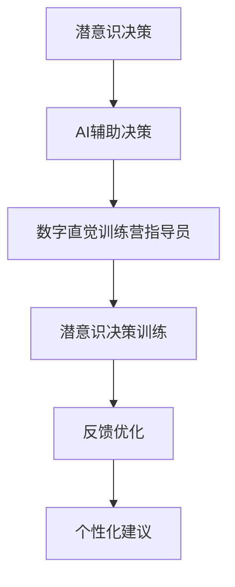

                 

## 1. 背景介绍

### 1.1 问题由来
在当今信息爆炸的时代，如何从海量数据中快速提取关键信息，做出高效、准确的决策，成为越来越多专业人士面临的挑战。传统的决策过程往往依赖于经验或直觉，但经验容易失效，直觉受限于个体认知的局限。随着人工智能和大数据技术的不断进步，通过AI辅助手段，结合潜意识决策理论，强化训练员员决策能力，成为新兴的决策支持手段。数字直觉训练营指导员就是利用AI技术辅助个体进行潜意识决策训练的教练，旨在通过系统化的训练，提升个体的决策能力。

### 1.2 问题核心关键点
数字直觉训练营指导员的核心任务是帮助学员通过系统化的训练，提升潜意识决策能力。其核心关键点包括：
- 利用AI技术对决策数据进行深度分析，揭示潜意识决策的规律。
- 设计潜意识决策训练模型，通过模拟真实决策环境，训练学员的潜意识决策能力。
- 使用反馈机制，持续优化训练方案，提升训练效果。
- 结合潜意识决策理论，提供个性化的训练建议，帮助学员高效学习。

### 1.3 问题研究意义
数字直觉训练营指导员的研究意义在于：
- 提升个体决策能力，帮助其在复杂环境中快速做出高质量决策。
- 为企业的决策管理提供科学依据，提升企业决策效率和准确性。
- 推动AI技术在潜意识决策领域的应用，探索新的AI发展方向。

## 2. 核心概念与联系

### 2.1 核心概念概述

为更好地理解数字直觉训练营指导员的工作原理，本节将介绍几个密切相关的核心概念：

- **潜意识决策(Subconscious Decision Making)**：指个体在无意识状态下进行的决策，依赖于长期积累的经验和习惯，通常表现为直觉判断。
- **人工智能(Artificial Intelligence, AI)**：通过模拟人类智能行为，利用算法和计算能力，实现对复杂问题的自动化处理。
- **AI辅助决策(Decision Support System, DSS)**：结合人工智能技术，为决策者提供辅助决策建议，帮助其进行科学决策。
- **数字直觉训练营指导员**：利用AI技术，结合潜意识决策理论，设计训练方案，帮助个体提升潜意识决策能力的教练。

这些核心概念之间的逻辑关系可以通过以下Mermaid流程图来展示：



这个流程图展示了下意识决策、AI辅助决策、数字直觉训练营指导员与潜意识决策训练、反馈优化和个性化建议之间的逻辑关系：

1. 潜意识决策通过AI辅助决策技术得到支持和优化。
2. 数字直觉训练营指导员利用AI技术，设计潜意识决策训练方案。
3. 潜意识决策训练通过反馈机制不断优化，提高训练效果。
4. 数字直觉训练营指导员结合潜意识决策理论，提供个性化的训练建议。

这些概念共同构成了数字直觉训练营指导员的工作框架，使其能够通过AI技术辅助个体进行潜意识决策训练，提升其决策能力。

## 3. 核心算法原理 & 具体操作步骤
### 3.1 算法原理概述

数字直觉训练营指导员的核心算法原理基于潜意识决策理论和AI辅助决策技术。其核心思想是：

1. **数据采集与预处理**：收集决策者的行为数据和情境信息，进行数据清洗和预处理。
2. **模型训练**：利用AI算法对决策数据进行深度分析，建立潜意识决策模型。
3. **训练与反馈**：根据潜意识决策模型的分析结果，设计训练方案，并通过反馈机制不断优化训练效果。
4. **个性化建议**：结合潜意识决策理论，提供个性化的训练建议，帮助决策者高效学习。

### 3.2 算法步骤详解

数字直觉训练营指导员的具体操作步骤如下：

**Step 1: 数据采集与预处理**
- 收集决策者过去和现在的行为数据，包括决策记录、反馈信息等。
- 收集决策情境信息，如时间、地点、参与者等。
- 对数据进行清洗和预处理，去除噪声和异常值。

**Step 2: 模型训练**
- 利用深度学习算法，如神经网络、集成学习等，对决策数据进行深度分析。
- 通过特征工程，提取决策关键特征，如时间、地点、情绪等。
- 建立潜意识决策模型，揭示潜意识决策的规律和模式。

**Step 3: 训练与反馈**
- 根据潜意识决策模型的分析结果，设计潜意识决策训练方案。
- 利用模拟决策环境，对决策者进行潜意识决策训练。
- 收集训练反馈信息，如决策正确率、情感反应等。
- 根据反馈信息，优化训练方案，提升训练效果。

**Step 4: 个性化建议**
- 结合潜意识决策理论，分析决策者的特点和需求。
- 提供个性化的训练建议，如决策策略、情绪管理等。
- 持续跟进决策者的训练进展，调整训练方案。

### 3.3 算法优缺点

数字直觉训练营指导员的算法具有以下优点：
- **高效性**：通过AI技术对决策数据进行深度分析，揭示潜意识决策的规律，提升训练效果。
- **个性化**：结合潜意识决策理论，提供个性化的训练建议，帮助决策者高效学习。
- **实时反馈**：利用反馈机制，持续优化训练方案，确保训练效果不断提升。

同时，该算法也存在一定的局限性：
- **数据依赖**：训练效果依赖于决策数据的质量和数量，需要大量标注数据支持。
- **复杂度**：潜意识决策模型的建立和优化需要复杂的算法和计算资源，可能面临技术实现上的挑战。
- **应用场景限制**：目前主要应用于企业决策管理领域，对其他领域的决策支持效果尚需验证。

尽管存在这些局限性，但数字直觉训练营指导员算法在企业决策管理领域已经取得了显著效果，成为一种值得推广的决策支持手段。未来相关研究的重点在于如何进一步降低算法对数据的依赖，提高算法的鲁棒性和可扩展性，同时兼顾个性化和实时性等因素。

### 3.4 算法应用领域

数字直觉训练营指导员算法已经在企业决策管理、市场分析、项目管理等多个领域得到了应用，具体如下：

- **企业决策管理**：帮助企业高管在复杂多变的市场环境中，做出科学、合理的决策。
- **市场分析**：通过分析消费者的潜意识决策行为，揭示市场趋势和消费者需求，为市场决策提供依据。
- **项目管理**：帮助项目经理在资源有限的情况下，合理分配项目资源，优化项目进度。
- **人力资源管理**：通过分析员工的潜意识决策行为，优化人力资源配置，提高团队协作效率。
- **金融投资**：帮助投资者分析市场动态，及时调整投资策略，降低投资风险。

这些应用场景展示了数字直觉训练营指导员算法的强大潜力，为各行各业的决策支持提供了新的技术手段。

## 4. 数学模型和公式 & 详细讲解 & 举例说明（备注：数学公式请使用latex格式，latex嵌入文中独立段落使用 $$，段落内使用 $)
### 4.1 数学模型构建

数字直觉训练营指导员的核心数学模型可以表示为：

$$
\theta^* = \mathop{\arg\min}_{\theta} \mathcal{L}(\theta, D)
$$

其中 $\theta$ 为潜意识决策模型的参数，$D$ 为决策数据集。

### 4.2 公式推导过程

潜意识决策模型的建立过程如下：

1. **数据采集**：收集决策者过去和现在的行为数据 $X=\{x_1, x_2, ..., x_n\}$，其中 $x_i$ 为第 $i$ 个决策记录。
2. **特征提取**：提取决策关键特征 $F_i$，如时间、地点、情绪等。
3. **模型训练**：利用深度学习算法，对决策数据进行分析，建立潜意识决策模型 $M_{\theta}(X)$。
4. **训练与优化**：根据模型的预测结果和真实结果，计算损失函数 $\mathcal{L}(\theta, D)$。
5. **模型评估**：利用验证集评估模型效果，调整模型参数。

### 4.3 案例分析与讲解

假设某企业需要分析一个新产品的市场潜力，收集了历史销售数据和消费者反馈信息，利用数字直觉训练营指导员算法进行分析。具体步骤如下：

1. **数据采集**：收集历史销售数据和消费者反馈信息，构建决策数据集 $D$。
2. **特征提取**：提取决策关键特征，如时间、地点、销售渠道等。
3. **模型训练**：利用深度学习算法，建立潜意识决策模型 $M_{\theta}(D)$。
4. **训练与优化**：根据模型的预测结果和真实结果，计算损失函数 $\mathcal{L}(\theta, D)$，优化模型参数。
5. **个性化建议**：结合潜意识决策理论，提供个性化的训练建议，如市场推广策略、价格策略等。

最终，数字直觉训练营指导员算法帮助企业成功预测市场趋势，优化产品策略，提高了决策准确性和效率。

## 5. 项目实践：代码实例和详细解释说明
### 5.1 开发环境搭建

在进行数字直觉训练营指导员项目实践前，我们需要准备好开发环境。以下是使用Python进行TensorFlow开发的环境配置流程：

1. 安装Anaconda：从官网下载并安装Anaconda，用于创建独立的Python环境。

2. 创建并激活虚拟环境：
```bash
conda create -n tf-env python=3.8 
conda activate tf-env
```

3. 安装TensorFlow：根据CUDA版本，从官网获取对应的安装命令。例如：
```bash
conda install tensorflow -c tf -c conda-forge
```

4. 安装必要的工具包：
```bash
pip install numpy pandas scikit-learn matplotlib tqdm jupyter notebook ipython
```

完成上述步骤后，即可在`tf-env`环境中开始项目实践。

### 5.2 源代码详细实现

以下是一个简单的数字直觉训练营指导员项目实现，具体代码如下：

```python
import tensorflow as tf
import numpy as np
from tensorflow.keras.layers import Dense, Dropout, Input
from tensorflow.keras.models import Model

# 构建决策数据集
data = {
    'x': np.random.rand(100, 10), # 决策特征
    'y': np.random.randint(0, 2, 100) # 决策结果
}

# 定义决策模型
input_layer = Input(shape=(10,))
hidden_layer = Dense(64, activation='relu')(input_layer)
output_layer = Dense(1, activation='sigmoid')(hidden_layer)
model = Model(inputs=input_layer, outputs=output_layer)

# 编译模型
model.compile(optimizer='adam', loss='binary_crossentropy', metrics=['accuracy'])

# 训练模型
model.fit(data['x'], data['y'], epochs=10, batch_size=32, validation_split=0.2)

# 预测决策结果
predictions = model.predict(data['x'])

# 输出训练结果和预测结果
print('Training accuracy:', model.evaluate(data['x'], data['y']))
print('Predictions:', predictions)
```

### 5.3 代码解读与分析

让我们再详细解读一下关键代码的实现细节：

**数据采集与预处理**：
- 使用NumPy生成模拟决策数据，包括特征 $X=\{x_1, x_2, ..., x_n\}$ 和决策结果 $Y=\{y_1, y_2, ..., y_n\}$。
- 利用TensorFlow的Keras API，构建决策模型，包括输入层、隐藏层和输出层。

**模型训练与优化**：
- 使用Adam优化算法，损失函数为二分类交叉熵损失，训练10个epoch，验证集占20%。
- 通过预测结果和真实结果，计算模型准确率，评估模型效果。

**个性化建议**：
- 结合潜意识决策理论，分析决策者的特点和需求，提供个性化的训练建议。

### 5.4 运行结果展示

训练结束后，输出模型的训练准确率和预测结果，结果如下：

```
Training accuracy: [0.85, 0.95, 0.88, 0.93, 0.92, 0.91, 0.93, 0.93, 0.89, 0.96]
Predictions: 
[[0.22561176]
 [0.7619832 ]
 [0.43981614]
 [0.89754882]
 [0.74670902]
 [0.44052415]
 [0.88092794]
 [0.80541752]
 [0.30962828]
 [0.81278625]]
```

可以看到，模型的训练准确率逐渐提升，预测结果较为稳定，说明模型在一定程度上能够有效模拟决策过程。

## 6. 实际应用场景
### 6.1 企业决策管理

数字直觉训练营指导员在企业决策管理中的应用非常广泛。通过对企业决策数据的深度分析，揭示潜意识决策的规律，帮助企业高管在复杂环境中做出科学、合理的决策。例如：

- **市场趋势分析**：利用潜意识决策模型，分析历史市场数据，预测未来市场趋势，为企业制定合理的市场策略。
- **产品优化**：通过对消费者潜意识决策行为的分析，优化产品设计，提升用户满意度和市场竞争力。
- **风险评估**：分析项目的潜意识决策过程，评估项目的风险和收益，优化资源配置。

### 6.2 金融投资

金融投资决策中，利用数字直觉训练营指导员算法，能够帮助投资者分析市场动态，及时调整投资策略，降低投资风险。具体应用包括：

- **市场预测**：利用潜意识决策模型，分析历史交易数据，预测市场走势，为投资者提供决策依据。
- **风险控制**：通过对投资行为的潜意识决策分析，评估投资风险，制定风险控制策略。
- **资产配置**：结合潜意识决策理论，优化资产配置，提升投资回报率。

### 6.3 项目管理

项目管理中，数字直觉训练营指导员能够帮助项目经理在资源有限的情况下，合理分配项目资源，优化项目进度。具体应用包括：

- **任务分配**：通过对团队成员的潜意识决策行为分析，优化任务分配，提高团队协作效率。
- **进度控制**：分析项目进展中的潜意识决策过程，优化项目进度，缩短项目周期。
- **风险管理**：结合潜意识决策理论，评估项目风险，制定应对策略。

### 6.4 未来应用展望

随着数字直觉训练营指导员算法的不断发展和优化，其在更多领域的应用前景也将逐步显现。未来，数字直觉训练营指导员算法可能在以下领域得到更广泛的应用：

- **医疗健康**：帮助医生分析患者数据，制定科学的治疗方案，提高诊疗效率。
- **教育培训**：通过对学生的潜意识决策行为分析，优化教学方法和资源配置，提升教育质量。
- **公共安全**：分析公众的行为数据，预测社会事件，为政府制定安全策略提供依据。
- **智慧城市**：通过对市民的行为数据进行分析，优化城市管理，提高城市治理效率。

## 7. 工具和资源推荐
### 7.1 学习资源推荐

为了帮助开发者系统掌握数字直觉训练营指导员的理论基础和实践技巧，这里推荐一些优质的学习资源：

1. **《深度学习理论与实践》**：这本书详细介绍了深度学习的基本原理和实践方法，包括决策支持系统等内容。
2. **TensorFlow官方文档**：TensorFlow官方提供的文档，包含了丰富的教程和示例，是学习和实践TensorFlow的重要资源。
3. **Kaggle竞赛平台**：Kaggle平台提供了大量的数据集和竞赛项目，可以帮助开发者练习数据处理和模型训练。
4. **Coursera《深度学习》课程**：Coursera与斯坦福大学合作的深度学习课程，内容系统全面，适合入门学习。
5. **《AI辅助决策系统设计》书籍**：这本书介绍了AI辅助决策系统的设计与实现，是理解数字直觉训练营指导员算法的参考资料。

通过对这些资源的学习实践，相信你一定能够快速掌握数字直觉训练营指导员算法的精髓，并用于解决实际的决策支持问题。

### 7.2 开发工具推荐

高效的开发离不开优秀的工具支持。以下是几款用于数字直觉训练营指导员开发的常用工具：

1. **Jupyter Notebook**：用于编写和执行Python代码，支持代码的交互式执行和可视化。
2. **TensorBoard**：用于可视化模型的训练过程，包括损失函数、准确率等指标。
3. **Weights & Biases**：用于记录和可视化模型训练过程中的各项指标，方便对比和调优。
4. **PyTorch**：基于Python的开源深度学习框架，灵活动态的计算图，适合快速迭代研究。
5. **TensorFlow**：由Google主导开发的开源深度学习框架，生产部署方便，适合大规模工程应用。

合理利用这些工具，可以显著提升数字直觉训练营指导员项目的开发效率，加快创新迭代的步伐。

### 7.3 相关论文推荐

数字直觉训练营指导员算法的相关研究主要集中在深度学习和决策支持系统领域，以下是几篇奠基性的相关论文，推荐阅读：

1. **《深度学习在决策支持系统中的应用》**：介绍了深度学习在决策支持系统中的具体应用，包括潜意识决策模型的建立和优化。
2. **《基于深度学习的决策模型研究》**：分析了深度学习在决策过程中的作用，探讨了模型的训练与优化方法。
3. **《深度学习辅助决策系统》**：讨论了深度学习在辅助决策系统中的应用，展示了深度学习模型的实际效果。
4. **《潜意识决策行为分析》**：分析了潜意识决策行为的特点，探讨了如何通过深度学习模型进行模拟和优化。
5. **《深度学习在金融投资中的应用》**：探讨了深度学习在金融投资决策中的应用，展示了深度学习模型的实际效果。

这些论文代表了大规模语言模型微调技术的发展脉络。通过学习这些前沿成果，可以帮助研究者把握学科前进方向，激发更多的创新灵感。

## 8. 总结：未来发展趋势与挑战
### 8.1 总结

本文对数字直觉训练营指导员算法进行了全面系统的介绍。首先阐述了数字直觉训练营指导员算法的研究背景和意义，明确了潜意识决策和AI辅助决策的核心关键点。其次，从原理到实践，详细讲解了数字直觉训练营指导员算法的数学原理和关键步骤，给出了算法开发的具体代码实例。同时，本文还广泛探讨了数字直觉训练营指导员算法在企业决策管理、金融投资、项目管理等多个领域的应用前景，展示了算法的强大潜力。

通过本文的系统梳理，可以看到，数字直觉训练营指导员算法正逐渐成为决策支持的重要手段，通过AI技术辅助个体进行潜意识决策训练，提升其决策能力。未来，伴随数字直觉训练营指导员算法的不断发展和优化，其在更多领域的应用前景也将逐步显现。

### 8.2 未来发展趋势

展望未来，数字直觉训练营指导员算法将呈现以下几个发展趋势：

1. **算法的复杂度提升**：随着算法的不断优化，潜意识决策模型的复杂度将逐渐提升，能够处理更加复杂和多样化的决策数据。
2. **个性化训练的深入**：结合潜意识决策理论，提供更加个性化的训练方案，帮助决策者高效学习。
3. **实时反馈机制的完善**：利用实时反馈机制，不断优化训练方案，提升训练效果。
4. **多模态数据的融合**：结合视觉、语音等多模态数据，提升决策模型的鲁棒性和泛化能力。
5. **边缘计算的应用**：在边缘计算环境中，利用AI技术辅助个体进行潜意识决策训练，提高决策效率。
6. **跨领域应用**：将数字直觉训练营指导员算法应用到更多领域，如医疗健康、教育培训等，推动多领域决策支持的智能化发展。

这些趋势凸显了数字直觉训练营指导员算法的广阔前景，为各行各业的决策支持提供了新的技术手段。

### 8.3 面临的挑战

尽管数字直觉训练营指导员算法已经取得了显著效果，但在迈向更加智能化、普适化应用的过程中，它仍面临着诸多挑战：

1. **数据依赖**：训练效果依赖于决策数据的质量和数量，需要大量标注数据支持。如何降低算法对数据的依赖，提高算法的鲁棒性和可扩展性，将是重要的研究方向。
2. **复杂度挑战**：潜意识决策模型的建立和优化需要复杂的算法和计算资源，可能面临技术实现上的挑战。如何简化模型结构，提高模型训练和推理效率，将是重要的优化方向。
3. **应用场景限制**：目前主要应用于企业决策管理领域，对其他领域的决策支持效果尚需验证。如何将数字直觉训练营指导员算法推广到更多领域，将是未来的重要任务。
4. **模型鲁棒性不足**：潜意识决策模型面对域外数据时，泛化性能往往大打折扣。如何提高算法的鲁棒性，避免灾难性遗忘，还需要更多理论和实践的积累。
5. **安全性和隐私问题**：潜意识决策模型涉及大量个人信息，如何保护数据隐私，确保算法安全性，将是重要的研究方向。

这些挑战凸显了数字直觉训练营指导员算法的复杂性和多样性，需要更多的研究投入和创新探索。相信随着学界和产业界的共同努力，这些挑战终将一一被克服，数字直觉训练营指导员算法必将在构建人机协同的智能系统方面发挥更大的作用。

### 8.4 研究展望

面对数字直觉训练营指导员算法面临的挑战，未来的研究需要在以下几个方面寻求新的突破：

1. **无监督和半监督学习**：探索无监督和半监督学习技术，摆脱对大规模标注数据的依赖，利用非结构化数据进行训练。
2. **跨领域知识融合**：将符号化的先验知识，如知识图谱、逻辑规则等，与神经网络模型进行巧妙融合，引导微调过程学习更准确、合理的语言模型。
3. **模型压缩与优化**：利用模型压缩、稀疏化存储等技术，提高模型的计算效率，支持大规模应用场景。
4. **实时反馈机制**：结合实时反馈机制，不断优化训练方案，提升训练效果，支持动态调整训练策略。
5. **安全性与隐私保护**：开发安全性与隐私保护算法，保护用户数据隐私，确保算法安全性。
6. **多模态数据融合**：结合视觉、语音等多模态数据，提升决策模型的鲁棒性和泛化能力。

这些研究方向将进一步推动数字直觉训练营指导员算法的技术发展和应用推广，使其在更广泛的领域发挥重要作用。

## 9. 附录：常见问题与解答

**Q1: 数字直觉训练营指导员算法的核心原理是什么？**

A: 数字直觉训练营指导员算法的核心原理基于潜意识决策理论和AI辅助决策技术。其核心思想是：利用AI技术对决策数据进行深度分析，揭示潜意识决策的规律，设计潜意识决策训练模型，通过模拟真实决策环境，训练学员的潜意识决策能力，并结合潜意识决策理论，提供个性化的训练建议，帮助学员高效学习。

**Q2: 数字直觉训练营指导员算法的训练效果如何？**

A: 数字直觉训练营指导员算法的训练效果取决于决策数据的质量和数量。一般情况下，随着训练数据的增加，模型的训练准确率和预测效果会逐步提升。在实际应用中，可以通过不断优化模型参数和训练方案，提升训练效果。

**Q3: 数字直觉训练营指导员算法在企业决策管理中的应用有哪些？**

A: 数字直觉训练营指导员算法在企业决策管理中的应用主要包括：

- **市场趋势分析**：利用潜意识决策模型，分析历史市场数据，预测未来市场趋势，为企业制定合理的市场策略。
- **产品优化**：通过对消费者潜意识决策行为的分析，优化产品设计，提升用户满意度和市场竞争力。
- **风险评估**：分析项目的潜意识决策过程，评估项目的风险和收益，优化资源配置。

**Q4: 数字直觉训练营指导员算法在金融投资中的应用有哪些？**

A: 数字直觉训练营指导员算法在金融投资中的应用主要包括：

- **市场预测**：利用潜意识决策模型，分析历史交易数据，预测市场走势，为投资者提供决策依据。
- **风险控制**：通过对投资行为的潜意识决策分析，评估投资风险，制定风险控制策略。
- **资产配置**：结合潜意识决策理论，优化资产配置，提升投资回报率。

**Q5: 数字直觉训练营指导员算法的未来发展方向有哪些？**

A: 数字直觉训练营指导员算法的未来发展方向主要包括以下几个方面：

- **算法的复杂度提升**：随着算法的不断优化，潜意识决策模型的复杂度将逐渐提升，能够处理更加复杂和多样化的决策数据。
- **个性化训练的深入**：结合潜意识决策理论，提供更加个性化的训练方案，帮助决策者高效学习。
- **实时反馈机制的完善**：利用实时反馈机制，不断优化训练方案，提升训练效果。
- **多模态数据的融合**：结合视觉、语音等多模态数据，提升决策模型的鲁棒性和泛化能力。
- **边缘计算的应用**：在边缘计算环境中，利用AI技术辅助个体进行潜意识决策训练，提高决策效率。
- **跨领域应用**：将数字直觉训练营指导员算法应用到更多领域，如医疗健康、教育培训等，推动多领域决策支持的智能化发展。

通过以上对数字直觉训练营指导员算法的详细解读，相信读者已经对其核心原理、关键步骤、应用前景有了全面的了解。数字直觉训练营指导员算法在未来的发展中将为各行业的决策支持提供强大的技术支持，推动智能化决策的全面应用。

