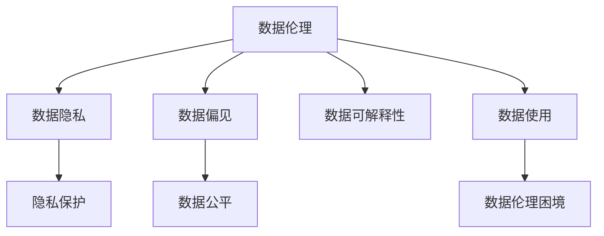

                 

# 数据伦理的挑战：如何应对数据伦理困境？

> 关键词：数据伦理, 隐私保护, 数据使用, 人工智能, 公平性, 可解释性

## 1. 背景介绍

### 1.1 问题由来
在人工智能快速发展的今天，数据驱动的机器学习模型已经深入到各行各业。从自动驾驶到金融风控，从医疗诊断到教育评估，数据在增强模型的能力、优化决策方案中发挥了关键作用。然而，伴随着数据的广泛应用，一系列数据伦理问题也逐渐凸显出来，引起了全社会的高度关注。

数据伦理（Data Ethics）涉及数据收集、处理、存储、分享等各个环节中的道德规范和法律约束，旨在保护数据主体的权益，避免数据滥用和偏见，促进数据公平使用。近年来，相继发生了多起涉及隐私泄露、数据偏见、算法不公等重大数据伦理事件，例如Cambridge Analytica数据泄露案、Tesla自动驾驶事故中的数据滥用，以及面部识别技术的应用争议。这些问题不仅引发了公众对数据使用的质疑和担忧，也对AI技术的信任和接受度产生了影响。

面对日益复杂的数据伦理困境，如何在技术层面和治理层面，找到有效的应对策略，成为当前AI社区和相关领域的研究热点。本文将从数据伦理的概念出发，阐述数据伦理困境的主要类型，并提出一系列应对措施，以期为未来的数据治理和技术实践提供参考。

## 2. 核心概念与联系

### 2.1 核心概念概述

数据伦理（Data Ethics）是指在数据处理和应用过程中遵循的道德规范和法律约束，其核心在于保护数据主体的权益，确保数据使用的透明、公正、安全。数据伦理不仅关注数据本身的质量和完整性，更强调在数据获取、存储、使用等各个环节中，如何平衡不同利益相关者的利益，避免偏见和歧视，保护个人隐私，促进数据公平使用。

数据隐私（Data Privacy）是指保护个人数据不被未经授权的第三方获取、使用或分享，保障数据主体的知情权和控制权。隐私保护是数据伦理的基础，通过法律法规和技术手段，确保数据在采集、存储和处理等各个环节中的安全性。

数据偏见（Data Bias）是指在数据收集、处理和分析过程中，由于数据本身存在的不均衡、不充分或者歧视性特征，导致模型训练出的结果存在不公平的偏见。数据偏见是数据伦理的重要挑战之一，它不仅影响模型预测的准确性，更可能导致社会不公，加剧社会分裂。

数据公平（Data Fairness）是指在数据应用过程中，确保不同群体（如性别、种族、年龄等）在获得数据使用和服务时享有平等的权益，避免数据使用带来的歧视性结果。数据公平是数据伦理的核心目标之一，需要通过数据治理和算法优化，促进社会公平正义。

数据可解释性（Data Interpretability）是指机器学习模型的决策过程透明、可解释、可理解，使得数据使用者能够理解模型是如何得出某个预测结果的。数据可解释性是数据伦理的重要保障，通过提高模型的透明性，增强公众对AI系统的信任和接受度。

### 2.2 核心概念原理和架构的 Mermaid 流程图



此流程图展示了数据伦理的核心概念和它们之间的联系。数据隐私、数据偏见、数据公平和数据可解释性都是数据伦理的重要组成部分，数据使用则是数据伦理面临的主要挑战。解决数据伦理困境需要综合考虑这些因素，并在技术层面和治理层面采取相应的措施。

## 3. 核心算法原理 & 具体操作步骤
### 3.1 算法原理概述

数据伦理困境的产生，源于数据处理和应用过程中，不同利益相关者（如数据主体、数据拥有者、算法开发者等）之间的利益冲突。解决数据伦理困境，需要从技术层面和治理层面同时入手，既要优化数据处理算法，也要完善数据治理机制，平衡各方利益，确保数据使用的公平和透明。

从技术层面来看，主要涉及以下几个关键步骤：

1. **数据隐私保护**：在数据收集、存储和处理过程中，采用技术手段确保数据匿名化、去标识化，避免数据泄露和滥用。
2. **数据偏见检测与修正**：在模型训练前，进行数据预处理，检测数据中存在的偏见，并采取相应的修正措施，减少模型的偏见影响。
3. **数据公平性评估**：在模型训练后，评估模型在不同群体上的表现，确保模型的公平性，避免歧视性结果。
4. **数据可解释性增强**：在模型应用过程中，增强模型的可解释性，使得数据使用者能够理解模型的决策过程，增强信任和接受度。

从治理层面来看，主要涉及以下几个关键步骤：

1. **数据治理框架建立**：制定数据治理框架和标准，明确数据收集、存储、处理、共享等各个环节的规范和要求。
2. **法律法规完善**：通过法律法规，规范数据的使用和管理，保护数据主体的权益，避免数据滥用。
3. **利益相关者沟通**：在数据使用过程中，加强与数据主体的沟通，尊重其知情权和控制权，确保数据使用的透明度和公正性。
4. **公平算法设计和评估**：设计和使用公平算法，评估模型的公平性，确保模型在不同群体上的表现一致。

### 3.2 算法步骤详解

**Step 1: 数据隐私保护**

- **数据匿名化**：在数据收集阶段，采用假名化、泛化、分割等技术手段，使得数据无法直接识别出数据主体的具体身份，从而保护数据隐私。例如，使用K-匿名算法、差分隐私算法等技术，确保数据在共享和使用过程中不会导致个人隐私泄露。
- **数据去标识化**：在数据存储和处理阶段，采用数据去标识化技术，将数据中的标识信息去除，使得数据无法直接关联到具体的数据主体。例如，使用同态加密、多方安全计算等技术，在保护数据隐私的前提下，确保数据的安全共享和使用。

**Step 2: 数据偏见检测与修正**

- **数据预处理**：在模型训练前，对数据进行预处理，检测数据中存在的偏见，并采取相应的修正措施。例如，通过数据增强、重采样等技术，平衡数据集中的类别分布，减少模型偏见。
- **偏见检测算法**：使用偏见检测算法，分析数据集中存在的偏见，确定偏见的具体来源和影响。例如，使用统计方法检测数据集中各特征的统计特征差异，识别出潜在的偏见因素。
- **偏见修正算法**：根据偏见检测结果，设计和使用偏见修正算法，调整数据集的分布，减少模型的偏见影响。例如，使用反采样、加权等技术，调整数据集中各特征的权重，减少模型对偏见特征的依赖。

**Step 3: 数据公平性评估**

- **公平性指标**：定义公平性指标，评估模型在不同群体上的表现，确保模型的公平性。例如，使用差异准确率、差异召回率、差异F1分数等指标，评估模型在不同群体上的性能差异。
- **公平性算法**：设计和使用公平算法，增强模型的公平性。例如，使用公平误差率（FPR）、公平性损失函数等技术，优化模型训练过程，减少模型的偏见影响。
- **公平性测试**：在模型应用过程中，对模型进行公平性测试，确保模型在不同群体上的表现一致。例如，使用公平性测试集和评估方法，检查模型在不同群体上的预测结果是否存在显著差异。

**Step 4: 数据可解释性增强**

- **可解释性技术**：采用可解释性技术，增强模型的透明性，使得数据使用者能够理解模型的决策过程。例如，使用LIME、SHAP等可解释性工具，分析模型对输入特征的贡献，解释模型的预测结果。
- **可视化工具**：使用可视化工具，将模型的决策过程和结果呈现给数据使用者，增强信任和接受度。例如，使用热力图、决策树、特征重要性图等可视化工具，展示模型的决策路径和结果。

### 3.3 算法优缺点

数据隐私保护、数据偏见检测与修正、数据公平性评估和数据可解释性增强等技术措施，各有其优缺点：

**优点**：

1. **隐私保护**：数据匿名化和去标识化技术，可以显著降低数据泄露和滥用的风险，保障数据主体的权益。
2. **偏见检测**：数据偏见检测算法，可以早期发现和修正数据中的偏见，提高模型的公平性和准确性。
3. **公平评估**：公平性指标和算法，可以帮助评估和优化模型的公平性，减少歧视性结果。
4. **可解释性增强**：可解释性技术和可视化工具，可以提高模型的透明性和可解释性，增强公众对AI系统的信任。

**缺点**：

1. **隐私保护**：数据匿名化和去标识化技术，虽然可以保护数据隐私，但可能会降低数据的质量和可用性。
2. **偏见检测**：数据偏见检测算法，虽然可以发现和修正数据中的偏见，但可能存在误检测和误修正的风险。
3. **公平评估**：公平性指标和算法，虽然可以评估模型的公平性，但可能存在公平性指标设计不当和公平性算法局限性的问题。
4. **可解释性增强**：可解释性技术和可视化工具，虽然可以增强模型的透明性，但可能会增加计算复杂度和资源消耗。

### 3.4 算法应用领域

数据伦理困境不仅存在于传统的金融、医疗等数据敏感领域，也在新兴的人工智能应用中愈发凸显。以下列举几个主要的应用领域及其面临的数据伦理挑战：

**医疗领域**：医疗数据涉及个人隐私和敏感信息，如何保护患者隐私，确保数据安全，是一个重要问题。此外，医疗数据存在显著的偏见和歧视性，如何在模型训练中使用公平的数据，减少对特定群体的歧视，也是一个关键问题。

**金融领域**：金融数据涉及个人信用、交易记录等敏感信息，如何保护数据隐私，避免数据滥用，是一个重要问题。此外，金融数据存在显著的偏见和歧视性，如何在模型训练中使用公平的数据，减少对特定群体的歧视，也是一个关键问题。

**就业领域**：就业数据涉及个人求职信息、工资收入等敏感信息，如何保护求职者隐私，避免数据滥用，是一个重要问题。此外，就业数据存在显著的偏见和歧视性，如何在模型训练中使用公平的数据，减少对特定群体的歧视，也是一个关键问题。

**广告领域**：广告数据涉及用户行为、兴趣等敏感信息，如何保护用户隐私，避免数据滥用，是一个重要问题。此外，广告数据存在显著的偏见和歧视性，如何在模型训练中使用公平的数据，减少对特定群体的歧视，也是一个关键问题。

## 4. 数学模型和公式 & 详细讲解  
### 4.1 数学模型构建

在数据伦理困境的应对过程中，数学模型和公式的构建是关键。以下以公平性评估为例，介绍相关数学模型和公式。

假设我们有一个二分类问题，其中正负样本分别为$X_+$和$X_-$，模型输出的预测概率为$P(Y=1|X)$。公平性指标可以定义为模型在不同群体上的表现差异，例如差异准确率、差异召回率等。

**差异准确率**：

$$
\Delta Acc = \frac{Acc_{+} - Acc_{-}}{Acc_{+} + Acc_{-}}
$$

其中$Acc_{+}$和$Acc_{-}$分别表示模型在正负样本上的准确率。

**差异召回率**：

$$
\Delta Recall = \frac{Recall_{+} - Recall_{-}}{Recall_{+} + Recall_{-}}
$$

其中$Recall_{+}$和$Recall_{-}$分别表示模型在正负样本上的召回率。

### 4.2 公式推导过程

**差异准确率**：

- **定义**：差异准确率表示模型在正负样本上的准确率差异。
- **推导**：将正负样本的准确率分别代入差异准确率的公式中，可以得到差异准确率的计算公式。

**差异召回率**：

- **定义**：差异召回率表示模型在正负样本上的召回率差异。
- **推导**：将正负样本的召回率分别代入差异召回率的公式中，可以得到差异召回率的计算公式。

### 4.3 案例分析与讲解

以就业歧视为例，我们考虑一个简单的招聘模型，其中输入特征包括年龄、性别、教育程度等，输出为是否录用。为了评估模型的公平性，我们需要计算模型在年龄和性别两个群体上的表现差异。

- **年龄群体的公平性**：
  - 正样本：年龄小于35岁
  - 负样本：年龄大于等于35岁
  - 差异准确率：$\Delta Acc_{age} = \frac{Acc_{age+} - Acc_{age-}}{Acc_{age+} + Acc_{age-}}$
  - 差异召回率：$\Delta Recall_{age} = \frac{Recall_{age+} - Recall_{age-}}{Recall_{age+} + Recall_{age-}}$

- **性别群体的公平性**：
  - 正样本：女性
  - 负样本：男性
  - 差异准确率：$\Delta Acc_{gender} = \frac{Acc_{gender+} - Acc_{gender-}}{Acc_{gender+} + Acc_{gender-}}$
  - 差异召回率：$\Delta Recall_{gender} = \frac{Recall_{gender+} - Recall_{gender-}}{Recall_{gender+} + Recall_{gender-}}$

通过计算差异准确率和差异召回率，可以评估模型在年龄和性别两个群体上的表现差异，识别出潜在的偏见和歧视问题，并采取相应的修正措施。

## 5. 项目实践：代码实例和详细解释说明
### 5.1 开发环境搭建

在进行数据伦理相关项目实践时，我们需要准备好开发环境。以下是使用Python进行Scikit-learn开发的环境配置流程：

1. 安装Anaconda：从官网下载并安装Anaconda，用于创建独立的Python环境。

2. 创建并激活虚拟环境：
```bash
conda create -n data-ethics python=3.8 
conda activate data-ethics
```

3. 安装Scikit-learn：
```bash
conda install scikit-learn
```

4. 安装numpy、pandas等工具包：
```bash
pip install numpy pandas matplotlib seaborn jupyter notebook ipython
```

完成上述步骤后，即可在`data-ethics`环境中开始数据伦理相关的项目实践。

### 5.2 源代码详细实现

以下是使用Scikit-learn库进行公平性评估的Python代码实现。

首先，定义公平性评估函数：

```python
from sklearn.metrics import accuracy_score, recall_score, confusion_matrix

def fairness_analysis(y_true, y_pred, threshold=0.5):
    y_pred = (y_pred >= threshold).astype(int)
    y_true = y_true.astype(int)
    y_pred_positive = y_pred[y_true == 1]
    y_pred_negative = y_pred[y_true == 0]
    accuracy_positive = accuracy_score(y_true[y_true == 1], y_pred_positive)
    accuracy_negative = accuracy_score(y_true[y_true == 0], y_pred_negative)
    recall_positive = recall_score(y_true[y_true == 1], y_pred_positive)
    recall_negative = recall_score(y_true[y_true == 0], y_pred_negative)
    accuracy = (accuracy_positive + accuracy_negative) / 2
    recall = (recall_positive + recall_negative) / 2
    return accuracy, recall
```

然后，定义数据集和模型：

```python
from sklearn.datasets import make_classification
from sklearn.linear_model import LogisticRegression

# 生成数据集
X, y = make_classification(n_samples=1000, n_features=3, random_state=42)

# 训练模型
model = LogisticRegression(solver='liblinear', C=1.0)
model.fit(X, y)

# 预测结果
y_pred = model.predict(X)
```

接着，使用公平性评估函数评估模型在不同群体上的表现：

```python
# 计算差异准确率和差异召回率
accuracy, recall = fairness_analysis(y, y_pred)
print(f"差异准确率：{accuracy:.2f}")
print(f"差异召回率：{recall:.2f}")
```

最后，绘制公平性指标的可视化图表：

```python
from sklearn.metrics import plot_roc_curve, plot_precision_recall_curve
import matplotlib.pyplot as plt

# 绘制ROC曲线
plot_roc_curve(model, X, y)
plt.show()

# 绘制PR曲线
plot_precision_recall_curve(model, X, y)
plt.show()
```

以上就是使用Scikit-learn进行公平性评估的完整代码实现。可以看到，Scikit-learn提供了丰富的公平性评估工具和函数，可以轻松地进行模型公平性的分析和评估。

### 5.3 代码解读与分析

让我们再详细解读一下关键代码的实现细节：

**fairness_analysis函数**：
- 接收真实标签`y_true`和预测标签`y_pred`，计算差异准确率和差异召回率。
- 将预测结果转换为二值标签`y_pred`，分别计算正负样本的准确率和召回率。
- 计算差异准确率和差异召回率，返回结果。

**模型训练与评估**：
- 使用Scikit-learn生成的随机数据集进行模型训练。
- 使用`LogisticRegression`模型进行训练，选择`liblinear`算法和`C=1.0`的正则化参数。
- 使用训练好的模型进行预测，并计算差异准确率和差异召回率。

**可视化工具**：
- 使用Scikit-learn的`plot_roc_curve`和`plot_precision_recall_curve`函数，绘制ROC曲线和PR曲线，展示模型在不同群体上的表现。
- 调用`plt.show()`函数，显示图表。

通过这些步骤，可以全面评估模型的公平性，并采用相应的优化措施，确保模型在不同群体上的表现一致，减少偏见和歧视。

## 6. 实际应用场景

### 6.1 智能医疗诊断

智能医疗诊断是数据伦理的重要应用场景之一。在智能医疗系统中，数据涉及患者的健康信息、治疗方案等敏感信息，如何保护患者隐私，确保数据安全，是一个重要问题。此外，医疗数据存在显著的偏见和歧视性，如何在模型训练中使用公平的数据，减少对特定群体的歧视，也是一个关键问题。

例如，在智能辅助诊断系统中，模型通过分析患者的病历和影像数据，辅助医生进行诊断。为了确保患者隐私，需要在数据收集和存储过程中进行匿名化和去标识化处理，确保数据的安全性和隐私性。同时，需要评估模型在不同群体上的表现，确保模型的公平性，减少对特定群体的歧视。

### 6.2 金融风险评估

金融风险评估是数据伦理的另一个重要应用场景。在金融系统中，数据涉及客户的信用信息、交易记录等敏感信息，如何保护客户隐私，避免数据滥用，是一个重要问题。此外，金融数据存在显著的偏见和歧视性，如何在模型训练中使用公平的数据，减少对特定群体的歧视，也是一个关键问题。

例如，在信用评分系统中，模型通过分析客户的财务记录、信用历史等信息，预测客户的信用风险。为了确保客户隐私，需要在数据收集和存储过程中进行匿名化和去标识化处理，确保数据的安全性和隐私性。同时，需要评估模型在不同群体上的表现，确保模型的公平性，减少对特定群体的歧视。

### 6.3 人力资源招聘

人力资源招聘是数据伦理在企业应用中的重要场景。在招聘系统中，数据涉及求职者的个人信息、求职历史等敏感信息，如何保护求职者隐私，避免数据滥用，是一个重要问题。此外，招聘数据存在显著的偏见和歧视性，如何在模型训练中使用公平的数据，减少对特定群体的歧视，也是一个关键问题。

例如，在智能招聘系统中，模型通过分析求职者的简历、面试记录等信息，筛选候选人。为了确保求职者隐私，需要在数据收集和存储过程中进行匿名化和去标识化处理，确保数据的安全性和隐私性。同时，需要评估模型在不同群体上的表现，确保模型的公平性，减少对特定群体的歧视。

## 7. 工具和资源推荐

### 7.1 学习资源推荐

为了帮助开发者系统掌握数据伦理的相关知识，这里推荐一些优质的学习资源：

1. 《数据伦理：原则、挑战与实践》（Data Ethics: Principles, Challenges and Practices）：这本书详细介绍了数据伦理的基本概念、原则和应用实践，是数据伦理研究的重要参考书。
2. 《机器学习中的公平性、透明性与可解释性》（Fairness, Transparency, and Interpretability in Machine Learning）：这本书深入探讨了机器学习中的公平性、透明性和可解释性问题，提供了丰富的案例和实践经验。
3. Coursera的《数据伦理与隐私保护》（Data Ethics and Privacy）课程：该课程由斯坦福大学主讲，涵盖数据伦理和隐私保护的基本概念和实践方法，适合初学者入门。
4. edX的《数据伦理：理论与实践》（Data Ethics: Theory and Practice）课程：该课程由哥伦比亚大学主讲，详细介绍了数据伦理的理论基础和应用实践，适合深入学习和研究。
5. IEEE Xplore的《数据伦理研究》（Data Ethics Research）期刊：该期刊收录了大量关于数据伦理的最新研究成果和应用案例，是数据伦理领域的重要信息源。

通过这些资源的学习，可以帮助开发者系统掌握数据伦理的基本知识和应用实践，提升数据伦理的治理能力和技术水平。

### 7.2 开发工具推荐

高效的数据伦理项目开发离不开优秀的工具支持。以下是几款用于数据伦理开发常用的工具：

1. Scikit-learn：基于Python的机器学习库，提供了丰富的公平性评估工具和函数，是数据伦理研究的重要工具。
2. TensorFlow：由Google主导开发的深度学习框架，生产部署方便，适合大规模工程应用。
3. PyTorch：基于Python的深度学习框架，灵活动态，适合快速迭代研究。
4. HuggingFace的Transformers库：提供了多种预训练语言模型，支持微调和大模型训练，是数据伦理应用的重要工具。
5. Fairlearn：基于Scikit-learn的公平性库，提供了公平性评估和优化工具，支持模型公平性的自动搜索和优化。

这些工具可以帮助开发者在数据伦理项目中高效地进行模型训练、公平性评估和优化，提高数据伦理应用的效率和效果。

### 7.3 相关论文推荐

数据伦理相关研究不断涌现，以下是几篇代表性的论文，推荐阅读：

1. A. D'Amour, A. Agarwal, R. Härtl, et al. ("Algorithms for Predictive Policing"——A Data Science Investigation into Biased Policing)：该论文研究了预测性警务系统中的偏见问题，提出了一系列偏见检测和修正算法，为数据伦理研究提供了重要的参考。
2. F. Doshi-Velez, B. Kim, et al. ("Fairness-aware Data Mining"——A Survey")：该论文综述了公平性数据挖掘的研究进展，提出了一系列公平性评估和优化方法，为数据伦理应用提供了理论基础。
3. A. Mooney ("Data privacy: A broad survey")：该论文综述了数据隐私保护的技术方法和应用场景，为数据伦理研究提供了全面的视角。
4. C. Dwork, F. McSherry, et al. ("Fairness in machine learning: what is right, what is good and what is feasible")：该论文探讨了机器学习中的公平性问题，提出了一系列公平性评估和优化方法，为数据伦理应用提供了理论指导。
5. L. Kleinberg, K. Price, et al. ("The fairness of machine learning")：该论文研究了机器学习中的公平性问题，提出了一系列公平性评估和优化方法，为数据伦理应用提供了理论基础和实践经验。

通过这些论文的学习，可以帮助开发者深入理解数据伦理的研究进展和应用实践，提高数据伦理的治理能力和技术水平。

## 8. 总结：未来发展趋势与挑战

### 8.1 总结

本文对数据伦理的挑战和应对策略进行了全面系统的介绍。首先阐述了数据伦理的概念和重要性，明确了数据伦理困境的主要类型，并提出了一系列应对措施。通过从技术层面和治理层面的综合考虑，探讨了数据伦理困境的解决方案。

通过本文的系统梳理，可以看到，数据伦理困境的产生和应对需要综合考虑数据隐私、数据偏见、数据公平性和数据可解释性等多个方面。只有通过技术手段和治理措施的协同发力，才能有效地保护数据主体的权益，避免数据滥用和偏见，确保数据使用的公平和透明。

### 8.2 未来发展趋势

展望未来，数据伦理将继续成为AI技术发展的重要关注点，其发展趋势包括以下几个方面：

1. **数据隐私保护**：随着大数据和人工智能技术的广泛应用，数据隐私保护的需求将更加迫切。未来的数据伦理研究将更加注重隐私保护技术的发展，采用更加先进的加密、去标识化等技术手段，确保数据的安全性和隐私性。
2. **数据偏见检测与修正**：数据偏见是数据伦理的重要挑战之一，未来的研究将更加注重数据偏见检测和修正技术的发展，采用更加科学和全面的方法，减少模型的偏见影响。
3. **数据公平性评估**：数据公平性是数据伦理的核心目标之一，未来的研究将更加注重数据公平性评估技术的发展，采用更加细致和全面的指标，确保模型在不同群体上的公平性。
4. **数据可解释性增强**：数据可解释性是数据伦理的重要保障之一，未来的研究将更加注重数据可解释性技术的发展，采用更加透明和可理解的方法，增强公众对AI系统的信任和接受度。

### 8.3 面临的挑战

尽管数据伦理研究不断取得进展，但在实践中仍面临诸多挑战：

1. **技术手段的局限性**：现有的数据隐私保护、数据偏见检测与修正、数据公平性评估和数据可解释性技术存在一定的局限性，难以完全解决数据伦理问题。如何突破现有技术的瓶颈，提升数据伦理治理的能力，是未来研究的重要方向。
2. **法律法规的滞后性**：尽管许多国家和地区已经出台了数据伦理相关的法律法规，但这些法律法规的执行和监督仍然存在一定的滞后性。如何在法律框架下，确保数据伦理的应用和推广，需要进一步的完善和加强。
3. **利益相关者的利益冲突**：在数据伦理实践中，不同利益相关者（如数据主体、数据拥有者、算法开发者等）之间的利益冲突难以避免。如何在各方利益之间找到平衡，确保数据伦理的应用效果，需要进一步的协调和协商。
4. **数据伦理标准的多样性**：不同国家和地区对数据伦理的理解和应用标准存在一定的差异，如何在全球范围内制定统一的数据伦理标准，需要进一步的国际合作和协调。
5. **数据伦理的复杂性**：数据伦理问题涉及数据收集、处理、存储、共享等各个环节，如何系统地分析和解决这些问题，需要进一步的理论研究和实践探索。

### 8.4 研究展望

面对数据伦理的诸多挑战，未来的研究需要在以下几个方面寻求新的突破：

1. **跨学科研究**：数据伦理问题的解决需要跨学科的合作，结合伦理学、法学、社会学等多个学科的理论和方法，共同推进数据伦理的研究和实践。
2. **技术创新**：探索新的数据隐私保护、数据偏见检测与修正、数据公平性评估和数据可解释性技术，提升数据伦理治理的能力和效果。
3. **法律与政策**：完善数据伦理相关的法律法规和政策框架，确保数据伦理的应用和推广。
4. **公共参与**：增强公众对数据伦理问题的理解和参与，形成全社会共同推进数据伦理治理的氛围。
5. **国际合作**：在全球范围内制定统一的数据伦理标准，加强国际合作，共同应对数据伦理问题。

这些研究方向和探索，将为数据伦理困境的解决提供新的思路和方法，推动数据伦理研究的不断进步和应用实践的持续发展。总之，数据伦理的研究和实践将不断拓展人工智能技术的边界，为构建更加公平、透明、可信赖的AI系统提供坚实的基础。

## 9. 附录：常见问题与解答

**Q1：什么是数据伦理？**

A: 数据伦理是指在数据处理和应用过程中遵循的道德规范和法律约束，旨在保护数据主体的权益，确保数据使用的透明、公正、安全。

**Q2：如何保护数据隐私？**

A: 数据隐私保护主要通过数据匿名化和去标识化技术实现。数据匿名化通过假名化、泛化、分割等技术手段，使得数据无法直接识别出数据主体的具体身份。数据去标识化通过数据去标识化技术，将数据中的标识信息去除，使得数据无法直接关联到具体的数据主体。

**Q3：如何检测和修正数据偏见？**

A: 数据偏见检测主要通过统计方法和机器学习算法实现。数据偏见修正主要通过数据增强、重采样等技术手段，调整数据集的分布，减少模型的偏见影响。

**Q4：如何评估模型的公平性？**

A: 模型公平性评估主要通过定义公平性指标和公平性算法实现。公平性指标包括差异准确率、差异召回率等，公平性算法包括公平误差率、公平性损失函数等，用于优化模型训练过程，减少模型的偏见影响。

**Q5：如何增强模型的可解释性？**

A: 模型可解释性增强主要通过可解释性技术和可视化工具实现。可解释性技术包括LIME、SHAP等工具，可视化工具包括热力图、决策树、特征重要性图等，用于展示模型的决策路径和结果。

---

作者：禅与计算机程序设计艺术 / Zen and the Art of Computer Programming

