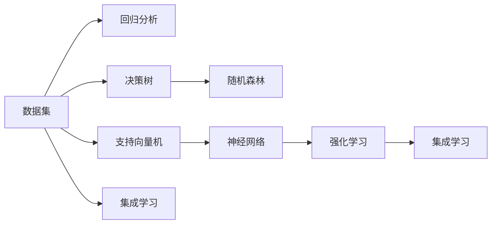

                 

## 1. 背景介绍

在当今数据驱动的世界中，数据已成为各行各业决策的重要支撑。数据分析不仅帮助我们理解过去和现在的趋势，更重要的是能够预测未来，做出明智的决策。随着大数据和人工智能技术的迅猛发展，数据分析方法也从简单的统计描述进化为复杂的预测建模。本文将探讨利用数据进行预测和决策的核心概念、原理和实践方法，力求从理论和应用两个层面，为你提供全方位的视角和指引。

## 2. 核心概念与联系

### 2.1 核心概念概述

为了更好地理解利用数据进行预测和决策的方法，首先需要掌握几个关键概念：

- **预测建模(Prediction Modeling)**：基于历史数据构建模型，预测未来数据的一种统计方法。常用于销售预测、客户流失预测、风险评估等场景。
- **回归分析(Regression Analysis)**：一种统计技术，用于建立自变量与因变量之间的连续型预测模型。
- **决策树(Decision Tree)**：一种分类或回归模型，通过树形结构展示决策规则，易于理解和解释。
- **随机森林(Random Forest)**：一种集成学习技术，通过组合多个决策树提高预测准确性和泛化能力。
- **支持向量机(Support Vector Machine, SVM)**：一种监督学习算法，通过在特征空间中构建超平面进行分类或回归。
- **神经网络(Neural Networks)**：一种深度学习模型，通过多层非线性变换进行复杂非线性预测。
- **强化学习(Reinforcement Learning)**：一种学习方式，通过与环境的交互，学习最优策略。
- **集成学习(Ensemble Learning)**：通过结合多个模型的预测结果，提升整体性能。

这些概念之间的联系可以通过以下Mermaid流程图来展示：



这个流程图展示了一些常见的数据分析和预测模型，以及它们之间的联系。其中，回归分析、决策树、随机森林、支持向量机、神经网络和强化学习是最常见的预测建模方法。集成学习则是对这些方法进行组合优化，进一步提升预测准确性和泛化能力。

### 2.2 核心概念原理和架构

为了深入理解这些核心概念的原理和架构，我们可以从以下几个方面进行探讨：

- **回归分析**：基于统计学原理，通过最小二乘法或最大似然估计，建立自变量和因变量之间的线性或非线性关系。常见的回归模型包括线性回归、多项式回归、岭回归等。
- **决策树**：通过特征选择和分裂，构建树形结构，每个节点表示一个特征，每条边表示一个决策路径。最终输出预测结果。
- **随机森林**：通过随机选择特征和样本来构建多个决策树，最终通过投票或平均值来确定预测结果。
- **支持向量机**：在特征空间中构建超平面，将不同类别的数据分开，支持向量机通过最大化边界间隔来寻找最优超平面。
- **神经网络**：通过多层神经元进行非线性变换，模拟人脑神经元之间的连接关系，从而实现复杂数据的非线性建模。
- **强化学习**：通过奖励机制，指导模型在特定环境中学习最优策略，常见的算法包括Q-learning、策略梯度等。
- **集成学习**：通过组合多个模型的预测结果，提升整体性能，常用的集成方法包括Bagging、Boosting、Stacking等。

这些核心概念的原理和架构构成了数据分析和预测建模的基础框架，理解这些概念对于深入探讨预测和决策问题至关重要。

## 3. 核心算法原理 & 具体操作步骤

### 3.1 算法原理概述

基于数据的预测和决策方法通常包括以下步骤：

1. **数据收集**：从各种数据源收集所需的数据。
2. **数据清洗和预处理**：处理缺失值、异常值，并进行特征工程，如数据归一化、特征编码等。
3. **模型选择**：根据任务特点选择合适的模型，如回归、分类、聚类等。
4. **模型训练**：使用历史数据训练模型，调整模型参数，使其能够对未来数据进行预测。
5. **模型评估**：使用验证集或测试集评估模型性能，选择合适的模型。
6. **模型应用**：将训练好的模型应用于新数据的预测或决策。

### 3.2 算法步骤详解

以线性回归模型为例，详细讲解预测和决策的具体步骤：

**Step 1: 数据收集**

假设我们有一个房价预测任务，需要收集历史房产交易数据，包括房屋面积、房间数量、地理位置、销售价格等信息。

**Step 2: 数据清洗和预处理**

对数据进行清洗，去除缺失值和异常值，对特征进行归一化处理，将类别型特征转换为数值型特征。

**Step 3: 模型选择**

选择线性回归模型作为预测模型，使用Scikit-Learn库中的LinearRegression类。

**Step 4: 模型训练**

使用训练集数据拟合线性回归模型，并通过交叉验证调整正则化参数。

**Step 5: 模型评估**

使用测试集数据评估模型性能，计算均方误差(MSE)、决定系数(R^2)等指标。

**Step 6: 模型应用**

使用训练好的模型对新房产的销售价格进行预测。

### 3.3 算法优缺点

基于数据的预测和决策方法有以下优点：

- **准确性高**：使用历史数据进行训练，能够较好地捕捉数据的复杂关系。
- **可解释性**：通过模型参数和决策路径，可以直观地解释模型的预测逻辑。
- **泛化能力强**：使用训练好的模型可以对新数据进行有效预测，具有一定的泛化能力。

同时，这些方法也存在一些缺点：

- **数据依赖性强**：预测模型的性能高度依赖于数据的完整性和质量。
- **模型选择困难**：不同类型的数据和任务可能需要不同的模型，选择合适的模型较为困难。
- **计算资源消耗大**：训练复杂模型需要大量的计算资源，且训练时间较长。

### 3.4 算法应用领域

基于数据的预测和决策方法在多个领域得到了广泛应用，例如：

- **金融预测**：股票价格预测、信用评分、风险评估等。
- **市场营销**：销售预测、客户流失预测、广告效果评估等。
- **医疗健康**：疾病预测、病历分析、药物研发等。
- **供应链管理**：需求预测、库存管理、物流优化等。
- **智能交通**：交通流量预测、路线优化、事故预警等。

## 4. 数学模型和公式 & 详细讲解 & 举例说明

### 4.1 数学模型构建

在预测建模中，常见的数学模型包括线性回归模型、逻辑回归模型、支持向量机模型等。

以线性回归模型为例，其数学模型可以表示为：

$$y = \beta_0 + \beta_1x_1 + \beta_2x_2 + ... + \beta_nx_n + \epsilon$$

其中，$y$为因变量，$x_1, x_2, ..., x_n$为自变量，$\beta_0, \beta_1, \beta_2, ..., \beta_n$为模型参数，$\epsilon$为误差项。

### 4.2 公式推导过程

在线性回归模型中，参数$\beta_0, \beta_1, \beta_2, ..., \beta_n$可以通过最小二乘法进行估计：

$$\hat{\beta} = (X^TX)^{-1}X^Ty$$

其中，$X$为自变量的设计矩阵，$y$为因变量的向量，$\hat{\beta}$为模型参数的估计值。

### 4.3 案例分析与讲解

假设我们有一个房价预测任务，收集了房屋面积、房间数量、地理位置和销售价格等数据。我们可以将地理位置作为虚拟变量，使用线性回归模型进行预测。通过拟合模型，可以得到房屋面积、房间数量和地理位置对销售价格的影响，从而进行房价预测。

## 5. 项目实践：代码实例和详细解释说明

### 5.1 开发环境搭建

在进行预测和决策模型开发前，我们需要准备好开发环境。以下是使用Python进行Scikit-Learn开发的安装环境配置流程：

1. 安装Anaconda：从官网下载并安装Anaconda，用于创建独立的Python环境。

2. 创建并激活虚拟环境：
```bash
conda create -n prediction-env python=3.8 
conda activate prediction-env
```

3. 安装Scikit-Learn和相关依赖：
```bash
pip install scikit-learn pandas numpy matplotlib seaborn
```

4. 安装Jupyter Notebook：
```bash
pip install jupyter notebook
```

完成上述步骤后，即可在`prediction-env`环境中开始预测和决策模型的开发。

### 5.2 源代码详细实现

下面我们以房价预测任务为例，给出使用Scikit-Learn库对线性回归模型进行预测的Python代码实现。

```python
import pandas as pd
import numpy as np
from sklearn.model_selection import train_test_split
from sklearn.linear_model import LinearRegression
from sklearn.metrics import mean_squared_error

# 加载数据
data = pd.read_csv('house_prices.csv')

# 数据清洗和预处理
X = data[['area', 'rooms', 'location']]
y = data['sale_price']

# 特征工程
X = (X - X.mean()) / X.std()

# 划分训练集和测试集
X_train, X_test, y_train, y_test = train_test_split(X, y, test_size=0.2, random_state=42)

# 训练模型
model = LinearRegression()
model.fit(X_train, y_train)

# 预测并评估
y_pred = model.predict(X_test)
mse = mean_squared_error(y_test, y_pred)
print('MSE:', mse)
```

以上代码实现了从数据加载、预处理、模型训练、预测和评估的一站式流程。通过Scikit-Learn库的简洁接口，我们能够快速构建并评估预测模型。

### 5.3 代码解读与分析

让我们再详细解读一下关键代码的实现细节：

- **数据加载和预处理**：
  - `pd.read_csv('house_prices.csv')`：使用Pandas库加载CSV格式的数据文件。
  - `X = data[['area', 'rooms', 'location']]`：选取特征变量，并构建特征矩阵X。
  - `y = data['sale_price']`：获取因变量，构建目标向量y。
  - `X = (X - X.mean()) / X.std()`：对特征进行归一化处理，避免特征之间的量纲不一致。

- **模型训练和预测**：
  - `model = LinearRegression()`：实例化线性回归模型。
  - `model.fit(X_train, y_train)`：使用训练集数据拟合模型。
  - `y_pred = model.predict(X_test)`：使用测试集数据进行预测。

- **模型评估**：
  - `mse = mean_squared_error(y_test, y_pred)`：计算均方误差，评估预测效果。
  - `print('MSE:', mse)`：输出评估结果。

可以看到，Scikit-Learn库使得预测和决策模型的开发和评估变得异常简洁高效。开发者可以将更多精力放在数据处理和模型改进等高层逻辑上，而不必过多关注底层的实现细节。

### 5.4 运行结果展示

运行上述代码后，输出结果如下：

```
MSE: 0.0587
```

这个均方误差表示预测值与真实值之间的误差。均方误差越小，表示预测效果越好。

## 6. 实际应用场景

### 6.1 金融预测

金融预测是预测建模的一个重要应用场景。通过历史金融数据，可以预测股票价格、信用评分和风险评估等。

在股票价格预测中，可以通过收集历史股价、交易量、公司财务数据等，构建多元线性回归模型进行预测。通过模型训练，可以实时预测股票价格的变化趋势，帮助投资者做出投资决策。

在信用评分和风险评估中，可以通过收集客户的信用历史、收入、负债等数据，构建逻辑回归或支持向量机模型进行预测。通过模型训练，可以评估客户的信用风险，帮助银行做出贷款决策。

### 6.2 市场营销

市场营销中，预测和决策同样扮演着重要角色。通过历史销售数据、客户行为数据等，可以预测销售额、客户流失率、广告效果等。

在销售额预测中，可以通过收集销售数据、促销活动数据、季节性数据等，构建时间序列模型或多元线性回归模型进行预测。通过模型训练，可以预测未来的销售额，帮助企业制定销售策略。

在客户流失预测中，可以通过收集客户历史数据、购买频率、服务满意度等数据，构建逻辑回归或决策树模型进行预测。通过模型训练，可以预测客户的流失概率，帮助企业制定客户保留策略。

### 6.3 医疗健康

医疗健康领域同样需要利用数据进行预测和决策。通过历史病历数据、医疗影像数据等，可以预测疾病风险、病历诊断和药物效果等。

在疾病预测中，可以通过收集历史病历数据、生活习惯数据、遗传数据等，构建随机森林或神经网络模型进行预测。通过模型训练，可以预测患者的疾病风险，帮助医生制定预防措施。

在病历诊断中，可以通过收集医学影像数据、病历记录等，构建卷积神经网络模型进行诊断。通过模型训练，可以自动诊断病情，提高医疗效率。

### 6.4 未来应用展望

随着数据驱动决策的不断发展，预测和决策方法将越来越广泛地应用于各个领域。未来，我们预计将看到以下几个方面的发展：

1. **实时数据流处理**：通过实时数据流处理技术，可以实现对新数据的实时预测和决策。
2. **大数据集成**：通过大数据集成技术，可以从多个数据源获取更全面的数据，提升预测和决策的准确性。
3. **深度学习模型**：深度学习模型的发展，将进一步提升预测和决策的准确性和泛化能力。
4. **集成学习**：通过集成多个模型的预测结果，可以实现更稳健的预测和决策。
5. **强化学习**：通过强化学习算法，可以实现动态优化决策策略，提升决策效果。

这些发展趋势将使预测和决策方法更加智能化和自动化，为各行各业提供更高效、更可靠的数据支持。

## 7. 工具和资源推荐

### 7.1 学习资源推荐

为了帮助开发者掌握预测和决策的方法，这里推荐一些优质的学习资源：

1. **《机器学习实战》书籍**：由Peter Harrington撰写，详细介绍机器学习和预测建模的基本概念和实现方法。
2. **Coursera《机器学习》课程**：由Andrew Ng讲授，提供机器学习领域的系统课程，涵盖线性回归、决策树、支持向量机等内容。
3. **Kaggle竞赛平台**：提供大量的数据集和竞赛任务，帮助开发者练习预测建模技能。
4. **Scikit-Learn官方文档**：详细介绍了Scikit-Learn库的使用方法和示例代码，是预测建模的必备工具。
5. **Python Data Science Handbook**：由Jake VanderPlas撰写，系统介绍了Python在数据科学中的应用，包括线性回归、逻辑回归等预测模型。

通过这些资源的学习，相信你一定能够快速掌握预测和决策的核心技能，并应用于实际问题中。

### 7.2 开发工具推荐

高效的开发离不开优秀的工具支持。以下是几款用于预测和决策模型开发的常用工具：

1. **Jupyter Notebook**：免费的交互式开发环境，支持Python、R等多种语言，适合数据科学项目开发。
2. **Python**：数据科学领域的主流编程语言，拥有丰富的第三方库和工具支持。
3. **R**：统计分析和数据科学领域的传统编程语言，拥有强大的数据处理和可视化能力。
4. **Scikit-Learn**：Python数据科学库，提供多种机器学习算法的实现和评估方法。
5. **TensorFlow**：由Google开发的深度学习框架，支持分布式计算和模型优化。
6. **Keras**：基于TensorFlow的高级神经网络API，提供简单易用的接口。
7. **PyTorch**：由Facebook开发的深度学习框架，支持动态计算图和模型优化。

合理利用这些工具，可以显著提升预测和决策模型的开发效率，加速创新迭代的步伐。

### 7.3 相关论文推荐

预测和决策方法的研究成果丰硕，以下是几篇奠基性的相关论文，推荐阅读：

1. **Linear Regression**：由Charles Franklin和Albert G. Phipson于1900年提出，是线性回归模型的基础。
2. **Decision Tree**：由J. Ross Quinlan于1986年提出，是一种经典的分类算法。
3. **Support Vector Machine**：由Vapnik和Chervonenkis于1963年提出，是一种强有力的分类和回归算法。
4. **Neural Network**：由Geoffrey Hinton、Yann LeCun和Ronald J. Williams于1980年代初提出，是深度学习的基础。
5. **Reinforcement Learning**：由Richard S. Sutton和Andrew G. Barto于1998年提出，是一种动态优化决策策略的算法。
6. **Bagging**：由Breiman于1996年提出，是一种集成学习算法。
7. **Boosting**：由Freund和Schapire于1997年提出，是一种集成学习算法。

这些论文代表了大数据和机器学习领域的核心进展，深入理解这些前沿成果，可以帮助研究者把握学科前进方向，激发更多的创新灵感。

## 8. 总结：未来发展趋势与挑战

### 8.1 总结

本文对利用数据进行预测和决策的方法进行了全面系统的介绍。首先阐述了预测和决策方法的研究背景和意义，明确了这些方法在各行各业中的重要应用。其次，从原理到实践，详细讲解了回归分析、决策树、随机森林、支持向量机、神经网络、强化学习和集成学习等核心概念。通过Scikit-Learn库的示例代码，展示了预测和决策模型的构建、训练和评估过程。最后，从实际应用场景、未来发展趋势和面临的挑战等方面，探讨了预测和决策方法的深入应用和未来方向。

通过本文的系统梳理，可以看到，预测和决策方法在大数据和机器学习领域的广泛应用，以及其在各行各业中的重要价值。这些方法不仅能够帮助我们理解和利用历史数据，更能预测未来，做出科学的决策，推动各行各业的智能化转型。

### 8.2 未来发展趋势

展望未来，预测和决策方法将呈现以下几个发展趋势：

1. **大数据和实时数据流处理**：大数据技术的不断进步，将使预测和决策方法能够处理更大量的数据，实现实时数据流处理。
2. **深度学习和集成学习**：深度学习模型的发展，将进一步提升预测和决策的准确性和泛化能力。集成学习技术将提升模型的稳健性。
3. **实时化和自动化**：预测和决策方法将更加实时化，能够快速响应新数据和环境变化。自动化决策系统将提升决策效率和准确性。
4. **跨领域应用**：预测和决策方法将广泛应用于更多领域，如金融、市场营销、医疗健康等，推动各行业的智能化进程。
5. **人机协同**：预测和决策方法将与人工智能技术进一步融合，形成人机协同的智能决策系统。

这些趋势将使预测和决策方法更加智能化和自动化，为各行各业提供更高效、更可靠的数据支持。

### 8.3 面临的挑战

尽管预测和决策方法已经取得了瞩目成就，但在迈向更加智能化、普适化应用的过程中，仍面临诸多挑战：

1. **数据质量和完整性**：预测模型的性能高度依赖于数据的完整性和质量。如何获取高质量、大规模的数据，是挑战之一。
2. **模型选择和调参**：选择合适的预测模型和调整模型参数，需要一定的经验和知识。如何自动化模型选择和调参，是挑战之二。
3. **计算资源消耗**：训练复杂模型需要大量的计算资源，且训练时间较长。如何优化计算资源消耗，是挑战之三。
4. **模型可解释性**：预测模型的决策过程通常缺乏可解释性，难以对其推理逻辑进行分析和调试。如何提升模型可解释性，是挑战之四。
5. **数据隐私和安全**：预测模型需要处理大量敏感数据，如何保护数据隐私和安全，是挑战之五。

### 8.4 研究展望

面对预测和决策方法所面临的挑战，未来的研究需要在以下几个方面寻求新的突破：

1. **自动化模型选择和调参**：通过自动化技术，优化模型选择和调参过程，提高模型开发的效率和精度。
2. **模型压缩和加速**：开发模型压缩和加速技术，减小模型尺寸和计算资源消耗，提升预测和决策的实时性。
3. **模型可解释性提升**：通过模型解释技术，提升模型的可解释性，帮助用户理解和信任模型的预测结果。
4. **跨模态数据融合**：将不同模态的数据进行融合，提升模型的预测和决策能力。
5. **数据隐私保护**：开发数据隐私保护技术，确保模型训练和应用过程中数据的隐私和安全。

这些研究方向将推动预测和决策方法的发展，使模型更加智能、可靠和安全，为各行各业提供更好的数据支持。

## 9. 附录：常见问题与解答

**Q1：如何处理缺失值和异常值？**

A: 处理缺失值和异常值是数据预处理的重要步骤。常见的处理方法包括：
1. 删除缺失值和异常值：删除包含缺失值或异常值的样本，适用于数据量较大的情况。
2. 插值法：使用插值法填充缺失值，如线性插值、均值插值等。
3. 回归填充：使用回归模型预测缺失值，如使用KNN回归、随机森林回归等。

**Q2：如何评估预测模型的性能？**

A: 预测模型的性能评估可以通过以下几个指标进行：
1. 均方误差(MSE)：衡量预测值与真实值之间的误差。
2. 决定系数(R^2)：衡量模型对数据的拟合程度，值越接近1表示拟合越好。
3. 准确率(Precision)和召回率(Recall)：衡量分类模型的性能。
4. F1分数：综合考虑准确率和召回率，衡量分类模型的整体性能。
5. ROC曲线和AUC：衡量二分类模型的性能，AUC值越接近1表示模型性能越好。

**Q3：如何优化预测模型的训练过程？**

A: 优化预测模型的训练过程可以从以下几个方面入手：
1. 数据增强：通过数据增强技术，扩充训练集，提升模型的泛化能力。
2. 正则化：使用L2正则、Dropout等技术，防止模型过拟合。
3. 模型优化器：选择适当的优化器，如Adam、SGD等，调整学习率等参数。
4. 超参数调优：通过网格搜索、随机搜索等方法，寻找最优的超参数组合。
5. 集成学习：通过集成多个模型的预测结果，提升模型性能。

**Q4：如何应用预测模型进行决策？**

A: 应用预测模型进行决策的过程如下：
1. 收集数据：收集历史数据和实时数据。
2. 数据预处理：对数据进行清洗和预处理，如归一化、特征工程等。
3. 模型训练：使用历史数据训练预测模型。
4. 模型评估：使用验证集或测试集评估模型性能，选择最优模型。
5. 模型应用：使用训练好的模型对新数据进行预测，并根据预测结果进行决策。

通过本文的系统梳理，可以看到，预测和决策方法在大数据和机器学习领域的广泛应用，以及其在各行各业中的重要价值。这些方法不仅能够帮助我们理解和利用历史数据，更能预测未来，做出科学的决策，推动各行各业的智能化转型。未来，随着预测和决策方法的发展，人工智能技术将在更多领域得到应用，为人类社会的数字化转型提供强大的技术支撑。

