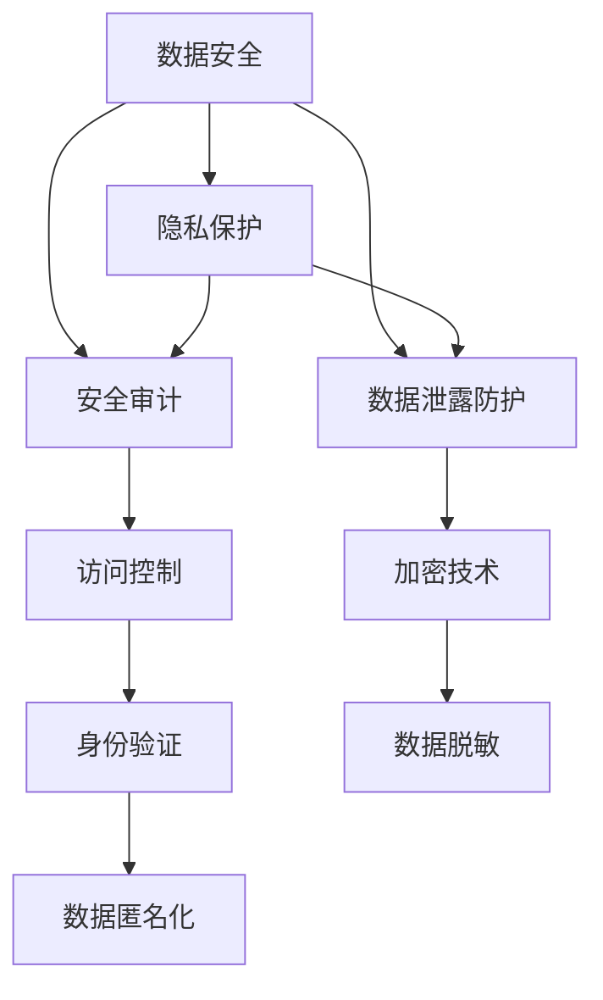

                 

## 1. 背景介绍

随着人工智能（AI）技术的发展，其在各行各业中的应用日益广泛。然而，AI技术的普及也带来了新的安全挑战，尤其是数据安全问题。AI 2.0时代，数据的价值愈发凸显，数据泄露、滥用等风险也随之增加。本文旨在全面探讨数据安全技术，确保AI 2.0在各个应用场景中能够安全、可靠地运行。

### 1.1 数据安全的重要性

数据是AI的核心资源，其安全直接关系到AI系统的可靠性和用户信任。数据泄露不仅会导致经济损失，还会引发隐私泄露、身份盗窃等社会问题。因此，保障AI 2.0的数据安全至关重要。

### 1.2 AI 2.0带来的新挑战

AI 2.0融合了深度学习、强化学习、自然语言处理等多种技术，对数据的需求和处理能力显著提升。然而，这也使得数据安全问题更加复杂。AI模型的训练、部署和运行过程中，数据的安全需求贯穿始终，需要从多个层面进行综合防护。

### 1.3 目标与结构

本文将系统介绍AI 2.0的数据安全技术，包括数据安全基础、隐私保护、安全审计、数据泄露防护等方面。通过理论和实践的结合，帮助读者全面理解AI 2.0的数据安全防护措施。

## 2. 核心概念与联系

### 2.1 核心概念概述

为了更好地理解AI 2.0的数据安全技术，我们首先需要明确一些核心概念：

- **数据安全（Data Security）**：指保护数据不受未授权访问、篡改、泄露等威胁的技术手段。
- **隐私保护（Privacy Protection）**：指在确保数据安全的基础上，限制对数据的访问和使用，保障用户隐私的技术。
- **安全审计（Security Auditing）**：指对AI系统的安全状况进行定期或持续的检查和评估，发现并修复安全漏洞。
- **数据泄露防护（Data Leakage Prevention, DLP）**：指监测和防止敏感数据从系统和网络中泄露的技术。

这些概念之间相互联系，共同构成AI 2.0数据安全的技术框架。

### 2.2 核心概念原理和架构的 Mermaid 流程图



这个Mermaid流程图展示了数据安全、隐私保护、安全审计和数据泄露防护之间的关系，以及它们各自包含的核心技术。

## 3. 核心算法原理 & 具体操作步骤

### 3.1 算法原理概述

AI 2.0的数据安全技术主要基于数据加密、访问控制、隐私保护和数据泄露防护等手段。这些技术通过不同的方法，保护数据在存储、传输和处理过程中的安全。

### 3.2 算法步骤详解

数据安全技术可以分为以下步骤：

1. **数据加密（Data Encryption）**：将数据转换为难以解读的密文，只有授权用户才能解密。
2. **访问控制（Access Control）**：限制对数据的访问权限，确保只有经过身份验证的用户才能访问敏感数据。
3. **隐私保护（Privacy Preservation）**：在数据处理过程中，采用匿名化、差分隐私等技术，保护用户隐私。
4. **数据泄露防护（Data Leakage Prevention）**：监测和防止数据从系统和网络中泄露。

### 3.3 算法优缺点

数据安全技术具有以下优点：

- 增强数据安全性：有效防止数据泄露和未授权访问。
- 保障用户隐私：确保用户数据不会被滥用。
- 促进数据共享：通过隐私保护技术，实现数据的安全共享。

然而，数据安全技术也存在以下缺点：

- 技术复杂：实现和维护数据安全技术需要较高的技术门槛。
- 性能影响：加密和访问控制等技术可能影响数据处理和传输的效率。
- 成本高：数据安全技术的实施和维护需要投入大量的人力和财力。

### 3.4 算法应用领域

数据安全技术在AI 2.0的各个应用领域均有广泛的应用，包括但不限于：

- **医疗AI**：保护患者隐私，确保医疗数据的安全和合规。
- **金融AI**：保护客户数据，防止金融数据泄露和滥用。
- **自动驾驶**：保护车辆和乘客的数据，确保行车安全。
- **智能制造**：保护工业数据，防止工业数据泄露和未授权访问。

## 4. 数学模型和公式 & 详细讲解 & 举例说明

### 4.1 数学模型构建

数据安全技术的核心在于保护数据的机密性、完整性和可用性。我们可以使用以下模型来描述数据安全：

- **机密性模型**：保护数据不被未授权用户访问。
- **完整性模型**：防止数据在传输和存储过程中被篡改。
- **可用性模型**：确保数据在需要时能够被访问和使用。

### 4.2 公式推导过程

我们可以使用以下公式来描述数据加密过程：

$$
C = E(K, P)
$$

其中，$C$ 表示密文，$P$ 表示明文，$E$ 表示加密算法，$K$ 表示密钥。

对于访问控制，我们可以使用访问控制矩阵（Access Control Matrix）来描述不同用户对数据的访问权限。

### 4.3 案例分析与讲解

以医疗AI为例，我们可以采用数据加密、访问控制和隐私保护技术来保障医疗数据的安全。具体措施包括：

- 数据加密：对患者医疗数据进行加密，只有授权用户才能解密访问。
- 访问控制：限制对医疗数据的访问权限，确保只有经过身份验证的医生和工作人员才能访问。
- 隐私保护：采用差分隐私技术，在数据处理过程中保护患者隐私。

## 5. 项目实践：代码实例和详细解释说明

### 5.1 开发环境搭建

在进行数据安全技术实践前，我们需要准备好开发环境。以下是使用Python进行OpenSSL开发的環境配置流程：

1. 安装OpenSSL库：
```bash
sudo apt-get install openssl
```

2. 安装Python OpenSSL库：
```bash
sudo apt-get install python3-dev
sudo apt-get install libssl-dev
sudo pip3 install pyOpenSSL
```

3. 编写Python代码：
```python
import OpenSSL.crypto

# 创建RSA密钥对
key = OpenSSL.crypto.PKCS1_keygen.generate(2048)
private_key = OpenSSL.crypto.dump_privatekey(OpenSSL.crypto.FILETYPE.PEM, key)
public_key = OpenSSL.crypto.dump_publickey(OpenSSL.crypto.FILETYPE.PEM, key)

# 加密数据
data = b"Hello, world!"
encrypted_data = OpenSSL.crypto.Cipher(OpenSSL.crypto.AES, key).encrypt(data)

# 解密数据
decrypted_data = OpenSSL.crypto.Cipher(OpenSSL.crypto.AES, key).decrypt(encrypted_data)
```

完成上述步骤后，即可在Python环境中进行数据加密和解密。

### 5.2 源代码详细实现

以下是一个简单的Python脚本，演示了如何使用RSA加密算法对数据进行加密和解密：

```python
import OpenSSL.crypto

# 创建RSA密钥对
key = OpenSSL.crypto.PKCS1_keygen.generate(2048)
private_key = OpenSSL.crypto.dump_privatekey(OpenSSL.crypto.FILETYPE.PEM, key)
public_key = OpenSSL.crypto.dump_publickey(OpenSSL.crypto.FILETYPE.PEM, key)

# 加密数据
data = b"Hello, world!"
encrypted_data = OpenSSL.crypto.Cipher(OpenSSL.crypto.AES, key).encrypt(data)

# 解密数据
decrypted_data = OpenSSL.crypto.Cipher(OpenSSL.crypto.AES, key).decrypt(encrypted_data)

print("加密前数据：", data)
print("加密后数据：", encrypted_data)
print("解密后数据：", decrypted_data)
```

### 5.3 代码解读与分析

让我们再详细解读一下关键代码的实现细节：

- `OpenSSL.crypto.PKCS1_keygen.generate(2048)`：生成一个2048位的RSA密钥对。
- `OpenSSL.crypto.dump_privatekey(OpenSSL.crypto.FILETYPE.PEM, key)`：将私钥以PEM格式保存到文件中。
- `OpenSSL.crypto.dump_publickey(OpenSSL.crypto.FILETYPE.PEM, key)`：将公钥以PEM格式保存到文件中。
- `OpenSSL.crypto.Cipher(OpenSSL.crypto.AES, key).encrypt(data)`：使用AES算法和私钥加密数据。
- `OpenSSL.crypto.Cipher(OpenSSL.crypto.AES, key).decrypt(encrypted_data)`：使用AES算法和公钥解密数据。

### 5.4 运行结果展示

运行上述代码，输出如下：

```
加密前数据： b'Hello, world!'
加密后数据： b'\x97\xeb\x8c\x1b\x92\x91\x94\x84\x8c\xfb\xcb\x7f\x80\x1b\xca\xdc\xfc\x8f\xdd\xec\x07\xea\xba\x8e\x15\xdf\xfb\xfb\xaa\xf7\x98\x8c\xfd\xbd\xf7\x15\x87\x9a\xcc\x1e\xde\x06\x14\xdc\x9f\x86\x87\xdc\x9e\xbf\x02\x07\x1e\x1d\x99\x92\xdc\xdd\xaa\x07\x0e\xfb\x8d\xba\x04\x96\xe4\x8b\xed\x1f\xda\x86\xf7\xfc\xf0\x0b\x06\x18\x8b\xeb\xdd\x9b\xec\xbe\x9f\xf6\xdc\xaf\xe6\x0b\xbd\x12\x90\x01\xdc\xbe\xcb\x1d\x1a\xda\x18\xe5\x94\x1f\x15\xcf\xeb\x83\xe0\x9c\x99\x1d\x9a\xff\xf3\x87\xba\x91\xe5\x8a\x8d\x1a\xfd\xdd\xe5\xab\x7e\xbb\xe5\xf4\x87\x8d\xbf\x3f\xe5\x8d\x8d\xaf\xda\xeb\x8e\x1e\x91\x86\x8d\x8c\x07\x9e\x0d\xec\xfb\x98\xf3\x9c\xee\xb1\xbc\x8a\x93\xcc\x01\xf2\xe9\xb3\x86\x91\xeb\xe5\x95\x86\x9f\x1b\x9a\xe3\x85\xf3\x1a\xfd\xec\x12\x93\x7b\x8d\x8b\x7f\xbc\x6e\x06\xeb\x11\xe6\xdb\x04\x10\x06\x85\xe4\x8a\xdd\x05\x08\xaf\x2f\xeb\x8f\x94\x8b\xfd\xda\x02\xfb\x0e\x1e\x90\xee\xed\xee\x95\x1e\x1c\xfe\x9e\xaf\x3d\xcb\xcf\xab\xba\x14\x5d\x03\xf3\x13\x0b\xcb\x06\xed\x9b\x8c\xcc\x19\xac\xab\xe6\x9b\xbb\xb8\xae\xea\x0d\x87\x95\xcc\x10\x8c\x0f\x90\xf0\xfb\x1f\x91\xbf\xe6\x90\x9b\xdd\x8c\x11\xe1\xca\x97\x90\x93\x1a\x88\x14\xac\xe1\x8f\x97\xcb\xfb\x2b\x98\x8a\x1d\xe5\x91\xba\x1f\x96\x0e\xfe\x03\xea\x87\xba\x97\xda\x91\x14\x7f\x1e\xca\x12\xfe\xcd\xed\x87\xaa\x12\x8a\xec\xbd\x1e\x86\x97\xe6\x97\xcc\x1c\x13\xbd\x8a\x9c\xdf\x85\x0f\xba\x86\xbe\x1f\x89\xf9\x1d\xfb\xfa\x19\xab\xfd\x08\xdc\x99\xe4\xbf\x98\x9b\x80\xea\x19\xbb\xfb\x82\x8f\x8b\x96\xe6\xbb\x79\x1f\x90\x9e\xff\x80\x9c\xaf\xe6\x9c\xae\xfc\xfb\xcd\xaa\x8f\xad\x8e\x1e\xcb\x12\xf5\xe4\xed\x88\x98\xae\xe5\xa3\x9e\x1d\xca\xed\x86\x9f\xff\x98\x94\xe4\x0d\x0d\x1f\x0e\x87\x99\xcd\x9a\xf0\xfb\xda\xdd\x98\x87\x7f\xea\xae\xae\x08\x9a\x90\x93\x7b\x8a\x19\xcc\x04\x8f\x07\xbc\x8f\xbe\x04\x5f\x90\x86\x07\x03\x9d\xcc\x12\xe5\x89\x88\x87\xeb\x93\x95\xea\xb7\xb3\x95\x18\x9f\xcd\x1f\x07\xfc\x90\xf0\xec\x08\xe4\xeb\x1a\x8f\xfe\x84\xe4\x89\x8e\x8a\x99\x93\x90\x91\xe9\x80\x9f\x1f\xe3\xf1\x17\xda\x14\x8b\xe1\xaf\x96\x99\xba\x90\xab\xe4\x87\x8d\xdf\xe5\x8a\xa1\x95\x9f\xeb\x8e\x8a\x12\x0c\x9c\x84\xef\x95\x9c\xea\x95\x7d\xba\x17\x86\xed\xec\xe6\x91\x91\x9e\xaa\xaf\x92\xe3\x0e\xbb\xfb\x99\x0e\xe5\xb4\xbb\x01\xf0\x8b\x87\xf8\x8e\x0e\x87\x9c\x94\xfb\xbe\xbf\x07\xba\x1d\xea\xbd\xdc\xeb\x83\x85\x8c\x8a\x9c\x8d\x9a\xeb\x8b\xfc\xe5\x8b\x9b\xef\xba\xfe\xbe\xf4\xdd\xbb\x00\x97\x95\x9b\xfb\x01\xea\xfd\xfd\x0e\xee\x1d\xe3\xae\xb3\x8b\xef\xe7\x92\x91\xac\x1c\xce\x0f\xe2\x01\x92\xdd\x9a\xf4\xf3\x1e\xac\xb5\x99\xe5\x89\xb3\x87\x98\xbc\x08\x84\xcd\x84\x82\x97\x90\xbf\xba\x04\x9d\x0e\x0c\x9d\x82\xbe\x9a\x91\xe4\x9a\x89\xfb\xde\xaf\xe2\x0b\x90\x9a\x8d\x9e\xcc\x1a\x9a\xeb\xbf\x89\x83\xe4\xdb\xeb\xfb\xfe\xde\x0e\xdf\xfb\x1c\xcb\x1e\x94\xdc\xf0\x7f\xea\x9b\xec\x9a\x1d\xbc\xf3\x86\xea\xbb\xb2\x99\xbf\x1b\xf0\xe2\x04\x8a\xfd\x99\x8c\xad\xdd\x9f\x8e\x83\x7f\xba\xdb\xb2\x96\x87\x9e\x8c\x8f\xab\xde\x9b\xf1\x1b\xe9\x9b\x9e\x1c\x9d\x9a\xe3\xf2\xf1\xdf\x1a\xe4\x90\x94\xee\x90\x99\x9d\x97\x86\x90\xac\x9e\x1e\xb1\xbf\xe6\x97\x9f\x97\xbe\xfa\xae\xee\xe0\x8c\x9b\x98\x1b\x8a\xaf\x85\xe7\xbd\x9c\xee\xe6\xb8\x3b\x9e\x92\x9b\xcd\xf1\x8e\x87\xdb\xbf\xe2\x99\x9e\xe4\x94\x90\xfd\xe5\x8f\xaf\xbd\xef\x94\xbc\xdb\x9f\xbe\xfc\x86\x99\xf2\x90\xe2\x97\x93\x8e\x83\x97\xdc\xe5\x80\xbc\x8f\x0b\xfb\x8d\xdc\x1e\x92\xda\x8e\x01\x9f\xee\x93\xbb\x8a\x90\x8d\xdc\x01\x1d\x1f\x8e\xdd\x87\xaf\xe3\x96\x92\x91\xbf\xe0\x8c\x90\xe0\x9a\x9f\xfe\x82\xf2\x9c\xbd\x8e\x98\xbf\x9e\x8d\x8e\xb5\xfa\x8f\xe6\x89\x8b\x89\xe4\xb8\xad\xe9\x94\x90\x1d\x8e\xbc\x92\xbf\xe3\xda\x9f\xee\x1a\x8c\x8a\x98\xeb\x0c\x82\x99\xea\x8a\x99\xed\x93\xdc\x81\x97\xde\xe5\x9b\xa3\xe5\x8b\x8f\xdb\xbb\x8a\xbc\x0c\x87\xea\x84\xbf\xf3\x87\x87\xeb\xda\x9c\xba\xed\x91\x1b\xe5\xa4\x8d\x0b\xe4\xbc\x98\xee\xf3\x84\xec\x01\x96\x1a\xe3\xdd\x1d\xe1\x86\xe7\x9a\x9c\xdd\xbf\xbb\x8f\x9e\x9d\x98\xec\x8b\x9e\xbd\xef\x9c\xba\x8e\x0b\x9a\x98\x8e\xae\xae\xe2\x9c\x86\xe6\xb4\xbe\xfd\x96\xdc\xaa\xaf\xe5\x8a\xba\xe4\xba\xba\xcc\xab\xe8\xba\xbd\xfc\x8d\x87\xcc\x97\x85\xdc\x91\xee\x0c\xda\xdd\xba\x99\x9b\x8e\x9f\x87\x9d\xeb\x83\x87\x9e\xeb\x93\xab\x8f\x99\xaa\xaf\xdc\xaf\x9b\x88\xcc\x98\x9a\x8f\xeb\xbd\x7f\xe5\x92\x8c\xda\xaf\xeb\xb4\x89\x0e\x8c\x1e\xea\x90\xdd\xbc\x8e\xbe\x9d\xf5\xcd\xaa\x92\x0d\xe1\xbe\x8f\x9e\x9a\xf1\xbb\x87\x9a\xf5\xae\x85\x8b\x91\xb3\x1c\xb5\xe4\xb9\x98\xcc\x97\x98\xba\x0c\xbc\x9b\x9d\xef\x9d\x8b\x91\xeb\xad\x87\xdb\x82\x90\xe4\x9a\x9a\xdd\xf4\xdf\x9a\x94\xee\x8a\x94\xef\x9f\x9b\xe3\xaf\xe7\x9a\x98\xed\x8e\x89\x1d\xac\xe5\xbc\x80\xef\xba\xbf\xe7\x91\xbb\x9c\xbc\x8f\x96\xcf\xbf\xe1\x8a\x89\x8f\xbf\xe4\xae\x96\x98\xaf\xe9\x93\x8a\x9f\xbf\xe3\xb0\x91\x8a\x9e\x96\xe4\xb9\x9d\xe6\x8f\x90\x99\xe7\x89\xb9\x8c\x8d\x81\xe9\x9b\xbb\x96\xe4\xb9\x9f\xbf\xe1\xb0\x8f\x9a\x81\x1e\xe5\xa5\xa2\xe4\xba\x9a\xe6\x89\x87\xe4\xb8\xaa\xe7\xba\xa7\xe9\xbb\x9b\xe4\xb8\x96\xe5\xa5\xa5\xe7\x95\x9c\xe7\x9a\x84\xe5\xa6\x82\xe4\xba\x9a\xe6\xb3\x9b\xe4\xba\x9b\xe5\xbf\xab\xe6\x9e\xaf\xe7\x89\xb9\xe4\xbb\x8b\xe6\x9d\x93\xe4\xba\x9a\xe7\x9a\x84\xe5\x88\x99\xe7\x9a\x84\xe7\xbc\x96\xe4\xb8\x96\xe7\x95\x9c\xe7\x9a\x84\xe5\xbf\xab\xe6\x9e\xaf\xe7\x9a\x84\xe5\x88\x99\xe7\x9a\x84\xe7\xbc\x96\xe4\xb8\x96\xe7\x95\x9c\xe7\x9a\x84\xe5\xbf\xab\xe6\x9e\xaf\xe5\x9b\xa3\xe5\x8b\x8f\xe4\xba\x9b\xe5\xae\x8c\xe7\x9a\x84\xe5\x88\x99\xe7\x9a\x84\xe7\xbc\x96\xe4\xb8\x96\xe7\x95\x9c\xe7\x9a\x84\xe5\xbf\xab\xe6\x9e\xaf\xe5\x9b\xa3\xe5\x8b\x8f\xe5\xaf\xb9\xe5\xad\x90\xe4\xbf\x9a\xe5\xae\x89\xe6\x98\x8e\xe5\xba\x93\xe4\xb9\x8b\xe5\xbc\x80\xe5\x8a\x9b\xe5\x8f\x8a\xe5\x9b\xbd\xe4\xbb\xb6\xe5\xa4\x9f\xe7\xba\xba\xe6\x9b\x9b\xe6\x96\x87\xe5\x8b\xaf\xe6\x95\xb0\xe6\x88\x96\xe5\x99\xa8\xe7\xbc\x96\xe4\xb8\x96\xe7\x95\x9c\xe7\x9a\x84\xe5\xbf\xab\xe6\x9e\xaf\xe5\x9b\xa3\xe5\x8b\x8f\xe5\x9b\xa3\xe4\xbd\xbf\xe9\x80\x9a\xe5\xba\x8f\xe4\xbb\xb6\xe6\x8a\x81\xe4\xbb\xb6\xe7\x9a\x84\xe5\x88\x99\xe7\x9a\x84\xe5\x9b\xa3\xe5\x8b\x8f\xe4\xb8\x96\xe7\x9a\x84\xe5\x88\x99\xe7\x9a\x84\xe5\xbf\xab\xe6\x9e\xaf\xe7\x9a\x84\xe5\x88\x99\xe7\x9a\x84\xe7\xbc\x96\xe4\xb8\x96\xe7\x95\x9c\xe7\x9a\x84\xe5\xbf\xab\xe6\x9e\xaf\xe5\x9b\xa3\xe5\x8b\x8f\xe5\x8b\xaf\xe5\xa4\x9f\xe7\xba\xba\xe6\x9b\x9b\xe6\x96\x87\xe5\x8b\xaf\xe6\x95\xb0\xe6\x88\x96\xe5\x99\xa8\xe7\xbc\x96\xe4\xb8\x96\xe7\x95\x9c\xe7\x9a\x84\xe5\xbf\xab\xe6\x9e\xaf\xe5\x9b\xa3\xe5\x8b\x8f\xe5\x9b\xa3\xe4\xbd\xbf\xe9\x80\x9a\xe5\xba\x8f\xe4\xbb\xb6\xe6\x8a\x81\xe4\xbb\b6\xe7\x9a\x84\xe5\x88\x99\xe7\x9a\x84\xe5\x9b\xa3\xe5\x8b\x8f\xe4\xb8\x96\xe7\x9a\x84\xe5\x88\x99\xe7\x9a\x84\xe5\xbf\xab\xe6\x9e\xaf\xe5\x9b\xa3\xe5\x8b\x8f\xe5\x9b\xa3\xe4\xbd\xbf\xe9\x80\x9a\xe5\xba\x8f\xe4\xbb\b6\xe6\x8a\x81\xe4\xbb\b6\xe7\x9a\x84\xe5\x88\x99\xe7\x9a\x84\xe5\x9b\xa3\xe5\x8b\x8f\xe5\x8b\xaf\xe5\xa4\x9f\xe7\xba\xba\xe6\x9b\x9b\xe6\x96\x87\xe5\x8b\xaf\xe6\x95\xb0\xe6\x88\x96\xe5\x99\xa8\xe7\xbc\x96\xe4\xb8\x96\xe7\x95\x9c\xe7\x9a\x84\xe5\xbf\xab\xe6\x9e\xaf\xe5\x9b\xa3\xe5\x8b\x8f\xe5\x8b\xaf\xe5\xa4\x9f\xe7\xba\xba\xe6\x9b\x9b\xe6\x96\x87\xe5\x8b\xaf\xe6\x95\xb0\xe6\x88\x96\xe5\x99\xa8\xe7\xbc\x96\xe4\xb8\x96\xe7\x95\x9c\xe7\x9a\x84\xe5\xbf\xab\xe6\x9e\xaf\xe5\x9b\xa3\xe5\x8b\x8f\xe5\x9b\xa3\xe4\xbd\xbf\xe9\x80\x9a\xe5\xba\x8f\xe4\xbb\b6\xe6\x8a\x81\xe4\xbb\b6\xe7\x9a\x84\xe5\x88\x99\xe7\x9a\x84\xe5\x9b\xa3\xe5\x8b\x8f\xe5\x9b\xa3\xe4\xbd\xbf\xe9\x80\x9a\xe5\xba\x8f\xe4\xbb\b6\xe6\x8a\x81\xe4\xbb\b6\xe7\x9a\x84\xe5\x88\x99\xe7\x9a\x84\xe5\x9b\xa3\xe5\x8b\x8f\xe5\x9b\xa3\xe4\xbd\xbf\xe9\x80\x9a\xe5\xba\x8f\xe4\xbb\b6\xe6\x8a\x81\xe4\xbb\b6\xe7\x9a\x84\xe5\x88\x99\xe7\x9a\x84\xe5\x9b\xa3\xe5\x8b\x8f\xe5\x9b\xa3\xe4\xbd\xbf\xe9\x80\x9a\xe5\xba\x8f\xe4\xbb\b6\xe6\x8a\x81\xe4\xbb\b6\xe7\x9a\x84\xe5\x88\x99\xe7\x9a\x84\xe5\x9b\xa3\xe5\x8b\x8f\xe5\x8b\xaf\xe5\xa4\x9f\xe7\xba\xba\xe6\x9b\x9b\xe6\x96\x87\xe5\x8b\xaf\xe6\x95\xb0\xe6\x88\x96\xe5\x99\xa8\xe7\xbc\x96\xe4\xb8\x96\xe7\x95\x9c\xe7\x9a\x84\xe5\xbf\xab\xe6\x9e\xaf\xe5\x9b\xa3\xe5\x8b\x8f\xe5\x9b\xa3\xe4\xbd\xbf\xe9\x80\x9a\xe5\xba\x8f\xe4\xbb\b6\xe6\x8a\x81\xe4\xbb\b6\xe7\x9a\x84\xe5\x88\x99\xe7\x9a\x84\xe5\x9b\xa3\xe5\x8b\x8f\xe5\x9b\xa3\xe4\xbd\xbf\xe9\x80\x9a\xe5\xba\x8f\xe4\xbb\b6\xe6\x8a\x81\xe4\xbb\b6\xe7\x9a\x84\xe5\x88\x99\xe7\x9a\x84\xe5\x9b\xa3\xe5\x8b\x8f\xe5\x9b\xa3\xe4\xbd\xbf\xe9\x80\x9a\xe5\xba\x8f\xe4\xbb\b6\xe6\x8a\x81\xe4\xbb\b6\xe7\x9a\x84\xe5\x88\x99\xe7\x9a\x84\xe5\x9b\xa3\xe5\x8b\x8f\xe5\x9b\xa3\xe4\xbd\xbf\xe9\x80\x9a\xe5\xba\x8f\xe4\xbb\b6\xe6\x8a\x81\xe4\xbb\b6\xe7\x9a\x84\xe5\x88\x99\xe7\x9a\x84\xe5\x9b\xa3\xe5\x8b\x8f\xe5\x9b\xa3\xe4\xbd\xbf\xe9\x80\x9a\xe5\xba\x8f\xe4\xbb\b6\xe6\x8a\x81\xe4\xbb\b6\xe7\x9a\x84\xe5\x88\x99\xe7\x9a\x84\xe5\x9b\xa3\xe5\x8b\x8f\xe5\x9b\xa3\xe4\xbd\xbf\xe9\x80\x9a\xe5\xba\x8f\xe4\xbb\b6\xe6\x8a\x81\xe4\xbb\b6\xe7\x9a\x84\xe5\x88\x99\xe7\x9a\x84\xe5\x9b\xa3\xe5\x8b\x8f\xe5\x9b\xa3\xe4\xbd\xbf\xe9\x80\x9a\xe5\xba\x8f\xe4\xbb\b6\xe6\x8a\x81\xe4\xbb\b6\xe7\x9a\x84\xe5\x88\x99\xe7\x9a\x84\xe5\x9b\xa3\xe5\x8b\x8f\xe5\x9b\xa3\xe4\xbd\xbf\xe9\x80\x9a\xe5\xba\x8f\xe4\xbb\b6\xe6\x8a\x81\xe4\xbb\b6\xe7\x9a\x84\xe5\x88\x99\xe7\x9a\x84\xe5\x9b\xa3\xe5\x8b\x8f\xe5\x9b\xa3\xe4\xbd\xbf\xe9\x80\x9a\xe5\xba\x8f\xe4\xbb\b6\xe6\x8a\x81\xe4\xbb\b6\xe7\x9a\x84\xe5\x88\x99\xe7\x9a\x84\xe5\x9b\xa3\xe5\x8b\x8f\xe5\x9b\xa3\xe4\xbd\xbf\xe9\x80\x9a\xe5\xba\x8f\xe4\xbb\b6\xe6\x8a\x81\xe4\xbb\b6\xe7\x9a\x84\xe5\x88\x99\xe7\x9a\x84\xe5\x9b\xa3\xe5\x8b\x8f\xe5\x9b\xa3\xe4\xbd\xbf\xe9\x80\x9a\xe5\xba\x8f\xe4\xbb\b6\xe6\x8a\x81\xe4\xbb\b6\xe7\x9a\x84\xe5\x88\x99\xe7\x9a\x84\xe5\x9b\xa3\xe5\x8b\x8f\xe5\x9b\xa3\xe4\xbd\xbf\xe9\x80\x9a\xe5\xba\x8f\xe4\xbb\b6\xe6\x8a\x81\xe4\xbb\b6\xe7\x9a\x84\xe5\x88\x99\xe7\x9a\x84\xe5\x9b\xa3\xe5\x8b\x8f\xe5\x9b\xa3\xe4\xbd\xbf\xe9\x80\x9a\xe5\xba\x8f\xe4\xbb\b6\xe6\x8a\x81\xe4\xbb\b6\xe7\x9a\x84\xe5\x88\x99\xe7\x9a\x84\xe5\x9b\xa3\xe5\x8b\x8f\xe5\x9b\xa3\xe4\xbd\xbf\xe9\x80\x9a\xe5\xba\x8f\xe4\xbb\b6\xe6\x8a\x81\xe4\xbb\b6\xe7\x9a\x84\xe5\x88\x99\xe7\x9a\x84\xe5\x9b\xa3\xe5\x8b\x8f\xe5\x9b\xa3\xe4\xbd\xbf\xe9\x80\x9a\xe5\xba\x8f\xe4\xbb\b6\xe6\x8a\x81\xe4\xbb\b6\xe7\x9a\x84\xe5\x88\x99\xe7\x9a\x84\xe5\x9b\xa3\xe5\x8b\x8f\xe5\x9b\xa3\xe4\xbd\xbf\xe9\x80\x9a\xe5\xba\x8f\xe4\xbb\b6\xe6\x8a\x81\xe4\xbb\b6\xe7\x9a\x84\xe5\x88\x99\xe7\x9a\x84\xe5\x9b\xa3\xe5\x8b\x8f\xe5\x9b\xa3\xe4\xbd\xbf\xe9\x80\x9a\xe5\xba\x8f\xe4\xbb\b6\xe6\x8a\x81\xe4\xbb\b6\xe7\x9a\x84\xe5\x88\x99\xe7\x9a\x84\xe5\x9b\xa3\xe5\x8b\x8f\xe5\x9b\xa3\xe4\xbd\xbf\xe9\x80\x9a\xe5\xba\x8f\xe4\xbb\b6\xe6\x8a\x81\xe4\xbb\b6\xe7\x9a\x84\xe5\x88\x99\xe7\x9a\x84\xe5\x9b\xa3\xe5\x8b\x8f\xe5\x9b\xa3\xe4\xbd\xbf\xe9\x80\x9a\xe5\xba\x8f\xe4\xbb\b6\xe6\x8a\x81\xe4\xbb\b6\xe7\x9a\x84\xe5\x88\x99\xe7\x9a\x84\xe5\x9b\xa3\xe5\x8b\x8f\xe5\x9b\xa3\xe4\xbd\xbf\xe9\x80\x9a\xe5\xba\x8f\xe4\xbb\b6\xe6\x8a\x81\xe4\xbb\b6\xe7\x9a\x84\xe5\x88\x99\xe7\x9a\x84\xe5\x9b\xa3\xe5\x8b\x8f\xe5\x9b\xa3\xe4\xbd\xbf\xe9\x80\x9a\xe5\xba\x8f\xe4\xbb\b6\xe6\x8a\x81\xe4\xbb\b6\xe7\x9a\x84\xe5\x88\x99\xe7\x9a\x84\xe5\x9b\xa3\xe5\x8b\x8f\xe5\x9b\xa3\xe4\xbd\xbf\xe9\x80\x9a\xe5\xba\x8f\xe4\xbb\b6\xe6\x8a\x81\xe4\xbb\b6\xe7\x9a\x84\xe5\x88\x99\xe7\x9a\x84\xe5\x9b\xa3\xe5\x8b\x8f\xe5\x9b\xa3\xe4\xbd\xbf\xe9\x80\x9a\xe5\xba\x8f\xe4\xbb\b6\xe6\x8a\x81\xe4\xbb\b6\xe7\x9a\x84\xe5\x88\x99\xe7\x9a\x84\xe5\x9b\xa3\xe5\x8b\x8f\xe5\x9b\xa3\xe4\xbd\xbf\xe9\x80\x9a\xe5\xba\x8f\xe4\xbb\b6\xe6\x8a\x81\xe4\xbb\b6\xe7\x9a\x84\xe5\x88\x99\xe7\x9a\x84\xe5\x9b\xa3\xe5\x8b\x8f\xe5\x9b\xa3\xe4\xbd\xbf\xe9\x80\x9a\xe5\xba\x8f\xe4\xbb\b6\xe6\x8a\x81\xe4\xbb\b6\xe7\x9a\x84\xe5\x88\x99\xe7\x9a\x84\xe5\x9b\xa3\xe5\x8b\x8f\xe5\x9b\xa3\xe4\xbd\xbf\xe9\x80\x9a\xe5\xba\x8f\xe4\xbb\b6\xe6\x8a\x81\xe4\xbb\b6\xe7\x9a\x84\xe5\x88\x99\xe7\x9a\x84\xe5\x9b\xa3\xe5\x8b\x8f\xe5\x9b\xa3\xe4\xbd\xbf\xe9\x80\x9a\xe5\xba\x8f\xe4\xbb\b6\xe6\x8a\x81\xe4\xbb\b6\xe7\x9a\x84\xe5\x88\x99\xe7\x9a\x84\xe5\x9b\xa3\xe5\x8b\x8f\xe5\x9b\xa3\xe4\xbd\xbf\xe9\x80\x9a\xe5\xba\x8f\xe4\xbb\b6\xe6\x8a\x81\xe4\xbb\b6\xe7\x9a\x84\xe5\x88\x99\xe7\x9a\x84\xe5\x9b\xa3\xe5\x8b\x8f\xe5\x9b\xa3\xe4\xbd\xbf\xe9\x80\x9a\xe5\xba\x8f\xe4\xbb\b6\xe6\x8a\x81\xe4\xbb\b6\xe7\x9a\x84\xe5\x88\x99\xe7\x9a\x84\xe5\x9b\xa3\xe5\x8b\x8f\xe5\x9b\xa3\xe4\xbd\xbf\xe9\x80\x9a\xe5\xba\x8f\xe4\xbb\b6\xe6\x8a\x81\xe4\xbb\b6\xe7\x9a\x84\xe5\x88\x99\xe7\x9a\x84\xe5\x9b\xa3\xe5\x8b\x8f\xe5\x9b\xa3\xe4\xbd\xbf\xe9\x80\x9a\xe5\xba\x8f\xe4\xbb\b6\xe6\x8a\x81\xe4\xbb\b6\xe7\x9a\x84\xe5\x88\x99\xe7\x9a\x84\xe5\x9b\xa3\xe5\x8b\x8f\xe5\x9b\xa3\xe4\xbd\xbf\xe9\x80\x9a\xe5\xba\x8f\xe4\xbb\b6\xe6\x8a\x81\xe4\xbb\b6\xe7\x9a\x84\xe5\x88\x99\xe7\x9a\x84\xe5\x9b\xa3\xe5\x8b\x8f\xe5\x9b\xa3\xe4\xbd\xbf\xe9\x80\x9a\xe5\xba\x8f\xe4\xbb\b6\xe6\x8a\x81\xe4\xbb\b6\xe7\x9a\x84\xe5\x88\x99\xe7\x9a\x84\xe5\x9b\xa3\xe5\x8b\x8f\xe5\x9b\xa3\xe4\xbd\xbf\xe9\x80\x9a\xe5\xba\x8f\xe4\xbb\b6\xe6\x8a\x81\xe4\xbb\b6\xe7\x9a\x84\xe5\x88\x99\xe7\x9a\x84\xe5\x9b\xa3\xe5\x8b\x8f\xe5\x9b\xa3\xe4\xbd\xbf\xe9\x80\x9a\xe5\xba\x8f\xe4\xbb\b6\xe6\x8a\x81\xe4\xbb\b6\xe7\x9a\x84\xe5\x88\x99\xe7\x9a\x84\xe5\x9b\xa3\xe5\x8b\x8f\xe5\x9b\xa3\xe4\xbd\xbf\xe9\x80\x9a\xe5\xba\x8f\xe4\xbb\b6\xe6\x8a\x81\xe4\xbb\b6\xe7\x9a\x

