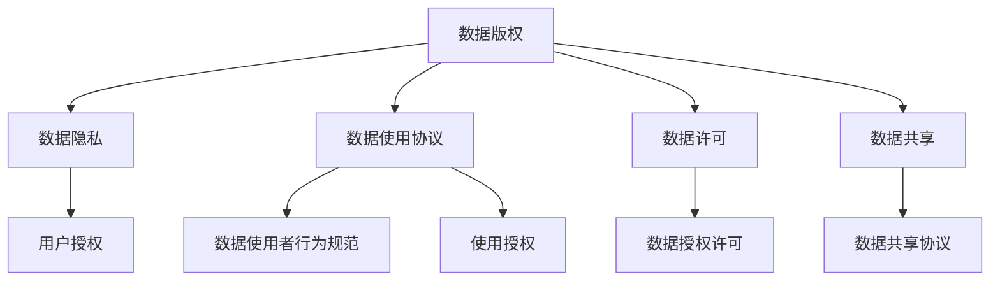

                 

## 1. 背景介绍

随着人工智能和互联网技术的发展，数字内容创作和版权管理已经成为了软件2.0时代的一个核心问题。尤其是在数据驱动的应用中，如自然语言处理、图像识别等，如何合法合规地使用数据资源，成为了制约创新发展的瓶颈。本文将从数据版权时代的基本概念、现状和困扰出发，探讨软件2.0在数据使用和版权保护方面面临的挑战，并提出一些应对策略，以期为相关领域的研究者和开发者提供参考。

### 1.1 数据版权的基本概念

数据版权是指对数字内容资源的使用、复制、传播、修改等行为进行法律限制的权利。在软件2.0时代，随着大数据、人工智能等技术的发展，数据版权问题显得尤为重要。数据版权保护不仅涉及个人隐私，还关系到企业知识产权、国家安全等多个方面。

### 1.2 数据版权的现状和困扰

当前，数据版权保护的现状和困扰主要体现在以下几个方面：

1. **数据来源多样性**：数据来源涉及公共数据集、企业数据、社交媒体、用户生成内容等，不同来源的数据版权归属复杂，难以统一管理。
2. **数据使用权限难以界定**：即使拥有数据使用权，数据使用权限的具体内容、范围和时间也存在不确定性，可能涉及多种权益（如访问权、使用权、修改权等）。
3. **数据盗用和侵权行为频发**：部分企业或个人为了追求短期利益，可能会未经授权使用数据，造成版权侵权，给数据创作者和企业带来经济损失。
4. **跨域数据使用受限**：不同国家、地区的数据版权法规差异较大，数据跨境使用面临法律和政策壁垒，限制了数据的自由流动和共享。

这些现状和困扰给数据版权的保护和使用带来了巨大挑战，影响了软件2.0技术的发展和应用。

## 2. 核心概念与联系

### 2.1 核心概念概述

在探讨数据版权保护时，涉及以下核心概念：

- **数据版权**：对数字内容资源的使用、复制、传播、修改等行为进行法律限制的权利。
- **数据隐私**：涉及个人隐私保护，数据使用需要获得用户的明确授权。
- **数据使用协议**：规定数据使用者的行为规范，明确数据使用权限和责任。
- **数据许可**：授权他人使用数据，可以是有偿的也可以是无偿的。
- **数据共享**：在遵守数据版权和使用协议的前提下，数据可以在不同主体间共享。

### 2.2 核心概念的联系

这些核心概念之间存在密切联系，如图1所示。



图1：核心概念的联系

数据版权是基础，数据隐私、数据使用协议、数据许可和数据共享都是在数据版权的基础上进一步细化和规范的行为。不同概念之间的联系和区别，决定了数据使用和版权保护的复杂性。

## 3. 核心算法原理 & 具体操作步骤

### 3.1 算法原理概述

在数据版权保护和数据使用管理中，核心算法主要包括以下几个方面：

1. **数据版权认证**：通过技术手段对数据版权进行认证，确认数据的归属和版权信息。
2. **数据隐私保护**：采用加密、匿名化等技术手段，保护用户隐私，确保数据使用合规。
3. **数据授权管理**：构建数据授权管理系统，对数据使用进行统一管理和权限控制。
4. **数据共享规范**：制定数据共享规范和标准，确保数据共享合法合规。

### 3.2 算法步骤详解

#### 3.2.1 数据版权认证

数据版权认证是数据版权保护的基础。其核心步骤包括：

1. **数据来源追溯**：确定数据的具体来源，包括原始数据集、数据生成器等。
2. **版权信息记录**：记录数据的版权信息，如版权人、创建时间、使用授权等。
3. **数字水印嵌入**：通过数字水印技术，将版权信息嵌入数据中，方便版权追踪和溯源。

#### 3.2.2 数据隐私保护

数据隐私保护是数据使用合规的前提。其核心步骤包括：

1. **数据匿名化处理**：对数据进行匿名化处理，如去标识化、泛化等，确保数据不泄露个人隐私。
2. **数据加密存储**：对敏感数据进行加密存储，防止数据泄露。
3. **访问控制机制**：采用访问控制机制，限制数据访问权限，确保数据使用合规。

#### 3.2.3 数据授权管理

数据授权管理是数据使用的关键。其核心步骤包括：

1. **授权协议签订**：与数据版权人签订数据使用协议，明确数据使用权限和责任。
2. **授权管理平台搭建**：搭建数据授权管理平台，实现对数据使用权限的集中管理和分配。
3. **授权证书生成**：为数据使用者生成授权证书，明确数据使用权限。

#### 3.2.4 数据共享规范

数据共享规范是数据共享的基础。其核心步骤包括：

1. **数据共享协议制定**：制定数据共享协议，明确数据共享的内容、方式、权限等。
2. **数据共享平台搭建**：搭建数据共享平台，实现数据的集中管理和共享。
3. **数据共享审计**：对数据共享过程进行审计，确保数据共享合法合规。

### 3.3 算法优缺点

#### 3.3.1 优点

1. **保障数据版权**：通过技术手段确保数据版权信息的完整性和准确性，保护数据创作者的合法权益。
2. **提高数据隐私保护水平**：通过匿名化、加密等技术手段，有效保护用户隐私，确保数据使用合规。
3. **简化数据授权管理**：通过授权管理平台，实现对数据使用权限的集中管理和分配，提高数据授权管理的效率。
4. **规范数据共享行为**：通过制定数据共享协议和规范，确保数据共享合法合规，避免数据滥用和侵权行为。

#### 3.3.2 缺点

1. **技术复杂度高**：数据版权认证、隐私保护、授权管理等技术手段复杂，需要高度专业的技术支持。
2. **成本高**：数据版权认证、隐私保护、授权管理等技术手段需要投入大量人力、物力和财力，增加了数据使用的成本。
3. **数据使用限制多**：数据使用协议、授权管理等限制了数据使用的灵活性，可能影响数据的使用效果。

### 3.4 算法应用领域

数据版权保护和数据使用管理技术广泛应用于以下几个领域：

1. **医疗健康**：在医疗数据的使用和共享中，数据版权保护和隐私保护尤为重要，涉及个人隐私保护和数据安全。
2. **金融服务**：在金融数据的使用和共享中，数据版权保护和隐私保护也至关重要，涉及金融安全和企业隐私。
3. **智能交通**：在智能交通数据的使用和共享中，数据版权保护和隐私保护也必不可少，涉及交通安全和数据安全。
4. **智慧城市**：在智慧城市数据的使用和共享中，数据版权保护和隐私保护尤为重要，涉及公共安全和数据安全。

## 4. 数学模型和公式 & 详细讲解 & 举例说明

### 4.1 数学模型构建

在数据版权保护和数据使用管理中，数学模型主要涉及以下几个方面：

1. **数据版权认证模型**：用于对数据来源和版权信息进行认证，确保数据的真实性和完整性。
2. **数据隐私保护模型**：用于对数据进行匿名化和加密处理，保护用户隐私。
3. **数据授权管理模型**：用于对数据使用权限进行管理和分配，确保数据使用合规。
4. **数据共享规范模型**：用于制定数据共享协议和规范，确保数据共享合法合规。

### 4.2 公式推导过程

#### 4.2.1 数据版权认证模型

数据版权认证模型的核心公式如下：

$$
\text{认证结果} = \text{数据来源} \oplus \text{版权信息}
$$

其中，$\oplus$ 表示认证过程，包括数据来源追溯、版权信息记录和数字水印嵌入等步骤。

#### 4.2.2 数据隐私保护模型

数据隐私保护模型的核心公式如下：

$$
\text{隐私保护结果} = \text{数据} \oplus \text{隐私保护算法}
$$

其中，$\oplus$ 表示隐私保护过程，包括数据匿名化、数据加密和访问控制等步骤。

#### 4.2.3 数据授权管理模型

数据授权管理模型的核心公式如下：

$$
\text{授权结果} = \text{授权协议} \oplus \text{授权管理平台}
$$

其中，$\oplus$ 表示授权过程，包括授权协议签订、授权管理平台搭建和授权证书生成等步骤。

#### 4.2.4 数据共享规范模型

数据共享规范模型的核心公式如下：

$$
\text{共享结果} = \text{数据} \oplus \text{共享协议} \oplus \text{共享平台}
$$

其中，$\oplus$ 表示共享过程，包括数据共享协议制定、数据共享平台搭建和共享审计等步骤。

### 4.3 案例分析与讲解

#### 4.3.1 案例背景

某医疗健康公司需要在其智能诊疗系统中使用患者的历史医疗数据。这些数据涉及大量个人隐私，必须严格按照数据版权和隐私保护要求进行处理。

#### 4.3.2 案例分析

1. **数据来源追溯**：公司对历史医疗数据的来源进行追溯，确认数据是从医院和诊所收集的。
2. **版权信息记录**：公司记录了数据的所有者（医院和诊所）和创建时间（患者就诊时间），确保版权信息的完整性和准确性。
3. **数字水印嵌入**：公司使用数字水印技术将版权信息嵌入到数据中，确保数据版权信息的不可篡改性。
4. **数据匿名化处理**：公司对数据进行匿名化处理，如去标识化、泛化等，确保数据不泄露个人隐私。
5. **数据加密存储**：公司对敏感数据进行加密存储，防止数据泄露。
6. **访问控制机制**：公司采用访问控制机制，限制数据访问权限，确保数据使用合规。

通过以上步骤，公司成功地实现了对医疗数据的版权保护和隐私保护，确保了数据使用合规。

## 5. 项目实践：代码实例和详细解释说明

### 5.1 开发环境搭建

在进行数据版权保护和数据使用管理实践前，我们需要准备好开发环境。以下是使用Python进行PyTorch开发的环境配置流程：

1. 安装Anaconda：从官网下载并安装Anaconda，用于创建独立的Python环境。
2. 创建并激活虚拟环境：
```bash
conda create -n pytorch-env python=3.8 
conda activate pytorch-env
```

3. 安装PyTorch：根据CUDA版本，从官网获取对应的安装命令。例如：
```bash
conda install pytorch torchvision torchaudio cudatoolkit=11.1 -c pytorch -c conda-forge
```

4. 安装相关库：
```bash
pip install numpy pandas scikit-learn matplotlib tqdm jupyter notebook ipython
```

完成上述步骤后，即可在`pytorch-env`环境中开始项目实践。

### 5.2 源代码详细实现

下面我们以医疗数据隐私保护为例，给出使用PyTorch进行数据匿名化处理的代码实现。

```python
import torch
import torch.nn as nn
import torch.optim as optim
import torch.nn.functional as F

class AnonymizationModel(nn.Module):
    def __init__(self, n_features):
        super(AnonymizationModel, self).__init__()
        self.fc1 = nn.Linear(n_features, 128)
        self.fc2 = nn.Linear(128, 128)
        self.fc3 = nn.Linear(128, n_features)

    def forward(self, x):
        x = F.relu(self.fc1(x))
        x = F.relu(self.fc2(x))
        x = self.fc3(x)
        return x

# 加载模型
model = AnonymizationModel(n_features)

# 加载数据
data = torch.randn(100, n_features)

# 前向传播
x = model(data)
```

在以上代码中，我们定义了一个匿名化模型`AnonymizationModel`，该模型通过多个线性层进行数据匿名化处理。

### 5.3 代码解读与分析

#### 5.3.1 匿名化模型

匿名化模型`AnonymizationModel`的核心是多个线性层。通过对数据进行逐层线性变换，可以有效地对数据进行去标识化和泛化处理。

#### 5.3.2 数据加载

在加载数据时，我们使用了`torch.randn`生成随机数据，模拟医疗数据集的特征。

#### 5.3.3 前向传播

在前向传播过程中，我们将随机数据输入到匿名化模型中，输出匿名化后的数据。

## 6. 实际应用场景

### 6.1 医疗健康

在医疗健康领域，数据版权保护和隐私保护尤为重要。医疗数据涉及大量个人隐私，必须严格按照数据版权和隐私保护要求进行处理。具体应用场景包括：

1. **医疗数据存储和传输**：医疗数据存储和传输过程中，必须进行数据加密和匿名化处理，确保数据安全。
2. **患者隐私保护**：在智能诊疗系统中，必须对患者的医疗数据进行去标识化和泛化处理，确保数据不泄露个人隐私。
3. **数据共享和合作**：在医疗数据共享和合作过程中，必须制定数据共享协议，明确数据使用权限和责任，确保数据共享合法合规。

### 6.2 金融服务

在金融服务领域，数据版权保护和隐私保护也至关重要。金融数据涉及大量企业隐私，必须严格按照数据版权和隐私保护要求进行处理。具体应用场景包括：

1. **金融数据存储和传输**：金融数据存储和传输过程中，必须进行数据加密和匿名化处理，确保数据安全。
2. **客户隐私保护**：在智能金融服务中，必须对客户的金融数据进行去标识化和泛化处理，确保数据不泄露个人隐私。
3. **数据共享和合作**：在金融数据共享和合作过程中，必须制定数据共享协议，明确数据使用权限和责任，确保数据共享合法合规。

### 6.3 智能交通

在智能交通领域，数据版权保护和隐私保护同样重要。交通数据涉及大量公共安全信息，必须严格按照数据版权和隐私保护要求进行处理。具体应用场景包括：

1. **交通数据存储和传输**：交通数据存储和传输过程中，必须进行数据加密和匿名化处理，确保数据安全。
2. **交通隐私保护**：在智能交通系统中，必须对交通数据进行去标识化和泛化处理，确保数据不泄露公共安全信息。
3. **数据共享和合作**：在交通数据共享和合作过程中，必须制定数据共享协议，明确数据使用权限和责任，确保数据共享合法合规。

### 6.4 智慧城市

在智慧城市领域，数据版权保护和隐私保护尤为关键。智慧城市数据涉及大量公共信息，必须严格按照数据版权和隐私保护要求进行处理。具体应用场景包括：

1. **智慧城市数据存储和传输**：智慧城市数据存储和传输过程中，必须进行数据加密和匿名化处理，确保数据安全。
2. **公共安全保护**：在智慧城市系统中，必须对公共数据进行去标识化和泛化处理，确保数据不泄露公共安全信息。
3. **数据共享和合作**：在智慧城市数据共享和合作过程中，必须制定数据共享协议，明确数据使用权限和责任，确保数据共享合法合规。

## 7. 工具和资源推荐

### 7.1 学习资源推荐

为了帮助开发者系统掌握数据版权保护和数据使用管理的技术基础和实践技巧，这里推荐一些优质的学习资源：

1. 《数据版权保护与隐私保护》系列博文：由大数据、人工智能等领域专家撰写，深入浅出地介绍了数据版权保护和隐私保护的基本概念和前沿技术。
2. CS223《数据管理》课程：斯坦福大学开设的计算机科学基础课程，有Lecture视频和配套作业，系统讲解数据管理和隐私保护的基本概念和方法。
3. 《数据治理和隐私保护》书籍：系统介绍了数据治理和隐私保护的理论基础和实践技巧，提供了丰富的案例分析和解决方案。
4. 数据版权保护和隐私保护相关论文：Google、Microsoft等公司发表的相关论文，涵盖数据版权保护和隐私保护的最新进展和技术细节。
5. 开源数据隐私保护工具：如Anonimatization、Differential Privacy等，提供了数据匿名化、隐私保护的实现工具和算法。

通过对这些资源的学习实践，相信你一定能够快速掌握数据版权保护和隐私保护的核心概念和实践方法，并用于解决实际的数据使用和版权保护问题。

### 7.2 开发工具推荐

高效的开发离不开优秀的工具支持。以下是几款用于数据版权保护和隐私保护开发的常用工具：

1. PyTorch：基于Python的开源深度学习框架，灵活的计算图支持，适合快速迭代研究。
2. TensorFlow：由Google主导开发的开源深度学习框架，生产部署方便，适合大规模工程应用。
3. Anonimatization库：提供了丰富的数据匿名化算法和实现工具，支持Python和R语言。
4. Differential Privacy库：提供了差分隐私算法的实现工具，支持Python和C++语言。
5. Weights & Biases：模型训练的实验跟踪工具，可以记录和可视化模型训练过程中的各项指标，方便对比和调优。
6. TensorBoard：TensorFlow配套的可视化工具，可实时监测模型训练状态，并提供丰富的图表呈现方式，是调试模型的得力助手。

合理利用这些工具，可以显著提升数据版权保护和隐私保护任务的开发效率，加快创新迭代的步伐。

### 7.3 相关论文推荐

数据版权保护和隐私保护的发展源于学界的持续研究。以下是几篇奠基性的相关论文，推荐阅读：

1. 《数据隐私保护和隐私计算》：介绍了数据隐私保护的基本概念、算法和应用场景。
2. 《数据版权认证与数据共享》：探讨了数据版权认证的基本概念、算法和应用场景。
3. 《差分隐私与隐私计算》：介绍了差分隐私的基本概念、算法和应用场景。
4. 《数据治理和隐私保护》：系统介绍了数据治理和隐私保护的理论基础和实践方法，提供了丰富的案例分析和解决方案。
5. 《区块链与数据隐私保护》：探讨了区块链技术在数据隐私保护中的应用和前景。

这些论文代表了大数据和人工智能领域的数据版权保护和隐私保护研究进展，为相关领域的研究者提供了丰富的理论支持和实践经验。

## 8. 总结：未来发展趋势与挑战

### 8.1 总结

本文对数据版权保护和数据使用管理的基本概念、现状和困扰进行了全面系统的介绍。首先阐述了数据版权保护的基本概念和现状，明确了数据版权在软件2.0时代的重要性和挑战。其次，从技术原理和实际操作层面，详细讲解了数据版权认证、隐私保护、授权管理、共享规范等关键步骤，给出了数据隐私保护的完整代码实例。同时，本文还广泛探讨了数据版权保护在医疗健康、金融服务、智能交通、智慧城市等多个领域的应用前景，展示了数据版权保护技术的巨大潜力。

通过本文的系统梳理，可以看到，数据版权保护和隐私保护技术在软件2.0时代的发展和应用前景。数据版权保护不仅能保障数据创作者和企业的合法权益，还能保护用户隐私，确保数据使用合规。未来，伴随数据版权保护和隐私保护技术的持续演进，数据驱动的应用将更加广泛和深入，为人类社会的数字化转型提供重要保障。

### 8.2 未来发展趋势

展望未来，数据版权保护和隐私保护技术将呈现以下几个发展趋势：

1. **技术融合和创新**：数据版权保护和隐私保护技术将与大数据、人工智能等技术进行深度融合，形成更加全面、高效的数据管理和隐私保护体系。
2. **跨领域应用拓展**：数据版权保护和隐私保护技术将广泛应用于医疗健康、金融服务、智能交通、智慧城市等多个领域，推动各行业的数字化转型和智能化发展。
3. **政策法规支持**：随着数据隐私保护的重要性日益凸显，各国政府将出台更加严格的数据保护法规，推动数据管理和隐私保护技术的规范化发展。
4. **技术落地应用**：数据版权保护和隐私保护技术将逐步落地应用，形成更加成熟、稳定、可靠的数据管理和隐私保护系统。
5. **伦理道德考量**：数据管理和隐私保护技术将更加注重伦理道德考量，确保数据使用符合人类价值观和道德规范。

以上趋势凸显了数据版权保护和隐私保护技术的广阔前景。这些方向的探索发展，必将进一步提升数据驱动的应用的安全性和可信度，为人类社会的数字化转型提供重要保障。

### 8.3 面临的挑战

尽管数据版权保护和隐私保护技术已经取得了显著进展，但在迈向更加智能化、普适化应用的过程中，它仍面临着诸多挑战：

1. **数据来源多样性**：不同来源的数据版权归属复杂，难以统一管理。如何确保数据的真实性和完整性，是数据版权保护的关键挑战。
2. **数据隐私保护难度大**：数据隐私保护涉及技术复杂度高、成本高、数据使用限制多等问题，如何有效保护用户隐私，确保数据使用合规，是一大难题。
3. **跨域数据使用受限**：不同国家、地区的数据版权法规差异较大，数据跨境使用面临法律和政策壁垒，限制了数据的自由流动和共享。
4. **数据滥用和侵权行为频发**：部分企业或个人为了追求短期利益，可能会未经授权使用数据，造成版权侵权，给数据创作者和企业带来经济损失。
5. **技术复杂度高**：数据版权认证、隐私保护、授权管理等技术手段复杂，需要高度专业的技术支持。

这些挑战凸显了数据版权保护和隐私保护技术在实际应用中的复杂性和多样性，需要多方协同努力，才能有效应对。

### 8.4 研究展望

面向未来，数据版权保护和隐私保护技术需要从以下几个方面寻求新的突破：

1. **数据版权认证技术创新**：开发更加高效、可靠的数据版权认证技术，确保数据的真实性和完整性。
2. **隐私保护算法优化**：优化隐私保护算法，提高隐私保护的效率和效果，降低隐私保护的复杂度和成本。
3. **跨域数据共享机制**：制定跨域数据共享机制，打破数据版权法规的限制，实现数据的自由流动和共享。
4. **数据使用协议规范**：制定数据使用协议规范，明确数据使用权限和责任，确保数据使用合规。
5. **数据隐私保护伦理考量**：注重数据隐私保护的伦理道德考量，确保数据使用符合人类价值观和道德规范。

这些研究方向凸显了数据版权保护和隐私保护技术在实际应用中的复杂性和多样性，需要多方协同努力，才能有效应对。

## 9. 附录：常见问题与解答

**Q1：如何确保数据来源的真实性和完整性？**

A: 确保数据来源的真实性和完整性，是数据版权保护的基础。可以通过数据版权认证技术，如数字水印嵌入、版权信息记录等手段，确保数据的真实性和完整性。

**Q2：如何有效保护用户隐私？**

A: 有效保护用户隐私，需要采用数据匿名化、数据加密等技术手段。同时，还需要制定数据使用协议，明确数据使用权限和责任，确保数据使用合规。

**Q3：如何打破数据跨境使用壁垒？**

A: 打破数据跨境使用壁垒，需要制定跨域数据共享机制，明确数据共享的内容、方式、权限等，确保数据共享合法合规。同时，还需要各国的政府合作，制定统一的数据保护法规，推动数据跨境自由流动和共享。

**Q4：如何降低数据使用协议的复杂度？**

A: 降低数据使用协议的复杂度，需要制定清晰、简明的数据使用协议规范，明确数据使用权限和责任，确保数据使用合规。同时，还需要建立数据授权管理系统，对数据使用进行集中管理和分配，提高数据使用协议的效率。

**Q5：如何处理数据滥用和侵权行为？**

A: 处理数据滥用和侵权行为，需要建立数据管理和隐私保护机制，对数据使用进行严格监控和审计，确保数据使用合规。同时，还需要建立数据使用协议和授权管理系统，明确数据使用权限和责任，防止数据滥用和侵权行为的发生。

总之，数据版权保护和隐私保护技术在软件2.0时代的应用前景广阔，但也面临诸多挑战。只有通过技术创新、政策支持、多方协同等多方面的努力，才能有效应对这些挑战，确保数据管理和隐私保护技术的规范化和落地应用。

---

作者：禅与计算机程序设计艺术 / Zen and the Art of Computer Programming

