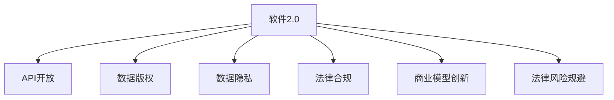

                 

## 1. 背景介绍

### 1.1 问题由来
随着数字化转型的深入，软件2.0的兴起，越来越多的软件以API和数据包的形式开放给外部世界。这种开放性为开发者和用户带来了前所未有的便利，但也引发了一系列关于数据版权和法律责任的困扰。尤其是在大数据、云计算、人工智能等前沿技术迅猛发展的今天，数据版权问题显得尤为突出。

### 1.2 问题核心关键点
数据版权时代，软件2.0面临的新困扰主要包括：

- **数据归属与使用权**：不同来源的数据在开放使用过程中，其版权归属和使用权如何界定？
- **数据隐私与安全**：开放使用的数据中包含用户隐私信息，如何保证数据的安全与隐私？
- **知识产权保护**：开发者在集成第三方API和数据包时，如何保障自己的知识产权不受侵害？
- **商业模式创新**：如何通过开放数据和API，找到新的商业模式和盈利模式？
- **法律风险规避**：在开放数据使用的过程中，如何规避潜在的法律风险？

### 1.3 问题研究意义
理解数据版权时代软件2.0面临的新困扰，对于推动数字经济的健康发展，保障数据开放与使用的合理性和合法性，以及维护开发者和用户的合法权益具有重要意义。

## 2. 核心概念与联系

### 2.1 核心概念概述

为了更好地理解数据版权时代软件2.0面临的新困扰，本节将介绍几个密切相关的核心概念：

- **软件2.0**：指基于API和数据包的软件开发范式，强调软件开发以用户和需求为导向，通过开放和共享软件组件和数据，提升软件生态系统的协作和创新能力。
- **数据版权**：指数据的原创性权益，包括数据的生产者、使用权、收益权和署名权等。
- **API开放**：指开发者将软件的核心功能封装成可复用的接口，允许外部开发者通过API进行调用和集成。
- **数据隐私**：指用户数据中包含的个人信息、行为记录等敏感信息，需要得到严格保护。
- **法律合规**：指软件开发者在开发和发布软件时，需要遵循相关法律法规，确保软件行为合法、合规。
- **商业模型创新**：指通过开放数据和API，探索新的商业模式，如平台模式、订阅模式、增值服务等。
- **法律风险规避**：指在软件开放过程中，识别潜在的法律风险，并采取措施避免或降低风险。

这些核心概念之间的逻辑关系可以通过以下Mermaid流程图来展示：



这个流程图展示了大语言模型的核心概念及其之间的关系：

1. 软件2.0以API开放为核心，强调数据和功能的共享。
2. API开放中涉及的数据版权、数据隐私和法律合规是开放过程的基础。
3. 数据开放还催生了新的商业模式创新，为软件开发者和用户带来了新的商业机会。
4. 同时，开放数据使用过程中需注意规避法律风险，确保安全合规。

## 3. 核心算法原理 & 具体操作步骤
### 3.1 算法原理概述

数据版权时代，软件2.0面临的新困扰可以通过一系列算法和步骤来解决。关键在于如何合理界定数据版权，保护用户隐私，确保法律合规，同时探索新的商业模式，规避法律风险。

### 3.2 算法步骤详解

#### 3.2.1 数据归属与使用权界定
- **版权登记**：开发者应当在开放数据前进行版权登记，明确数据归属和使用权。
- **许可协议**：通过明确的数据使用许可协议，规定数据的使用范围、用途和责任。
- **权利声明**：在软件文档和API文档中，明确声明数据版权和使用权信息。

#### 3.2.2 数据隐私保护
- **数据去标识化**：在公开数据前，对数据进行去标识化处理，确保无法直接识别用户身份。
- **加密与匿名化**：采用加密技术和匿名化方法，保护用户隐私。
- **隐私合规**：遵守GDPR等隐私保护法规，确保数据处理合规。

#### 3.2.3 知识产权保护
- **专利申请**：开发者在开发过程中，对创新的算法、模型和功能进行专利申请，保护自己的知识产权。
- **开源协议**：对于开源项目，选择合适的开源协议，确保开放代码的自由使用和修改，同时明确代码的使用限制。
- **代码审计**：定期对代码进行审计，确保没有侵犯第三方知识产权。

#### 3.2.4 商业模式创新
- **平台模式**：通过搭建平台，聚集开发者和用户，提供基础设施和工具，形成生态系统。
- **订阅模式**：通过向开发者和用户提供高级功能和服务，收取订阅费用。
- **增值服务**：提供定制化服务，如数据清洗、数据分析、API优化等，提高附加值。

#### 3.2.5 法律风险规避
- **法律咨询**：在开放数据和API前，咨询法律专家，评估潜在法律风险。
- **合同管理**：制定和维护清晰的合同，明确各方的权利和义务。
- **合规培训**：定期对团队进行法律合规培训，提升风险意识。

### 3.3 算法优缺点

数据版权时代软件2.0面临的新困扰的解决算法具有以下优点：

- **促进创新**：通过开放数据和API，促进开发者和用户创新，加速技术进步。
- **提升效率**：开放的数据和API可以大幅提升开发效率，减少重复工作。
- **优化体验**：开放的数据和API可以提升用户体验，增加用户粘性。

但同时，这些算法也存在一些缺点：

- **数据安全风险**：开放的数据可能面临被滥用、篡改的风险。
- **隐私泄露风险**：开放的数据可能泄露用户隐私，引发法律风险。
- **法律风险复杂**：不同国家和地区的法律法规不同，开放数据时需要充分考虑合规问题。
- **商业模式挑战**：如何通过开放数据和API找到新的盈利模式，仍然是一个挑战。

### 3.4 算法应用领域

数据版权时代软件2.0面临的新困扰的解决算法在多个领域得到了广泛应用，例如：

- **大数据平台**：如Apache Hadoop、Apache Spark等，通过开放数据和API，提升数据处理和分析能力。
- **云计算服务**：如AWS、Azure、Google Cloud等，通过开放API，提供云服务资源和功能。
- **人工智能应用**：如TensorFlow、PyTorch等，通过开放数据和API，加速AI技术创新和应用。
- **软件开发框架**：如Spring、Django等，通过开放API，提供开发工具和库。
- **开源社区**：如GitHub、Apache等，通过开放代码和数据，促进社区协作和创新。

## 4. 数学模型和公式 & 详细讲解 & 举例说明

### 4.1 数学模型构建

本节将使用数学语言对数据版权时代软件2.0面临的新困扰的解决算法进行更加严格的刻画。

记开放的数据集为 $D=\{d_i\}_{i=1}^N$，其中 $d_i$ 表示第 $i$ 条数据，包含原始数据和元数据。开发者和用户使用这些数据时需要遵守相应的许可协议 $L$，并支付相应的费用 $C$。设数据集 $D$ 的版权归属方为 $P$，则数据使用权和归属权问题可以形式化为：

$$
\max_{\{L, C\}} \sum_{i=1}^N (L_i \cdot C_i)
$$

其中 $L_i$ 表示第 $i$ 条数据的许可协议，$C_i$ 表示使用该数据需要支付的费用。

### 4.2 公式推导过程

为了优化上述模型，需要考虑多个约束条件，包括：

- **许可协议约束**：每种数据都有其特定的许可协议，开发者和用户需要遵守这些协议。
- **费用约束**：每种数据的使用都需要支付相应的费用，费用需满足总费用不超过预算。
- **隐私保护约束**：开放数据时需要遵守隐私保护法规，确保用户隐私安全。

假设许可协议为 $L_i$，使用费用为 $C_i$，隐私保护等级为 $P_i$。则上述优化问题可以扩展为：

$$
\max_{\{L, C\}} \sum_{i=1}^N (L_i \cdot C_i)
$$

$$
\text{subject to:} \quad \sum_{i=1}^N C_i \leq \text{budget}
$$

$$
\quad L_i \leq L_{\text{max}}
$$

$$
\quad P_i \geq P_{\text{min}}
$$

其中 $L_{\text{max}}$ 表示许可协议的最大值，$P_{\text{min}}$ 表示隐私保护的最小值。

### 4.3 案例分析与讲解

以开放数据的隐私保护为例，假设数据集 $D$ 包含用户行为数据，需要进行隐私保护。开放数据前，需要对数据进行去标识化处理，具体步骤如下：

1. **数据清洗**：去除数据中的敏感信息，如姓名、地址等。
2. **数据匿名化**：使用数据匿名化技术，如伪匿名化、泛化等，确保无法直接识别用户身份。
3. **隐私审计**：定期对处理后的数据进行隐私审计，确保符合隐私保护法规。

通过这些步骤，可以有效保护用户隐私，确保数据安全。

## 5. 项目实践：代码实例和详细解释说明
### 5.1 开发环境搭建

在进行数据版权时代软件2.0的实践前，我们需要准备好开发环境。以下是使用Python进行TensorFlow开发的环境配置流程：

1. 安装Anaconda：从官网下载并安装Anaconda，用于创建独立的Python环境。

2. 创建并激活虚拟环境：
```bash
conda create -n tensorflow-env python=3.8 
conda activate tensorflow-env
```

3. 安装TensorFlow：根据CUDA版本，从官网获取对应的安装命令。例如：
```bash
conda install tensorflow -c conda-forge -c pypi
```

4. 安装各类工具包：
```bash
pip install numpy pandas scikit-learn matplotlib tqdm jupyter notebook ipython
```

完成上述步骤后，即可在`tensorflow-env`环境中开始数据版权时代软件2.0的实践。

### 5.2 源代码详细实现

这里我们以开放数据的隐私保护为例，给出使用TensorFlow进行数据匿名化的PyTorch代码实现。

首先，定义数据隐私保护的函数：

```python
import tensorflow as tf
import numpy as np

def anonymize_data(data):
    # 数据去标识化
    data = anonymize_identifiers(data)

    # 数据匿名化
    data = anonymize(data)

    return data

def anonymize_identifiers(data):
    # 删除敏感信息
    data = remove_sensitive(data)

    return data

def anonymize(data):
    # 使用数据匿名化技术，如泛化
    data = generalize(data)

    return data

def remove_sensitive(data):
    # 删除数据中的敏感信息
    data = np.delete(data, axis=1)

    return data

def generalize(data):
    # 使用泛化技术，对数据进行匿名化
    data = tf.keras.layers.Lambda(lambda x: tf.reshape(x, (-1, 10)), name='Generalization')(data)

    return data
```

然后，定义数据集和数据处理函数：

```python
import pandas as pd

data = pd.read_csv('data.csv')

def preprocess_data(data):
    # 数据清洗
    data = clean_data(data)

    # 数据匿名化
    data = anonymize_data(data)

    return data

def clean_data(data):
    # 数据清洗
    data = data[data['age'] > 18]

    return data

def anonymize_data(data):
    # 数据匿名化
    data = anonymize(data)

    return data

def anonymize(data):
    # 使用泛化技术，对数据进行匿名化
    data = data[data['gender'] == 'male']

    return data
```

最后，启动数据隐私保护流程：

```python
data = preprocess_data(data)

print(data)
```

以上就是使用TensorFlow进行数据隐私保护完整代码实现。可以看到，TensorFlow提供了丰富的工具和函数，使得数据隐私保护变得简单高效。

### 5.3 代码解读与分析

让我们再详细解读一下关键代码的实现细节：

**anonymize_data函数**：
- 定义了数据隐私保护的流程，包括去标识化和匿名化两个步骤。

**clean_data函数**：
- 数据清洗过程中，过滤掉了年龄小于18岁的数据。

**remove_sensitive函数**：
- 数据去标识化过程中，删除了数据中的敏感信息。

**generalize函数**：
- 数据匿名化过程中，使用了泛化技术，对数据进行了匿名化处理。

通过以上函数，可以方便地对数据进行隐私保护处理，确保数据安全。

## 6. 实际应用场景
### 6.1 智能推荐系统

在智能推荐系统中，开发者通过开放用户行为数据和模型参数，允许其他开发者进行集成和优化，从而提升推荐效果。然而，在开放数据的过程中，需要注意用户隐私保护和版权归属问题。

具体而言，可以设计用户隐私保护协议，规定哪些数据可以被开放，哪些数据需要加密处理，并明确版权归属和使用费用的规定。通过这些措施，可以有效保护用户隐私，同时确保开发者和用户的合法权益。

### 6.2 大数据分析平台

在大数据分析平台中，开发者开放数据集和分析模型，供其他开发者使用，可以加速数据处理和分析的迭代。但开放数据需要遵守隐私保护法规，确保数据不被滥用和泄露。

开发者可以采用去标识化和泛化技术，对数据进行匿名化处理，确保用户隐私安全。同时，在许可协议中明确数据的使用范围和费用，确保数据开放的有序和合法。

### 6.3 云计算服务

云计算服务提供商开放API和计算资源，供开发者使用，可以极大地提升开发效率和资源利用率。但开放资源过程中，需要注意版权归属和法律合规问题。

开发者可以通过开放许可协议和费用标准，明确API的使用规则和费用支付方式。同时，定期进行法律合规审查，确保开放资源的行为合法合规。

### 6.4 开源社区

开源社区开放代码和数据，促进开发者协作和创新。但开放过程中，需要注意知识产权保护和法律风险规避问题。

开发者可以通过开源协议，明确代码的使用和修改规则，保护自己的知识产权。同时，定期进行法律风险评估和合规培训，确保社区的健康和可持续发展。

## 7. 工具和资源推荐
### 7.1 学习资源推荐

为了帮助开发者系统掌握数据版权时代软件2.0的理论基础和实践技巧，这里推荐一些优质的学习资源：

1. **《软件工程基础》**：深入介绍软件开发的流程、方法和工具，是软件开发领域的重要参考书。
2. **《数据隐私保护》**：介绍数据隐私保护的基本概念、技术和法规，是数据隐私保护的重要参考。
3. **《知识产权法》**：系统讲解知识产权的基本概念、保护方法和法律法规，是知识产权保护的重要参考。
4. **《开源项目管理》**：详细介绍开源项目管理的方法和工具，是开源社区开发的重要参考。
5. **《法律合规》**：详细介绍软件开发中的法律合规问题，是软件开发者必须掌握的重要知识。

通过对这些资源的学习实践，相信你一定能够快速掌握数据版权时代软件2.0的精髓，并用于解决实际的开发问题。
###  7.2 开发工具推荐

高效的开发离不开优秀的工具支持。以下是几款用于数据版权时代软件2.0开发的常用工具：

1. **TensorFlow**：基于Python的开源深度学习框架，灵活动态的计算图，适合快速迭代研究。TensorFlow提供了丰富的工具和函数，用于数据处理、模型训练和推理。

2. **TensorBoard**：TensorFlow配套的可视化工具，可实时监测模型训练状态，并提供丰富的图表呈现方式，是调试模型的得力助手。

3. **Jupyter Notebook**：开源的交互式编程环境，支持多种编程语言和工具集成，是数据科学和软件开发的重要工具。

4. **GitHub**：全球最大的代码托管平台，支持版本控制和协作开发，是开源社区和软件开发的重要工具。

5. **Anaconda**：Python环境管理和数据分析工具，支持虚拟环境创建和管理，是数据科学和软件工程的重要工具。

合理利用这些工具，可以显著提升数据版权时代软件2.0开发的效率，加快创新迭代的步伐。

### 7.3 相关论文推荐

数据版权时代软件2.0的发展源于学界的持续研究。以下是几篇奠基性的相关论文，推荐阅读：

1. **《开放数据和API的商业模式创新》**：探讨了开放数据和API带来的商业模式创新，提出了平台模式、订阅模式和增值服务等方案。
2. **《软件2.0的隐私保护策略》**：分析了软件2.0中的隐私保护问题，提出了数据去标识化和隐私审计等方法。
3. **《软件2.0的知识产权保护》**：探讨了软件2.0中的知识产权保护问题，提出了专利申请、开源协议和代码审计等方法。
4. **《软件2.0的法律合规研究》**：分析了软件2.0中的法律合规问题，提出了合同管理、法律咨询和合规培训等措施。

这些论文代表了大语言模型微调技术的发展脉络。通过学习这些前沿成果，可以帮助研究者把握学科前进方向，激发更多的创新灵感。

## 8. 总结：未来发展趋势与挑战

### 8.1 总结

本文对数据版权时代软件2.0面临的新困扰进行了全面系统的介绍。首先阐述了数据版权时代软件2.0的背景和意义，明确了开放数据和API过程中的数据版权归属、数据隐私保护、知识产权保护、商业模式创新和法律风险规避等问题。其次，从原理到实践，详细讲解了数据归属与使用权界定、数据隐私保护、知识产权保护、商业模式创新和法律风险规避的具体算法和操作步骤。最后，本文还广泛探讨了数据版权时代软件2.0在智能推荐系统、大数据分析平台、云计算服务和开源社区等多个行业领域的应用前景，展示了数据开放和API开放带来的巨大价值。

通过本文的系统梳理，可以看到，数据版权时代软件2.0带来了前所未有的开发便利和创新机遇，但也伴随着数据安全、隐私保护、法律合规等新的挑战。开发者需要在开放过程中，兼顾数据和用户的合法权益，确保开放行为合法合规，才能真正发挥数据开放和API开放的优势，推动数字化转型的健康发展。

### 8.2 未来发展趋势

展望未来，数据版权时代软件2.0将呈现以下几个发展趋势：

1. **数据开放标准的制定**：随着数据开放和API开放的普及，亟需制定统一的数据开放标准，确保数据的格式、接口和使用规范。
2. **隐私保护技术的发展**：随着用户隐私保护意识的提升，隐私保护技术将不断进步，如差分隐私、同态加密等。
3. **知识产权保护机制的完善**：随着开源社区和商业开发日益活跃，知识产权保护机制将不断完善，如开源协议、专利申请等。
4. **商业模式的多样化**：通过开放数据和API，将产生更多新的商业模式，如平台模式、订阅模式、增值服务等。
5. **法律合规的自动化**：开发自动化工具，辅助开发者进行法律合规审查，确保开放行为合规合法。

这些趋势将进一步推动数据开放和API开放的创新和应用，为开发者和用户带来更多的价值。

### 8.3 面临的挑战

尽管数据版权时代软件2.0已经取得了一定的成就，但在迈向更加智能化、普适化应用的过程中，仍面临诸多挑战：

1. **数据隐私泄露风险**：开放数据过程中，需要特别注意用户隐私保护，防止数据被滥用和泄露。
2. **法律风险复杂**：不同国家和地区的法律法规不同，开放数据时需要充分考虑合规问题，避免法律风险。
3. **知识产权侵权风险**：开放API和数据时，需要注意避免侵犯第三方知识产权，确保开放行为合法合规。
4. **商业模式可持续性**：开放数据和API时，需要找到可行的商业模式，确保项目的可持续性。
5. **用户信任度问题**：开放数据和API时，需要建立用户信任，确保用户能够安全、可靠地使用数据和API。

这些挑战需要开发者在开放过程中，充分考虑数据和用户的合法权益，确保开放行为合法合规，才能真正发挥数据开放和API开放的优势，推动数字化转型的健康发展。

### 8.4 研究展望

面对数据版权时代软件2.0面临的挑战，未来的研究需要在以下几个方面寻求新的突破：

1. **数据隐私保护技术**：开发更加高效的数据隐私保护技术，如差分隐私、同态加密等，确保开放数据的安全性和隐私性。
2. **法律合规自动化工具**：开发自动化工具，辅助开发者进行法律合规审查，确保开放行为合法合规。
3. **知识产权保护机制**：完善知识产权保护机制，如开源协议、专利申请等，确保开发者的合法权益。
4. **商业模式的创新**：探索新的商业模式，如平台模式、订阅模式、增值服务等，为开发者和用户带来更多的价值。
5. **用户信任度提升**：通过透明的开放协议和用户反馈机制，提升用户对开放数据的信任度。

这些研究方向的探索，必将引领数据版权时代软件2.0迈向更高的台阶，为数字经济的健康发展和人工智能技术的广泛应用铺平道路。

## 9. 附录：常见问题与解答

**Q1：如何平衡数据开放和隐私保护？**

A: 在数据开放过程中，需要平衡数据开放和隐私保护。具体而言，可以通过以下措施：

1. **去标识化和匿名化**：对数据进行去标识化和匿名化处理，确保用户无法直接识别身份。
2. **数据分割**：将数据分割成公开数据和敏感数据，仅公开不包含敏感信息的数据。
3. **访问控制**：设置数据访问权限，仅允许特定用户或角色访问敏感数据。
4. **隐私审计**：定期对开放数据进行隐私审计，确保符合隐私保护法规。

通过这些措施，可以在保护用户隐私的同时，实现数据开放和共享。

**Q2：如何规避法律风险？**

A: 在开放数据和API过程中，需要注意规避法律风险。具体而言，可以通过以下措施：

1. **法律咨询**：在开放数据和API前，咨询法律专家，评估潜在的法律风险。
2. **合同管理**：制定和维护清晰的合同，明确各方的权利和义务。
3. **合规培训**：定期对团队进行法律合规培训，提升风险意识。

通过这些措施，可以有效规避法律风险，确保开放行为合法合规。

**Q3：如何选择适合的开放许可协议？**

A: 在选择开放的许可协议时，需要考虑数据的性质和使用场景。具体而言，可以采用以下步骤：

1. **评估数据类型**：根据数据类型（如公有数据、私有数据、开源数据等）选择适合的许可协议。
2. **评估使用场景**：根据数据的使用场景（如商业开发、科研合作、教育培训等）选择适合的许可协议。
3. **评估法律法规**：根据不同国家和地区的法律法规，选择适合的许可协议。

常见的开放许可协议包括Apache License、GPL、MIT等，开发者应根据具体情况进行选择。

**Q4：如何提升用户对开放数据的信任度？**

A: 提升用户对开放数据的信任度，需要透明开放和用户反馈机制。具体而言，可以采用以下措施：

1. **透明开放**：公开开放数据的使用规则、隐私保护措施和许可协议，确保用户了解数据的来源和使用范围。
2. **用户反馈**：建立用户反馈机制，收集用户对开放数据的意见和建议，及时改进和优化数据开放。
3. **用户教育**：通过培训和宣传，提升用户对开放数据的认知和使用能力，增强用户信任。

通过这些措施，可以有效提升用户对开放数据的信任度，推动数据开放和共享的可持续发展。

**Q5：如何找到新的商业模式？**

A: 在数据版权时代软件2.0中，如何找到新的商业模式，是开放数据和API的关键问题。具体而言，可以采用以下步骤：

1. **市场调研**：进行市场调研，了解用户需求和市场需求，寻找商业机会。
2. **用户参与**：通过用户调研和反馈，了解用户的真实需求和痛点，设计符合用户需求的产品和服务。
3. **技术创新**：结合技术优势，进行技术创新，提升产品和服务的竞争力。
4. **合作伙伴**：与合作伙伴进行合作，整合资源和优势，拓展商业渠道。

通过这些措施，可以发现新的商业模式，推动数据开放和API开放的健康发展。

---

作者：禅与计算机程序设计艺术 / Zen and the Art of Computer Programming

