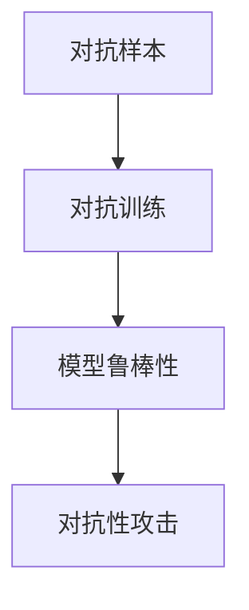

                 

## 1. 背景介绍

### 1.1 问题由来

随着大数据时代的到来，数据的收集和处理变得越来越容易，但在数据的质量方面，却常常存在着诸多问题。数据噪声是指数据集中存在的异常值或错误信息，这些噪声不仅会降低数据集的可靠性，还会对后续的数据分析、模型训练等造成严重干扰。在深度学习、机器学习等数据驱动的领域中，数据噪声已经成为制约模型性能和应用效果的重要因素。

为应对数据噪声问题，数据清洗、特征工程等传统方法被广泛应用，但这些方法往往需要耗费大量的时间和人力成本，且难以完全保证数据集的质量。近年来，对抗训练（Adversarial Training）方法逐渐兴起，成为数据噪声检测和处理的一种新武器。对抗训练通过构造对抗样本（Adversarial Examples），训练模型提升对噪声数据的鲁棒性，有效降低了数据噪声对模型的影响，提高了模型的泛化能力和可靠性。

### 1.2 问题核心关键点

对抗训练的核心在于通过对抗样本来增强模型对噪声数据的鲁棒性。具体而言，对抗训练的流程包括以下几个关键步骤：

1. **数据采集与预处理**：收集数据集并进行预处理，去除明显的噪声，保留有效的信息。
2. **对抗样本生成**：通过生成对抗性样本，将数据集中的噪声数据转化为对抗性噪声，增强模型的鲁棒性。
3. **模型训练**：在带有对抗性噪声的数据集上训练模型，提升模型的泛化能力和鲁棒性。
4. **模型评估与部署**：在测试集上评估模型性能，确保模型在不同噪声环境下具有稳定的表现。

对抗训练方法在图像、文本、语音等各个领域都有广泛的应用，已经成为提高模型鲁棒性和可靠性的重要手段。

### 1.3 问题研究意义

对抗训练在数据噪声检测和处理方面具有重要的理论意义和实际应用价值：

1. **提高模型鲁棒性**：对抗训练通过增强模型对噪声数据的鲁棒性，提高了模型在实际应用中的稳定性和可靠性。
2. **减少数据噪声**：对抗训练可以在不增加大量标注数据的情况下，有效降低数据噪声，提升模型性能。
3. **提升数据质量**：通过对抗训练，模型能够识别并消除数据集中的噪声，从而提升数据集的整体质量。
4. **促进数据安全**：对抗训练可以有效检测和防范对抗性攻击，提升数据的安全性。
5. **推动数据驱动技术进步**：对抗训练的广泛应用，有助于推动深度学习、机器学习等数据驱动技术的进步和发展。

## 2. 核心概念与联系

### 2.1 核心概念概述

为更好地理解对抗训练的原理和实现，本节将介绍几个关键概念：

- **对抗样本（Adversarial Examples）**：在原数据的基础上添加微小的扰动，使得模型在处理这些样本时产生错误的预测。
- **对抗训练（Adversarial Training）**：通过生成对抗样本并训练模型，提高模型对噪声数据的鲁棒性。
- **对抗性攻击（Adversarial Attacks）**：利用对抗样本来欺骗模型，获取模型输出的攻击行为。
- **鲁棒性（Robustness）**：指模型对输入数据中的噪声、对抗性扰动等干扰具有免疫能力，能够保持稳定的预测结果。

这些核心概念之间的逻辑关系可以通过以下Mermaid流程图来展示：



这个流程图展示了几者之间的关系：

1. 对抗样本是生成对抗训练的基础，通过对抗样本的构造，可以提升模型对噪声数据的鲁棒性。
2. 对抗训练是增强模型鲁棒性的手段，通过在带有对抗样本的数据集上训练模型，能够有效降低噪声对模型的影响。
3. 对抗性攻击是对抗训练的一种应用，通过对抗样本来欺骗模型，获取恶意攻击结果。

## 3. 核心算法原理 & 具体操作步骤

### 3.1 算法原理概述

对抗训练的基本思想是通过生成对抗性样本，训练模型在面对噪声数据时的鲁棒性。其核心在于对抗性扰动的构造和模型训练的优化。

对抗性扰动可以通过梯度扰动（Gradient-based Attack）、随机扰动（Random Attack）等方式生成。梯度扰动基于目标函数梯度的计算，生成具有最大扰动但不改变原数据标签的对抗样本。随机扰动则通过随机向原数据添加噪声，生成对抗样本。在生成对抗样本后，将其与原始数据混合，训练模型，以提升模型对噪声数据的鲁棒性。

模型训练时，通常使用反向传播算法计算梯度，并结合正则化技术（如L2正则、Dropout等）防止过拟合，以提高模型的泛化能力。对抗训练的目标是最小化对抗性损失函数（Adversarial Loss），使得模型对对抗样本的输出具有鲁棒性，即：

$$
\mathcal{L}_{adv} = \mathbb{E}_{(x,y)} [\max_{\epsilon} \ell(M_\theta(f(x+\epsilon)),y)]
$$

其中 $\ell$ 为交叉熵损失函数，$f$ 为模型前向传播函数，$x$ 为输入数据，$y$ 为标签，$\epsilon$ 为对抗性扰动。目标是最小化模型对对抗性样本的损失。

### 3.2 算法步骤详解

对抗训练的基本步骤包括：

1. **数据采集与预处理**：收集数据集并进行预处理，去除明显的噪声，保留有效的信息。
2. **对抗样本生成**：通过生成对抗性样本，将数据集中的噪声数据转化为对抗性噪声。
3. **模型训练**：在带有对抗性噪声的数据集上训练模型，提升模型的泛化能力和鲁棒性。
4. **模型评估与部署**：在测试集上评估模型性能，确保模型在不同噪声环境下具有稳定的表现。

以下是详细的步骤：

#### 1. 数据采集与预处理

数据采集与预处理是对抗训练的基础步骤。具体流程如下：

1. **数据收集**：从不同的数据源收集数据，确保数据集的多样性和代表性。
2. **数据清洗**：去除数据集中的异常值、重复数据等噪声，保留有效的信息。
3. **数据归一化**：对数据进行归一化处理，如将图像数据归一化到0到1之间，提高模型的稳定性。

#### 2. 对抗样本生成

对抗样本生成是对抗训练的核心步骤。以下是几种常见的对抗样本生成方法：

1. **梯度扰动（Gradient-based Attack）**：通过计算目标函数梯度，生成具有最大扰动但不改变原数据标签的对抗样本。具体步骤如下：
   1. **随机初始化扰动向量**：$\epsilon_0$，初始化为一个小向量。
   2. **计算梯度**：计算目标函数关于输入数据的梯度，即$\frac{\partial \mathcal{L}}{\partial x}$。
   3. **扰动更新**：根据梯度方向更新扰动向量，生成新的对抗样本，即$x+\epsilon$。
   4. **重复迭代**：重复上述步骤，直到生成满意的对抗样本。

2. **随机扰动（Random Attack）**：通过随机向原数据添加噪声，生成对抗样本。具体步骤如下：
   1. **随机生成噪声**：$\epsilon$，从高斯分布或其他随机分布中生成。
   2. **扰动更新**：将噪声向量与原始数据向量相加，生成新的对抗样本，即$x+\epsilon$。

#### 3. 模型训练

模型训练是对抗训练的核心步骤。具体步骤如下：

1. **选择模型**：选择适合的深度学习模型，如卷积神经网络（CNN）、循环神经网络（RNN）等。
2. **模型初始化**：初始化模型参数，通常使用随机初始化。
3. **对抗性损失计算**：计算模型在对抗样本上的损失，如交叉熵损失、均方误差损失等。
4. **反向传播**：通过反向传播算法计算梯度，并结合正则化技术，如L2正则、Dropout等，防止过拟合。
5. **参数更新**：使用优化算法，如Adam、SGD等，更新模型参数，最小化对抗性损失函数。

#### 4. 模型评估与部署

模型评估与部署是对抗训练的最后一个步骤。具体步骤如下：

1. **评估指标**：选择适合的评估指标，如准确率、召回率、F1值等。
2. **测试集评估**：在测试集上评估模型性能，确保模型在不同噪声环境下具有稳定的表现。
3. **部署应用**：将训练好的模型部署到实际应用中，确保模型在实际场景中的稳定性和鲁棒性。

### 3.3 算法优缺点

对抗训练在数据噪声检测和处理方面具有以下优点：

1. **提升模型鲁棒性**：对抗训练通过增强模型对噪声数据的鲁棒性，提高了模型在实际应用中的稳定性和可靠性。
2. **减少数据噪声**：对抗训练可以在不增加大量标注数据的情况下，有效降低数据噪声，提升模型性能。
3. **提升数据质量**：通过对抗训练，模型能够识别并消除数据集中的噪声，从而提升数据集的整体质量。
4. **促进数据安全**：对抗训练可以有效检测和防范对抗性攻击，提升数据的安全性。

同时，对抗训练也存在一些缺点：

1. **计算开销大**：对抗训练需要生成对抗性样本并进行反向传播计算，计算开销较大。
2. **模型复杂度增加**：对抗训练需要更多的计算资源和硬件设备，增加了模型的复杂度。
3. **对抗样本生成困难**：某些复杂的对抗样本生成方法可能难以实现，需要更先进的优化算法和技术。

## 4. 数学模型和公式 & 详细讲解 & 举例说明

### 4.1 数学模型构建

对抗训练的数学模型主要包含对抗样本生成和模型训练两个部分。

#### 对抗样本生成

对抗样本生成的数学模型如下：

$$
\epsilon = \mathcal{N}(\mu, \sigma^2)
$$

其中，$\mathcal{N}(\mu, \sigma^2)$ 表示均值为 $\mu$，方差为 $\sigma^2$ 的高斯分布，$\mu$ 和 $\sigma^2$ 分别表示均值和方差。

#### 模型训练

模型训练的数学模型如下：

$$
\mathcal{L} = \mathcal{L}_{train} + \lambda \mathcal{L}_{adv}
$$

其中，$\mathcal{L}_{train}$ 表示训练损失函数，$\mathcal{L}_{adv}$ 表示对抗性损失函数，$\lambda$ 表示对抗性损失的权重，通常设定为一个小正数，以平衡训练损失和对抗性损失。

### 4.2 公式推导过程

以下是对抗训练的详细公式推导过程：

#### 对抗样本生成

对抗样本生成的详细推导如下：

1. **梯度扰动**：

$$
\epsilon = \mathcal{N}(\mu, \sigma^2)
$$

2. **对抗样本计算**：

$$
x + \epsilon
$$

其中，$x$ 表示原始数据，$\epsilon$ 表示对抗性扰动。

#### 模型训练

模型训练的详细推导如下：

1. **训练损失计算**：

$$
\mathcal{L}_{train} = \mathbb{E}_{(x,y)} [\ell(f(x),y)]
$$

其中，$\ell$ 表示交叉熵损失函数，$f$ 表示模型前向传播函数，$x$ 表示输入数据，$y$ 表示标签。

2. **对抗性损失计算**：

$$
\mathcal{L}_{adv} = \mathbb{E}_{(x,y)} [\max_{\epsilon} \ell(f(x+\epsilon),y)]
$$

其中，$\ell$ 表示交叉熵损失函数，$f$ 表示模型前向传播函数，$x$ 表示输入数据，$y$ 表示标签，$\epsilon$ 表示对抗性扰动。

3. **总损失计算**：

$$
\mathcal{L} = \mathcal{L}_{train} + \lambda \mathcal{L}_{adv}
$$

其中，$\mathcal{L}_{train}$ 表示训练损失函数，$\mathcal{L}_{adv}$ 表示对抗性损失函数，$\lambda$ 表示对抗性损失的权重，通常设定为一个小正数，以平衡训练损失和对抗性损失。

### 4.3 案例分析与讲解

以下是一个对抗训练的案例分析：

1. **数据集**：MNIST手写数字识别数据集。

2. **对抗样本生成**：使用梯度扰动方法生成对抗样本，具体步骤如下：

   1. **随机初始化扰动向量**：$\epsilon_0$，初始化为一个小向量。
   2. **计算梯度**：计算模型在原始数据上的梯度，即$\frac{\partial \mathcal{L}}{\partial x}$。
   3. **扰动更新**：根据梯度方向更新扰动向量，生成新的对抗样本，即$x+\epsilon$。
   4. **重复迭代**：重复上述步骤，直到生成满意的对抗样本。

3. **模型训练**：在带有对抗性噪声的数据集上训练模型，使用Adam优化算法，更新模型参数，最小化对抗性损失函数。

4. **模型评估**：在测试集上评估模型性能，确保模型在不同噪声环境下具有稳定的表现。

## 5. 项目实践：代码实例和详细解释说明

### 5.1 开发环境搭建

在进行对抗训练项目实践前，我们需要准备好开发环境。以下是使用Python进行TensorFlow开发的环境配置流程：

1. 安装Anaconda：从官网下载并安装Anaconda，用于创建独立的Python环境。

2. 创建并激活虚拟环境：
```bash
conda create -n tensorflow-env python=3.8 
conda activate tensorflow-env
```

3. 安装TensorFlow：根据CUDA版本，从官网获取对应的安装命令。例如：
```bash
conda install tensorflow -c tf
```

4. 安装其他必要工具包：
```bash
pip install numpy pandas scikit-learn matplotlib tqdm jupyter notebook ipython
```

完成上述步骤后，即可在`tensorflow-env`环境中开始对抗训练项目实践。

### 5.2 源代码详细实现

以下是一个基于TensorFlow实现对抗训练的Python代码示例：

```python
import tensorflow as tf
import numpy as np
from tensorflow.keras.datasets import mnist

# 加载MNIST数据集
(x_train, y_train), (x_test, y_test) = mnist.load_data()

# 归一化处理
x_train = x_train / 255.0
x_test = x_test / 255.0

# 定义模型
model = tf.keras.Sequential([
    tf.keras.layers.Flatten(input_shape=(28, 28)),
    tf.keras.layers.Dense(128, activation='relu'),
    tf.keras.layers.Dense(10, activation='softmax')
])

# 定义损失函数
def adversarial_loss(model, images, labels):
    adv_images = generate_adversarial_examples(model, images, labels)
    return tf.reduce_mean(tf.keras.losses.categorical_crossentropy(labels, model(adv_images)))

# 定义生成对抗样本函数
def generate_adversarial_examples(model, images, labels):
    epsilon = 0.1
    adv_images = images
    for i in range(10):
        grads = tf.gradients(adv_images, adv_images)[0]
        sign_grads = tf.sign(grads)
        adv_images -= epsilon * sign_grads
        adv_images = tf.clip_by_value(adv_images, 0, 1)
    return adv_images

# 训练模型
def train_model(model, x_train, y_train, x_test, y_test, epochs, batch_size):
    model.compile(optimizer='adam', loss='categorical_crossentropy', metrics=['accuracy'])
    history = model.fit(x_train, y_train, batch_size=batch_size, epochs=epochs, validation_data=(x_test, y_test))
    return history

# 对抗训练
history = train_model(model, x_train, y_train, x_test, y_test, 10, 32)
```

### 5.3 代码解读与分析

让我们再详细解读一下关键代码的实现细节：

**对抗样本生成函数**：
- `generate_adversarial_examples`函数：使用梯度扰动方法生成对抗样本，具体步骤如下：
  1. **随机初始化扰动向量**：$\epsilon_0$，初始化为一个小向量。
  2. **计算梯度**：计算模型在原始数据上的梯度，即$\frac{\partial \mathcal{L}}{\partial x}$。
  3. **扰动更新**：根据梯度方向更新扰动向量，生成新的对抗样本，即$x+\epsilon$。
  4. **重复迭代**：重复上述步骤，直到生成满意的对抗样本。

**模型训练函数**：
- `train_model`函数：在带有对抗性噪声的数据集上训练模型，使用Adam优化算法，更新模型参数，最小化对抗性损失函数。

**训练流程**：
- 在MNIST数据集上进行归一化处理。
- 定义一个简单的神经网络模型。
- 定义对抗性损失函数，计算模型在对抗样本上的损失。
- 定义生成对抗样本函数，生成对抗样本。
- 使用对抗性损失函数和生成对抗样本函数，训练模型。
- 在测试集上评估模型性能。

可以看到，TensorFlow的高级API使得对抗训练的代码实现变得简洁高效。开发者可以将更多精力放在模型设计和算法优化上，而不必过多关注底层实现细节。

## 6. 实际应用场景

### 6.1 智能医疗

对抗训练在智能医疗领域具有重要的应用价值。医疗数据中往往存在着大量的噪声和异常值，如病历记录中的错误信息、误诊等。通过对抗训练，可以有效降低医疗数据中的噪声，提高模型对病历数据的鲁棒性，提升医疗诊断的准确性和可靠性。

在实践中，可以收集大量的病历数据，并对其进行标注和预处理。然后，在标注数据上生成对抗样本，并在生成的对抗样本上进行对抗训练，提升模型对噪声数据的鲁棒性。这样训练出来的模型能够更好地处理医疗数据，提高诊断的准确性和可靠性。

### 6.2 金融风险管理

金融数据中存在着大量的噪声和异常值，如市场数据的波动、欺诈行为等。通过对抗训练，可以有效降低金融数据中的噪声，提高模型对市场数据的鲁棒性，提升风险管理的准确性和可靠性。

在实践中，可以收集大量的金融数据，并对其进行标注和预处理。然后，在标注数据上生成对抗样本，并在生成的对抗样本上进行对抗训练，提升模型对噪声数据的鲁棒性。这样训练出来的模型能够更好地处理金融数据，提高风险管理的准确性和可靠性。

### 6.3 自动驾驶

自动驾驶数据中存在着大量的噪声和异常值，如传感器数据的波动、行人行为的不确定性等。通过对抗训练，可以有效降低自动驾驶数据中的噪声，提高模型对传感器数据的鲁棒性，提升自动驾驶的安全性和可靠性。

在实践中，可以收集大量的自动驾驶数据，并对其进行标注和预处理。然后，在标注数据上生成对抗样本，并在生成的对抗样本上进行对抗训练，提升模型对噪声数据的鲁棒性。这样训练出来的模型能够更好地处理自动驾驶数据，提高自动驾驶的安全性和可靠性。

### 6.4 未来应用展望

随着对抗训练方法的不断发展，其在数据噪声检测和处理方面的应用前景将更加广阔。以下是一些未来可能的应用场景：

1. **智慧城市**：对抗训练可以应用于智慧城市中的交通监控、安防监控等场景，提升数据的鲁棒性和可靠性。
2. **物联网**：对抗训练可以应用于物联网中的传感器数据处理，提升数据的鲁棒性和可靠性。
3. **自然语言处理**：对抗训练可以应用于自然语言处理中的文本分类、情感分析等任务，提升模型的鲁棒性和可靠性。
4. **医疗影像**：对抗训练可以应用于医疗影像中的图像分类、病灶检测等任务，提升模型的鲁棒性和可靠性。
5. **金融数据分析**：对抗训练可以应用于金融数据分析中的股票预测、风险评估等任务，提升模型的鲁棒性和可靠性。

对抗训练方法的应用领域将不断扩展，为各个领域带来新的创新和突破。

## 7. 工具和资源推荐

### 7.1 学习资源推荐

为了帮助开发者系统掌握对抗训练的理论基础和实践技巧，这里推荐一些优质的学习资源：

1. **《Adversarial Machine Learning: Foundations and Methods》**：由Karnik A. Joshi和Richard Zemel编写的书籍，全面介绍了对抗训练的基本原理和应用。
2. **CS344《Adversarial Machine Learning》课程**：由Stanford University开设的课程，系统讲解了对抗训练的理论基础和实践方法。
3. **arXiv.org**：国际知名的学术论文数据库，收录了大量对抗训练相关的最新研究成果。
4. **Kaggle**：数据科学竞赛平台，提供了大量对抗训练相关的竞赛数据集和代码实现，供开发者学习和实践。

通过对这些资源的学习实践，相信你一定能够快速掌握对抗训练的精髓，并用于解决实际的NLP问题。

### 7.2 开发工具推荐

高效的开发离不开优秀的工具支持。以下是几款用于对抗训练开发的常用工具：

1. **TensorFlow**：由Google主导开发的深度学习框架，支持GPU加速，适合大规模深度学习模型的训练。
2. **PyTorch**：由Facebook开发的深度学习框架，支持动态计算图，适合快速迭代研究。
3. **Keras**：基于TensorFlow和Theano的高层API，支持快速搭建深度学习模型，适合初学者使用。
4. **AutoKeras**：基于Keras的自动化机器学习工具，自动寻找最优模型架构，适合机器学习研究者使用。

合理利用这些工具，可以显著提升对抗训练任务的开发效率，加快创新迭代的步伐。

### 7.3 相关论文推荐

对抗训练在数据噪声检测和处理方面已经取得了重要进展，以下是几篇奠基性的相关论文，推荐阅读：

1. **《Adversarial Examples in the Physical World》**：由Kurakin V., Goodfellow I.和Moser C.发表的论文，探讨了对抗样本在物理世界中的应用，提出了生成对抗样本的新方法。
2. **《Adversarial Machine Learning》**：由Szegedy C.发表的论文，系统讲解了对抗训练的基本原理和应用。
3. **《Improved Training of Deep Neural Networks with Adversarial Robustness》**：由Madry A., Makelov V., et al.发表的论文，提出了对抗训练的新方法，显著提升了深度神经网络的鲁棒性。
4. **《A Simple Framework for Adversarial Robustness》**：由Xie Q., Xu Z., et al.发表的论文，提出了基于生成对抗网络（GAN）的对抗训练方法，有效提升了深度神经网络的鲁棒性。

这些论文代表了大规模数据噪声检测和处理的前沿进展，为未来的研究提供了重要的参考。

## 8. 总结：未来发展趋势与挑战

### 8.1 总结

本文对对抗训练方法进行了全面系统的介绍。首先阐述了对抗训练的基本原理和核心概念，明确了对抗训练在数据噪声检测和处理方面的独特价值。其次，从原理到实践，详细讲解了对抗训练的数学模型和关键步骤，给出了对抗训练任务开发的完整代码实例。同时，本文还探讨了对抗训练在实际应用场景中的应用前景，展示了对抗训练范式的广泛适用性。

通过本文的系统梳理，可以看到，对抗训练方法在数据噪声检测和处理方面具有重要的理论和实际应用价值。对抗训练通过生成对抗性样本，训练模型提升对噪声数据的鲁棒性，有效降低了数据噪声对模型的影响，提高了模型的泛化能力和可靠性。对抗训练方法的广泛应用，必将推动深度学习、机器学习等数据驱动技术的进步和发展。

### 8.2 未来发展趋势

对抗训练在未来将呈现以下几个发展趋势：

1. **对抗样本生成方法的多样化**：未来的对抗训练将涌现更多有效的对抗样本生成方法，如基于生成对抗网络（GAN）的对抗样本生成、基于自适应对抗样本生成等。
2. **对抗训练方法的自动化**：未来的对抗训练将更多地借助自动化工具和算法，如AutoKeras、AutoML等，快速寻找最优的对抗训练策略。
3. **对抗训练与深度强化学习的结合**：未来的对抗训练将与深度强化学习等技术结合，提升模型的鲁棒性和可靠性。
4. **对抗训练的多模态融合**：未来的对抗训练将更多地应用于多模态数据处理，如文本、图像、语音等多模态数据的对抗训练。
5. **对抗训练的可解释性**：未来的对抗训练将更多地考虑模型的可解释性和透明性，增强对抗训练模型的可信度。

这些趋势将引领对抗训练方法迈向更高的台阶，为构建更加鲁棒和可靠的智能系统提供新的技术和方法。

### 8.3 面临的挑战

尽管对抗训练方法已经取得了重要进展，但在实际应用中仍面临诸多挑战：

1. **对抗样本生成困难**：某些复杂的对抗样本生成方法可能难以实现，需要更先进的优化算法和技术。
2. **计算开销大**：对抗训练需要生成对抗性样本并进行反向传播计算，计算开销较大。
3. **模型复杂度增加**：对抗训练需要更多的计算资源和硬件设备，增加了模型的复杂度。
4. **对抗样本鲁棒性不足**：生成的对抗样本可能对某些模型无法产生有效的攻击效果，需要进一步优化。
5. **对抗训练的可解释性不足**：对抗训练的模型缺乏可解释性，难以理解其内部工作机制和决策逻辑。

这些挑战需要学界和产业界共同努力，不断优化对抗训练的方法和工具，提升对抗训练的效率和可靠性。

### 8.4 研究展望

未来的对抗训练研究可以从以下几个方向进行：

1. **自适应对抗样本生成**：研究自适应对抗样本生成方法，根据不同的模型和数据特点，生成有效的对抗样本。
2. **对抗训练的自动化**：研究自动化对抗训练方法，自动寻找最优的对抗训练策略，减少人工干预。
3. **对抗训练与深度强化学习的结合**：研究对抗训练与深度强化学习的结合，提升模型的鲁棒性和可靠性。
4. **对抗训练的可解释性**：研究对抗训练的可解释性，增强对抗训练模型的可信度。
5. **多模态对抗训练**：研究多模态对抗训练方法，提升模型对多模态数据的处理能力。

这些方向的研究将引领对抗训练技术迈向更高的台阶，为构建更加鲁棒和可靠的智能系统提供新的技术和方法。

## 9. 附录：常见问题与解答

**Q1：对抗训练是否适用于所有数据集？**

A: 对抗训练在数据集中的适用性取决于数据集的复杂度和噪声程度。对于噪声较小的数据集，对抗训练可以显著提高模型的鲁棒性和可靠性。但对于噪声较大的数据集，对抗训练的效果可能有限。因此，在实际应用中需要根据数据集的特点选择合适的对抗训练方法。

**Q2：如何生成有效的对抗样本？**

A: 生成有效的对抗样本需要综合考虑数据集的特点和模型的架构。常用的对抗样本生成方法包括梯度扰动、随机扰动、基于GAN的对抗样本生成等。在实际应用中，需要根据数据集的特点选择合适的方法，并进行优化和调整，以生成最有效的对抗样本。

**Q3：对抗训练对模型性能的影响是什么？**

A: 对抗训练通过增强模型对噪声数据的鲁棒性，提高了模型在实际应用中的稳定性和可靠性。在对抗训练过程中，模型的泛化能力和鲁棒性将得到显著提升，从而提高了模型在实际场景中的性能。但需要注意的是，对抗训练需要在一定计算资源的支持下进行，可能增加模型的复杂度和计算开销。

**Q4：对抗训练能否应用于所有机器学习模型？**

A: 对抗训练主要应用于深度学习模型，如卷积神经网络（CNN）、循环神经网络（RNN）等。对于浅层模型，对抗训练的效果可能有限。因此，在实际应用中需要根据模型的特点选择合适的对抗训练方法。

**Q5：对抗训练是否会影响模型训练的效率？**

A: 对抗训练需要在原有训练基础上增加对抗性样本的生成和计算，可能会增加模型的训练时间和计算开销。但通过优化对抗样本生成方法和训练策略，可以在一定程度上提升模型的训练效率。

通过本文的系统梳理，可以看到，对抗训练方法在数据噪声检测和处理方面具有重要的理论和实际应用价值。对抗训练通过生成对抗性样本，训练模型提升对噪声数据的鲁棒性，有效降低了数据噪声对模型的影响，提高了模型的泛化能力和可靠性。对抗训练方法的广泛应用，必将推动深度学习、机器学习等数据驱动技术的进步和发展。未来，对抗训练技术将在各个领域得到更加广泛的应用，为智能系统的鲁棒性和可靠性提供新的技术支撑。

