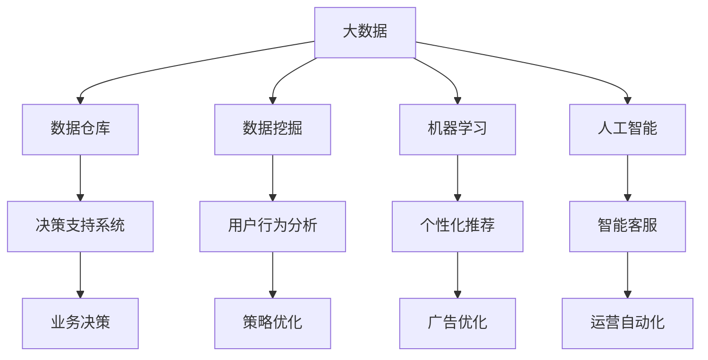

                 

# 数据驱动决策在电商中的应用

## 1. 背景介绍

在现代电商领域，数据驱动的决策过程已经逐渐成为企业获取竞争优势的核心方法。随着互联网技术的普及和消费者行为的变化，传统的基于经验判断和直觉的决策方式已难以适应市场的快速变化。电商企业需要通过数据来洞察市场动态，发现潜在的机会和威胁，从而制定科学、合理的运营策略，提升业绩和用户体验。

在实际操作中，电商企业面临着多层次、多维度的数据挑战。从消费者行为数据、商品销售数据、供应链数据，到广告投放数据、客服互动数据等，数据的海量、多样性和实时性都给数据驱动决策带来了巨大的技术挑战。如何高效地收集、存储、处理、分析这些数据，并将其转化为可操作的业务策略，成为了电商企业数据管理的核心任务。

## 2. 核心概念与联系

### 2.1 核心概念概述

为更好地理解数据驱动决策在电商中的应用，本节将介绍几个关键概念：

- 数据驱动决策（Data-Driven Decision Making）：指基于数据而非直觉或经验的决策过程。在电商中，通过分析海量数据，发现市场规律和消费者行为，制定最优化的商业策略。
- 大数据（Big Data）：指那些无法在传统关系型数据库中用结构化方式存储、管理和处理的数据集。电商企业每天产生的海量用户行为数据、交易数据、客户反馈数据等，都属于大数据范畴。
- 数据仓库（Data Warehouse）：指用于存储、管理和分析企业历史数据的系统。电商企业的数据仓库通常包含了长期积累的用户和交易数据，支持复杂的数据查询和分析。
- 数据挖掘（Data Mining）：指通过自动化或半自动化的方式，从大量数据中挖掘出有用信息和知识的过程。在电商中，数据挖掘可以帮助企业发现潜在消费趋势、推荐产品、优化定价策略等。
- 机器学习（Machine Learning）：指让计算机通过数据学习规律，并进行预测和决策的能力。在电商中，机器学习可以用于个性化推荐、广告投放优化、库存管理等。
- 人工智能（Artificial Intelligence）：指使机器具备智能行为和决策能力的系统。在电商中，AI可以用于智能客服、自动化运营、情感分析等。

这些概念之间的逻辑关系可以通过以下Mermaid流程图来展示：



这个流程图展示了大数据、数据仓库、数据挖掘、机器学习和人工智能如何共同支持电商企业的数据驱动决策过程。

## 3. 核心算法原理 & 具体操作步骤
### 3.1 算法原理概述

在电商应用中，数据驱动决策过程可以大致分为以下步骤：

1. **数据收集**：通过网站、移动应用、社交媒体、第三方数据平台等渠道，收集与消费者、商品、供应链、广告、客服等相关的数据。
2. **数据清洗与预处理**：去除数据中的噪声和异常值，进行缺失值填充、特征工程等操作，为后续分析做准备。
3. **数据存储与管理**：将处理后的数据存储到数据仓库中，支持高并发、高并行性的数据访问和分析。
4. **数据挖掘与分析**：应用数据挖掘算法，如聚类、分类、回归、关联规则等，从数据中挖掘出有价值的信息和知识。
5. **模型训练与评估**：使用机器学习算法，如回归、分类、聚类、强化学习等，构建预测和推荐模型，并在验证集上评估模型性能。
6. **模型部署与监控**：将训练好的模型部署到生产环境，进行实时数据处理和预测，并监控模型性能和系统稳定性。
7. **决策制定与执行**：根据模型预测结果和业务规则，制定业务决策，并指导执行，如商品定价、库存管理、广告投放等。

### 3.2 算法步骤详解

以下将详细介绍数据驱动决策在电商中的具体操作步骤：

**Step 1: 数据收集与预处理**

电商企业需要收集多来源、多类型的数据，包括用户行为数据、商品销售数据、广告投放数据等。这些数据可以来自网站、移动应用、社交媒体、第三方数据平台等渠道。

```python
# 数据收集示例
from flask import Flask, request
app = Flask(__name__)

@app.route('/data')
def data():
    # 假设这里是从用户请求中获取数据
    user_data = request.args.get('user_data')
    item_data = request.args.get('item_data')
    ad_data = request.args.get('ad_data')
    return {'user_data': user_data, 'item_data': item_data, 'ad_data': ad_data}
```

收集到的数据通常需要经过清洗和预处理，去除噪声和异常值，并进行缺失值填充、特征工程等操作。

```python
# 数据清洗示例
import pandas as pd
df = pd.read_csv('data.csv')

# 去除缺失值
df.dropna(inplace=True)

# 特征工程
df['age'] = df['age'].fillna(df['age'].median())
```

**Step 2: 数据存储与管理**

电商企业的数据存储系统通常使用数据仓库技术，如Apache Hadoop、Apache Spark等，以支持大规模数据的存储和管理。

```python
# 数据存储示例
from pyspark.sql import SparkSession

spark = SparkSession.builder.appName('spark').getOrCreate()

# 加载数据到Spark DataFrame
df = spark.read.csv('data.csv')

# 数据仓库操作
df.write.format('parquet').save('hdfs://localhost:9000/user/data')
```

**Step 3: 数据挖掘与分析**

数据挖掘算法可以用于发现用户行为模式、商品关联规则、广告效果分析等。

```python
# 数据挖掘示例
from pyspark.ml.clustering import KMeans
from pyspark.ml.classification import RandomForestClassifier

# 数据分群
kmeans = KMeans(features=['age', 'gender'], numClusters=5)
kmeans_model = kmeans.fit(df)
df = kmeans_model.transform(df)

# 分类模型训练
rf = RandomForestClassifier(features=['age', 'gender'], numTrees=100)
rf_model = rf.fit(df, 'label')
```

**Step 4: 模型训练与评估**

机器学习算法可以用于构建预测和推荐模型，如回归、分类、聚类、强化学习等。

```python
# 模型训练示例
from sklearn.ensemble import RandomForestRegressor
from sklearn.metrics import mean_squared_error

# 数据预处理
X_train, X_test, y_train, y_test = train_test_split(X, y, test_size=0.2, random_state=42)

# 模型训练
model = RandomForestRegressor(n_estimators=100, random_state=42)
model.fit(X_train, y_train)

# 模型评估
y_pred = model.predict(X_test)
mse = mean_squared_error(y_test, y_pred)
print('MSE:', mse)
```

**Step 5: 模型部署与监控**

训练好的模型需要部署到生产环境，并进行实时数据处理和预测。

```python
# 模型部署示例
from flask import Flask, request, jsonify

app = Flask(__name__)

@app.route('/predict', methods=['POST'])
def predict():
    data = request.get_json()
    prediction = model.predict(data['features'])
    return jsonify(prediction)

if __name__ == '__main__':
    app.run(host='0.0.0.0', port=5000)
```

**Step 6: 决策制定与执行**

根据模型预测结果和业务规则，制定业务决策，并指导执行。

```python
# 决策制定示例
if prediction > 5:
    # 进行库存补货
    stock_up(item_id)
else:
    # 进行广告投放优化
    ad_optimize(ad_id)
```

### 3.3 算法优缺点

数据驱动决策在电商中的优势在于其基于数据而非直觉的决策过程，可以提高决策的准确性和效率。但是，数据驱动决策也存在一些局限性：

- 依赖高质量数据：数据驱动决策需要大量高质量、高频率的数据支持，否则决策的准确性会受到影响。
- 技术复杂度高：数据驱动决策涉及数据清洗、数据挖掘、模型训练等多个环节，需要较高的技术水平和资源投入。
- 业务规则结合度有限：数据驱动决策虽然可以提高决策效率，但需要结合业务规则进行综合考虑，否则可能导致决策失衡。
- 数据隐私和安全问题：电商数据涉及用户隐私和商业机密，需要在数据收集、存储、处理和分析等各个环节保证数据的安全性和隐私性。

### 3.4 算法应用领域

数据驱动决策在电商中的应用领域非常广泛，包括但不限于以下几个方面：

- **用户行为分析**：通过分析用户行为数据，发现用户偏好、购买习惯等，优化用户体验和提升转化率。
- **个性化推荐**：使用协同过滤、内容推荐等算法，根据用户历史行为推荐个性化商品。
- **库存管理**：根据历史销售数据和市场需求预测，优化库存水平，减少库存成本。
- **定价策略**：通过市场调研和需求分析，制定最优化的定价策略，提高销售额和利润率。
- **广告投放优化**：利用A/B测试等方法，优化广告投放策略，提高广告效果和ROI。
- **客服自动化**：使用自然语言处理和机器学习技术，构建智能客服系统，提升客户满意度。
- **风险管理**：通过分析交易数据和行为数据，识别潜在的欺诈和风险，保障交易安全。

## 4. 数学模型和公式 & 详细讲解 & 举例说明

### 4.1 数学模型构建

电商中的数据驱动决策过程可以通过以下数学模型进行建模：

1. **用户行为模型**：描述用户行为与商品之间的关联关系。可以使用协同过滤、矩阵分解等方法进行建模。
2. **商品销售模型**：预测商品销售量和库存水平。可以使用时间序列分析、回归分析等方法进行建模。
3. **广告效果模型**：评估广告投放效果，优化广告预算。可以使用A/B测试、回归分析等方法进行建模。
4. **风险管理模型**：识别潜在的欺诈和风险。可以使用异常检测、分类算法等方法进行建模。

### 4.2 公式推导过程

以用户行为模型为例，假设用户行为数据可以表示为$(x_{1}, x_{2}, ..., x_{n})$，每个行为$x_i$的特征向量表示为$(f_{i1}, f_{i2}, ..., f_{im})$，其中$f_{ij}$表示用户行为$x_i$在特征$j$上的取值。

假设模型参数为$\theta$，则用户行为模型可以表示为：

$$y = f_{\theta}(x) = \theta^T \cdot \phi(x)$$

其中$\phi(x)$为特征映射函数，将用户行为数据映射为特征向量。

用户行为模型可以使用梯度下降算法进行训练，目标最小化预测误差：

$$\min_{\theta} \sum_{i=1}^{n} \| y_i - f_{\theta}(x_i) \|^2$$

通过不断调整模型参数$\theta$，最小化上述损失函数，可以得到最优的模型参数，从而进行用户行为预测。

### 4.3 案例分析与讲解

**案例一：用户行为预测**

某电商网站收集了大量用户浏览和购买行为数据，希望预测用户下一次购买的可能性。可以使用协同过滤算法对用户行为数据进行建模，预测用户未来行为。

```python
# 协同过滤算法示例
from pyspark.ml.recommendation import ALS

# 数据准备
df = spark.read.csv('data.csv')

# 协同过滤模型
als = ALS(nIter=10, k=20)
als_model = als.fit(df)

# 用户行为预测
user_id = 123
user_behav = als_model.transform(df)
predictions = user_behav.filter((user_behav.user_id == user_id)).join(user_behav.predictionId.map(lambda x: int(str(x)[4:])), on='predictedUserItemRating')
predictions.show()
```

**案例二：广告效果分析**

某电商网站希望优化广告投放策略，提升广告效果和ROI。可以使用A/B测试和回归分析，评估广告效果，并优化广告投放。

```python
# A/B测试示例
from pyspark.ml.evaluation import RegressionEvaluator

# 数据准备
df = spark.read.csv('ad_data.csv')

# A/B测试
ab_test = df.groupBy('ad_id', 'user_id').count().groupBy('ad_id').agg(mean('count'), stddev('count'))
ab_test = ab_test.orderBy('count_mean', ascending=False)

# 回归分析
from pyspark.ml.regression import LinearRegression
lr = LinearRegression(maxIter=10, regParam=0.3)
lr_model = lr.fit(df)
y_pred = lr_model.transform(df).prediction
y_pred.show()
```

## 5. 项目实践：代码实例和详细解释说明
### 5.1 开发环境搭建

在进行电商数据驱动决策项目实践前，我们需要准备好开发环境。以下是使用Python进行PySpark开发的环境配置流程：

1. 安装Anaconda：从官网下载并安装Anaconda，用于创建独立的Python环境。

2. 创建并激活虚拟环境：
```bash
conda create -n pyspark-env python=3.8 
conda activate pyspark-env
```

3. 安装PySpark：根据CUDA版本，从官网获取对应的安装命令。例如：
```bash
conda install pyspark -c conda-forge
```

4. 安装各类工具包：
```bash
pip install numpy pandas scikit-learn matplotlib tqdm jupyter notebook ipython
```

完成上述步骤后，即可在`pyspark-env`环境中开始项目实践。

### 5.2 源代码详细实现

下面我们以用户行为分析项目为例，给出使用PySpark进行协同过滤算法实现的代码实现。

首先，定义协同过滤算法函数：

```python
from pyspark.ml.recommendation import ALS

def collaborative_filtering(data, rank=20, iterations=10):
    # 数据准备
    user_item = data.join(data, on=['user_id', 'item_id'], how='left').drop('item_id').select('user_id', 'feature_vector')

    # 协同过滤模型
    als = ALS(nIter=iterations, k=rank)
    als_model = als.fit(user_item)

    # 预测用户行为
    user_behav = als_model.transform(user_item)
    user_behav.show()

    # 预测用户行为
    user_behav = als_model.transform(user_item)
    user_behav = user_behav.select('user_id', 'predictionId', 'prediction')
    user_behav.show()

    return als_model
```

然后，加载数据并应用协同过滤算法：

```python
# 数据加载示例
from pyspark.sql import SparkSession

spark = SparkSession.builder.appName('spark').getOrCreate()

# 加载数据
data = spark.read.csv('data.csv', header=True, inferSchema=True)

# 协同过滤
als_model = collaborative_filtering(data)
```

最后，导出模型并进行预测：

```python
# 模型导出示例
als_model.write.save('als_model', 'ALS')

# 预测示例
user_behav = als_model.transform(user_item)
user_behav.show()
```

### 5.3 代码解读与分析

让我们再详细解读一下关键代码的实现细节：

**collaborative_filtering函数**：
- 函数输入为数据集`data`，输出为协同过滤模型`als_model`。
- 首先对数据进行预处理，计算每个用户的特征向量。
- 然后使用ALS算法训练协同过滤模型，并设置模型参数。
- 最后对用户行为进行预测，并输出预测结果。

**数据加载**：
- 使用SparkSession加载数据集，通过指定header和inferSchema参数，自动推断数据类型。

**协同过滤模型应用**：
- 使用协同过滤算法进行用户行为预测，设置参数`rank`为协同过滤的特征向量维度，`iterations`为迭代次数。
- 对数据集进行转换，预测用户行为，并输出预测结果。

**模型导出和预测**：
- 使用`als_model.write.save`将模型保存到本地文件系统。
- 使用`als_model.transform`对新数据进行预测，并输出预测结果。

## 6. 实际应用场景

### 6.1 智能推荐系统

智能推荐系统是电商企业数据驱动决策的重要应用之一。通过分析用户行为数据和商品特征数据，构建推荐模型，能够显著提升用户体验和购买转化率。

在实际应用中，智能推荐系统可以分为以下几个步骤：

1. **用户画像构建**：通过对用户历史行为和属性数据进行分析，构建用户画像，了解用户偏好和行为特征。
2. **商品特征分析**：对商品属性、标签、评价等数据进行分析，提取商品特征，构建商品特征向量。
3. **推荐模型训练**：使用协同过滤、矩阵分解等算法，训练推荐模型，生成用户和商品的相似度矩阵。
4. **推荐结果生成**：根据用户画像和商品特征向量，生成推荐结果，并按相关性排序，推荐给用户。
5. **效果评估与优化**：对推荐结果进行效果评估，根据反馈数据优化推荐模型。

智能推荐系统的核心在于能够根据用户行为数据和商品特征数据，构建准确的推荐模型，生成高质量的推荐结果。

### 6.2 库存管理

库存管理是电商企业运营的重要环节，通过数据分析和优化库存水平，可以显著降低库存成本，提升运营效率。

在实际应用中，库存管理可以分为以下几个步骤：

1. **销售数据分析**：通过对历史销售数据进行分析，了解各商品的销售趋势和周期性变化。
2. **需求预测**：使用时间序列分析、回归分析等方法，对未来销售量进行预测。
3. **库存水平优化**：根据需求预测结果，优化库存水平，确保商品在售罄前有足够的库存。
4. **风险管理**：通过分析交易数据和行为数据，识别潜在的欺诈和风险，保障库存安全。

库存管理的关键在于能够准确预测销售量，并根据预测结果优化库存水平，确保库存充足且不过剩。

### 6.3 个性化营销

个性化营销是电商企业提升用户粘性和忠诚度的重要手段。通过数据分析和机器学习算法，能够针对不同用户进行个性化推荐和广告投放，提升用户满意度和转化率。

在实际应用中，个性化营销可以分为以下几个步骤：

1. **用户行为分析**：通过对用户浏览、点击、购买等行为数据进行分析，了解用户偏好和行为特征。
2. **个性化推荐**：使用协同过滤、内容推荐等算法，根据用户行为数据，生成个性化推荐结果。
3. **广告投放优化**：使用A/B测试和回归分析，评估广告效果，优化广告投放策略，提高广告效果和ROI。
4. **效果评估与优化**：对推荐和广告效果进行评估，根据反馈数据优化算法模型。

个性化营销的关键在于能够根据用户行为数据和历史交易数据，生成高质量的个性化推荐和广告内容，提升用户体验和转化率。

## 7. 工具和资源推荐
### 7.1 学习资源推荐

为了帮助开发者系统掌握电商领域的数据驱动决策技术，这里推荐一些优质的学习资源：

1. 《电商数据分析实战》系列博文：由电商数据分析专家撰写，深入浅出地介绍了电商数据分析的基本方法和实践技巧。
2. 《大数据技术与应用》课程：由知名大学开设的在线课程，涵盖大数据技术的理论基础和实践应用。
3. 《数据科学与统计分析》书籍：全面介绍了数据科学和统计分析的基本概念和实用技巧，适合电商数据分析工作者阅读。
4. Kaggle电商数据分析竞赛：通过参加Kaggle竞赛，实践电商数据分析技能，提升实战能力。
5. PySpark官方文档：详细介绍了PySpark的使用方法和API，适合初学者快速上手。

通过对这些资源的学习实践，相信你一定能够快速掌握电商领域的数据驱动决策技术，并用于解决实际的电商问题。

### 7.2 开发工具推荐

高效的开发离不开优秀的工具支持。以下是几款用于电商数据分析和数据驱动决策开发的常用工具：

1. PySpark：基于Python的分布式计算框架，适合大数据量的数据分析和处理。
2. TensorFlow：由Google主导开发的深度学习框架，支持多种模型训练和优化算法。
3. Apache Spark：快速、通用、可扩展的分布式计算系统，支持大规模数据处理和分析。
4. Jupyter Notebook：开源的Web交互式计算环境，支持Python、R等语言开发，适合快速迭代实验。
5. Apache Hadoop：开源的分布式计算框架，适合大规模数据存储和处理。
6. Dask：基于Python的分布式计算库，支持大数据量的并行处理和优化。

合理利用这些工具，可以显著提升电商数据分析和数据驱动决策的开发效率，加快创新迭代的步伐。

### 7.3 相关论文推荐

电商领域的数据驱动决策研究源于学界的持续研究。以下是几篇奠基性的相关论文，推荐阅读：

1. "A Multi-Aspect Preference Model for Recommendation Systems"（商品推荐系统的多方面偏好模型）：介绍了一种基于多方面偏好的推荐模型，在电商推荐系统中取得了良好的效果。
2. "Customer Recommendation Based on Association Rule Mining"（基于关联规则挖掘的客户推荐）：提出了一种基于关联规则挖掘的推荐方法，在电商推荐系统中应用广泛。
3. "Sales Forecasting for Large Retail Chain: A Comparative Study of Forecasting Methods"（大型零售链的销售预测：比较研究）：对比了多种销售预测方法，为电商库存管理提供了数据支持。
4. "E-commerce Sentiment Analysis with Deep Learning"（使用深度学习进行电商情感分析）：介绍了一种基于深度学习的电商情感分析方法，提升了用户体验和满意度。
5. "Real-Time Demand Prediction for E-commerce: A Survey"（电商实时需求预测综述）：综述了电商实时需求预测的研究现状和未来方向。

这些论文代表了大数据驱动决策在电商领域的发展脉络。通过学习这些前沿成果，可以帮助研究者把握学科前进方向，激发更多的创新灵感。

## 8. 总结：未来发展趋势与挑战
### 8.1 总结

本文对电商领域的数据驱动决策过程进行了全面系统的介绍。首先阐述了数据驱动决策在电商中的重要性和应用场景，明确了数据驱动决策在电商运营中的核心作用。其次，从原理到实践，详细讲解了数据收集、预处理、存储、挖掘、分析、模型训练、决策制定等关键步骤，给出了电商数据分析和数据驱动决策的完整代码实例。同时，本文还广泛探讨了数据驱动决策在智能推荐、库存管理、个性化营销等多个电商场景中的应用前景，展示了数据驱动决策的巨大潜力。

通过本文的系统梳理，可以看到，数据驱动决策在电商中的应用已经成为行业标准，极大地提升了电商运营的智能化水平和业务效率。未来，伴随大数据技术和人工智能算法的不断进步，基于数据驱动的决策将更加精准、高效，推动电商企业迈向更高的发展层次。

### 8.2 未来发展趋势

展望未来，数据驱动决策在电商中的应用将呈现以下几个发展趋势：

1. **实时数据处理**：随着数据量的不断增大，实时数据处理将成为电商数据分析的核心技术之一。通过实时数据流处理技术，能够实时分析用户行为和交易数据，及时调整运营策略。
2. **多模态数据融合**：电商数据分析将不仅仅局限于文本和数值数据，还将引入图像、视频等多模态数据，通过多模态数据融合，提升决策的全面性和准确性。
3. **自适应学习**：基于在线学习技术，电商数据分析系统能够实时更新模型，适应新数据和新业务需求，保持决策的高效性和准确性。
4. **深度强化学习**：通过深度强化学习算法，电商企业能够优化运营策略，提升用户满意度和忠诚度，提高销售额和利润率。
5. **边缘计算**：边缘计算技术能够将数据分析和决策过程部分部署在靠近数据源的设备上，降低延迟，提高决策的实时性。
6. **联邦学习**：联邦学习技术能够在不共享原始数据的情况下，实现跨多个电商企业的模型训练和优化，保障数据隐私和安全。

这些趋势凸显了电商数据分析技术的发展方向，为电商企业带来了新的应用机遇和挑战。

### 8.3 面临的挑战

尽管数据驱动决策在电商中已经取得了显著成效，但在迈向更加智能化、普适化应用的过程中，仍面临诸多挑战：

1. **数据隐私和安全问题**：电商数据涉及用户隐私和商业机密，如何在数据收集、存储、处理和分析等各个环节保障数据的安全性和隐私性，是一个重要课题。
2. **模型复杂度和可解释性**：电商数据分析涉及多种复杂模型和算法，模型的可解释性和可解释性是提升用户信任和决策透明度的关键。
3. **数据质量和一致性**：电商数据分析需要高频率、高质量的数据支持，如何保证数据的一致性和完整性，是实现数据驱动决策的基础。
4. **技术基础设施建设**：电商数据分析需要高性能计算、大数据存储等技术基础设施的支持，如何建设和管理这些基础设施，是实现数据驱动决策的重要保障。
5. **数据孤岛和协同问题**：电商企业的数据分散在不同的部门和系统中，如何打破数据孤岛，实现跨部门的协同合作，是实现数据驱动决策的关键。

这些挑战需要电商企业从技术、组织和流程等多个维度进行综合优化，才能实现数据驱动决策的持续优化和提升。

### 8.4 研究展望

面对数据驱动决策在电商中面临的挑战，未来的研究需要在以下几个方面寻求新的突破：

1. **数据隐私保护技术**：研究如何在不泄露原始数据的情况下，实现数据驱动决策，保障数据隐私和安全。
2. **可解释性和透明性技术**：研究如何提升数据驱动决策模型的可解释性和透明性，增强用户信任和决策透明度。
3. **实时数据处理技术**：研究如何实现实时数据流处理和在线学习，提升数据驱动决策的实时性和自适应能力。
4. **多模态数据融合技术**：研究如何将图像、视频等多模态数据与文本、数值数据进行融合，提升决策的全面性和准确性。
5. **联邦学习技术**：研究如何在跨多个电商企业的场景下，实现模型训练和优化，保障数据隐私和安全。

这些研究方向的探索，必将引领电商数据分析技术迈向更高的台阶，为电商企业提供更加精准、高效、安全的数据驱动决策支持。

## 9. 附录：常见问题与解答

**Q1：如何高效地进行电商数据分析？**

A: 电商数据分析需要处理大量的高频率、多维度数据。为了高效地进行数据分析，可以采用以下方法：

1. **数据预处理**：对数据进行去噪、缺失值填充、特征工程等预处理操作，提升数据质量。
2. **分布式计算**：使用分布式计算框架，如Hadoop、Spark等，进行大数据量的并行处理。
3. **数据存储**：使用高效的数据存储技术，如Parquet、HDFS等，支持高频率、高并行性的数据访问。
4. **数据可视化**：使用数据可视化工具，如Tableau、Power BI等，直观展示数据分析结果，便于业务决策。

**Q2：如何进行电商库存管理？**

A: 电商库存管理的关键在于准确预测销售量，并根据预测结果优化库存水平。

1. **销售数据分析**：通过历史销售数据，分析各商品的销售趋势和周期性变化。
2. **需求预测**：使用时间序列分析、回归分析等方法，对未来销售量进行预测。
3. **库存水平优化**：根据需求预测结果，优化库存水平，确保商品在售罄前有足够的库存。
4. **风险管理**：通过分析交易数据和行为数据，识别潜在的欺诈和风险，保障库存安全。

**Q3：如何进行电商个性化推荐？**

A: 电商个性化推荐的核心在于根据用户行为数据和历史交易数据，生成高质量的个性化推荐结果。

1. **用户画像构建**：通过对用户历史行为和属性数据进行分析，构建用户画像，了解用户偏好和行为特征。
2. **商品特征分析**：对商品属性、标签、评价等数据进行分析，提取商品特征，构建商品特征向量。
3. **推荐模型训练**：使用协同过滤、内容推荐等算法，训练推荐模型，生成用户和商品的相似度矩阵。
4. **推荐结果生成**：根据用户画像和商品特征向量，生成推荐结果，并按相关性排序，推荐给用户。

**Q4：如何进行电商情感分析？**

A: 电商情感分析的核心在于通过文本数据，分析用户对商品或服务的情感倾向。

1. **数据收集**：收集用户评论、评分等文本数据。
2. **情感分析**：使用自然语言处理和机器学习算法，对文本数据进行情感分类，分析用户情感倾向。
3. **情感反馈**：将情感分析结果反馈到电商系统中，指导商品改进和客户服务。

**Q5：如何进行电商实时数据处理？**

A: 电商实时数据处理需要高效、低延迟的计算平台和算法支持。

1. **实时数据流处理**：使用实时数据流处理技术，如Apache Kafka、Apache Flink等，实时处理用户行为和交易数据。
2. **在线学习**：使用在线学习算法，如随机梯度下降、在线梯度下降等，实时更新模型，适应新数据和新业务需求。
3. **边缘计算**：使用边缘计算技术，将数据分析和决策过程部分部署在靠近数据源的设备上，降低延迟，提高决策的实时性。

通过合理利用这些方法，可以显著提升电商数据分析的效率和准确性，为电商企业提供更加智能、高效的数据驱动决策支持。

---

作者：禅与计算机程序设计艺术 / Zen and the Art of Computer Programming

