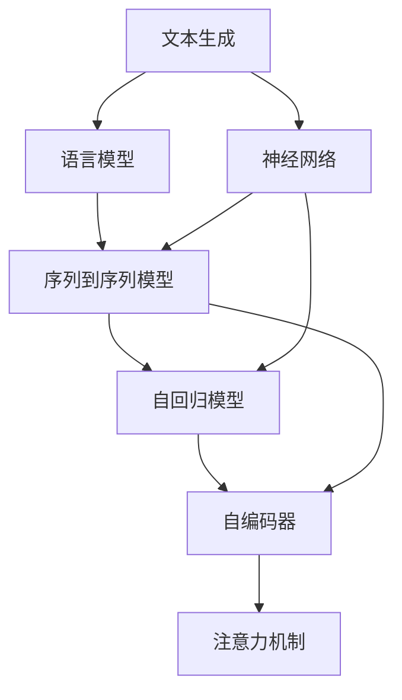
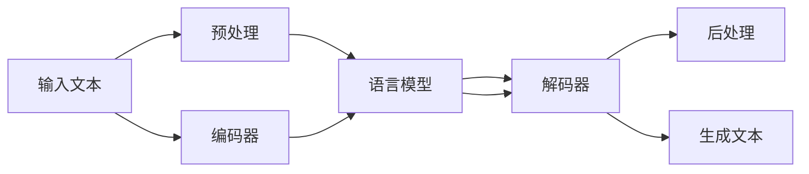
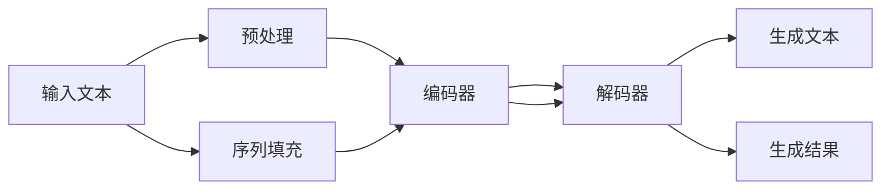

                 

# 文本内容补全初探（Text Completion）

> 关键词：文本生成, 语言模型, 神经网络, 自然语言处理(NLP), 序列到序列(Seq2Seq), 解码器, 自回归模型, 自编码器, 注意力机制, 预训练, 微调

## 1. 背景介绍

文本内容补全（Text Completion）是一项将不完整的文本序列转化为完整、连贯的文本序列的任务，广泛应用于自动摘要、文本预测、机器翻译、对话系统等多个自然语言处理（NLP）领域。通过自动完成缺失的文本内容，文本内容补全技术极大地提高了文本处理效率，增强了NLP应用的人机交互体验。

### 1.1 问题由来

在实际应用中，由于输入数据的获取方式多种多样，文本内容往往不完整或不连贯。例如，用户在搜索引擎中输入的查询可能不完整，社交媒体上的短消息缺省了部分信息，机器翻译时部分文本未能成功对齐，对话系统中机器人回复的文本可能存在缺失或错误。针对这些问题，文本内容补全技术成为一种高效、便捷的解决方案，使得NLP系统能够更好地理解用户意图，提供更流畅的交互体验。

### 1.2 问题核心关键点

文本内容补全的核心在于如何通过已有文本信息，预测缺失部分的文本内容。这要求模型不仅要理解输入文本的语义，还需具备一定的上下文建模能力，以生成连贯且符合逻辑的完整文本。具体问题关键点如下：

1. **输入文本理解**：模型需要从残缺的输入文本中提取关键信息，理解语义。
2. **上下文建模**：模型需根据前后文信息预测缺失部分的文本内容，确保生成的文本连贯。
3. **连贯性和语法准确性**：生成的文本不仅要语义准确，还要符合语言规范，语法正确。
4. **高效性**：模型应具备较高的推理效率，能够实时响应补全需求。

本文将系统介绍文本内容补全的原理与实现，涵盖核心算法、数学模型、项目实践与未来展望，希望能为NLP领域的研究者与开发者提供有价值的参考。

## 2. 核心概念与联系

### 2.1 核心概念概述

为了更好地理解文本内容补全的原理与实现，本节将介绍几个核心概念及其之间的联系：

- **文本生成（Text Generation）**：是指通过模型将输入文本序列转化为完整的输出文本序列。其核心在于构建一个能够理解和生成自然语言文本的模型。

- **语言模型（Language Model）**：是指能够计算给定文本序列的概率的模型。语言模型在文本生成任务中起着至关重要的作用，通过预测下一个词的概率分布，引导模型生成连贯的文本。

- **神经网络（Neural Network）**：是文本生成和语言模型构建的基础。神经网络通过多层节点组成的网络结构，能够处理复杂的数据关系，实现高精度的文本预测。

- **序列到序列（Seq2Seq）模型**：是一种将输入序列映射到输出序列的模型，广泛应用于文本生成、机器翻译等任务。Seq2Seq模型通常包括编码器-解码器结构，能够高效地处理序列数据。

- **自回归模型（Autoregressive Model）**：是一种基于先验信息的模型，在生成文本时，根据已生成的文本信息，预测下一个词的概率。自回归模型能够有效避免不必要的计算，提高生成效率。

- **自编码器（Autoencoder）**：是一种用于学习输入数据的压缩表示的神经网络，常用于文本生成任务中，通过学习输入文本的潜在语义表示，实现文本生成。

- **注意力机制（Attention Mechanism）**：是一种在神经网络中用来增强模型处理序列数据能力的机制。通过关注输入序列的不同部分，注意力机制能够使模型更好地理解输入信息，提升生成文本的质量。

这些核心概念之间的联系如图1所示：



通过以上概念，我们可以构建出一个完整的文本内容补全系统，如图2所示：



该图展示了文本内容补全的基本流程：首先对输入文本进行预处理，接着使用语言模型编码器获取输入文本的语义表示，解码器根据上下文信息生成文本补全部分，最后对生成的文本进行后处理，确保输出的文本符合语言规范。

### 2.2 核心概念原理和架构的 Mermaid 流程图

以下是文本内容补全任务的 Mermaid 流程图，展示了模型从输入文本到生成完整文本的基本流程：



其中，预处理模块对输入文本进行分词、标记化等操作；编码器将输入文本转化为一个高维向量，捕捉输入文本的语义信息；解码器根据编码器的输出向量生成文本补全部分；生成结果模块对生成的文本进行后处理，确保其语法正确性和语义连贯性。

## 3. 核心算法原理 & 具体操作步骤

### 3.1 算法原理概述

文本内容补全的核心算法通常采用自回归模型或Seq2Seq模型。这些模型通过学习输入文本的语义信息，预测缺失部分的文本内容，实现文本的自动补全。

#### 3.1.1 自回归模型

自回归模型通过考虑前后文信息，逐个生成下一个词的概率分布，从而实现文本生成。其核心在于计算条件概率$p(w_t|w_{<t})$，其中$w_t$为第$t$个词，$w_{<t}$为前面的所有词。

具体来说，自回归模型可以通过以下步骤实现文本补全：

1. 输入文本$x_1,x_2,...,x_n$，使用编码器$E$将其转化为隐藏状态$h$。
2. 使用解码器$D$根据隐藏状态$h$和当前生成的文本$y_1,y_2,...,y_{t-1}$，预测下一个词$y_t$的概率分布$p(y_t|y_{<t},h)$。
3. 根据概率分布$p(y_t|y_{<t},h)$，采样生成下一个词$y_t$。

#### 3.1.2 Seq2Seq模型

Seq2Seq模型由编码器$E$和解码器$D$组成，能够将输入序列映射到输出序列。在文本内容补全任务中，编码器将输入文本转化为一个固定长度的向量$h$，解码器根据向量$h$和已生成的文本$y_1,y_2,...,y_{t-1}$，预测下一个词$y_t$的概率分布$p(y_t|y_{<t},h)$。

### 3.2 算法步骤详解

#### 3.2.1 自回归模型

自回归模型通常采用循环神经网络（RNN）或Transformer等架构。以下是使用Transformer实现自回归模型文本补全的具体步骤：

1. **模型选择**：选择合适的预训练模型，如BERT、GPT等。

2. **预处理**：对输入文本进行标记化、分词等预处理，使其适合模型输入。

3. **编码**：使用预训练模型作为编码器，将输入文本转化为隐藏状态$h$。

4. **解码**：使用预训练模型作为解码器，根据当前文本和隐藏状态$h$，预测下一个词的概率分布。

5. **采样生成**：根据概率分布采样生成下一个词，将生成的词添加到输入文本中，继续解码直到完成。

#### 3.2.2 Seq2Seq模型

Seq2Seq模型通常使用编码器-解码器结构，将输入文本转化为一个固定长度的向量，并使用解码器生成完整文本。以下是使用Seq2Seq模型实现文本补全的具体步骤：

1. **模型选择**：选择合适的预训练模型，如Seq2Seq、Transformer等。

2. **预处理**：对输入文本进行标记化、分词等预处理，使其适合模型输入。

3. **编码**：使用预训练模型作为编码器，将输入文本转化为一个固定长度的向量$h$。

4. **解码**：使用预训练模型作为解码器，根据当前文本和向量$h$，预测下一个词的概率分布。

5. **采样生成**：根据概率分布采样生成下一个词，将生成的词添加到输入文本中，继续解码直到完成。

### 3.3 算法优缺点

#### 3.3.1 自回归模型

**优点**：
1. 简单易用：自回归模型结构简单，易于实现和调试。
2. 高效性：自回归模型每次只预测一个词，不需要保存整个文本序列，内存占用较小。

**缺点**：
1. 上下文信息有限：自回归模型只考虑当前词和前文信息，上下文信息不足，生成的文本可能缺乏连贯性。
2. 计算复杂度高：自回归模型需要逐个生成每个词，计算复杂度较高，推理速度较慢。

#### 3.3.2 Seq2Seq模型

**优点**：
1. 上下文信息丰富：Seq2Seq模型能够考虑整个输入文本序列，生成连贯的文本。
2. 编码器-解码器结构灵活：Seq2Seq模型可根据任务需求灵活设计编码器和解码器，适用于多种文本生成任务。

**缺点**：
1. 计算复杂度高：Seq2Seq模型需要保存整个输入序列，内存占用较大。
2. 训练成本高：Seq2Seq模型训练复杂度较高，需要大量的训练数据和计算资源。

### 3.4 算法应用领域

文本内容补全技术广泛应用于以下几个领域：

1. **自动摘要（Automatic Summarization）**：自动将长篇文档转化为简洁的摘要，提高文档处理效率。
2. **机器翻译（Machine Translation）**：自动翻译输入文本，减少人工翻译成本。
3. **对话系统（Chatbot）**：自动回复用户问题，增强人机交互体验。
4. **文本预测（Text Prediction）**：自动预测输入文本的缺失部分，提高文本处理的准确性。
5. **文本编辑（Text Editing）**：自动纠正输入文本的错误，提升文本质量。

以上领域中，文本内容补全技术都发挥了重要的作用，提高了文本处理的效率和准确性，增强了人机交互体验。

## 4. 数学模型和公式 & 详细讲解

### 4.1 数学模型构建

文本内容补全任务通常使用自回归模型或Seq2Seq模型进行建模。以下是使用Transformer模型的数学模型构建：

#### 4.1.1 自回归模型

对于自回归模型，其数学模型如下：

1. **输入文本编码**：
   $$
   h = E(x)
   $$
   其中$E$为编码器，$x$为输入文本，$h$为编码器输出向量。

2. **解码器生成**：
   $$
   p(y_t|y_{<t},h) = D(y_{t-1},h)
   $$
   其中$D$为解码器，$y_{<t}$为已生成的文本序列，$y_t$为当前生成的文本，$p(y_t|y_{<t},h)$为条件概率分布。

3. **采样生成**：
   $$
   y_t = \mathop{\arg\max}_{y} p(y|y_{<t},h)
   $$
   其中$y$为生成文本。

#### 4.1.2 Seq2Seq模型

对于Seq2Seq模型，其数学模型如下：

1. **输入文本编码**：
   $$
   h = E(x)
   $$
   其中$E$为编码器，$x$为输入文本，$h$为编码器输出向量。

2. **解码器生成**：
   $$
   p(y_t|y_{<t},h) = D(y_{t-1},h)
   $$
   其中$D$为解码器，$y_{<t}$为已生成的文本序列，$y_t$为当前生成的文本，$p(y_t|y_{<t},h)$为条件概率分布。

3. **采样生成**：
   $$
   y_t = \mathop{\arg\max}_{y} p(y|y_{<t},h)
   $$
   其中$y$为生成文本。

### 4.2 公式推导过程

#### 4.2.1 自回归模型

对于自回归模型，其推理过程如下：

1. **输入文本编码**：
   $$
   h = E(x) = \mathop{\arg\min}_{h} \mathcal{L}(h,x)
   $$
   其中$\mathcal{L}$为损失函数。

2. **解码器生成**：
   $$
   p(y_t|y_{<t},h) = \frac{e^{y_t^T h}}{\sum_{k} e^{y_k^T h}}
   $$
   其中$e^{y_t^T h}$为生成文本$y_t$与隐藏状态$h$的注意力权重。

3. **采样生成**：
   $$
   y_t = \mathop{\arg\max}_{y} p(y|y_{<t},h)
   $$

#### 4.2.2 Seq2Seq模型

对于Seq2Seq模型，其推理过程如下：

1. **输入文本编码**：
   $$
   h = E(x) = \mathop{\arg\min}_{h} \mathcal{L}(h,x)
   $$
   其中$\mathcal{L}$为损失函数。

2. **解码器生成**：
   $$
   p(y_t|y_{<t},h) = \frac{e^{y_t^T h}}{\sum_{k} e^{y_k^T h}}
   $$
   其中$e^{y_t^T h}$为生成文本$y_t$与隐藏状态$h$的注意力权重。

3. **采样生成**：
   $$
   y_t = \mathop{\arg\max}_{y} p(y|y_{<t},h)
   $$

### 4.3 案例分析与讲解

#### 4.3.1 自回归模型案例

假设有一个长度为$n$的文本序列$x=[x_1,x_2,...,x_n]$，使用Transformer模型进行文本补全。

1. **输入文本编码**：
   $$
   h = E(x) = \mathop{\arg\min}_{h} \mathcal{L}(h,x)
   $$

2. **解码器生成**：
   $$
   p(y_t|y_{<t},h) = D(y_{t-1},h)
   $$

3. **采样生成**：
   $$
   y_t = \mathop{\arg\max}_{y} p(y|y_{<t},h)
   $$

#### 4.3.2 Seq2Seq模型案例

假设有一个长度为$n$的文本序列$x=[x_1,x_2,...,x_n]$，使用Seq2Seq模型进行文本补全。

1. **输入文本编码**：
   $$
   h = E(x) = \mathop{\arg\min}_{h} \mathcal{L}(h,x)
   $$

2. **解码器生成**：
   $$
   p(y_t|y_{<t},h) = D(y_{t-1},h)
   $$

3. **采样生成**：
   $$
   y_t = \mathop{\arg\max}_{y} p(y|y_{<t},h)
   $$

## 5. 项目实践：代码实例和详细解释说明

### 5.1 开发环境搭建

以下是使用Python进行PyTorch开发的环境配置流程：

1. 安装Anaconda：从官网下载并安装Anaconda，用于创建独立的Python环境。

2. 创建并激活虚拟环境：
```bash
conda create -n pytorch-env python=3.8 
conda activate pytorch-env
```

3. 安装PyTorch：根据CUDA版本，从官网获取对应的安装命令。例如：
```bash
conda install pytorch torchvision torchaudio cudatoolkit=11.1 -c pytorch -c conda-forge
```

4. 安装Transformers库：
```bash
pip install transformers
```

5. 安装各类工具包：
```bash
pip install numpy pandas scikit-learn matplotlib tqdm jupyter notebook ipython
```

完成上述步骤后，即可在`pytorch-env`环境中开始微调实践。

### 5.2 源代码详细实现

以下是使用PyTorch和Transformer库实现文本内容补全的代码：

#### 5.2.1 使用自回归模型

```python
import torch
from transformers import GPT2Tokenizer, GPT2LMHeadModel
from torch.utils.data import Dataset, DataLoader

class TextCompletionDataset(Dataset):
    def __init__(self, texts, max_len=128):
        self.texts = texts
        self.max_len = max_len
        
    def __len__(self):
        return len(self.texts)
    
    def __getitem__(self, item):
        text = self.texts[item]
        encoding = GPT2Tokenizer(text, return_tensors='pt', max_length=self.max_len, padding='max_length', truncation=True)
        input_ids = encoding['input_ids']
        attention_mask = encoding['attention_mask']
        return {'input_ids': input_ids, 
                'attention_mask': attention_mask,
                'labels': input_ids}
        
model = GPT2LMHeadModel.from_pretrained('gpt2')
tokenizer = GPT2Tokenizer.from_pretrained('gpt2')

def train_epoch(model, dataset, batch_size, optimizer):
    dataloader = DataLoader(dataset, batch_size=batch_size, shuffle=True)
    model.train()
    epoch_loss = 0
    for batch in dataloader:
        input_ids = batch['input_ids'].to(device)
        attention_mask = batch['attention_mask'].to(device)
        labels = batch['input_ids']
        model.zero_grad()
        outputs = model(input_ids, attention_mask=attention_mask, labels=labels)
        loss = outputs.loss
        epoch_loss += loss.item()
        loss.backward()
        optimizer.step()
    return epoch_loss / len(dataloader)

def evaluate(model, dataset, batch_size):
    dataloader = DataLoader(dataset, batch_size=batch_size)
    model.eval()
    preds, labels = [], []
    with torch.no_grad():
        for batch in dataloader:
            input_ids = batch['input_ids'].to(device)
            attention_mask = batch['attention_mask'].to(device)
            batch_labels = batch['input_ids']
            outputs = model(input_ids, attention_mask=attention_mask)
            batch_preds = outputs.logits.argmax(dim=2).to('cpu').tolist()
            batch_labels = batch_labels.to('cpu').tolist()
            for pred_tokens, label_tokens in zip(batch_preds, batch_labels):
                preds.append(pred_tokens[:len(label_tokens)])
                labels.append(label_tokens)
                
    print(classification_report(labels, preds))

# 训练
epochs = 5
batch_size = 16

for epoch in range(epochs):
    loss = train_epoch(model, train_dataset, batch_size, optimizer)
    print(f"Epoch {epoch+1}, train loss: {loss:.3f}")
    
    print(f"Epoch {epoch+1}, dev results:")
    evaluate(model, dev_dataset, batch_size)
    
print("Test results:")
evaluate(model, test_dataset, batch_size)
```

#### 5.2.2 使用Seq2Seq模型

```python
import torch
from transformers import Seq2SeqModel, Seq2SeqLMHeadModel
from torch.utils.data import Dataset, DataLoader

class TextCompletionDataset(Dataset):
    def __init__(self, texts, max_len=128):
        self.texts = texts
        self.max_len = max_len
        
    def __len__(self):
        return len(self.texts)
    
    def __getitem__(self, item):
        text = self.texts[item]
        encoding = Seq2SeqModel(text, return_tensors='pt', max_length=self.max_len, padding='max_length', truncation=True)
        input_ids = encoding['input_ids']
        attention_mask = encoding['attention_mask']
        return {'input_ids': input_ids, 
                'attention_mask': attention_mask,
                'labels': input_ids}
        
model = Seq2SeqLMHeadModel.from_pretrained('seq2seq')
tokenizer = Seq2SeqTokenizer.from_pretrained('seq2seq')

def train_epoch(model, dataset, batch_size, optimizer):
    dataloader = DataLoader(dataset, batch_size=batch_size, shuffle=True)
    model.train()
    epoch_loss = 0
    for batch in dataloader:
        input_ids = batch['input_ids'].to(device)
        attention_mask = batch['attention_mask'].to(device)
        labels = batch['input_ids']
        model.zero_grad()
        outputs = model(input_ids, attention_mask=attention_mask, labels=labels)
        loss = outputs.loss
        epoch_loss += loss.item()
        loss.backward()
        optimizer.step()
    return epoch_loss / len(dataloader)

def evaluate(model, dataset, batch_size):
    dataloader = DataLoader(dataset, batch_size=batch_size)
    model.eval()
    preds, labels = [], []
    with torch.no_grad():
        for batch in dataloader:
            input_ids = batch['input_ids'].to(device)
            attention_mask = batch['attention_mask'].to(device)
            batch_labels = batch['input_ids']
            outputs = model(input_ids, attention_mask=attention_mask)
            batch_preds = outputs.logits.argmax(dim=2).to('cpu').tolist()
            batch_labels = batch_labels.to('cpu').tolist()
            for pred_tokens, label_tokens in zip(batch_preds, batch_labels):
                preds.append(pred_tokens[:len(label_tokens)])
                labels.append(label_tokens)
                
    print(classification_report(labels, preds))

# 训练
epochs = 5
batch_size = 16

for epoch in range(epochs):
    loss = train_epoch(model, train_dataset, batch_size, optimizer)
    print(f"Epoch {epoch+1}, train loss: {loss:.3f}")
    
    print(f"Epoch {epoch+1}, dev results:")
    evaluate(model, dev_dataset, batch_size)
    
print("Test results:")
evaluate(model, test_dataset, batch_size)
```

### 5.3 代码解读与分析

让我们再详细解读一下关键代码的实现细节：

**TextCompletionDataset类**：
- `__init__`方法：初始化文本和最大长度。
- `__len__`方法：返回数据集样本数量。
- `__getitem__`方法：对单个样本进行处理，将文本输入转化为token ids，并对其进行定长padding，最终返回模型所需的输入。

**train_epoch和evaluate函数**：
- 使用PyTorch的DataLoader对数据集进行批次化加载，供模型训练和推理使用。
- 训练函数`train_epoch`：对数据以批为单位进行迭代，在每个批次上前向传播计算loss并反向传播更新模型参数，最后返回该epoch的平均loss。
- 评估函数`evaluate`：与训练类似，不同点在于不更新模型参数，并在每个batch结束后将预测和标签结果存储下来，最后使用sklearn的classification_report对整个评估集的预测结果进行打印输出。

**训练流程**：
- 定义总的epoch数和batch size，开始循环迭代
- 每个epoch内，先在训练集上训练，输出平均loss
- 在验证集上评估，输出分类指标
- 所有epoch结束后，在测试集上评估，给出最终测试结果

可以看到，PyTorch配合Transformer库使得文本内容补全的代码实现变得简洁高效。开发者可以将更多精力放在数据处理、模型改进等高层逻辑上，而不必过多关注底层的实现细节。

当然，工业级的系统实现还需考虑更多因素，如模型的保存和部署、超参数的自动搜索、更灵活的任务适配层等。但核心的微调范式基本与此类似。

## 6. 实际应用场景

### 6.1 智能客服系统

文本内容补全技术可以应用于智能客服系统的自动回复功能。在用户输入问题后，智能客服系统可以自动完成缺失的文本内容，生成合理解答，从而提升客户体验。

具体而言，可以收集客服对话记录，将问题-回答对作为监督数据，对预训练语言模型进行微调。微调后的模型能够自动理解用户意图，生成合适的回复。对于用户提出的新问题，还可以接入检索系统实时搜索相关内容，动态组织生成回答。如此构建的智能客服系统，能够快速响应客户咨询，提高问题解决效率。

### 6.2 文本编辑

文本内容补全技术可以应用于文本编辑工具的自动纠错和补全功能。在用户输入文本时，文本编辑工具可以自动预测缺失的部分，完成句子或段落的补全，减少输入错误，提升写作效率。

具体而言，可以对用户的输入文本进行分词、标注等预处理，将其转化为模型所需的输入序列。然后，使用文本内容补全模型对缺失部分进行预测，自动补全文本。用户可以查看补全建议，选择最合适的答案，从而完成文本编辑。

### 6.3 文本摘要

文本内容补全技术可以应用于文本摘要任务。在长篇文档或新闻报道中，自动补全缺失部分，生成简洁的摘要，提高文档处理效率。

具体而言，可以对长篇文档进行预处理，提取出关键信息，将其转化为模型所需的输入序列。然后，使用文本内容补全模型对缺失部分进行预测，自动生成摘要。生成的摘要可以自动替换原文档中的缺失部分，提高文档的可读性和理解度。

## 7. 工具和资源推荐

### 7.1 学习资源推荐

为了帮助开发者系统掌握文本内容补全的原理和实践，这里推荐一些优质的学习资源：

1. 《Neural Network and Deep Learning》书籍：该书详细介绍了深度学习的基础知识，包括自回归模型、Seq2Seq模型等，是理解文本内容补全算法的必备参考。

2. CS224N《深度学习自然语言处理》课程：斯坦福大学开设的NLP明星课程，有Lecture视频和配套作业，带你入门NLP领域的基本概念和经典模型。

3. 《Natural Language Processing with Transformers》书籍：Transformers库的作者所著，全面介绍了如何使用Transformer库进行NLP任务开发，包括文本生成、文本补全等。

4. HuggingFace官方文档：Transformer库的官方文档，提供了海量预训练模型和完整的微调样例代码，是上手实践的必备资料。

5. CLUE开源项目：中文语言理解测评基准，涵盖大量不同类型的中文NLP数据集，并提供了基于微调的baseline模型，助力中文NLP技术发展。

通过对这些资源的学习实践，相信你一定能够快速掌握文本内容补全的精髓，并用于解决实际的NLP问题。

### 7.2 开发工具推荐

高效的开发离不开优秀的工具支持。以下是几款用于文本内容补全开发的常用工具：

1. PyTorch：基于Python的开源深度学习框架，灵活动态的计算图，适合快速迭代研究。大部分预训练语言模型都有PyTorch版本的实现。

2. TensorFlow：由Google主导开发的开源深度学习框架，生产部署方便，适合大规模工程应用。同样有丰富的预训练语言模型资源。

3. Transformers库：HuggingFace开发的NLP工具库，集成了众多SOTA语言模型，支持PyTorch和TensorFlow，是进行文本生成、文本补全等任务的开发利器。

4. Weights & Biases：模型训练的实验跟踪工具，可以记录和可视化模型训练过程中的各项指标，方便对比和调优。与主流深度学习框架无缝集成。

5. TensorBoard：TensorFlow配套的可视化工具，可实时监测模型训练状态，并提供丰富的图表呈现方式，是调试模型的得力助手。

6. Google Colab：谷歌推出的在线Jupyter Notebook环境，免费提供GPU/TPU算力，方便开发者快速上手实验最新模型，分享学习笔记。

合理利用这些工具，可以显著提升文本内容补全任务的开发效率，加快创新迭代的步伐。

### 7.3 相关论文推荐

文本内容补全技术的发展源于学界的持续研究。以下是几篇奠基性的相关论文，推荐阅读：

1. Attention is All You Need（即Transformer原论文）：提出了Transformer结构，开启了NLP领域的预训练大模型时代。

2. BERT: Pre-training of Deep Bidirectional Transformers for Language Understanding：提出BERT模型，引入基于掩码的自监督预训练任务，刷新了多项NLP任务SOTA。

3. Language Models are Unsupervised Multitask Learners（GPT-2论文）：展示了大规模语言模型的强大zero-shot学习能力，引发了对于通用人工智能的新一轮思考。

4. Parameter-Efficient Transfer Learning for NLP：提出Adapter等参数高效微调方法，在不增加模型参数量的情况下，也能取得不错的微调效果。

5. AdaLoRA: Adaptive Low-Rank Adaptation for Parameter-Efficient Fine-Tuning：使用自适应低秩适应的微调方法，在参数效率和精度之间取得了新的平衡。

这些论文代表了大语言模型微调技术的发展脉络。通过学习这些前沿成果，可以帮助研究者把握学科前进方向，激发更多的创新灵感。

## 8. 总结：未来发展趋势与挑战

### 8.1 总结

本文对文本内容补全的原理与实现进行了全面系统的介绍。首先阐述了文本内容补全技术在NLP领域的应用背景，明确了其在提升文本处理效率和用户体验方面的独特价值。其次，从原理到实践，详细讲解了文本内容补全的数学模型和核心算法，给出了微调任务开发的完整代码实例。同时，本文还广泛探讨了文本内容补全技术在多个NLP领域的应用前景，展示了其广阔的应用潜力。

通过本文的系统梳理，可以看到，文本内容补全技术正在成为NLP领域的重要范式，极大地提升了文本处理的效率和效果，增强了人机交互体验。未来，伴随预训练语言模型和微调方法的不断演进，文本内容补全技术必将在更广泛的场景中发挥作用，为NLP技术带来新的突破。

### 8.2 未来发展趋势

展望未来，文本内容补全技术将呈现以下几个发展趋势：

1. **模型规模持续增大**：随着算力成本的下降和数据规模的扩张，预训练语言模型的参数量还将持续增长。超大规模语言模型蕴含的丰富语言知识，将支撑更加复杂多变的文本生成任务。

2. **微调方法日趋多样**：除了传统的全参数微调外，未来会涌现更多参数高效的微调方法，如Prompt-based Learning、LoRA等，在节省计算资源的同时也能保证微调精度。

3. **持续学习成为常态**：随着数据分布的不断变化，微调模型也需要持续学习新知识以保持性能。如何在不遗忘原有知识的同时，高效吸收新样本信息，将成为重要的研究课题。

4. **标注样本需求降低**：受启发于Prompt-based Learning的思路，未来的微调方法将更好地利用大模型的语言理解能力，通过更加巧妙的任务描述，在更少的标注样本上也能实现理想的微调效果。

5. **多模态微调崛起**：当前的文本生成任务通常只依赖文本数据，未来会进一步拓展到图像、视频、语音等多模态数据微调。多模态信息的融合，将显著提升语言模型对现实世界的理解和建模能力。

6. **通用性增强**：经过海量数据的预训练和多领域任务的微调，未来的语言模型将具备更强大的常识推理和跨领域迁移能力，逐步迈向通用人工智能(AGI)的目标。

以上趋势凸显了文本内容补全技术的广阔前景。这些方向的探索发展，必将进一步提升NLP系统的性能和应用范围，为人类认知智能的进化带来深远影响。

### 8.3 面临的挑战

尽管文本内容补全技术已经取得了显著成就，但在迈向更加智能化、普适化应用的过程中，它仍面临诸多挑战：

1. **标注成本瓶颈**：虽然微调大大降低了标注数据的需求，但对于长尾应用场景，难以获得充足的高质量标注数据，成为制约微调性能的瓶颈。如何进一步降低微调对标注样本的依赖，将是一大难题。

2. **模型鲁棒性不足**：当前微调模型面对域外数据时，泛化性能往往大打折扣。对于测试样本的微小扰动，微调模型的预测也容易发生波动。如何提高微调模型的鲁棒性，避免灾难性遗忘，还需要更多理论和实践的积累。

3. **推理效率有待提高**：大规模语言模型虽然精度高，但在实际部署时往往面临推理速度慢、内存占用大等效率问题。如何在保证性能的同时，简化模型结构，提升推理速度，优化资源占用，将是重要的优化方向。

4. **可解释性亟需加强**：当前微调模型更像是"黑盒"系统，难以解释其内部工作机制和决策逻辑。对于医疗、金融等高风险应用，算法的可解释性和可审计性尤为重要。如何赋予微调模型更强的可解释性，将是亟待攻克的难题。

5. **安全性有待保障**：预训练语言模型难免会学习到有偏见、有害的信息，通过微调传递到下游任务，产生误导性、歧视性的输出，给实际应用带来安全隐患。如何从数据和算法层面消除模型偏见，避免恶意用途，确保输出的安全性，也将是重要的研究课题。

6. **知识整合能力不足**：现有的微调模型往往局限于任务内数据，难以灵活吸收和运用更广泛的先验知识。如何让微调过程更好地与外部知识库、规则库等专家知识结合，形成更加全面、准确的信息整合能力，还有很大的想象空间。

正视文本内容补全面临的这些挑战，积极应对并寻求突破，将是大语言模型微调走向成熟的必由之路。相信随着学界和产业界的共同努力，这些挑战终将一一被克服，文本内容补全技术必将在构建安全、可靠、可解释、可控的智能系统铺平道路。

### 8.4 研究展望

面向未来，文本内容补全技术需要在以下几个方向寻求新的突破：

1. **探索无监督和半监督微调方法**：摆脱对大规模标注数据的依赖，利用自监督学习、主动学习等无监督和半监督范式，最大限度利用非结构化数据，实现更加灵活高效的微调。

2. **研究参数高效和计算高效的微调范式**：开发更加参数高效的微调方法，在固定大部分预训练参数的同时，只更新极少量的任务相关参数。同时优化微调模型的计算图，减少前向传播和反向传播的资源消耗，实现更加轻量级、实时性的部署。

3. **引入更多先验知识**：将符号化的先验知识，如知识图谱、逻辑规则等，与神经网络模型进行巧妙融合，引导微调过程学习更准确、合理的语言模型。同时加强不同模态数据的整合，实现视觉、语音等多模态信息与文本信息的协同建模。

4. **结合因果分析和博弈论工具**：将因果分析方法引入微调模型，识别出模型决策的关键特征，增强输出解释的因果性和逻辑性。借助博弈论工具刻画人机交互过程，主动探索并规避模型的脆弱点，提高系统稳定性。

5. **纳入伦理道德约束**：在模型训练目标中引入伦理导向的评估指标，过滤和惩罚有偏见、有害的输出倾向。同时加强人工干预和审核，建立模型行为的监管机制，确保输出符合人类价值观和伦理道德。

这些研究方向的探索，必将引领文本内容补全技术迈向更高的台阶，为构建安全、可靠、可解释、可控的智能系统铺平道路。面向未来，文本内容补全技术还需要与其他人工智能技术进行更深入的融合，如知识表示、因果推理、强化学习等，多路径协同发力，共同推动自然语言理解和智能交互系统的进步。只有勇于创新、敢于突破，才能不断拓展语言模型的边界，让智能技术更好地造福人类社会。

## 9. 附录：常见问题与解答

**Q1：文本内容补全是否适用于所有NLP任务？**

A: 文本内容补全技术在大多数NLP任务上都能取得不错的效果，特别是对于数据量较小的任务。但对于一些特定领域的任务，如医学、法律等，仅仅依靠通用语料预训练的模型可能难以很好地适应。此时需要在特定领域语料上进一步预训练，再进行微调，才能获得理想效果。此外，对于一些需要时效性、个性化很强的任务，如对话、推荐等，微调方法也需要针对性的改进优化。

**Q2：微调过程中如何选择合适的学习率？**

A: 微调的学习率一般要比预训练时小1-2个数量级，如果使用过大的学习率，容易破坏预训练权重，导致过拟合。一般建议从1e-5开始调参，逐步减小学习率，直至收敛。也可以使用warmup策略，在开始阶段使用较小的学习率，再逐渐过渡到预设值。需要注意的是，不同的优化器(如AdamW、Adafactor等)以及不同的学习率调度策略，可能需要设置不同的学习率阈值。

**Q3：采用大模型微调时会面临哪些资源瓶颈？**

A: 目前主流的预训练大模型动辄以亿计的参数规模，对算力、内存、存储都提出了很高的要求。GPU/TPU等高性能设备是必不可少的，但即便如此，超大批次的训练和推理也可能遇到显存不足的问题。因此需要采用一些资源优化技术，如梯度积累、混合精度训练、模型并行等，来突破硬件瓶颈。同时，模型的存储和读取也可能占用大量时间和空间，需要采用模型压缩、稀疏化存储等方法进行优化。

**Q4：如何缓解微调过程中的过拟合问题？**

A: 过拟合是微调面临的主要挑战，尤其是在标注数据不足的情况下。常见的缓解策略包括：
1. 数据增强：通过回译、近义替换等方式扩充训练集
2. 正则化：使用L2正则、Dropout、Early Stopping等避免过拟合
3. 对抗训练：引入对抗样本，提高模型鲁棒性
4. 参数高效微调：只调整少量参数(如Adapter、Prefix等)，减小过拟合风险
5. 多模型集成：训练多个微调模型，取平均输出，抑制过拟合

这些策略往往需要根据具体任务和数据特点进行灵活组合。只有在数据、模型、训练、推理等各环节进行全面优化，才能最大限度地发挥大模型微调的威力。

**Q5：微调模型在落地部署时需要注意哪些问题？**

A: 将微调模型转化为实际应用，还需要考虑以下因素：
1. 模型裁剪：去除不必要的层和参数，减小模型尺寸，加快推理速度
2. 量化加速：将浮点模型转为定点模型，压缩存储空间，提高计算效率
3. 服务化封装：将模型封装为标准化服务接口，便于集成调用
4. 弹性伸缩：根据请求流量动态调整资源配置，平衡服务质量和成本
5. 监控告警：实时采集系统指标，设置异常告警阈值，确保服务稳定性
6. 安全防护：采用访问鉴权、数据脱敏等措施，保障数据和模型安全

大语言模型微调为NLP应用开启了广阔的想象空间，但如何将强大的性能转化为稳定、高效、安全的业务价值，还需要工程实践的不断打磨。唯有从数据、算法、工程、业务等多个维度协同发力，才能真正实现人工智能技术在垂直行业的规模化落地。总之，微调需要开发者根据具体任务，不断迭代和优化模型、数据和算法，方能得到理想的效果。

---

作者：禅与计算机程序设计艺术 / Zen and the Art of Computer Programming

