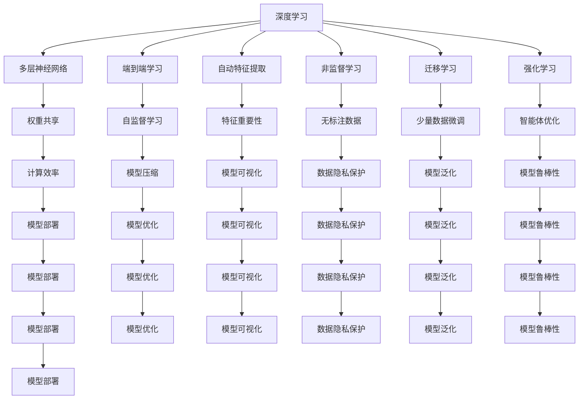

                 

# 新的AI技术栈与传统机器学习工程的区别

> 关键词：AI技术栈,机器学习工程,深度学习,强化学习,迁移学习,联邦学习,自监督学习,联邦学习,自监督学习,强化学习,模型压缩,自动机器学习,模型公平性,可靠性与安全性

## 1. 背景介绍

### 1.1 问题由来

随着人工智能技术的迅猛发展，越来越多的机器学习项目开始采用先进的人工智能技术栈（AI Stack），与传统的机器学习工程有所区别。这些新方法通常基于深度学习、强化学习等先进技术，与过去基于统计学习的方法相比，具有更高的精度和更广泛的应用场景。但同时，这些新方法也带来了新的挑战和问题。本文将系统地探讨新的AI技术栈与传统机器学习工程的区别，希望能帮助读者理解这些新方法的优势和不足，并在此基础上找到更适合自己的技术路径。

### 1.2 问题核心关键点

新AI技术栈与传统机器学习工程的区别主要体现在以下几个方面：

- **模型架构**：深度学习模型与传统统计模型在架构上的巨大差异。
- **数据处理**：深度学习需要大量标注数据，而传统机器学习则更多依赖于特征工程。
- **训练效率**：深度学习需要强大的计算资源和长时间训练，而传统机器学习则相对快速。
- **模型压缩**：如何在大规模深度学习模型中进行有效的模型压缩，以适应资源受限的环境。
- **公平性与安全**：深度学习模型可能存在算法偏见，而传统机器学习模型则相对简单透明。
- **自动化与可解释性**：深度学习模型高度自动化，而传统机器学习模型则更易于解释。

这些区别在实际应用中会对项目的开发、部署和维护带来不同的影响。本文将深入探讨这些区别，并给出相应的解决方案。

## 2. 核心概念与联系

### 2.1 核心概念概述

为了更好地理解新的AI技术栈与传统机器学习工程的区别，本文将介绍几个关键概念：

- **深度学习**：通过多层神经网络模拟人类神经系统的学习过程，自动提取输入数据的高级特征，具有较强的泛化能力。
- **强化学习**：通过试错过程，不断优化智能体在特定环境下的行为策略。
- **迁移学习**：在已有模型基础上，通过少量数据微调，使其在新任务上取得良好表现。
- **联邦学习**：分布式训练，通过不同节点的数据联合训练，保护数据隐私的同时提高模型性能。
- **自监督学习**：无需标注数据，通过自学习任务训练模型，提取数据的内在结构。
- **模型压缩**：通过量化、剪枝、蒸馏等方法，减少深度学习模型的计算复杂度，提高计算效率。
- **自动化机器学习**：通过自动化工具和算法，降低模型训练和调优的复杂度。
- **模型公平性**：通过算法和数据处理技术，确保模型在应用中不产生偏见。
- **可靠性与安全性**：确保模型在实际应用中的稳定性和安全性，避免有害输出。

这些概念之间存在紧密联系，共同构成了新的AI技术栈的核心框架。

### 2.2 核心概念原理和架构的 Mermaid 流程图



## 3. 核心算法原理 & 具体操作步骤

### 3.1 算法原理概述

新的AI技术栈与传统机器学习工程的核心区别在于使用的算法和技术。深度学习、强化学习等方法因其在大规模数据上的优越性能，逐渐成为主流。而传统机器学习方法则更多依赖于统计模型和特征工程。

深度学习算法通过多层神经网络自动学习数据的高级特征，无需手动设计特征，具有较强的泛化能力。其核心原理是使用反向传播算法优化模型参数，最小化损失函数，使得模型能够拟合训练数据。强化学习则通过智能体在特定环境中的试错过程，学习最优策略，使其在特定任务上表现优异。迁移学习则是在已有模型基础上，通过少量数据微调，使其在新任务上取得良好表现。

### 3.2 算法步骤详解

以下是深度学习和强化学习算法的主要步骤：

#### 深度学习算法步骤

1. **数据预处理**：对原始数据进行清洗、标准化和归一化等预处理操作。
2. **构建模型**：使用深度神经网络构建模型，并进行超参数设置。
3. **模型训练**：使用训练数据对模型进行优化，最小化损失函数。
4. **模型评估**：使用验证数据对模型进行评估，调整超参数。
5. **模型部署**：将训练好的模型部署到生产环境，进行实际应用。

#### 强化学习算法步骤

1. **环境定义**：定义智能体运行的环境和任务。
2. **智能体设计**：设计智能体的行为策略。
3. **状态更新**：智能体根据当前状态和动作更新环境状态。
4. **奖励计算**：计算智能体执行动作后的奖励。
5. **策略优化**：使用奖励信号更新智能体的行为策略，优化性能。
6. **模型部署**：将训练好的模型部署到生产环境，进行实际应用。

### 3.3 算法优缺点

#### 深度学习算法的优缺点

**优点**：
- **精度高**：深度学习模型在大规模数据上的表现优异，能够处理复杂的非线性问题。
- **自动特征提取**：无需手动设计特征，模型能够自动提取数据的高级特征。
- **泛化能力强**：在处理新数据时，深度学习模型具有较强的泛化能力。

**缺点**：
- **计算资源需求高**：深度学习模型需要强大的计算资源，训练时间长。
- **数据需求大**：深度学习模型通常需要大量的标注数据进行训练，标注成本高。
- **可解释性差**：深度学习模型高度自动化，难以解释其内部工作机制。

#### 强化学习算法的优缺点

**优点**：
- **适应性强**：强化学习算法能够适应各种复杂环境，无需预定义模型。
- **智能体优化**：通过试错过程，智能体能够不断优化行为策略。
- **实时响应**：强化学习算法能够实时响应环境变化，动态调整策略。

**缺点**：
- **数据需求高**：强化学习算法需要大量的环境反馈数据进行训练，获取数据难度大。
- **模型复杂**：强化学习算法通常涉及复杂的决策过程，难以解释。
- **优化难度大**：强化学习算法优化过程复杂，容易陷入局部最优。

### 3.4 算法应用领域

深度学习和强化学习算法在多个领域得到了广泛应用，包括但不限于以下几个方面：

- **计算机视觉**：图像识别、目标检测、图像生成等。
- **自然语言处理**：机器翻译、文本生成、情感分析等。
- **语音识别**：语音识别、语音合成、说话人识别等。
- **机器人学**：机器人控制、路径规划、行为决策等。
- **推荐系统**：商品推荐、内容推荐、广告推荐等。
- **自动驾驶**：环境感知、路径规划、行为决策等。
- **金融风控**：信用评估、风险预测、投资决策等。
- **医疗诊断**：影像分析、病历分析、疾病预测等。

## 4. 数学模型和公式 & 详细讲解 & 举例说明

### 4.1 数学模型构建

#### 深度学习模型构建

深度学习模型通常使用多层神经网络构建。以卷积神经网络（CNN）为例，其模型结构如下：

$$
\mathcal{M} = \{ \mathcal{H}_l \}_{l=1}^L
$$

其中，$ \mathcal{H}_l $ 表示第 $ l $ 层的隐藏层，通常使用激活函数（如ReLU、Sigmoid等）进行非线性变换。模型的输入为 $ x $，输出为 $ y $。模型的训练目标是最小化损失函数 $ \mathcal{L} $。

#### 强化学习模型构建

强化学习模型通常使用智能体和环境组成。以Q-learning为例，其模型结构如下：

$$
\mathcal{A} = \{ Q(\cdot, \cdot, \cdot) \}_{S, A, R}
$$

其中，$ Q(s, a, r) $ 表示智能体在状态 $ s $ 下，执行动作 $ a $，获得奖励 $ r $ 的期望值。智能体的行为策略为 $ \pi(a|s) $。模型的训练目标是最小化模型预测的Q值与实际Q值的差距，即最小化：

$$
\mathcal{L} = \mathbb{E}_{(s, a, r) \sim \mathcal{D}} \left[ (Q(s, a, r) - (r + \gamma \max_{a'} Q(s', a')) \right]^2
$$

其中，$ \mathcal{D} $ 为经验分布，$ s' $ 为状态转移后的新状态。

### 4.2 公式推导过程

#### 深度学习公式推导

以反向传播算法为例，其核心思想是使用梯度下降算法优化模型参数，最小化损失函数。具体推导如下：

1. **前向传播**：计算模型输出 $ \hat{y} = f(\mathcal{M}(x)) $。
2. **计算梯度**：计算损失函数对输出 $ \hat{y} $ 的梯度 $ \frac{\partial \mathcal{L}}{\partial \hat{y}} $。
3. **反向传播**：根据链式法则，计算梯度对每一层隐藏层 $ \mathcal{H}_l $ 的贡献，即：

$$
\frac{\partial \mathcal{L}}{\partial \theta_l} = \frac{\partial \mathcal{L}}{\partial \hat{y}} \cdot \frac{\partial \hat{y}}{\partial z_l} \cdot \frac{\partial z_l}{\partial \theta_l}
$$

其中，$ \theta_l $ 为第 $ l $ 层参数，$ z_l $ 为第 $ l $ 层输出。

4. **更新参数**：根据梯度更新参数 $ \theta_l \leftarrow \theta_l - \eta \cdot \frac{\partial \mathcal{L}}{\partial \theta_l} $，其中 $ \eta $ 为学习率。

#### 强化学习公式推导

以Q-learning算法为例，其核心思想是通过智能体在环境中尝试执行动作，根据奖励信号更新Q值。具体推导如下：

1. **初始化Q值**：将所有状态动作对的Q值初始化为0。
2. **执行动作**：智能体在当前状态 $ s $ 下，选择动作 $ a $。
3. **接收奖励**：智能体在执行动作后，接收奖励 $ r $。
4. **状态转移**：智能体根据环境状态转移函数，获得新状态 $ s' $。
5. **更新Q值**：根据奖励和Q值更新策略，即：

$$
Q(s, a, r) = Q(s, a, r) + \alpha [r + \gamma \max_{a'} Q(s', a') - Q(s, a, r)]
$$

其中，$ \alpha $ 为学习率，$ \gamma $ 为折扣因子。

### 4.3 案例分析与讲解

#### 深度学习案例：图像分类

以ImageNet数据集为例，使用卷积神经网络进行图像分类。具体步骤如下：

1. **数据预处理**：将图像标准化，并进行数据增强操作，如随机裁剪、翻转等。
2. **模型构建**：使用ResNet等深度神经网络构建模型，并进行超参数设置。
3. **模型训练**：使用ImageNet数据集对模型进行优化，最小化损失函数。
4. **模型评估**：使用验证集对模型进行评估，调整超参数。
5. **模型部署**：将训练好的模型部署到生产环境，进行实际应用。

#### 强化学习案例：机器人路径规划

以机器人路径规划为例，使用Q-learning算法进行策略优化。具体步骤如下：

1. **环境定义**：定义机器人在网格环境中的移动路径。
2. **智能体设计**：设计机器人的移动策略。
3. **状态更新**：机器人根据当前位置和目标位置，选择动作。
4. **奖励计算**：根据机器人到达目标位置的时间，计算奖励。
5. **策略优化**：使用Q-learning算法更新策略，优化路径选择。
6. **模型部署**：将训练好的模型部署到机器人系统，进行实际应用。

## 5. 项目实践：代码实例和详细解释说明

### 5.1 开发环境搭建

在进行深度学习和强化学习项目开发前，我们需要准备好开发环境。以下是使用Python进行TensorFlow和OpenAI Gym进行开发的开发环境配置流程：

1. 安装Anaconda：从官网下载并安装Anaconda，用于创建独立的Python环境。

2. 创建并激活虚拟环境：
```bash
conda create -n deep_learning_env python=3.8 
conda activate deep_learning_env
```

3. 安装TensorFlow和OpenAI Gym：
```bash
pip install tensorflow==2.4 
pip install gym
```

4. 安装各类工具包：
```bash
pip install numpy pandas scikit-learn matplotlib tqdm jupyter notebook ipython
```

完成上述步骤后，即可在`deep_learning_env`环境中开始开发和实验。

### 5.2 源代码详细实现

以下是使用TensorFlow实现深度学习项目的代码实现，以及使用OpenAI Gym实现强化学习项目的代码实现。

#### 深度学习项目：图像分类

```python
import tensorflow as tf
import numpy as np
import matplotlib.pyplot as plt

# 数据加载
def load_data():
    # 加载数据集
    mnist = tf.keras.datasets.mnist
    (x_train, y_train), (x_test, y_test) = mnist.load_data()
    x_train, x_test = x_train / 255.0, x_test / 255.0
    return x_train, y_train, x_test, y_test

# 模型构建
def build_model():
    model = tf.keras.Sequential([
        tf.keras.layers.Flatten(input_shape=(28, 28)),
        tf.keras.layers.Dense(128, activation='relu'),
        tf.keras.layers.Dense(10, activation='softmax')
    ])
    return model

# 模型训练
def train_model(x_train, y_train, x_test, y_test, epochs=10, batch_size=32):
    model = build_model()
    model.compile(optimizer='adam', loss='sparse_categorical_crossentropy', metrics=['accuracy'])
    history = model.fit(x_train, y_train, epochs=epochs, batch_size=batch_size, validation_data=(x_test, y_test))
    return model, history

# 模型评估
def evaluate_model(model, x_test, y_test):
    loss, accuracy = model.evaluate(x_test, y_test)
    print(f'Test loss: {loss}, Test accuracy: {accuracy:.4f}')

# 运行示例
x_train, y_train, x_test, y_test = load_data()
model, history = train_model(x_train, y_train, x_test, y_test)
evaluate_model(model, x_test, y_test)

# 绘制训练曲线
plt.plot(history.history['accuracy'], label='Train accuracy')
plt.plot(history.history['val_accuracy'], label='Validation accuracy')
plt.xlabel('Epoch')
plt.ylabel('Accuracy')
plt.legend()
plt.show()
```

#### 强化学习项目：机器人路径规划

```python
import gym
import numpy as np
import tensorflow as tf

# 环境定义
env = gym.make('Gridworld-v0')
env.render()

# 智能体设计
class QLearningAgent:
    def __init__(self, env):
        self.env = env
        self.state_size = env.observation_space.shape[0]
        self.action_size = env.action_space.n
        self.learning_rate = 0.1
        self.discount_factor = 0.9
        self.memory = np.zeros((1000, 2), dtype=np.float32)
        self.memory_index = 0

    def remember(self, state, action, reward, next_state, done):
        self.memory[self.memory_index] = (state, action, reward, next_state, done)
        self.memory_index = (self.memory_index + 1) % 1000

    def act(self, state):
        if np.random.rand() < 0.05:
            return env.action_space.sample()
        else:
            q_values = self.predict(state)
            return np.argmax(q_values)

    def predict(self, state):
        state = self._make_state(state)
        return self.q_table[np.argmax(state)]

    def _make_state(self, state):
        return np.array(state)

    def update(self):
        if self.memory_index == 0:
            return
        memory_batch = self.memory[:self.memory_index, :]
        for state, action, reward, next_state, done in memory_batch:
            q_new = reward + self.discount_factor * self.predict(next_state)
            q_value = self.predict(state)
            q_value[action] = q_new
            self.q_table = q_value

        self.memory_index = 0

# 运行示例
agent = QLearningAgent(env)
for episode in range(1000):
    state = env.reset()
    done = False
    while not done:
        action = agent.act(state)
        next_state, reward, done, _ = env.step(action)
        agent.remember(state, action, reward, next_state, done)
        state = next_state
        agent.update()

env.close()
```

### 5.3 代码解读与分析

让我们再详细解读一下关键代码的实现细节：

#### 深度学习项目：图像分类

**数据加载函数**：
- 使用TensorFlow内置的数据集加载器，加载MNIST手写数字数据集，并进行预处理。

**模型构建函数**：
- 使用Sequential模型，构建一个包含两个Dense层的神经网络，第一层为全连接层，第二层为输出层。

**模型训练函数**：
- 使用Adam优化器和交叉熵损失函数，对模型进行优化。
- 使用验证集对模型进行评估，调整超参数。

**模型评估函数**：
- 使用测试集对模型进行评估，输出损失和精度。

**运行示例**：
- 加载数据集。
- 构建模型并训练。
- 使用测试集评估模型。
- 绘制训练曲线。

#### 强化学习项目：机器人路径规划

**环境定义**：
- 使用OpenAI Gym加载Gridworld环境，并在Jupyter Notebook中渲染。

**智能体设计**：
- 定义QLearningAgent类，包含状态大小、动作大小、学习率、折扣因子、记忆、索引等属性。
- 实现remember方法，将当前状态、动作、奖励、下一个状态、完成标志等信息存储到内存中。
- 实现act方法，根据当前状态和探索率，选择动作。
- 实现predict方法，根据状态预测Q值。
- 实现_make_state方法，将状态转换为神经网络可接受的格式。

**运行示例**：
- 定义QLearningAgent对象。
- 使用迭代方式，运行1000次模拟。
- 每次模拟中，从环境重置状态，循环执行动作，记录状态、动作、奖励等信息，更新Q值表。

## 6. 实际应用场景

### 6.1 智能客服系统

基于深度学习和大模型的智能客服系统，通过自然语言处理技术，能够自动理解客户意图，并根据历史数据生成最佳答复。具体应用场景如下：

- **自动回复**：将客户咨询输入到深度学习模型中，模型自动生成最佳答复，提升客户满意度。
- **意图识别**：通过预训练模型，自动识别客户咨询意图，并推送相应的FAQ信息。
- **情感分析**：通过情感分析模型，自动判断客户情绪，及时调整客服策略。

### 6.2 金融舆情监测

金融领域需要实时监测市场舆论动向，以便及时应对负面信息传播，规避金融风险。具体应用场景如下：

- **情感分析**：通过情感分析模型，自动监测新闻、评论等文本数据，判断市场情绪。
- **关键词提取**：通过关键词提取技术，自动提取重要事件和关键字，预警潜在的金融风险。
- **事件预测**：通过预测模型，预测未来金融事件的发生概率，指导投资决策。

### 6.3 个性化推荐系统

个性化推荐系统通过深度学习模型，能够自动学习用户兴趣，并推荐相关商品或内容。具体应用场景如下：

- **商品推荐**：根据用户浏览记录和评分数据，推荐相关商品。
- **内容推荐**：根据用户阅读历史和互动数据，推荐相关文章或视频。
- **动态更新**：定期更新模型，适应用户兴趣变化，提升推荐效果。

### 6.4 未来应用展望

未来的AI技术栈将继续向深度学习和强化学习等方向发展，在更多领域得到广泛应用。以下是一些未来的应用展望：

- **医疗诊断**：基于深度学习的医疗影像分析，能够自动诊断疾病，辅助医生诊疗。
- **自动驾驶**：基于强化学习的自动驾驶系统，能够智能导航，提高安全性。
- **智能制造**：基于深度学习的智能制造系统，能够实时监控生产过程，优化生产效率。
- **智慧城市**：基于强化学习的智慧城市系统，能够智能调控交通信号，优化城市资源。
- **游戏智能**：基于强化学习的AI游戏玩家，能够智能决策，提升游戏体验。

## 7. 工具和资源推荐

### 7.1 学习资源推荐

为了帮助开发者系统掌握AI技术栈的理论基础和实践技巧，这里推荐一些优质的学习资源：

1. 《深度学习》课程（Coursera）：由斯坦福大学Andrew Ng教授讲授，全面系统地介绍了深度学习的基本概念和算法。
2. 《TensorFlow实战》书籍：由TensorFlow官方团队编写，涵盖TensorFlow的搭建、训练和优化等实用技巧。
3. 《强化学习基础》课程（Udacity）：由DeepMind科学家Ian Goodfellow讲授，介绍了强化学习的基本原理和算法。
4. 《机器学习实战》书籍：由Peter Harrington编写，介绍了机器学习算法的实现和应用。
5. 《Python深度学习》书籍：由Francois Chollet编写，介绍了TensorFlow的深度学习应用。

### 7.2 开发工具推荐

高效的开发离不开优秀的工具支持。以下是几款用于AI技术栈开发的常用工具：

1. TensorFlow：基于Python的开源深度学习框架，灵活动态的计算图，适合快速迭代研究。
2. PyTorch：基于Python的开源深度学习框架，易于使用和调试，适合学术研究和工业应用。
3. OpenAI Gym：用于强化学习算法的模拟环境，支持多种经典环境和算法。
4. Weights & Biases：模型训练的实验跟踪工具，可以记录和可视化模型训练过程中的各项指标。
5. TensorBoard：TensorFlow配套的可视化工具，可实时监测模型训练状态，并提供丰富的图表呈现方式。
6. Jupyter Notebook：轻量级的Python开发环境，支持交互式编程和数据可视化。

### 7.3 相关论文推荐

AI技术栈的发展源于学界的持续研究。以下是几篇奠基性的相关论文，推荐阅读：

1. AlexNet：提出卷积神经网络，在图像识别任务中取得突破性进展。
2. ResNet：提出残差连接，解决深度神经网络的退化问题，提升模型深度和精度。
3. Reinforcement Learning for Human-Robot Interaction：提出基于强化学习的智能体设计，实现人机交互。
4. Self-Supervised Learning via Proxy Tasks：提出自监督学习任务，无需标注数据，即可训练深度模型。
5. Advances in Neural Information Processing Systems：每年发布的顶级会议论文集，涵盖AI领域的最新研究成果。

通过对这些资源的学习实践，相信你一定能够快速掌握AI技术栈的精髓，并用于解决实际的AI问题。

## 8. 总结：未来发展趋势与挑战

### 8.1 研究成果总结

本文对新的AI技术栈与传统机器学习工程的异同进行了详细探讨，主要结论如下：

- **模型架构**：深度学习模型和大模型具有更强的泛化能力，但计算资源需求高。
- **数据处理**：深度学习需要大量标注数据，而传统机器学习更多依赖特征工程。
- **训练效率**：深度学习训练时间长，而传统机器学习训练时间较短。
- **模型压缩**：深度学习模型需要优化，以适应资源受限的环境。
- **公平性与安全**：深度学习模型可能存在偏见，而传统机器学习模型更透明。
- **自动化与可解释性**：深度学习高度自动化，而传统机器学习更易于解释。

### 8.2 未来发展趋势

未来的AI技术栈将继续向深度学习和强化学习等方向发展，具体趋势如下：

1. **模型规模增大**：深度学习模型将继续向更大规模发展，以提升模型性能。
2. **计算资源优化**：深度学习模型需要优化，以适应资源受限的环境。
3. **模型公平性**：模型公平性问题将得到更多关注，避免算法偏见。
4. **自动化与可解释性**：AI技术将更注重自动化和可解释性，提高模型应用可靠性。
5. **多模态融合**：AI技术将向多模态融合方向发展，整合视觉、语音、文本等多种数据。
6. **分布式训练**：AI技术将向分布式训练方向发展，提升模型训练效率。
7. **边缘计算**：AI技术将向边缘计算方向发展，实现实时推理和决策。

### 8.3 面临的挑战

尽管AI技术栈的发展前景广阔，但同样面临许多挑战：

1. **数据获取难度大**：深度学习模型需要大量标注数据，数据获取难度大。
2. **模型训练时间长**：深度学习模型训练时间长，资源消耗高。
3. **模型复杂性高**：深度学习模型和强化学习算法复杂，难以解释和调试。
4. **模型公平性问题**：深度学习模型可能存在算法偏见，引发伦理和安全问题。
5. **模型鲁棒性差**：深度学习模型对输入数据和环境变化敏感，鲁棒性差。
6. **计算资源需求高**：深度学习模型需要强大的计算资源，成本高。

### 8.4 研究展望

未来的AI研究需要在以下几个方面寻求新的突破：

1. **无监督学习**：开发无监督学习算法，降低对标注数据的依赖。
2. **模型压缩**：开发模型压缩技术，提升计算效率，降低计算资源需求。
3. **可解释性**：开发可解释性算法，提高模型的透明度和可靠性。
4. **多模态融合**：开发多模态融合算法，整合视觉、语音、文本等多种数据。
5. **分布式训练**：开发分布式训练技术，提升模型训练效率。
6. **边缘计算**：开发边缘计算技术，实现实时推理和决策。

这些研究方向将推动AI技术栈的不断发展，拓展AI技术的应用场景，提升AI技术的可靠性、安全性和可解释性。

## 9. 附录：常见问题与解答

**Q1: 深度学习与传统机器学习的区别是什么？**

A: 深度学习与传统机器学习的区别主要在于模型架构和训练方式。深度学习使用多层神经网络，能够自动提取数据的高阶特征，而传统机器学习则更多依赖于手工设计的特征。深度学习通常需要大量标注数据进行训练，而传统机器学习则可以在较少标注数据的情况下取得较好效果。

**Q2: 深度学习模型的训练时间为何如此长？**

A: 深度学习模型的训练时间较长，主要是因为模型参数众多，计算量巨大。为了优化模型性能，需要大量的计算资源和时间。同时，深度学习模型的训练过程较为复杂，需要反复迭代和优化，这也导致训练时间较长。

**Q3: 如何提升深度学习模型的可解释性？**

A: 提升深度学习模型的可解释性可以通过多种方法，如特征可视化、梯度可解释性等。其中，梯度可解释性方法可以通过计算梯度分布、梯度热图等方式，帮助理解模型的内部决策过程。同时，开发可解释性算法，如LIME、SHAP等，也可以提高模型的透明度和可靠性。

**Q4: 深度学习模型为何需要大量的标注数据？**

A: 深度学习模型通常需要大量标注数据进行训练，主要是为了学习数据的高级特征。标注数据能够帮助模型学习到数据的内在结构，提升模型的泛化能力。但大量标注数据获取难度大，成本高，也是深度学习模型的主要瓶颈之一。

**Q5: 强化学习与传统机器学习的区别是什么？**

A: 强化学习与传统机器学习的区别在于学习方式和优化目标。强化学习通过试错过程，智能体在特定环境中不断调整策略，而传统机器学习则通过优化损失函数，最小化模型输出与真实标签的差距。强化学习适用于需要实时决策和动态反馈的任务，如游戏智能、机器人控制等，而传统机器学习适用于静态数据的预测和分类任务。

---

作者：禅与计算机程序设计艺术 / Zen and the Art of Computer Programming

