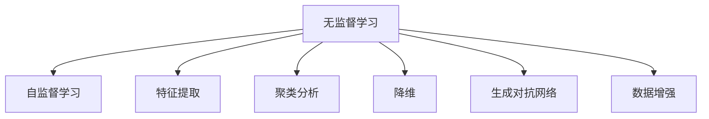

                 

# 无监督学习(Unsupervised Learning) - 原理与代码实例讲解

> 关键词：无监督学习,自监督学习,特征提取,聚类分析,降维,生成对抗网络,数据增强

## 1. 背景介绍

### 1.1 问题由来
随着深度学习技术的快速发展和应用，无监督学习（Unsupervised Learning, UL）逐渐成为人工智能领域的重要研究方向。与传统的监督学习（Supervised Learning, SL）和强化学习（Reinforcement Learning, RL）不同，无监督学习利用未标注的数据进行学习和模型训练，其目标是发现数据中的潜在结构和规律，从而为后续的监督学习或迁移学习提供基础和辅助。

当前，无监督学习在图像处理、自然语言处理、信号处理等领域都取得了显著进展，如自动图像标注、文本生成、推荐系统等。特别是在深度学习模型的辅助下，无监督学习展现了极强的数据处理和模式识别能力，极大地推动了人工智能的发展。

### 1.2 问题核心关键点
无监督学习主要关注以下几个核心关键点：

1. 数据自组织映射：通过无监督学习，发现数据的内在结构和特征，使得数据能够自动地组织和映射到更高级别的表示空间。
2. 隐含变量发现：从原始数据中自动学习潜在的分布式隐含变量，用于提升后续的监督学习或迁移学习效果。
3. 聚类与降维：通过无监督学习，实现对数据集的聚类分析，或是将高维数据降维至低维空间，便于后续的数据分析和模型训练。
4. 生成对抗网络（GAN）：通过无监督学习，利用生成模型和判别模型相互博弈，生成高质量的伪造数据或实现数据的变分推断。
5. 数据增强：通过无监督学习，对原始数据进行变换和增强，扩充训练集样本，提升模型的泛化能力。

这些关键点共同构成了无监督学习的核心目标和方法，推动了其在各个领域的广泛应用。

## 2. 核心概念与联系

### 2.1 核心概念概述

为更好地理解无监督学习的原理和流程，本节将介绍几个紧密相关的核心概念：

- **无监督学习**：通过未标注的数据进行训练和模型优化，目的是发现数据的内在结构和规律，提升后续监督学习或迁移学习的效果。
- **自监督学习**：一种无监督学习方法，利用未标注数据的先验知识或构建自回归目标，以监督学习的方式进行训练。
- **特征提取**：通过无监督学习算法，自动提取数据中的关键特征和结构，为后续的模型训练提供有用的信息。
- **聚类分析**：无监督学习中的一个重要任务，将相似的数据点聚集在一起，实现对数据的自然分组。
- **降维**：通过无监督学习，将高维数据映射到低维空间，便于数据的可视化和分析。
- **生成对抗网络（GAN）**：由生成器和判别器两个模型组成，通过无监督学习实现数据的生成和伪造。
- **数据增强**：通过无监督学习，对原始数据进行变换和增强，以扩充训练集样本，提升模型泛化能力。

这些核心概念之间的逻辑关系可以通过以下Mermaid流程图来展示：



这个流程图展示了无监督学习的核心概念及其之间的关系：

1. 无监督学习通过未标注数据进行学习。
2. 自监督学习在此基础上，利用先验知识或自回归目标构建监督任务。
3. 特征提取和聚类分析用于发现数据的结构和规律。
4. 降维和生成对抗网络进一步处理和转换数据。
5. 数据增强扩充训练集样本，提升模型泛化能力。

这些概念共同构成了无监督学习的学习和应用框架，使得其在多个领域中得到了广泛应用。

## 3. 核心算法原理 & 具体操作步骤
### 3.1 算法原理概述

无监督学习的核心思想是通过未标注的数据，自动发现数据的潜在结构和规律。其流程大致如下：

1. **数据预处理**：对原始数据进行清洗、归一化等处理，确保数据的质量和一致性。
2. **特征提取**：通过无监督学习算法，自动提取数据的关键特征和结构，便于后续的分析和建模。
3. **模型训练**：构建无监督学习模型，如聚类模型、降维模型、GAN等，在未标注数据上进行训练。
4. **模型评估**：使用评估指标如重构误差、KL散度等，对模型性能进行评估和调优。
5. **应用拓展**：将训练好的模型应用于监督学习、迁移学习或生成任务中，提升整体系统的性能。

### 3.2 算法步骤详解

以聚类分析为例，下面详细介绍无监督学习中聚类模型的构建和训练过程：

**Step 1: 数据预处理**
- 收集和清洗数据集，确保数据的完整性和一致性。
- 对数据进行归一化、标准化等预处理，便于模型训练。

**Step 2: 选择合适的聚类算法**
- 选择常用的聚类算法，如K-means、DBSCAN、GMM等。
- 根据数据特点和任务需求，选择合适的聚类算法及其参数设置。

**Step 3: 模型训练**
- 在训练集上进行模型训练，最小化聚类误差或重构误差。
- 使用批量梯度下降等优化算法，不断迭代优化模型参数。

**Step 4: 模型评估**
- 在验证集或测试集上评估模型性能，如聚类准确率、轮廓系数等。
- 根据评估结果，调整模型参数或尝试其他算法。

**Step 5: 应用拓展**
- 将训练好的聚类模型应用于实际数据集，进行聚类分析和数据分组。
- 根据聚类结果，提取关键特征或进行后续的监督学习、生成任务。

### 3.3 算法优缺点

无监督学习具有以下优点：

1. 数据利用率高。无监督学习可以充分利用未标注数据进行学习，避免了标注数据成本高的缺点。
2. 模型泛化能力强。无监督学习模型具有较强的泛化能力，可以更好地适应新数据和新任务。
3. 先验知识少。无监督学习对数据的先验知识要求较低，可以处理更多复杂和多样化的数据。

同时，无监督学习也存在一定的局限性：

1. 模型解释性差。无监督学习模型通常难以解释其内部工作机制，难以提供明确的模型输出解释。
2. 结果不唯一。不同无监督学习算法可能得到不同的聚类结果或特征表示，需要结合领域知识进行验证和选择。
3. 数据要求高。无监督学习模型对数据的结构和分布有较高要求，处理异常数据和噪声可能效果不佳。
4. 收敛速度慢。无监督学习模型训练过程可能涉及较多的参数优化，收敛速度较慢。

尽管存在这些局限性，但无监督学习在大数据时代展现出了巨大的潜力和应用价值，特别是在数据标注成本高、数据分布复杂、先验知识少等场景中，无监督学习往往能够发挥重要作用。

### 3.4 算法应用领域

无监督学习在多个领域得到了广泛应用，具体包括：

- 数据挖掘：从大量未标注数据中发现潜在的模式和规律，用于数据预处理和特征提取。
- 图像处理：利用无监督学习算法进行图像聚类、特征提取和降维，提升图像识别和处理能力。
- 自然语言处理：通过无监督学习算法提取文本特征、进行文本聚类和降维，提升文本分析、生成和分类能力。
- 推荐系统：利用无监督学习算法进行用户画像、商品聚类和用户行为分析，提升个性化推荐效果。
- 信号处理：通过无监督学习算法进行信号去噪、特征提取和信号分类，提升信号处理和分析能力。
- 医疗健康：利用无监督学习算法进行医疗影像分析、疾病诊断和基因组分析，提升医疗健康领域的智能化水平。
- 安全监控：通过无监督学习算法进行异常检测、行为分析和威胁识别，提升网络安全防护能力。

这些应用领域展示了无监督学习在各个领域中的广泛应用，揭示了其对提升数据处理能力和智能化水平的重要作用。

## 4. 数学模型和公式 & 详细讲解 & 举例说明

### 4.1 数学模型构建

本节将使用数学语言对无监督学习的核心算法进行严格刻画。

假设有一组未标注数据集 $\{x_i\}_{i=1}^N$，其中 $x_i \in \mathbb{R}^d$。我们的目标是利用这些数据，自动发现数据的内在结构和规律，得到一组聚类结果 $\{C_k\}_{k=1}^K$，其中 $C_k$ 表示第 $k$ 个聚类。

聚类模型的目标是最小化聚类误差或重构误差，如K-means算法的目标函数为：

$$
\min_{\mu_k} \sum_{i=1}^N \min_{k=1,...,K} ||x_i - \mu_k||^2
$$

其中 $\mu_k$ 表示第 $k$ 个聚类的中心点。

### 4.2 公式推导过程

以K-means算法为例，推导其目标函数和更新公式。

假设我们已知 $K$ 个聚类中心 $\mu_k \in \mathbb{R}^d$，目标是最小化聚类误差：

$$
\min_{\mu_k} \sum_{i=1}^N \min_{k=1,...,K} ||x_i - \mu_k||^2
$$

该目标函数可以被拆分为两个部分：

$$
\min_{\mu_k} \sum_{k=1}^K \sum_{i=1}^N ||x_i - \mu_k||^2
$$

其中第一个部分 $J_k$ 表示每个样本到对应聚类中心的距离的平方和，第二个部分 $J_i$ 表示每个样本到最近聚类中心的距离的平方和。

对于第一个部分，可以通过求导得到：

$$
J_k = \frac{1}{2} \sum_{i=1}^N ||x_i - \mu_k||^2
$$

对该函数求导，得到：

$$
\frac{\partial J_k}{\partial \mu_k} = \sum_{i=1}^N (x_i - \mu_k)
$$

由此得到聚类中心 $\mu_k$ 的更新公式：

$$
\mu_k \leftarrow \frac{1}{N_k} \sum_{i=1}^N x_i
$$

其中 $N_k$ 表示第 $k$ 个聚类的样本数量。

对于第二个部分，可以通过求导得到：

$$
J_i = \min_{k=1,...,K} ||x_i - \mu_k||^2
$$

对该函数求导，得到：

$$
\frac{\partial J_i}{\partial \mu_k} = -2x_i^T \mathbf{1}_{\{k=arg\min_j||x_i - \mu_j||^2\}}
$$

由此可以得到样本 $x_i$ 分配到最近的聚类中心的公式：

$$
y_i \leftarrow arg\min_j ||x_i - \mu_j||^2
$$

### 4.3 案例分析与讲解

以K-means算法为例，详细讲解其工作原理和实际应用：

**案例场景**：

假设有一组无标注的客户数据，包含客户的购买行为、年龄、性别等信息。我们希望通过聚类分析，发现客户的不同群体，从而进行个性化营销。

**数据预处理**：

首先，对数据进行清洗和归一化，确保数据的完整性和一致性。

**聚类模型选择**：

根据数据特点，选择K-means算法进行聚类。

**模型训练**：

在训练集上进行K-means模型训练，最小化聚类误差。使用批量梯度下降等优化算法，不断迭代优化模型参数。

**模型评估**：

在验证集上评估模型性能，如聚类准确率、轮廓系数等。根据评估结果，调整模型参数或尝试其他算法。

**应用拓展**：

将训练好的聚类模型应用于实际数据集，进行聚类分析和数据分组。根据聚类结果，提取关键特征或进行后续的监督学习、生成任务。

通过这个案例，可以看到无监督学习模型在实际应用中的过程和效果。

## 5. 项目实践：代码实例和详细解释说明

### 5.1 开发环境搭建

在进行无监督学习项目实践前，我们需要准备好开发环境。以下是使用Python进行K-means算法实现的环境配置流程：

1. 安装Anaconda：从官网下载并安装Anaconda，用于创建独立的Python环境。

2. 创建并激活虚拟环境：
```bash
conda create -n unsupervised-env python=3.8 
conda activate unsupervised-env
```

3. 安装NumPy和SciPy：
```bash
conda install numpy scipy
```

4. 安装scikit-learn库：
```bash
conda install scikit-learn
```

5. 安装matplotlib库：
```bash
conda install matplotlib
```

完成上述步骤后，即可在`unsupervised-env`环境中开始无监督学习项目实践。

### 5.2 源代码详细实现

下面我们以K-means聚类算法为例，给出使用scikit-learn库对无标注数据集进行聚类分析的Python代码实现。

首先，导入相关库和模块：

```python
import numpy as np
import matplotlib.pyplot as plt
from sklearn.cluster import KMeans
from sklearn.datasets import make_blobs
```

然后，生成一个无标注数据集：

```python
# 生成无标注数据集
X, y = make_blobs(n_samples=1000, n_features=2, centers=4, cluster_std=0.5)
```

接下来，定义聚类模型并进行训练：

```python
# 定义聚类模型
kmeans = KMeans(n_clusters=4, random_state=42)

# 训练模型
kmeans.fit(X)
```

最后，评估聚类模型并可视化结果：

```python
# 获取聚类结果
y_pred = kmeans.predict(X)

# 计算聚类中心
centers = kmeans.cluster_centers_

# 可视化聚类结果
plt.scatter(X[:, 0], X[:, 1], c=y_pred, cmap='viridis')
plt.scatter(centers[:, 0], centers[:, 1], c='red', marker='x')
plt.title('K-means Clustering')
plt.show()
```

### 5.3 代码解读与分析

让我们再详细解读一下关键代码的实现细节：

**make_blobs函数**：
- 生成一个具有4个聚类中心的二维数据集，每个聚类的数据分布在中心周围，且每个数据点的方差为0.5。

**KMeans类**：
- 初始化KMeans模型，指定聚类数目为4。
- 在数据集上训练模型，最小化聚类误差。

**predict方法**：
- 使用训练好的模型对数据集进行聚类预测，得到每个数据点的聚类标签。

**cluster_centers_属性**：
- 获取模型训练得到的聚类中心。

**可视化代码**：
- 使用matplotlib库将数据集和聚类结果可视化，其中聚类中心用红色叉标记。

通过这个简单的代码实例，我们可以看到使用scikit-learn库进行K-means聚类分析的便捷性和高效性。

## 6. 实际应用场景
### 6.1 图像处理

无监督学习在图像处理中有着广泛的应用。通过无监督学习算法，如PCA（主成分分析）、ICA（独立成分分析）等，可以自动提取图像的特征，并进行降维和分类。这在图像识别、图像分割、图像去噪等领域都具有重要意义。

### 6.2 自然语言处理

在自然语言处理领域，无监督学习用于文本聚类、主题建模、情感分析等任务。通过无监督学习，可以自动发现文本中的主题和情感倾向，提升文本分析和分类的效果。

### 6.3 推荐系统

推荐系统是当前互联网应用的热点之一，无监督学习在其中也发挥了重要作用。通过无监督学习，可以自动构建用户画像和商品特征，进行相似性匹配和推荐排序，提升推荐效果。

### 6.4 信号处理

信号处理中，无监督学习用于信号去噪、特征提取和信号分类。通过无监督学习算法，可以从信号中自动提取关键特征，并进行信号分类，提升信号处理和分析的准确性和效率。

### 6.5 医疗健康

在医疗健康领域，无监督学习用于医疗影像分析、疾病诊断和基因组分析。通过无监督学习，可以自动发现影像中的病变区域和特征，提升医疗诊断的准确性和效率。

### 6.6 安全监控

安全监控中，无监督学习用于异常检测、行为分析和威胁识别。通过无监督学习算法，可以自动发现异常行为和潜在威胁，提升网络安全防护能力。

### 6.7 未来应用展望

随着无监督学习技术的不断发展，其应用范围和效果将进一步提升。未来，无监督学习有望在更多领域发挥重要作用，如智能交通、智能家居、智能制造等。通过无监督学习，可以实现对复杂和多样化数据的自动化处理和分析，提升系统的智能化水平和应用效果。

## 7. 工具和资源推荐
### 7.1 学习资源推荐

为帮助开发者系统掌握无监督学习的理论基础和实践技巧，这里推荐一些优质的学习资源：

1. **《机器学习》（周志华）**：全面介绍了机器学习的原理和算法，包括无监督学习的基础概念和常用方法。

2. **Coursera《Machine Learning》课程**：由斯坦福大学开设的机器学习经典课程，涵盖无监督学习等多个重要主题，适合系统学习。

3. **Kaggle竞赛**：Kaggle是数据科学和机器学习领域的权威平台，定期举办无监督学习竞赛，可以锻炼实战能力。

4. **DeepLearning.AI课程**：由吴恩达教授开设的深度学习课程，涵盖无监督学习等重要主题，适合深度学习入门和进阶学习。

5. **Deep Learning Specialization课程**：由吴恩达教授和李飞飞教授合作开设，涵盖深度学习和无监督学习的多个主题，适合系统学习。

通过对这些资源的学习实践，相信你一定能够快速掌握无监督学习的精髓，并用于解决实际的机器学习问题。

### 7.2 开发工具推荐

无监督学习的开发通常使用Python等编程语言，并结合常用的机器学习库如scikit-learn、TensorFlow等。以下是几个常用的开发工具：

1. Jupyter Notebook：免费的交互式编程环境，支持Python等编程语言，适合快速开发和实验。

2. PyCharm：专业级Python开发工具，支持代码调试、版本控制、自动化测试等功能，适合大规模项目开发。

3. Visual Studio Code：轻量级但功能强大的代码编辑器，支持Python等编程语言，适合快速开发和调试。

4. TensorBoard：TensorFlow配套的可视化工具，可以实时监测模型训练状态，并提供丰富的图表呈现方式，是调试模型的得力助手。

5. Weights & Biases：模型训练的实验跟踪工具，可以记录和可视化模型训练过程中的各项指标，方便对比和调优。

这些工具合理利用，可以显著提升无监督学习的开发效率，加快创新迭代的步伐。

### 7.3 相关论文推荐

无监督学习的发展离不开学界的持续研究，以下是几篇奠基性的相关论文，推荐阅读：

1. **《PCA: A fast algorithm for principal component analysis》（Karhunen, 1940）**：提出了主成分分析算法，用于降维和特征提取。

2. **《FastICA: The fast independent component analysis algorithm》（Hyvärinen, 1997）**：提出独立成分分析算法，用于信号去噪和特征提取。

3. **《Probabilistic latent semantic analysis》（Hofmann, 1999）**：提出概率潜在语义分析算法，用于文本聚类和主题建模。

4. **《Generative Adversarial Nets》（Goodfellow et al., 2014）**：提出生成对抗网络算法，用于数据生成和变分推断。

5. **《A Fast K-means Algorithm that Works: Theory and Practice》（Arthur and Vassilvitskii, 2007）**：提出K-means++算法，用于高效聚类分析。

这些论文代表了大规模无监督学习算法的发展脉络，通过学习这些前沿成果，可以帮助研究者把握学科前进方向，激发更多的创新灵感。

## 8. 总结：未来发展趋势与挑战

### 8.1 总结

本文对无监督学习的基本原理和应用进行了全面系统的介绍。首先，阐述了无监督学习的基本概念和核心思想，明确了其在机器学习中的重要地位。其次，从原理到实践，详细讲解了无监督学习的数学模型和具体算法，给出了无监督学习任务开发的完整代码实例。同时，本文还广泛探讨了无监督学习在各个领域的应用前景，展示了其对提升数据处理能力和智能化水平的重要作用。

通过本文的系统梳理，可以看到，无监督学习在机器学习中具有广阔的发展空间和应用前景。其能够充分利用未标注数据进行学习和分析，提升模型泛化能力和自动化水平，在未来机器学习中必将发挥越来越重要的作用。

### 8.2 未来发展趋势

展望未来，无监督学习的发展趋势主要体现在以下几个方面：

1. **算法自动化**：随着深度学习技术的发展，越来越多的无监督学习算法开始被自动化和模块化，减少了手工调参的需求，提升了算法的易用性和高效性。

2. **跨领域应用**：无监督学习在多个领域中展现出巨大潜力，未来将更多地应用于跨领域数据处理和知识迁移，提升系统智能水平。

3. **融合其他AI技术**：无监督学习将与其他AI技术如强化学习、迁移学习等进行更深入的融合，形成多技术协同的智能化系统。

4. **多模态数据处理**：无监督学习将更多地应用于多模态数据处理和融合，提升系统的多模态感知和理解能力。

5. **模型解释性**：未来将更加注重无监督学习模型的可解释性，提升模型的透明性和可控性。

6. **自动化特征工程**：通过无监督学习算法自动提取和选择关键特征，提升特征工程的效率和效果。

以上趋势凸显了无监督学习技术的广阔前景，这些方向的探索发展，必将进一步推动无监督学习在各个领域中的广泛应用。

### 8.3 面临的挑战

尽管无监督学习技术已经取得了瞩目成就，但在迈向更加智能化、普适化应用的过程中，它仍面临诸多挑战：

1. **数据质量和噪声**：无监督学习模型对数据质量和噪声敏感，处理异常数据和噪声可能效果不佳。

2. **可解释性不足**：无监督学习模型通常难以解释其内部工作机制和决策逻辑，难以提供明确的模型输出解释。

3. **计算资源需求高**：无监督学习模型通常需要大量的计算资源进行训练和优化，限制了其在实际应用中的普及。

4. **泛化能力不足**：无监督学习模型在处理新数据时，泛化能力可能较弱，导致模型性能下降。

5. **应用范围有限**：无监督学习模型通常需要大量的未标注数据进行训练，限制了其应用范围，特别是在标注数据成本高、数据分布复杂的场景中。

6. **算法复杂度高**：一些无监督学习算法如PCA、ICA等，计算复杂度较高，对数据量和计算资源要求高。

正视无监督学习面临的这些挑战，积极应对并寻求突破，将是无监督学习技术走向成熟的关键。相信随着学界和产业界的共同努力，这些挑战终将一一被克服，无监督学习必将在构建智能系统方面发挥更大的作用。

### 8.4 研究展望

面向未来，无监督学习研究需要在以下几个方面寻求新的突破：

1. **新算法探索**：探索新的无监督学习算法，提升算法的效率和性能。

2. **数据增强技术**：开发更多数据增强技术，提升无监督学习模型的泛化能力。

3. **多模态学习**：研究多模态数据融合技术，提升系统的多模态感知和理解能力。

4. **自动化调参**：研究自动化调参技术，提升无监督学习算法的易用性和高效性。

5. **模型可解释性**：研究模型可解释性技术，提升模型的透明性和可控性。

6. **跨领域迁移学习**：研究跨领域迁移学习技术，提升无监督学习模型的应用范围和效果。

这些研究方向的探索，必将引领无监督学习技术迈向更高的台阶，为构建智能系统提供更多高效、可靠的工具和方案。面向未来，无监督学习技术需要与其他AI技术进行更深入的融合，共同推动人工智能技术的进步和应用。

## 9. 附录：常见问题与解答

**Q1：什么是无监督学习？**

A: 无监督学习是一种利用未标注数据进行训练和模型优化的学习方法，通过自动发现数据的内在结构和规律，提升后续的监督学习或迁移学习效果。

**Q2：无监督学习与监督学习有何区别？**

A: 无监督学习与监督学习的主要区别在于训练数据是否有标注。监督学习使用标注数据进行模型训练和优化，而无监督学习则利用未标注数据进行学习和分析。

**Q3：无监督学习的目标是什么？**

A: 无监督学习的目标是通过未标注数据自动发现数据的内在结构和规律，提升后续的监督学习或迁移学习效果。

**Q4：无监督学习在实际应用中有什么优势？**

A: 无监督学习在实际应用中具有以下优势：
1. 数据利用率高，可以充分利用未标注数据进行学习。
2. 模型泛化能力强，可以更好地适应新数据和新任务。
3. 先验知识少，对数据的先验知识要求较低。

**Q5：无监督学习有哪些常用的算法？**

A: 无监督学习常用的算法包括：
1. 聚类分析算法，如K-means、DBSCAN、GMM等。
2. 降维算法，如PCA、ICA、LDA等。
3. 生成对抗网络（GAN）算法。
4. 特征提取算法，如主成分分析、独立成分分析等。

通过这些问题和解答，读者可以更好地理解无监督学习的核心概念和实际应用，为后续的深入学习和实践提供帮助。

---

作者：禅与计算机程序设计艺术 / Zen and the Art of Computer Programming

