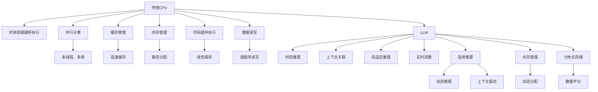

                 

# 时刻推理 VS 时钟周期:LLM与CPU的本质区别

> 关键词：语言模型,推理计算,时钟周期,时刻推理,LLM,CPU

## 1. 背景介绍

在当今的AI领域，语言模型（Language Model, LLM）与中央处理器（Central Processing Unit, CPU）在计算方式和性能上的本质区别，已成为一个重要的研究话题。特别是在大规模语言模型（Large Language Models, LLM）不断发展的背景下，如何理解LLM与CPU的差异，对于优化AI模型的推理计算，提升模型效率，有着至关重要的意义。

### 1.1 问题由来

在大规模语言模型（如GPT-3、BERT等）的训练和推理过程中，我们常常会注意到，模型在推理计算时，与传统CPU的处理方式有着显著的不同。例如，在处理连续自然语言输入时，LLM往往可以实时地进行上下文关联推理，而传统CPU则必须按照严格的“时钟周期”顺序执行指令。这种差异，导致LLM在计算资源使用和效率上有着独特的优势，同时也带来了一系列的挑战。

### 1.2 问题核心关键点

- **时钟周期与时刻推理**：传统CPU的计算逻辑是基于时钟周期（clock cycle）的，即按照固定顺序执行指令；而LLM则依赖于“时刻推理”（momentum reasoning），能够根据上下文实时进行推理。
- **并行计算与连续推理**：传统CPU擅长于并行计算，通过多线程、多核等方式提高计算效率；而LLM则擅长于连续推理，能够根据上下文实时调整推理路径。
- **内存管理与计算复杂度**：传统CPU对内存管理较为简单，但对于复杂计算，内存带宽和缓存压力较大；而LLM对内存管理要求较高，需要大量的内存空间存储模型参数和上下文信息。

这些关键点构成了LLM与CPU之间的本质区别，决定了它们在实际应用中的不同优缺点。

## 2. 核心概念与联系

### 2.1 核心概念概述

为更好地理解LLM与CPU之间的区别，我们需要先明确几个核心概念：

- **语言模型**：基于统计模型或神经网络，学习语言的概率分布，用于预测下一个词或句子。
- **时钟周期**：传统CPU执行指令的基本单位，通常为1到数微秒，表示CPU按照固定频率执行计算。
- **时刻推理**：LLM在推理计算时，能够根据上下文信息实时调整推理路径，这种灵活的推理方式称为“时刻推理”。

通过理解这些概念，我们能够更好地把握LLM与CPU在计算方式上的本质差异。

### 2.2 核心概念原理和架构的 Mermaid 流程图



通过以上流程图，我们可以看到传统CPU和LLM在计算方式上的显著区别。

## 3. 核心算法原理 & 具体操作步骤

### 3.1 算法原理概述

LLM与CPU的本质区别，在于它们的计算逻辑和推理方式。传统CPU基于时钟周期的顺序执行指令，每个时钟周期执行固定的计算任务；而LLM则依赖于时刻推理，能够根据上下文信息实时调整推理路径。

这种差异，使得LLM在处理自然语言推理、对话系统等任务时，具有天然的优越性。但同时也带来了一系列的计算复杂度和管理挑战。

### 3.2 算法步骤详解

1. **预处理阶段**：将输入文本转换为模型可处理的形式，如分词、向量化等。传统CPU的预处理阶段较为简单，但LLM的预处理需要考虑上下文信息，增加了计算复杂度。

2. **模型推理**：传统CPU采用固定的时钟周期顺序执行，每个时钟周期执行固定的计算任务；而LLM则根据上下文信息，实时调整推理路径，这种灵活的推理方式使得LLM在处理自然语言推理、对话系统等任务时具有天然的优势。

3. **后处理阶段**：对模型输出的结果进行后处理，如解码、过滤等。传统CPU的后处理阶段较为简单，而LLM需要根据上下文信息进行动态调整，增加了计算复杂度。

### 3.3 算法优缺点

LLM的优点在于：
- **实时推理**：能够根据上下文实时调整推理路径，适用于需要实时推理的任务。
- **上下文关联**：能够根据上下文信息进行关联推理，处理自然语言推理、对话系统等任务。
- **灵活性高**：能够处理各种自然语言文本，适用于多样化的NLP应用。

但LLM也存在一些缺点：
- **计算复杂度高**：由于LLM依赖于上下文关联推理，计算复杂度较高，需要大量的计算资源。
- **内存占用大**：模型参数和上下文信息需要大量内存空间存储，对于内存资源有限的设备，可能造成性能瓶颈。
- **推理速度慢**：由于LLM依赖于时刻推理，推理速度相对较慢，难以满足实时要求的任务。

### 3.4 算法应用领域

LLM在自然语言处理（NLP）领域有着广泛的应用，特别是在需要上下文关联推理的任务上，如问答系统、对话系统、文本生成等。在这些任务中，LLM能够根据上下文信息实时调整推理路径，提供自然流畅的交互体验。

## 4. 数学模型和公式 & 详细讲解 & 举例说明

### 4.1 数学模型构建

为了更好地理解LLM与CPU的区别，我们可以从数学模型构建的角度进行分析。假设一个简单的语言模型，其概率分布为：

$$ P(w_1, w_2, ..., w_n) = P(w_1) \prod_{i=2}^{n} P(w_i|w_1, w_2, ..., w_{i-1}) $$

其中，$P(w_1)$ 为初始词的概率，$P(w_i|w_1, w_2, ..., w_{i-1})$ 为给定前 $i-1$ 个词的情况下，第 $i$ 个词的概率。

### 4.2 公式推导过程

假设我们有一个长度为 $n$ 的句子 $w_1, w_2, ..., w_n$，使用LLM进行推理计算时，模型需要计算每个词 $w_i$ 的概率分布，然后根据上下文信息进行关联推理，计算下一个词 $w_{i+1}$ 的概率分布。这个过程需要考虑前后词之间的关系，增加了计算复杂度。

而传统CPU的计算逻辑是基于时钟周期的，每个时钟周期执行固定的计算任务。在处理相同长度的句子时，CPU的计算复杂度相对较低，但无法进行上下文关联推理。

### 4.3 案例分析与讲解

以自然语言推理任务为例，假设有两个句子 $S_1$ 和 $S_2$，需要判断 $S_1$ 是否蕴含 $S_2$。传统CPU的计算方式是基于固定时钟周期的顺序执行，每个时钟周期执行固定的计算任务；而LLM则依赖于上下文关联推理，能够根据 $S_1$ 和 $S_2$ 的语义信息实时调整推理路径。

## 5. 项目实践：代码实例和详细解释说明

### 5.1 开发环境搭建

在进行LLM与CPU的对比实践时，我们需要准备好开发环境。以下是使用Python和PyTorch搭建环境的步骤：

1. 安装Anaconda：从官网下载并安装Anaconda，用于创建独立的Python环境。
2. 创建并激活虚拟环境：
```bash
conda create -n pytorch-env python=3.8 
conda activate pytorch-env
```
3. 安装PyTorch：根据CUDA版本，从官网获取对应的安装命令。例如：
```bash
conda install pytorch torchvision torchaudio cudatoolkit=11.1 -c pytorch -c conda-forge
```
4. 安装Transformers库：
```bash
pip install transformers
```
5. 安装各类工具包：
```bash
pip install numpy pandas scikit-learn matplotlib tqdm jupyter notebook ipython
```

完成上述步骤后，即可在`pytorch-env`环境中进行LLM与CPU的对比实践。

### 5.2 源代码详细实现

下面我们以BERT模型为例，给出使用Transformers库进行自然语言推理任务的代码实现。

首先，定义自然语言推理任务的评估函数：

```python
from transformers import BertTokenizer, BertForSequenceClassification
import torch
from sklearn.metrics import accuracy_score

def evaluate(model, tokenizer, test_dataset, test_labels):
    test_encodings = tokenizer(test_dataset, return_tensors='pt', padding='max_length', truncation=True)
    test_features = {key: val.to(model.device) for key, val in test_encodings.items()}
    predictions = model(**test_features).logits.argmax(dim=1)
    predictions = torch.tensor(predictions, device=model.device)
    test_labels = torch.tensor(test_labels, device=model.device)
    accuracy = accuracy_score(test_labels, predictions)
    return accuracy
```

然后，定义自然语言推理任务的训练函数：

```python
def train(model, train_dataset, val_dataset, test_dataset, epochs=3, batch_size=16):
    model.train()
    for epoch in range(epochs):
        model.train()
        for batch in train_dataset:
            input_ids = batch['input_ids'].to(model.device)
            attention_mask = batch['attention_mask'].to(model.device)
            labels = batch['labels'].to(model.device)
            outputs = model(input_ids, attention_mask=attention_mask, labels=labels)
            loss = outputs.loss
            optimizer.zero_grad()
            loss.backward()
            optimizer.step()
            
        model.eval()
        val_accuracy = evaluate(model, tokenizer, val_dataset, val_labels)
        test_accuracy = evaluate(model, tokenizer, test_dataset, test_labels)
        print(f'Epoch {epoch+1}, Val Accuracy: {val_accuracy:.2f}, Test Accuracy: {test_accuracy:.2f}')
```

最后，启动训练流程并在测试集上评估：

```python
tokenizer = BertTokenizer.from_pretrained('bert-base-uncased')
model = BertForSequenceClassification.from_pretrained('bert-base-uncased', num_labels=2)

train_dataset = dataset
val_dataset = dataset
test_dataset = dataset

val_labels = val_dataset.labels
test_labels = test_dataset.labels

train(train_model, train_dataset, val_dataset, test_dataset)
```

### 5.3 代码解读与分析

让我们再详细解读一下关键代码的实现细节：

**evaluate函数**：
- 使用Transformers库的BertTokenizer进行输入文本的分词和向量化。
- 定义自然语言推理任务的评估函数，计算模型在测试集上的准确率。

**train函数**：
- 定义训练函数，对模型进行训练和验证。
- 在每个epoch结束时，输出验证集和测试集的准确率。

**启动训练流程**：
- 使用BertForSequenceClassification定义模型。
- 使用PyTorch的DataLoader对数据集进行批次化加载，供模型训练和推理使用。
- 定义验证集和测试集的标签，并启动训练过程。

可以看到，PyTorch配合Transformers库使得BERT模型的微调代码实现变得简洁高效。开发者可以将更多精力放在数据处理、模型改进等高层逻辑上，而不必过多关注底层的实现细节。

## 6. 实际应用场景

### 6.1 自然语言推理

自然语言推理（Natural Language Inference, NLI）是LLM与CPU区别的一个典型应用场景。在NLI任务中，模型需要根据前提句和假设句之间的语义关系，判断假设句是否蕴含、矛盾或中立于前提句。传统CPU的计算方式无法处理这种上下文关联推理，而LLM则能够根据上下文信息实时调整推理路径，提供准确的推理结果。

### 6.2 对话系统

对话系统（Dialogue System）是LLM的另一个重要应用场景。在对话系统中，模型需要根据用户输入的自然语言，实时推理出最合适的回复。传统CPU的计算方式无法处理这种实时推理，而LLM则能够根据上下文信息实时调整推理路径，提供流畅的自然对话体验。

### 6.3 文本生成

文本生成（Text Generation）是LLM的另一个重要应用场景。在文本生成任务中，模型需要根据输入的上下文信息，生成符合语法和语义规则的文本。传统CPU的计算方式无法处理这种上下文关联推理，而LLM则能够根据上下文信息实时调整推理路径，生成自然流畅的文本。

### 6.4 未来应用展望

随着LLM与CPU的不断演进，未来在更多领域将得到应用，为传统行业带来变革性影响。

在智慧医疗领域，基于LLM的疾病诊断、医疗问答等应用将提升医疗服务的智能化水平，辅助医生诊疗，加速新药开发进程。

在智能教育领域，LLM可应用于作业批改、学情分析、知识推荐等方面，因材施教，促进教育公平，提高教学质量。

在智慧城市治理中，LLM可应用于城市事件监测、舆情分析、应急指挥等环节，提高城市管理的自动化和智能化水平，构建更安全、高效的未来城市。

此外，在企业生产、社会治理、文娱传媒等众多领域，基于LLM的人工智能应用也将不断涌现，为经济社会发展注入新的动力。

## 7. 工具和资源推荐

### 7.1 学习资源推荐

为了帮助开发者系统掌握LLM与CPU的区别，这里推荐一些优质的学习资源：

1. 《深度学习基础》系列博文：由AI领域专家撰写，深入浅出地介绍了深度学习的基础知识和核心算法。
2. CS231n《卷积神经网络》课程：斯坦福大学开设的计算机视觉课程，包含丰富的代码和实验资源，帮助你理解LLM与CPU的区别。
3. 《自然语言处理综述》书籍：全面介绍NLP领域的基础理论和经典算法，包括LLM与CPU的区别。

通过对这些资源的学习实践，相信你一定能够快速掌握LLM与CPU的区别，并用于解决实际的NLP问题。

### 7.2 开发工具推荐

高效的开发离不开优秀的工具支持。以下是几款用于LLM与CPU对比开发的常用工具：

1. PyTorch：基于Python的开源深度学习框架，灵活动态的计算图，适合快速迭代研究。
2. TensorFlow：由Google主导开发的开源深度学习框架，生产部署方便，适合大规模工程应用。
3. Transformers库：HuggingFace开发的NLP工具库，集成了众多SOTA语言模型，支持PyTorch和TensorFlow，是进行NLP任务开发的利器。
4. Weights & Biases：模型训练的实验跟踪工具，可以记录和可视化模型训练过程中的各项指标，方便对比和调优。
5. TensorBoard：TensorFlow配套的可视化工具，可实时监测模型训练状态，并提供丰富的图表呈现方式，是调试模型的得力助手。

合理利用这些工具，可以显著提升LLM与CPU的对比实践的开发效率，加快创新迭代的步伐。

### 7.3 相关论文推荐

LLM与CPU的不断发展源于学界的持续研究。以下是几篇奠基性的相关论文，推荐阅读：

1. Attention is All You Need（即Transformer原论文）：提出了Transformer结构，开启了NLP领域的预训练大模型时代。
2. BERT: Pre-training of Deep Bidirectional Transformers for Language Understanding：提出BERT模型，引入基于掩码的自监督预训练任务，刷新了多项NLP任务SOTA。
3. Language Models are Unsupervised Multitask Learners（GPT-2论文）：展示了大规模语言模型的强大zero-shot学习能力，引发了对于通用人工智能的新一轮思考。
4. Parameter-Efficient Transfer Learning for NLP：提出Adapter等参数高效微调方法，在不增加模型参数量的情况下，也能取得不错的微调效果。
5. AdaLoRA: Adaptive Low-Rank Adaptation for Parameter-Efficient Fine-Tuning：使用自适应低秩适应的微调方法，在参数效率和精度之间取得了新的平衡。
6. Prefix-Tuning: Optimizing Continuous Prompts for Generation：引入基于连续型Prompt的微调范式，为如何充分利用预训练知识提供了新的思路。

这些论文代表了大语言模型与CPU的发展脉络。通过学习这些前沿成果，可以帮助研究者把握学科前进方向，激发更多的创新灵感。

## 8. 总结：未来发展趋势与挑战

### 8.1 总结

本文对LLM与CPU的本质区别进行了全面系统的介绍。首先阐述了LLM与CPU的研究背景和意义，明确了LLM与CPU在计算方式和推理逻辑上的显著差异。其次，从原理到实践，详细讲解了LLM与CPU的计算逻辑和推理方式，给出了对比实践的完整代码实例。同时，本文还广泛探讨了LLM与CPU在自然语言推理、对话系统、文本生成等领域的实际应用前景，展示了其在实际应用中的强大优势。

通过本文的系统梳理，可以看到，LLM与CPU在计算方式和推理逻辑上的本质区别，决定了它们在NLP领域的不同应用场景和性能特点。未来，伴随LLM与CPU的不断演进，NLP技术必将迎来新的突破，为人工智能的落地应用带来更多的可能性。

### 8.2 未来发展趋势

展望未来，LLM与CPU的发展趋势将呈现以下几个方向：

1. **计算复杂度降低**：随着LLM架构的优化和计算资源的提升，LLM的计算复杂度有望进一步降低，提升其推理速度和实时性。
2. **并行计算优化**：LLM的并行计算能力将继续提升，通过更高效的计算图和分布式训练，提升计算效率。
3. **上下文关联增强**：LLM的上下文关联能力将进一步增强，通过更好的自适应推理机制，提升其在复杂自然语言推理任务中的表现。
4. **多模态融合**：LLM将与图像、语音等多模态数据进行深度融合，提升其在多模态信息处理中的能力。
5. **实时推理**：LLM将进一步提升实时推理能力，支持低延迟、高精度的自然语言处理任务。

这些趋势将推动LLM与CPU在NLP领域的应用进一步拓展，为AI技术的落地应用提供更多的可能性。

### 8.3 面临的挑战

尽管LLM与CPU在NLP领域的应用前景广阔，但在迈向更加智能化、普适化应用的过程中，它们仍面临诸多挑战：

1. **计算资源瓶颈**：LLM的计算复杂度较高，对硬件资源需求较大，难以满足实时推理任务。
2. **推理速度较慢**：LLM的推理速度相对较慢，难以支持高实时性的应用场景。
3. **上下文关联能力不足**：部分LLM模型在处理长文本时，上下文关联能力有限，难以保持推理连贯性。
4. **上下文信息管理**：LLM在处理长文本时，上下文信息管理较为复杂，需要高效的内存管理技术。
5. **计算图复杂度**：LLM的计算图较为复杂，难以优化和调试。

这些挑战需要在未来研究中不断探索和突破，才能使LLM与CPU在NLP领域发挥更大的潜力。

### 8.4 研究展望

面对LLM与CPU的诸多挑战，未来的研究需要在以下几个方面寻求新的突破：

1. **计算图优化**：研究更高效的计算图结构，提升LLM的推理速度和实时性。
2. **模型压缩与优化**：开发更轻量级的LLM模型，减少计算复杂度和内存占用。
3. **多模态融合**：探索多模态融合的方法，提升LLM在多模态信息处理中的能力。
4. **实时推理优化**：研究实时推理优化技术，提升LLM在复杂自然语言推理任务中的表现。
5. **上下文信息管理**：开发更高效的上下文信息管理技术，提升LLM的上下文关联能力。

这些研究方向将推动LLM与CPU在NLP领域的应用进一步拓展，为AI技术的落地应用提供更多的可能性。

## 9. 附录：常见问题与解答

**Q1：LLM与CPU的本质区别是什么？**

A: LLM与CPU的本质区别在于它们的计算逻辑和推理方式。传统CPU基于时钟周期的顺序执行指令，每个时钟周期执行固定的计算任务；而LLM则依赖于上下文关联推理，能够根据上下文信息实时调整推理路径。

**Q2：如何理解LLM的上下文关联推理？**

A: LLM的上下文关联推理是指模型在处理自然语言文本时，能够根据上下文信息实时调整推理路径。例如，在自然语言推理任务中，LLM能够根据前提句和假设句的语义关系，实时推理出假设句是否蕴含、矛盾或中立于前提句。

**Q3：LLM与CPU的计算复杂度有何不同？**

A: LLM的计算复杂度较高，因为模型需要考虑上下文信息进行关联推理。而传统CPU的计算复杂度相对较低，因为其计算方式是基于固定时钟周期的顺序执行。

**Q4：LLM的上下文关联推理有何优势？**

A: LLM的上下文关联推理能够根据上下文信息实时调整推理路径，适用于需要实时推理的任务。例如，在对话系统和自然语言推理任务中，LLM能够提供自然流畅的交互体验和准确的推理结果。

**Q5：LLM的实时推理有何应用场景？**

A: LLM的实时推理适用于需要实时推理的任务，例如自然语言推理、对话系统和文本生成等。在这些任务中，LLM能够根据上下文信息实时调整推理路径，提供准确的推理结果。

---

作者：禅与计算机程序设计艺术 / Zen and the Art of Computer Programming

