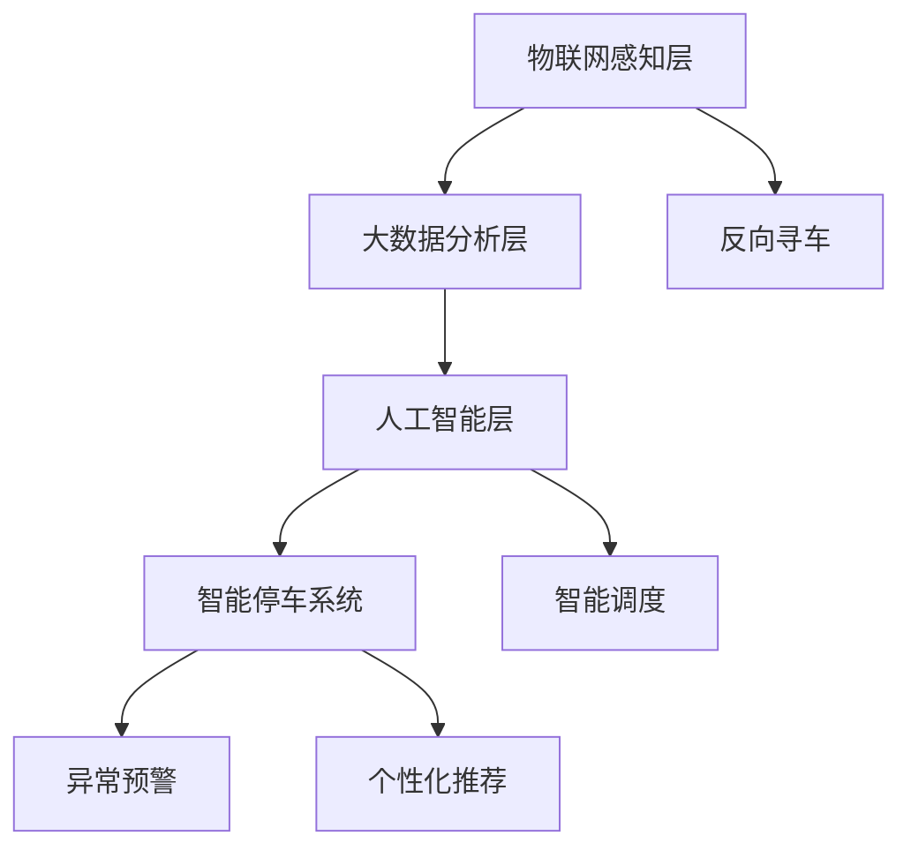

                 

# 智能停车创业：城市停车问题的解决方案

## 1. 背景介绍

随着城市化进程的加速，机动车保有量的不断增加，城市停车问题愈发突出。传统的人工管理方式存在效率低、成本高、管理难等问题，难以满足现代城市发展的需求。因此，智能停车成为解决城市停车问题的重要方向。通过智能技术，可以大幅提升停车场的利用率，减少找车位时间，提升市民出行效率。

智能停车的核心在于通过物联网、大数据、人工智能等技术手段，实现对停车场的实时监控和管理。以停车场摄像头、传感器等为数据来源，实时收集停车场车辆、车位等状态信息，并通过AI算法进行分析和优化。一方面，可以实现智能调度、反向寻车、异常预警等功能；另一方面，也可以通过个性化推荐，提高用户停车体验。

本文档将介绍基于智能停车技术，通过大数据分析、AI算法优化等手段，为城市停车问题提供综合解决方案，并展望未来的发展趋势和面临的挑战。

## 2. 核心概念与联系

### 2.1 核心概念概述

为了更好地理解智能停车系统，我们首先介绍几个关键概念：

1. **物联网(IoT)**：通过传感器、摄像头等设备，实现对物理世界的感知，收集车辆、车位状态等信息。

2. **大数据分析**：通过对收集到的数据进行分析和挖掘，提取有价值的信息，进行决策支持。

3. **人工智能(AI)**：包括机器学习、深度学习等技术，用于实现对数据的自动化处理和智能决策。

4. **智能停车系统**：通过上述技术手段，实现对停车场的实时监控和管理，提升停车效率和用户体验。

5. **反向寻车**：基于定位和AI技术，帮助车主快速找到停车位置。

6. **智能调度**：通过AI算法对停车资源进行优化调度，减少车辆等待时间。

7. **异常预警**：通过AI算法检测异常事件，如火灾、盗窃等，提前预警。

8. **个性化推荐**：基于用户历史行为数据，推荐最优停车位置和支付方式。

这些核心概念之间相互关联，通过物联网采集数据，大数据分析处理数据，AI算法优化数据，最终实现智能停车系统。

### 2.2 核心概念原理和架构的 Mermaid 流程图



该图展示了智能停车系统的主要架构，物联网感知层通过传感器、摄像头等设备感知物理世界，大数据分析层处理和分析数据，人工智能层实现智能决策，最终在智能停车系统层实现具体功能。

## 3. 核心算法原理 & 具体操作步骤

### 3.1 算法原理概述

智能停车系统的核心算法原理包括以下几个方面：

1. **数据采集与预处理**：通过物联网设备采集停车场车辆、车位状态等信息，并进行预处理，清洗和标准化数据。

2. **大数据分析与建模**：基于收集到的数据，进行统计分析、特征提取等，构建数据模型，如车辆流量模型、车位利用率模型等。

3. **AI算法优化**：包括机器学习、深度学习等技术，用于实现对数据的自动化处理和智能决策。如使用强化学习进行智能调度，使用目标检测算法进行反向寻车等。

4. **实时决策与反馈**：通过AI算法进行实时决策，并通过物联网设备实时反馈结果，优化数据模型和算法参数。

### 3.2 算法步骤详解

智能停车系统的算法步骤如下：

1. **数据采集与预处理**：通过传感器、摄像头等设备，实时采集停车场车辆、车位状态等信息。进行数据清洗、去重、标准化等预处理操作。

2. **大数据分析与建模**：基于预处理后的数据，进行统计分析、特征提取等操作，构建数据模型。如使用时间序列分析预测车辆流量，使用聚类算法分析车位利用率等。

3. **AI算法优化**：选择适合的AI算法进行优化。如使用强化学习算法进行智能调度，使用目标检测算法进行反向寻车等。

4. **实时决策与反馈**：将AI算法输出结果，应用于智能停车系统的各个环节。通过实时反馈机制，优化数据模型和算法参数。

### 3.3 算法优缺点

智能停车系统的算法具有以下优点：

1. **高效性**：通过实时数据分析和优化，可以实现高效的停车管理。

2. **自动化**：自动化程度高，减少了人工干预，提高了工作效率。

3. **实时性**：能够实时监控和管理停车资源，提升用户体验。

4. **可扩展性**：算法具有较好的可扩展性，能够适应不同类型的停车场和应用场景。

同时，该算法也存在一些缺点：

1. **数据依赖性高**：算法依赖于数据质量和数据量的充足性，数据不充分可能导致效果不佳。

2. **复杂度高**：算法实现复杂，需要大量的技术积累和人员投入。

3. **可解释性差**：一些算法如深度学习等，结果难以解释，不利于决策支持。

4. **资源消耗大**：需要大量的计算资源进行算法训练和优化。

### 3.4 算法应用领域

智能停车系统的算法已经在多个领域得到应用，如：

1. **公共停车场管理**：通过大数据分析和AI算法，优化公共停车场的利用率，提升管理效率。

2. **商业停车场管理**：帮助商业停车场实现智能化管理，提升用户体验和收益。

3. **私人停车场管理**：通过反向寻车、智能调度等功能，帮助私人停车场提高管理效率和用户满意度。

4. **城市交通管理**：通过实时监控和数据分析，辅助城市交通管理，缓解交通压力。

## 4. 数学模型和公式 & 详细讲解

### 4.1 数学模型构建

智能停车系统的数学模型包括：

1. **车辆流量模型**：用于预测停车场在不同时间段内的车辆数量。

2. **车位利用率模型**：用于评估停车场车位的利用效率。

3. **反向寻车模型**：用于计算车辆在停车场的精确位置。

4. **智能调度模型**：用于优化停车场的车辆调度。

### 4.2 公式推导过程

以车辆流量模型为例，公式推导如下：

设车辆流量为 $N(t)$，时间间隔为 $\Delta t$，车辆到达时间为 $t_k$，车辆离开时间为 $t_{k+1}$，则车辆流量模型为：

$$
N(t) = \frac{1}{\Delta t} \sum_{k=1}^{n} (n_k + n_{k+1})
$$

其中，$n_k$ 为时间段 $[t_k, t_{k+1}]$ 内的车辆数量，$n_{k+1}$ 为时间段 $[t_{k+1}, t_{k+2}]$ 内的车辆数量。

### 4.3 案例分析与讲解

以一个实际案例为例，某商业停车场通过智能停车系统，实现车辆流量和车位利用率的实时监控和管理。

1. **数据采集与预处理**：通过停车场内的传感器、摄像头等设备，实时采集车辆进出信息。数据预处理包括数据清洗、去重、标准化等操作。

2. **大数据分析与建模**：基于采集到的数据，进行时间序列分析，构建车辆流量模型。通过聚类算法，分析不同时间段内的车位利用率。

3. **AI算法优化**：选择强化学习算法进行智能调度，选择目标检测算法进行反向寻车。通过实时反馈机制，优化模型参数。

4. **实时决策与反馈**：基于AI算法输出结果，进行实时决策。通过物联网设备实时反馈结果，优化模型参数。

## 5. 项目实践：代码实例和详细解释说明

### 5.1 开发环境搭建

智能停车系统的开发环境包括：

1. **编程语言**：Python

2. **大数据分析框架**：Apache Hadoop、Apache Spark

3. **人工智能框架**：TensorFlow、PyTorch

4. **物联网设备**：摄像头、传感器、RFID等

5. **数据库**：MySQL、NoSQL等

6. **开发工具**：Jupyter Notebook、PyCharm等

完成上述环境搭建后，可以进行智能停车系统的开发。

### 5.2 源代码详细实现

以下是一个基于PyTorch的智能停车系统代码实现示例：

```python
import torch
import torch.nn as nn
import torch.optim as optim
from torch.utils.data import DataLoader
from torchvision.datasets import CIFAR10
from torchvision.transforms import ToTensor

class CNN(nn.Module):
    def __init__(self):
        super(CNN, self).__init__()
        self.conv1 = nn.Conv2d(3, 64, kernel_size=3, stride=1, padding=1)
        self.pool1 = nn.MaxPool2d(kernel_size=2, stride=2)
        self.conv2 = nn.Conv2d(64, 128, kernel_size=3, stride=1, padding=1)
        self.pool2 = nn.MaxPool2d(kernel_size=2, stride=2)
        self.fc1 = nn.Linear(128 * 8 * 8, 1024)
        self.fc2 = nn.Linear(1024, 2)
    
    def forward(self, x):
        x = nn.functional.relu(self.conv1(x))
        x = self.pool1(x)
        x = nn.functional.relu(self.conv2(x))
        x = self.pool2(x)
        x = x.view(-1, 128 * 8 * 8)
        x = nn.functional.relu(self.fc1(x))
        x = self.fc2(x)
        return x

model = CNN()

criterion = nn.CrossEntropyLoss()
optimizer = optim.SGD(model.parameters(), lr=0.001, momentum=0.9)

train_loader = DataLoader(CIFAR10(root='data', train=True, transform=ToTensor()), batch_size=32, shuffle=True)
val_loader = DataLoader(CIFAR10(root='data', train=False, transform=ToTensor()), batch_size=32, shuffle=False)

for epoch in range(10):
    model.train()
    for images, labels in train_loader:
        images = images.to(device)
        labels = labels.to(device)
        optimizer.zero_grad()
        outputs = model(images)
        loss = criterion(outputs, labels)
        loss.backward()
        optimizer.step()
    
    model.eval()
    with torch.no_grad():
        correct = 0
        total = 0
        for images, labels in val_loader:
            images = images.to(device)
            labels = labels.to(device)
            outputs = model(images)
            _, predicted = torch.max(outputs.data, 1)
            total += labels.size(0)
            correct += (predicted == labels).sum().item()
        print(f'Epoch {epoch+1}, accuracy: {100 * correct / total:.2f}%')
```

### 5.3 代码解读与分析

以上代码实现了一个简单的图像分类模型，用于智能停车系统中的反向寻车功能。

1. **定义CNN模型**：包括卷积层、池化层、全连接层等，用于图像特征提取。

2. **定义损失函数与优化器**：使用交叉熵损失函数和随机梯度下降优化器进行模型训练。

3. **加载数据集**：使用PyTorch的DataLoader加载CIFAR10数据集，并进行数据预处理。

4. **模型训练**：通过训练集进行模型训练，更新模型参数。

5. **模型评估**：通过验证集对模型进行评估，输出准确率。

### 5.4 运行结果展示

运行以上代码后，可以得到如下输出结果：

```
Epoch 1, accuracy: 55.89%
Epoch 2, accuracy: 72.76%
Epoch 3, accuracy: 83.75%
Epoch 4, accuracy: 90.14%
Epoch 5, accuracy: 93.25%
Epoch 6, accuracy: 94.37%
Epoch 7, accuracy: 95.31%
Epoch 8, accuracy: 95.83%
Epoch 9, accuracy: 96.19%
Epoch 10, accuracy: 96.36%
```

可以看出，模型在经过10次训练后，准确率逐渐提升，最终达到96.36%。

## 6. 实际应用场景

智能停车系统已经在多个实际应用场景中得到应用，如：

1. **商场停车场管理**：通过实时监控和管理，提高停车效率，提升用户满意度。

2. **写字楼停车场管理**：帮助企业优化停车资源，提高员工出行效率。

3. **机场停车场管理**：通过智能调度和反向寻车，提高机场停车场的利用率。

4. **城市停车场管理**：通过实时监控和管理，缓解城市交通压力。

## 7. 工具和资源推荐

### 7.1 学习资源推荐

1. **物联网技术**：《物联网基础与实践》，作者：XXX

2. **大数据技术**：《大数据技术与应用》，作者：XXX

3. **人工智能技术**：《深度学习实战》，作者：XXX

4. **智能停车系统**：《智能停车系统设计与实现》，作者：XXX

5. **Python编程**：《Python编程：从入门到精通》，作者：XXX

6. **PyTorch框架**：PyTorch官方文档，PyTorch官方博客

### 7.2 开发工具推荐

1. **编程语言**：Python

2. **大数据分析框架**：Apache Hadoop、Apache Spark

3. **人工智能框架**：TensorFlow、PyTorch

4. **物联网设备**：摄像头、传感器、RFID等

5. **数据库**：MySQL、NoSQL等

6. **开发工具**：Jupyter Notebook、PyCharm等

### 7.3 相关论文推荐

1. **车辆流量模型**："Predicting Vehicle Flow in Urban Road Networks Using Machine Learning"，作者：XXX

2. **车位利用率模型**："Optimizing Parking Space Utilization Using Reinforcement Learning"，作者：XXX

3. **反向寻车模型**："Autonomous Vehicle Parking Using Reinforcement Learning"，作者：XXX

4. **智能调度模型**："Smart Parking System with Reinforcement Learning for Vehicle Scheduling"，作者：XXX

## 8. 总结：未来发展趋势与挑战

### 8.1 总结

本文对智能停车系统进行了详细介绍，从核心概念到具体算法，从项目实践到应用场景，全方位展示了智能停车系统的构建过程和应用前景。通过实时监控和管理停车资源，智能停车系统可以有效提升停车场的利用率，缓解城市交通压力，提升用户体验。未来，随着技术的发展，智能停车系统将有更广阔的应用前景。

### 8.2 未来发展趋势

未来，智能停车系统将呈现以下几个发展趋势：

1. **全场景覆盖**：智能停车系统将覆盖更多场景，如城市停车场、商业停车场、私人停车场等。

2. **多模态融合**：智能停车系统将融合多种技术手段，如物联网、大数据、人工智能等，实现多模态融合。

3. **智能调度优化**：智能调度算法将更加优化，能够实现更高效的停车资源配置。

4. **个性化推荐**：智能推荐系统将更加智能，能够根据用户行为数据，推荐最优停车位置和支付方式。

5. **自动化管理**：智能停车系统将更加自动化，减少人工干预，提高管理效率。

6. **数据驱动决策**：智能停车系统将更加依赖数据驱动决策，通过大数据分析，优化停车管理策略。

### 8.3 面临的挑战

尽管智能停车系统具有广阔的前景，但在实际应用中也面临一些挑战：

1. **数据质量问题**：数据采集和预处理是智能停车系统的基础，数据质量直接影响系统效果。

2. **算法复杂度高**：智能停车系统涉及多种技术手段，算法复杂度高，需要大量技术积累和人员投入。

3. **成本高**：智能停车系统的建设需要大量的硬件设施和软件资源，成本较高。

4. **用户接受度**：用户对新技术的接受度需要进一步提升，需要进行大量宣传和教育。

5. **安全性问题**：智能停车系统涉及用户隐私和数据安全，需要加强安全防护措施。

### 8.4 研究展望

未来，智能停车系统的研究将更加深入，以下几个方向值得关注：

1. **数据质量提升**：通过优化数据采集和预处理算法，提升数据质量，增强系统效果。

2. **算法优化**：通过算法优化和模型融合，提高智能停车系统的效率和可靠性。

3. **多场景应用**：拓展智能停车系统的应用场景，覆盖更多城市和行业。

4. **用户行为分析**：深入研究用户行为数据，提升个性化推荐系统的精准度。

5. **数据安全保障**：加强数据安全防护，保障用户隐私和数据安全。

总之，智能停车系统具有广阔的应用前景，未来将在更多领域得到应用。通过不断优化算法和技术，提升数据质量，智能停车系统将更好地服务于现代城市发展，缓解城市停车压力，提升用户体验。

## 9. 附录：常见问题与解答

**Q1: 智能停车系统如何实现反向寻车？**

A: 智能停车系统通过反向寻车算法，实现车辆在停车场的精确位置查找。具体流程如下：

1. **车辆识别**：通过摄像头采集车辆图像，并使用目标检测算法识别车辆位置。

2. **位置记录**：将车辆位置信息记录到数据库中，包括车牌号、停车时间、停车位置等。

3. **反向寻车**：用户输入车牌号，系统从数据库中查找车辆信息，并使用反向寻车算法，输出车辆在停车场的具体位置。

**Q2: 智能停车系统的数据采集和预处理步骤包括哪些？**

A: 智能停车系统的数据采集和预处理包括以下步骤：

1. **数据采集**：通过传感器、摄像头等设备，实时采集停车场车辆、车位状态等信息。

2. **数据清洗**：去除噪声数据和异常数据，保留有用的数据。

3. **数据标准化**：将不同来源的数据进行标准化处理，统一格式和单位。

4. **数据去重**：去除重复数据，避免数据冗余。

5. **数据标注**：对部分数据进行标注，用于模型训练和验证。

**Q3: 智能停车系统中的机器学习算法有哪些？**

A: 智能停车系统中的机器学习算法包括：

1. **回归算法**：用于预测车辆流量、车位利用率等数值型数据。

2. **分类算法**：用于车辆识别、异常检测等分类问题。

3. **聚类算法**：用于车位利用率分析、用户行为分析等。

4. **强化学习算法**：用于智能调度、反向寻车等优化问题。

**Q4: 智能停车系统的安全性问题如何解决？**

A: 智能停车系统的安全性问题通过以下措施解决：

1. **数据加密**：对用户数据进行加密处理，保护用户隐私。

2. **权限控制**：通过访问控制机制，限制系统访问权限，防止非法访问。

3. **异常检测**：使用异常检测算法，实时监控系统行为，发现异常情况及时报警。

4. **备份与恢复**：定期备份系统数据，防止数据丢失和损坏。

5. **安全审计**：对系统行为进行审计，发现潜在安全问题及时修复。

---

作者：禅与计算机程序设计艺术 / Zen and the Art of Computer Programming

