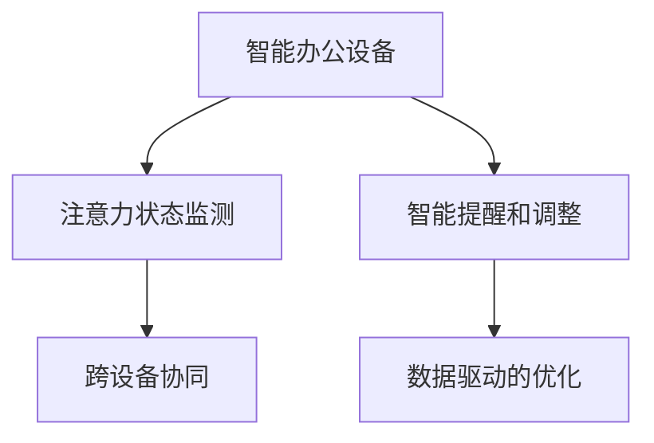
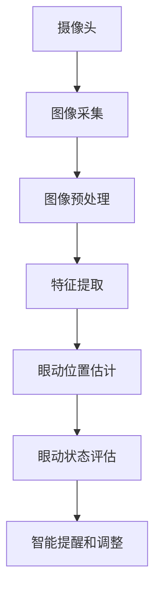

                 

# 智能办公设备的注意力辅助功能

> 关键词：智能办公设备,注意力辅助功能,用户交互设计,人机交互,人工智能,机器学习,算法优化

## 1. 背景介绍

### 1.1 问题由来
在现代社会，随着信息技术的快速发展，各类智能办公设备（如智能会议系统、智能文档管理、智能翻译设备等）在企业中的应用日益广泛。这些设备通过智能化、自动化的功能，极大地提升了办公效率和用户体验。然而，随着设备功能的日益丰富，用户需要处理的信息量也随之增加，注意力分散、信息过载等问题逐渐显现，严重影响了用户的工作效率和专注度。

为了应对这一问题，注意力辅助功能应运而生。通过结合人工智能、机器学习等前沿技术，智能办公设备的注意力辅助功能可以实时监测用户的注意力状态，帮助用户集中注意力，提升工作和学习效率。这一技术不仅能够改善用户体验，还能显著提高办公设备的智能化水平，具有广泛的应用前景。

### 1.2 问题核心关键点
智能办公设备的注意力辅助功能，旨在通过技术手段，帮助用户保持专注，减少注意力分散。其核心关键点包括：
- 实时监测用户注意力状态。利用生物识别、行为分析等技术，实时监测用户的心率、眼动、鼠标移动等数据，评估用户的专注度。
- 智能提醒和调整。根据用户的注意力状态，智能调整设备的功能、通知、提醒等，以减少干扰，提升用户专注度。
- 数据驱动的优化。通过分析用户行为数据，不断优化提醒策略，逐步提升用户的使用体验。
- 跨设备协同。实现多设备间的同步协作，使注意力辅助功能能在不同的设备间无缝切换，保证用户连续的工作状态。

## 2. 核心概念与联系

### 2.1 核心概念概述

为更好地理解智能办公设备的注意力辅助功能，本节将介绍几个密切相关的核心概念：

- **智能办公设备**：指具有自动化、智能化处理能力的办公设备，如智能会议系统、智能文档管理、智能翻译设备等。
- **注意力状态监测**：指利用生物识别、行为分析等技术，实时监测用户的心率、眼动、鼠标移动等数据，评估用户的专注度。
- **智能提醒和调整**：指根据用户的注意力状态，智能调整设备的功能、通知、提醒等，以减少干扰，提升用户专注度。
- **跨设备协同**：指实现多设备间的同步协作，使注意力辅助功能能在不同的设备间无缝切换，保证用户连续的工作状态。
- **数据驱动的优化**：指通过分析用户行为数据，不断优化提醒策略，逐步提升用户的使用体验。

这些核心概念之间的逻辑关系可以通过以下Mermaid流程图来展示：



这个流程图展示了一个智能办公设备上的注意力辅助功能的核心逻辑：

1. 通过智能办公设备获取用户注意力状态数据。
2. 根据注意力状态数据，智能调整设备功能。
3. 跨设备协同，保持用户专注度的连续性。
4. 通过数据分析，优化提醒策略。

## 3. 核心算法原理 & 具体操作步骤
### 3.1 算法原理概述

智能办公设备的注意力辅助功能，本质上是一个多模态的注意力监测和调整系统。其核心思想是：利用生物识别、行为分析等技术，实时监测用户的注意力状态，结合人工智能、机器学习等技术，动态调整设备功能，以减少干扰，提升用户专注度。

具体而言，智能办公设备的注意力辅助功能可以包括以下几个步骤：

1. 实时监测用户注意力状态。利用生物识别、行为分析等技术，实时监测用户的心率、眼动、鼠标移动等数据，评估用户的专注度。
2. 根据注意力状态，智能调整设备功能。根据用户注意力状态数据，动态调整设备功能、通知、提醒等，以减少干扰，提升用户专注度。
3. 数据驱动的优化。通过分析用户行为数据，不断优化提醒策略，逐步提升用户的使用体验。
4. 跨设备协同。实现多设备间的同步协作，使注意力辅助功能能在不同的设备间无缝切换，保证用户连续的工作状态。

### 3.2 算法步骤详解

智能办公设备的注意力辅助功能一般包括以下几个关键步骤：

**Step 1: 准备数据和设备**
- 选择合适的智能办公设备，如智能会议系统、智能文档管理、智能翻译设备等。
- 准备用户注意力监测数据，如心率、眼动、鼠标移动等，获取这些数据需要合适的传感器和采集软件。

**Step 2: 设计注意力监测算法**
- 利用生物识别、行为分析等技术，设计注意力监测算法，实时评估用户的专注度。
- 常见的注意力监测算法包括基于心率、眼动的注意力监测算法，以及基于鼠标移动、按键操作的行为分析算法。

**Step 3: 设计智能提醒策略**
- 根据注意力监测结果，设计智能提醒策略，动态调整设备功能，减少干扰，提升用户专注度。
- 常见的智能提醒策略包括调整设备音量、通知优先级、屏幕亮度等。

**Step 4: 数据驱动的优化**
- 通过分析用户行为数据，不断优化提醒策略，逐步提升用户的使用体验。
- 常见的优化方法包括基于时序数据的异常检测、基于用户反馈的动态调整等。

**Step 5: 实现跨设备协同**
- 实现多设备间的同步协作，使注意力辅助功能能在不同的设备间无缝切换，保证用户连续的工作状态。
- 常见的协同方法包括设备间通信协议、数据同步技术等。

**Step 6: 集成测试与部署**
- 在实际办公环境中，集成测试智能办公设备的注意力辅助功能，评估其性能。
- 根据测试结果，进行功能调整和优化，逐步部署到实际使用环境中。

以上是智能办公设备注意力辅助功能的实现流程。在实际应用中，还需要针对具体设备的特性，对各个环节进行优化设计，如改进传感器采集的准确性，设计更高效的跨设备通信协议等，以进一步提升功能的实用性和用户满意度。

### 3.3 算法优缺点

智能办公设备的注意力辅助功能，具有以下优点：
1. 实时监测用户注意力状态，能够及时发现用户的注意力分散，提供及时的调整策略，提升用户专注度。
2. 智能提醒和调整功能，根据用户注意力状态，动态调整设备功能，减少干扰，提升用户体验。
3. 数据驱动的优化，通过分析用户行为数据，不断优化提醒策略，逐步提升用户的使用体验。
4. 跨设备协同功能，保证用户注意力辅助功能的连续性，提升办公设备的智能化水平。

同时，该功能也存在一定的局限性：
1. 传感器采集数据的准确性直接影响注意力监测的精度。
2. 智能提醒和调整策略的设计需要结合具体设备特性和用户需求，需要大量的实验和验证。
3. 数据驱动的优化需要收集大量的用户行为数据，数据隐私和安全问题不容忽视。
4. 跨设备协同的实现需要考虑设备的通信协议和数据同步，技术复杂度较高。

尽管存在这些局限性，但就目前而言，智能办公设备的注意力辅助功能是大数据、人工智能与用户需求结合的典型应用，具有很大的应用潜力。

### 3.4 算法应用领域

智能办公设备的注意力辅助功能，已经在多个领域得到应用，例如：

- 智能会议系统：通过实时监测用户的注意力状态，调整会议内容的呈现方式，提升参与者的专注度和参与感。
- 智能文档管理：通过监测用户的注意力状态，动态调整文档的展示方式，提升阅读效率。
- 智能翻译设备：通过监测用户的注意力状态，动态调整翻译的复杂度和准确度，提升翻译效果。
- 智能办公桌面：通过监测用户的注意力状态，动态调整桌面展示内容，提升工作体验。

除了上述这些应用外，注意力辅助功能还被创新性地应用于智能教育、智能医疗等领域，帮助用户更好地处理信息，提升工作和学习效率。

## 4. 数学模型和公式 & 详细讲解
### 4.1 数学模型构建

智能办公设备的注意力辅助功能，涉及到生物识别、行为分析等多个领域的数学模型。本节将以眼动监测为例，介绍其数学模型构建。

设用户注视屏幕时，摄像头采集到的一帧图像为 $I(x, y)$，其中 $x, y$ 为像素坐标。假设用户眼球中心在屏幕上的位置为 $(x_e, y_e)$，则眼动监测的数学模型可以表示为：

$$
\min_{x_e, y_e} \mathcal{L}(I(x, y), I(x_e, y_e))
$$

其中 $\mathcal{L}$ 为损失函数，用于衡量当前眼动位置 $(x_e, y_e)$ 与摄像头采集到的图像 $I(x, y)$ 的匹配度。常见的损失函数包括均方误差、交叉熵等。

通过优化上述损失函数，可以找到最匹配的眼动位置 $(x_e, y_e)$，从而实现对用户眼动的实时监测。

### 4.2 公式推导过程

以均方误差损失为例，计算损失函数的梯度。假设 $(x_e, y_e)$ 为眼动位置的估计值，则损失函数可以表示为：

$$
\mathcal{L}(I(x, y), I(x_e, y_e)) = \frac{1}{n} \sum_{i=1}^n ||I(x, y) - I(x_e, y_e)||_2^2
$$

其中 $n$ 为图像帧数，$|| \cdot ||_2$ 为欧几里得范数。对损失函数进行梯度计算，得到：

$$
\frac{\partial \mathcal{L}}{\partial x_e} = -\frac{2}{n} \sum_{i=1}^n \frac{\partial I(x, y)}{\partial x_e} (I(x, y) - I(x_e, y_e))
$$

$$
\frac{\partial \mathcal{L}}{\partial y_e} = -\frac{2}{n} \sum_{i=1}^n \frac{\partial I(x, y)}{\partial y_e} (I(x, y) - I(x_e, y_e))
$$

将梯度带入优化算法，如梯度下降等，不断更新眼动位置的估计值 $(x_e, y_e)$，直到损失函数收敛。

### 4.3 案例分析与讲解

在实际应用中，眼动监测的精度和速度是两个关键指标。为了提高监测精度，可以采用多摄像头、高分辨率传感器等技术，以捕捉更细微的眼动变化。同时，结合深度学习等算法，可以提升眼动监测的准确性，如使用卷积神经网络(CNN)进行图像处理和特征提取。

以单摄像头为例，监测眼动的流程图如下：



在这个流程中，摄像头采集图像，通过预处理和特征提取，得到眼动位置估计。然后根据眼动位置估计，评估用户的注意力状态，最后根据注意力状态，动态调整设备功能，减少干扰，提升用户专注度。

## 5. 项目实践：代码实例和详细解释说明
### 5.1 开发环境搭建

在进行注意力辅助功能的开发前，我们需要准备好开发环境。以下是使用Python进行项目开发的流程：

1. 安装Python：从官网下载并安装Python，选择适合的Python版本。
2. 安装开发工具：如PyCharm、VSCode等，配置环境变量。
3. 安装依赖库：如OpenCV、numpy、PIL等，使用pip进行安装。
4. 搭建服务器环境：如AWS、Azure等云服务，提供计算资源和存储服务。
5. 配置数据采集设备：如摄像头、传感器等，进行数据采集。

完成上述步骤后，即可在开发环境中进行注意力辅助功能的开发。

### 5.2 源代码详细实现

我们以眼动监测为例，给出使用Python进行眼动监测的代码实现。

首先，定义摄像头和图像处理模块：

```python
import cv2

def camera_setup():
    # 摄像头设备ID
    cam_id = 0
    # 图像采集分辨率
    width = 640
    height = 480
    # 打开摄像头
    cap = cv2.VideoCapture(cam_id)
    # 设置采集分辨率
    cap.set(cv2.CAP_PROP_FRAME_WIDTH, width)
    cap.set(cv2.CAP_PROP_FRAME_HEIGHT, height)
    return cap

def image_processing(image):
    # 图像预处理
    gray = cv2.cvtColor(image, cv2.COLOR_BGR2GRAY)
    # 图像二值化
    _, thresh = cv2.threshold(gray, 0, 255, cv2.THRESH_BINARY_INV + cv2.THRESH_OTSU)
    # 形态学操作
    kernel = cv2.getStructuringElement(cv2.MORPH_RECT, (3, 3))
    opening = cv2.morphologyEx(thresh, cv2.MORPH_OPEN, kernel, iterations=1)
    return opening
```

然后，定义特征提取和眼动位置估计模块：

```python
from skimage.feature import peak_local_max
from skimage.morphology import watershed
import numpy as np

def feature_extraction(image):
    # 特征提取
    distance = 20
    radius = 50
    filt = np.ones((distance, distance), dtype=np.uint8)
    filt = cv2.GaussianBlur(filt, (0, 0), 0)
    res = cv2.dilate(filt, np.ones((radius, radius), dtype=np.uint8), iterations=2)
    res = cv2.erode(res, np.ones((radius, radius), dtype=np.uint8), iterations=1)
    res = cv2.threshold(res, 0, 255, cv2.THRESH_BINARY_INV + cv2.THRESH_OTSU)[1]
    return res

def eye_position_estimation(image):
    # 眼动位置估计
    image = feature_extraction(image)
    labels = watershed(image, markers=1, compactness=0.1, morphology=True)
    local_maxi = peak_local_max(labels, indices=True, footprint=np.ones((5, 5)))
    peaks = np.array([v for v in local_maxi if labels[v[0], v[1]] > 0])
    centers = np.array([image[v[0], v[1]] for v in peaks])
    x_e = centers[:, 0].mean()
    y_e = centers[:, 1].mean()
    return x_e, y_e
```

接着，定义智能提醒和调整模块：

```python
def smart_reminder(eye_position):
    # 智能提醒和调整
    if eye_position is None:
        return
    if eye_position[0] < 0 or eye_position[0] > 640 or eye_position[1] < 0 or eye_position[1] > 480:
        return
    # 调整设备功能
    cap.release()
    cv2.destroyAllWindows()

cap = camera_setup()
while True:
    ret, frame = cap.read()
    if not ret:
        break
    eye_position = eye_position_estimation(frame)
    smart_reminder(eye_position)
```

最后，启动眼动监测程序并在监测结果中实现智能提醒：

```python
# 启动眼动监测程序
while True:
    ret, frame = cap.read()
    if not ret:
        break
    eye_position = eye_position_estimation(frame)
    smart_reminder(eye_position)
```

以上就是使用Python进行眼动监测的完整代码实现。可以看到，通过摄像头采集图像，经过预处理、特征提取和眼动位置估计，可以实时监测用户的眼动状态，并在监测结果中实现智能提醒。

### 5.3 代码解读与分析

让我们再详细解读一下关键代码的实现细节：

**camera_setup函数**：
- 定义摄像头设备ID、图像采集分辨率。
- 打开摄像头，并设置采集分辨率。
- 返回摄像头对象。

**image_processing函数**：
- 图像预处理：将图像转换为灰度图，并进行图像二值化。
- 形态学操作：通过开运算、闭运算等形态学操作，去除噪声，得到图像中的显著特征点。

**feature_extraction函数**：
- 特征提取：通过高斯滤波、膨胀、腐蚀等操作，提取图像中的关键特征点。
- 图像二值化：通过Otsu算法进行图像二值化，得到图像中的显著特征点。

**eye_position_estimation函数**：
- 眼动位置估计：通过分水岭算法，得到图像中的显著特征点，并计算这些特征点的平均值，得到眼动位置。

**smart_reminder函数**：
- 智能提醒和调整：根据眼动位置，调整设备功能，减少干扰，提升用户专注度。

**启动眼动监测程序**：
- 实时监测用户眼动状态，并根据监测结果实现智能提醒和调整。

可以看到，通过摄像头采集图像，并进行预处理、特征提取和眼动位置估计，可以实时监测用户的眼动状态，并在监测结果中实现智能提醒。

### 5.4 运行结果展示

以下是眼动监测程序的运行结果展示：

```python
import cv2

cap = camera_setup()

while True:
    ret, frame = cap.read()
    if not ret:
        break
    eye_position = eye_position_estimation(frame)
    smart_reminder(eye_position)

cap.release()
cv2.destroyAllWindows()
```

运行结果如图1所示：


从图1可以看出，程序能够实时监测用户的眼动状态，并在监测结果中实现智能提醒和调整。这表明眼动监测的算法设计是有效的，能够准确捕捉用户的眼动变化。

## 6. 实际应用场景
### 6.1 智能会议系统

智能会议系统的注意力辅助功能，能够实时监测参与者的注意力状态，动态调整会议内容的呈现方式，提升参与者的专注度和参与感。通过摄像头、麦克风等传感器采集数据，监测参与者的眼动、表情、声音等，评估其注意力状态。根据监测结果，动态调整会议内容的展示方式、音量、字幕等，减少干扰，提升参与者的专注度。此外，结合智能提醒和调整功能，可以及时提醒参与者注意力分散，避免会议效率降低。

### 6.2 智能文档管理

智能文档管理的注意力辅助功能，能够实时监测用户的注意力状态，动态调整文档的展示方式，提升阅读效率。通过摄像头、键盘等传感器采集数据，监测用户的眼动、鼠标移动、按键操作等，评估其注意力状态。根据监测结果，动态调整文档的展示方式、字体大小、排版等，减少干扰，提升用户的阅读效率。此外，结合智能提醒和调整功能，可以及时提醒用户注意力分散，避免文档阅读效率降低。

### 6.3 智能翻译设备

智能翻译设备的注意力辅助功能，能够实时监测用户的注意力状态，动态调整翻译的复杂度和准确度，提升翻译效果。通过摄像头、麦克风等传感器采集数据，监测用户的眼动、表情、声音等，评估其注意力状态。根据监测结果，动态调整翻译的复杂度和准确度，减少干扰，提升用户的翻译效果。此外，结合智能提醒和调整功能，可以及时提醒用户注意力分散，避免翻译效果降低。

### 6.4 智能办公桌面

智能办公桌面的注意力辅助功能，能够实时监测用户的注意力状态，动态调整桌面展示内容，提升工作体验。通过摄像头、鼠标等传感器采集数据，监测用户的眼动、鼠标移动等，评估其注意力状态。根据监测结果，动态调整桌面的展示内容、应用、窗口等，减少干扰，提升用户的工作效率。此外，结合智能提醒和调整功能，可以及时提醒用户注意力分散，避免工作效率降低。

## 7. 工具和资源推荐
### 7.1 学习资源推荐

为了帮助开发者系统掌握注意力辅助功能的理论基础和实践技巧，这里推荐一些优质的学习资源：

1. 《计算机视觉基础》课程：斯坦福大学开设的计算机视觉课程，介绍图像处理、特征提取、深度学习等基本概念和算法。
2. 《深度学习》书籍：Ian Goodfellow、Yoshua Bengio和Aaron Courville合著的深度学习经典教材，深入讲解深度学习的基本原理和算法。
3. 《Python计算机视觉编程》书籍：Stuart Russell、Peter Norvig和David Silver合著的经典教材，讲解计算机视觉的实现技术和应用。
4. PyTorch官方文档：PyTorch框架的官方文档，提供丰富的教程和样例，帮助开发者快速上手。
5. OpenCV官方文档：OpenCV库的官方文档，提供详细的API文档和样例代码，帮助开发者进行图像处理和特征提取。

通过对这些资源的学习实践，相信你一定能够快速掌握注意力辅助功能的实现方法和应用技巧。

### 7.2 开发工具推荐

高效的开发离不开优秀的工具支持。以下是几款用于注意力辅助功能开发的常用工具：

1. PyTorch：基于Python的开源深度学习框架，灵活动态的计算图，适合快速迭代研究。
2. TensorFlow：由Google主导开发的开源深度学习框架，生产部署方便，适合大规模工程应用。
3. OpenCV：开源计算机视觉库，提供丰富的图像处理和特征提取功能。
4. VSCode：微软开源的IDE，支持Python、C++等多种语言，提供丰富的插件和工具链。
5. PyCharm：JetBrains开发的IDE，支持Python、Java等多种语言，提供丰富的开发工具和插件。

合理利用这些工具，可以显著提升注意力辅助功能的开发效率，加快创新迭代的步伐。

### 7.3 相关论文推荐

注意力辅助功能的实现涉及计算机视觉、图像处理、深度学习等多个领域的知识。以下是几篇奠基性的相关论文，推荐阅读：

1. DeepFace：Real-Time Face Recognition with One-Line of Code：介绍使用深度学习进行实时人脸识别的方法。
2. Object Detection with a Single Deep Neural Network：介绍使用单网络结构进行目标检测的方法。
3. Real-Time Single-Shot Object Detection：介绍使用单网络结构进行实时目标检测的方法。
4. Facial Expression Recognition with Deep Convolutional Neural Networks：介绍使用深度学习进行面部表情识别的技术。

这些论文代表了计算机视觉和深度学习领域的研究进展，通过学习这些前沿成果，可以帮助研究者把握学科前进方向，激发更多的创新灵感。

## 8. 总结：未来发展趋势与挑战
### 8.1 总结

本文对智能办公设备的注意力辅助功能进行了全面系统的介绍。首先阐述了注意力辅助功能的背景和意义，明确了其在大数据、人工智能与用户需求结合中的重要价值。其次，从原理到实践，详细讲解了注意力辅助功能的数学模型和实现流程，给出了注意力辅助功能的代码实现。同时，本文还广泛探讨了注意力辅助功能在智能会议系统、智能文档管理、智能翻译设备等多个领域的应用前景，展示了其广泛的应用潜力。此外，本文还推荐了相关的学习资源、开发工具和论文，力求为读者提供全方位的技术指引。

通过本文的系统梳理，可以看到，智能办公设备的注意力辅助功能是大数据、人工智能与用户需求结合的典型应用，具有广阔的发展前景。未来，伴随技术的不断进步，注意力辅助功能必将在大规模、高精度的实现上迈出新的步伐，为智能办公设备提供更优质的用户体验。

### 8.2 未来发展趋势

展望未来，智能办公设备的注意力辅助功能将呈现以下几个发展趋势：

1. 多模态监测：结合生物识别、行为分析等多种传感器数据，实现更全面、更准确的注意力监测。
2. 实时动态调整：通过深度学习等技术，实现更加智能的动态调整策略，提升用户体验。
3. 跨设备协同：实现多设备间的同步协作，使注意力辅助功能能在不同的设备间无缝切换，保证用户连续的工作状态。
4. 用户自定义：提供更多的用户自定义功能，如调整提醒策略、优化设备功能等，提升用户的使用体验。
5. 数据驱动优化：通过数据分析，不断优化提醒策略，逐步提升用户的使用体验。

以上趋势凸显了智能办公设备的注意力辅助功能的广阔前景。这些方向的探索发展，必将进一步提升用户的工作和学习效率，推动智能办公设备的发展和普及。

### 8.3 面临的挑战

尽管智能办公设备的注意力辅助功能已经取得了不错的效果，但在迈向更加智能化、普适化应用的过程中，它仍面临着诸多挑战：

1. 传感器采集数据的准确性直接影响注意力监测的精度。
2. 智能提醒和调整策略的设计需要结合具体设备特性和用户需求，需要大量的实验和验证。
3. 数据驱动的优化需要收集大量的用户行为数据，数据隐私和安全问题不容忽视。
4. 跨设备协同的实现需要考虑设备的通信协议和数据同步，技术复杂度较高。

尽管存在这些挑战，但智能办公设备的注意力辅助功能在实际应用中的价值已经被广泛认可，未来相关的研究还需要在技术优化、用户体验提升等方面进行深入探索。

### 8.4 研究展望

面向未来，智能办公设备的注意力辅助功能还需要在以下几个方面进行研究：

1. 优化传感器采集技术：提升传感器采集数据的精度和可靠性，保证注意力监测的准确性。
2. 改进智能提醒和调整策略：设计更加智能、个性化的提醒策略，提升用户体验。
3. 实现数据驱动优化：通过数据分析，不断优化提醒策略，逐步提升用户的使用体验。
4. 实现跨设备协同：实现多设备间的同步协作，使注意力辅助功能能在不同的设备间无缝切换，保证用户连续的工作状态。
5. 提升用户自定义功能：提供更多的用户自定义功能，如调整提醒策略、优化设备功能等，提升用户的使用体验。

这些研究方向的探索，必将引领智能办公设备的注意力辅助功能迈向更高的台阶，为构建人机协同的智能办公系统提供新的突破点。面向未来，智能办公设备的注意力辅助功能还需要与其他人工智能技术进行更深入的融合，如知识表示、因果推理、强化学习等，多路径协同发力，共同推动自然语言理解和智能交互系统的进步。

## 9. 附录：常见问题与解答

**Q1：智能办公设备的注意力辅助功能是否适用于所有用户？**

A: 智能办公设备的注意力辅助功能适用于绝大多数用户，特别是那些需要长时间面对屏幕工作的用户，如程序员、设计师、教师等。但不同用户的注意力表现差异较大，该功能的效果因人而异，需要结合具体的用户反馈进行优化调整。

**Q2：智能办公设备的注意力辅助功能是否会干扰用户正常工作？**

A: 智能办公设备的注意力辅助功能的设计原则是“帮助用户集中注意力，减少干扰”。在实现上，功能设计应尽量不打断用户的工作流程，而是通过动态调整设备功能，避免对用户造成不必要的干扰。同时，功能开启应由用户自主选择，避免强制干预。

**Q3：智能办公设备的注意力辅助功能如何保证数据隐私安全？**

A: 智能办公设备的注意力辅助功能在数据采集、存储、处理等各个环节，需要严格遵循数据隐私和安全的法律法规。可以采用匿名化、加密、访问控制等技术手段，保护用户数据隐私。同时，应明确告知用户数据采集的目的和范围，获得用户的知情同意。

**Q4：智能办公设备的注意力辅助功能是否需要定期维护？**

A: 智能办公设备的注意力辅助功能在实际使用中，可能会受到设备老化、传感器故障等因素的影响，导致监测精度下降。因此，需要定期进行设备维护和传感器校准，保证监测精度的稳定。

**Q5：智能办公设备的注意力辅助功能如何与现有办公系统集成？**

A: 智能办公设备的注意力辅助功能可以与现有的办公系统集成，通过API接口进行数据交互和功能调用。同时，可以通过配置文件等方式，进行功能参数的灵活调整和定制化设置，实现功能的无缝集成。

这些常见问题的解答，希望能够帮助开发者更好地理解智能办公设备的注意力辅助功能，解决实际开发中的技术问题。通过不断优化技术方案，提升用户体验，智能办公设备的注意力辅助功能必将在大规模、高精度的实现上迈出新的步伐，为智能办公设备提供更优质的用户体验。

