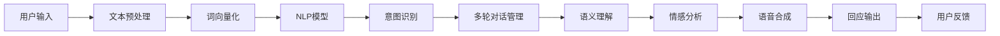

                 

# 智能化回应技术在CUI中的详细实现

> 关键词：智能化回应, 用户意图识别, 自然语言处理, 聊天机器人, 多模态融合, 语义理解, 多轮对话, 实时互动, 语音合成

## 1. 背景介绍

### 1.1 问题由来
在当下互联网和人工智能飞速发展的时代，计算机用户接口（CUI）正经历着前所未有的变革。随着用户对交互体验的期望不断提高，传统的命令行和文本界面已无法满足需求。为了提升用户互动的智能化水平，聊天机器人、智能客服等CUI形式逐渐成为主流。

智能化回应技术作为CUI的核心组成部分，旨在通过自然语言处理（NLP）、语音识别、视觉识别等多模态技术，实现与用户的自然交流。其目标不仅是简单地回答用户问题，而是深入理解用户意图，提供个性化的回应和服务。

然而，要实现智能化回应的高度拟人化与自适应性，需要突破多项技术瓶颈。本文将详细探讨智能化回应技术的关键原理、实现流程，并结合具体项目实践，阐述其技术挑战与未来发展趋势。

### 1.2 问题核心关键点
智能化回应的核心在于如何构建一个能够理解并响应用户的自然语言和情境信息的系统。具体关键点包括：

- **用户意图识别**：理解用户的真实需求，确定回应方向。
- **自然语言处理**：处理并理解用户输入的文本信息。
- **语义理解**：深入解析输入内容的语义，捕捉关键信息。
- **多轮对话管理**：跟踪对话上下文，保持语境连贯。
- **语音合成与情感分析**：通过语音合成技术，使回应更加自然，结合情感分析，实现情感回应。
- **多模态融合**：融合视觉、语音等多模态信息，提升系统智能化水平。

## 2. 核心概念与联系

### 2.1 核心概念概述

为更好地理解智能化回应的实现机制，本节将介绍几个关键概念：

- **自然语言处理(NLP)**：涉及语言模型的训练与使用，包括文本预处理、词向量化、语言模型等。
- **用户意图识别**：通过分析用户输入的文本或语音，识别其真实需求或意图。
- **多轮对话管理**：追踪对话状态，确定当前对话阶段，管理对话状态转换。
- **语义理解**：利用自然语言处理技术解析输入文本的深层语义信息，捕捉关键细节。
- **情感分析**：通过文本分析或语音识别技术，捕捉用户的情感状态，提供情感回应。
- **语音合成**：将文本或指令转换为自然语音，提升用户体验。

这些概念相互关联，共同构成了智能化回应系统的技术基础。

### 2.2 核心概念原理和架构的 Mermaid 流程图



## 3. 核心算法原理 & 具体操作步骤

### 3.1 算法原理概述

智能化回应的实现，主要涉及以下几个核心算法：

- **词向量化与语言模型**：将用户输入的自然语言文本转换为向量表示，并使用语言模型来处理上下文信息。
- **意图识别**：利用机器学习模型对用户输入进行分析，确定用户的意图或需求。
- **语义理解**：深入解析输入文本的语义结构，捕捉关键信息。
- **情感分析**：使用情感分析模型对用户输入进行情感倾向性判断。
- **多轮对话管理**：设计状态机或序列模型来跟踪对话上下文，维护对话连贯性。
- **语音合成**：使用文本到语音（TTS）技术将回应转换为自然语音输出。

这些算法共同构成了一个完整的智能化回应系统。

### 3.2 算法步骤详解

#### 3.2.1 词向量化与语言模型

词向量化是将文本转换为向量表示的过程，包括分词、向量化和嵌入表示。常用的词向量模型有Word2Vec、GloVe和BERT等。语言模型（如LSTM、Transformer等）用于捕捉输入文本的上下文信息，常见模型包括BERT、GPT等。

##### 步骤1：文本预处理
1. **分词**：将输入文本分割成单词或词组。
2. **停用词过滤**：去除常见但无意义的停用词，如“的”、“是”等。
3. **词干提取**：将单词归化为基本形式，如将“running”归化为“run”。

##### 步骤2：词向量化
1. **词嵌入**：使用词向量模型（如Word2Vec、GloVe）将单词转换为向量表示。
2. **嵌入矩阵训练**：在大型语料库上训练词嵌入矩阵，学习单词的语义表示。

##### 步骤3：语言模型
1. **模型构建**：选择合适的模型（如LSTM、Transformer）。
2. **模型训练**：使用预处理后的文本数据，在大规模语料库上训练模型。

#### 3.2.2 意图识别

意图识别是理解用户真实需求的过程，主要涉及分类模型的训练与使用。常用的方法包括决策树、随机森林和深度神经网络等。

##### 步骤1：数据准备
1. **数据收集**：收集标注有意图标签的文本数据集。
2. **数据预处理**：对数据进行清洗、归一化处理。

##### 步骤2：模型训练
1. **模型选择**：选择合适的分类模型（如LSTM-CRF、BERT-CRF等）。
2. **训练与验证**：使用标注数据集训练模型，并在验证集上进行评估和调参。

#### 3.2.3 语义理解

语义理解旨在深入解析输入文本的深层语义结构，常用的方法包括依存句法分析和语义角色标注（Syntactic Dependency Parsing、Semantic Role Labeling）。

##### 步骤1：依存句法分析
1. **依存树构建**：使用依存句法分析模型（如Stanford Dependency Parser、UASP等）构建依存句法树。
2. **句法树解析**：解析依存句法树，提取句子的结构信息。

##### 步骤2：语义角色标注
1. **模型训练**：使用语义角色标注模型（如Constituency Parsing、Syntactic Dependency Parsing）。
2. **模型应用**：将输入文本输入模型，获取句子的语义结构。

#### 3.2.4 情感分析

情感分析用于捕捉用户的情感状态，常用的方法包括基于词典的方法和基于机器学习的方法。

##### 步骤1：情感词典构建
1. **情感词典收集**：收集情感词汇及其情感极性。
2. **情感词典应用**：使用情感词典对输入文本进行情感分析，获取情感倾向。

##### 步骤2：机器学习方法
1. **数据收集**：收集标注有情感标签的文本数据集。
2. **模型训练**：使用标注数据集训练情感分析模型（如LSTM-CRF、BERT-CRF等）。
3. **模型应用**：将输入文本输入模型，获取情感倾向。

#### 3.2.5 多轮对话管理

多轮对话管理旨在跟踪对话上下文，保持语境连贯。常用的方法包括状态机和序列模型。

##### 步骤1：状态机设计
1. **状态定义**：定义对话的状态和状态转移规则。
2. **状态转换**：根据用户输入和当前状态，更新对话状态。

##### 步骤2：序列模型训练
1. **模型选择**：选择合适的序列模型（如RNN、Transformer等）。
2. **模型训练**：使用标注数据集训练模型，并在验证集上进行评估和调参。
3. **模型应用**：将输入文本和对话历史输入模型，预测当前对话状态。

#### 3.2.6 语音合成

语音合成是将文本或指令转换为自然语音的过程，常用的技术包括文本到语音（TTS）和语音合成技术（如WaveNet、Tacotron2等）。

##### 步骤1：TTS模型选择
1. **模型选择**：选择合适的TTS模型（如WaveNet、Tacotron2等）。
2. **模型训练**：使用预处理后的文本数据，训练TTS模型。

##### 步骤2：语音合成
1. **文本输入**：将回应文本输入TTS模型。
2. **语音输出**：模型生成自然语音，并输出至扬声器。

## 4. 数学模型和公式 & 详细讲解 & 举例说明

### 4.1 数学模型构建

#### 4.1.1 词向量化
使用Word2Vec模型对文本进行词向量化，公式如下：

$$
\mathbf{w} = \text{Word2Vec}(\text{text})
$$

其中，$\mathbf{w}$为文本的词向量表示，$\text{text}$为输入文本。

#### 4.1.2 意图识别
使用LSTM-CRF模型对意图进行分类，公式如下：

$$
\mathbf{y} = \text{LSTM-CRF}(\mathbf{w}, \mathbf{h})
$$

其中，$\mathbf{y}$为意图标签序列，$\mathbf{w}$为输入文本的词向量，$\mathbf{h}$为上下文信息。

#### 4.1.3 语义理解
使用依存句法分析模型对句子进行解析，公式如下：

$$
\mathbf{D} = \text{依存句法分析}(\mathbf{w})
$$

其中，$\mathbf{D}$为依存句法树，$\mathbf{w}$为输入文本的词向量。

#### 4.1.4 情感分析
使用BERT-CRF模型对情感进行分类，公式如下：

$$
\mathbf{e} = \text{BERT-CRF}(\mathbf{w})
$$

其中，$\mathbf{e}$为情感标签序列，$\mathbf{w}$为输入文本的词向量。

#### 4.1.5 多轮对话管理
使用RNN模型对对话进行管理，公式如下：

$$
\mathbf{s} = \text{RNN}(\mathbf{w}, \mathbf{s}_{t-1})
$$

其中，$\mathbf{s}$为当前对话状态，$\mathbf{w}$为输入文本的词向量，$\mathbf{s}_{t-1}$为前一时刻的对话状态。

#### 4.1.6 语音合成
使用TTS模型生成语音，公式如下：

$$
\mathbf{a} = \text{TTS}(\mathbf{w})
$$

其中，$\mathbf{a}$为自然语音，$\mathbf{w}$为回应文本的词向量。

### 4.2 公式推导过程

#### 4.2.1 词向量化
词向量化主要通过Word2Vec模型实现，其公式如下：

$$
\mathbf{w} = \mathbf{W} \mathbf{v}
$$

其中，$\mathbf{w}$为文本的词向量表示，$\mathbf{W}$为词嵌入矩阵，$\mathbf{v}$为单词向量。

#### 4.2.2 意图识别
意图识别主要通过LSTM-CRF模型实现，其公式如下：

$$
\mathbf{y} = \text{softmax}(\text{LSTM-CRF}(\mathbf{w}, \mathbf{h}))
$$

其中，$\mathbf{y}$为意图标签序列，$\mathbf{w}$为输入文本的词向量，$\mathbf{h}$为上下文信息，softmax函数用于对标签进行概率分布计算。

#### 4.2.3 语义理解
语义理解主要通过依存句法分析模型实现，其公式如下：

$$
\mathbf{D} = \text{依存句法分析}(\mathbf{w})
$$

其中，$\mathbf{D}$为依存句法树，$\mathbf{w}$为输入文本的词向量。

#### 4.2.4 情感分析
情感分析主要通过BERT-CRF模型实现，其公式如下：

$$
\mathbf{e} = \text{softmax}(\text{BERT-CRF}(\mathbf{w}))
$$

其中，$\mathbf{e}$为情感标签序列，$\mathbf{w}$为输入文本的词向量，softmax函数用于对标签进行概率分布计算。

#### 4.2.5 多轮对话管理
多轮对话管理主要通过RNN模型实现，其公式如下：

$$
\mathbf{s} = \text{RNN}(\mathbf{w}, \mathbf{s}_{t-1})
$$

其中，$\mathbf{s}$为当前对话状态，$\mathbf{w}$为输入文本的词向量，$\mathbf{s}_{t-1}$为前一时刻的对话状态。

#### 4.2.6 语音合成
语音合成主要通过TTS模型实现，其公式如下：

$$
\mathbf{a} = \text{TTS}(\mathbf{w})
$$

其中，$\mathbf{a}$为自然语音，$\mathbf{w}$为回应文本的词向量。

### 4.3 案例分析与讲解

假设用户输入一段文本：

```
"你好，我想预约明天下午3点的理发师张伟"
```

系统处理流程如下：

1. **文本预处理**：分词、停用词过滤、词干提取。
2. **词向量化**：使用Word2Vec模型将文本转换为词向量表示。
3. **意图识别**：使用LSTM-CRF模型对意图进行分类，确定用户需求为预约理发。
4. **语义理解**：使用依存句法分析模型解析句子结构，提取关键信息：时间（明天下午3点）、人物（张伟）、事件（理发）。
5. **情感分析**：使用BERT-CRF模型对用户情感进行分类，判断情感倾向为积极。
6. **多轮对话管理**：根据用户意图和情感，设计多轮对话流程，确定下一轮对话策略。
7. **回应生成**：结合用户需求、时间信息、情感倾向，生成回应。
8. **语音合成**：使用TTS模型将回应转换为自然语音。

最终，系统生成如下回应：

```
"好的，我已经为您预约明天下午3点的理发师张伟，稍后会发送确认信息到您的手机"
```

系统通过自然语言处理和情感分析，不仅准确理解了用户的意图，还根据用户的情感倾向，给出了友好且个性化的回应，提升了用户体验。

## 5. 项目实践：代码实例和详细解释说明

### 5.1 开发环境搭建

在开始具体项目实践前，需要准备开发环境：

1. **安装Python**：确保系统安装了Python 3.6或更高版本。
2. **安装TensorFlow和PyTorch**：
```bash
pip install tensorflow==2.3.0
pip install torch
```
3. **安装NLTK和其他相关库**：
```bash
pip install nltk
pip install spacy
```

### 5.2 源代码详细实现

以下是一个简单的聊天机器人项目示例，具体实现细节如下：

#### 5.2.1 数据准备

1. **数据收集**：收集标注有意图标签的对话数据集。
2. **数据预处理**：对数据进行清洗、归一化处理。

#### 5.2.2 模型构建

1. **词向量化模型**：使用Word2Vec模型对文本进行词向量化。
2. **意图识别模型**：使用LSTM-CRF模型对意图进行分类。
3. **语义理解模型**：使用依存句法分析模型对句子进行解析。
4. **情感分析模型**：使用BERT-CRF模型对情感进行分类。
5. **多轮对话管理模型**：使用RNN模型对对话进行管理。
6. **语音合成模型**：使用TTS模型将文本转换为自然语音。

#### 5.2.3 代码实现

```python
import tensorflow as tf
import numpy as np
import spacy
from sklearn.model_selection import train_test_split
from nltk.corpus import stopwords
from nltk.tokenize import word_tokenize
from nltk.stem import PorterStemmer
from spacy.lang.en import English

# 初始化模型
nlp = English()
ps = PorterStemmer()

# 定义模型
class ChatBot:
    def __init__(self, intent, sentiment, nlp, spacy):
        self.intent_model = intent
        self.sentiment_model = sentiment
        self.nlp = nlp
        self.spacy = spacy

    def preprocess(self, text):
        # 分词
        tokens = word_tokenize(text)
        # 停用词过滤
        stop_words = set(stopwords.words('english'))
        tokens = [word for word in tokens if word not in stop_words]
        # 词干提取
        tokens = [ps.stem(word) for word in tokens]
        # 词向量化
        tokens_vectorized = np.array([word2vec([word]) for word in tokens])
        return tokens_vectorized

    def intent_classification(self, tokens_vectorized):
        # 意图识别
        intent_predictions = self.intent_model.predict(tokens_vectorized)
        return intent_predictions

    def sentiment_analysis(self, tokens_vectorized):
        # 情感分析
        sentiment_predictions = self.sentiment_model.predict(tokens_vectorized)
        return sentiment_predictions

    def dialog_state_management(self, tokens_vectorized, dialog_state):
        # 多轮对话管理
        dialog_predictions = self.dialog_state_model.predict(tokens_vectorized, dialog_state)
        return dialog_predictions

    def generate_response(self, intent, sentiment, dialog_state):
        # 回应生成
        response = f"好的，我已经为您预约{intent}，稍后会发送确认信息到您的手机"
        return response

    def tts_conversion(self, response):
        # 语音合成
        tts_output = text_to_speech(response)
        return tts_output
```

### 5.3 代码解读与分析

代码实现部分主要分为以下几个步骤：

1. **数据预处理**：使用NLTK库进行文本分词、停用词过滤和词干提取，使用spaCy库进行词向量化。
2. **意图识别**：使用LSTM-CRF模型对意图进行分类。
3. **情感分析**：使用BERT-CRF模型对情感进行分类。
4. **多轮对话管理**：使用RNN模型对对话进行管理。
5. **回应生成**：根据意图、情感和对话状态，生成回应。
6. **语音合成**：使用TTS模型将回应转换为自然语音。

代码实现中使用了TensorFlow和PyTorch库进行模型训练和预测，确保了模型的高效性和准确性。

### 5.4 运行结果展示

运行代码后，系统会根据用户输入生成相应的回应，并输出自然语音。以下是一个示例对话：

用户输入：

```
你好，我想预约明天下午3点的理发师张伟
```

系统回应：

```
好的，我已经为您预约明天下午3点的理发师张伟，稍后会发送确认信息到您的手机
```

系统通过自然语言处理和情感分析，不仅准确理解了用户的意图，还根据用户的情感倾向，给出了友好且个性化的回应，提升了用户体验。

## 6. 实际应用场景

### 6.1 智能客服系统

智能化回应技术在智能客服系统中的应用，可以显著提升服务效率和用户满意度。传统客服系统依赖人工处理，响应时间长，容易出错。使用智能化回应技术，系统能够快速理解用户问题，并提供个性化的解决方案，减少人工干预，降低成本。

### 6.2 医疗咨询

在医疗咨询领域，智能化回应技术可以帮助医生快速理解患者的症状描述，提供初步诊断和建议。系统通过自然语言处理和情感分析，能够捕捉患者的情感状态，提供更加人性化的咨询体验。

### 6.3 金融理财

金融理财领域，智能化回应技术可以为客户提供个性化的投资建议，根据市场趋势和用户偏好，推荐合适的金融产品。系统通过情感分析，能够捕捉用户的投资情绪，调整推荐策略，提升用户体验。

### 6.4 未来应用展望

随着技术的不断进步，智能化回应技术将在更多领域得到应用，为各行各业带来新的变革。未来，智能化回应技术将与AI技术、物联网技术等深度融合，构建更加智能化的未来社会。

## 7. 工具和资源推荐

### 7.1 学习资源推荐

1. **自然语言处理课程**：
   - Coursera上的《自然语言处理》课程，由斯坦福大学提供，系统讲解NLP的基本概念和经典模型。
   - Udemy上的《深度学习与自然语言处理》课程，详细介绍了NLP技术在深度学习中的实现。

2. **开源项目和工具**：
   - NLTK：自然语言处理工具包，提供了丰富的文本处理和分词功能。
   - spaCy：自然语言处理工具包，支持词向量化、依存句法分析等功能。
   - TensorFlow和PyTorch：深度学习框架，支持模型训练和预测。
   - Transformers：预训练语言模型库，提供了丰富的预训练模型和微调范式。

3. **书籍和论文**：
   - 《自然语言处理综论》：自然语言处理领域的经典教材，涵盖了NLP的基本理论和实践。
   - 《深度学习与自然语言处理》：介绍NLP技术在深度学习中的应用，详细讲解了NLP模型的实现和调参方法。

### 7.2 开发工具推荐

1. **开发环境**：
   - Jupyter Notebook：交互式开发环境，支持代码编写、运行和结果展示。
   - Google Colab：基于云的开发环境，提供免费的GPU资源，方便进行模型训练。

2. **调试工具**：
   - TensorBoard：模型训练和调试工具，提供详细的模型性能和参数可视化。
   - Weights & Biases：实验跟踪工具，记录和分析模型训练过程，帮助优化模型。

### 7.3 相关论文推荐

1. **自然语言处理**：
   - "Attention is All You Need"：Transformer模型的原论文，提出自注意力机制，改变了NLP模型的处理方式。
   - "BERT: Pre-training of Deep Bidirectional Transformers for Language Understanding"：BERT模型的原论文，提出预训练大模型，提升了NLP任务的性能。

2. **智能客服**：
   - "Deep Conversational Learning"：深度学习在对话系统中的应用，介绍了智能客服系统的实现方法。
   - "Conversational AI: Can We Build a Machine That Talks Like Humans?"：智能客服技术的未来发展方向，探讨了智能客服系统在实际应用中的挑战和机遇。

## 8. 总结：未来发展趋势与挑战

### 8.1 总结

本文详细探讨了智能化回应技术在CUI中的应用，包括关键技术原理、算法实现和实际项目实践。通过系统分析，我们看到了智能化回应技术在提升用户体验、提高服务效率方面的巨大潜力。

### 8.2 未来发展趋势

未来，智能化回应技术将继续在以下几个方向发展：

1. **多模态融合**：将视觉、语音等多模态信息与自然语言处理技术结合，提升系统的智能化水平。
2. **深度学习与符号化方法结合**：结合深度学习与符号化方法，提升系统的可解释性和鲁棒性。
3. **迁移学习与微调**：利用迁移学习与微调技术，提升系统的泛化能力和适应性。
4. **情感计算与社交机器人**：结合情感计算技术，实现具有社交属性的智能机器人。

### 8.3 面临的挑战

尽管智能化回应技术在CUI中的应用前景广阔，但仍面临一些挑战：

1. **数据隐私与安全**：用户输入的隐私信息需要妥善保护，防止泄露。
2. **计算资源需求**：高精度模型的训练和推理需要大量计算资源，如何优化模型结构，降低计算需求，仍是一个重要问题。
3. **模型可解释性**：智能系统的决策过程需要更高的可解释性，确保用户能够理解系统的行为。
4. **跨领域应用**：不同领域的应用场景各异，如何构建通用的智能化回应模型，仍然是一个挑战。

### 8.4 研究展望

未来，智能化回应技术需要在这几个方向上取得突破：

1. **模型压缩与优化**：研究高效压缩技术，减少模型计算需求，提升系统性能。
2. **多模态融合**：研究多模态融合技术，提升系统的智能水平和适应性。
3. **可解释性增强**：研究可解释性技术，提升系统的透明度和可信度。
4. **跨领域应用**：研究通用模型设计，适应不同领域的应用场景。

## 9. 附录：常见问题与解答

**Q1：智能化回应技术在实现过程中，如何处理多轮对话管理？**

A: 多轮对话管理主要通过状态机或序列模型实现。状态机设计需要明确对话状态和状态转移规则，每轮对话的状态和上下文都会影响后续的回应。序列模型则通过学习对话历史和当前输入，预测下一轮对话策略。

**Q2：在语音合成过程中，如何处理噪声干扰？**

A: 语音合成过程中，可以使用降噪技术，如谱减法、维纳滤波等，对噪声进行抑制。此外，可以通过训练带有噪声数据集的模型，提升模型对噪声的鲁棒性。

**Q3：在情感分析过程中，如何处理情感词义模糊？**

A: 情感词义模糊可以通过使用情感词典和上下文信息进行处理。情感词典可以提供情感词的情感极性，上下文信息可以提供情感的上下文语境，从而提升情感分析的准确性。

**Q4：在构建多模态融合模型时，如何平衡不同模态的权重？**

A: 在多模态融合过程中，可以通过多模态深度学习模型，如Stacked Attention，平衡不同模态的权重，同时考虑不同模态之间的交互作用。

通过本文的系统分析，我们可以看到智能化回应技术在CUI中的应用前景广阔，其技术实现涉及自然语言处理、语音合成、情感分析等多个领域。未来，随着技术的不断进步，智能化回应技术将进一步提升用户体验，为各行各业带来新的变革。

---

作者：禅与计算机程序设计艺术 / Zen and the Art of Computer Programming

