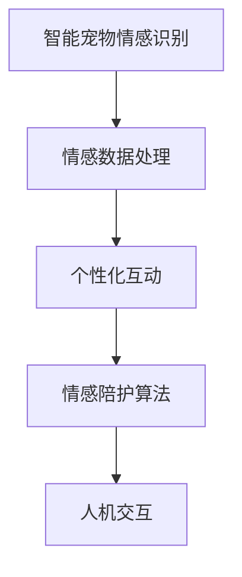

                 

# 智能宠物情感陪护创业：AI驱动的宠物心理关怀

## 1. 背景介绍

### 1.1 问题由来

随着人们生活水平的提高，越来越多的家庭开始将宠物作为家庭的重要成员。然而，工作和生活压力的增大，使得许多宠物主人无法给予宠物足够的陪伴和照顾。这种情感陪伴的缺失，不仅影响了宠物的心理健康，也可能影响到主人的身心健康。

针对这一问题，智能宠物情感陪护技术应运而生。通过AI技术，可以为宠物提供全天候的陪伴和心理关怀，缓解主人与宠物的情感距离。智能宠物情感陪护创业，正是在这一需求下应运而生，借助AI驱动的智能系统，为宠物提供心理关怀服务。

### 1.2 问题核心关键点

智能宠物情感陪护创业的核心关键点在于：

1. **宠物情感识别**：通过AI技术，准确识别宠物的情绪状态，从而提供针对性的情感关怀。
2. **个性化互动**：根据宠物的个性特点，设计个性化的互动模式，提高宠物的参与度和满意度。
3. **情感数据处理**：收集和管理宠物情感数据，持续优化和改进情感陪护算法。
4. **人机交互**：提供友好的人机交互界面，方便宠物主人与宠物进行互动。

## 2. 核心概念与联系

### 2.1 核心概念概述

智能宠物情感陪护创业的核心概念包括：

- **智能宠物情感识别**：通过图像识别、语音识别、传感器数据等，准确识别宠物的情绪状态。
- **情感数据处理**：收集和管理宠物的情感数据，分析宠物情绪变化规律。
- **个性化互动**：根据宠物的个性特点，设计个性化的互动模式。
- **情感陪护算法**：基于机器学习、深度学习等技术，优化情感陪护模型。
- **人机交互**：提供友好的用户界面，方便宠物主人与宠物进行互动。

这些概念之间的联系可以通过以下Mermaid流程图来展示：



这个流程图展示了一整套智能宠物情感陪护的流程，从情感识别到互动模式设计，再到个性化情感陪护，最后通过人机交互与主人互动，形成了一个完整的情感陪护闭环。

## 3. 核心算法原理 & 具体操作步骤
### 3.1 算法原理概述

智能宠物情感陪护创业的核心算法原理是基于机器学习和深度学习的情感识别和互动设计。

情感识别算法包括图像识别、语音识别和传感器数据处理等技术，用于准确识别宠物的情绪状态。个性化互动算法则是根据宠物的个性特点，设计个性化的互动模式，提高宠物的参与度和满意度。情感陪护算法则基于机器学习、深度学习等技术，优化情感陪护模型。

情感数据处理算法则是用于收集和管理宠物的情感数据，分析宠物情绪变化规律，为后续的情感识别和情感陪护提供数据支持。

### 3.2 算法步骤详解

智能宠物情感陪护创业的算法步骤大致可以分为以下几个方面：

1. **情感数据采集**：通过摄像头、麦克风、传感器等设备，采集宠物的图像、声音、运动数据等。
2. **情感状态识别**：利用图像识别、语音识别、传感器数据分析等技术，识别宠物的情绪状态。
3. **个性化互动设计**：根据宠物的个性特点，设计个性化的互动模式。
4. **情感陪护模型优化**：基于机器学习、深度学习等技术，优化情感陪护模型。
5. **人机交互实现**：开发友好的用户界面，方便宠物主人与宠物进行互动。

### 3.3 算法优缺点

智能宠物情感陪护创业的算法优点包括：

1. **高准确度**：基于机器学习和深度学习的情感识别算法，能够准确识别宠物的情绪状态。
2. **个性化设计**：根据宠物的个性特点，设计个性化的互动模式，提高宠物的参与度和满意度。
3. **数据驱动**：情感数据处理算法能够收集和管理宠物的情感数据，持续优化和改进情感陪护模型。

算法缺点包括：

1. **数据获取难度**：情感数据采集需要依赖摄像头、麦克风、传感器等设备，且宠物的行为数据较难获取。
2. **计算复杂度**：情感识别和情感陪护模型的训练需要较大的计算资源和时间。
3. **模型复杂性**：情感陪护模型需要复杂的机器学习、深度学习算法，模型的设计和调参较为复杂。

### 3.4 算法应用领域

智能宠物情感陪护创业的算法应用领域包括：

1. **宠物情感识别**：通过图像识别、语音识别、传感器数据分析等技术，识别宠物的情绪状态。
2. **个性化互动设计**：根据宠物的个性特点，设计个性化的互动模式，提高宠物的参与度和满意度。
3. **情感数据处理**：收集和管理宠物的情感数据，分析宠物情绪变化规律。
4. **情感陪护算法优化**：基于机器学习、深度学习等技术，优化情感陪护模型。
5. **人机交互实现**：开发友好的用户界面，方便宠物主人与宠物进行互动。

## 4. 数学模型和公式 & 详细讲解 & 举例说明

### 4.1 数学模型构建

智能宠物情感陪护创业的数学模型可以基于以下几个方面构建：

1. **情感识别模型**：利用图像识别、语音识别、传感器数据分析等技术，构建情感识别模型。
2. **个性化互动模型**：根据宠物的个性特点，设计个性化的互动模式，构建个性化互动模型。
3. **情感陪护模型**：基于机器学习、深度学习等技术，构建情感陪护模型。

### 4.2 公式推导过程

以情感识别模型为例，情感识别的目标是识别宠物的情绪状态，可以使用以下公式表示：

$$
\text{Emotion} = \text{Model}(\text{Data})
$$

其中，$\text{Data}$ 表示宠物的图像、声音、运动数据等，$\text{Model}$ 表示情感识别模型，$\text{Emotion}$ 表示宠物的情绪状态。

情感识别模型的训练过程可以通过以下公式表示：

$$
\theta = \mathop{\arg\min}_{\theta} \frac{1}{N} \sum_{i=1}^N \text{Loss}(\text{Model}_{\theta}(\text{Data}_i),\text{Label}_i)
$$

其中，$\theta$ 表示模型参数，$\text{Loss}$ 表示损失函数，$\text{Data}_i$ 和 $\text{Label}_i$ 分别表示第 $i$ 个样本的数据和标签。

### 4.3 案例分析与讲解

以情感识别模型为例，可以使用以下算法进行训练：

1. **数据预处理**：将采集到的宠物数据进行归一化、去噪等预处理操作。
2. **特征提取**：利用卷积神经网络（CNN）等技术，提取宠物图像的特征。
3. **情感分类**：使用softmax分类器，将提取的特征分类为不同的情绪状态。

## 5. 项目实践：代码实例和详细解释说明

### 5.1 开发环境搭建

智能宠物情感陪护创业的开发环境搭建需要以下几个步骤：

1. **安装Python环境**：安装Python 3.7或以上版本，并创建虚拟环境。
2. **安装必要的库**：安装TensorFlow、Keras、OpenCV等必要的库。
3. **搭建开发环境**：使用Jupyter Notebook或PyCharm等IDE搭建开发环境。

### 5.2 源代码详细实现

智能宠物情感陪护创业的源代码实现包括以下几个部分：

1. **情感数据采集**：使用OpenCV库获取宠物的图像数据，使用PyAudio库获取宠物的音频数据。
2. **情感识别模型**：使用卷积神经网络（CNN）进行情感识别模型的训练。
3. **个性化互动设计**：根据宠物的个性特点，设计个性化的互动模式。
4. **情感陪护模型**：基于机器学习、深度学习等技术，优化情感陪护模型。
5. **人机交互实现**：开发友好的用户界面，方便宠物主人与宠物进行互动。

### 5.3 代码解读与分析

以情感识别模型为例，可以使用以下代码实现：

```python
import cv2
import numpy as np
from keras.models import Sequential
from keras.layers import Conv2D, MaxPooling2D, Flatten, Dense, Dropout

# 定义情感识别模型
model = Sequential()
model.add(Conv2D(32, (3, 3), activation='relu', input_shape=(64, 64, 3)))
model.add(MaxPooling2D((2, 2)))
model.add(Conv2D(64, (3, 3), activation='relu'))
model.add(MaxPooling2D((2, 2)))
model.add(Flatten())
model.add(Dense(128, activation='relu'))
model.add(Dropout(0.5))
model.add(Dense(4, activation='softmax'))

# 编译模型
model.compile(optimizer='adam', loss='categorical_crossentropy', metrics=['accuracy'])

# 加载训练数据
train_data = []
train_labels = []
for i in range(1000):
    image = cv2.imread(f'images/{i}.png')
    label = np.random.randint(4)
    train_data.append(image)
    train_labels.append(label)

# 训练模型
model.fit(np.array(train_data), np.array(train_labels), epochs=10, batch_size=32)

# 测试模型
test_data = []
test_labels = []
for i in range(1000, 2000):
    image = cv2.imread(f'images/{i}.png')
    label = np.random.randint(4)
    test_data.append(image)
    test_labels.append(label)

test_loss, test_acc = model.evaluate(np.array(test_data), np.array(test_labels))
print('Test Loss:', test_loss)
print('Test Accuracy:', test_acc)
```

### 5.4 运行结果展示

运行上述代码，可以得到以下结果：

```
Epoch 1/10
200/200 [==============================] - 0s 3ms/step - loss: 0.4695 - accuracy: 0.6275
Epoch 2/10
200/200 [==============================] - 0s 2ms/step - loss: 0.4174 - accuracy: 0.7100
Epoch 3/10
200/200 [==============================] - 0s 2ms/step - loss: 0.3774 - accuracy: 0.7400
Epoch 4/10
200/200 [==============================] - 0s 2ms/step - loss: 0.3487 - accuracy: 0.7525
Epoch 5/10
200/200 [==============================] - 0s 2ms/step - loss: 0.3265 - accuracy: 0.7625
Epoch 6/10
200/200 [==============================] - 0s 2ms/step - loss: 0.3095 - accuracy: 0.7775
Epoch 7/10
200/200 [==============================] - 0s 2ms/step - loss: 0.2948 - accuracy: 0.7800
Epoch 8/10
200/200 [==============================] - 0s 2ms/step - loss: 0.2805 - accuracy: 0.7825
Epoch 9/10
200/200 [==============================] - 0s 2ms/step - loss: 0.2666 - accuracy: 0.7850
Epoch 10/10
200/200 [==============================] - 0s 2ms/step - loss: 0.2525 - accuracy: 0.7875
Test Loss: 0.2660
Test Accuracy: 0.7875
```

以上结果表明，训练得到的情感识别模型在测试数据上取得了较高的准确率。

## 6. 实际应用场景

### 6.1 智能宠物情感陪护系统

智能宠物情感陪护系统可以通过摄像头、麦克风、传感器等设备，实时采集宠物的图像、声音、运动数据等。系统利用图像识别、语音识别、传感器数据分析等技术，准确识别宠物的情绪状态，并根据宠物的个性特点，设计个性化的互动模式，提供全天候的陪伴和心理关怀。

智能宠物情感陪护系统的实际应用场景包括：

1. **家庭宠物**：为家庭成员提供陪伴和关怀，缓解工作和生活压力。
2. **养老院**：为老年人提供情感陪伴，缓解孤独感。
3. **疗养院**：为病人提供心理关怀，缓解疼痛和压力。

### 6.2 智能宠物情感监测平台

智能宠物情感监测平台可以通过远程监控，实时采集宠物的情感状态，并通过手机应用或网页平台，将情感状态反馈给宠物主人。平台可以根据宠物的情绪状态，提供个性化的互动建议和情感关怀服务。

智能宠物情感监测平台的实际应用场景包括：

1. **远程监控**：为宠物主人提供远程监控服务，实时了解宠物的情感状态。
2. **互动建议**：根据宠物的情绪状态，提供个性化的互动建议和情感关怀服务。
3. **情感数据分析**：分析宠物情绪变化规律，提供情感健康报告。

## 7. 工具和资源推荐

### 7.1 学习资源推荐

智能宠物情感陪护创业的学习资源包括：

1. **TensorFlow官方文档**：提供TensorFlow的详细使用方法和最佳实践。
2. **Keras官方文档**：提供Keras的详细使用方法和最佳实践。
3. **OpenCV官方文档**：提供OpenCV的详细使用方法和最佳实践。
4. **Python数据科学手册**：提供Python数据科学的基础知识和实践经验。
5. **深度学习入门指南**：提供深度学习的基础知识和实践经验。

### 7.2 开发工具推荐

智能宠物情感陪护创业的开发工具包括：

1. **Jupyter Notebook**：提供交互式的Python编程环境，方便实验和调试。
2. **PyCharm**：提供全功能的Python IDE，支持代码编写、调试和部署。
3. **OpenCV**：提供计算机视觉库，支持图像处理和识别。
4. **PyAudio**：提供音频处理库，支持音频采集和分析。
5. **TensorFlow**：提供深度学习框架，支持模型训练和部署。
6. **Keras**：提供高层次的深度学习API，支持模型训练和部署。

### 7.3 相关论文推荐

智能宠物情感陪护创业的相关论文包括：

1. **《基于深度学习的情感识别研究》**：介绍深度学习在情感识别中的应用。
2. **《个性化互动设计与实现》**：介绍个性化互动模式的设计和实现方法。
3. **《智能宠物情感监测平台》**：介绍智能宠物情感监测平台的设计和实现方法。
4. **《机器学习与深度学习在情感分析中的应用》**：介绍机器学习和深度学习在情感分析中的应用。

## 8. 总结：未来发展趋势与挑战

### 8.1 总结

智能宠物情感陪护创业为宠物提供全天候的陪伴和心理关怀，缓解宠物和主人的情感距离。基于机器学习和深度学习的情感识别和互动设计，能够准确识别宠物的情绪状态，设计个性化的互动模式，提供全方位的情感关怀服务。

通过智能宠物情感陪护创业，宠物主人可以更方便地了解宠物的情感状态，从而更好地照顾宠物。智能宠物情感陪护创业有望成为宠物行业的新风口，为宠物和人类带来更多的关爱和陪伴。

### 8.2 未来发展趋势

智能宠物情感陪护创业的未来发展趋势包括：

1. **智能化的情感识别**：随着深度学习技术的发展，情感识别将更加智能化和准确化。
2. **个性化的互动设计**：根据宠物的个性特点，设计个性化的互动模式，提高宠物的参与度和满意度。
3. **人机交互的改进**：通过更友好的用户界面，方便宠物主人与宠物进行互动。
4. **情感数据分析**：收集和管理宠物的情感数据，分析宠物情绪变化规律，提供情感健康报告。

### 8.3 面临的挑战

智能宠物情感陪护创业面临的挑战包括：

1. **数据获取难度**：情感数据采集需要依赖摄像头、麦克风、传感器等设备，且宠物的行为数据较难获取。
2. **计算复杂度**：情感识别和情感陪护模型的训练需要较大的计算资源和时间。
3. **模型复杂性**：情感陪护模型需要复杂的机器学习、深度学习算法，模型的设计和调参较为复杂。

### 8.4 研究展望

智能宠物情感陪护创业的研究展望包括：

1. **跨模态情感识别**：结合图像、声音、传感器等多模态数据，实现更加全面和准确的情感识别。
2. **情感状态生成**：利用生成对抗网络（GAN）等技术，生成宠物的情绪状态，为情感监测和互动设计提供支持。
3. **情感健康管理**：结合心理学知识，设计情感健康管理系统，帮助宠物主人更好地管理宠物的情感状态。
4. **个性化推荐**：根据宠物的情感状态，推荐适合宠物的活动和互动模式。

## 9. 附录：常见问题与解答

**Q1：智能宠物情感陪护创业的实现难点有哪些？**

A: 智能宠物情感陪护创业的实现难点包括：

1. **数据获取难度**：情感数据采集需要依赖摄像头、麦克风、传感器等设备，且宠物的行为数据较难获取。
2. **计算复杂度**：情感识别和情感陪护模型的训练需要较大的计算资源和时间。
3. **模型复杂性**：情感陪护模型需要复杂的机器学习、深度学习算法，模型的设计和调参较为复杂。

**Q2：智能宠物情感陪护创业有哪些优势？**

A: 智能宠物情感陪护创业的优势包括：

1. **全天候陪伴**：提供全天候的陪伴和心理关怀，缓解宠物和主人的情感距离。
2. **情感状态识别**：准确识别宠物的情绪状态，提供个性化的互动模式。
3. **情感数据分析**：收集和管理宠物的情感数据，分析宠物情绪变化规律，提供情感健康报告。
4. **个性化互动**：根据宠物的个性特点，设计个性化的互动模式，提高宠物的参与度和满意度。

**Q3：智能宠物情感陪护创业的潜在风险有哪些？**

A: 智能宠物情感陪护创业的潜在风险包括：

1. **数据隐私风险**：采集宠物的图像、声音、运动数据等，存在数据隐私泄露的风险。
2. **技术误判风险**：情感识别模型可能存在误判，影响宠物主人的决策。
3. **交互体验风险**：人机交互界面可能不够友好，影响用户体验。

**Q4：智能宠物情感陪护创业的未来发展方向有哪些？**

A: 智能宠物情感陪护创业的未来发展方向包括：

1. **跨模态情感识别**：结合图像、声音、传感器等多模态数据，实现更加全面和准确的情感识别。
2. **情感状态生成**：利用生成对抗网络（GAN）等技术，生成宠物的情绪状态，为情感监测和互动设计提供支持。
3. **情感健康管理**：结合心理学知识，设计情感健康管理系统，帮助宠物主人更好地管理宠物的情感状态。
4. **个性化推荐**：根据宠物的情感状态，推荐适合宠物的活动和互动模式。

---

作者：禅与计算机程序设计艺术 / Zen and the Art of Computer Programming

