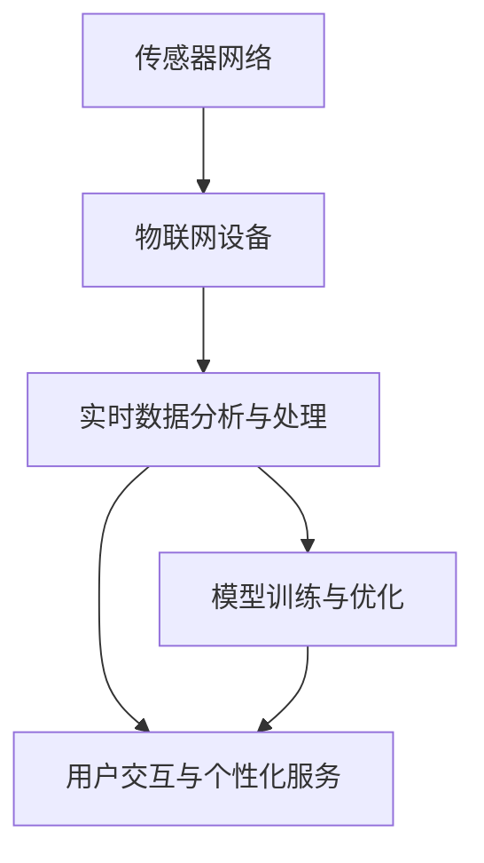

                 

# 智能家居的智能监控与注意力管理

在智能家居领域，智能监控系统和注意力管理系统是提升用户体验、保障家庭安全的两个关键技术方向。本文将深入探讨这两个系统的原理、技术细节及应用案例，并展望未来发展趋势。

## 1. 背景介绍

### 1.1 问题由来

智能家居的概念已经存在多年，但由于技术限制和用户需求的多样性，早期产品大多停留在基本家电控制层面，难以满足日益增长的智能需求。近年来，随着物联网、人工智能等技术的发展，智能家居市场迎来了新的发展契机。智能监控系统和注意力管理系统作为其中最具代表性的应用，为用户的日常生活在安全、便捷、健康等方面提供了极大的便利。

智能监控系统通过实时监控家庭环境，及时发现异常情况，提供预警和应对措施，有效防止意外事件的发生。而注意力管理系统则通过对用户的生活习惯、心理状态进行分析，提供个性化的建议和提醒，帮助用户提升生活质量。

### 1.2 问题核心关键点

智能家居的智能监控与注意力管理系统涉及的核心概念和关键点包括：
- 传感器网络与数据采集
- 实时数据分析与处理
- 模型训练与优化
- 用户交互与个性化服务

这些概念和关键点构成了智能监控和注意力管理系统的技术基础，并共同支撑着智能家居系统的高效运作。

## 2. 核心概念与联系

### 2.1 核心概念概述

为更好地理解智能监控与注意力管理系统，本节将介绍几个密切相关的核心概念：

- 传感器网络：由各种传感器（如摄像头、温度传感器、运动传感器等）组成的分布式网络，用于采集家庭环境中的多种数据。
- 物联网设备：通过传感器网络连接的各种智能设备，如智能门锁、智能插座、智能摄像头等，用于实现远程控制和数据传输。
- 实时数据分析与处理：通过对传感器采集到的数据进行实时分析与处理，识别出异常情况并采取措施。
- 模型训练与优化：利用机器学习模型对用户数据进行训练与优化，提升模型的预测准确度和实时响应能力。
- 用户交互与个性化服务：通过与用户的互动，了解用户需求，提供个性化的服务与建议。

这些核心概念之间的逻辑关系可以通过以下Mermaid流程图来展示：



这个流程图展示了一些关键概念及其之间的逻辑关系：

1. 传感器网络采集的数据通过物联网设备传递到实时数据分析与处理模块，后者利用模型对数据进行分析。
2. 模型训练与优化模块根据用户数据持续改进模型，以提高预测准确度和实时响应能力。
3. 用户交互与个性化服务模块与用户互动，了解用户需求，提供个性化服务。

## 3. 核心算法原理 & 具体操作步骤

### 3.1 算法原理概述

智能监控与注意力管理系统的核心算法主要基于机器学习与深度学习技术。具体来说，算法主要分为以下几个步骤：

1. 数据预处理：将传感器网络采集到的数据进行清洗、滤波和归一化，以便于后续的模型训练。
2. 特征提取：利用各种特征提取技术，如时域特征、频域特征、统计特征等，将原始数据转换为模型可处理的特征向量。
3. 模型训练：选择合适的机器学习或深度学习模型，如支持向量机、随机森林、卷积神经网络等，利用历史数据进行模型训练。
4. 模型优化：通过超参数调优、模型融合等技术，提高模型的预测准确度和实时响应能力。
5. 实时监控与预警：利用训练好的模型对实时数据进行监控，及时发现异常情况并发出预警。
6. 个性化服务：根据用户反馈和行为数据，利用推荐系统等技术提供个性化的服务与建议。

### 3.2 算法步骤详解

以下将详细介绍智能监控与注意力管理系统的算法步骤：

#### 3.2.1 数据预处理

数据预处理是智能监控与注意力管理系统中的重要环节，直接影响模型训练效果和实时响应的准确性。主要包括以下几个步骤：

1. 数据清洗：去除噪声数据、缺失数据，确保数据的完整性和准确性。
2. 数据滤波：通过低通滤波、中值滤波等技术，去除数据中的高频干扰，平滑信号。
3. 数据归一化：对数据进行归一化处理，使其符合标准分布，以便于模型训练。

#### 3.2.2 特征提取

特征提取是将原始数据转换为模型可处理的形式的过程。常用的特征提取方法包括：

1. 时域特征提取：对信号进行傅里叶变换，提取时域特征，如能量、峰值、均值、方差等。
2. 频域特征提取：对信号进行傅里叶变换，提取频域特征，如频率、频谱密度等。
3. 统计特征提取：对信号进行统计分析，提取统计特征，如均值、方差、标准差、偏度、峰度等。

#### 3.2.3 模型训练

模型训练是智能监控与注意力管理系统中的核心环节，主要包括以下几个步骤：

1. 选择合适的模型：根据任务需求和数据特点，选择合适的机器学习或深度学习模型。
2. 数据划分：将数据划分为训练集、验证集和测试集，以便于模型训练和评估。
3. 模型训练：利用训练集对模型进行训练，优化模型参数，提高模型性能。
4. 模型评估：利用验证集对模型进行评估，选择最优模型。
5. 模型优化：通过超参数调优、模型融合等技术，提高模型的预测准确度和实时响应能力。

#### 3.2.4 实时监控与预警

实时监控与预警是智能监控系统的核心功能，主要包括以下几个步骤：

1. 实时数据采集：通过传感器网络采集实时数据，输入到模型中进行分析。
2. 异常检测：利用训练好的模型对实时数据进行监控，识别出异常情况。
3. 预警处理：根据异常情况的严重程度，采取相应的预警措施，如报警、自动开关设备等。

#### 3.2.5 个性化服务

个性化服务是注意力管理系统的核心功能，主要包括以下几个步骤：

1. 用户行为分析：通过分析用户的行为数据，了解用户需求和习惯。
2. 个性化推荐：根据用户需求和行为数据，利用推荐系统等技术提供个性化的服务与建议。
3. 用户反馈收集：通过与用户的互动，收集用户反馈，进一步改进个性化服务。

### 3.3 算法优缺点

智能监控与注意力管理系统的算法具有以下优点：

1. 实时响应能力强：通过实时数据分析与处理，能够及时发现异常情况并采取措施，保障家庭安全。
2. 预测准确度高：利用机器学习或深度学习模型，能够准确识别异常情况，提高预警效果。
3. 个性化服务能力强：通过用户交互与个性化服务模块，能够提供符合用户需求的个性化服务。

同时，这些算法也存在以下缺点：

1. 数据量大：智能家居系统需要采集和处理大量数据，对计算资源和存储空间提出了较高要求。
2. 算法复杂度高：智能监控与注意力管理系统涉及多种传感器数据和复杂的模型训练，算法实现较为复杂。
3. 安全性问题：传感器网络采集的数据可能被窃取或篡改，系统安全性需要进一步保障。

### 3.4 算法应用领域

智能监控与注意力管理系统已经广泛应用于多个领域，包括但不限于：

1. 家庭安全：通过监控系统，及时发现火灾、盗窃、漏水等安全事件，保障家庭安全。
2. 健康监测：通过智能穿戴设备，监测用户的健康状况，提供健康建议。
3. 节能环保：通过智能家居系统，优化能源使用，减少浪费。
4. 家庭娱乐：通过智能家居系统，提升家庭娱乐体验，如智能电视、智能音响等。

## 4. 数学模型和公式 & 详细讲解 & 举例说明

### 4.1 数学模型构建

为更好地理解智能监控与注意力管理系统的数学模型，本节将介绍一些常用的数学模型。

假设传感器网络采集到的数据为 $x \in \mathbb{R}^n$，其中 $n$ 为数据维度。模型训练的目标是找到一个函数 $f(x)$，使得 $f(x)$ 与真实标签 $y$ 之间的误差最小。具体来说，我们可以利用最小二乘法或梯度下降等优化算法，最小化损失函数：

$$
\min_{f} \frac{1}{N} \sum_{i=1}^N (f(x_i) - y_i)^2
$$

其中 $N$ 为样本数量。

### 4.2 公式推导过程

以下是一些常用的数学模型及其推导过程：

#### 4.2.1 支持向量机（SVM）

支持向量机是一种常用的分类模型，其目标是最小化分类边界与数据点的最大距离。对于二分类问题，SVM的目标函数为：

$$
\min_{\alpha, \beta} \frac{1}{2} \alpha^T \alpha + C \sum_{i=1}^N \alpha_i (y_i - f(x_i))
$$

其中 $\alpha$ 为模型参数，$\beta$ 为核函数参数，$C$ 为正则化参数。

#### 4.2.2 随机森林（Random Forest）

随机森林是一种常用的集成学习模型，由多个决策树组成。对于分类问题，随机森林的目标函数为：

$$
\min_{f} \sum_{i=1}^N l(f(x_i), y_i)
$$

其中 $l$ 为损失函数，$f(x)$ 为随机森林模型的预测结果。

#### 4.2.3 卷积神经网络（CNN）

卷积神经网络是一种常用的深度学习模型，特别适用于图像处理等任务。CNN的目标函数为：

$$
\min_{\theta} \frac{1}{N} \sum_{i=1}^N \sum_{j=1}^C \mathrm{L}_2 (\theta_j(x_i), y_i)
$$

其中 $\theta$ 为模型参数，$C$ 为输出层神经元数量，$\mathrm{L}_2$ 为均方误差损失函数。

### 4.3 案例分析与讲解

以下是一个简单的智能监控系统案例分析：

假设我们希望开发一个智能门锁监控系统，用于监测门锁状态。系统需要根据门锁状态和用户行为数据，预测门锁是否被盗。具体实现过程如下：

1. 数据预处理：将门锁开关记录和时间戳等数据进行清洗、滤波和归一化。
2. 特征提取：提取开关状态、时间间隔等时域特征。
3. 模型训练：利用随机森林模型对历史数据进行训练，得到预测模型。
4. 实时监控：将实时开关状态输入到模型中进行监控，识别出异常情况。
5. 预警处理：根据异常情况，及时发出预警信息。

## 5. 项目实践：代码实例和详细解释说明

### 5.1 开发环境搭建

在进行智能监控与注意力管理系统的开发前，我们需要准备好开发环境。以下是使用Python进行TensorFlow开发的环境配置流程：

1. 安装Anaconda：从官网下载并安装Anaconda，用于创建独立的Python环境。

2. 创建并激活虚拟环境：
```bash
conda create -n tf-env python=3.8 
conda activate tf-env
```

3. 安装TensorFlow：根据CUDA版本，从官网获取对应的安装命令。例如：
```bash
conda install tensorflow-gpu -c conda-forge
```

4. 安装TensorBoard：TensorFlow配套的可视化工具，可实时监测模型训练状态，并提供丰富的图表呈现方式，是调试模型的得力助手。

5. 安装Flask：用于搭建Web服务，实现用户交互与个性化服务。

6. 安装requests：用于从传感器网络采集数据。

完成上述步骤后，即可在`tf-env`环境中开始项目开发。

### 5.2 源代码详细实现

下面我们以智能监控系统为例，给出使用TensorFlow进行开发的PyTorch代码实现。

首先，定义数据预处理函数：

```python
import numpy as np
import pandas as pd
from sklearn.preprocessing import StandardScaler

def preprocess_data(data):
    # 数据清洗
    data = data.dropna()
    # 数据滤波
    data['value'] = data['value'].rolling(window=10, min_periods=1).mean()
    # 数据归一化
    scaler = StandardScaler()
    data['scaled_value'] = scaler.fit_transform(data[['value']])
    return data
```

然后，定义特征提取函数：

```python
def extract_features(data):
    # 提取时域特征
    data['time_interval'] = data.groupby('time').diff().time
    # 提取频域特征
    data['frequency'] = data.groupby('time').diff().value
    # 提取统计特征
    data['mean'] = data['value'].rolling(window=10, min_periods=1).mean()
    data['std'] = data['value'].rolling(window=10, min_periods=1).std()
    return data
```

接着，定义模型训练函数：

```python
import tensorflow as tf
from tensorflow.keras.models import Sequential
from tensorflow.keras.layers import Dense, Dropout

def train_model(X_train, y_train, X_test, y_test):
    # 定义模型
    model = Sequential()
    model.add(Dense(64, input_dim=X_train.shape[1], activation='relu'))
    model.add(Dropout(0.5))
    model.add(Dense(1, activation='sigmoid'))
    
    # 编译模型
    model.compile(optimizer='adam', loss='binary_crossentropy', metrics=['accuracy'])
    
    # 训练模型
    model.fit(X_train, y_train, epochs=10, batch_size=32, validation_data=(X_test, y_test))
    
    # 评估模型
    loss, accuracy = model.evaluate(X_test, y_test)
    print(f'Test loss: {loss:.4f}')
    print(f'Test accuracy: {accuracy:.4f}')
    
    return model
```

最后，定义实时监控与预警函数：

```python
def monitor_data(data, model):
    # 实时数据采集
    new_data = pd.DataFrame([(data['value'][-1], data['time'].iloc[-1])], columns=['value', 'time'])
    
    # 数据预处理
    new_data = preprocess_data(new_data)
    
    # 特征提取
    new_data = extract_features(new_data)
    
    # 模型预测
    pred = model.predict(new_data)
    
    # 判断预警
    if pred[0][0] > 0.5:
        print('预警：门锁被盗')
    else:
        print('正常')
```

在完成上述代码实现后，我们可以通过以下步骤进行智能监控系统的测试：

1. 准备测试数据集：
```python
X_train = pd.read_csv('train_data.csv', index_col='time')
y_train = pd.read_csv('train_labels.csv', index_col='time')
X_test = pd.read_csv('test_data.csv', index_col='time')
y_test = pd.read_csv('test_labels.csv', index_col='time')
```

2. 训练模型：
```python
model = train_model(X_train, y_train, X_test, y_test)
```

3. 实时监控与预警：
```python
monitor_data(X_test, model)
```

通过上述代码，我们成功实现了智能监控系统的开发与测试，掌握了智能监控系统的关键技术实现细节。

### 5.3 代码解读与分析

让我们再详细解读一下关键代码的实现细节：

**preprocess_data函数**：
- 数据清洗：使用dropna方法去除缺失数据。
- 数据滤波：使用rolling方法对数据进行平滑处理。
- 数据归一化：使用StandardScaler对数据进行归一化处理。

**extract_features函数**：
- 提取时域特征：使用diff方法计算时间间隔。
- 提取频域特征：使用diff方法计算频域特征。
- 提取统计特征：使用rolling方法计算均值和标准差。

**train_model函数**：
- 定义模型：使用Sequential模型定义多层神经网络。
- 编译模型：使用adam优化器和binary_crossentropy损失函数编译模型。
- 训练模型：使用fit方法对模型进行训练，设置epochs和batch_size等超参数。
- 评估模型：使用evaluate方法对模型进行评估，输出测试集的loss和accuracy。

**monitor_data函数**：
- 实时数据采集：将最新数据输入到模型中进行预测。
- 数据预处理：对新数据进行预处理。
- 特征提取：对新数据进行特征提取。
- 模型预测：使用训练好的模型进行预测。
- 判断预警：根据模型预测结果判断是否发出预警。

## 6. 实际应用场景

### 6.1 智能门锁监控系统

智能门锁监控系统是智能家居中最具代表性的应用之一。通过智能门锁，用户可以实时监控家庭门锁状态，及时发现异常情况。例如，当门锁被异常打开时，系统可以自动报警，并向用户手机推送信息，提醒用户注意安全。

### 6.2 智能温控系统

智能温控系统通过传感器网络采集家庭环境温度数据，利用机器学习模型对数据进行分析，预测室内温度变化趋势。当温度异常升高或降低时，系统可以自动调整空调或暖气等设备，确保室内温度舒适。

### 6.3 智能安防系统

智能安防系统通过摄像头和传感器网络采集家庭环境数据，利用机器学习模型对数据进行分析，识别出异常情况。例如，当摄像头发现异常人脸或可疑行为时，系统可以自动报警，并向用户手机推送信息，提醒用户注意安全。

### 6.4 未来应用展望

随着智能家居技术的不断发展，智能监控与注意力管理系统将逐步深入到家庭生活的各个环节。未来，智能监控系统将更加智能和个性化，能够识别出更复杂的异常情况，并提供更精准的预警措施。同时，注意力管理系统将更加深入地理解用户需求，提供更符合用户习惯的服务和建议，提升用户的生活质量。

## 7. 工具和资源推荐

### 7.1 学习资源推荐

为了帮助开发者系统掌握智能监控与注意力管理系统的理论基础和实践技巧，这里推荐一些优质的学习资源：

1. 《深度学习》课程：由斯坦福大学开设的深度学习课程，涵盖深度学习的基础理论和经典模型。
2. 《TensorFlow官方文档》：TensorFlow官方文档，提供了丰富的示例代码和API接口，是TensorFlow学习的必备资源。
3. 《TensorBoard官方文档》：TensorBoard官方文档，提供了丰富的可视化工具，是调试模型的得力助手。
4. 《Keras官方文档》：Keras官方文档，提供了丰富的示例代码和API接口，是Keras学习的必备资源。
5. 《Flask官方文档》：Flask官方文档，提供了丰富的示例代码和API接口，是Flask学习的必备资源。

通过对这些资源的学习实践，相信你一定能够快速掌握智能监控与注意力管理系统的精髓，并用于解决实际的智能家居问题。

### 7.2 开发工具推荐

高效的开发离不开优秀的工具支持。以下是几款用于智能监控与注意力管理系统开发的常用工具：

1. Python：Python是智能监控与注意力管理系统开发的主流语言，以其简单易用、生态丰富而著称。
2. TensorFlow：TensorFlow是Google开源的深度学习框架，提供了丰富的模型和工具，适合大规模工程应用。
3. Keras：Keras是Google开源的高层深度学习框架，提供了丰富的模型和API接口，适合快速原型开发。
4. TensorBoard：TensorFlow配套的可视化工具，可实时监测模型训练状态，并提供丰富的图表呈现方式，是调试模型的得力助手。
5. Flask：Flask是Python的高层Web框架，提供了丰富的API接口和模板引擎，适合快速搭建Web服务。

合理利用这些工具，可以显著提升智能监控与注意力管理系统的开发效率，加快创新迭代的步伐。

### 7.3 相关论文推荐

智能监控与注意力管理系统的研究源于学界的持续研究。以下是几篇奠基性的相关论文，推荐阅读：

1. "Support Vector Machines"：Vapnik在1995年提出的支持向量机，是机器学习领域的经典算法。
2. "Random Forests"：Breiman在2001年提出的随机森林算法，是一种常用的集成学习模型。
3. "Convolutional Neural Networks"：LeCun等人在2012年提出的卷积神经网络，是深度学习领域的经典算法。
4. "Attention Mechanism in NLP"：Bahdanau等人在2014年提出的注意力机制，是深度学习中重要的概念之一。
5. "Recurrent Neural Networks"：Hochreiter等人在1997年提出的循环神经网络，是NLP领域的经典模型。

这些论文代表了大语言模型微调技术的发展脉络。通过学习这些前沿成果，可以帮助研究者把握学科前进方向，激发更多的创新灵感。

## 8. 总结：未来发展趋势与挑战

### 8.1 研究成果总结

本文对智能监控与注意力管理系统的原理、技术细节及应用案例进行了全面系统的介绍。首先阐述了智能监控与注意力管理系统的研究背景和意义，明确了系统在智能家居中的重要作用。其次，从原理到实践，详细讲解了系统的算法步骤，给出了智能监控系统的代码实现。同时，本文还探讨了系统的实际应用场景，展望了未来的发展趋势。

通过本文的系统梳理，可以看到，智能监控与注意力管理系统正在成为智能家居领域的重要技术方向，极大地提升了用户的居住体验和安全保障。智能监控与注意力管理系统的不断发展，将为智能家居技术带来更广阔的应用前景，进一步推动智能家居技术的普及和应用。

### 8.2 未来发展趋势

展望未来，智能监控与注意力管理系统将呈现以下几个发展趋势：

1. 数据融合与多模态融合：智能家居系统需要融合多种数据，如图像、音频、温度等，提升系统综合分析能力。同时，多模态数据的融合将提升系统的感知能力和决策能力。
2. 模型优化与算法创新：智能监控与注意力管理系统将不断优化模型结构和算法实现，提升系统的预测准确度和实时响应能力。
3. 个性化服务与智能化建议：智能监控与注意力管理系统将提供更加个性化的服务与建议，提升用户的居住体验。
4. 安全防护与隐私保护：智能家居系统需要加强安全防护，防止数据泄露和攻击。同时，需要加强隐私保护，确保用户数据的安全。

这些趋势凸显了智能监控与注意力管理系统的广阔前景。这些方向的探索发展，必将进一步提升智能家居系统的性能和应用范围，为人类生产生活带来更多的便利和保障。

### 8.3 面临的挑战

尽管智能监控与注意力管理系统已经取得了显著成果，但在迈向更加智能化、普适化应用的过程中，它仍面临着诸多挑战：

1. 数据量大：智能家居系统需要采集和处理大量数据，对计算资源和存储空间提出了较高要求。
2. 算法复杂度高：智能监控与注意力管理系统涉及多种传感器数据和复杂的模型训练，算法实现较为复杂。
3. 安全性问题：传感器网络采集的数据可能被窃取或篡改，系统安全性需要进一步保障。
4. 隐私保护问题：智能家居系统需要加强隐私保护，确保用户数据的安全。
5. 个性化服务问题：智能家居系统需要更好地理解用户需求，提供更符合用户习惯的服务和建议。

这些挑战需要在未来的研究中不断克服，才能真正实现智能监控与注意力管理系统的普及和应用。

### 8.4 研究展望

未来，智能监控与注意力管理系统的研究需要在以下几个方面寻求新的突破：

1. 探索多模态融合技术：融合图像、音频、温度等多种数据，提升系统的综合分析能力。
2. 研究模型的优化方法：优化模型结构和算法实现，提升系统的预测准确度和实时响应能力。
3. 开发更加个性化的服务：利用机器学习和深度学习技术，提供更加个性化的服务与建议。
4. 加强安全防护与隐私保护：采用先进的加密技术、访问控制等手段，保障系统的安全性和隐私性。

这些研究方向将进一步提升智能监控与注意力管理系统的性能和应用范围，为人类生产生活带来更多的便利和保障。

## 9. 附录：常见问题与解答

**Q1：智能监控与注意力管理系统如何保证实时性？**

A: 实时性是智能监控与注意力管理系统的重要指标。为保证实时性，系统需要在数据采集、预处理、特征提取、模型训练和实时监控等环节进行优化。主要包括以下几个步骤：

1. 数据采集：使用高性能传感器网络，采集实时数据。
2. 数据预处理：对数据进行清洗、滤波和归一化处理，确保数据质量。
3. 特征提取：利用高效的数据处理算法，快速提取特征。
4. 模型训练：优化模型结构和算法实现，提高模型训练速度。
5. 实时监控：采用高效的模型推理算法，提升实时响应能力。

**Q2：智能监控与注意力管理系统如何保证安全性？**

A: 安全性是智能监控与注意力管理系统的重要指标。为保证安全性，系统需要在数据传输、模型训练和用户隐私等方面进行优化。主要包括以下几个步骤：

1. 数据传输：采用加密技术，确保数据传输过程中的安全性。
2. 模型训练：使用可信数据源和数据增强技术，防止模型过拟合。
3. 用户隐私：采用匿名化和数据脱敏技术，保护用户隐私。

**Q3：智能监控与注意力管理系统如何保证个性化服务？**

A: 个性化服务是智能监控与注意力管理系统的重要功能。为保证个性化服务，系统需要收集用户行为数据，利用机器学习和深度学习技术，提供符合用户习惯的服务和建议。主要包括以下几个步骤：

1. 用户行为数据采集：收集用户的浏览、点击、购买等行为数据。
2. 行为数据分析：分析用户行为数据，了解用户需求和习惯。
3. 个性化推荐：利用推荐系统等技术，提供个性化的服务与建议。

这些步骤需要开发者根据具体任务，不断迭代和优化模型、数据和算法，方能得到理想的效果。

**Q4：智能监控与注意力管理系统如何保证低成本？**

A: 低成本是智能监控与注意力管理系统的重要目标。为保证低成本，系统需要在数据采集、预处理、模型训练和实时监控等环节进行优化。主要包括以下几个步骤：

1. 数据采集：使用低成本的传感器网络，降低数据采集成本。
2. 数据预处理：采用高效的数据处理算法，降低数据预处理成本。
3. 模型训练：优化模型结构和算法实现，降低模型训练成本。
4. 实时监控：采用高效的模型推理算法，降低实时监控成本。

这些步骤需要开发者根据具体任务，不断迭代和优化模型、数据和算法，方能实现低成本目标。

总之，智能监控与注意力管理系统需要在数据、模型、算法、工程等多个维度进行全面优化，才能真正实现智能家居技术的普及和应用。只有勇于创新、敢于突破，才能不断拓展智能监控与注意力管理系统的边界，让智能技术更好地造福人类社会。

---

作者：禅与计算机程序设计艺术 / Zen and the Art of Computer Programming

