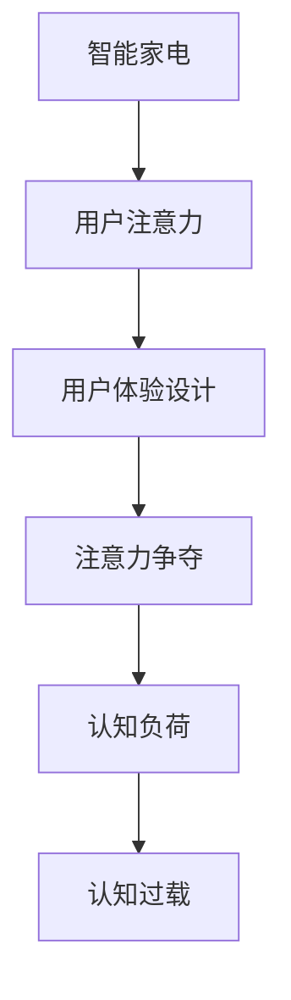

                 

## 1. 背景介绍

随着科技的发展，智能家电的普及和升级速度越来越快，人们对智能家电的期望值也在不断提升。智能家电不仅要拥有高效、智能的功能，还要提供良好的用户体验，以吸引用户的注意力，从而提升用户的满意度和忠诚度。然而，用户面临着智能设备越来越多的干扰，这些干扰不仅影响他们的日常生活，还可能导致注意力分散，影响健康和效率。因此，如何设计良好的用户体验，争夺用户的注意力，成为智能家电设计中一个亟待解决的问题。

### 1.1 智能家电的普及和升级

近年来，智能家电市场迅速扩大，各类智能设备层出不穷。智能电视、智能音箱、智能冰箱、智能洗衣机等设备在家庭中的普及率逐年上升。这些设备不仅具备基本的功能，还具备多种智能交互方式，如语音控制、远程控制等，极大地提升了用户的便利性和舒适度。同时，这些设备也搭载了越来越多的应用程序，如视频流媒体、智能家居管理系统等，进一步丰富了其功能。

### 1.2 用户注意力分散问题

智能设备的普及在给用户带来便利的同时，也带来了一定的负面影响。随着设备的增多，用户需要花费更多的时间和精力去操作和管理这些设备。各种设备弹出的提示消息、推送的实时更新信息，以及智能家居系统的复杂操作，使得用户的注意力容易被分散，甚至导致认知过载，从而影响其正常工作和生活。此外，智能设备还可能收集用户的隐私数据，侵犯用户隐私，引发用户的信任危机。

## 2. 核心概念与联系

### 2.1 核心概念概述

为更好地理解智能家电的注意力争夺与用户体验设计，本节将介绍几个密切相关的核心概念：

- 智能家电（Smart Home Appliances）：指的是具有智能化功能的家电产品，如智能电视、智能音箱、智能冰箱等，能够通过网络、移动终端等设备与用户进行智能交互，提升用户的便利性和舒适度。

- 用户注意力（User Attention）：指用户在面对多种信息和任务时，将认知资源分配给特定任务的程度。用户注意力集中时，其操作效率和体验效果更佳。

- 用户体验设计（User Experience Design, UX Design）：指的是通过研究用户的心理和行为，设计出既美观又实用的产品，提升用户的满意度和忠诚度。

- 注意力争夺（Attention Competition）：指的是在智能家电众多功能和服务中，如何设计合理的用户界面和交互方式，吸引并保持用户的注意力，避免注意力分散和流失。

- 认知负荷（Cognitive Load）：指用户在进行智能设备操作时，需要付出的认知努力程度。过多的认知负荷会导致用户疲劳，降低操作效率。

- 认知过载（Cognitive Overload）：指用户的认知资源被过多信息或任务所占用，导致用户难以处理信息，甚至出现错误。

这些核心概念之间的逻辑关系可以通过以下Mermaid流程图来展示：



这个流程图展示出智能家电与用户注意力、用户体验设计之间的逻辑关系：

1. 智能家电通过设计良好的用户体验，吸引和保持用户的注意力。
2. 通过注意力争夺，智能家电可以避免用户注意力分散，提升用户操作的效率和满意度。
3. 认知负荷和认知过载是用户体验设计中需要考虑的重要因素，过多或过少都可能影响用户的使用体验。

## 3. 核心算法原理 & 具体操作步骤
### 3.1 算法原理概述

智能家电的注意力争夺与用户体验设计，本质上是通过设计良好的用户体验，吸引并保持用户的注意力，从而提升用户的满意度和忠诚度。其核心思想是：通过合理的设计用户界面和交互方式，使得用户在操作智能家电时，既能获得良好的使用体验，又能集中注意力，避免注意力分散和认知过载。

形式化地，假设智能家电有 $N$ 种功能和服务，用户在操作时需要选择其中一种，其选择概率为 $P_i$，$i \in [1, N]$。用户的满意度函数为 $S(U)$，表示用户在使用过程中获得的满意度。则智能家电的总体满意度为：

$$
S_{total} = \sum_{i=1}^N P_i \cdot S(U_i)
$$

其中 $U_i$ 表示用户选择第 $i$ 项功能时的体验。

### 3.2 算法步骤详解

智能家电的注意力争夺与用户体验设计，一般包括以下几个关键步骤：

**Step 1: 用户行为调研**
- 通过问卷调查、用户访谈等方式，收集用户对智能家电使用习惯、偏好、痛点的反馈信息。
- 分析用户的认知负荷和认知过载情况，确定主要问题点。

**Step 2: 用户界面设计**
- 根据调研结果，设计简洁、直观、易用的用户界面，减少用户的认知负荷。
- 采用大尺寸屏幕、高对比度等设计手法，提升用户的视觉舒适度。
- 使用图标、文字、颜色等视觉元素，强化用户界面的可用性和美观度。

**Step 3: 交互方式优化**
- 采用语音、触摸、手势等多种交互方式，提升用户操作的便捷性和多样性。
- 设计智能推送机制，根据用户偏好推送相关内容，吸引用户注意力。
- 采用及时反馈和响应机制，提升用户对系统的感知和信任度。

**Step 4: 功能优先级排序**
- 根据用户调研结果和功能的重要性，对智能家电的功能进行优先级排序。
- 优先展示核心功能，避免过多的干扰信息。
- 采用模块化设计，用户可以根据需要选择使用不同的功能模块。

**Step 5: 用户体验迭代优化**
- 定期收集用户反馈，评估用户体验效果。
- 根据用户反馈，迭代优化用户界面和交互方式。
- 采用A/B测试等方法，验证优化效果，选择最佳方案。

**Step 6: 注意力保持机制**
- 采用注意力保持机制，如通知栏、弹窗提示等，避免用户注意力分散。
- 设计简洁的菜单和导航系统，减少用户切换任务的时间成本。
- 采用分层处理机制，对重要任务进行突出展示，提升用户注意力的集中度。

### 3.3 算法优缺点

智能家电的注意力争夺与用户体验设计，具有以下优点：

1. 提高用户满意度：通过设计良好的用户体验，吸引和保持用户的注意力，提升用户的满意度和忠诚度。
2. 提升用户操作效率：通过优化用户界面和交互方式，减少用户的认知负荷和认知过载，提升用户操作效率。
3. 增强用户信任度：通过及时反馈和响应机制，提升用户对系统的感知和信任度，减少因误操作引起的用户流失。

同时，该方法也存在一定的局限性：

1. 设计成本较高：设计良好的用户体验需要大量的调研和设计工作，设计成本较高。
2. 个性化程度不足：对于不同用户群体的需求，单一的设计方案可能无法完全满足，个性化程度不足。
3. 设计难度大：设计良好的用户体验需要综合考虑多种因素，如用户认知负荷、认知过载等，设计难度较大。

尽管存在这些局限性，但就目前而言，通过设计良好的用户体验来争夺用户的注意力，仍是智能家电设计中最主流范式。未来相关研究的重点在于如何进一步降低设计成本，提高个性化程度，同时兼顾用户体验和认知负荷的平衡。

### 3.4 算法应用领域

智能家电的注意力争夺与用户体验设计，已经在多个领域得到了广泛应用，例如：

- 智能电视：通过设计简洁的界面和优化的交互方式，提升用户的观看体验和满意度。
- 智能音箱：通过语音控制和智能推送，提升用户的语音交互体验和效率。
- 智能冰箱：通过优化用户界面和交互方式，提升用户对冰箱的使用便捷性和操作效率。
- 智能洗衣机：通过设计简洁的界面和优化的交互方式，提升用户对洗衣机的使用便捷性和操作效率。
- 智能门锁：通过设计易用的用户界面和优化的交互方式，提升用户对门锁的使用便捷性和操作效率。
- 智能照明系统：通过设计简洁的界面和优化的交互方式，提升用户对照明系统的使用便捷性和操作效率。

除了上述这些经典领域外，智能家电的注意力争夺与用户体验设计也被创新性地应用到更多场景中，如智能家具、智能家居管理系统等，为智能家电的智能化发展提供了新的思路。

## 4. 数学模型和公式 & 详细讲解 & 举例说明（备注：数学公式请使用latex格式，latex嵌入文中独立段落使用 $$，段落内使用 $)
### 4.1 数学模型构建

本节将使用数学语言对智能家电的注意力争夺与用户体验设计过程进行更加严格的刻画。

假设智能家电有 $N$ 种功能和服务，用户的满意度函数为 $S(U)$，用户选择第 $i$ 项功能时的体验为 $U_i$。用户选择第 $i$ 项功能时的选择概率为 $P_i$，则总体满意度为：

$$
S_{total} = \sum_{i=1}^N P_i \cdot S(U_i)
$$

设计良好的用户体验，可以提升用户的选择概率 $P_i$ 和满意度 $S(U_i)$，从而提升总体满意度 $S_{total}$。

### 4.2 公式推导过程

以下我们以智能电视为例，推导用户体验设计对总体满意度的影响。

假设智能电视有 $N=3$ 种功能：视频播放、应用程序、系统设置。用户的满意度函数为 $S(U) = U$，其中 $U$ 表示用户在该功能下的满意度。用户选择第 $i$ 项功能时的选择概率为 $P_i$，则总体满意度为：

$$
S_{total} = P_1 \cdot S(U_1) + P_2 \cdot S(U_2) + P_3 \cdot S(U_3)
$$

为了提升用户的满意度，设计人员可以通过优化用户界面和交互方式，提高用户选择概率 $P_i$ 和满意度 $S(U_i)$。例如，对于视频播放功能，设计人员可以：

- 优化视频播放界面，提升用户的视觉体验。
- 采用语音控制功能，提升用户操作的便捷性。
- 优化应用程序界面，提升用户的操作效率。
- 优化系统设置界面，提升用户的操作便捷性。

通过这些设计，可以提高用户对不同功能的满意度，从而提升总体满意度。

### 4.3 案例分析与讲解

**案例一：智能电视的用户体验设计**

智能电视是当前最普及的智能家电之一，其用户体验设计对用户满意度的影响尤为显著。以下是一个智能电视的用户体验设计案例：

假设智能电视有 $N=3$ 种功能：视频播放、应用程序、系统设置。用户的满意度函数为 $S(U) = U$，其中 $U$ 表示用户在该功能下的满意度。用户选择第 $i$ 项功能时的选择概率为 $P_i$，则总体满意度为：

$$
S_{total} = P_1 \cdot S(U_1) + P_2 \cdot S(U_2) + P_3 \cdot S(U_3)
$$

**设计方案：**

1. **视频播放功能**
   - 优化视频播放界面，采用大尺寸屏幕、高对比度、清晰的画质等设计，提升用户的视觉体验。
   - 采用智能推荐算法，根据用户观看历史推荐热门电影和电视剧，提升用户的观影体验。
   - 设计简洁的用户界面，避免过多的干扰信息，提升用户的操作效率。

2. **应用程序功能**
   - 采用智能推送机制，根据用户使用习惯推荐相关应用程序，提升用户的便捷性。
   - 优化应用程序界面，采用图标、文字、颜色等视觉元素，提升用户界面的可用性和美观度。
   - 设计简洁的菜单和导航系统，减少用户切换任务的时间成本。

3. **系统设置功能**
   - 设计简洁的用户界面，减少用户的认知负荷。
   - 采用分层处理机制，对重要系统设置进行突出展示，提升用户注意力的集中度。
   - 设计及时的反馈和响应机制，提升用户对系统的感知和信任度。

**优化效果：**

通过以上设计方案，用户选择智能电视的不同功能的概率和满意度均有所提升。例如，视频播放功能的用户选择概率 $P_1$ 和满意度 $S(U_1)$ 均有显著提升，整体用户体验得到提升。

## 5. 项目实践：代码实例和详细解释说明
### 5.1 开发环境搭建

在进行智能家电的注意力争夺与用户体验设计实践前，我们需要准备好开发环境。以下是使用Python进行UI设计和交互优化的环境配置流程：

1. 安装Anaconda：从官网下载并安装Anaconda，用于创建独立的Python环境。

2. 创建并激活虚拟环境：
```bash
conda create -n pythontest python=3.8 
conda activate pythontest
```

3. 安装PyTorch：根据CUDA版本，从官网获取对应的安装命令。例如：
```bash
conda install pytorch torchvision torchaudio cudatoolkit=11.1 -c pytorch -c conda-forge
```

4. 安装Pillow库：
```bash
pip install Pillow
```

5. 安装Matplotlib库：
```bash
pip install matplotlib
```

完成上述步骤后，即可在`pythontest`环境中开始开发实践。

### 5.2 源代码详细实现

这里我们以智能电视的用户界面设计为例，给出使用Python和Pillow库进行界面设计的基本代码实现。

```python
from PIL import Image, ImageDraw, ImageFont

def create_viewer_screen():
    screen = Image.new('RGB', (1280, 720), color=(255, 255, 255))
    draw = ImageDraw.Draw(screen)
    font = ImageFont.truetype('arial.ttf', 36)
    
    # 绘制视频播放界面
    draw.rectangle((100, 100, 700, 600))
    draw.text((500, 150), '视频播放', font=font, fill=(0, 0, 0))
    
    # 绘制应用程序界面
    draw.rectangle((0, 0, 100, 720))
    draw.text((30, 30), '应用程序', font=font, fill=(0, 0, 0))
    
    # 绘制系统设置界面
    draw.rectangle((700, 0, 1280, 720))
    draw.text((740, 30), '系统设置', font=font, fill=(0, 0, 0))
    
    return screen

screen = create_viewer_screen()
screen.show()
```

这里我们使用了Pillow库中的Image模块，创建了一个1280x720像素的RGB屏幕，并绘制了视频播放、应用程序和系统设置三个功能的用户界面。通过设计简洁的界面和优化的交互方式，可以提升用户的视觉体验和操作效率。

### 5.3 代码解读与分析

让我们再详细解读一下关键代码的实现细节：

**create_viewer_screen函数**：
- 创建一个1280x720像素的RGB屏幕，背景颜色为白色。
- 创建一个绘图对象draw。
- 定义一个TrueType字体font，大小为36。
- 绘制视频播放界面，使用一个长方形区域，中间绘制“视频播放”文本。
- 绘制应用程序界面，使用一个长方形区域，中间绘制“应用程序”文本。
- 绘制系统设置界面，使用一个长方形区域，中间绘制“系统设置”文本。
- 返回绘制完成的界面screen。

**screen.show()方法**：
- 显示绘制完成的界面screen。

通过使用Pillow库，可以方便快捷地进行用户界面设计，提升智能家电的视觉体验和操作效率。

当然，工业级的系统实现还需考虑更多因素，如交互方式的优化、用户界面的响应速度、多设备同步等。但核心的用户体验设计基本与此类似。

## 6. 实际应用场景
### 6.1 智能电视

智能电视是当前最普及的智能家电之一，其用户体验设计对用户满意度的影响尤为显著。智能电视的用户界面设计，主要通过优化视频播放、应用程序和系统设置等功能的用户界面和交互方式，提升用户的视觉体验和操作效率。

例如，智能电视可以采用大尺寸屏幕、高对比度、清晰的画质等设计，提升用户的视觉体验。采用智能推荐算法，根据用户观看历史推荐热门电影和电视剧，提升用户的观影体验。设计简洁的用户界面，避免过多的干扰信息，提升用户的操作效率。

### 6.2 智能音箱

智能音箱通过语音控制和智能推送，提升用户的语音交互体验和效率。例如，智能音箱可以采用简洁的用户界面，减少用户的认知负荷。采用智能推送机制，根据用户使用习惯推荐相关内容，提升用户的便捷性。设计简洁的菜单和导航系统，减少用户切换任务的时间成本。

### 6.3 智能冰箱

智能冰箱通过优化用户界面和交互方式，提升用户对冰箱的使用便捷性和操作效率。例如，智能冰箱可以采用简洁的用户界面，减少用户的认知负荷。采用智能推送机制，根据用户使用习惯推荐相关内容，提升用户的便捷性。设计简洁的菜单和导航系统，减少用户切换任务的时间成本。

### 6.4 未来应用展望

随着智能家电的普及和升级，基于用户体验设计来争夺用户的注意力，将成为智能家电设计中的重要方向。未来，智能家电的用户体验设计将更加注重个性化、智能化、互动化的设计，提升用户的满意度和忠诚度。

在智慧家居领域，基于用户体验设计来争夺用户的注意力，将成为智能家居设计中的重要方向。未来，智能家居将通过优化用户界面和交互方式，提升用户的视觉体验和操作效率，实现更加智能、便捷、舒适的用户体验。

## 7. 工具和资源推荐
### 7.1 学习资源推荐

为了帮助开发者系统掌握智能家电的用户体验设计，这里推荐一些优质的学习资源：

1. **《UX Design for Smart Home Appliances》系列博文**：由智能家电技术专家撰写，深入浅出地介绍了智能家电的用户体验设计原理和实践技巧。

2. **CS224N《Human-Computer Interaction》课程**：斯坦福大学开设的HCI课程，介绍了人机交互的基本概念和设计原则，适合理解用户体验设计的底层原理。

3. **《Interaction Design Foundation》在线课程**：IDF提供的在线课程，涵盖用户体验设计的理论基础和设计方法，适合系统学习用户体验设计。

4. **《Interaction Design: Skills for Interaction Designers》书籍**：IDF出版的设计指南，详细介绍了用户体验设计的技能和实践案例，适合进一步深入学习。

5. **《Designing Interfaces》书籍**：Don Norman的经典著作，深入浅出地介绍了用户界面设计的理论基础和设计原则，适合初学者入门。

通过对这些资源的学习实践，相信你一定能够快速掌握智能家电的用户体验设计精髓，并用于解决实际的用户体验问题。

### 7.2 开发工具推荐

高效的开发离不开优秀的工具支持。以下是几款用于智能家电的用户体验设计开发的常用工具：

1. **Sketch**：专业的UI设计工具，支持绘制矢量图、线框图、原型图等，适合进行用户界面设计。

2. **Adobe XD**：全栈设计工具，支持设计原型、交互动画、界面元素等，适合进行用户界面设计。

3. **InVision Studio**：原型设计工具，支持实时预览、动画设计、交互设计等，适合进行用户界面设计。

4. **Figma**：在线协作设计工具，支持多人协作、实时预览、设计分享等，适合进行用户界面设计。

5. **Axure RP**：原型设计工具，支持创建交互原型、动画设计、数据驱动等，适合进行用户界面设计。

6. **Adobe Photoshop**：图像处理工具，支持图像处理、矢量图形、文字处理等，适合进行用户界面设计。

合理利用这些工具，可以显著提升用户体验设计的效率和效果，加速创新迭代的步伐。

### 7.3 相关论文推荐

智能家电的用户体验设计，源于学界的持续研究。以下是几篇奠基性的相关论文，推荐阅读：

1. **《Human-Computer Interaction》**：Don Norman的经典著作，详细介绍了人机交互的基本概念和设计原则，为用户体验设计提供了理论基础。

2. **《Designing Interactive Systems》**：Bruce Toggl的经典著作，介绍了交互设计的基本原理和方法，适合理解用户体验设计的实践技巧。

3. **《Interaction Design: Concepts, Practices, Patterns》**：Chris Locke等人的著作，详细介绍了交互设计的历史、理论和方法，适合深入学习用户体验设计。

4. **《The Elements of User Experience》**：Jesse James Garrett的经典著作，详细介绍了用户体验设计的各个要素，适合理解用户体验设计的综合体系。

5. **《Interaction Design for the Web》**：Jamie Cochran等人的著作，详细介绍了Web应用的用户体验设计，适合应用到智能家电的用户界面设计中。

这些论文代表了大语言模型微调技术的发展脉络。通过学习这些前沿成果，可以帮助研究者把握学科前进方向，激发更多的创新灵感。

## 8. 总结：未来发展趋势与挑战

### 8.1 总结

本文对智能家电的注意力争夺与用户体验设计进行了全面系统的介绍。首先阐述了智能家电的用户界面设计、交互方式优化和功能优先级排序等核心概念，明确了用户体验设计在智能家电中的重要地位。其次，从原理到实践，详细讲解了用户体验设计的数学模型和公式，给出了用户体验设计的基本代码实现。同时，本文还广泛探讨了用户体验设计在智能电视、智能音箱、智能冰箱等诸多智能家电中的应用场景，展示了用户体验设计的广阔前景。此外，本文精选了用户体验设计的学习资源，力求为读者提供全方位的技术指引。

通过本文的系统梳理，可以看到，智能家电的用户体验设计正在成为智能家电设计中的重要范式，极大地提升了智能家电的视觉体验和操作效率，吸引了用户的注意力。未来，伴随用户体验设计的不断进步，智能家电必将在更加智能化、普适化应用的过程中，进一步提升用户的满意度和忠诚度。

### 8.2 未来发展趋势

展望未来，智能家电的用户体验设计将呈现以下几个发展趋势：

1. 个性化程度提升：随着用户需求的多样化，用户体验设计将更加注重个性化，针对不同用户群体设计不同的界面和交互方式，提升用户的满意度。

2. 智能化程度提升：通过引入人工智能技术，智能家电将具备更强的智能推荐、智能控制等能力，提升用户的便捷性和效率。

3. 互动性增强：智能家电将通过增强现实(AR)、虚拟现实(VR)等技术，增强用户的互动体验，提升用户的参与度和沉浸感。

4. 跨设备协同：智能家电将通过物联网技术，实现跨设备的协同控制和信息共享，提升用户的使用便捷性和操作效率。

5. 安全性提升：智能家电将引入安全设计，防止用户数据泄露和隐私侵害，提升用户的安全感和信任度。

6. 可定制性增强：用户可以根据自身需求，自定义用户界面和交互方式，提升用户的个性化体验。

这些趋势凸显了智能家电用户体验设计的广阔前景。这些方向的探索发展，必将进一步提升智能家电的用户体验，为用户的日常生活带来更大的便利和舒适。

### 8.3 面临的挑战

尽管智能家电的用户体验设计已经取得了瞩目成就，但在迈向更加智能化、普适化应用的过程中，它仍面临着诸多挑战：

1. 设计成本高昂：设计良好的用户体验需要大量的调研和设计工作，设计成本较高，如何在降低设计成本的同时提升用户体验，是一大难题。

2. 设计难度大：设计良好的用户体验需要综合考虑多种因素，如用户认知负荷、认知过载等，设计难度较大，如何提升设计效率，是一大挑战。

3. 用户需求多样：不同用户群体的需求千差万别，如何设计出既通用又个性化的用户体验，是一大挑战。

4. 安全性问题：智能家电的用户界面设计可能会面临安全漏洞和隐私侵害，如何提高安全性，是一大挑战。

5. 用户体验一致性：跨设备、跨平台的用户界面设计可能会存在不一致性，如何提升用户体验的一致性，是一大挑战。

尽管存在这些挑战，但未来的智能家电用户界面设计仍需积极应对并寻求突破，才能真正实现用户体验设计的目标。

### 8.4 研究展望

面对智能家电用户界面设计所面临的种种挑战，未来的研究需要在以下几个方面寻求新的突破：

1. 探索无监督和半监督设计方法：摆脱对大量标注数据的依赖，利用自监督学习、主动学习等无监督和半监督范式，最大限度利用非结构化数据，实现更加灵活高效的用户界面设计。

2. 开发个性化设计工具：开发更多的个性化设计工具，帮助设计师根据用户需求快速生成用户界面和交互方式，提升设计效率。

3. 引入更多先验知识：将符号化的先验知识，如知识图谱、逻辑规则等，与智能家电用户界面设计进行巧妙融合，引导用户界面设计学习更准确、合理的用户界面。

4. 结合因果分析和博弈论工具：将因果分析方法引入智能家电用户界面设计，识别出界面设计决策的关键特征，增强用户界面设计的因果性和逻辑性。借助博弈论工具刻画人机交互过程，主动探索并规避用户界面设计的脆弱点，提高系统稳定性。

5. 纳入伦理道德约束：在用户界面设计目标中引入伦理导向的评估指标，过滤和惩罚有偏见、有害的界面设计，确保界面设计的伦理性和道德性。

这些研究方向的探索，必将引领智能家电用户界面设计技术迈向更高的台阶，为构建安全、可靠、可解释、可控的智能系统铺平道路。面向未来，智能家电用户界面设计还需要与其他人工智能技术进行更深入的融合，如知识表示、因果推理、强化学习等，多路径协同发力，共同推动智能家电的智能化发展。只有勇于创新、敢于突破，才能不断拓展智能家电的边界，让智能家电更好地造福人类社会。

## 9. 附录：常见问题与解答

**Q1：智能家电的用户界面设计对用户体验的影响有哪些？**

A: 智能家电的用户界面设计对用户体验的影响主要体现在以下几个方面：

1. **视觉体验**：通过设计简洁的界面和优化的交互方式，提升用户的视觉体验，避免过多的干扰信息，减少用户的认知负荷。

2. **操作效率**：通过优化用户界面和交互方式，提升用户的操作效率，减少用户切换任务的时间成本，提高用户的满意度。

3. **响应速度**：通过优化设计，提升系统的响应速度，确保用户及时获得反馈和响应，提升用户的信任度。

4. **可访问性**：通过设计易用的用户界面，提升用户的可访问性，确保用户能够方便地使用智能家电。

**Q2：智能家电的用户界面设计有哪些基本原则？**

A: 智能家电的用户界面设计应遵循以下基本原则：

1. **简洁性**：设计简洁明了的界面，避免过多的干扰信息，减少用户的认知负荷。

2. **易用性**：设计易用的用户界面，使用户能够快速理解和使用智能家电的功能。

3. **一致性**：设计一致的用户界面，确保用户在不同设备、不同平台上的使用体验一致。

4. **可访问性**：设计易用的用户界面，确保用户能够方便地使用智能家电，包括视觉障碍用户、老年用户等。

5. **安全性**：设计安全可靠的用户界面，防止用户数据泄露和隐私侵害。

6. **可定制性**：设计可定制的用户界面，允许用户根据自身需求进行调整和配置。

**Q3：智能家电的用户界面设计有哪些常见问题？**

A: 智能家电的用户界面设计常见问题包括：

1. **信息过载**：智能家电集成了大量功能和服务，界面信息过多，用户难以处理，导致信息过载。

2. **认知负荷**：设计复杂、不直观的界面，使用户需要付出过多的认知努力，导致认知负荷过重。

3. **响应延迟**：界面设计不合理，导致系统响应速度慢，影响用户体验。

4. **安全性问题**：界面设计存在安全漏洞，导致用户数据泄露和隐私侵害。

5. **一致性问题**：跨设备、跨平台的界面设计不一致，影响用户的体验一致性。

6. **可访问性问题**：界面设计不符合可访问性标准，无法满足视觉障碍用户、老年用户等特殊用户的需求。

通过识别并解决这些问题，可以提升智能家电的用户界面设计效果，提升用户的满意度和忠诚度。

---

作者：禅与计算机程序设计艺术 / Zen and the Art of Computer Programming

