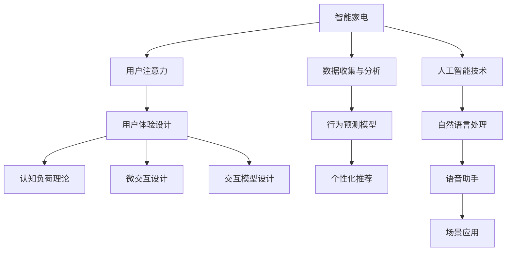

                 

# 智能家电的注意力争夺与用户体验设计

在科技迅猛发展的今天，智能家居产品逐渐进入千家万户，成为现代生活的标配。作为连接人、设备和互联网的重要桥梁，智能家电不仅承载了日常生活的便利性，也承担着用户注意力的争夺重任。如何设计出能真正满足用户需求、提升用户体验的智能家电产品，成为各大企业竞相角逐的焦点。本文将从注意力争夺的视角，深入探讨智能家电的用户体验设计，分析其核心概念、算法原理，并结合实际应用场景，提供具体的实现方案与案例分析。

## 1. 背景介绍

### 1.1 问题由来

随着物联网、人工智能等技术的发展，智能家电产品日益丰富，从智能音箱、智能电视到智能门锁、智能空调，人们的生活节奏和方式被重新定义。然而，尽管智能家电种类繁多，如何吸引用户注意力，提升用户体验，成为了一个亟待解决的问题。对于智能家电企业而言，如何在众多产品中脱颖而出，吸引并留住用户，是其能否取得成功的关键。

### 1.2 问题核心关键点

智能家电争夺用户注意力的关键在于其用户体验设计。优秀的用户体验设计能够使产品具有更高的可操作性、易用性和吸引力，从而更好地满足用户需求，提升用户满意度。然而，用户对智能家电的期望不断提升，如何在有限的时间和注意力资源下，实现对用户注意力的高效管理，成为了一个重要的研究方向。

## 2. 核心概念与联系

### 2.1 核心概念概述

为更好地理解智能家电的用户体验设计，本节将介绍几个关键概念：

- 智能家电：指利用传感器、通信技术、人工智能等手段，能够实现自动化、智能化操作的家用电器，如智能冰箱、智能空调、智能电视等。
- 用户注意力：指用户在使用产品时，对产品的关注度和投入精力的程度，通常体现在对产品的点击、浏览、操作等行为上。
- 用户体验设计（User Experience Design, UXD）：指通过研究用户行为、需求和心理，设计符合用户期望的产品界面和交互方式，从而提升用户满意度和忠诚度。
- 认知负荷理论（Cognitive Load Theory, CLT）：提出在信息处理过程中，认知负荷对用户操作和理解能力的限制，强调设计要尽量减轻用户认知负荷，提升操作效率。
- 微交互设计（Micro-interactions）：强调在用户与产品的每一个瞬间接触中的设计细节，通过微小的设计动作和反馈，增强用户的心理满足感和体验感。
- 交互模型设计（Interaction Model Design）：指对用户与产品之间的交互方式进行系统化设计，使得操作更加自然流畅。

这些核心概念之间的逻辑关系可以通过以下Mermaid流程图来展示：



这个流程图展示了智能家电用户体验设计的核心概念及其之间的关系：

1. 智能家电通过与用户的交互，获取注意力。
2. 通过用户体验设计，提升用户对产品的关注度和满意度。
3. 认知负荷理论指导设计，减轻用户认知负荷，提升操作效率。
4. 微交互设计注重细节，增强用户的心理满足感和体验感。
5. 交互模型设计优化操作流程，提升自然流畅度。
6. 数据收集与分析为设计提供数据支持。
7. 人工智能技术提供强大的计算和预测能力，支持个性化推荐和智能操作。
8. 自然语言处理和语音助手技术，提升了人机交互的自然度和便利性。
9. 场景应用将产品置于用户实际使用场景中，进一步提升用户体验。

## 3. 核心算法原理 & 具体操作步骤

### 3.1 算法原理概述

智能家电的用户体验设计，本质上是利用人工智能技术和数据分析方法，优化用户与产品的交互过程，提升用户满意度和忠诚度。这一过程涉及多个核心算法，包括用户行为预测、个性化推荐、智能交互等。

### 3.2 算法步骤详解

#### 3.2.1 用户行为预测模型

用户行为预测模型的目的是通过分析用户的历史数据，预测其在未来的行为和需求，从而为用户提供个性化的服务和推荐。

**Step 1: 数据收集与预处理**
收集用户使用家电的相关数据，如开关时间、温度设置、观看视频类型等，通过数据清洗、特征工程等步骤，准备用于建模的数据集。

**Step 2: 特征提取与选择**
使用特征工程技术，提取有意义的特征，如时间特征、温度特征、观看时长等，选择对用户行为预测有显著影响的特征。

**Step 3: 模型训练与评估**
选择适当的机器学习算法（如随机森林、神经网络等），在历史数据集上进行模型训练，评估模型的预测性能。

**Step 4: 模型优化与部署**
根据评估结果，优化模型参数，提升预测精度。将训练好的模型部署到智能家电中，实时预测用户行为。

#### 3.2.2 个性化推荐算法

个性化推荐算法通过分析用户的行为数据，为每位用户推荐其感兴趣的内容或功能，从而提升用户体验。

**Step 1: 数据收集与预处理**
收集用户的行为数据，如浏览历史、购买记录、使用偏好等，通过数据清洗、特征工程等步骤，准备用于推荐的数据集。

**Step 2: 特征提取与选择**
使用特征工程技术，提取有意义的特征，如浏览时长、购买频率、使用场景等，选择对推荐效果有显著影响的特征。

**Step 3: 模型训练与评估**
选择适当的机器学习算法（如协同过滤、深度学习等），在历史数据集上进行模型训练，评估推荐算法的性能。

**Step 4: 推荐系统优化**
根据评估结果，优化模型参数，提升推荐效果。将训练好的推荐模型部署到智能家电中，实时推荐个性化内容。

#### 3.2.3 智能交互技术

智能交互技术通过自然语言处理和语音识别技术，实现人与家电之间的自然语言交互，提升用户体验。

**Step 1: 语音识别与自然语言处理**
使用语音识别技术，将用户的语音指令转换为文本，使用自然语言处理技术，解析用户的意图和需求。

**Step 2: 智能决策与执行**
根据用户的意图和需求，通过决策树、神经网络等算法，做出智能决策，并控制家电执行相应的操作。

**Step 3: 用户反馈与优化**
通过用户反馈，持续优化智能决策模型，提升交互效果。

### 3.3 算法优缺点

智能家电用户体验设计的算法有以下优点：

1. 个性化推荐：通过用户行为数据，提供个性化的内容和功能，提升用户体验。
2. 实时预测：实时预测用户行为，及时调整操作，提升操作效率。
3. 自然语言交互：通过自然语言处理和语音识别技术，提升人机交互的自然度和便利性。

同时，该算法也存在以下局限性：

1. 数据隐私：用户行为数据涉及隐私，数据收集和处理需符合法律法规。
2. 模型偏差：模型可能存在偏差，影响预测和推荐的准确性。
3. 计算复杂度：数据量较大时，模型训练和推理的计算复杂度较高。
4. 用户适应性：用户习惯和行为的变化，可能影响模型的持续有效性。

尽管存在这些局限性，但就目前而言，基于人工智能和数据分析的用户体验设计算法，仍是大规模智能家电产品的核心技术手段。未来相关研究的重点在于如何进一步提高算法的准确性、鲁棒性和可解释性，同时兼顾用户隐私和计算效率等因素。

### 3.4 算法应用领域

基于智能家电用户体验设计的算法，已经在智能音箱、智能电视、智能冰箱等多个领域得到了广泛的应用，具体如下：

1. **智能音箱**：通过语音识别和自然语言处理，实现与用户的自然语言交互，提供查询信息、播放音乐、控制家电等功能。

2. **智能电视**：通过数据分析和个性化推荐，为用户推荐感兴趣的影视内容，提升用户观看体验。

3. **智能冰箱**：通过数据分析，预测用户的食物需求和购买行为，推荐食品清单和购买建议。

4. **智能空调**：通过数据分析和用户行为预测，自动调整温度和模式，提升用户舒适度和节能效果。

5. **智能门锁**：通过数据分析和用户行为预测，自动控制门锁状态，提升家庭安全性。

这些应用场景展示了智能家电用户体验设计的广泛前景，为提升用户生活质量提供了新的可能。

## 4. 数学模型和公式 & 详细讲解 & 举例说明

### 4.1 数学模型构建

本节将使用数学语言对智能家电用户体验设计的算法进行更加严格的刻画。

假设智能家电系统收集到用户行为数据 $X=\{x_i\}_{i=1}^N$，其中 $x_i$ 为用户在某一时间点的行为特征，如温度、观看时长等。系统目标是为每个用户 $u$ 预测其未来的行为 $y_u$，推荐个性化内容 $c_u$，实现智能交互 $i_u$。

定义用户行为预测模型的训练目标函数为：

$$
\min_{\theta} \sum_{i=1}^N \ell(y_i, \hat{y}_i)
$$

其中 $\theta$ 为模型的参数，$\ell$ 为损失函数，$\hat{y}_i$ 为模型对用户行为 $x_i$ 的预测值。

### 4.2 公式推导过程

以用户行为预测为例，使用随机森林算法进行建模和预测。随机森林算法通过随机选择样本和特征，构建多个决策树，并通过投票等方式综合预测结果，减少模型的过拟合风险。

假设使用随机森林算法，将用户行为数据 $X$ 划分为 $M$ 个特征子集 $F_m$，每个子集包含 $d$ 个特征 $f_{mj}$，通过 $n$ 次随机抽样，构建 $n$ 个决策树模型。

对于每个用户 $u$，预测其未来的行为 $y_u$，使用公式：

$$
\hat{y}_u = \frac{1}{n} \sum_{i=1}^n \hat{y}_u^{(i)}
$$

其中 $\hat{y}_u^{(i)}$ 为第 $i$ 次随机抽样得到的预测值。

在得到用户行为预测结果后，通过个性化推荐算法和智能交互技术，进一步提升用户体验。

### 4.3 案例分析与讲解

以智能冰箱为例，展示基于用户行为预测的个性化推荐和智能交互设计。

**Step 1: 数据收集与预处理**
智能冰箱通过传感器和数据收集设备，获取用户的使用数据，如开关时间、温度设置、食物消耗量等。通过数据清洗、特征提取等步骤，准备用于建模的数据集。

**Step 2: 用户行为预测**
使用随机森林算法，构建用户行为预测模型，预测用户未来的食物需求和购买行为。

**Step 3: 个性化推荐**
根据用户行为预测结果，推荐相关食品清单和购买建议，如水果、蔬菜等。

**Step 4: 智能交互**
通过自然语言处理技术，接收用户语音指令，解析用户意图，控制冰箱执行相应的操作，如温度调节、自动提醒购买等。

## 5. 项目实践：代码实例和详细解释说明

### 5.1 开发环境搭建

在进行智能家电用户体验设计实践前，我们需要准备好开发环境。以下是使用Python进行TensorFlow开发的环境配置流程：

1. 安装Anaconda：从官网下载并安装Anaconda，用于创建独立的Python环境。

2. 创建并激活虚拟环境：
```bash
conda create -n tf-env python=3.8 
conda activate tf-env
```

3. 安装TensorFlow：根据CUDA版本，从官网获取对应的安装命令。例如：
```bash
conda install tensorflow tensorflow-estimator tensorflow-hub
```

4. 安装各类工具包：
```bash
pip install numpy pandas scikit-learn matplotlib tqdm jupyter notebook ipython
```

完成上述步骤后，即可在`tf-env`环境中开始实践。

### 5.2 源代码详细实现

这里我们以智能冰箱的用户行为预测为例，给出使用TensorFlow进行建模的Python代码实现。

首先，定义随机森林模型：

```python
import tensorflow as tf
from tensorflow import feature_column
from tensorflow.keras import layers
from sklearn.model_selection import train_test_split

def build_model(features, labels):
    feature_columns = [feature_column.numeric_column('feature_1'), feature_column.numeric_column('feature_2')]
    
    dnn = layers.DenseFeatures(feature_columns)
    dnn_out = dnn(features)
    
    model = tf.keras.Sequential([
        layers.Dense(64, activation='relu', input_shape=(len(feature_columns),)),
        layers.Dense(32, activation='relu'),
        layers.Dense(1)
    ])
    model.compile(optimizer='adam', loss='mse', metrics=['mae'])
    
    return model
```

然后，加载并预处理数据集：

```python
import pandas as pd

data = pd.read_csv('data.csv')

train_data, test_data = train_test_split(data, test_size=0.2)
train_features, train_labels = train_data.drop('label', axis=1), train_data['label']
test_features, test_labels = test_data.drop('label', axis=1), test_data['label']
```

接着，训练和评估模型：

```python
model = build_model(train_features, train_labels)

model.fit(train_features, train_labels, epochs=10, validation_data=(test_features, test_labels))
```

最后，进行模型预测和评估：

```python
test_predictions = model.predict(test_features)
```

以上就是使用TensorFlow对智能冰箱用户行为预测进行建模的完整代码实现。可以看到，通过TensorFlow的强大计算能力，我们能够高效地构建和训练随机森林模型，实现用户行为预测的目标。

### 5.3 代码解读与分析

让我们再详细解读一下关键代码的实现细节：

**build_model函数**：
- `feature_columns`：定义输入特征，如温度、开关时间等。
- `dnn_out`：将输入特征通过多层全连接层，输出模型预测结果。
- `model`：定义模型结构，包含多层全连接层和输出层。
- `model.compile`：配置模型优化器、损失函数和评估指标。
- `return model`：返回训练好的模型。

**数据加载与预处理**：
- `pd.read_csv`：从CSV文件中读取数据。
- `train_test_split`：将数据集划分为训练集和测试集。
- `train_features`、`train_labels`、`test_features`、`test_labels`：分别提取训练集和测试集的特征和标签。

**模型训练与评估**：
- `model.fit`：使用训练集进行模型训练，设定迭代轮数为10轮。
- `test_predictions`：使用测试集进行模型预测。

可以看到，TensorFlow提供了丰富的API和工具，能够方便地进行机器学习模型的构建和训练。开发者可以快速上手，实现各种复杂的算法和模型。

当然，工业级的系统实现还需考虑更多因素，如模型保存和部署、超参数优化、分布式训练等。但核心的用户体验设计思想基本与此类似。

## 6. 实际应用场景

### 6.1 智能音箱

智能音箱是智能家电体验设计的典型应用之一。用户可以通过语音指令控制音箱播放音乐、查询天气、控制家电等，提升生活便利性。

**Step 1: 语音识别**
使用语音识别技术，将用户的语音指令转换为文本，解析用户的意图和需求。

**Step 2: 个性化推荐**
根据用户的历史播放记录，推荐相关音乐和播客。

**Step 3: 智能决策与执行**
通过决策树、神经网络等算法，控制音箱播放相应的内容，提供实时互动。

### 6.2 智能电视

智能电视通过数据分析和个性化推荐，为用户推荐感兴趣的影视内容，提升观看体验。

**Step 1: 数据收集与预处理**
收集用户观看历史数据，如观看时长、观看频率等，通过数据清洗、特征工程等步骤，准备用于建模的数据集。

**Step 2: 用户行为预测**
使用协同过滤、深度学习等算法，构建用户行为预测模型，预测用户未来的观看需求。

**Step 3: 个性化推荐**
根据用户行为预测结果，推荐相关影视内容。

**Step 4: 智能交互**
通过自然语言处理技术，接收用户语音指令，解析用户意图，控制电视执行相应的操作，如播放、暂停、搜索等。

### 6.3 智能冰箱

智能冰箱通过数据分析，预测用户的食物需求和购买行为，推荐食品清单和购买建议。

**Step 1: 数据收集与预处理**
智能冰箱通过传感器和数据收集设备，获取用户的使用数据，如开关时间、温度设置、食物消耗量等，通过数据清洗、特征提取等步骤，准备用于建模的数据集。

**Step 2: 用户行为预测**
使用随机森林算法，构建用户行为预测模型，预测用户未来的食物需求和购买行为。

**Step 3: 个性化推荐**
根据用户行为预测结果，推荐相关食品清单和购买建议，如水果、蔬菜等。

**Step 4: 智能交互**
通过自然语言处理技术，接收用户语音指令，解析用户意图，控制冰箱执行相应的操作，如温度调节、自动提醒购买等。

### 6.4 未来应用展望

随着智能家电用户体验设计的不断深入，未来将会在更多领域得到应用，为家庭生活带来变革性影响。

在智慧医疗领域，基于智能家电的用户体验设计，可以实现健康监测、远程医疗等功能，提升医疗服务的便利性和效率。

在智能家居领域，通过数据分析和个性化推荐，智能家电可以更好地适应用户需求，提供更智能、更舒适的生活环境。

在智慧办公领域，智能家电可以与办公系统集成，实现智能办公、智能会议等功能，提升办公效率和体验。

此外，在智慧农业、智能交通、智能制造等多个领域，智能家电用户体验设计也将带来新的应用场景，推动各行各业的数字化转型升级。

## 7. 工具和资源推荐

### 7.1 学习资源推荐

为了帮助开发者系统掌握智能家电用户体验设计的理论基础和实践技巧，这里推荐一些优质的学习资源：

1. 《交互设计基础》书籍：系统介绍了用户体验设计的原则和实践方法，适合入门读者。

2. 《用户界面设计》课程：斯坦福大学开设的UI设计课程，涵盖了用户体验设计的核心内容，适合进阶读者。

3. 《认知负荷理论》书籍：介绍认知负荷理论的基本概念和应用，适合深入理解认知负荷对用户体验的影响。

4. 《机器学习实战》书籍：通过实际案例，介绍了多种机器学习算法和工具，适合动手实践。

5. 《自然语言处理基础》课程：清华大学的自然语言处理课程，系统讲解了NLP的基本知识和算法，适合计算机科学专业的学生。

通过学习这些资源，相信你一定能够快速掌握智能家电用户体验设计的精髓，并用于解决实际的NLP问题。

### 7.2 开发工具推荐

高效的开发离不开优秀的工具支持。以下是几款用于智能家电用户体验设计开发的常用工具：

1. TensorFlow：基于Python的开源深度学习框架，适合构建和训练复杂的机器学习模型。

2. PyTorch：基于Python的开源深度学习框架，灵活的计算图机制，适合快速迭代研究。

3. Jupyter Notebook：开源的Jupyter Notebook环境，支持Python、R等语言，适合数据处理、模型训练和可视化。

4. Tableau：商业化的数据可视化工具，支持复杂的数据分析和可视化，适合数据分析和展示。

5. Kibana：开源的日志和数据可视化平台，支持实时监控和告警，适合监控系统指标。

合理利用这些工具，可以显著提升智能家电用户体验设计的开发效率，加快创新迭代的步伐。

### 7.3 相关论文推荐

智能家电用户体验设计的相关研究主要集中在用户体验设计、人机交互、自然语言处理等领域。以下是几篇奠基性的相关论文，推荐阅读：

1. "Human-Computer Interaction Design Principles"（人机交互设计原则）：人机交互领域的经典著作，介绍了用户体验设计的核心原则和实践方法。

2. "User Interface Design for Smartphones: Interaction and Usability"（智能手机的用户体验设计）：介绍智能手机的人机交互设计和用户体验设计方法，适合移动设备领域的学习者。

3. "Cognitive Load Theory"（认知负荷理论）：提出认知负荷对用户信息处理的影响，强调设计要减轻用户认知负荷。

4. "Natural Language Understanding"（自然语言理解）：介绍自然语言处理的基本技术和应用，适合自然语言处理领域的学习者。

5. "Interactive Information Display Systems"（交互式信息显示系统）：介绍交互式信息显示系统的设计方法和应用，适合人机交互领域的学习者。

这些论文代表了大规模智能家电用户体验设计的理论发展脉络，通过学习这些前沿成果，可以帮助研究者把握学科前进方向，激发更多的创新灵感。

## 8. 总结：未来发展趋势与挑战

### 8.1 总结

本文对智能家电用户体验设计的关键算法和具体操作步骤进行了全面系统的介绍。首先阐述了智能家电用户体验设计的研究背景和意义，明确了用户体验设计在智能家电产品中的核心地位。其次，从算法原理到具体实现，详细讲解了用户行为预测、个性化推荐、智能交互等核心算法，提供了具体的实现方案与案例分析。

通过本文的系统梳理，可以看到，智能家电用户体验设计的关键在于如何通过人工智能和数据分析技术，优化用户与产品的交互过程，提升用户满意度和忠诚度。这一过程涉及多个关键算法，如用户行为预测、个性化推荐、智能交互等，需要在算法、数据、系统等多个维度进行全面优化。

### 8.2 未来发展趋势

展望未来，智能家电用户体验设计将呈现以下几个发展趋势：

1. 个性化推荐：基于大数据和深度学习，为用户推荐更加精准的内容和功能，提升用户体验。
2. 实时预测：通过实时数据分析，及时调整产品功能，提升操作效率。
3. 自然语言交互：通过自然语言处理和语音识别技术，提升人机交互的自然度和便利性。
4. 场景应用：将产品置于用户实际使用场景中，进一步提升用户体验。

以上趋势凸显了智能家电用户体验设计的广阔前景。这些方向的探索发展，必将进一步提升智能家电产品的性能和应用范围，为家庭生活带来新的便利和体验。

### 8.3 面临的挑战

尽管智能家电用户体验设计已经取得了瞩目成就，但在迈向更加智能化、普适化应用的过程中，它仍面临着诸多挑战：

1. 数据隐私：用户行为数据涉及隐私，数据收集和处理需符合法律法规。
2. 模型偏差：模型可能存在偏差，影响预测和推荐的准确性。
3. 计算复杂度：数据量较大时，模型训练和推理的计算复杂度较高。
4. 用户适应性：用户习惯和行为的变化，可能影响模型的持续有效性。

尽管存在这些挑战，但就目前而言，基于人工智能和数据分析的用户体验设计算法，仍是大规模智能家电产品的核心技术手段。未来相关研究的重点在于如何进一步提高算法的准确性、鲁棒性和可解释性，同时兼顾用户隐私和计算效率等因素。

### 8.4 研究展望

面对智能家电用户体验设计所面临的种种挑战，未来的研究需要在以下几个方面寻求新的突破：

1. 探索无监督和半监督推荐方法。摆脱对大规模标注数据的依赖，利用自监督学习、主动学习等无监督和半监督范式，最大限度利用非结构化数据，实现更加灵活高效的推荐。

2. 研究参数高效和计算高效的推荐算法。开发更加参数高效的推荐方法，在固定大部分预训练参数的同时，只更新极少量的任务相关参数。同时优化推荐模型的计算图，减少前向传播和反向传播的资源消耗，实现更加轻量级、实时性的部署。

3. 引入因果分析和博弈论工具。通过引入因果推断和博弈论思想，增强推荐模型建立稳定因果关系的能力，学习更加普适、鲁棒的语言表征，从而提升模型泛化性和抗干扰能力。

4. 结合认知负荷理论和心理学研究。将心理学研究成果引入推荐系统设计，通过减轻用户认知负荷，提升推荐系统的易用性和用户体验。

这些研究方向的探索，必将引领智能家电用户体验设计的技术发展，为智能家电产品的优化和创新提供新的方向。面向未来，智能家电用户体验设计需要与其他人工智能技术进行更深入的融合，如知识表示、因果推理、强化学习等，多路径协同发力，共同推动智能家电产品的进步。

## 9. 附录：常见问题与解答

**Q1: 智能家电用户体验设计中如何减轻用户认知负荷？**

A: 减轻用户认知负荷是提升用户体验的重要手段。主要可以从以下几个方面入手：

1. 简化操作流程：设计简洁明了的用户界面，减少操作步骤，让用户能够快速完成任务。
2. 提供智能提示：通过自然语言处理技术，智能推荐下一步操作，减轻用户决策负担。
3. 优化反馈机制：提供及时、清晰的反馈，让用户能够快速了解操作结果，增强信心。

**Q2: 智能家电用户体验设计中如何提升个性化推荐效果？**

A: 提升个性化推荐效果的关键在于模型的训练和优化：

1. 数据收集与预处理：收集用户行为数据，进行数据清洗和特征工程，提取有意义的特征。
2. 选择合适的算法：根据任务特点，选择协同过滤、深度学习等合适的推荐算法。
3. 优化模型参数：通过交叉验证等方法，优化模型参数，提升推荐效果。
4. 引入新数据：定期更新模型，引入新数据，提升模型持续有效性。

**Q3: 智能家电用户体验设计中如何实现智能交互？**

A: 实现智能交互的关键在于自然语言处理和语音识别技术的融合：

1. 语音识别：使用语音识别技术，将用户的语音指令转换为文本，解析用户的意图和需求。
2. 自然语言处理：使用自然语言处理技术，解析用户指令，生成相应操作。
3. 智能决策：通过决策树、神经网络等算法，做出智能决策，控制家电执行相应的操作。
4. 用户反馈：通过用户反馈，持续优化智能决策模型，提升交互效果。

**Q4: 智能家电用户体验设计中如何保障用户隐私？**

A: 保障用户隐私是用户体验设计的关键因素：

1. 数据匿名化：对用户数据进行匿名化处理，保护用户隐私。
2. 数据最小化：只收集必要的数据，避免过度收集。
3. 数据加密：对数据进行加密存储和传输，防止数据泄露。
4. 合规审查：定期进行隐私合规审查，确保符合法律法规。

通过保障用户隐私，构建可信赖的智能家电产品，才能获得用户的信任和支持。

通过本文的系统梳理，可以看到，智能家电用户体验设计是一个涉及多个学科领域的多维交叉课题，需要从算法、数据、系统等多个维度进行全面优化。只有在各个环节都做到最优，才能真正实现智能家电产品的用户需求和体验设计，为家庭生活带来便捷和舒适。

---

作者：禅与计算机程序设计艺术 / Zen and the Art of Computer Programming

