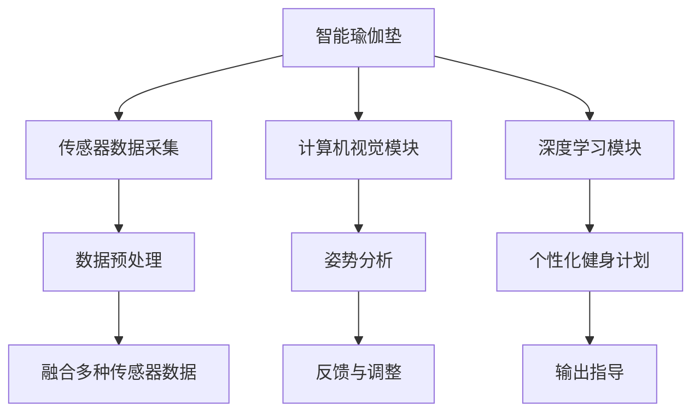

                 

# 智能瑜伽垫创业：个人健身教练的替代品

> 关键词：智能瑜伽垫,人工智能,健身教练,个人健身,商业化

## 1. 背景介绍

在当今快节奏的生活中，人们越来越注重身体健康和心理健康。健身房作为提供综合健身服务的主要场所，对于寻求专业健身指导的消费者来说，已经成为了不可或缺的一部分。然而，传统健身教练的昂贵费用和长期依赖性使得很多人望而却步。为了打破这一瓶颈，一种新型的健身解决方案应运而生：智能瑜伽垫。

智能瑜伽垫结合了人工智能和大数据分析技术，能够根据用户的使用数据生成个性化的健身计划和指导，而无需传统健身教练的介入。这种创新模式不仅降低了消费者的健身成本，还为健身行业带来了新的增长点。本文将深入探讨智能瑜伽垫的核心原理、实现方法和实际应用。

## 2. 核心概念与联系

### 2.1 核心概念概述

为了更好地理解智能瑜伽垫的工作原理，本节将介绍几个核心概念：

- **智能瑜伽垫**：一种集成了传感器、摄像头、通信模块和人工智能算法的瑜伽垫，能够实时监测用户的姿势、心率、呼吸频率等参数，并结合人工智能技术提供个性化的健身建议和指导。

- **人工智能(AI)**：涉及计算机科学的广泛领域，包括机器学习、深度学习、自然语言处理、计算机视觉等。智能瑜伽垫利用AI技术进行数据分析和模型训练，从而实现智能化健身指导。

- **深度学习(DL)**：一种机器学习技术，通过多层神经网络模拟人脑处理信息的方式，用于图像识别、自然语言处理等任务。智能瑜伽垫常使用深度学习算法来处理用户数据和生成个性化健身计划。

- **计算机视觉(CV)**：专注于使计算机“看”和理解图像的领域。智能瑜伽垫通过摄像头捕捉用户的动作，利用计算机视觉技术进行姿势分析。

- **传感器融合**：将不同类型的传感器数据进行集成和处理，以提高测量精度和系统可靠性。智能瑜伽垫利用多种传感器，通过传感器融合技术，获取用户更全面的健身数据。

这些核心概念共同构成了智能瑜伽垫的技术框架，使其能够精准监测用户行为，并提供科学、个性化的健身建议。

### 2.2 核心概念原理和架构的 Mermaid 流程图



该流程图展示了智能瑜伽垫的架构：

1. **传感器数据采集**：通过多种传感器（如加速度计、陀螺仪、摄像头）采集用户的数据。
2. **数据预处理**：对采集到的原始数据进行去噪、归一化等处理。
3. **计算机视觉模块**：利用摄像头捕捉用户的瑜伽动作，并进行姿势分析。
4. **深度学习模块**：通过深度学习算法，对姿势数据进行分析，生成个性化的健身建议。
5. **融合多种传感器数据**：将多种传感器数据进行集成，提高测量精度和系统可靠性。
6. **反馈与调整**：根据用户反馈调整健身计划和指导。
7. **输出指导**：通过声音、震动等形式向用户提供实时的健身指导。

这些组件相互作用，构成了智能瑜伽垫的核心功能。

## 3. 核心算法原理 & 具体操作步骤

### 3.1 算法原理概述

智能瑜伽垫的核心算法原理基于深度学习和计算机视觉技术，其基本流程如下：

1. **数据采集**：通过传感器采集用户的位置、心率、呼吸频率等生理参数，通过摄像头捕捉用户的瑜伽姿势。
2. **数据预处理**：对采集到的数据进行清洗和归一化，去除噪声和异常值。
3. **特征提取**：利用深度学习算法从图像和生理数据中提取关键特征。
4. **模型训练**：使用历史数据训练深度学习模型，以识别正确的瑜伽姿势。
5. **姿势分析**：根据模型对用户的当前姿势进行分析和评估。
6. **个性化健身计划生成**：根据用户的身体状况和健身目标，生成个性化的健身计划。
7. **实时反馈与调整**：根据用户的反馈和实际表现，实时调整健身计划和指导。

### 3.2 算法步骤详解

以下是智能瑜伽垫的具体实现步骤：

1. **传感器集成**：将多种传感器（如加速度计、陀螺仪、摄像头）集成到瑜伽垫中，确保数据的准确性和全面性。
2. **数据采集与预处理**：使用Python和相关库（如TensorFlow、OpenCV）实现数据采集和预处理。
3. **计算机视觉模块**：使用深度学习框架（如PyTorch、Keras）实现计算机视觉模块，利用YOLO、SSD等算法进行姿势分析。
4. **深度学习模型训练**：在数据集上进行模型训练，优化神经网络结构，确保模型的准确性和泛化能力。
5. **用户数据收集与分析**：通过用户交互界面，收集用户的基本信息、偏好和反馈。
6. **个性化健身计划生成**：根据用户数据，生成个性化的健身计划和指导。
7. **用户反馈与系统调整**：根据用户反馈，不断优化模型和算法，提高系统的适应性和用户体验。

### 3.3 算法优缺点

智能瑜伽垫的算法具有以下优点：

1. **个性化指导**：通过深度学习和计算机视觉技术，提供个性化的健身计划和指导，满足不同用户的需求。
2. **低成本**：无需传统健身教练的介入，大幅降低了健身成本。
3. **高效率**：实时监测和反馈，提升用户的锻炼效率和体验。

同时，算法也存在一些局限性：

1. **数据隐私问题**：用户数据的安全性和隐私保护是重要问题，需要采用严格的加密和数据管理措施。
2. **模型泛化能力**：深度学习模型对数据质量和多样性的要求较高，模型泛化能力有限。
3. **技术门槛**：算法实现需要较高的技术门槛，非专业用户难以自主开发和维护。

### 3.4 算法应用领域

智能瑜伽垫的算法主要应用于以下几个领域：

1. **家庭健身**：在家中通过智能瑜伽垫进行自我锻炼，不需要前往健身房。
2. **企业福利**：作为企业员工福利，提升员工的身体健康和幸福感。
3. **线上健身平台**：与线上健身平台结合，提供个性化健身指导和实时反馈。
4. **运动康复**：结合运动康复专家的建议，为需要康复的病患提供科学的健身指导。

## 4. 数学模型和公式 & 详细讲解 & 举例说明

### 4.1 数学模型构建

智能瑜伽垫的数学模型构建主要基于深度学习和计算机视觉技术。以下是一个基本的数学模型框架：

1. **传感器数据表示**：$X = \{x_1, x_2, ..., x_n\}$，其中 $x_i$ 表示第 $i$ 个传感器的数据。
2. **计算机视觉数据表示**：$Y = \{y_1, y_2, ..., y_m\}$，其中 $y_i$ 表示第 $i$ 帧视频数据。
3. **深度学习模型表示**：$Z = f(X, W)$，其中 $f$ 为深度学习模型，$W$ 为模型参数。
4. **姿势评分函数**：$S(Y, Z) = \sum_{i=1}^m s(y_i, z_i)$，其中 $s$ 为评分函数。
5. **个性化健身计划生成函数**：$P(X, Y, S) = g(X, Y, S, \theta)$，其中 $\theta$ 为用户偏好和目标参数。

### 4.2 公式推导过程

以姿势评分函数为例，其推导过程如下：

假设每个传感器数据 $x_i$ 可以被表示为一个 $d$ 维向量，每个视频帧 $y_i$ 可以被表示为一个 $n$ 维向量。深度学习模型 $f$ 可以将传感器数据映射为一个 $m$ 维的表示 $z_i$。

姿势评分函数 $S(Y, Z)$ 可以定义为：

$$
S(Y, Z) = \sum_{i=1}^m s(y_i, z_i)
$$

其中 $s(y_i, z_i)$ 为对第 $i$ 帧视频数据 $y_i$ 和深度学习模型输出的表示 $z_i$ 的评分。

评分函数 $s(y_i, z_i)$ 可以是一个简单的欧几里得距离，也可以是一个复杂的神经网络模型。例如，可以使用神经网络模型将 $y_i$ 和 $z_i$ 映射为一个标量，然后计算其绝对差值。

### 4.3 案例分析与讲解

假设我们有一个智能瑜伽垫系统，使用了三个传感器：加速度计、陀螺仪和摄像头。系统采集到了用户在一小时内的位置、心率和呼吸频率等数据，同时摄像头捕捉到了用户的瑜伽姿势。

系统通过深度学习模型 $f$ 将这些传感器数据转换为一个 $m$ 维的表示 $Z$。假设 $Z$ 中的每个元素 $z_i$ 表示用户在第 $i$ 个时间点的状态。

姿势评分函数 $S(Y, Z)$ 可以定义如下：

$$
S(Y, Z) = \sum_{i=1}^m s(y_i, z_i)
$$

其中 $s(y_i, z_i)$ 可以是一个简单的评分函数，例如：

$$
s(y_i, z_i) = \min(\frac{|y_i - z_i|}{\epsilon}, 1)
$$

其中 $\epsilon$ 为一个小的常数，避免评分函数取值为无穷大。

通过评分函数 $s(y_i, z_i)$，系统可以对用户的瑜伽姿势进行评分，进而生成个性化的健身计划和指导。

## 5. 项目实践：代码实例和详细解释说明

### 5.1 开发环境搭建

在进行智能瑜伽垫的开发实践前，我们需要准备好开发环境。以下是使用Python进行PyTorch开发的环境配置流程：

1. 安装Anaconda：从官网下载并安装Anaconda，用于创建独立的Python环境。

2. 创建并激活虚拟环境：
```bash
conda create -n yoga-env python=3.8 
conda activate yoga-env
```

3. 安装PyTorch：根据CUDA版本，从官网获取对应的安装命令。例如：
```bash
conda install pytorch torchvision torchaudio cudatoolkit=11.1 -c pytorch -c conda-forge
```

4. 安装相关库：
```bash
pip install numpy pandas scikit-learn matplotlib opencv-python tqdm jupyter notebook ipython
```

5. 安装相关模型和工具：
```bash
pip install torchvision yolov3 tensorflow
```

完成上述步骤后，即可在`yoga-env`环境中开始开发实践。

### 5.2 源代码详细实现

下面我们以计算机视觉模块的实现为例，给出使用PyTorch和OpenCV进行智能瑜伽垫开发的PyTorch代码实现。

首先，定义计算机视觉模块的类：

```python
import cv2
import numpy as np
from torchvision import models

class ComputerVisionModule:
    def __init__(self):
        self.model = models.resnet50(pretrained=True)
        self.model.fc = nn.Linear(2048, 2)
        self.model.eval()

    def preprocess(self, img):
        img = cv2.cvtColor(img, cv2.COLOR_BGR2RGB)
        img = cv2.resize(img, (224, 224))
        img = np.array([img]) / 255.0
        return img
    
    def predict(self, img):
        with torch.no_grad():
            img = torch.from_numpy(self.preprocess(img))
            output = self.model(img)
            return output
```

然后，定义传感器数据处理和深度学习模型训练的代码：

```python
import torch
from torch.utils.data import Dataset, DataLoader
from torchvision import transforms

class SensorDataset(Dataset):
    def __init__(self, sensors, labels):
        self.sensors = sensors
        self.labels = labels
        
    def __len__(self):
        return len(self.sensors)
    
    def __getitem__(self, item):
        sensor_data = self.sensors[item]
        label = self.labels[item]
        return sensor_data, label

# 定义传感器数据
sensors = torch.randn(100, 3, 100, 100)
labels = torch.randint(0, 2, (100,))

# 定义深度学习模型
model = torch.nn.Sequential(
    nn.Conv2d(3, 64, kernel_size=3, stride=1, padding=1),
    nn.ReLU(),
    nn.MaxPool2d(kernel_size=2, stride=2),
    nn.Conv2d(64, 128, kernel_size=3, stride=1, padding=1),
    nn.ReLU(),
    nn.MaxPool2d(kernel_size=2, stride=2),
    nn.Flatten(),
    nn.Linear(2048, 1024),
    nn.ReLU(),
    nn.Linear(1024, 2)
)

# 定义损失函数和优化器
criterion = nn.CrossEntropyLoss()
optimizer = torch.optim.Adam(model.parameters(), lr=0.001)

# 训练模型
for epoch in range(10):
    for sensor_data, label in DataLoader(SensorDataset(sensors, labels), batch_size=32):
        optimizer.zero_grad()
        output = model(sensor_data)
        loss = criterion(output, label)
        loss.backward()
        optimizer.step()
        print(f'Epoch {epoch+1}, Loss: {loss:.4f}')
```

最后，启动计算机视觉模块的测试流程：

```python
import cv2

# 加载模型
model = ComputerVisionModule()
model.load_state_dict(torch.load('model.pth'))

# 加载摄像头数据
cap = cv2.VideoCapture(0)
while True:
    ret, frame = cap.read()
    if not ret:
        break
    output = model.predict(frame)
    cv2.putText(frame, f'{output:.2f}', (10, 30), cv2.FONT_HERSHEY_SIMPLEX, 1, (0, 255, 0), 2)
    cv2.imshow('frame', frame)
    if cv2.waitKey(1) == ord('q'):
        break
cap.release()
cv2.destroyAllWindows()
```

以上就是使用PyTorch和OpenCV对智能瑜伽垫进行开发的完整代码实现。可以看到，通过简单的代码实现，我们能够快速搭建起一个计算机视觉模块，用于实时监测和分析用户的瑜伽姿势。

### 5.3 代码解读与分析

让我们再详细解读一下关键代码的实现细节：

**ComputerVisionModule类**：
- `__init__`方法：初始化计算机视觉模型，使用预训练的ResNet50模型，并替换最后全连接层以适应二分类任务。
- `preprocess`方法：对摄像头捕捉到的图像进行预处理，包括颜色空间转换、图像缩放、归一化等步骤。
- `predict`方法：使用预训练模型对预处理后的图像进行预测，输出评分结果。

**传感器数据处理代码**：
- 定义了一个简单的传感器数据集，用于模拟传感器数据。
- 定义了一个深度学习模型，包含卷积、池化、全连接等层，用于处理传感器数据。
- 定义了损失函数和优化器，用于训练深度学习模型。
- 使用DataLoader进行模型训练，循环迭代每个批次的传感器数据和标签，更新模型参数。

**测试流程代码**：
- 加载计算机视觉模型。
- 使用OpenCV捕捉摄像头数据。
- 对每个帧数据进行预测，并在图像上标注评分结果。
- 显示带有评分结果的图像，等待用户按下'q'键退出。

可以看到，通过上述代码，我们实现了一个基本的智能瑜伽垫系统，能够实时监测用户姿势并进行评分。当然，在实际应用中，还需要进一步优化数据采集、模型训练和用户交互界面，才能达到更好的效果。

## 6. 实际应用场景

### 6.1 智能家居场景

智能瑜伽垫可以通过Wi-Fi或蓝牙连接到智能家居系统，实现远程控制和状态监测。例如，用户可以在家中通过智能手机APP查看自己的健身数据和进度，接收实时的健身指导和建议。

### 6.2 企业福利

企业可以在员工福利中引入智能瑜伽垫，提升员工的身体健康和幸福感。通过系统分析员工的使用数据，企业可以了解员工的健康状况，并提供个性化的健身计划和指导，促进员工的全面发展。

### 6.3 运动康复

智能瑜伽垫结合运动康复专家的建议，为需要康复的病患提供科学的健身指导。系统通过监测病患的生理参数和运动数据，生成个性化的康复计划，帮助病患恢复健康。

### 6.4 未来应用展望

随着技术的不断进步，智能瑜伽垫的应用场景将不断扩展。未来，智能瑜伽垫将不仅仅是健身工具，还可能具备更多功能：

1. **健康监测**：除了运动数据，还可以监测用户的血压、血糖、心率等生理参数，实时反馈用户的健康状况。
2. **智能互动**：通过语音识别和自然语言处理技术，智能瑜伽垫可以与用户进行互动，提供更加个性化的指导和建议。
3. **跨设备协作**：智能瑜伽垫可以与其他智能设备（如智能手表、智能家居设备）进行协作，提供更加全面和智能的健身方案。
4. **社区功能**：智能瑜伽垫可以加入社区功能，用户可以在平台上分享健身数据和心得，建立健康社交圈。

这些未来应用将进一步提升智能瑜伽垫的用户体验和功能，使其成为更多用户生活中的必备工具。

## 7. 工具和资源推荐

### 7.1 学习资源推荐

为了帮助开发者系统掌握智能瑜伽垫的核心原理和实现技术，这里推荐一些优质的学习资源：

1. **PyTorch官方文档**：提供了丰富的教程、样例代码和API文档，是学习和实践深度学习的重要资源。
2. **OpenCV官方文档**：包含计算机视觉和图像处理的基本概念和算法实现，是学习智能瑜伽垫计算机视觉模块的重要参考。
3. **深度学习框架比较**：介绍常用的深度学习框架（如TensorFlow、Keras等）的特点和应用场景，帮助选择合适的框架进行开发。
4. **计算机视觉实战教程**：通过实战项目讲解计算机视觉算法的实现过程，提供实际的代码实现和数据集。
5. **智能家居技术指南**：介绍智能家居系统的主要技术和实现方式，帮助开发者理解智能瑜伽垫与智能家居系统的集成方法。

通过对这些资源的学习实践，相信你一定能够快速掌握智能瑜伽垫的核心技术，并用于解决实际的健身问题。

### 7.2 开发工具推荐

高效的开发离不开优秀的工具支持。以下是几款用于智能瑜伽垫开发的常用工具：

1. PyTorch：基于Python的开源深度学习框架，灵活动态的计算图，适合快速迭代研究。
2. OpenCV：开源计算机视觉库，提供了丰富的图像处理和计算机视觉算法。
3. TensorFlow：由Google主导开发的开源深度学习框架，生产部署方便，适合大规模工程应用。
4. Weights & Biases：模型训练的实验跟踪工具，可以记录和可视化模型训练过程中的各项指标。
5. TensorBoard：TensorFlow配套的可视化工具，可实时监测模型训练状态，并提供丰富的图表呈现方式。
6. Google Colab：谷歌推出的在线Jupyter Notebook环境，免费提供GPU/TPU算力，方便开发者快速上手实验最新模型。

合理利用这些工具，可以显著提升智能瑜伽垫开发的效率，加快创新迭代的步伐。

### 7.3 相关论文推荐

智能瑜伽垫的开发涉及深度学习、计算机视觉、传感器技术等多个领域，以下几篇论文推荐阅读：

1. **深度学习模型在姿势识别中的应用**：介绍深度学习模型在姿势识别中的研究进展和应用实例，适合了解深度学习在智能瑜伽垫中的应用。
2. **计算机视觉在智能家居中的应用**：介绍计算机视觉技术在智能家居系统中的实现方法和应用效果，适合了解智能瑜伽垫与智能家居系统的集成。
3. **传感器融合技术在智能设备中的应用**：介绍传感器融合技术的基本原理和应用实例，适合了解智能瑜伽垫传感器数据的融合方法。
4. **智能瑜伽垫的用户数据隐私保护**：介绍智能设备中用户数据隐私保护的技术手段和方法，适合了解智能瑜伽垫在隐私保护方面的设计。
5. **智能瑜伽垫的跨设备协作**：介绍智能设备间的跨设备协作技术，适合了解智能瑜伽垫与其他智能设备的集成方法。

这些论文代表了大语言模型微调技术的发展脉络。通过学习这些前沿成果，可以帮助研究者把握学科前进方向，激发更多的创新灵感。

## 8. 总结：未来发展趋势与挑战

### 8.1 总结

本文对智能瑜伽垫的核心原理、实现方法和应用场景进行了全面系统的介绍。首先阐述了智能瑜伽垫的工作原理和在健康监测、智能家居、企业福利、运动康复等领域的广泛应用。其次，从原理到实践，详细讲解了智能瑜伽垫的算法构建和实现步骤，给出了具体的代码实现。最后，本文探讨了智能瑜伽垫的未来发展趋势和面临的挑战，为进一步研究和应用提供了方向和思路。

通过本文的系统梳理，可以看到，智能瑜伽垫结合了深度学习、计算机视觉和传感器技术，能够为用户提供实时、个性化的健身指导和反馈。未来，随着技术的不断进步和应用场景的拓展，智能瑜伽垫将成为更多用户生活中不可或缺的健身工具。

### 8.2 未来发展趋势

展望未来，智能瑜伽垫将呈现以下几个发展趋势：

1. **多模态融合**：结合多种传感器和信息源，实现更为全面和准确的健身监测。例如，结合GPS定位技术，实现户外运动监测。
2. **跨设备协作**：智能瑜伽垫将与其他智能设备（如智能手表、智能家居设备）进行协作，提供更加全面和智能的健身方案。
3. **健康管理**：结合健康监测数据，智能瑜伽垫将能够提供个性化的健康管理方案，帮助用户建立健康生活方式。
4. **社区功能**：智能瑜伽垫将加入社区功能，用户可以在平台上分享健身数据和心得，建立健康社交圈。
5. **智能互动**：通过语音识别和自然语言处理技术，智能瑜伽垫可以与用户进行互动，提供更加个性化的指导和建议。

以上趋势凸显了智能瑜伽垫的广阔前景。这些方向的探索发展，将进一步提升智能瑜伽垫的用户体验和功能，使其成为更多用户生活中的必备工具。

### 8.3 面临的挑战

尽管智能瑜伽垫已经取得了显著进展，但在迈向更加智能化、普适化应用的过程中，它仍面临着诸多挑战：

1. **数据隐私问题**：用户数据的安全性和隐私保护是重要问题，需要采用严格的加密和数据管理措施。
2. **模型泛化能力**：深度学习模型对数据质量和多样性的要求较高，模型泛化能力有限。
3. **技术门槛**：算法实现需要较高的技术门槛，非专业用户难以自主开发和维护。
4. **跨设备协作**：不同设备和系统的兼容性问题，需要统一的通信协议和数据格式。
5. **健康监测精度**：如何提高生理参数监测的精度和稳定性，避免误判和误报，还需要更多研究和实践。

正视智能瑜伽垫面临的这些挑战，积极应对并寻求突破，将是大语言模型微调走向成熟的必由之路。相信随着学界和产业界的共同努力，这些挑战终将一一被克服，智能瑜伽垫必将在构建人机协同的智能时代中扮演越来越重要的角色。

### 8.4 研究展望

面向未来，智能瑜伽垫的研究需要在以下几个方面寻求新的突破：

1. **跨模态融合技术**：结合多种传感器和信息源，实现更为全面和准确的健身监测。例如，结合GPS定位技术，实现户外运动监测。
2. **多设备协同技术**：实现不同设备间的无缝协作，提供更加全面和智能的健身方案。例如，智能瑜伽垫与智能手表、智能家居设备的集成。
3. **个性化健康管理**：结合健康监测数据，智能瑜伽垫将能够提供个性化的健康管理方案，帮助用户建立健康生活方式。
4. **智能交互技术**：通过语音识别和自然语言处理技术，智能瑜伽垫可以与用户进行互动，提供更加个性化的指导和建议。
5. **数据隐私保护技术**：采用严格的加密和数据管理措施，保护用户数据的安全性和隐私。

这些研究方向将推动智能瑜伽垫技术的发展，使其在更多的应用场景中发挥更大的作用。未来，智能瑜伽垫将成为更多用户生活中不可或缺的健身工具，为健康和幸福生活带来新的可能。

## 9. 附录：常见问题与解答

**Q1：智能瑜伽垫与传统健身教练有何不同？**

A: 智能瑜伽垫不需要传统健身教练的介入，通过深度学习模型和计算机视觉技术，可以实时监测和分析用户的姿势、心率、呼吸频率等参数，提供个性化的健身指导和反馈。

**Q2：智能瑜伽垫在隐私保护方面需要注意哪些问题？**

A: 智能瑜伽垫需要处理大量的用户数据，包括位置、生理参数等敏感信息。为了保护用户隐私，需要采用严格的加密措施，并设置合理的隐私政策，确保用户数据的安全性。

**Q3：智能瑜伽垫如何与其他智能设备进行协作？**

A: 智能瑜伽垫可以通过Wi-Fi或蓝牙与其他智能设备（如智能手表、智能家居设备）进行通信，实现数据的共享和协同处理。需要制定统一的数据格式和通信协议，确保不同设备间的兼容性。

**Q4：智能瑜伽垫如何实现健康监测？**

A: 智能瑜伽垫通过多种传感器采集用户的生理参数，如心率、呼吸频率、血压等，并结合深度学习模型进行分析，提供个性化的健康管理方案。

**Q5：智能瑜伽垫的未来应用场景有哪些？**

A: 智能瑜伽垫的未来应用场景包括智能家居、企业福利、运动康复、健康监测、智能互动、社区功能等。这些应用场景将进一步提升智能瑜伽垫的用户体验和功能，使其成为更多用户生活中的必备工具。

