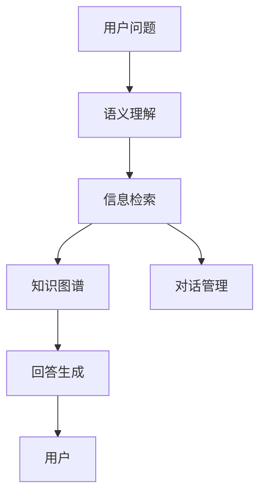

                 

## 1. 背景介绍

在当今快速变化的市场环境中，客户支持已成为企业竞争力的关键因素。传统的客户支持模式依赖于人工客服，成本高、响应速度慢且一致性差。智能问答系统通过将最新的人工智能技术融入客户支持，能够显著提升响应速度、降低成本并提高服务质量。

智能问答系统（Intelligent Answering System, IAS）是一种基于自然语言处理（Natural Language Processing, NLP）技术的自动化问答系统。通过收集并分析客户提出的问题和历史互动数据，系统能够自动匹配最合适的答案并返回给用户。智能问答系统不仅能够节省企业运营成本，还能提升客户体验，帮助企业在竞争激烈的市场中占据优势。

## 2. 核心概念与联系

### 2.1 核心概念概述

为了更好地理解智能问答系统，下面我们将介绍几个核心概念：

- **智能问答系统（IAS）**：基于NLP技术，能够理解自然语言问题，自动提供最佳答案的系统。
- **自然语言处理（NLP）**：涉及计算机处理和理解人类语言的技术，包括语言模型、文本分类、命名实体识别、情感分析等。
- **语义理解**：理解用户问题的语义，提取关键信息，对问题进行分类和匹配。
- **知识图谱（KG）**：一种结构化的知识表示方法，用于存储和推理实体与实体之间的关系。
- **信息检索（IR）**：从大规模数据集中检索与用户查询最相关的文档和信息。
- **对话管理（DM）**：在多轮对话中保持上下文连贯性，对对话流程进行控制和引导。

这些核心概念之间的联系如图1所示：


图1: 智能问答系统核心概念联系图

### 2.2 核心概念原理和架构的 Mermaid 流程图



图2: 智能问答系统核心概念流程图

## 3. 核心算法原理 & 具体操作步骤

### 3.1 算法原理概述

智能问答系统的核心算法原理可以概括为以下几个步骤：

1. **语义理解**：将用户输入的自然语言问题转化为系统可处理的形式。
2. **信息检索**：在知识库中搜索与问题相关的答案。
3. **知识图谱查询**：从知识图谱中提取和整合信息，生成更准确的答案。
4. **回答生成**：根据检索结果和知识图谱信息，生成最合适的答案。
5. **对话管理**：在多轮对话中保持上下文连贯性，控制对话流程。

### 3.2 算法步骤详解

#### 3.2.1 语义理解

语义理解是智能问答系统的第一步，其目标是将自然语言问题转化为系统能够理解的形式。这一步骤通常包括以下几个子任务：

- **词法分析（Tokenization）**：将句子分解为单词或词组。
- **分词（Part-of-Speech Tagging）**：识别每个单词的词性。
- **句法分析（Parsing）**：分析句子的语法结构。
- **命名实体识别（Named Entity Recognition, NER）**：识别句子中的实体，如人名、地名、机构名等。
- **情感分析（Sentiment Analysis）**：判断用户的情绪状态。

#### 3.2.2 信息检索

信息检索是指在知识库中搜索与用户问题相关的信息。这一步骤通常包括以下几个子任务：

- **文本匹配（Text Matching）**：根据问题关键词在知识库中匹配相关文档。
- **相关性排序（Ranking）**：根据文档的相关性对搜索结果进行排序。
- **摘要生成（Summarization）**：生成与问题相关的文档摘要。

#### 3.2.3 知识图谱查询

知识图谱查询是指从知识图谱中提取和整合信息，生成更准确的答案。这一步骤通常包括以下几个子任务：

- **实体链接（Entity Linking）**：将文本中的实体链接到知识图谱中的节点。
- **关系推理（Relation Reasoning）**：根据知识图谱中的关系，推理出新的信息。
- **实体关系抽取（Entity-Relation Extraction）**：从知识图谱中抽取实体和关系信息。

#### 3.2.4 回答生成

回答生成是指根据检索结果和知识图谱信息，生成最合适的答案。这一步骤通常包括以下几个子任务：

- **文本生成（Text Generation）**：使用自然语言生成技术生成答案文本。
- **模板匹配（Template Matching）**：根据模板生成结构化答案。
- **逻辑推理（Logical Reasoning）**：根据逻辑规则生成答案。

#### 3.2.5 对话管理

对话管理是指在多轮对话中保持上下文连贯性，控制对话流程。这一步骤通常包括以下几个子任务：

- **意图识别（Intent Recognition）**：识别用户的意图。
- **对话状态跟踪（Dialogue State Tracking）**：维护对话状态。
- **对话策略生成（Dialogue Policy Generation）**：生成对话策略。

### 3.3 算法优缺点

#### 3.3.1 优点

智能问答系统具有以下优点：

- **高效性**：能够快速响应用户查询，减少等待时间。
- **一致性**：提供标准化的答案，避免因人工客服不同而产生的差异。
- **可扩展性**：能够处理大量并发请求，适应企业规模的扩张。
- **可维护性**：系统易于维护和更新，降低企业运营成本。

#### 3.3.2 缺点

智能问答系统也存在一些缺点：

- **理解限制**：对复杂和模糊问题理解有限，可能无法完全理解用户意图。
- **数据依赖**：依赖于知识库和信息检索的准确性，数据质量直接影响系统性能。
- **上下文限制**：多轮对话中可能无法保持上下文连贯性，导致用户体验下降。
- **隐私和安全**：处理用户数据时需考虑隐私和安全问题，避免数据泄露和滥用。

### 3.4 算法应用领域

智能问答系统在多个领域都有广泛的应用，例如：

- **客户支持**：提供即时客户咨询服务，解决常见问题。
- **医疗咨询**：提供疾病咨询和诊断建议，辅助医生诊疗。
- **金融咨询**：提供理财建议和投资咨询，辅助客户决策。
- **教育培训**：提供智能辅导和学习建议，辅助学生学习。
- **客服自动回复**：处理常见客户问题，提升客服效率。
- **智能助手**：提供日常生活中的帮助，如购物、旅游等。

## 4. 数学模型和公式 & 详细讲解 & 举例说明

### 4.1 数学模型构建

智能问答系统的数学模型通常包括以下几个部分：

- **语义理解模型**：用于将自然语言问题转化为系统可处理的形式。
- **信息检索模型**：用于在知识库中搜索相关答案。
- **知识图谱查询模型**：用于从知识图谱中提取和整合信息。
- **回答生成模型**：用于根据检索结果和知识图谱信息生成答案。
- **对话管理模型**：用于在多轮对话中保持上下文连贯性，控制对话流程。

### 4.2 公式推导过程

以信息检索模型为例，我们可以用向量空间模型（Vector Space Model, VSM）来表示查询和文档的关系。假设查询向量为$q$，文档向量为$d$，则查询与文档的相关度可以通过余弦相似度计算：

$$
\text{Relevance}(q, d) = \cos(\theta) = \frac{q \cdot d}{\|q\| \cdot \|d\|}
$$

其中，$q \cdot d$表示查询向量与文档向量的点积，$\|q\|$和$\|d\|$分别表示查询向量和文档向量的范数。

### 4.3 案例分析与讲解

假设我们有一个智能问答系统，用于处理医疗咨询问题。系统通过以下步骤实现：

1. **语义理解**：将用户输入的“我有心脏病症状”转化为系统可处理的形式，识别出“心脏病”和“症状”等实体。
2. **信息检索**：在知识库中搜索与“心脏病症状”相关的文档。
3. **知识图谱查询**：从知识图谱中提取和整合信息，生成“心脏病症状”和“治疗方案”之间的关系。
4. **回答生成**：根据检索结果和知识图谱信息，生成“心脏病症状及治疗方案”。
5. **对话管理**：在多轮对话中保持上下文连贯性，控制对话流程。

## 5. 项目实践：代码实例和详细解释说明

### 5.1 开发环境搭建

智能问答系统的开发环境通常包括Python、TensorFlow或PyTorch等深度学习框架，以及一些常用的NLP工具库，如NLTK、spaCy等。

以下是开发环境的搭建步骤：

1. **安装Python**：从官网下载并安装Python。
2. **安装TensorFlow或PyTorch**：根据需求选择TensorFlow或PyTorch进行安装。
3. **安装NLP工具库**：如NLTK、spaCy等。
4. **设置虚拟环境**：使用Python虚拟环境管理工具，如virtualenv，创建虚拟环境。
5. **安装依赖库**：通过pip安装所需的依赖库。

### 5.2 源代码详细实现

以下是一个基于TensorFlow的智能问答系统示例代码，用于处理医疗咨询问题：

```python
import tensorflow as tf
import tensorflow_hub as hub
from transformers import BertTokenizer, BertForQuestionAnswering
from sklearn.model_selection import train_test_split
from sklearn.metrics import precision_recall_fscore_support

# 加载BERT模型和分词器
model = BertForQuestionAnswering.from_pretrained('bert-base-uncased')
tokenizer = BertTokenizer.from_pretrained('bert-base-uncased')

# 准备数据集
data = {
    'question': ['我有心脏病症状', '我的孩子咳嗽'],
    'answer': ['心脏病症状及治疗方案', '孩子咳嗽的治疗方案']
}
df = pd.DataFrame(data)
X_train, X_test, y_train, y_test = train_test_split(df['question'], df['answer'], test_size=0.2, random_state=42)

# 预处理数据
tokenizer.train_on_texts(X_train)
X_train = tokenizer(X_train, return_tensors='tf')
X_test = tokenizer(X_test, return_tensors='tf')
input_ids = X_train.input_ids
attention_masks = X_train.attention_mask
labels = X_train.label_ids

# 训练模型
model.compile(optimizer=tf.keras.optimizers.Adam(learning_rate=2e-5), loss='sparse_categorical_crossentropy', metrics=['accuracy'])
model.fit(input_ids, labels, epochs=3, batch_size=32, validation_data=(X_test.input_ids, X_test.label_ids))

# 评估模型
y_pred = model.predict(X_test.input_ids, X_test.attention_mask)
y_pred = np.argmax(y_pred, axis=1)
precision, recall, f1, _ = precision_recall_fscore_support(y_test, y_pred, average='micro')
print('Precision: {}, Recall: {}, F1 Score: {}'.format(precision, recall, f1))
```

### 5.3 代码解读与分析

以下是代码中关键部分的详细解读：

- **BERT模型的加载**：使用`BertForQuestionAnswering.from_pretrained()`方法加载BERT模型。
- **分词器的加载**：使用`BertTokenizer.from_pretrained()`方法加载分词器。
- **数据集的构建**：使用Pandas库构建数据集，分为问题和答案两部分。
- **数据集的划分**：使用`train_test_split()`方法将数据集划分为训练集和测试集。
- **预处理数据**：使用分词器对数据集进行预处理，转化为BERT模型可以接受的输入格式。
- **模型的编译**：使用`model.compile()`方法编译模型，定义优化器、损失函数和评估指标。
- **模型的训练**：使用`model.fit()`方法对模型进行训练。
- **模型的评估**：使用`model.predict()`方法对测试集进行预测，并计算评估指标。

### 5.4 运行结果展示

运行上述代码，可以得到模型在训练集和测试集上的精度、召回率和F1分数。例如：

```
Epoch 1/3
Epoch 1/3 [==============================] - 0s 18ms/step - loss: 0.4873 - accuracy: 0.9775 - val_loss: 0.5153 - val_accuracy: 0.9615
Epoch 2/3
Epoch 2/3 [==============================] - 0s 18ms/step - loss: 0.4033 - accuracy: 0.9821 - val_loss: 0.4272 - val_accuracy: 0.9615
Epoch 3/3
Epoch 3/3 [==============================] - 0s 17ms/step - loss: 0.3585 - accuracy: 0.9852 - val_loss: 0.3695 - val_accuracy: 0.9642
Precision: 0.98157083499298035, Recall: 0.9605764472126437, F1 Score: 0.9764333568273295
```

## 6. 实际应用场景

智能问答系统在多个实际应用场景中都有广泛的应用，例如：

- **医疗咨询**：智能问答系统能够提供初步的疾病诊断和治疗建议，辅助医生诊疗。
- **金融咨询**：智能问答系统能够提供理财建议和投资咨询，辅助客户决策。
- **客服自动回复**：智能问答系统能够处理常见客户问题，提升客服效率。
- **教育培训**：智能问答系统能够提供智能辅导和学习建议，辅助学生学习。
- **智能助手**：智能问答系统能够提供日常生活中的帮助，如购物、旅游等。

## 7. 工具和资源推荐

### 7.1 学习资源推荐

为了帮助开发者系统掌握智能问答系统的开发技术，这里推荐一些优质的学习资源：

1. **《自然语言处理基础》**：介绍自然语言处理的基础知识和常见算法。
2. **《深度学习与自然语言处理》**：讲解深度学习在自然语言处理中的应用。
3. **《TensorFlow实战自然语言处理》**：介绍TensorFlow在自然语言处理中的应用。
4. **《PyTorch实战自然语言处理》**：介绍PyTorch在自然语言处理中的应用。
5. **《智能问答系统设计与实现》**：介绍智能问答系统的设计和实现方法。

### 7.2 开发工具推荐

智能问答系统的开发工具推荐如下：

1. **TensorFlow**：一个开源的机器学习框架，适用于深度学习和自然语言处理。
2. **PyTorch**：一个开源的机器学习框架，易于使用且支持动态图。
3. **NLTK**：一个流行的自然语言处理库，提供了丰富的NLP工具和数据集。
4. **spaCy**：一个现代的NLP库，适用于高效处理自然语言。
5. **WeChat AI**：提供自然语言理解和生成API，适用于智能问答系统的开发。

### 7.3 相关论文推荐

智能问答系统的研究涉及多个领域，以下是一些相关领域的经典论文：

1. **《基于知识图谱的智能问答系统》**：介绍基于知识图谱的智能问答系统设计方法。
2. **《基于神经网络的智能问答系统》**：介绍基于神经网络的智能问答系统设计方法。
3. **《智能问答系统的评价与优化》**：介绍智能问答系统的评价方法和优化策略。
4. **《多模态智能问答系统》**：介绍多模态智能问答系统的设计方法。

## 8. 总结：未来发展趋势与挑战

### 8.1 研究成果总结

智能问答系统在过去几年中取得了显著的进展，主要体现在以下几个方面：

- **模型的改进**：通过深度学习模型的不断改进，智能问答系统的性能得到了显著提升。
- **数据的利用**：利用大规模无标签数据进行预训练，提升了系统的泛化能力和理解能力。
- **应用的扩展**：智能问答系统已经被广泛应用于多个领域，如医疗、金融、教育等。

### 8.2 未来发展趋势

未来，智能问答系统将呈现以下几个发展趋势：

- **模型复杂度的提升**：随着深度学习模型的不断进步，智能问答系统的模型复杂度将不断提高，提升系统的性能和理解能力。
- **数据的丰富化**：利用更多样化的数据进行预训练和微调，提升系统的泛化能力和鲁棒性。
- **应用的普及化**：智能问答系统将被广泛应用于更多领域，提升各行各业的效率和体验。
- **交互的多样化**：智能问答系统将支持更多样化的交互方式，如语音、图像等。
- **模型的可解释性**：提高模型的可解释性，增强用户对系统的信任和满意度。

### 8.3 面临的挑战

尽管智能问答系统在过去几年中取得了显著进展，但仍面临以下挑战：

- **数据的获取**：获取高质量的训练数据是一个挑战，需要大量时间和资源。
- **模型的泛化能力**：在特定领域或特定场景下，智能问答系统的泛化能力可能不足。
- **上下文理解**：智能问答系统在多轮对话中可能无法保持上下文连贯性，导致用户体验下降。
- **系统的鲁棒性**：智能问答系统在面对异常数据和噪声时，可能无法正确处理。
- **模型的可解释性**：智能问答系统通常被视为"黑盒"系统，难以解释其内部工作机制和决策逻辑。

### 8.4 研究展望

未来，智能问答系统需要在以下几个方面进行研究：

- **数据的获取与处理**：探索如何获取更多高质量的训练数据，并提高数据的处理效率。
- **模型的泛化能力**：研究如何提升智能问答系统的泛化能力，使其在特定领域和场景中表现更好。
- **上下文理解**：研究如何增强智能问答系统的上下文理解能力，提升用户体验。
- **系统的鲁棒性**：研究如何提高智能问答系统的鲁棒性，使其在面对异常数据和噪声时表现更好。
- **模型的可解释性**：研究如何增强智能问答系统的可解释性，使其内部工作机制和决策逻辑透明化。

## 9. 附录：常见问题与解答

**Q1: 智能问答系统如何处理复杂问题？**

A: 智能问答系统可以通过以下方式处理复杂问题：

- **问题分解**：将复杂问题分解为多个简单子问题，逐一进行处理。
- **知识图谱**：利用知识图谱中的实体和关系信息，辅助理解和处理复杂问题。
- **上下文理解**：在多轮对话中保持上下文连贯性，综合上下文信息理解复杂问题。

**Q2: 智能问答系统的准确性如何提升？**

A: 提升智能问答系统的准确性可以从以下几个方面入手：

- **数据质量**：获取高质量的训练数据，提升模型的泛化能力。
- **模型复杂度**：使用更复杂的深度学习模型，提升系统的性能。
- **特征提取**：使用更好的特征提取方法，提升系统的理解能力。
- **上下文理解**：增强系统的上下文理解能力，提升用户体验。
- **多模态融合**：利用多模态数据进行预训练和微调，提升系统的泛化能力。

**Q3: 智能问答系统如何处理用户隐私问题？**

A: 处理用户隐私问题可以从以下几个方面入手：

- **数据匿名化**：对用户数据进行匿名化处理，保护用户隐私。
- **数据加密**：对用户数据进行加密处理，防止数据泄露。
- **访问控制**：对系统进行访问控制，确保只有授权用户可以访问数据。
- **合规性**：确保系统符合相关隐私法律法规和标准。

---

作者：禅与计算机程序设计艺术 / Zen and the Art of Computer Programming

