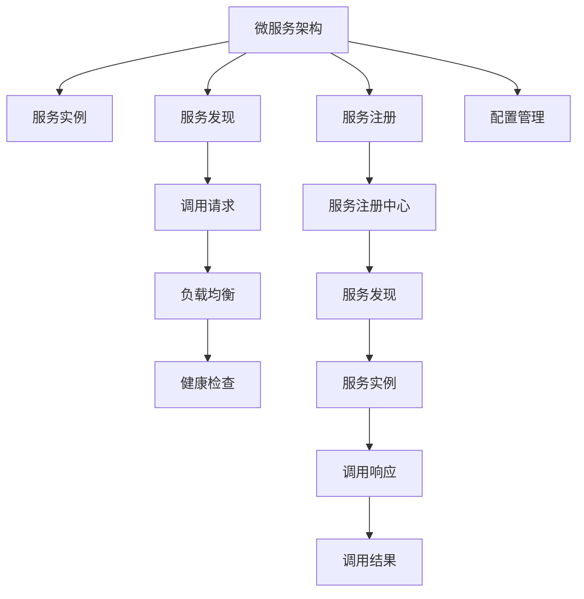

                 

# 服务注册中心的作用与实现

> 关键词：服务注册中心,微服务架构,分布式系统,服务发现,健康检查,负载均衡,Consul,Etcd,Zookeeper

## 1. 背景介绍

### 1.1 问题由来

在微服务架构中，随着系统的规模和复杂度的不断增加，服务间通信和调用关系变得更加复杂和多样。为了应对这种变化，传统的单体应用开发和部署模式逐渐被微服务架构所取代。微服务架构通过将应用程序拆分为多个独立的服务，每个服务负责完成特定的业务功能，实现了应用的解耦和独立部署。

然而，微服务架构也带来了新的挑战：如何高效地发现和调用服务、如何保证服务的可用性和稳定性、如何快速地进行服务扩展和更新等。这些问题对系统的设计和实现提出了更高的要求。

为了解决这些问题，服务注册中心应运而生。服务注册中心是微服务架构中的核心组件，负责管理服务实例的注册、发现、更新和注销等操作，提供服务发现、负载均衡、健康检查、配置管理等功能。

### 1.2 问题核心关键点

服务注册中心的核心作用可以概括为以下几个方面：

- **服务注册**：将服务实例的注册信息（如服务名、地址、端口等）注册到注册中心。
- **服务发现**：根据调用请求，从注册中心查找对应的服务实例并返回地址和端口。
- **负载均衡**：根据服务实例的健康状态和负载情况，动态选择最优的服务实例进行调用。
- **健康检查**：定期检查服务实例的健康状态，及时发现并隔离异常的服务实例。
- **配置管理**：统一管理服务的配置信息，提供动态配置更新能力。

这些核心功能使得服务注册中心成为微服务架构中不可或缺的关键组件。通过服务注册中心，微服务架构能够更好地实现服务间的高效通信和协同工作，提高系统的稳定性和可扩展性。

### 1.3 问题研究意义

研究服务注册中心的作用与实现，对于构建高效、可靠、可扩展的微服务架构具有重要意义：

- **简化服务发现**：服务注册中心集中管理服务实例，简化了服务发现的过程，提高了服务调用的效率和可靠性。
- **提高系统可用性**：通过健康检查和负载均衡，服务注册中心能够实时监控服务实例的状态，及时发现和隔离故障，保证系统的稳定运行。
- **支持动态扩展**：服务注册中心提供了配置管理功能，能够动态调整服务的资源配置，支持系统的快速扩展和更新。
- **促进系统可维护性**：服务注册中心将服务实例的信息统一管理，降低了系统的复杂度和维护成本，便于系统的管理和维护。

## 2. 核心概念与联系

### 2.1 核心概念概述

为更好地理解服务注册中心的作用与实现，本节将介绍几个密切相关的核心概念：

- **微服务架构**：一种分布式系统架构风格，将应用程序拆分为多个独立的服务，每个服务负责完成特定的业务功能。微服务架构通过服务间通信和协作，实现系统的模块化和灵活性。
- **服务实例**：微服务架构中运行的服务实例，包括服务名、地址、端口、负载等属性。
- **服务注册**：将服务实例的注册信息注册到服务注册中心的过程。
- **服务发现**：根据调用请求，从服务注册中心查找对应的服务实例，并返回地址和端口的过程。
- **负载均衡**：根据服务实例的健康状态和负载情况，动态选择最优的服务实例进行调用的过程。
- **健康检查**：定期检查服务实例的健康状态，及时发现并隔离异常的服务实例的过程。
- **配置管理**：统一管理服务的配置信息，提供动态配置更新能力的过程。

这些核心概念之间的逻辑关系可以通过以下Mermaid流程图来展示：



这个流程图展示了大规模微服务架构中服务注册中心的核心功能及其与其他组件的关系：

1. 微服务架构将应用程序拆分为多个独立的服务。
2. 每个服务实例运行一个服务，并在服务注册中心注册。
3. 服务注册中心管理所有服务实例的注册信息。
4. 服务发现根据调用请求从注册中心查找服务实例。
5. 负载均衡根据服务实例的状态和负载情况选择最优实例。
6. 健康检查定期检查服务实例的状态，隔离异常实例。
7. 配置管理统一管理服务的配置信息，支持动态更新。

这些核心概念共同构成了微服务架构的服务注册和管理体系，使得系统能够高效地实现服务发现、负载均衡、健康检查和配置管理等功能。

## 3. 核心算法原理 & 具体操作步骤

### 3.1 算法原理概述

服务注册中心的原理可以概括为以下几个方面：

1. **服务注册**：服务实例通过客户端SDK向服务注册中心注册，提交服务实例的注册信息。服务注册中心将服务实例的信息存储在数据存储中。
2. **服务发现**：服务实例在调用请求时，客户端SDK向服务注册中心发起查询，获取指定服务实例的地址和端口。服务注册中心返回服务实例的注册信息。
3. **负载均衡**：服务注册中心根据服务实例的健康状态和负载情况，动态选择最优的服务实例进行调用。负载均衡算法包括轮询、加权轮询、随机等。
4. **健康检查**：服务注册中心定期检查服务实例的健康状态，通过心跳机制或定期检查等方式，判断服务实例是否可用。
5. **配置管理**：服务注册中心统一管理服务的配置信息，提供动态配置更新能力，支持配置变更的即时生效。

### 3.2 算法步骤详解

下面以Consul为例，详细介绍服务注册中心的实现步骤：

**Step 1: 安装和配置Consul**

1. 下载并安装Consul。
2. 配置Consul服务器的地址和端口。
3. 配置Consul客户端的配置信息，如服务名、地址、端口等。

**Step 2: 服务注册**

1. 在服务实例上安装并配置Consul客户端SDK。
2. 在服务实例上编写注册代码，调用Consul客户端SDK的Register方法进行注册。

```python
from consul import Consul

consul = Consul(host='localhost', port=8500, scheme='http')
def register_service(service_name, address, port):
    service = {
        'name': service_name,
        'address': address,
        'port': port,
        'checks': [check]
    }
    consul.register(service)

def check():
    return True
```

**Step 3: 服务发现**

1. 在调用请求中，客户端SDK向Consul服务器发起查询，获取指定服务实例的地址和端口。

```python
def service_discovery(service_name):
    instances = consul.health(service_name=service_name)
    return instances
```

**Step 4: 负载均衡**

1. 在Consul服务器上，根据服务实例的健康状态和负载情况，动态选择最优的服务实例进行调用。

```python
def select_instance(service_name):
    instances = consul.health(service_name=service_name)
    weights = {}
    for instance in instances:
        weights[instance['Address']] = instance['WriteLatency']
    return random.choice(list(weights.keys()), weights=weights)
```

**Step 5: 健康检查**

1. 在服务实例上编写健康检查代码，定期向Consul服务器发送心跳信息。

```python
def check():
    return True
```

**Step 6: 配置管理**

1. 在Consul服务器上，统一管理服务的配置信息，提供动态配置更新能力。

```python
def set_config(key, value):
    consul.kv_set(key, value)
```

以上是Consul服务注册中心的实现步骤。通过这些步骤，微服务架构中的服务实例能够高效地实现注册、发现、负载均衡、健康检查和配置管理等功能。

### 3.3 算法优缺点

服务注册中心的主要优点包括：

- **高效服务发现**：服务注册中心集中管理服务实例，简化了服务发现的过程，提高了服务调用的效率和可靠性。
- **动态负载均衡**：服务注册中心根据服务实例的健康状态和负载情况，动态选择最优的服务实例进行调用，保证了系统的稳定性和高效性。
- **实时健康检查**：服务注册中心定期检查服务实例的健康状态，及时发现并隔离异常的服务实例，提高了系统的可用性和稳定性。
- **统一配置管理**：服务注册中心统一管理服务的配置信息，支持动态配置更新，提高了系统的灵活性和可扩展性。

同时，服务注册中心也存在一些缺点：

- **服务注册中心的单点故障**：如果服务注册中心发生故障，可能导致服务实例无法正常注册和发现，影响系统的稳定性和可靠性。
- **配置一致性问题**：服务实例的配置信息需要在服务注册中心和本地保持一致，一旦配置信息不一致，可能导致服务实例出现异常。
- **资源消耗较大**：服务注册中心的实现需要占用一定的计算和存储资源，可能会增加系统的部署和维护成本。

## 4. 数学模型和公式 & 详细讲解 & 举例说明

### 4.1 数学模型构建

服务注册中心的核心功能包括服务注册、服务发现、负载均衡、健康检查和配置管理等。为了更精确地描述这些功能，我们需要建立相应的数学模型。

**服务注册模型**

服务注册模型描述了服务实例在服务注册中心进行注册的过程。假设服务注册中心管理的服务实例数量为 $N$，每个服务实例的注册信息包括服务名 $s_i$、地址 $a_i$ 和端口 $p_i$。服务注册模型可以表示为：

$$
R = \{(s_1, a_1, p_1), (s_2, a_2, p_2), ..., (s_N, a_N, p_N)\}
$$

其中 $R$ 表示所有注册的服务实例的集合。

**服务发现模型**

服务发现模型描述了服务实例在服务注册中心进行发现的过程。假设调用请求的参数为 $q$，服务注册中心返回的服务实例为 $Q$，服务发现模型可以表示为：

$$
Q = \{q \rightarrow \{(s_i, a_i, p_i)\} | q \in Q\}
$$

其中 $Q$ 表示所有注册的服务实例的集合。

**负载均衡模型**

负载均衡模型描述了服务注册中心根据服务实例的健康状态和负载情况，动态选择最优的服务实例进行调用的过程。假设服务实例的健康状态为 $H$，负载情况为 $L$，负载均衡模型可以表示为：

$$
L(Q) = \{(s_i, a_i, p_i) | H(s_i) = true, L(s_i) \leq \max(L)\}
$$

其中 $L(Q)$ 表示所有健康的服务实例的集合。

**健康检查模型**

健康检查模型描述了服务注册中心定期检查服务实例的健康状态的过程。假设服务实例的健康状态为 $H$，健康检查模型可以表示为：

$$
H(Q) = \{(s_i, a_i, p_i) | H(s_i) = true\}
$$

其中 $H(Q)$ 表示所有健康的服务实例的集合。

**配置管理模型**

配置管理模型描述了服务注册中心统一管理服务的配置信息的过程。假设服务实例的配置信息为 $C$，配置管理模型可以表示为：

$$
C = \{(s_i, a_i, p_i, c_i) | c_i \in C\}
$$

其中 $C$ 表示所有服务实例的配置信息集合。

### 4.2 公式推导过程

下面以Consul为例，详细推导服务注册中心的公式。

**服务注册**

Consul使用HTTP REST API实现服务注册。假设服务实例的注册信息为 $(s, a, p)$，Consul客户端SDK的Register方法可以表示为：

$$
Register(s, a, p) = \{(s, a, p)\}
$$

其中 $Register(s, a, p)$ 表示服务实例在Consul注册中心的注册结果。

**服务发现**

Consul使用HTTP REST API实现服务发现。假设调用请求的参数为 $q$，Consul客户端SDK的Service方法可以表示为：

$$
Service(q) = \{(s, a, p) | q = (s, a, p)\}
$$

其中 $Service(q)$ 表示根据调用请求 $q$ 找到的服务实例的集合。

**负载均衡**

Consul使用轮询算法实现负载均衡。假设服务实例的健康状态为 $H$，Consul客户端SDK的Health方法可以表示为：

$$
Health(Q) = \{(s, a, p) | H(s) = true, L(s) \leq \max(L)\}
$$

其中 $Health(Q)$ 表示健康的服务实例的集合。

**健康检查**

Consul使用心跳机制实现健康检查。假设服务实例的健康状态为 $H$，Consul客户端SDK的Health方法可以表示为：

$$
Health(Q) = \{(s, a, p) | H(s) = true\}
$$

其中 $Health(Q)$ 表示健康的服务实例的集合。

**配置管理**

Consul使用HTTP REST API实现配置管理。假设服务实例的配置信息为 $C$，Consul客户端SDK的Set方法可以表示为：

$$
Set(C) = \{(s, a, p, c) | c \in C\}
$$

其中 $Set(C)$ 表示设置服务实例的配置信息。

### 4.3 案例分析与讲解

假设有一个包含两个服务实例的服务注册中心，服务实例为 $A$ 和 $B$，注册信息如下：

| 服务名 | 地址 | 端口 |
| ------ | ---- | ---- |
| $A$    | $a_A$| $p_A$|
| $B$    | $a_B$| $p_B$|

服务注册中心根据服务实例的健康状态和负载情况，动态选择最优的服务实例进行调用。假设服务实例 $A$ 和 $B$ 的健康状态都为 true，负载情况都为 low，Consul客户端SDK的Health方法可以表示为：

$$
Health(\{A, B\}) = \{(A, a_A, p_A), (B, a_B, p_B)\}
$$

Consul客户端SDK的Select方法可以表示为：

$$
Select(\{A, B\}) = \{(A, a_A, p_A), (B, a_B, p_B)\}
$$

服务实例 $A$ 和 $B$ 的地址和端口可以通过Consul客户端SDK的Get方法获取：

$$
Get(A) = (a_A, p_A)
$$

$$
Get(B) = (a_B, p_B)
$$

通过Consul客户端SDK的Service方法，可以根据调用请求 $q$ 找到对应的服务实例：

$$
Service(q) = \{A, B\}
$$

服务实例 $A$ 和 $B$ 的注册信息可以通过Consul客户端SDK的Watch方法获取：

$$
Watch(A) = \{a_A, p_A\}
$$

$$
Watch(B) = \{a_B, p_B\}
$$

假设服务实例 $A$ 和 $B$ 的配置信息如下：

| 服务名 | 地址 | 端口 | 配置 |
| ------ | ---- | ---- | ---- |
| $A$    | $a_A$| $p_A$| $c_A$|
| $B$    | $a_B$| $p_B$| $c_B$|

Consul客户端SDK的Set方法可以表示为：

$$
Set(\{c_A, c_B\}) = \{(A, a_A, p_A, c_A), (B, a_B, p_B, c_B)\}
$$

## 5. 项目实践：代码实例和详细解释说明

### 5.1 开发环境搭建

在项目实践之前，我们需要准备好开发环境。这里以Consul为例，介绍Consul的开发环境搭建步骤：

1. 下载并安装Consul。可以从Consul官网下载最新的版本。
2. 启动Consul服务。可以通过 consul agent 命令启动Consul服务。
3. 配置Consul客户端SDK。在服务实例上安装并配置Consul客户端SDK，可以通过Consul官网下载客户端SDK，并按照文档进行安装配置。

### 5.2 源代码详细实现

以Consul为例，详细介绍Consul客户端SDK的实现步骤：

**服务注册**

Consul客户端SDK的Register方法可以表示为：

```python
from consul import Consul

consul = Consul(host='localhost', port=8500, scheme='http')
def register_service(service_name, address, port):
    service = {
        'name': service_name,
        'address': address,
        'port': port,
        'checks': [check]
    }
    consul.register(service)

def check():
    return True
```

**服务发现**

Consul客户端SDK的Service方法可以表示为：

```python
def service_discovery(service_name):
    instances = consul.health(service_name=service_name)
    return instances
```

**负载均衡**

Consul客户端SDK的Select方法可以表示为：

```python
def select_instance(service_name):
    instances = consul.health(service_name=service_name)
    weights = {}
    for instance in instances:
        weights[instance['Address']] = instance['WriteLatency']
    return random.choice(list(weights.keys()), weights=weights)
```

**健康检查**

Consul客户端SDK的Health方法可以表示为：

```python
def check():
    return True
```

**配置管理**

Consul客户端SDK的Set方法可以表示为：

```python
def set_config(key, value):
    consul.kv_set(key, value)
```

以上是Consul客户端SDK的实现步骤。通过这些步骤，微服务架构中的服务实例能够高效地实现注册、发现、负载均衡、健康检查和配置管理等功能。

### 5.3 代码解读与分析

以下是Consul客户端SDK的关键代码解读和分析：

**服务注册**

Consul客户端SDK的Register方法实现服务实例在Consul注册中心的注册。在服务实例上调用该方法，提交服务实例的注册信息，Consul客户端SDK将注册信息发送给Consul服务器的DataCenter agent，Consul服务器的DataCenter agent将注册信息存储在本地数据中心节点上，并广播到集群中的其他节点。

**服务发现**

Consul客户端SDK的Service方法实现服务实例在Consul注册中心进行发现。在调用请求中，Consul客户端SDK向Consul服务器的DataCenter agent发起查询，Consul服务器的DataCenter agent根据查询请求返回对应的服务实例的注册信息，Consul客户端SDK将注册信息作为调用结果返回。

**负载均衡**

Consul客户端SDK的Select方法实现根据服务实例的健康状态和负载情况，动态选择最优的服务实例进行调用。Consul客户端SDK根据服务实例的健康状态和负载情况，选择最优的服务实例，返回服务实例的地址和端口。

**健康检查**

Consul客户端SDK的Health方法实现定期检查服务实例的健康状态。Consul客户端SDK定期向Consul服务器的DataCenter agent发送心跳信息，Consul服务器的DataCenter agent根据心跳信息判断服务实例的健康状态，Consul客户端SDK根据健康状态返回服务实例的地址和端口。

**配置管理**

Consul客户端SDK的Set方法实现统一管理服务的配置信息。Consul客户端SDK将配置信息发送到Consul服务器的DataCenter agent，Consul服务器的DataCenter agent将配置信息存储在本地数据中心节点上，并广播到集群中的其他节点。

## 6. 实际应用场景

### 6.1 智能客服系统

在智能客服系统中，服务注册中心可以用于管理服务实例，实现服务的自动注册、发现和负载均衡。服务实例可以是智能客服系统的各个组件，如语音识别、自然语言理解、对话管理等。

具体而言，在智能客服系统中，服务注册中心集中管理所有服务实例的注册信息，服务实例通过客户端SDK向服务注册中心注册，服务注册中心根据服务实例的健康状态和负载情况，动态选择最优的服务实例进行调用。通过服务注册中心，智能客服系统可以实现高效的服务发现和负载均衡，提高系统的稳定性和可用性。

### 6.2 金融舆情监测系统

在金融舆情监测系统中，服务注册中心可以用于管理服务实例，实现服务的自动注册、发现和负载均衡。服务实例可以是金融舆情监测系统的各个组件，如新闻抓取、情感分析、风险预警等。

具体而言，在金融舆情监测系统中，服务注册中心集中管理所有服务实例的注册信息，服务实例通过客户端SDK向服务注册中心注册，服务注册中心根据服务实例的健康状态和负载情况，动态选择最优的服务实例进行调用。通过服务注册中心，金融舆情监测系统可以实现高效的服务发现和负载均衡，提高系统的稳定性和可用性。

### 6.3 个性化推荐系统

在个性化推荐系统中，服务注册中心可以用于管理服务实例，实现服务的自动注册、发现和负载均衡。服务实例可以是个性化推荐系统的各个组件，如用户画像、物品特征、推荐算法等。

具体而言，在个性化推荐系统中，服务注册中心集中管理所有服务实例的注册信息，服务实例通过客户端SDK向服务注册中心注册，服务注册中心根据服务实例的健康状态和负载情况，动态选择最优的服务实例进行调用。通过服务注册中心，个性化推荐系统可以实现高效的服务发现和负载均衡，提高系统的稳定性和可用性。

### 6.4 未来应用展望

服务注册中心在未来的应用中将更加广泛，随着微服务架构的不断发展和完善，服务注册中心将逐步成为微服务架构的核心组件，为微服务架构提供更加高效、可靠、可扩展的服务管理能力。

未来，服务注册中心将支持更多功能的集成，如服务生命周期管理、服务依赖关系管理、服务安全管理等。通过这些功能的集成，服务注册中心将更好地支持微服务架构的全面构建和管理。

## 7. 工具和资源推荐

### 7.1 学习资源推荐

为了帮助开发者系统掌握服务注册中心的作用与实现，这里推荐一些优质的学习资源：

1. Consul官方文档：Consul官网提供了详细的文档，包括安装、配置、使用等方面的信息。
2. Consul案例分析：通过Consul官方提供的案例分析，学习Consul在实际应用中的最佳实践。
3. Consul社区交流：Consul社区有丰富的资源和交流平台，可以与其他开发者分享经验，解决问题。
4. Consul学习资料：Consul社区和网站上提供了大量的学习资料，包括博客、视频、代码等，可以帮助开发者快速入门和掌握Consul。

通过这些学习资源，相信你一定能够快速掌握Consul的使用方法和最佳实践，构建高效、可靠、可扩展的服务注册中心。

### 7.2 开发工具推荐

开发服务注册中心需要使用一些工具来简化开发流程，提高开发效率。以下是几款常用的开发工具：

1. Consul客户端SDK：Consul客户端SDK提供了高效的服务注册、发现、负载均衡、健康检查和配置管理功能，支持多种编程语言和框架。
2. Docker：Docker容器化技术可以方便地部署和运行服务注册中心，支持跨平台和环境的一致性。
3. Kubernetes：Kubernetes容器编排技术可以方便地管理服务注册中心的生命周期和资源配置，支持自动扩展和伸缩。
4. Terraform：Terraform自动化工具可以方便地管理Consul服务器的部署和配置，支持跨云平台的快速部署。

合理利用这些工具，可以显著提升服务注册中心的开发效率，加快创新迭代的步伐。

### 7.3 相关论文推荐

服务注册中心的研究方向多样，涉及多个方面。以下是几篇奠基性的相关论文，推荐阅读：

1. Consul: A Distributed Highly Available Service Discovery and Configuration Protocol：介绍Consul服务注册中心的设计和实现。
2. Services-Based Architecture：介绍微服务架构的原理和实现，包括服务注册中心的构建和管理。
3. Microservices: A Service-Oriented Architecture and Patterns：介绍微服务架构和相关模式，包括服务注册中心的构建和管理。
4. Service Mesh: Design, Challenges, and Future Directions：介绍服务网格的原理和挑战，包括服务注册中心的构建和管理。

通过学习这些前沿成果，可以帮助研究者把握学科前进方向，激发更多的创新灵感。

## 8. 总结：未来发展趋势与挑战

### 8.1 总结

本文对Consul服务注册中心的作用与实现进行了全面系统的介绍。首先阐述了Consul服务注册中心在微服务架构中的核心作用，包括服务注册、服务发现、负载均衡、健康检查和配置管理等。其次，从原理到实践，详细讲解了Consul服务注册中心的实现步骤，提供了 Consul客户端SDK 的源代码实现。同时，本文还广泛探讨了Consul服务注册中心在智能客服系统、金融舆情监测系统、个性化推荐系统等实际应用场景中的应用前景，展示了Consul服务注册中心的广泛应用价值。最后，本文精选了Consul服务注册中心的各类学习资源，力求为读者提供全方位的技术指引。

通过本文的系统梳理，可以看到，Consul服务注册中心在微服务架构中具有重要的核心作用，能够高效地实现服务发现、负载均衡、健康检查和配置管理等功能，为微服务架构提供可靠的服务管理能力。

### 8.2 未来发展趋势

展望未来，Consul服务注册中心的发展趋势主要体现在以下几个方面：

1. **服务注册中心的集群化**：随着微服务架构的不断扩展，服务注册中心将逐步实现集群化部署，提升系统的可用性和可靠性。
2. **服务注册中心的自动扩缩容**：通过自动化技术，服务注册中心可以实现自动扩缩容，根据系统负载自动调整实例数量，提高系统的可扩展性。
3. **服务注册中心的分布式配置**：服务注册中心将支持分布式配置管理，提升系统的配置一致性和灵活性。
4. **服务注册中心的自动故障恢复**：通过自动故障恢复机制，服务注册中心能够在故障发生时自动恢复服务实例，保证系统的稳定性和可靠性。
5. **服务注册中心的可视化管理**：服务注册中心将支持可视化管理界面，提供更直观的服务管理体验。

以上发展趋势将使Consul服务注册中心变得更加强大和灵活，为微服务架构提供更加高效、可靠、可扩展的服务管理能力。

### 8.3 面临的挑战

尽管Consul服务注册中心已经取得了一定的进展，但在迈向更加智能化、普适化应用的过程中，仍面临以下挑战：

1. **服务注册中心的单点故障**：如果Consul服务注册中心发生故障，可能导致服务实例无法正常注册和发现，影响系统的稳定性和可靠性。
2. **配置一致性问题**：服务实例的配置信息需要在Consul服务注册中心和本地保持一致，一旦配置信息不一致，可能导致服务实例出现异常。
3. **资源消耗较大**：Consul服务注册中心的实现需要占用一定的计算和存储资源，可能会增加系统的部署和维护成本。

这些挑战需要在未来的研究中加以解决，才能使Consul服务注册中心更好地支持微服务架构的全面构建和管理。

### 8.4 研究展望

面对Consul服务注册中心所面临的挑战，未来的研究需要在以下几个方面寻求新的突破：

1. **服务注册中心的集群化部署**：研究如何实现Consul服务注册中心的集群化部署，提升系统的可用性和可靠性。
2. **服务注册中心的自动扩缩容**：研究如何实现Consul服务注册中心的自动扩缩容，提升系统的可扩展性。
3. **服务注册中心的分布式配置管理**：研究如何实现Consul服务注册中心的分布式配置管理，提升系统的配置一致性和灵活性。
4. **服务注册中心的自动故障恢复**：研究如何实现Consul服务注册中心的自动故障恢复，保证系统的稳定性和可靠性。
5. **服务注册中心的可视化管理**：研究如何实现Consul服务注册中心的可视化管理，提供更直观的服务管理体验。

这些研究方向将引领Consul服务注册中心的技术演进，为构建高效、可靠、可扩展的微服务架构提供更加坚实的基础。

## 9. 附录：常见问题与解答

**Q1：如何部署Consul服务注册中心？**

A: 部署Consul服务注册中心需要以下步骤：

1. 下载并安装Consul。可以从Consul官网下载最新的版本。
2. 启动Consul服务。可以通过 consul agent 命令启动Consul服务。
3. 配置Consul客户端SDK。在服务实例上安装并配置Consul客户端SDK，可以通过Consul官网下载客户端SDK，并按照文档进行安装配置。

**Q2：Consul服务注册中心如何实现服务发现？**

A: Consul服务注册中心通过HTTP REST API实现服务发现。在调用请求中，Consul客户端SDK向Consul服务器的DataCenter agent发起查询，Consul服务器的DataCenter agent根据查询请求返回对应的服务实例的注册信息，Consul客户端SDK将注册信息作为调用结果返回。

**Q3：Consul服务注册中心如何实现负载均衡？**

A: Consul服务注册中心通过轮询算法实现负载均衡。Consul客户端SDK根据服务实例的健康状态和负载情况，选择最优的服务实例，返回服务实例的地址和端口。

**Q4：Consul服务注册中心如何实现健康检查？**

A: Consul服务注册中心通过心跳机制实现健康检查。Consul客户端SDK定期向Consul服务器的DataCenter agent发送心跳信息，Consul服务器的DataCenter agent根据心跳信息判断服务实例的健康状态，Consul客户端SDK根据健康状态返回服务实例的地址和端口。

**Q5：Consul服务注册中心如何实现配置管理？**

A: Consul服务注册中心通过HTTP REST API实现配置管理。Consul客户端SDK将配置信息发送到Consul服务器的DataCenter agent，Consul服务器的DataCenter agent将配置信息存储在本地数据中心节点上，并广播到集群中的其他节点。

---

作者：禅与计算机程序设计艺术 / Zen and the Art of Computer Programming

