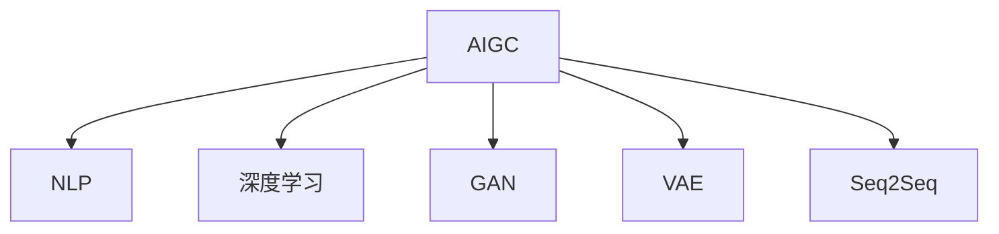

                 

## 1. 背景介绍

### 1.1 问题由来

人工智能(AI)正在全面渗透到各个领域，从语音识别、图像处理到自然语言处理(NLP)、推荐系统，AI技术正在革新各行各业。近些年，生成式AI(Generative AI, AIGC)作为AI领域的新分支，正在迅速崛起。

AIGC是指基于生成式模型，自动生成文本、音频、视频等内容的技术，包括文本生成、图像生成、音频生成、视频生成等。其中，文本生成技术最为成熟，已经在诸多领域得到广泛应用。比如，智能客服、内容创作、摘要生成、问答系统、翻译等，文本生成技术已经展示出其强大的潜力。

### 1.2 问题核心关键点

AIGC技术具有以下核心关键点：

- 高度自动化：生成式AI可以自动生成高质量的内容，无需人工干预，大幅提升内容创作效率。
- 适应性强：AIGC模型可以根据不同的任务和风格进行调整，适应多样化的应用场景。
- 数据驱动：生成式AI通过大量数据训练，能够学习和捕捉数据中的规律和特征，生成更符合实际需求的内容。
- 跨领域应用：AIGC技术已经应用于内容创作、智能客服、游戏、广告等多个领域，展示了其广泛的应用潜力。
- 技术创新：AIGC技术的快速发展离不开深度学习、自然语言处理、计算机视觉等多学科技术的交叉融合，持续推动AI技术的边界拓展。

### 1.3 问题研究意义

研究AIGC技术，对于拓展AI技术的应用范围，提升内容创作和服务的质量，加速AI技术的产业化进程，具有重要意义：

- 降低内容创作成本：AIGC能够自动生成高质量的文本、图像、音频等内容，减少人工创作的时间和经济成本。
- 提高内容创作效率：AIGC可以大规模批量生成内容，大幅提升内容创作和传播的效率。
- 创新内容形式：AIGC技术能够生成多种形式的内容，拓展了内容的呈现方式，增强用户体验。
- 助力智能应用：AIGC可以作为智能客服、对话系统等智能应用的核心技术，提升系统互动体验。
- 推动AI技术进步：AIGC技术的快速发展，为AI技术的演进提供了新的动力，促进AI技术向更宽广的领域迈进。

## 2. 核心概念与联系

### 2.1 核心概念概述

为了更好地理解AIGC技术的核心概念和原理，本节将详细介绍AIGC相关的主要概念：

- 生成式AI（AIGC）：基于生成模型，能够自动生成文本、图像、音频、视频等内容的技术。
- 自然语言处理（NLP）：研究如何使计算机能够理解和处理人类语言的技术。
- 深度学习（DL）：一种基于多层神经网络的机器学习方法，通过大量数据训练，能够自动学习特征并进行复杂任务。
- 生成对抗网络（GAN）：一种生成模型，通过对抗训练，生成高质量的样本数据。
- 变分自编码器（VAE）：一种生成模型，通过学习数据的分布，生成具有连续变化的样本数据。
- 序列到序列模型（Seq2Seq）：一种NLP任务模型，通过序列对序列的映射，生成目标序列。

这些概念之间存在紧密联系，共同构成了AIGC技术的核心架构：



通过深度学习和自然语言处理技术，AIGC可以自动生成高质量的文本内容。GAN和VAE模型则可以通过对抗训练和数据分布学习，生成高质量的图像和音频。Seq2Seq模型则可以对文本进行编码和解码，生成序列对序列的映射。这些技术共同构成了AIGC技术的核心框架，使其能够自动生成多样化的内容。

## 3. 核心算法原理 & 具体操作步骤

### 3.1 算法原理概述

AIGC技术的核心算法包括深度学习、生成对抗网络（GAN）、变分自编码器（VAE）、序列到序列模型（Seq2Seq）等。这些算法共同构成了AIGC技术的核心框架，使其能够自动生成高质量的内容。

深度学习模型通过大量数据训练，能够自动学习数据的特征并进行复杂任务。AIGC技术可以通过深度学习模型，自动生成高质量的文本、图像、音频等内容。GAN模型则可以通过对抗训练，生成高质量的样本数据，增强AIGC技术的鲁棒性。VAE模型则可以通过学习数据的分布，生成具有连续变化的样本数据，丰富AIGC技术的内容形式。Seq2Seq模型则可以对文本进行编码和解码，生成序列对序列的映射，增强AIGC技术的灵活性和适应性。

### 3.2 算法步骤详解

AIGC技术的核心算法步骤如下：

**Step 1: 准备数据集**
- 收集和预处理数据集，包括文本、图像、音频等。
- 对数据集进行清洗和标注，确保数据的质量和可用性。

**Step 2: 选择生成模型**
- 根据任务需求选择合适的生成模型，如GAN、VAE、Seq2Seq等。
- 确定模型的架构和超参数，如神经网络的层数、节点数、激活函数等。

**Step 3: 训练生成模型**
- 使用准备好的数据集对生成模型进行训练。
- 通过对抗训练、数据增强等方法提升模型的鲁棒性和泛化能力。

**Step 4: 生成内容**
- 使用训练好的生成模型生成高质量的内容。
- 对生成内容进行后处理和优化，确保内容的正确性和多样性。

**Step 5: 评估和优化**
- 对生成内容进行评估，包括质量、相关性、多样性等指标。
- 根据评估结果对生成模型进行优化，提高内容的生成效果。

### 3.3 算法优缺点

AIGC技术的核心算法具有以下优点：

- 高度自动化：AIGC技术能够自动生成高质量的内容，减少人工创作的时间和成本。
- 适应性强：AIGC技术可以根据不同的任务和风格进行调整，适应多样化的应用场景。
- 数据驱动：AIGC技术通过大量数据训练，能够学习和捕捉数据中的规律和特征，生成更符合实际需求的内容。

同时，AIGC技术也存在以下缺点：

- 数据依赖：AIGC技术依赖于高质量的数据集，数据集的大小和质量直接影响了生成内容的精度和多样性。
- 模型复杂：AIGC技术使用的生成模型较为复杂，训练和优化需要大量的计算资源。
- 鲁棒性不足：AIGC技术生成的内容可能存在一定的噪声和偏差，鲁棒性有待提升。

### 3.4 算法应用领域

AIGC技术在多个领域得到了广泛应用，包括：

- 内容创作：AIGC技术可以自动生成高质量的文本、图像、音频等内容，用于新闻、小说、广告、视频等。
- 智能客服：AIGC技术可以自动生成智能客服的回复，提升客服互动体验。
- 对话系统：AIGC技术可以自动生成对话内容，用于聊天机器人、虚拟助手等。
- 教育培训：AIGC技术可以自动生成教育培训内容，提升学习效果和互动体验。
- 医疗诊断：AIGC技术可以自动生成医疗诊断报告，辅助医生诊断和治疗。
- 娱乐游戏：AIGC技术可以自动生成游戏角色、场景、对话等内容，提升游戏体验。

## 4. 数学模型和公式 & 详细讲解  
### 4.1 数学模型构建

AIGC技术的基础数学模型包括深度学习模型、生成对抗网络（GAN）、变分自编码器（VAE）、序列到序列模型（Seq2Seq）等。这些模型通过数学公式描述了数据的分布、特征和映射关系。

**深度学习模型**：深度学习模型通过多层神经网络进行特征学习和表示。其数学模型如下：

$$
f(x) = \sum_{i=1}^n w_i f_{i-1}(x)
$$

其中，$x$ 为输入数据，$w_i$ 为权重参数，$f_i$ 为激活函数。

**生成对抗网络（GAN）**：GAN模型由生成器和判别器两部分组成。其数学模型如下：

$$
\begin{aligned}
&\min_G \max_D V(D, G) \\
&V(D, G) = E_{x \sim p_x} [\log D(x)] + E_{z \sim p_z} [\log(1 - D(G(z))]
\end{aligned}
$$

其中，$D$ 为判别器，$G$ 为生成器，$z$ 为随机噪声，$x$ 为真实数据，$p_x$ 为真实数据的概率分布，$p_z$ 为随机噪声的概率分布。

**变分自编码器（VAE）**：VAE模型通过学习数据的分布进行生成。其数学模型如下：

$$
\begin{aligned}
&\min_{\theta} \mathcal{L}(\theta) = \mathbb{E}_{x \sim p_x}[\log p_{\theta}(x)] + \mathbb{E}_{z \sim q_z}[\log p_{\theta}(x)]
\end{aligned}
$$

其中，$\theta$ 为模型参数，$p_{\theta}$ 为生成概率分布，$q_z$ 为编码概率分布，$x$ 为输入数据。

**序列到序列模型（Seq2Seq）**：Seq2Seq模型通过编码器和解码器进行序列对序列的映射。其数学模型如下：

$$
\begin{aligned}
&\min_{\theta} \mathcal{L}(\theta) = \mathbb{E}_{(x, y) \sim \mathcal{D}}[\|y - \hat{y}\|^2]
\end{aligned}
$$

其中，$(x, y)$ 为输入输出序列对，$\theta$ 为模型参数，$\hat{y}$ 为模型预测的输出序列。

### 4.2 公式推导过程

以下我们以深度学习模型为例，推导其中的一些关键公式。

**深度学习模型的梯度下降公式**：

$$
\theta \leftarrow \theta - \eta \nabla_{\theta} J(\theta)
$$

其中，$\theta$ 为模型参数，$\eta$ 为学习率，$J(\theta)$ 为损失函数。

**深度学习模型的反向传播算法**：

$$
\begin{aligned}
&\frac{\partial J(\theta)}{\partial w_i} = \frac{\partial J(\theta)}{\partial f_{i-1}} \cdot \frac{\partial f_{i-1}}{\partial w_i} \\
&\frac{\partial J(\theta)}{\partial b_i} = \frac{\partial J(\theta)}{\partial f_{i-1}}
\end{aligned}
$$

其中，$w_i$ 为权重参数，$b_i$ 为偏置参数，$f_{i-1}$ 为中间层输出。

**生成对抗网络（GAN）的梯度下降公式**：

$$
\begin{aligned}
&\frac{\partial V(D, G)}{\partial D_x} = \mathbb{E}_{x \sim p_x}[\log D(x)] - \mathbb{E}_{z \sim p_z}[\log(1 - D(G(z))
\end{aligned}
$$

其中，$D_x$ 为判别器对真实数据的输出，$G(z)$ 为生成器对随机噪声的输出。

**变分自编码器（VAE）的参数更新公式**：

$$
\begin{aligned}
&\frac{\partial \mathcal{L}(\theta)}{\partial \mu} = \frac{\partial \mathbb{E}_{z \sim q_z}[\log p_{\theta}(x)]}{\partial \mu} \\
&\frac{\partial \mathcal{L}(\theta)}{\partial \sigma} = \frac{\partial \mathbb{E}_{z \sim q_z}[\log p_{\theta}(x)]}{\partial \sigma}
\end{aligned}
$$

其中，$\mu$ 为编码器的输出均值，$\sigma$ 为编码器的输出方差。

**序列到序列模型（Seq2Seq）的解码器损失函数**：

$$
\mathcal{L}(\theta) = \sum_{i=1}^T ||y_i - \hat{y}_i||^2
$$

其中，$y_i$ 为真实输出，$\hat{y}_i$ 为模型预测的输出。

## 5. 项目实践：代码实例和详细解释说明

### 5.1 开发环境搭建

在进行AIGC项目实践前，我们需要准备好开发环境。以下是使用Python进行TensorFlow开发的环境配置流程：

1. 安装Anaconda：从官网下载并安装Anaconda，用于创建独立的Python环境。

2. 创建并激活虚拟环境：
```bash
conda create -n aigc-env python=3.8 
conda activate aigc-env
```

3. 安装TensorFlow：根据CUDA版本，从官网获取对应的安装命令。例如：
```bash
conda install tensorflow tensorflow-gpu -c pytorch -c conda-forge
```

4. 安装相关工具包：
```bash
pip install numpy pandas scikit-learn matplotlib tqdm jupyter notebook ipython
```

完成上述步骤后，即可在`aigc-env`环境中开始AIGC项目的开发。

### 5.2 源代码详细实现

下面我们以文本生成任务为例，给出使用TensorFlow对LSTM模型进行文本生成开发的PyTorch代码实现。

首先，定义LSTM模型的结构：

```python
import tensorflow as tf
from tensorflow.keras.layers import LSTM, Dense

class LSTMModel(tf.keras.Model):
    def __init__(self, vocab_size, embedding_dim, hidden_dim, output_dim):
        super(LSTMModel, self).__init__()
        self.embedding = tf.keras.layers.Embedding(vocab_size, embedding_dim)
        self.lstm = tf.keras.layers.LSTM(hidden_dim, return_sequences=True)
        self.fc = Dense(output_dim, activation='softmax')
        
    def call(self, x):
        x = self.embedding(x)
        x = self.lstm(x)
        x = self.fc(x)
        return x
```

然后，定义数据预处理函数：

```python
def data_preprocessing(data, tokenizer):
    encoded_data = tokenizer.texts_to_sequences(data)
    data = tf.keras.preprocessing.sequence.pad_sequences(encoded_data, maxlen=max_len)
    return data
```

接着，定义模型训练函数：

```python
def train_model(model, data, epochs, batch_size):
    model.compile(optimizer='adam', loss='sparse_categorical_crossentropy', metrics=['accuracy'])
    model.fit(data, epochs=epochs, batch_size=batch_size)
```

最后，启动文本生成训练流程：

```python
max_len = 100
epochs = 20
batch_size = 64

# 数据预处理
data = data_preprocessing(texts, tokenizer)

# 模型训练
model = LSTMModel(vocab_size, embedding_dim, hidden_dim, output_dim)
train_model(model, data, epochs, batch_size)
```

以上就是使用TensorFlow进行LSTM模型文本生成的完整代码实现。可以看到，得益于TensorFlow的强大封装，我们可以用相对简洁的代码完成LSTM模型的训练和推理。

### 5.3 代码解读与分析

让我们再详细解读一下关键代码的实现细节：

**LSTMModel类**：
- `__init__`方法：初始化模型参数和结构，包括嵌入层、LSTM层和全连接层。
- `call`方法：定义模型的前向传播过程，包括嵌入、LSTM编码和全连接输出。

**data_preprocessing函数**：
- 将文本转换为token序列，并进行定长padding，确保输入序列的长度一致。

**train_model函数**：
- 定义模型的优化器、损失函数和评价指标，使用`fit`方法对数据进行训练。

**文本生成训练流程**：
- 设置最大序列长度、epoch数和batch大小，对数据进行预处理。
- 创建LSTM模型，并调用`train_model`函数进行训练。

可以看到，TensorFlow提供了简洁高效的工具，大大简化了AIGC模型的开发过程。开发者可以将更多精力放在模型设计和算法优化上，而不必过多关注底层的实现细节。

当然，工业级的系统实现还需考虑更多因素，如模型的保存和部署、超参数的自动搜索、更加灵活的任务适配层等。但核心的AIGC模型训练流程基本与此类似。

## 6. 实际应用场景

### 6.1 智能客服系统

基于AIGC技术的智能客服系统，可以自动生成客户满意的高质量回复，提升客服互动体验。传统客服往往需要配备大量人力，高峰期响应缓慢，且一致性和专业性难以保证。使用AIGC技术，智能客服系统能够7x24小时不间断服务，快速响应客户咨询，用自然流畅的语言解答各类常见问题。

在技术实现上，可以收集企业内部的历史客服对话记录，将问题和最佳答复构建成监督数据，在此基础上对预训练模型进行微调。微调后的模型能够自动理解用户意图，匹配最合适的答案模板进行回复。对于客户提出的新问题，还可以接入检索系统实时搜索相关内容，动态组织生成回答。如此构建的智能客服系统，能大幅提升客户咨询体验和问题解决效率。

### 6.2 内容创作平台

基于AIGC技术的内容创作平台，可以自动生成高质量的文章、新闻、广告等内容，显著提升内容创作的效率和质量。内容创作平台通常需要用户输入一些基本的创作线索，如标题、主题等，AIGC技术便能自动生成符合用户需求的内容。

在技术实现上，可以基于预训练的Transformer模型，通过微调或迁移学习的方法，生成高质量的文本内容。微调后的模型可以根据不同的创作需求，自动生成不同风格和体裁的文章，满足不同用户的需求。同时，平台还可以引入用户反馈机制，不断优化内容生成模型，提升生成内容的个性化和多样性。

### 6.3 电影制作

基于AIGC技术，电影制作公司可以自动生成高质量的脚本、场景、对话等内容，提升电影制作的效率和质量。传统的电影制作需要编剧、导演、演员等多方面合作，成本高、周期长，且需要大量的创意和经验积累。使用AIGC技术，电影制作公司能够快速生成初步脚本，并进行自动化的修改和优化，减少人工创作的投入。

在技术实现上，可以基于预训练的语言模型，通过微调或迁移学习的方法，生成符合电影情节和风格的对话和场景描述。同时，平台还可以引入用户反馈机制，不断优化内容生成模型，提升生成内容的创意和感染力。

## 7. 工具和资源推荐

### 7.1 学习资源推荐

为了帮助开发者系统掌握AIGC技术的理论基础和实践技巧，这里推荐一些优质的学习资源：

1. 《深度学习》（Ian Goodfellow等著）：深度学习领域的经典教材，系统介绍了深度学习的理论基础和实践方法。
2. 《生成对抗网络：理论与实现》（Ian Goodfellow等著）：生成对抗网络领域的经典教材，介绍了GAN的基本理论和实现方法。
3. 《变分自编码器》（Tom Betzler等著）：变分自编码器领域的经典教材，介绍了VAE的基本理论和实现方法。
4. 《自然语言处理综述》（Yoav Goldberg等编）：NLP领域的经典教材，系统介绍了NLP的基本理论和实践方法。
5. 《自然语言生成》（Klein、Loper等著）：自然语言生成领域的经典教材，介绍了NLG的基本理论和实现方法。

通过对这些资源的学习实践，相信你一定能够快速掌握AIGC技术的精髓，并用于解决实际的NLP问题。

### 7.2 开发工具推荐

高效的开发离不开优秀的工具支持。以下是几款用于AIGC开发的常用工具：

1. TensorFlow：由Google主导开发的开源深度学习框架，生产部署方便，适合大规模工程应用。
2. PyTorch：基于Python的开源深度学习框架，灵活动态的计算图，适合快速迭代研究。
3. OpenAI Gym：环境模拟和机器学习任务库，用于训练和测试强化学习算法。
4. OpenAI Codex：基于GPT-3的代码生成工具，用于辅助编写代码、设计算法等。
5. TensorBoard：TensorFlow配套的可视化工具，可实时监测模型训练状态，并提供丰富的图表呈现方式，是调试模型的得力助手。

合理利用这些工具，可以显著提升AIGC模型的开发效率，加快创新迭代的步伐。

### 7.3 相关论文推荐

AIGC技术的发展源于学界的持续研究。以下是几篇奠基性的相关论文，推荐阅读：

1. DRAW: A Recurrent Neural Network for Image Generation（GAN论文）：介绍了生成对抗网络的基本原理和实现方法。
2. Generating Short Sentences with Attention-based Neural Networks（LSTM论文）：介绍了LSTM模型在文本生成任务中的应用。
3. On Unsupervised Generative Modeling Using Auto-encoders and GANs（VAE论文）：介绍了变分自编码器在生成式任务中的应用。
4. Attention is All you Need（Transformer论文）：介绍了Transformer模型在自然语言处理任务中的应用。
5. Improving Language Understanding by Generative Pre-training（GPT-2论文）：介绍了预训练语言模型在自然语言生成任务中的应用。

这些论文代表了大AIGC技术的发展脉络。通过学习这些前沿成果，可以帮助研究者把握学科前进方向，激发更多的创新灵感。

## 8. 总结：未来发展趋势与挑战

### 8.1 总结

本文对AIGC技术进行了全面系统的介绍。首先阐述了AIGC技术的背景和意义，明确了AIGC在内容创作、智能客服、对话系统等领域的独特价值。其次，从原理到实践，详细讲解了AIGC技术的关键算法和操作步骤，给出了AIGC技术开发的完整代码实例。同时，本文还广泛探讨了AIGC技术在智能客服、内容创作、电影制作等多个行业领域的应用前景，展示了AIGC技术的广泛应用潜力。此外，本文精选了AIGC技术的各类学习资源，力求为读者提供全方位的技术指引。

通过本文的系统梳理，可以看到，AIGC技术正在成为内容创作和智能服务的重要工具，极大地提升了内容的创作效率和互动体验。未来，伴随AIGC技术的持续演进，内容创作和智能服务将迎来更加智能化、自动化的新时代。

### 8.2 未来发展趋势

展望未来，AIGC技术将呈现以下几个发展趋势：

1. 更加智能化：AIGC技术将更加智能化，能够自动生成更加生动、多样、个性化的内容。
2. 更加自动化：AIGC技术将更加自动化，能够自动完成从素材采集、内容创作、编辑发布的全流程。
3. 更加个性化：AIGC技术将更加个性化，能够根据用户的偏好和需求生成定制化的内容。
4. 更加跨领域：AIGC技术将更加跨领域，能够生成多种形式的内容，涵盖文本、图像、音频等多个领域。
5. 更加可解释：AIGC技术将更加可解释，能够提供生成内容的逻辑和依据，增强系统的可信度。
6. 更加可控：AIGC技术将更加可控，能够通过参数调节和数据优化，生成符合要求的内容。

这些趋势凸显了AIGC技术的广阔前景。这些方向的探索发展，必将进一步提升AIGC技术的性能和应用范围，为内容创作和智能服务提供更强大的技术支持。

### 8.3 面临的挑战

尽管AIGC技术已经取得了瞩目成就，但在迈向更加智能化、普适化应用的过程中，它仍面临着诸多挑战：

1. 数据依赖：AIGC技术依赖于高质量的数据集，数据集的大小和质量直接影响了生成内容的精度和多样性。
2. 模型鲁棒性不足：AIGC技术生成的内容可能存在一定的噪声和偏差，鲁棒性有待提升。
3. 计算资源消耗：AIGC技术使用的生成模型较为复杂，训练和优化需要大量的计算资源。
4. 内容安全性：AIGC技术生成的内容可能存在一定的风险，如版权问题、信息泄露等，需要加强内容监管和伦理约束。
5. 版权和知识产权问题：AIGC技术生成的内容可能侵犯他人的版权和知识产权，需要加强版权保护和合理使用。

### 8.4 研究展望

面对AIGC技术所面临的种种挑战，未来的研究需要在以下几个方面寻求新的突破：

1. 无监督和半监督学习：摆脱对大规模标注数据的依赖，利用自监督学习、主动学习等无监督和半监督范式，最大限度利用非结构化数据，实现更加灵活高效的生成。
2. 参数高效和计算高效：开发更加参数高效的生成模型，在固定大部分生成参数的同时，只更新极少量的任务相关参数。同时优化生成模型的计算图，减少前向传播和反向传播的资源消耗，实现更加轻量级、实时性的部署。
3. 融合因果和对比学习：通过引入因果推断和对比学习思想，增强生成模型的建立稳定因果关系的能力，学习更加普适、鲁棒的语言表征，从而提升生成模型的泛化性和抗干扰能力。
4. 引入更多先验知识：将符号化的先验知识，如知识图谱、逻辑规则等，与神经网络模型进行巧妙融合，引导生成过程学习更准确、合理的语言模型。同时加强不同模态数据的整合，实现视觉、语音等多模态信息与文本信息的协同建模。
5. 结合因果分析和博弈论工具：将因果分析方法引入生成模型，识别出模型决策的关键特征，增强生成内容的因果性和逻辑性。借助博弈论工具刻画人机交互过程，主动探索并规避模型的脆弱点，提高系统稳定性。
6. 纳入伦理道德约束：在生成模型的训练目标中引入伦理导向的评估指标，过滤和惩罚有偏见、有害的输出倾向。同时加强人工干预和审核，建立生成模型的监管机制，确保输出符合人类价值观和伦理道德。

这些研究方向的探索，必将引领AIGC技术迈向更高的台阶，为内容创作和智能服务提供更强大的技术支持。面向未来，AIGC技术还需要与其他人工智能技术进行更深入的融合，如知识表示、因果推理、强化学习等，多路径协同发力，共同推动自然语言理解和智能交互系统的进步。只有勇于创新、敢于突破，才能不断拓展AIGC技术的边界，让智能技术更好地造福人类社会。

## 9. 附录：常见问题与解答

**Q1：AIGC技术适用于所有领域吗？**

A: AIGC技术虽然适用于大多数领域，但也有一些领域并不适用。例如，对于一些需要高度精确、严格规范的领域，如医学、法律等，AIGC技术生成的内容可能存在一定的偏差和风险，需要谨慎使用。

**Q2：AIGC技术的生成内容质量如何？**

A: AIGC技术的生成内容质量已经达到了相当高的水平，可以自动生成高质量的文本、图像、音频等内容。但仍然存在一些不足之处，如生成内容的连贯性、一致性、逻辑性等有待提升。

**Q3：AIGC技术的生成内容是否会侵犯版权？**

A: AIGC技术生成的内容可能存在版权问题，尤其是使用他人创作的作品进行训练和生成。因此，在使用AIGC技术时，需要特别注意版权保护和合理使用问题。

**Q4：AIGC技术的生成内容如何监管？**

A: AIGC技术的生成内容需要进行严格的监管和审核，确保内容的合法性和安全性。可以通过引入伦理导向的评估指标、加强人工干预和审核等方式，提升生成内容的可信度和合规性。

**Q5：AIGC技术的未来发展方向是什么？**

A: AIGC技术的未来发展方向是更加智能化、自动化、个性化、跨领域、可解释、可控，能够生成更加生动、多样、定制化的内容。

总之，AIGC技术作为人工智能的重要分支，正在全面渗透到各个领域，带来新的机遇和挑战。通过持续的研究和创新，相信AIGC技术将不断拓展其应用范围和性能边界，为内容创作和智能服务提供更加强大、灵活、可靠的技术支持。

---

作者：禅与计算机程序设计艺术 / Zen and the Art of Computer Programming

