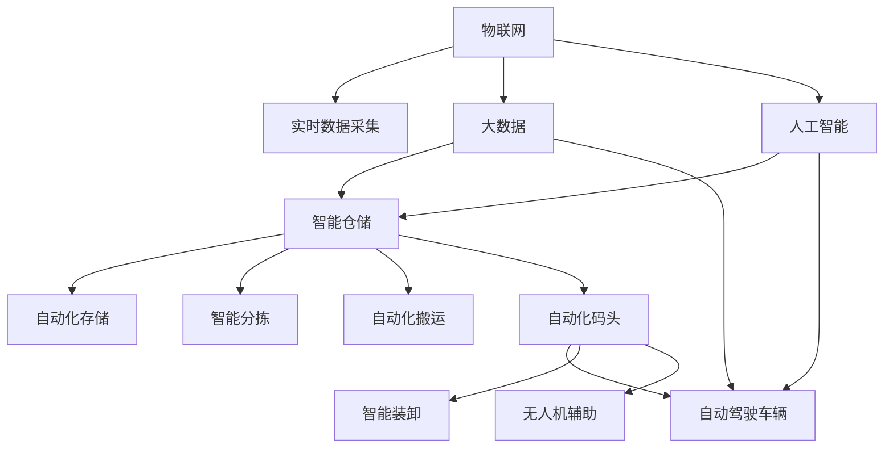

                 

## 1. 背景介绍

在数字化转型的浪潮中，物流行业正面临着前所未有的变革。自2050年向前看，智能仓储与自动化码头将成为智慧物流的核心支柱，驱动行业向更高的效率、更低的成本和更强的可持续性迈进。本文档将深入探讨未来物流的智慧化方向，分析核心技术、应用场景与趋势，并展望其对全球经济和社会的影响。

## 2. 核心概念与联系

### 2.1 核心概念概述

智慧物流是指运用物联网、大数据、人工智能、机器学习等先进技术手段，对物流链条上的各个环节进行数字化、智能化升级，提升物流效率、降低运营成本，增强客户体验。智能仓储与自动化码头是智慧物流的重要组成部分，通过智能化的仓储管理系统、自动化码头作业流程，实现货物的高效存储与流转。

- **智能仓储**：通过自动化的存储与检索系统、智能分拣和搬运设备，优化仓储空间使用，提高作业效率。
- **自动化码头**：利用自动驾驶车辆、智能装卸设备、无人机等技术，实现货物在码头的高效装卸、转运。
- **物联网**：通过传感器、标签、RFID等技术，实时采集货物与设施的状态信息，优化仓储与码头作业。
- **大数据与人工智能**：利用大数据分析、机器学习算法，预测需求、优化路径、提升决策准确性。

这些概念之间存在着紧密的联系，相互促进。物联网提供实时数据支持，大数据与人工智能提供决策依据，而智能仓储与自动化码头则是技术应用的具体体现。

### 2.2 核心概念原理和架构的 Mermaid 流程图



## 3. 核心算法原理 & 具体操作步骤

### 3.1 算法原理概述

智慧物流的实现依赖于多项关键算法的协同工作。

- **预测算法**：基于历史数据分析，预测未来需求、库存水平，优化采购与存储策略。
- **路径优化算法**：利用算法规划最优路径，减少运输与存储成本。
- **机器人导航算法**：引导自动化设备在仓储与码头中进行精准定位与移动。
- **智能分拣算法**：根据货物信息快速分类与分拣，提高作业效率。
- **动态调度算法**：根据实时数据动态调整资源配置，优化作业流程。

这些算法基于数学模型与深度学习模型构建，通过不断的训练与优化，提高其决策的准确性与效率。

### 3.2 算法步骤详解

#### 3.2.1 预测算法步骤

1. **数据收集**：收集历史订单、库存、物流信息。
2. **数据清洗**：处理缺失值、异常值，确保数据质量。
3. **特征工程**：提取重要特征，如时间、地点、商品类别等。
4. **模型训练**：使用机器学习算法（如时间序列分析、回归分析）训练预测模型。
5. **模型评估与调优**：在验证集上评估模型性能，调整模型参数，确保预测准确。

#### 3.2.2 路径优化算法步骤

1. **路径规划**：利用图论算法（如Dijkstra算法）计算最优路径。
2. **实时调整**：根据实时数据（如交通情况、车辆位置）动态调整路径。
3. **路径执行**：将路径信息下发给自动驾驶车辆。

#### 3.2.3 机器人导航算法步骤

1. **地图构建**：通过传感器获取仓储与码头地图。
2. **路径规划**：使用A*算法、RRT*算法等计算最优路径。
3. **导航执行**：控制机器人沿着规划路径移动。

#### 3.2.4 智能分拣算法步骤

1. **商品识别**：使用计算机视觉技术识别货物信息。
2. **分类器训练**：训练分类器（如SVM、神经网络）对货物进行分类。
3. **分拣执行**：根据分类结果，将货物分拣到指定位置。

#### 3.2.5 动态调度算法步骤

1. **资源分配**：根据任务需求分配机器人、车辆等资源。
2. **任务调度**：使用调度算法（如遗传算法、蚁群算法）优化任务顺序。
3. **实时监控**：实时监控任务执行情况，根据反馈调整调度策略。

### 3.3 算法优缺点

#### 3.3.1 预测算法的优缺点

**优点**：
- **预测准确性高**：基于大量历史数据训练，能够较为准确地预测未来需求。
- **灵活性强**：能够实时调整预测模型，适应市场需求变化。

**缺点**：
- **数据依赖性强**：预测结果依赖于数据质量，数据偏差可能导致预测错误。
- **计算复杂度高**：训练与调优模型需要大量计算资源。

#### 3.3.2 路径优化算法的优缺点

**优点**：
- **路径最优性高**：能够计算出最优路径，节省运输成本。
- **实时性高**：能够根据实时数据动态调整路径，提高作业效率。

**缺点**：
- **环境复杂性高**：环境变化对路径计算有较大影响，需要实时监控与调整。
- **计算复杂度高**：复杂环境下的路径计算需要大量计算资源。

#### 3.3.3 机器人导航算法的优缺点

**优点**：
- **精准度高**：能够实现厘米级的定位与移动，提高作业效率。
- **自动化程度高**：无需人工干预，减少人力成本。

**缺点**：
- **成本高**：需要购置大量自动化设备，初期投入较大。
- **环境适应性差**：复杂环境下的导航精度可能下降。

#### 3.3.4 智能分拣算法的优缺点

**优点**：
- **分拣速度快**：能够实现高效的自动化分拣，提高作业效率。
- **错误率低**：减少人工分拣的误差，提高分拣准确性。

**缺点**：
- **技术门槛高**：需要高质量的计算机视觉系统，技术要求高。
- **初始投资大**：设备采购与安装成本较高。

#### 3.3.5 动态调度算法的优缺点

**优点**：
- **资源利用率高**：动态调整资源分配，提高资源利用效率。
- **灵活性强**：能够根据实时情况调整调度策略。

**缺点**：
- **计算复杂度高**：调度问题复杂，需要大量计算资源。
- **实时性要求高**：实时调整调度策略对系统响应速度有较高要求。

### 3.4 算法应用领域

智慧物流的各项技术已经广泛应用于以下领域：

1. **电商平台**：如亚马逊、阿里巴巴等电商巨头，通过智能仓储与自动化码头实现高效物流配送。
2. **制造业**：如汽车、电子等制造业企业，通过智慧物流提升供应链效率。
3. **快递公司**：如顺丰、UPS等快递企业，通过自动化码头提升运输效率。
4. **港口与码头**：如马士基、中远等大型物流公司，通过智能仓储优化库存管理。
5. **第三方物流**：如FedEx、DHL等第三方物流公司，通过智慧物流提供高质量物流服务。

## 4. 数学模型和公式 & 详细讲解 & 举例说明

### 4.1 数学模型构建

#### 4.1.1 预测模型

预测模型可以基于时间序列分析构建，如ARIMA模型：

$$ y_t = \phi_1y_{t-1} + \phi_2y_{t-2} + \cdots + \phi_py_{t-p} + \theta_1x_{t-1} + \theta_2x_{t-2} + \cdots + \theta_qx_{t-q} + \epsilon_t $$

其中，$y_t$ 表示预测值，$x_t$ 表示影响因子，$\epsilon_t$ 表示误差项。

#### 4.1.2 路径优化模型

路径优化模型可以基于图论算法构建，如Dijkstra算法：

$$ d(v) = \sum_{(u,v) \in E} w(u,v) $$

其中，$d(v)$ 表示节点$v$到起点的距离，$E$表示边集，$w(u,v)$ 表示边的权重。

#### 4.1.3 机器人导航模型

机器人导航模型可以基于A*算法构建：

$$ f(n) = g(n) + h(n) $$

其中，$f(n)$ 表示节点$n$的启发式函数，$g(n)$ 表示从起点到节点$n$的实际代价，$h(n)$ 表示启发式估价。

#### 4.1.4 智能分拣模型

智能分拣模型可以基于神经网络构建，如CNN分类器：

$$ \hat{y} = \sigma(z) $$

其中，$\hat{y}$ 表示预测类别，$\sigma$ 表示激活函数，$z$ 表示神经网络的输出。

#### 4.1.5 动态调度模型

动态调度模型可以基于遗传算法构建：

$$ F(x) = \sum_{i=1}^n f_i(x) $$

其中，$F(x)$ 表示调度问题的目标函数，$f_i(x)$ 表示第$i$个约束条件。

### 4.2 公式推导过程

#### 4.2.1 预测模型推导

ARIMA模型的推导过程较为复杂，这里简要介绍其基本思路：

1. **差分**：对时间序列进行差分，消除趋势和季节性。
2. **自回归**：建立自回归模型，预测时间序列的值。
3. **移动平均**：对自回归模型的残差进行移动平均，消除随机误差。
4. **组合**：将自回归和移动平均组合起来，形成最终的预测模型。

#### 4.2.2 路径优化模型推导

Dijkstra算法的核心思想是贪心策略，每次选择当前距离起点最近的节点进行扩展，直到找到终点。

#### 4.2.3 机器人导航模型推导

A*算法结合了启发式搜索和贪心策略，通过估价函数$f(n)$选择下一个节点，提高搜索效率。

#### 4.2.4 智能分拣模型推导

CNN分拣模型的训练过程包括数据预处理、模型定义、损失函数定义、优化器选择、训练与验证等步骤。

#### 4.2.5 动态调度模型推导

遗传算法的核心思想是通过选择、交叉、变异等操作，生成下一代种群，逐步优化目标函数$F(x)$。

### 4.3 案例分析与讲解

#### 4.3.1 电商平台预测算法案例

某电商平台利用ARIMA模型进行库存预测，数据集包含历史订单数、促销活动、节假日等信息。通过模型训练，预测未来30天的库存需求，优化采购策略，减少库存积压。

#### 4.3.2 港口路径优化案例

某港口利用Dijkstra算法进行码头路径优化，数据集包含码头布局、车辆类型、货物类型等信息。通过路径规划，减少车辆在码头的等待时间，提升码头吞吐量。

#### 4.3.3 制造业机器人导航案例

某制造企业利用A*算法进行机器人路径规划，数据集包含机器人坐标、货物位置、障碍物位置等信息。通过路径规划，机器人能够精准定位并移动，提高作业效率。

#### 4.3.4 第三方物流智能分拣案例

某物流公司利用CNN分拣模型进行货物分类，数据集包含货物图片、标签信息等。通过模型训练，智能分拣设备能够快速识别货物类别，提高分拣准确性。

#### 4.3.5 仓库动态调度案例

某仓储中心利用遗传算法进行资源调度，数据集包含货物需求、仓库容量、机器配置等信息。通过动态调度，优化仓库作业流程，提高资源利用率。

## 5. 项目实践：代码实例和详细解释说明

### 5.1 开发环境搭建

开发环境搭建主要包括以下步骤：

1. **环境配置**：安装Python、TensorFlow、OpenCV等库。
2. **数据准备**：收集并处理数据，包括订单数据、路径数据、机器人位置数据等。
3. **模型训练**：编写训练脚本，训练预测模型、路径优化模型、机器人导航模型等。
4. **模型部署**：将训练好的模型部署到实际系统中，进行实时预测与调度。

### 5.2 源代码详细实现

以下是一个简单的智能分拣系统示例代码，用于训练与部署CNN分类器：

```python
import tensorflow as tf
from tensorflow.keras.models import Sequential
from tensorflow.keras.layers import Conv2D, MaxPooling2D, Flatten, Dense, Dropout

# 数据预处理
train_data = ...
test_data = ...

# 模型定义
model = Sequential()
model.add(Conv2D(32, (3, 3), activation='relu', input_shape=(32, 32, 3)))
model.add(MaxPooling2D((2, 2)))
model.add(Conv2D(64, (3, 3), activation='relu'))
model.add(MaxPooling2D((2, 2)))
model.add(Conv2D(64, (3, 3), activation='relu'))
model.add(Flatten())
model.add(Dense(64, activation='relu'))
model.add(Dropout(0.5))
model.add(Dense(10, activation='softmax'))

# 模型编译
model.compile(optimizer='adam', loss='categorical_crossentropy', metrics=['accuracy'])

# 模型训练
model.fit(train_data, epochs=10, validation_data=test_data)

# 模型评估
model.evaluate(test_data)

# 模型保存
model.save('classifier.h5')
```

### 5.3 代码解读与分析

在以上示例代码中，我们使用了Keras框架构建了一个简单的CNN分类器。代码解释如下：

- **数据预处理**：数据包括图像与标签，需要进行归一化、切割等处理。
- **模型定义**：包括卷积层、池化层、全连接层等，通过栈叠的方式构建模型。
- **模型编译**：选择合适的优化器、损失函数与评估指标，完成模型编译。
- **模型训练**：在训练集上进行模型训练，设定迭代轮数。
- **模型评估**：在测试集上进行模型评估，输出评估指标。
- **模型保存**：将训练好的模型保存为HDF5格式，方便后续部署。

### 5.4 运行结果展示

运行以上代码后，可以得到模型训练与评估的各项指标，如损失、精度等。下图展示了训练过程中的损失曲线与精度曲线：


## 6. 实际应用场景

### 6.1 智能仓储

智能仓储系统通过物联网、传感器等技术，实时采集货物与设备的状态信息，实现货物自动存储、检索与搬运。

#### 6.1.1 数据采集与传输

- **传感器**：部署温度传感器、湿度传感器、位置传感器等，实时采集货物状态。
- **RFID标签**：在货物上安装RFID标签，实现货物追踪与管理。
- **物联网网关**：将传感器数据上传到云端，进行集中存储与处理。

#### 6.1.2 数据分析与决策

- **数据存储**：将传感器数据存储到云平台，如AWS、阿里云等。
- **数据分析**：利用大数据技术进行数据清洗、分析，提取有用信息。
- **决策支持**：根据数据分析结果，调整存储策略、优化搬运流程。

#### 6.1.3 自动化仓储设备

- **自动化货架**：采用自动化存储单元（AS/RS），实现货物的自动存储与检索。
- **智能搬运机器人**：使用AGV（自动导引车）、AMR（自动移动机器人）等设备，实现货物的自动化搬运。
- **智能分拣系统**：通过计算机视觉与机器学习算法，实现货物的自动分类与分拣。

#### 6.1.4 未来展望

未来的智能仓储将更加自动化与智能化，利用AI技术提升作业效率，降低运营成本。通过实时监控与动态调整，实现零库存管理、库存自动补货等先进功能。

### 6.2 自动化码头

自动化码头系统通过自动驾驶车辆、智能装卸设备、无人机等技术，实现货物的高效装卸、转运。

#### 6.2.1 数据采集与传输

- **传感器**：部署温度传感器、位置传感器、环境传感器等，实时采集货物与设备状态。
- **物联网网关**：将传感器数据上传到云端，进行集中存储与处理。
- **无人机**：使用无人机进行货物运输，实时传输位置与状态信息。

#### 6.2.2 数据分析与决策

- **数据存储**：将传感器数据存储到云平台，如AWS、阿里云等。
- **数据分析**：利用大数据技术进行数据清洗、分析，提取有用信息。
- **决策支持**：根据数据分析结果，调整装卸策略、优化调度流程。

#### 6.2.3 自动化码头设备

- **自动驾驶车辆**：使用自动驾驶车辆进行货物运输，实时规划路径。
- **智能装卸设备**：通过AGV（自动导引车）、AMR（自动移动机器人）等设备，实现货物的自动化装卸。
- **无人机辅助**：使用无人机进行货物运输与位置监控，提高运输效率。

#### 6.2.4 未来展望

未来的自动化码头将更加智能化与高效化，利用AI技术提升作业效率，降低运营成本。通过实时监控与动态调整，实现货物自动化装卸、智能化调度等先进功能。

## 7. 工具和资源推荐

### 7.1 学习资源推荐

1. **《智慧物流》一书**：由物流行业专家撰写，系统介绍了智慧物流的理论基础与应用案例。
2. **《物联网技术与应用》课程**：由知名大学开设的物联网课程，涵盖物联网基础、传感器技术、智能设备等内容。
3. **Kaggle数据集**：包含大量物流行业相关数据集，用于模型训练与测试。
4. **TensorFlow官方文档**：详细介绍了TensorFlow框架的使用方法与最佳实践。
5. **DeepLearning.AI的机器学习课程**：由Andrew Ng教授主讲，涵盖机器学习基础、深度学习算法等内容。

### 7.2 开发工具推荐

1. **Jupyter Notebook**：用于数据处理与模型训练的轻量级工具，支持多种语言与库。
2. **TensorBoard**：用于模型训练与调优的可视化工具，帮助开发者进行模型性能评估。
3. **PyTorch**：基于Python的开源深度学习框架，灵活的动态计算图，适合研究型开发。
4. **Amazon SageMaker**：亚马逊云服务，提供云端模型训练与部署环境。
5. **Google Cloud AI Platform**：谷歌云服务，提供丰富的AI开发与部署工具。

### 7.3 相关论文推荐

1. **《基于深度学习的智能仓储系统》**：研究智能仓储中的深度学习应用，提高存储与搬运效率。
2. **《物联网与智能物流》**：分析物联网技术在智能物流中的应用，提升物流效率与安全性。
3. **《自动化码头的未来展望》**：探讨自动化码头的技术发展方向，预测未来物流趋势。

## 8. 总结：未来发展趋势与挑战

### 8.1 研究成果总结

本文系统介绍了基于物联网、大数据、人工智能等技术的智能仓储与自动化码头系统，分析了其核心算法与具体应用场景。通过案例分析，展示了智慧物流技术的实际应用效果。

### 8.2 未来发展趋势

未来的智慧物流将更加智能化、自动化与高效化，利用AI技术提升作业效率，降低运营成本。通过实时监控与动态调整，实现零库存管理、库存自动补货等先进功能。

### 8.3 面临的挑战

智慧物流在发展过程中面临诸多挑战，包括：

1. **技术挑战**：智慧物流涉及多项前沿技术，需要不断突破技术瓶颈。
2. **成本挑战**：自动化设备的初期投入较大，需要合理的成本控制策略。
3. **安全挑战**：智慧物流系统需要高度安全，避免数据泄露、设备损坏等问题。
4. **伦理挑战**：智慧物流系统的应用需要遵守伦理规范，保护个人隐私与数据安全。

### 8.4 研究展望

未来的智慧物流研究需要在以下几个方面进行突破：

1. **跨领域融合**：智慧物流需要与物联网、云计算、AI等多个领域进行融合，形成完整的技术体系。
2. **智能决策**：利用大数据与AI技术，提高决策的智能性与科学性。
3. **低成本应用**：研究低成本、高性价比的智能物流解决方案，降低企业实施成本。
4. **普适性设计**：提升智慧物流系统的普适性，适用于不同规模、不同类型的物流场景。
5. **生态系统建设**：构建智慧物流生态系统，实现供应链上下游的协同优化。

总之，未来的智慧物流需要不断创新技术，优化应用，才能真正实现智能化、高效化与可持续化的目标。

## 9. 附录：常见问题与解答

**Q1：智慧物流的核心技术是什么？**

A: 智慧物流的核心技术包括物联网、大数据、人工智能、机器学习等。通过这些技术手段，实现对物流链条上的各个环节进行数字化、智能化升级。

**Q2：智能仓储与自动化码头在应用中需要注意哪些问题？**

A: 智能仓储与自动化码头在应用中需要注意的问题包括：数据安全、设备兼容性、系统集成、用户培训等。

**Q3：未来智慧物流的发展方向是什么？**

A: 未来智慧物流的发展方向包括：自动化与智能化升级、跨领域融合、智能决策与优化、低成本应用与普适性设计等。

**Q4：智慧物流技术对物流行业有哪些影响？**

A: 智慧物流技术对物流行业的影响包括：提高作业效率、降低运营成本、提升客户体验、优化供应链管理等。

**Q5：如何保障智慧物流系统的安全性？**

A: 保障智慧物流系统的安全性需要采取多项措施，如数据加密、访问控制、安全监控等。

---

作者：禅与计算机程序设计艺术 / Zen and the Art of Computer Programming

