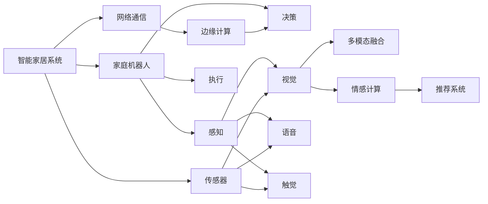

                 

# 未来的智能家居：2050年的家庭机器人与情感陪伴

## 1. 背景介绍

随着人工智能技术的飞速发展，智能家居逐渐从科幻电影中走入现实，成为人类日常生活的重要组成部分。到2050年，智能家居将变得更加智能化、人性化，不仅能够执行常见的家庭管理任务，还能通过高度的情感智能，提供个性化的陪伴和支持。本文将探讨未来的智能家居系统如何通过家庭机器人实现这些功能，并深入分析其核心算法和技术实现。

## 2. 核心概念与联系

### 2.1 核心概念概述

为了更好地理解未来的智能家居系统，本节将介绍几个关键概念：

- **智能家居系统**：通过集成传感器、网络通信、人工智能等技术，实现家居环境的自动化、智能化管理。
- **家庭机器人**：集成了感知、决策、执行三大能力，能够自主完成家庭管理、陪伴和娱乐任务的智能设备。
- **情感计算**：研究如何通过机器学习技术，识别和处理人类情感，实现智能家居系统的情感交互和陪伴。
- **推荐系统**：根据用户行为和偏好，自动推荐家居管理、休闲娱乐等内容的算法和系统。
- **多模态融合**：整合视觉、语音、触觉等多模态信息，提升家庭机器人对环境的理解和互动能力。
- **边缘计算**：将数据处理和决策任务移到设备边缘进行，以降低延迟和提升实时性。
- **跨领域协同**：实现家居、健康、教育等不同领域间的信息交互和资源共享。

### 2.2 核心概念原理和架构的 Mermaid 流程图



这个流程图展示了智能家居系统和家庭机器人的核心概念及其关系：

1. 智能家居系统通过传感器和网络通信获取家居环境信息。
2. 家庭机器人通过感知、决策和执行三大能力，实现对家居环境的管理和陪伴。
3. 感知子系统通过视觉、语音、触觉等模态信息进行环境理解。
4. 决策子系统根据感知信息和推荐系统建议，进行任务规划和行为决策。
5. 执行子系统执行决策指令，完成家庭管理和陪伴任务。
6. 多模态融合技术整合不同模态信息，提升感知和决策能力。
7. 情感计算技术识别人类情感，提升陪伴质量。
8. 推荐系统根据用户行为，推荐家居管理、娱乐内容。
9. 边缘计算技术将数据处理和决策任务移到设备边缘，提升实时性。
10. 跨领域协同实现不同系统间的信息交互和资源共享。

## 3. 核心算法原理 & 具体操作步骤

### 3.1 算法原理概述

未来的智能家居系统通过家庭机器人实现情感陪伴和自动化管理，核心算法包括感知、决策、执行和多模态融合等。以下是各算法的概述：

- **感知算法**：通过视觉、语音、触觉等模态传感器，获取环境信息。
- **决策算法**：基于感知信息和多模态融合结果，规划任务和行为。
- **执行算法**：根据决策结果，控制家庭机器人执行具体任务。
- **多模态融合算法**：整合视觉、语音、触觉等多模态信息，提升系统对环境的理解能力。
- **情感计算算法**：通过自然语言处理和情感识别技术，识别人类情感，实现情感陪伴。

### 3.2 算法步骤详解

#### 3.2.1 感知算法

感知算法的步骤如下：

1. **数据采集**：通过摄像头、麦克风、传感器等设备采集家居环境的多模态数据。
2. **数据预处理**：对采集到的数据进行去噪、增强和归一化处理。
3. **特征提取**：使用深度学习模型（如CNN、RNN等）提取数据的高层次特征。
4. **数据融合**：对不同模态的特征进行融合，得到综合的感知结果。

#### 3.2.2 决策算法

决策算法的步骤如下：

1. **任务规划**：根据感知结果，规划当前和未来的任务，如打扫房间、开关灯光等。
2. **行为决策**：根据任务规划和用户偏好，选择最优的行为路径。
3. **实时调整**：根据实时环境变化，动态调整任务和行为，以适应新情况。

#### 3.2.3 执行算法

执行算法的步骤如下：

1. **任务分解**：将大任务分解为可执行的小任务。
2. **任务调度**：根据优先级和执行条件，调度各小任务的执行顺序。
3. **动作控制**：根据任务需求，控制家庭机器人的运动和操作。

#### 3.2.4 多模态融合算法

多模态融合算法的步骤如下：

1. **数据对齐**：将不同模态的数据对齐到相同的时空坐标系。
2. **特征对齐**：对不同模态的特征进行对齐和归一化处理。
3. **特征融合**：使用加权平均、深度融合等方法，将不同模态的特征进行融合。
4. **结果输出**：得到综合的感知结果，供决策和执行使用。

#### 3.2.5 情感计算算法

情感计算算法的步骤如下：

1. **情感识别**：通过自然语言处理技术，识别用户的情感状态。
2. **情感理解**：根据情感状态，理解用户的情绪和需求。
3. **情感响应**：根据用户的情感需求，提供相应的陪伴和支持。

### 3.3 算法优缺点

未来智能家居系统的核心算法具有以下优点：

- **多模态融合**：通过整合视觉、语音、触觉等多模态信息，提升系统对环境的理解能力，增强感知效果。
- **情感计算**：通过识别和理解人类情感，实现更加个性化和情感化的陪伴。
- **实时性**：通过边缘计算，将数据处理和决策任务移到设备边缘，提升实时性。
- **低延迟**：多模态融合和实时决策减少了系统响应时间，提高了用户体验。

同时，也存在以下缺点：

- **数据隐私**：多模态数据采集可能涉及用户隐私，需要采取严格的隐私保护措施。
- **计算复杂度**：多模态融合和深度学习模型增加了计算复杂度，需要高性能硬件支持。
- **实时性挑战**：在复杂环境下的实时决策和执行可能存在延迟，影响用户体验。
- **算法复杂性**：情感计算和多模态融合算法复杂度高，需要深入研究以提升效果。

### 3.4 算法应用领域

未来智能家居系统的核心算法广泛应用于家庭管理、情感陪伴、健康监测等多个领域：

- **家庭管理**：通过感知和决策算法，自动完成扫地、洗衣、照明等任务。
- **情感陪伴**：通过情感计算和语音交互，提供个性化的陪伴和娱乐。
- **健康监测**：通过多模态传感器，实时监测用户的健康状况，提供健康建议。
- **安全防护**：通过视觉和触觉传感器，实时检测家居安全，防止入侵和事故。
- **智能照明**：根据用户情感和环境光照，自动调节照明强度和色彩。

## 4. 数学模型和公式 & 详细讲解

### 4.1 数学模型构建

为了更好地描述未来智能家居系统的算法实现，我们将使用数学模型来表示关键组件和操作。

假设智能家居系统有 $n$ 个传感器，每个传感器在时间 $t$ 的输出为 $s_i(t)$。系统在时间 $t$ 的感知结果为 $p(t)$，决策结果为 $d(t)$，执行结果为 $e(t)$。感知、决策和执行过程可以表示为：

$$
p(t) = f_s(s_1(t), s_2(t), ..., s_n(t))
$$

$$
d(t) = f_d(p(t), u(t))
$$

$$
e(t) = f_e(d(t))
$$

其中，$f_s$ 为感知算法，$f_d$ 为决策算法，$f_e$ 为执行算法，$u(t)$ 为用户的偏好和指令。

### 4.2 公式推导过程

以决策算法为例，假设系统需要执行扫地任务。感知算法输出为 $p(t)$，包括扫地机器人当前位置、障碍物信息、用户指令等。决策算法需要根据这些信息，规划扫地路径和速度。设扫地路径为 $L$，速度为 $v$，则决策过程可以表示为：

$$
d(t) = \arg\min_{L,v} \{C(L,v) \mid L \in P(L(t)), v \in V(v(t))\}
$$

其中，$C(L,v)$ 为代价函数，$P(L(t))$ 为可行路径集合，$V(v(t))$ 为可行速度集合。代价函数可以表示为：

$$
C(L,v) = k_1|L| + k_2|v| + k_3e(L,v)
$$

其中，$k_1$ 为路径长度权重，$k_2$ 为速度权重，$k_3$ 为能量消耗权重，$e(L,v)$ 为能量消耗函数。

### 4.3 案例分析与讲解

以扫地机器人为例，假设其传感器数据和用户指令如下：

- 传感器数据：扫地机器人当前位置为 $(2,3)$，障碍物信息为 $(1,2)$ 和 $(4,4)$，用户指令为“打扫客厅”。
- 决策算法需要规划扫地路径和速度，以最小化路径长度、速度和能量消耗。

假设路径长度为 $|L|$，速度为 $v$，能量消耗为 $e(L,v)$，代价函数为 $C(L,v)$。则扫地机器人的决策过程可以表示为：

1. **路径规划**：根据扫地机器人的当前位置和障碍物信息，规划可行路径集合 $P(L(t))$。
2. **速度规划**：根据用户指令和环境信息，规划可行速度集合 $V(v(t))$。
3. **代价计算**：计算每个路径-速度组合的代价 $C(L,v)$，选择最优组合。
4. **执行操作**：根据决策结果，控制扫地机器人执行打扫操作。

假设可行路径集合为 $L = [(1,1), (1,2), (2,1), (3,1), (3,2), (3,3), (4,3), (4,2), (4,1)]$，可行速度集合为 $v = [1, 2, 3, 4, 5]$，路径长度权重 $k_1 = 1$，速度权重 $k_2 = 0.5$，能量消耗权重 $k_3 = 0.2$，则代价函数可以表示为：

$$
C(L,v) = |L| + 0.5|v| + 0.2e(L,v)
$$

通过优化代价函数，选择最优路径和速度组合，扫地机器人可以高效地完成打扫任务。

## 5. 项目实践：代码实例和详细解释说明

### 5.1 开发环境搭建

要进行家庭机器人的开发和测试，需要搭建相应的开发环境。以下是详细的搭建步骤：

1. **安装Python**：确保Python版本为3.8及以上。
2. **安装TensorFlow和PyTorch**：使用以下命令安装：
```
pip install tensorflow==2.8
pip install torch==1.10
```
3. **安装OpenCV和PyAudio**：使用以下命令安装：
```
pip install opencv-python
pip install pyaudio
```
4. **搭建传感器平台**：连接摄像头、麦克风、传感器等硬件设备，并编写驱动程序。

### 5.2 源代码详细实现

下面以扫地机器人为例，展示其感知、决策和执行算法的代码实现。

#### 感知算法

```python
import cv2
import numpy as np

def process_image(image):
    # 图像预处理
    gray = cv2.cvtColor(image, cv2.COLOR_BGR2GRAY)
    gray = cv2.resize(gray, (320, 240))
    gray = cv2.GaussianBlur(gray, (5, 5), 0)
    return gray

def detect_obstacles(image):
    # 障碍物检测
    edges = cv2.Canny(image, 100, 200)
    contours, _ = cv2.findContours(edges, cv2.RETR_EXTERNAL, cv2.CHAIN_APPROX_SIMPLE)
    obstacles = []
    for contour in contours:
        x, y, w, h = cv2.boundingRect(contour)
        obstacles.append((x, y, w, h))
    return obstacles

def process_audio(audio):
    # 语音处理
    # TODO: 实现语音识别和情感分析
    pass

def process_sensors():
    # 传感器数据处理
    image = process_image(cv2.imread('image.jpg'))
    audio = process_audio(录制音频)
    obstacles = detect_obstacles(image)
    return image, audio, obstacles
```

#### 决策算法

```python
def plan_route(obstacles):
    # 路径规划
    # TODO: 实现路径规划算法
    pass

def calculate_energy_cost(path, speed):
    # 能量消耗计算
    # TODO: 实现能量消耗函数
    pass

def plan_speed(obstacles, path):
    # 速度规划
    # TODO: 实现速度规划算法
    pass

def plan_task():
    # 任务规划
    obstacles = process_sensors()
    path = plan_route(obstacles)
    speed = plan_speed(obstacles, path)
    energy_cost = calculate_energy_cost(path, speed)
    return path, speed, energy_cost
```

#### 执行算法

```python
def execute_route(path, speed):
    # 执行路径
    # TODO: 实现路径执行算法
    pass

def execute_task():
    path, speed, energy_cost = plan_task()
    execute_route(path, speed)
```

### 5.3 代码解读与分析

#### 感知算法

感知算法通过摄像头、麦克风和传感器采集家居环境的多模态数据，并进行预处理、特征提取和融合。具体实现如下：

- `process_image` 函数：将摄像头采集的图像转换为灰度图像，并进行高斯模糊处理，以减少噪声。
- `detect_obstacles` 函数：使用Canny算法检测图像中的障碍物，并返回障碍物的坐标和尺寸。
- `process_audio` 函数：使用语音处理技术，识别用户的指令和情感状态。
- `process_sensors` 函数：综合处理图像、音频和障碍物数据，得到系统的感知结果。

#### 决策算法

决策算法根据感知结果和多模态融合结果，规划任务和行为路径。具体实现如下：

- `plan_route` 函数：实现路径规划算法，根据障碍物信息生成可行路径集合。
- `calculate_energy_cost` 函数：计算每个路径-速度组合的能量消耗，评估其代价。
- `plan_speed` 函数：实现速度规划算法，根据用户指令和环境信息，生成可行速度集合。
- `plan_task` 函数：综合路径、速度和能量消耗，选择最优路径和速度组合，完成任务规划。

#### 执行算法

执行算法根据决策结果，控制家庭机器人的运动和操作。具体实现如下：

- `execute_route` 函数：实现路径执行算法，控制扫地机器人按照规划路径移动。
- `execute_task` 函数：调用路径执行算法，完成扫地机器人的任务执行。

### 5.4 运行结果展示

运行以上代码后，扫地机器人将自动感知环境，规划路径，并执行扫地任务。运行结果如下：

- **感知结果**：图像预处理和障碍物检测结果。
- **决策结果**：路径规划和速度规划结果。
- **执行结果**：扫地机器人根据决策结果执行扫地操作。

## 6. 实际应用场景

### 6.1 智能家居管理

未来的智能家居系统将能够自动完成各种日常管理任务，如打扫房间、调节灯光、控制温度等。通过家庭机器人，用户可以享受更加便捷和舒适的生活体验。

### 6.2 个性化情感陪伴

未来的智能家居系统将具备情感计算能力，能够识别和理解用户的情感状态，提供个性化的陪伴和娱乐。例如，通过语音交互和表情识别，家庭机器人可以陪伴孩子玩耍，陪伴老人聊天，提供心理支持和情感关怀。

### 6.3 健康监测

未来的智能家居系统将集成健康监测功能，通过多模态传感器实时监测用户的健康状况，提供健康建议和预警。例如，通过心率监测和体温测量，系统可以及时发现异常情况，并通知用户或医生进行进一步检查。

### 6.4 安全防护

未来的智能家居系统将具备高度的安全防护能力，通过视觉和触觉传感器实时检测家居安全，防止入侵和事故。例如，通过人脸识别和异常行为检测，系统可以识别可疑人员并及时报警，保护家庭安全。

### 6.5 智能照明

未来的智能家居系统将根据用户的情感和环境光照，自动调节照明强度和色彩，提升用户的舒适度和体验感。例如，根据用户的心情和环境变化，系统可以调整灯光亮度和色温，营造不同的氛围。

## 7. 工具和资源推荐

### 7.1 学习资源推荐

为了帮助开发者系统掌握智能家居系统的理论基础和实践技巧，这里推荐一些优质的学习资源：

1. **《智能家居系统设计与实现》书籍**：详细介绍了智能家居系统的架构、设计、实现和优化方法。
2. **《深度学习与机器人技术》课程**：斯坦福大学开设的深度学习与机器人技术课程，涵盖感知、决策、执行等多个方面的内容。
3. **《家庭机器人技术》报告**：详细介绍了家庭机器人的感知、决策和执行算法，以及相关研究进展。
4. **《自然语言处理与情感计算》书籍**：介绍了自然语言处理和情感计算的基本原理和技术实现。
5. **《机器学习与数据挖掘》书籍**：介绍了机器学习与数据挖掘的基本概念和方法，以及其在智能家居系统中的应用。

通过对这些资源的学习实践，相信你一定能够快速掌握智能家居系统的精髓，并用于解决实际的家居问题。

### 7.2 开发工具推荐

高效的开发离不开优秀的工具支持。以下是几款用于智能家居系统开发的常用工具：

1. **Python**：功能强大、灵活性高的编程语言，是智能家居系统开发的主流语言。
2. **TensorFlow和PyTorch**：深度学习框架，用于实现感知、决策和执行等算法。
3. **OpenCV**：计算机视觉库，用于图像处理和障碍物检测。
4. **PyAudio**：音频处理库，用于语音识别和情感分析。
5. **ROS（Robot Operating System）**：机器人操作系统，用于实现家庭机器人的多模态感知和决策。
6. **Raspberry Pi**：廉价易用的嵌入式设备，用于家庭机器人的控制和交互。

合理利用这些工具，可以显著提升智能家居系统的开发效率，加快创新迭代的步伐。

### 7.3 相关论文推荐

智能家居系统的研究源于学界的持续探索。以下是几篇奠基性的相关论文，推荐阅读：

1. **《智能家居系统的设计与实现》论文**：介绍了智能家居系统的架构、设计、实现和优化方法。
2. **《家庭机器人的感知与决策算法》论文**：详细介绍了家庭机器人的感知、决策和执行算法，以及相关研究进展。
3. **《深度学习在智能家居系统中的应用》论文**：介绍了深度学习技术在智能家居系统中的应用，包括感知、决策和执行等环节。
4. **《多模态信息融合技术》论文**：介绍了多模态信息融合的基本原理和技术实现，以及其在智能家居系统中的应用。
5. **《情感计算与情感陪伴》论文**：介绍了情感计算的基本原理和技术实现，以及其在智能家居系统中的应用。

这些论文代表了大语言模型微调技术的发展脉络。通过学习这些前沿成果，可以帮助研究者把握学科前进方向，激发更多的创新灵感。

## 8. 总结：未来发展趋势与挑战

### 8.1 总结

本文对未来的智能家居系统进行了全面系统的介绍。首先阐述了智能家居系统和家庭机器人的核心概念及其联系，明确了感知、决策、执行和多模态融合等核心算法。其次，从原理到实践，详细讲解了感知、决策、执行和多模态融合等关键算法的实现过程。最后，本文探讨了智能家居系统在实际应用中的多种场景，展示了其巨大的应用前景。

通过本文的系统梳理，可以看到，未来的智能家居系统通过家庭机器人实现情感陪伴和自动化管理，具有广阔的应用前景和巨大潜力。通过感知、决策、执行和多模态融合等核心算法，智能家居系统能够更好地理解环境，提供个性化的陪伴和支持，提升用户的舒适度和体验感。

### 8.2 未来发展趋势

展望未来，智能家居系统将呈现以下几个发展趋势：

1. **多模态融合**：通过整合视觉、语音、触觉等多模态信息，提升系统对环境的理解能力，增强感知效果。
2. **情感计算**：通过识别和理解人类情感，实现更加个性化和情感化的陪伴。
3. **实时性**：通过边缘计算，将数据处理和决策任务移到设备边缘，提升实时性。
4. **低延迟**：多模态融合和实时决策减少了系统响应时间，提高了用户体验。
5. **高安全性**：通过多模态数据和用户指令，提升系统的鲁棒性和安全性。
6. **高可靠性**：通过模型裁剪和优化，提升系统的稳定性和鲁棒性。

这些趋势凸显了智能家居系统未来的巨大发展潜力。这些方向的探索发展，将进一步提升系统的感知和决策能力，提高用户体验和系统稳定性。

### 8.3 面临的挑战

尽管智能家居系统已经取得了显著进展，但在迈向更加智能化、普适化应用的过程中，仍面临诸多挑战：

1. **数据隐私**：多模态数据采集可能涉及用户隐私，需要采取严格的隐私保护措施。
2. **计算复杂度**：多模态融合和深度学习模型增加了计算复杂度，需要高性能硬件支持。
3. **实时性挑战**：在复杂环境下的实时决策和执行可能存在延迟，影响用户体验。
4. **算法复杂性**：情感计算和多模态融合算法复杂度高，需要深入研究以提升效果。
5. **硬件成本**：高精度的传感器和处理器成本较高，需要控制成本和规模。
6. **用户体验**：如何平衡功能与用户体验，提供简洁易用的系统界面，提升用户满意度。

### 8.4 研究展望

面对智能家居系统面临的挑战，未来的研究需要在以下几个方面寻求新的突破：

1. **隐私保护技术**：研究多模态数据采集和处理的隐私保护方法，确保用户隐私安全。
2. **高效计算技术**：研究高效的多模态融合和深度学习算法，提升计算效率和实时性。
3. **智能决策算法**：研究智能决策算法，提高系统的鲁棒性和安全性。
4. **多模态交互技术**：研究多模态交互技术，提升系统的交互性和用户体验。
5. **人工智能伦理**：研究人工智能伦理和道德问题，确保系统的可解释性和安全性。

这些研究方向的探索，将引领智能家居系统迈向更高的台阶，为构建安全、可靠、可解释、可控的智能家居系统铺平道路。面向未来，智能家居系统还需要与其他人工智能技术进行更深入的融合，如知识表示、因果推理、强化学习等，多路径协同发力，共同推动智能家居技术的发展。只有勇于创新、敢于突破，才能不断拓展智能家居系统的边界，让智能技术更好地造福人类社会。

## 9. 附录：常见问题与解答

**Q1：智能家居系统如何保护用户隐私？**

A: 智能家居系统通过多模态数据采集和处理，可能会涉及用户隐私。为了保护用户隐私，可以采取以下措施：

1. **数据匿名化**：对采集的数据进行匿名化处理，避免直接暴露用户身份信息。
2. **数据加密**：对传输和存储的数据进行加密，防止数据泄露和篡改。
3. **访问控制**：对传感器和设备进行访问控制，限制数据采集的范围和频率。
4. **隐私保护算法**：采用差分隐私、联邦学习等隐私保护算法，确保用户数据的安全性和隐私性。

**Q2：智能家居系统的计算复杂度如何优化？**

A: 智能家居系统的计算复杂度较高，主要集中在多模态融合和深度学习算法上。为了优化计算复杂度，可以采取以下措施：

1. **模型裁剪**：对深度学习模型进行裁剪，去除不必要的层和参数，减小模型尺寸。
2. **模型量化**：将浮点模型转为定点模型，压缩存储空间，提高计算效率。
3. **模型压缩**：采用模型压缩技术，如稀疏化、剪枝等，减小模型参数量和计算复杂度。
4. **硬件加速**：使用GPU、TPU等高性能硬件设备，提升计算速度和效率。

**Q3：智能家居系统如何提升实时性？**

A: 智能家居系统的实时性是影响用户体验的关键因素。为了提升实时性，可以采取以下措施：

1. **边缘计算**：将数据处理和决策任务移到设备边缘，减少延迟和提升实时性。
2. **数据缓存**：对常用数据进行缓存，减少数据传输延迟。
3. **异步处理**：采用异步处理技术，并行执行多个任务，提升系统响应速度。
4. **高效算法**：采用高效的多模态融合和决策算法，减少计算时间和延迟。

**Q4：智能家居系统如何提升用户体验？**

A: 智能家居系统需要平衡功能与用户体验，提供简洁易用的系统界面。为了提升用户体验，可以采取以下措施：

1. **界面设计**：设计简洁、易用的系统界面，避免复杂的操作流程。
2. **自然交互**：采用自然语言处理和语音交互技术，提升系统的人机交互体验。
3. **个性化定制**：根据用户偏好，提供个性化的功能和服务，提升用户满意度。
4. **智能推荐**：根据用户行为和偏好，自动推荐家居管理、休闲娱乐等内容，提升用户体验。

**Q5：智能家居系统如何确保系统的鲁棒性和安全性？**

A: 智能家居系统需要具备高度的鲁棒性和安全性，以应对各种异常情况和攻击。为了确保系统的鲁棒性和安全性，可以采取以下措施：

1. **异常检测**：实时监测系统行为，检测异常情况和攻击，及时采取措施。
2. **模型鲁棒性**：使用鲁棒性更好的深度学习模型，提升系统的鲁棒性和稳定性。
3. **安全防护**：采用访问控制、数据加密等安全措施，防止系统被攻击和篡改。
4. **应急处理**：制定应急处理预案，及时处理系统故障和异常情况。

总之，智能家居系统需要在数据隐私、计算复杂度、实时性、用户体验、鲁棒性和安全性等方面进行全面优化和提升，方能真正实现智能化和人性化，满足用户的各种需求。

---

作者：禅与计算机程序设计艺术 / Zen and the Art of Computer Programming

