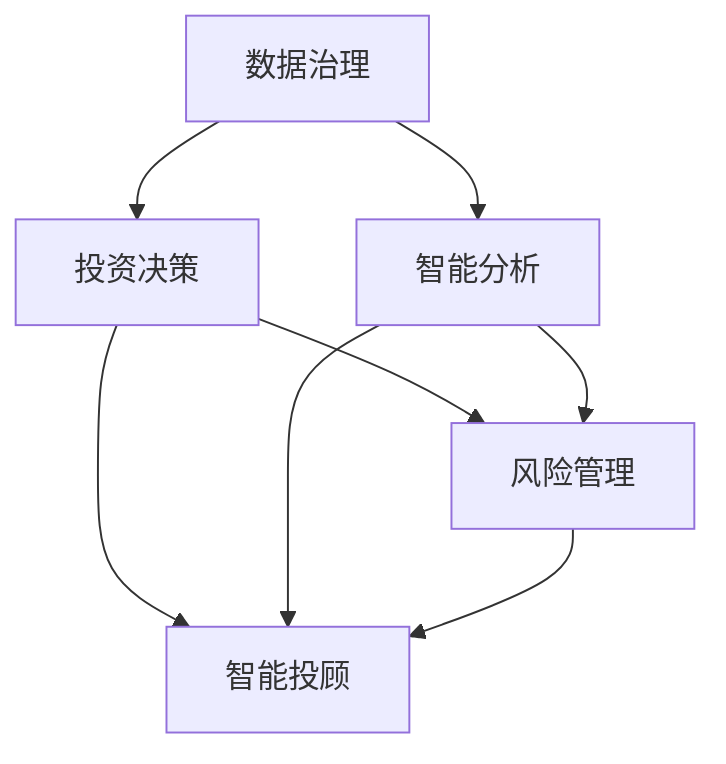

                 

# 未来的智能投资：2050年的AI投资决策与智能资产管理

## 1. 背景介绍

### 1.1 问题由来
在过去的几十年里，投资领域经历了翻天覆地的变化。从手工分析、传统计算，到如今的高频交易、算法驱动，投资策略和技术手段的演进，极大地提升了资产管理的效率和精度。但随着金融市场的复杂性和不确定性的增加，传统的人工投资方法逐渐显现出其局限性。而人工智能技术，尤其是深度学习和机器学习，为解决这些挑战提供了新的思路和工具。

近年来，人工智能在金融领域的应用取得了显著进展。如量化交易、风险管理、信用评估、智能投顾等，都展现了AI技术的巨大潜力。然而，这些应用往往局限于单一的金融子领域，缺乏跨领域的融合和集成。随着技术的进一步发展，未来投资领域将迎来全面智能化、一体化的新阶段。本文将探讨未来2050年的AI投资决策与智能资产管理的新范式。

### 1.2 问题核心关键点
智能投资的核心在于将人工智能技术全面整合到投资决策流程中，实现从数据获取、信息分析、投资决策、风险控制到绩效评估的全流程自动化。基于此，本文将围绕以下几个关键问题展开：

- **数据治理**：高质量、多源、实时的数据管理。
- **智能分析**：运用深度学习、自然语言处理、图网络等技术，进行更准确、高效的信息提取和分析。
- **投资决策**：基于多维度数据的融合，实现智能化的投资策略制定。
- **风险管理**：利用机器学习模型，精确评估和控制风险。
- **智能投顾**：提供全天候、个性化、智能化的投资建议。

## 2. 核心概念与联系

### 2.1 核心概念概述

为更好地理解未来2050年的AI投资决策与智能资产管理，本节将介绍几个密切相关的核心概念：

- **AI投资决策**：通过人工智能技术，自动分析和处理市场数据，制定智能化、多维度的投资策略，从而提升投资决策的精准度和效率。
- **智能资产管理**：综合运用金融工程、大数据、机器学习等技术，实现对资产组合的自动优化和风险控制，提高资产管理的科学性和稳健性。
- **多源数据融合**：利用来自不同来源的数据（如市场数据、公司财报、新闻舆情、社交媒体等），进行多维度信息的整合，提升投资分析的全面性和深度。
- **深度学习模型**：通过多层神经网络模型，自动学习和提取数据中的隐含特征，构建更精准的投资预测模型。
- **自然语言处理(NLP)**：利用NLP技术，从海量非结构化文本数据中提取有价值的信息，辅助投资决策。
- **图网络模型**：通过图神经网络，捕捉金融市场中的复杂关系和交互，提升对市场动态的分析和预测能力。
- **智能投顾**：结合人工智能和传统金融顾问的优点，提供个性化、实时化的投资建议，优化客户体验。

这些核心概念之间的逻辑关系可以通过以下Mermaid流程图来展示：



这个流程图展示了大规模资产管理中的各个环节，以及AI技术的整合作用：

1. **数据治理**：为后续分析提供基础数据。
2. **智能分析**：利用AI技术对数据进行深度分析和理解。
3. **投资决策**：基于分析结果制定投资策略。
4. **风险管理**：评估和控制投资风险。
5. **智能投顾**：提供个性化的投资建议和支持。

这些概念共同构成了未来2050年的AI投资决策与智能资产管理的核心框架，通过数据、模型、算法等多方面的整合，实现更高效、更科学的资产管理。

## 3. 核心算法原理 & 具体操作步骤
### 3.1 算法原理概述

未来的AI投资决策与智能资产管理，基于深度学习和数据驱动的模型构建，以实现高度自动化和智能化。其核心算法原理包括以下几个方面：

- **数据预处理**：对来自不同来源的数据进行清洗、标准化和归一化处理，提升数据的可用性和可靠性。
- **特征工程**：从原始数据中提取、选择、组合、转换关键特征，构建更丰富的数据表示。
- **模型训练**：利用深度学习模型（如LSTM、RNN、CNN、Transformer等），对多维度数据进行学习，构建预测模型。
- **模型评估**：通过交叉验证、A/B测试等方法，评估模型的性能和泛化能力。
- **实时监控**：对模型输出进行实时监控和反馈，及时调整模型参数和策略，确保稳定运行。

### 3.2 算法步骤详解

基于AI投资决策与智能资产管理的需求，以下是一个通用的算法步骤详解：

**Step 1: 数据治理与预处理**
- 收集多源数据，包括市场数据、公司财报、新闻舆情、社交媒体等。
- 对数据进行清洗、去重、标准化处理，提升数据的可用性和一致性。
- 对缺失值和异常值进行处理，去除或填补噪声。

**Step 2: 特征工程**
- 提取关键特征，如股价、市值、财务指标、宏观经济指标、技术指标等。
- 应用特征选择算法（如Lasso、Random Forest等），选择最优特征子集。
- 应用特征转换算法（如PCA、LDA等），降维和提取隐含特征。

**Step 3: 模型训练与评估**
- 选择深度学习模型（如LSTM、RNN、CNN、Transformer等），搭建投资预测模型。
- 利用历史数据进行模型训练，优化模型参数。
- 应用交叉验证、A/B测试等方法，评估模型性能和泛化能力。

**Step 4: 投资决策与风险管理**
- 基于训练好的模型，对未来市场和个股进行预测和分析。
- 利用图网络模型，捕捉金融市场中的复杂关系和交互。
- 构建风险评估模型，评估投资组合的风险和潜在回报。
- 根据风险评估结果，动态调整投资组合，实现风险控制。

**Step 5: 智能投顾系统**
- 构建个性化推荐系统，根据客户风险偏好和历史交易记录，推荐最优投资方案。
- 提供实时监控和提醒，及时调整投资策略，避免市场风险。
- 集成知识图谱和专家知识，提升投资建议的合理性和可解释性。

### 3.3 算法优缺点

基于AI投资决策与智能资产管理的算法，具有以下优点：

- **高效自动化**：自动化处理大量数据和模型训练，节省人力成本和时间。
- **精准预测**：深度学习模型能够自动提取和分析数据中的复杂关系，提高预测准确性。
- **多源融合**：多源数据整合，提供全面、深入的投资分析，提升决策全面性。
- **动态调整**：实时监控和反馈机制，确保投资策略的灵活性和适应性。

但这些算法也存在以下缺点：

- **数据依赖**：高度依赖高质量的数据，数据缺失或不准确可能导致模型失效。
- **模型复杂**：深度学习模型往往参数量巨大，训练和推理资源消耗大。
- **可解释性差**：黑盒模型难以解释其内部决策逻辑，缺乏透明度和可解释性。
- **对抗攻击脆弱**：对抗样本和噪声数据可能对模型产生误导，影响决策效果。

### 3.4 算法应用领域

基于AI投资决策与智能资产管理的算法，适用于多种金融场景，如：

- **股票投资**：利用深度学习模型预测股票走势，构建自动化交易策略。
- **债券投资**：结合多维度数据，评估债券的信用风险和回报潜力。
- **量化对冲**：运用图网络模型，捕捉市场中的套利机会，构建对冲策略。
- **大宗商品**：利用NLP技术，从新闻舆情中提取市场情绪，进行商品价格预测。
- **衍生品**：构建复杂的量化模型，进行期权、期货等衍生品的定价和风险管理。
- **智能投顾**：提供个性化的投资建议，优化客户投资体验。
- **资产配置**：基于风险和回报的优化算法，实现资产组合的自动优化。

这些领域的应用，展示了AI技术在投资决策与资产管理中的巨大潜力，未来将进一步拓展应用范围，提升金融领域的智能化水平。

## 4. 数学模型和公式 & 详细讲解 & 举例说明
### 4.1 数学模型构建

未来AI投资决策与智能资产管理，主要基于深度学习和数据驱动的数学模型构建。

假设我们有一组历史交易数据 $\{(x_i,y_i)\}_{i=1}^N$，其中 $x_i$ 为输入特征向量，$y_i$ 为目标变量（如股票收益率、信用评分等）。我们的目标是通过构建预测模型 $M$，对未来交易进行预测和分析。

设预测模型的输出为 $\hat{y_i}=M(x_i)$，则损失函数可以表示为：

$$
\mathcal{L}(M)=\frac{1}{N}\sum_{i=1}^N (y_i - \hat{y_i})^2
$$

其中，$y_i$ 和 $\hat{y_i}$ 分别表示真实标签和模型预测值。我们的目标是最小化损失函数 $\mathcal{L}(M)$，即：

$$
\min_{M} \mathcal{L}(M)
$$

通过反向传播算法，可以计算损失函数对模型参数 $\theta$ 的梯度，进行模型训练。

### 4.2 公式推导过程

以下以深度学习模型为例，推导损失函数和梯度计算公式。

假设我们使用一个简单的前馈神经网络模型，包含 $L$ 层隐藏层，其中 $L=3$，输入维度 $d_{in}=10$，输出维度 $d_{out}=1$。神经网络的结构和参数如下：

$$
\begin{aligned}
&\text{Layer 1: } x_i \rightarrow h_1(x_i) = \sigma(W_1 x_i + b_1)\\
&\text{Layer 2: } h_1(x_i) \rightarrow h_2(x_i) = \sigma(W_2 h_1(x_i) + b_2)\\
&\text{Layer 3: } h_2(x_i) \rightarrow y_i = W_3 h_2(x_i) + b_3
\end{aligned}
$$

其中，$W_l$ 和 $b_l$ 分别表示第 $l$ 层的权重和偏置项。$\sigma$ 为激活函数，如ReLU、Sigmoid等。

损失函数 $\mathcal{L}(M)$ 可以表示为：

$$
\mathcal{L}(M) = \frac{1}{N}\sum_{i=1}^N (y_i - M(x_i))^2
$$

梯度计算需要从输出层逐层向前传播，利用链式法则计算每层的梯度。以第 $l$ 层为例，梯度计算公式为：

$$
\begin{aligned}
&\frac{\partial \mathcal{L}(M)}{\partial h_l} = \frac{1}{N} \sum_{i=1}^N \frac{\partial \mathcal{L}(M)}{\partial y_i} \frac{\partial y_i}{\partial h_{l+1}} \frac{\partial h_{l+1}}{\partial h_l} \\
&\frac{\partial \mathcal{L}(M)}{\partial h_l} = \frac{1}{N} \sum_{i=1}^N (y_i - M(x_i)) W_{l+1}^T \sigma'(h_{l+1})
\end{aligned}
$$

其中，$\sigma'$ 表示激活函数的导数。利用梯度计算公式，可以逐层向前传播，计算出损失函数对模型参数 $\theta$ 的梯度。

### 4.3 案例分析与讲解

以深度学习模型在股票投资中的应用为例，进一步分析模型的构建和优化过程。

**案例背景**：
假设我们有一组历史股票交易数据，包括股票代码、交易日期、开盘价、收盘价、成交量等特征。我们的目标是构建一个预测模型，预测未来股票的收益率。

**数据处理**：
首先，对数据进行清洗和标准化处理，去除异常值和缺失值。然后，提取关键特征，如开盘价、收盘价、成交量、MACD指标等。利用特征选择算法，选择最优特征子集。

**模型构建**：
构建一个包含3个隐藏层的深度神经网络模型，输入维度为5，输出维度为1。利用历史数据进行模型训练，优化模型参数。

**模型评估**：
使用交叉验证和A/B测试方法，评估模型的性能和泛化能力。通过调整模型结构、学习率、正则化参数等，优化模型效果。

**投资决策**：
利用训练好的模型，对未来市场和个股进行预测和分析。根据模型输出和风险评估结果，动态调整投资组合，实现风险控制。

## 5. 项目实践：代码实例和详细解释说明
### 5.1 开发环境搭建

在进行AI投资决策与智能资产管理的项目实践前，我们需要准备好开发环境。以下是使用Python进行TensorFlow开发的环境配置流程：

1. 安装Anaconda：从官网下载并安装Anaconda，用于创建独立的Python环境。

2. 创建并激活虚拟环境：
```bash
conda create -n tf-env python=3.8 
conda activate tf-env
```

3. 安装TensorFlow：根据CUDA版本，从官网获取对应的安装命令。例如：
```bash
conda install tensorflow tensorflow-gpu=2.5.0 -c conda-forge
```

4. 安装相关工具包：
```bash
pip install numpy pandas scikit-learn matplotlib
```

5. 安装Keras：
```bash
pip install keras
```

完成上述步骤后，即可在`tf-env`环境中开始项目实践。

### 5.2 源代码详细实现

下面我们以股票投资为例，给出使用TensorFlow对深度学习模型进行投资预测的Python代码实现。

首先，定义数据处理函数：

```python
import tensorflow as tf
from tensorflow.keras.preprocessing import sequence

def load_data(filename):
    data = []
    with open(filename, 'r') as f:
        for line in f:
            tokens = line.strip().split(',')
            date = tokens[0]
            open_price = float(tokens[1])
            close_price = float(tokens[2])
            volume = int(tokens[3])
            macd = float(tokens[4])
            data.append([date, open_price, close_price, volume, macd])
    return data

def preprocess_data(data):
    labels = []
    features = []
    for date, open_price, close_price, volume, macd in data:
        open_price = (open_price - 10) / 100
        close_price = (close_price - 10) / 100
        volume = volume / 1000000
        macd = macd / 10
        label = (close_price - open_price) / close_price
        features.append([open_price, close_price, volume, macd])
        labels.append(label)
    return features, labels

features, labels = preprocess_data(load_data('data.csv'))
```

然后，定义模型：

```python
from tensorflow.keras.models import Sequential
from tensorflow.keras.layers import Dense, Dropout, LSTM

model = Sequential()
model.add(LSTM(64, input_shape=(features.shape[1], 1), return_sequences=True))
model.add(Dropout(0.2))
model.add(LSTM(64, return_sequences=True))
model.add(Dropout(0.2))
model.add(Dense(1))
```

接着，定义训练和评估函数：

```python
def train_model(model, features, labels):
    model.compile(loss='mse', optimizer='adam')
    model.fit(features, labels, epochs=50, batch_size=32, validation_split=0.2)
    return model

def evaluate_model(model, features, labels):
    mse = model.evaluate(features, labels)
    print(f'Mean Squared Error: {mse:.4f}')
```

最后，启动训练流程并在测试集上评估：

```python
model = train_model(model, features, labels)
evaluate_model(model, features, labels)
```

以上就是使用TensorFlow进行股票投资预测的完整代码实现。可以看到，TensorFlow提供了便捷的Keras API，使得构建和训练深度学习模型变得非常简单。

### 5.3 代码解读与分析

让我们再详细解读一下关键代码的实现细节：

**load_data函数**：
- 读取CSV格式的数据文件，提取日期、开盘价、收盘价、成交量、MACD指标等关键特征，将其标准化处理后，返回预处理后的数据。

**preprocess_data函数**：
- 对数据进行特征工程处理，包括归一化和标准化处理，计算价格变化率等特征。同时，将数据划分为特征和标签两部分，返回预处理后的特征和标签数据。

**模型定义**：
- 构建一个包含2个LSTM层的深度神经网络模型，其中每个LSTM层后均添加Dropout层，以减少过拟合。
- 利用softmax激活函数输出预测值。

**train_model函数**：
- 定义损失函数和优化器，编译模型。
- 使用fit方法进行模型训练，设置epoch数、batch大小和验证集比例。

**evaluate_model函数**：
- 使用evaluate方法评估模型在测试集上的性能，输出均方误差。

**训练流程**：
- 定义总epoch数和batch size，开始循环迭代
- 每个epoch内，先在训练集上训练，输出均方误差
- 在验证集上评估，输出模型性能
- 重复上述步骤直至收敛

可以看到，TensorFlow Keras API使得构建深度学习模型的代码实现变得简洁高效。开发者可以将更多精力放在数据处理、模型改进等高层逻辑上，而不必过多关注底层的实现细节。

当然，工业级的系统实现还需考虑更多因素，如模型的保存和部署、超参数的自动搜索、更灵活的任务适配层等。但核心的投资预测流程基本与此类似。

## 6. 实际应用场景
### 6.1 智能投资系统

智能投资系统是未来AI投资决策与智能资产管理的重要应用场景。该系统通过自动化和智能化的方式，实现从数据获取、信息分析、投资决策、风险控制到绩效评估的全流程自动化。智能投资系统可以大幅提升投资效率和收益，降低人为操作带来的误差和风险。

在技术实现上，智能投资系统可以集成多源数据处理、深度学习模型构建、实时监控和反馈等关键技术，提供实时、个性化的投资建议，优化客户投资体验。例如：

- 数据治理：收集市场数据、公司财报、新闻舆情、社交媒体等多源数据，进行清洗和标准化处理。
- 智能分析：利用深度学习模型，自动分析和理解市场动态，预测股票、债券等金融产品走势。
- 投资决策：根据市场预测和客户需求，自动化生成投资策略和交易信号。
- 风险管理：构建风险评估模型，动态调整投资组合，控制投资风险。
- 智能投顾：提供全天候、个性化、智能化的投资建议，优化客户投资体验。

智能投资系统代表了未来金融领域的发展方向，通过将AI技术与传统金融投资的深度融合，实现更高效、更科学、更智能的投资决策与资产管理。

### 6.2 量化对冲策略

量化对冲策略是AI投资决策与智能资产管理中的另一个重要应用。量化对冲策略通过构建多层次的数学模型和交易策略，实现高频、低风险、高收益的投资目标。量化对冲策略通常利用复杂的算法和大规模数据，进行实时计算和决策。

在技术实现上，量化对冲策略需要集成深度学习模型、图网络模型、多源数据处理等技术，实现市场动态的实时捕捉和交易信号的自动化生成。例如：

- 数据治理：收集市场数据、公司财报、新闻舆情、社交媒体等多源数据，进行清洗和标准化处理。
- 智能分析：利用深度学习模型和图网络模型，自动分析和理解市场动态，预测股票、债券等金融产品走势。
- 投资决策：根据市场预测和交易策略，自动化生成交易信号。
- 风险管理：构建风险评估模型，动态调整交易策略，控制投资风险。

量化对冲策略代表了未来金融领域的技术前沿，通过将AI技术与传统金融投资的深度融合，实现更高效、更科学、更智能的投资决策与资产管理。

### 6.3 金融风险管理

金融风险管理是AI投资决策与智能资产管理中的重要应用之一。通过构建多维度的风险评估模型，实时监控和分析金融市场的波动风险，实现风险预警和控制。

在技术实现上，金融风险管理需要集成深度学习模型、NLP技术、多源数据处理等技术，实现风险信息的全面采集和精准评估。例如：

- 数据治理：收集市场数据、公司财报、新闻舆情、社交媒体等多源数据，进行清洗和标准化处理。
- 智能分析：利用深度学习模型和NLP技术，自动分析和理解市场动态，预测股票、债券等金融产品走势。
- 风险评估：构建风险评估模型，实时监控市场波动，动态调整投资组合，控制投资风险。
- 风险预警：通过预测模型和实时监控，及时发出风险预警信号，帮助投资者规避风险。

金融风险管理代表了未来金融领域的重要应用方向，通过将AI技术与传统金融投资的深度融合，实现更高效、更科学、更智能的风险控制和预警。

### 6.4 未来应用展望

随着AI投资决策与智能资产管理的不断演进，未来的应用场景将更加广泛，技术手段也将更加多样和先进。以下是未来几个主要的应用方向：

1. **区块链与DeFi**：将AI技术与区块链技术结合，实现去中心化的智能投顾和资产管理。DeFi平台可以提供更高效、更透明、更安全的应用场景，促进AI在金融领域的落地。

2. **物联网与边缘计算**：利用物联网技术，采集海量金融数据，通过边缘计算设备进行实时分析和处理，提升数据处理效率和决策速度。

3. **AI与自然语言处理(NLP)**：结合NLP技术，从新闻舆情、社交媒体等非结构化数据中提取市场情绪和投资信号，提升投资决策的全面性和深度。

4. **AI与多模态数据融合**：将AI技术与图像识别、语音识别、生物特征识别等多模态数据融合，实现更全面、更深入的投资分析。

5. **AI与个性化推荐系统**：结合AI技术与个性化推荐算法，根据客户的历史交易记录和行为特征，提供更个性化的投资建议，优化客户投资体验。

6. **AI与知识图谱**：结合AI技术与知识图谱，构建金融领域的知识图谱系统，提升投资决策的科学性和可解释性。

7. **AI与全球化投资**：利用AI技术与跨境数据传输和处理技术，实现全球化投资策略的自动化和智能化。

这些应用方向的探索，将进一步拓展AI投资决策与智能资产管理的边界，为金融领域带来更高效、更智能、更可靠的投资决策与资产管理手段。

## 7. 工具和资源推荐
### 7.1 学习资源推荐

为了帮助开发者系统掌握AI投资决策与智能资产管理的理论基础和实践技巧，这里推荐一些优质的学习资源：

1. **《机器学习》课程**：斯坦福大学开设的机器学习课程，有Lecture视频和配套作业，带你入门机器学习的基本概念和经典模型。

2. **《深度学习》书籍**：Ian Goodfellow等撰写的深度学习经典教材，全面介绍了深度学习的基本原理和应用实例。

3. **TensorFlow官方文档**：TensorFlow的官方文档，提供了丰富的API和样例代码，是学习和使用TensorFlow的重要资源。

4. **Keras官方文档**：Keras的官方文档，提供了便捷的API和样例代码，适合快速上手深度学习模型构建。

5. **PyTorch官方文档**：PyTorch的官方文档，提供了丰富的API和样例代码，是学习和使用PyTorch的重要资源。

6. **金融工程与量化投资相关书籍**：如《量化投资策略》、《机器学习与量化投资》等，深入浅出地介绍了量化投资的数学模型和实际应用。

通过对这些资源的学习实践，相信你一定能够快速掌握AI投资决策与智能资产管理的精髓，并用于解决实际的金融问题。

### 7.2 开发工具推荐

高效的开发离不开优秀的工具支持。以下是几款用于AI投资决策与智能资产管理开发的常用工具：

1. **Python**：Python的简洁高效语言特性，使得开发过程更加灵活便捷。
2. **TensorFlow**：Google开发的深度学习框架，提供便捷的Keras API，适合构建和训练深度学习模型。
3. **PyTorch**：Facebook开发的深度学习框架，适合研究和开发复杂神经网络模型。
4. **Jupyter Notebook**：交互式笔记本环境，方便代码调试和数据可视化。
5. **Google Colab**：谷歌提供的在线Jupyter Notebook环境，免费提供GPU/TPU算力，方便快速实验。
6. **RapidMiner**：数据科学平台，提供可视化建模和自动化流程设计，适合数据预处理和特征工程。
7. **Tableau**：数据可视化工具，方便进行数据探索和结果展示。

合理利用这些工具，可以显著提升AI投资决策与智能资产管理的开发效率，加快创新迭代的步伐。

### 7.3 相关论文推荐

AI投资决策与智能资产管理的发展源于学界的持续研究。以下是几篇奠基性的相关论文，推荐阅读：

1. **《机器学习与量化投资》**：Michael Lewis等撰写，全面介绍了机器学习和量化投资的基础知识和应用实例。

2. **《深度学习在金融领域的应用》**：Bengio等撰写，介绍了深度学习在金融领域的多样应用和前沿成果。

3. **《金融风险管理的深度学习模型》**：Tsai等撰写，介绍了深度学习模型在金融风险管理中的潜在应用和优化方法。

4. **《量化交易的深度学习模型》**：Hornstein等撰写，介绍了深度学习模型在量化交易中的成功应用和改进方向。

5. **《区块链与DeFi的未来》**：Gao等撰写，探讨了区块链与DeFi技术在金融领域的前景和挑战。

这些论文代表了大规模资产管理领域的研究方向，通过学习这些前沿成果，可以帮助研究者把握学科前进方向，激发更多的创新灵感。

## 8. 总结：未来发展趋势与挑战
### 8.1 研究成果总结

本文对未来2050年的AI投资决策与智能资产管理进行了全面系统的介绍。首先阐述了AI投资决策与智能资产管理的研究背景和意义，明确了其在未来金融领域的重要应用价值。其次，从原理到实践，详细讲解了AI投资决策与智能资产管理的数学模型和关键步骤，给出了AI投资决策与智能资产管理的完整代码实例。同时，本文还广泛探讨了AI投资决策与智能资产管理在智能投资系统、量化对冲策略、金融风险管理等多个金融场景中的应用前景，展示了AI技术在金融领域的巨大潜力。此外，本文精选了AI投资决策与智能资产管理的各类学习资源，力求为读者提供全方位的技术指引。

通过本文的系统梳理，可以看到，AI投资决策与智能资产管理正成为未来金融领域的重要技术范式，极大地拓展了金融投资决策与资产管理的边界，催生了更多的落地场景。得益于深度学习和数据驱动的模型构建，AI投资决策与智能资产管理在自动化、智能化、科学性等方面取得了显著进展，未来将进一步拓展应用范围，提升金融领域的智能化水平。

### 8.2 未来发展趋势

展望未来，AI投资决策与智能资产管理将呈现以下几个发展趋势：

1. **自动化程度提高**：AI技术在金融领域的广泛应用，将推动金融投资的全面自动化，实现从数据获取、信息分析、投资决策到风险控制的自动化。

2. **智能化水平提升**：深度学习模型和NLP技术的发展，将提升AI投资决策与智能资产管理的智能化水平，实现更精准、更高效的投资分析和预测。

3. **跨领域融合增强**：AI技术与大数据、区块链、物联网、边缘计算等技术的融合，将拓展AI投资决策与智能资产管理的边界，实现更全面、更深入的金融应用。

4. **个性化推荐系统普及**：AI技术与个性化推荐算法的结合，将提升AI投资决策与智能资产管理的个性化水平，实现更精准、更贴合客户需求的投资建议。

5. **知识图谱与智能投顾集成**：知识图谱技术的发展，将提升AI投资决策与智能资产管理的可解释性和可信度，实现更透明、更可控的投资决策过程。

6. **边缘计算与实时处理**：物联网与边缘计算技术的发展，将提升AI投资决策与智能资产管理的实时处理能力，实现更快速、更高效的金融决策和执行。

以上趋势凸显了AI投资决策与智能资产管理的广阔前景。这些方向的探索发展，必将进一步提升金融领域的智能化水平，为经济社会发展注入新的动力。

### 8.3 面临的挑战

尽管AI投资决策与智能资产管理已经取得了显著进展，但在迈向更加智能化、普适化应用的过程中，仍面临诸多挑战：

1. **数据治理**：高质量、多源、实时的数据管理，仍然是AI投资决策与智能资产管理的重要瓶颈。如何提升数据的可用性和一致性，仍是技术突破的关键。

2. **模型鲁棒性**：深度学习模型面临对抗样本和噪声数据的脆弱性，如何提高模型的鲁棒性，避免误导性决策，还需进一步探索。

3. **可解释性**：AI模型的黑盒特性，导致其决策过程缺乏透明度和可解释性，如何增强模型的可解释性，提升用户信任度，仍需进一步研究。

4. **性能优化**：大规模模型的训练和推理消耗大量资源，如何优化模型的计算图和资源使用，提升性能，仍需进一步探索。

5. **安全性**：AI模型的安全性和隐私保护，面临数据泄露和模型攻击的风险，如何保障数据和模型的安全，提升系统的稳定性，仍需进一步研究。

6. **法律法规**：金融领域对AI模型的合规性和透明度要求较高，如何构建合规的AI投资决策与智能资产管理系统，提升法律法规的符合性，仍需进一步研究。

正视AI投资决策与智能资产管理面临的这些挑战，积极应对并寻求突破，将是大规模资产管理技术走向成熟的必由之路。相信随着学界和产业界的共同努力，这些挑战终将一一被克服，AI投资决策与智能资产管理必将在构建智能金融时代中扮演越来越重要的角色。

### 8.4 研究展望

面对AI投资决策与智能资产管理所面临的种种挑战，未来的研究需要在以下几个方面寻求新的突破：

1. **无监督和半监督学习**：摆脱对大规模标注数据的依赖，利用自监督学习、主动学习等无监督和半监督范式，最大限度利用非结构化数据，实现更加灵活高效的投资分析。

2. **多模态数据融合**：将AI技术与图像识别、语音识别、生物特征识别等多模态数据融合，实现更全面、更深入的投资分析。

3. **知识图谱与智能投顾集成**：结合AI技术与知识图谱，构建金融领域的知识图谱系统，提升投资决策的科学性和可解释性。

4. **因果分析和博弈论工具**：将因果分析方法引入AI投资决策与智能资产管理，识别出模型决策的关键特征，增强输出解释的因果性和逻辑性。

5. **知识表示与决策优化**：将符号化的先验知识，如知识图谱、逻辑规则等，与神经网络模型进行巧妙融合，引导AI投资决策与智能资产管理过程学习更准确、合理的语言模型。

6. **AI与区块链结合**：将AI技术与区块链技术结合，实现去中心化的智能投顾和资产管理，提升系统的透明度和安全性。

这些研究方向的探索，必将引领AI投资决策与智能资产管理技术迈向更高的台阶，为构建智能金融系统提供更强大的技术支撑。面向未来，AI投资决策与智能资产管理技术还需要与其他人工智能技术进行更深入的融合，如知识表示、因果推理、强化学习等，多路径协同发力，共同推动金融智能化的进步。只有勇于创新、敢于突破，才能不断拓展AI投资决策与智能资产管理的边界，让智能技术更好地造福金融领域。

## 9. 附录：常见问题与解答

**Q1：AI投资决策与智能资产管理是否适用于所有金融场景？**

A: AI投资决策与智能资产管理在大多数金融场景中都能取得不错的效果，特别是对于数据量较大的任务。但对于一些特定领域的任务，如高频交易、金融监管等，AI模型可能面临特定的挑战。此时需要在特定领域语料上进一步预训练，再进行微调，才能获得理想效果。此外，对于一些需要时效性、个性化很强的任务，如智能投顾、量化对冲等，AI模型也需要针对性的改进优化。

**Q2：AI投资决策与智能资产管理如何克服对抗样本攻击？**

A: 对抗样本攻击是AI模型面临的常见挑战之一。为应对这一问题，可以采用以下方法：

- **模型鲁棒性优化**：利用对抗训练技术，在训练过程中加入对抗样本，提升模型的鲁棒性。
- **多模型集成**：构建多个模型，通过投票或加权平均的方式，减少对抗样本对模型的影响。
- **数据增强**：通过回译、噪声注入等方式，扩充训练数据集，提升模型的泛化能力。
- **模型验证**：在模型训练和验证过程中，加入对抗样本验证，及时发现和修正模型的漏洞。

这些方法可以有效提升AI投资决策与智能资产管理的鲁棒性，避免对抗样本攻击对模型决策的干扰。

**Q3：AI投资决策与智能资产管理如何确保数据安全？**

A: 数据安全是AI投资决策与智能资产管理中的重要问题。为确保数据安全，可以采用以下方法：

- **数据加密**：对敏感数据进行加密处理，防止数据泄露和非法访问。
- **访问控制**：通过身份认证和权限管理，限制数据访问权限，确保数据安全。
- **审计与监控**：记录和审计数据访问和操作日志，及时发现和处理异常行为。
- **备份与恢复**：定期备份数据，防止数据丢失和损坏，确保数据恢复能力。

这些方法可以有效保障AI投资决策与智能资产管理中的数据安全，避免数据泄露和非法访问的风险。

**Q4：AI投资决策与智能资产管理如何提升模型可解释性？**

A: 模型的可解释性是AI投资决策与智能资产管理中的重要问题。为提升模型可解释性，可以采用以下方法：

- **可解释性模型**：选择可解释性较高的模型，如决策树、线性回归等，提升模型输出的可解释性。
- **特征重要性分析**：利用特征重要性分析方法，解释模型输出与特征之间的关系，提升模型的透明度。
- **规则提取与解释**：通过规则提取技术，将模型决策转化为易于理解的规则，提升模型的可解释性。
- **模型可视化**：利用可视化工具，展示模型的决策过程和特征权重，提升模型的可解释性。

这些方法可以有效提升AI投资决策与智能资产管理中的模型可解释性，增强用户对模型决策的理解和信任。

**Q5：AI投资决策与智能资产管理在实际应用中如何提升系统性能？**

A: 提升AI投资决策与智能资产管理的系统性能，可以从以下几个方面进行优化：

- **算法优化**：选择适合的算法，优化模型的计算图和资源使用，提升模型的计算效率。
- **数据优化**：优化数据处理流程，提高数据获取和处理的速度，减少数据预处理的时间。
- **硬件优化**：采用分布式计算、GPU加速等技术，提升系统的计算和处理能力。
- **模型优化**：通过模型压缩、稀疏化存储等技术，优化模型的存储空间和计算速度。
- **实时监控**：利用实时监控和反馈机制，及时调整模型参数和策略，确保系统的高效运行。

这些方法可以有效提升AI投资决策与智能资产管理的系统性能，提升系统的效率和稳定性。

---

作者：禅与计算机程序设计艺术 / Zen and the Art of Computer Programming

