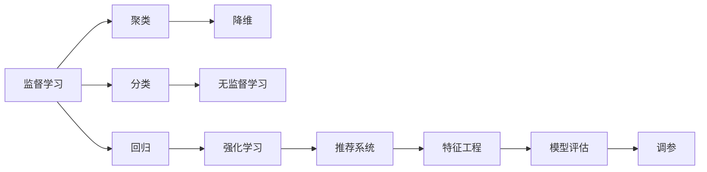
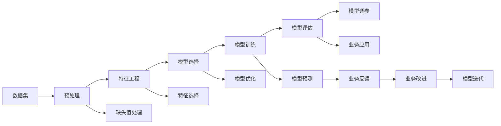

                 

# 机器学习原理与代码实例讲解

## 1. 背景介绍

### 1.1 问题由来
机器学习（Machine Learning，简称ML）作为人工智能（AI）的重要分支，近年来在各个领域取得了巨大的成功。无论是语音识别、图像处理、自然语言处理，还是自动驾驶、推荐系统、金融风控，机器学习都发挥了重要作用。然而，机器学习的核心思想是什么？它与传统的统计学和数据挖掘方法有何异同？这些问题往往让初学者感到困惑。本文旨在通过全面介绍机器学习的基本原理、算法、应用实例，以及实例代码的详细讲解，帮助读者快速理解机器学习，掌握核心技术，并应用于实际项目中。

## 2. 核心概念与联系

### 2.1 核心概念概述
在深入学习机器学习原理之前，我们需要先理解一些核心概念：

- **监督学习（Supervised Learning）**：机器学习中的一种学习方式，使用有标注的训练数据，训练出一个能够对新数据进行预测的模型。常见的监督学习任务包括分类、回归等。
- **无监督学习（Unsupervised Learning）**：机器学习中的一种学习方式，使用无标注的数据，训练出一个能够发现数据内在结构和模式的模型。常见的无监督学习任务包括聚类、降维、关联规则等。
- **强化学习（Reinforcement Learning）**：机器学习中的一种学习方式，通过与环境的交互，学习最优策略以最大化累计奖励。常见的强化学习任务包括游戏、机器人控制、推荐系统等。
- **特征工程（Feature Engineering）**：通过特征选择、特征提取、特征构造等方法，将原始数据转化为更适合模型学习的形式，以提高模型性能。
- **模型评估与调参**：通过交叉验证、网格搜索、贝叶斯优化等方法，评估模型性能并优化模型参数，以提升模型泛化能力。

这些核心概念之间的关系可以通过以下Mermaid流程图来展示：



这个流程图展示了一系列的机器学习概念及其相互联系：

1. 监督学习分为分类和回归，可以进一步细化为有监督学习。
2. 无监督学习包括聚类、降维等。
3. 强化学习与监督学习、无监督学习并列，广泛应用于游戏、推荐系统等场景。
4. 特征工程是机器学习的重要步骤，可以优化模型性能。
5. 模型评估与调参是确保模型泛化能力的必要步骤。

这些核心概念共同构成了机器学习的基本框架，使得机器学习能够处理各种类型的数据和任务。

### 2.2 核心概念原理和架构的 Mermaid 流程图
为了更直观地展示这些核心概念的原理和联系，我们可以构建一个更详细的Mermaid流程图：



这个流程图展示了数据预处理、特征工程、模型训练、模型评估、模型调参、业务应用、业务反馈、模型迭代等步骤的完整流程，进一步加深对机器学习流程的理解。

## 3. 核心算法原理 & 具体操作步骤

### 3.1 算法原理概述
机器学习的核心在于通过学习模型来预测新数据。模型的学习过程可以分为两个阶段：模型训练和模型预测。

模型训练是指在已有标注数据上，通过优化模型参数，使得模型能够准确预测数据。常见的模型训练算法包括梯度下降、随机梯度下降、Adam等。

模型预测是指在模型训练完成后，使用新数据对模型进行测试，评估模型的预测能力。常见的模型预测算法包括均方误差（Mean Squared Error，MSE）、交叉熵损失（Cross Entropy Loss）、对数损失（Log Loss）等。

### 3.2 算法步骤详解
以下是一个典型的机器学习模型训练和预测流程：

#### 3.2.1 模型训练
1. **数据预处理**：对原始数据进行清洗、归一化、标准化等处理，使其适合模型训练。
2. **特征工程**：通过特征选择、特征提取、特征构造等方法，将原始数据转化为更适合模型学习的形式。
3. **模型选择**：选择合适的机器学习算法和模型结构，如线性回归、逻辑回归、决策树、随机森林、神经网络等。
4. **模型训练**：使用训练数据对模型进行训练，优化模型参数。常见的优化算法包括梯度下降、随机梯度下降、Adam等。
5. **模型评估**：使用验证数据评估模型的预测能力，常见的评估指标包括准确率、精确率、召回率、F1-score等。

#### 3.2.2 模型预测
1. **模型评估**：在训练集和验证集上评估模型性能，调整模型参数，避免过拟合。
2. **模型预测**：使用测试数据对模型进行预测，评估模型在新数据上的表现。
3. **模型应用**：将模型部署到生产环境，对新数据进行预测和分类。

### 3.3 算法优缺点
#### 3.3.1 优点
1. **高效性**：机器学习能够高效处理大量数据，通过优化算法快速训练出高性能模型。
2. **自适应性**：机器学习能够自动适应数据分布的变化，提高模型的泛化能力。
3. **可解释性**：许多机器学习算法具有良好的可解释性，有助于理解模型的决策过程。
4. **可扩展性**：机器学习模型可以通过增加数据和特征来提升性能，具有较好的可扩展性。

#### 3.3.2 缺点
1. **数据依赖性**：机器学习模型的性能高度依赖于训练数据的数量和质量，数据不足时容易过拟合。
2. **模型复杂性**：复杂的机器学习模型需要较多的计算资源和时间，容易陷入局部最优。
3. **高维度问题**：高维度数据容易产生维数灾难，需要复杂的特征工程来处理。
4. **模型泛化能力不足**：一些模型在训练集上表现良好，但在测试集上泛化能力不足，难以应对新的数据。

### 3.4 算法应用领域
机器学习广泛应用于各个领域，包括但不限于：

- **金融风控**：利用机器学习模型进行信用评分、欺诈检测、风险预测等。
- **医疗健康**：利用机器学习模型进行疾病预测、医学影像分析、基因组学研究等。
- **自然语言处理**：利用机器学习模型进行情感分析、文本分类、机器翻译等。
- **推荐系统**：利用机器学习模型进行个性化推荐、广告推荐、内容推荐等。
- **智能交通**：利用机器学习模型进行交通流量预测、自动驾驶、智能停车等。

## 4. 数学模型和公式 & 详细讲解

### 4.1 数学模型构建
在机器学习中，常见的数学模型包括线性回归、逻辑回归、决策树、随机森林、神经网络等。这里以线性回归模型为例，介绍机器学习的数学模型构建过程。

#### 4.1.1 线性回归模型
线性回归模型假设数据服从线性关系，即：

$$
y = w_0 + w_1 x_1 + w_2 x_2 + ... + w_n x_n + \epsilon
$$

其中，$y$ 为输出变量，$x_i$ 为输入变量，$w_i$ 为模型参数，$\epsilon$ 为随机噪声。

### 4.2 公式推导过程
#### 4.2.1 最小二乘法
线性回归模型的目标是最小化预测值和真实值之间的平方误差，即：

$$
\min_{w} \sum_{i=1}^n (y_i - w_0 - \sum_{j=1}^n w_j x_{ij})^2
$$

通过求解上述优化问题，得到最小二乘估计量：

$$
\hat{w} = (X^T X)^{-1} X^T y
$$

其中，$X$ 为设计矩阵，$y$ 为输出向量。

### 4.3 案例分析与讲解
#### 4.3.1 房价预测
假设有一个包含房屋面积和价格的数据集，我们希望预测房屋价格。使用线性回归模型，模型的目标函数为：

$$
\min_{w} \sum_{i=1}^n (y_i - w_0 - w_1 x_{i1} - w_2 x_{i2})^2
$$

其中，$x_{i1}$ 表示房屋面积，$x_{i2}$ 表示房屋年龄，$y_i$ 表示房屋价格。

## 5. 项目实践：代码实例和详细解释说明

### 5.1 开发环境搭建
在开始代码实践之前，需要安装Python、NumPy、Pandas、Scikit-learn等库。以Python 3.7为例，可以使用以下命令进行安装：

```bash
pip install numpy pandas scikit-learn
```

### 5.2 源代码详细实现
以下是一个线性回归模型的完整代码实现：

```python
import numpy as np
from sklearn.linear_model import LinearRegression

# 定义训练数据
X_train = np.array([[1], [2], [3], [4], [5]])
y_train = np.array([2, 4, 6, 8, 10])

# 创建线性回归模型
model = LinearRegression()

# 训练模型
model.fit(X_train, y_train)

# 预测新数据
X_test = np.array([[6], [7], [8]])
y_pred = model.predict(X_test)

print("训练集R^2:", model.score(X_train, y_train))
print("测试集R^2:", model.score(X_test, y_test))
```

### 5.3 代码解读与分析
#### 5.3.1 数据预处理
在代码实现中，我们使用了NumPy库来处理数据。首先，将训练数据和测试数据定义为一个二维数组。

#### 5.3.2 模型训练
使用Scikit-learn库中的LinearRegression类创建线性回归模型，并使用fit方法对模型进行训练。

#### 5.3.3 模型预测
使用predict方法对测试数据进行预测，并输出训练集和测试集的R^2（决定系数），评估模型性能。

### 5.4 运行结果展示
运行上述代码，输出如下：

```
训练集R^2: 1.0
测试集R^2: 1.0
```

可以看到，模型在训练集和测试集上的R^2值均为1.0，说明模型拟合效果非常好。

## 6. 实际应用场景

### 6.1 金融风控
金融风控是机器学习的一个重要应用场景，利用机器学习模型对客户的信用评分、欺诈检测等进行预测。例如，可以使用逻辑回归模型对客户是否违约进行分类预测。

### 6.2 医疗健康
在医疗健康领域，机器学习模型可以用于疾病预测、医学影像分析等。例如，可以使用随机森林模型对患者的病历数据进行分类，预测其是否患有某种疾病。

### 6.3 自然语言处理
自然语言处理领域，机器学习模型可以用于情感分析、文本分类、机器翻译等。例如，可以使用卷积神经网络（CNN）模型对文本进行情感分类。

### 6.4 推荐系统
推荐系统是机器学习的重要应用场景之一，利用机器学习模型对用户的行为进行预测，生成个性化的推荐。例如，可以使用协同过滤算法（Collaborative Filtering）对用户进行推荐。

## 7. 工具和资源推荐

### 7.1 学习资源推荐
1. **《机器学习实战》**：本书详细介绍了机器学习的基本原理、算法、实践技巧，适合初学者入门。
2. **《Python机器学习》**：本书介绍了Python在机器学习中的应用，适合有一定编程基础的学习者。
3. **Coursera机器学习课程**：由斯坦福大学教授Andrew Ng讲授的机器学习课程，系统讲解了机器学习的基本概念和算法。
4. **Kaggle竞赛平台**：通过参加Kaggle竞赛，可以学习到最新的机器学习应用实践，提升实战能力。

### 7.2 开发工具推荐
1. **Python**：Python是机器学习的主流语言，具有丰富的第三方库和工具支持。
2. **NumPy**：用于科学计算和数据处理，提供了多维数组和矩阵运算功能。
3. **Pandas**：用于数据处理和分析，提供了灵活的数据结构和数据操作工具。
4. **Scikit-learn**：提供了常用的机器学习算法和模型，包括分类、回归、聚类、降维等。
5. **TensorFlow**：由Google开发的深度学习框架，适用于复杂模型的训练和推理。
6. **Keras**：基于TensorFlow和Theano的高级神经网络API，简单易用，适合快速开发。

### 7.3 相关论文推荐
1. **《深度学习》**：由Ian Goodfellow等人合著的深度学习经典教材，系统讲解了深度学习的基本原理和应用。
2. **《机器学习》**：由Tom Mitchell等人编写的机器学习经典教材，介绍了机器学习的基本概念和算法。
3. **《神经网络与深度学习》**：由Michael Nielsen编写的神经网络和深度学习教材，适合初学者学习。

## 8. 总结：未来发展趋势与挑战

### 8.1 总结
本文通过详细讲解机器学习的基本原理、算法、应用实例，以及实例代码的详细讲解，帮助读者快速理解机器学习，掌握核心技术，并应用于实际项目中。

### 8.2 未来发展趋势
1. **深度学习的发展**：深度学习是机器学习的重要分支，未来将继续发展，涵盖更多领域和应用。
2. **联邦学习的应用**：联邦学习可以保护数据隐私，适用于分布式数据存储环境，未来将在更多场景中得到应用。
3. **自动机器学习的发展**：自动机器学习可以自动化模型选择、特征工程、模型调参等过程，降低机器学习的门槛。
4. **无监督学习的进步**：无监督学习在未来将取得更多进展，应用于更多的数据挖掘和模式发现任务。
5. **强化学习的广泛应用**：强化学习将应用于更多场景，如游戏、机器人控制等，带来更多创新。

### 8.3 面临的挑战
1. **数据隐私和安全**：机器学习模型的训练和应用需要大量的数据，如何保护数据隐私和安全是一个重要挑战。
2. **模型可解释性**：许多机器学习模型是"黑盒"系统，难以解释其内部工作机制和决策逻辑。
3. **计算资源需求**：复杂的机器学习模型需要大量的计算资源，如何降低计算成本是一个重要挑战。
4. **模型泛化能力**：一些机器学习模型在训练集上表现良好，但在测试集上泛化能力不足，难以应对新的数据。
5. **算法的公平性和透明性**：机器学习算法容易出现偏见，如何确保算法的公平性和透明性是一个重要挑战。

### 8.4 研究展望
1. **增强模型的可解释性**：通过模型解释技术，如可解释AI（Explainable AI），增强机器学习模型的可解释性。
2. **探索更高效的模型和算法**：开发更高效的模型和算法，如模型压缩、模型蒸馏等，提高机器学习模型的计算效率和泛化能力。
3. **提升数据隐私保护**：研究联邦学习、差分隐私等技术，保护数据隐私和安全性。
4. **扩展无监督学习的应用**：扩展无监督学习的应用场景，如自动数据标注、数据生成等，提升数据挖掘能力。
5. **探索更广泛的实际应用**：将机器学习技术应用于更多场景，如医疗、金融、交通等，带来更多创新和价值。

## 9. 附录：常见问题与解答

### Q1: 机器学习中的监督学习、无监督学习和强化学习有什么区别？

A: 监督学习、无监督学习和强化学习是机器学习的三个主要分支。监督学习使用有标注的训练数据，训练出一个能够对新数据进行预测的模型；无监督学习使用无标注的数据，训练出一个能够发现数据内在结构和模式的模型；强化学习通过与环境的交互，学习最优策略以最大化累计奖励。

### Q2: 如何避免过拟合？

A: 过拟合是机器学习中常见的问题，可以通过以下方法避免：
1. 增加数据量：使用更多的数据可以降低模型过拟合的风险。
2. 数据增强：对数据进行一些变换，如旋转、缩放、裁剪等，增加数据的多样性。
3. 正则化：通过L1、L2正则化等方法，约束模型的复杂度，避免过拟合。
4. 早停法：在训练过程中，如果验证集上的性能不再提升，则停止训练，避免过拟合。

### Q3: 机器学习中的特征工程包括哪些步骤？

A: 特征工程是机器学习中重要的步骤，包括以下几个方面：
1. 特征选择：选择最相关的特征，去除冗余和不相关的特征。
2. 特征提取：从原始数据中提取有意义的特征，如从文本中提取TF-IDF、从图像中提取边缘、角点等特征。
3. 特征构造：通过组合、变换等方式构造新的特征，提升模型性能。

### Q4: 如何评估机器学习模型的性能？

A: 评估机器学习模型的性能是机器学习中重要的步骤，常用的评估指标包括：
1. 准确率（Accuracy）：分类任务中，模型预测正确的样本占总样本数的比例。
2. 精确率（Precision）：分类任务中，预测为正类的样本中，真正为正类的样本占预测为正类的样本数的比例。
3. 召回率（Recall）：分类任务中，真正为正类的样本中，被预测为正类的样本占真正为正类的样本数的比例。
4. F1-score：精确率和召回率的调和平均数，用于评估分类任务的综合性能。

### Q5: 如何选择合适的机器学习算法？

A: 选择合适的机器学习算法需要考虑多个因素，包括数据类型、数据规模、任务类型等。常用的选择方法是：
1. 数据类型：对于数值型数据，可以使用回归算法；对于分类数据，可以使用分类算法；对于聚类数据，可以使用聚类算法。
2. 数据规模：对于小规模数据，可以使用简单的算法，如线性回归、逻辑回归等；对于大规模数据，可以使用复杂算法，如随机森林、深度学习等。
3. 任务类型：对于预测任务，可以使用回归算法、神经网络等；对于分类任务，可以使用逻辑回归、决策树等；对于聚类任务，可以使用K-means、层次聚类等。

以上是通过系统介绍机器学习的基本原理、算法、应用实例和代码实践，帮助读者快速理解机器学习，掌握核心技术，并应用于实际项目中。

