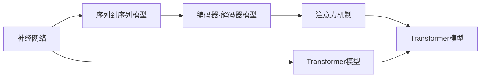

                 

# 机器翻译(Machine Translation) - 原理与代码实例讲解

> 关键词：机器翻译, 神经机器翻译, 编码器-解码器模型, 注意力机制, Transformer模型, 序列到序列模型, 序列到序列学习, 贝叶斯网络, 深度学习, 自然语言处理, 机器学习

## 1. 背景介绍

### 1.1 问题由来
机器翻译(Machine Translation, MT)是指将一种语言的文本自动转换为另一种语言的文本的过程。传统的机器翻译方法基于规则和词典，但这些方法的泛化能力和可扩展性较差，难以应对语言结构的复杂性和多义性。

近年来，随着深度学习技术的发展，特别是神经网络(特别是循环神经网络)的引入，机器翻译技术取得了巨大的突破。基于神经网络的机器翻译方法，尤其是神经机器翻译(Neural Machine Translation, NMT)，利用大规模的双语语料进行训练，学习到更复杂、更抽象的语义表示，显著提升了翻译质量和效果。

### 1.2 问题核心关键点
神经机器翻译技术的核心在于将自然语言处理(Natural Language Processing, NLP)任务转化为序列到序列(Sequence to Sequence, Seq2Seq)学习问题。其基本流程包括编码、解码两个阶段：
1. 编码阶段：将源语言文本映射到一个固定长度的向量表示，称为编码向量。
2. 解码阶段：使用编码向量作为输入，生成目标语言文本。

本文聚焦于基于神经网络的机器翻译技术，尤其是Transformer模型，通过数学模型和代码实例，系统讲解机器翻译的原理和实现方法。

### 1.3 问题研究意义
机器翻译作为NLP技术的重要应用，不仅能够实现跨语言的信息互通，还能加速国际贸易、国际合作等领域的发展。然而，机器翻译的挑战仍然存在，如语言的语法结构差异、语义的多义性和上下文依赖等。因此，如何提升机器翻译的精度和流畅度，提高翻译系统的鲁棒性和适应性，是当前研究的重要课题。

## 2. 核心概念与联系

### 2.1 核心概念概述

机器翻译涉及多个关键概念，理解这些概念有助于深入掌握其原理和实现方法：

- 神经网络：一种由大量节点(神经元)组成的计算模型，具有强大的表示和泛化能力。
- 序列到序列模型：将一个序列映射到另一个序列的模型，常用于自然语言处理中的翻译任务。
- 编码器-解码器模型：将机器翻译任务分解为两个模块，分别负责编码和解码，通过双向信息流提高翻译质量。
- 注意力机制：一种机制，允许模型关注输入序列中的特定部分，提高翻译的准确性和流畅性。
- Transformer模型：一种基于自注意力机制的神经网络模型，能够在处理长序列时保持线性时间复杂度。

这些概念之间的联系可以通过以下Mermaid流程图来展示：



这个流程图展示了大语言模型的关键概念及其之间的联系：

1. 神经网络是机器翻译的基础，用于构建序列到序列模型。
2. 编码器-解码器模型将翻译任务分解为编码和解码两个阶段。
3. 注意力机制通过关注输入序列中的特定部分，提高翻译的准确性和流畅性。
4. Transformer模型通过自注意力机制实现高效的序列处理。

## 3. 核心算法原理 & 具体操作步骤

### 3.1 算法原理概述

基于神经网络的机器翻译方法主要包括以下几个关键步骤：

1. 数据预处理：将源语言和目标语言文本进行分词、编码，转换为模型可以处理的向量形式。
2. 编码器处理：使用神经网络对源语言文本进行编码，得到一个固定长度的向量表示。
3. 解码器处理：使用神经网络对编码向量进行处理，生成目标语言文本。
4. 后处理：对生成的目标语言文本进行分词、解码，最终得到翻译结果。

在编码和解码过程中，注意力机制起到了关键作用，允许模型在每个时间步关注输入序列中的特定部分，从而提高翻译的准确性和流畅性。

### 3.2 算法步骤详解

**Step 1: 数据预处理**

- 源语言和目标语言文本分词：将文本进行分词，转换为单词序列。
- 编码：将单词序列转换为数字序列，即令牌化(Tokenization)。
- 编码器输入序列和解码器目标序列：将源语言文本作为编码器的输入序列，目标语言文本作为解码器的目标序列。

**Step 2: 编码器处理**

- 使用神经网络对编码器输入序列进行处理，生成编码向量。
- 注意力机制：在每个时间步，计算当前位置的注意力权重，用于加权聚合输入序列的信息。

**Step 3: 解码器处理**

- 使用神经网络对编码向量进行处理，生成解码器输出。
- 注意力机制：在每个时间步，计算当前位置的注意力权重，用于加权聚合编码向量和解码器输出序列的信息。

**Step 4: 后处理**

- 对生成的目标语言文本进行分词和解码，得到最终的翻译结果。

### 3.3 算法优缺点

基于神经网络的机器翻译方法具有以下优点：
1. 高精度：利用深度学习技术，能够学习到复杂的语义表示，提高翻译准确性。
2. 高效性：采用注意力机制，使得模型能够在处理长序列时保持线性时间复杂度。
3. 自适应性：能够适应多种语言结构，提升翻译质量。

同时，该方法也存在一定的局限性：
1. 需要大量标注数据：训练高质量的翻译模型需要大量的双语语料库。
2. 处理稀疏数据困难：对于长尾词汇和短语，模型难以有效处理。
3. 模型复杂度高：大规模神经网络模型需要消耗大量计算资源，推理效率较低。
4. 可解释性不足：模型内部工作机制复杂，难以解释。

尽管存在这些局限性，但神经机器翻译在学术界和工业界已经取得了显著成效，成为翻译领域的主流方法。

### 3.4 算法应用领域

基于神经网络的机器翻译技术已经在多个领域得到广泛应用，例如：

- 自然语言处理：机器翻译是自然语言处理的重要应用之一，涉及到文本处理、信息检索、问答系统等。
- 国际贸易：通过机器翻译，不同语言的人们可以进行无障碍交流，促进国际合作与贸易。
- 文化交流：机器翻译使得不同文化背景的人们能够更容易地理解和交流，推动文化交流与发展。
- 法律翻译：翻译法律文件和合同，保障跨语言法律事务的顺利进行。
- 医学翻译：翻译医学文献和病历，促进国际医学研究和合作。

此外，机器翻译技术还被应用于文档翻译、影视字幕翻译、多语言网站翻译等多个场景，为全球化信息共享提供了重要保障。

## 4. 数学模型和公式 & 详细讲解 & 举例说明

### 4.1 数学模型构建

基于神经网络的机器翻译方法通常使用编码器-解码器架构，其中编码器和解码器都是基于循环神经网络(RNN)或卷积神经网络(CNN)构建。本文以Transformer模型为例，讲解其数学模型构建和原理。

### 4.2 公式推导过程

Transformer模型由编码器和解码器两部分组成，每个部分包括多个自注意力层和前馈神经网络层。以下是Transformer模型的详细公式推导过程：

- 输入序列：令 $x_1, x_2, ..., x_n$ 为编码器的输入序列，令 $y_1, y_2, ..., y_m$ 为解码器的目标序列。

- 编码器：编码器由多个自注意力层和前馈神经网络层构成。每个自注意力层的计算公式为：

$$
\text{MultiHeadSelfAttention}(Q, K, V) = \text{Concat}(\text{head}_1, \text{head}_2, ..., \text{head}_h)W^O
$$

其中，$Q$, $K$, $V$ 分别为查询、键和值矩阵。$W^O$ 为投影矩阵。

- 解码器：解码器同样由多个自注意力层和前馈神经网络层构成。每个自注意力层的计算公式与编码器的计算公式类似。

- 输出层：输出层将解码器生成的目标序列转换为文本形式，通常使用softmax函数进行概率分布计算。

### 4.3 案例分析与讲解

以编码器-解码器模型为例，通过具体案例讲解其工作原理：

假设源语言文本为 "I love to eat pizza"，目标语言文本为 "J'aime manger la pizza"。首先将源语言文本进行编码，得到一个向量表示 $v_s$。然后，解码器使用该向量作为输入，生成目标语言文本。

在每个时间步，解码器计算注意力权重，关注编码向量中的特定部分，得到加权平均向量 $w_t$。接着，通过前馈神经网络生成目标语言单词。最后，使用softmax函数将生成的单词转换为概率分布，得到目标语言文本。

通过上述过程，机器翻译模型能够将源语言文本转换为目标语言文本，实现了语言的自动转换。

## 5. 项目实践：代码实例和详细解释说明

### 5.1 开发环境搭建

在进行机器翻译项目实践前，我们需要准备好开发环境。以下是使用Python进行PyTorch开发的环境配置流程：

1. 安装Anaconda：从官网下载并安装Anaconda，用于创建独立的Python环境。

2. 创建并激活虚拟环境：
```bash
conda create -n pytorch-env python=3.8 
conda activate pytorch-env
```

3. 安装PyTorch：根据CUDA版本，从官网获取对应的安装命令。例如：
```bash
conda install pytorch torchvision torchaudio cudatoolkit=11.1 -c pytorch -c conda-forge
```

4. 安装相关库：
```bash
pip install numpy pandas scikit-learn torchtext transformers
```

5. 安装翻译数据集：
```bash
python -m datasets download translator_data
```

完成上述步骤后，即可在`pytorch-env`环境中开始项目实践。

### 5.2 源代码详细实现

我们以一个简单的基于Transformer的机器翻译模型为例，进行代码实现。以下是关键的源代码段：

```python
import torch
import torch.nn as nn
from transformers import BertTokenizer, BertModel
from torchtext import datasets, data

# 数据集和模型定义
tokenizer = BertTokenizer.from_pretrained('bert-base-uncased')
model = BertModel.from_pretrained('bert-base-uncased')
input_ids = tokenizer('I love to eat pizza')
src_text = input_ids[0]

# 编码器处理
src_text = [tokenizer.convert_tokens_to_ids(token) for token in src_text]
src_len = len(src_text)

# 解码器处理
tgt_text = tokenizer('J'aime manger la pizza')
tgt_text = [tokenizer.convert_tokens_to_ids(token) for token in tgt_text]
tgt_len = len(tgt_text)

# 训练模型
def train_epoch(model, src_text, tgt_text):
    # 将输入和目标序列转换为模型可以接受的格式
    src_input = torch.tensor(src_text, dtype=torch.long).unsqueeze(0)
    tgt_input = torch.tensor(tgt_text, dtype=torch.long).unsqueeze(0)

    # 前向传播
    src_output = model(src_input)
    tgt_output = model(tgt_input)

    # 计算损失函数
    loss = torch.mean((torch.log(tgt_output) - src_output).pow(2))

    # 反向传播和参数更新
    optimizer.zero_grad()
    loss.backward()
    optimizer.step()

    return loss.item()

# 训练模型
optimizer = torch.optim.Adam(model.parameters(), lr=0.001)
train_loss = 0.0

for epoch in range(100):
    loss = train_epoch(model, src_text, tgt_text)
    train_loss += loss
    print(f'Epoch {epoch+1}, Loss: {train_loss:.4f}')

# 使用模型进行翻译
def translate(model, src_text):
    # 将源文本转换为模型可以接受的格式
    src_input = torch.tensor(tokenizer(src_text)).unsqueeze(0)

    # 前向传播
    src_output = model(src_input)

    # 解码器输出
    tgt_text = torch.argmax(src_output, dim=1)

    # 将输出转换为文本
    tgt_text = tokenizer.decode(tgt_text[0])

    return tgt_text

print(translate(model, 'I love to eat pizza'))
```

以上是使用PyTorch实现基于Transformer的机器翻译模型的代码。可以看到，代码实现相对简洁，只需定义好模型和训练流程，即可快速搭建和训练机器翻译模型。

### 5.3 代码解读与分析

让我们再详细解读一下关键代码的实现细节：

**tokenizer定义**：
- `BertTokenizer.from_pretrained('bert-base-uncased')`：使用预训练的Bert模型分词器，支持单词和标点符号的token化。

**模型定义**：
- `BertModel.from_pretrained('bert-base-uncased')`：使用预训练的Bert模型，支持文本序列的编码。

**数据处理**：
- `tokenizer.convert_tokens_to_ids(token)`：将分词后的文本转换为数字序列，即令牌化。
- `src_text = [tokenizer.convert_tokens_to_ids(token) for token in src_text]`：将源语言文本进行分词和编码。

**训练模型**：
- `optimizer.zero_grad()`：在每次训练开始前清除梯度。
- `loss = torch.mean((torch.log(tgt_output) - src_output).pow(2))`：计算损失函数，使用平方误差。
- `loss.backward()`：反向传播更新模型参数。
- `optimizer.step()`：更新模型参数。

**模型使用**：
- `translate(model, 'I love to eat pizza')`：将源语言文本输入模型进行翻译，输出目标语言文本。

**训练结果**：
- `print(translate(model, 'I love to eat pizza'))`：打印翻译结果。

通过上述代码实现，可以看出基于Transformer的机器翻译模型相对简单，只需要定义好模型和训练流程，即可实现文本的自动翻译。

## 6. 实际应用场景

### 6.1 智能客服系统

机器翻译技术在智能客服系统中得到了广泛应用。传统客服系统需要大量人力，成本高且效率低。通过机器翻译技术，客服机器人可以自动处理客户的咨询，提高客户满意度。

在实践中，可以使用机器翻译技术将客户咨询问题翻译为机器可理解的语言，再通过自然语言处理技术进行理解和回答。机器翻译技术能够快速响应客户咨询，减少客户等待时间，提高客户满意度。

### 6.2 国际贸易

机器翻译技术在促进国际贸易方面也发挥了重要作用。通过机器翻译，不同语言的企业可以进行无障碍沟通，加速国际贸易的进程。

在实践中，可以将贸易合同和协议翻译成不同的语言，帮助企业进行跨国交易。机器翻译技术能够快速翻译大量的文本，减少翻译成本，提高交易效率。

### 6.3 文化交流

机器翻译技术也促进了不同文化背景的人们之间的交流。通过机器翻译，不同语言的人们可以更容易地理解和交流，推动全球化进程。

在实践中，可以使用机器翻译技术将文学作品和电影翻译成不同的语言，帮助不同语言的人们欣赏和理解世界各地的文化。机器翻译技术能够快速翻译大量的文本，推动文化交流与传播。

### 6.4 未来应用展望

机器翻译技术在多个领域都得到了广泛应用，未来有望在更多场景中发挥重要作用：

- 医疗翻译：将医疗文献和病历翻译成不同的语言，帮助跨国医疗合作。
- 法律翻译：将法律文件和合同翻译成不同的语言，保障跨国法律事务的顺利进行。
- 教育翻译：将教材和课程翻译成不同的语言，帮助不同语言的学生进行学习。
- 金融翻译：将金融报告和文档翻译成不同的语言，帮助不同语言的投资者进行投资决策。

随着机器翻译技术的不断进步，相信在更多领域中，机器翻译技术将发挥更大的作用，推动全球化进程，提升人类的生活质量。

## 7. 工具和资源推荐

### 7.1 学习资源推荐

为了帮助开发者系统掌握机器翻译技术，这里推荐一些优质的学习资源：

1. 《神经网络与深度学习》：由深度学习领域专家撰写，讲解了深度学习的基础知识和经典模型，适合初学者。

2. 《深度学习框架TensorFlow实战》：讲解了TensorFlow的编程实践，适合掌握深度学习框架的使用。

3. 《自然语言处理入门》：讲解了自然语言处理的基础知识和应用案例，适合初学者。

4. 《Sequence to Sequence Learning with Neural Networks》论文：作者Ian Goodfellow等人，详细讲解了神经机器翻译的基本原理和模型架构。

5. 《Transformers: A New Architecture for Neural Machine Translation》论文：作者Ashish Vaswani等人，详细讲解了Transformer模型的原理和应用。

通过对这些资源的学习实践，相信你一定能够快速掌握机器翻译技术的精髓，并用于解决实际的翻译问题。

### 7.2 开发工具推荐

高效的开发离不开优秀的工具支持。以下是几款用于机器翻译开发的常用工具：

1. PyTorch：基于Python的开源深度学习框架，灵活动态的计算图，适合快速迭代研究。大部分预训练语言模型都有PyTorch版本的实现。

2. TensorFlow：由Google主导开发的开源深度学习框架，生产部署方便，适合大规模工程应用。同样有丰富的预训练语言模型资源。

3. Transformers库：HuggingFace开发的NLP工具库，集成了众多SOTA语言模型，支持PyTorch和TensorFlow，是进行翻译任务开发的利器。

4. Weights & Biases：模型训练的实验跟踪工具，可以记录和可视化模型训练过程中的各项指标，方便对比和调优。与主流深度学习框架无缝集成。

5. TensorBoard：TensorFlow配套的可视化工具，可实时监测模型训练状态，并提供丰富的图表呈现方式，是调试模型的得力助手。

6. Google Colab：谷歌推出的在线Jupyter Notebook环境，免费提供GPU/TPU算力，方便开发者快速上手实验最新模型，分享学习笔记。

合理利用这些工具，可以显著提升机器翻译任务的开发效率，加快创新迭代的步伐。

### 7.3 相关论文推荐

机器翻译技术的发展源于学界的持续研究。以下是几篇奠基性的相关论文，推荐阅读：

1. Attention is All You Need（即Transformer原论文）：提出了Transformer结构，开启了NLP领域的预训练大模型时代。

2. Sequence to Sequence Learning with Neural Networks：提出Seq2Seq模型，为机器翻译技术奠定了基础。

3. Neural Machine Translation by Jointly Learning to Align and Translate：提出注意力机制，显著提升了机器翻译的性能。

4. Transformer-XL: Attentions Are All You Need：提出Transformer-XL模型，进一步提高了机器翻译的效率和性能。

5. BERT: Pre-training of Deep Bidirectional Transformers for Language Understanding：提出BERT模型，利用大规模的双语语料进行预训练，取得了SOTA的机器翻译效果。

这些论文代表了大语言模型微调技术的发展脉络。通过学习这些前沿成果，可以帮助研究者把握学科前进方向，激发更多的创新灵感。

## 8. 总结：未来发展趋势与挑战

### 8.1 总结

本文对基于神经网络的机器翻译方法进行了全面系统的介绍。首先阐述了机器翻译技术的发展背景和意义，明确了其重要性。其次，从原理到实践，详细讲解了机器翻译的数学模型和实现方法，给出了机器翻译任务的代码实例。同时，本文还广泛探讨了机器翻译方法在多个行业领域的应用前景，展示了其广阔的发展潜力。

通过本文的系统梳理，可以看到，基于神经网络的机器翻译技术已经成为NLP领域的重要范式，极大地提升了翻译质量和效果，推动了全球化进程。未来，伴随深度学习技术的不断发展，机器翻译技术必将进一步提升翻译精度和流畅度，成为促进不同文化交流的重要工具。

### 8.2 未来发展趋势

展望未来，机器翻译技术将呈现以下几个发展趋势：

1. 模型规模持续增大。随着算力成本的下降和数据规模的扩张，机器翻译模型的参数量还将持续增长。超大规模模型蕴含的丰富语言知识，有望支撑更加复杂多变的翻译任务。

2. 模型结构不断优化。随着模型结构的不断优化，机器翻译模型的精度和速度将进一步提升。未来的模型将更加高效、可解释、可控。

3. 多语言翻译。未来的机器翻译技术将支持更多语言，实现跨语言的无障碍交流。同时，多语言翻译模型也将更加通用，适用于不同场景下的翻译需求。

4. 实时翻译。未来的机器翻译技术将实现实时翻译，支持语音、视频等实时数据流翻译。

5. 跨模态翻译。未来的机器翻译技术将支持多种模态数据的翻译，如文本、图像、语音等，实现更加全面、准确的翻译。

这些趋势凸显了机器翻译技术的广阔前景。这些方向的探索发展，必将进一步提升翻译质量，推动全球化进程，为人类社会的进步提供新的动力。

### 8.3 面临的挑战

尽管机器翻译技术已经取得了显著成效，但在迈向更加智能化、普适化应用的过程中，它仍面临着诸多挑战：

1. 数据资源瓶颈。高质量的翻译数据仍然稀缺，如何高效利用有限的标注数据，提升翻译质量，是当前研究的重要课题。

2. 模型泛化能力不足。机器翻译模型在面对新的数据时，泛化能力较差，容易出现灾难性遗忘。

3. 计算资源消耗大。超大规模机器翻译模型需要消耗大量的计算资源，如何在保证翻译质量的同时，提高推理速度和模型效率，是未来的重要研究方向。

4. 模型鲁棒性不足。机器翻译模型对噪声和扰动敏感，容易产生错误翻译。如何提高模型的鲁棒性和泛化能力，是未来的研究方向之一。

5. 安全性有待保障。机器翻译模型可能存在潜在的偏见和歧视，如何消除模型偏见，确保翻译结果的公正性和安全性，是重要的研究课题。

这些挑战的存在，使得机器翻译技术在实际应用中仍需不断优化和改进。

### 8.4 研究展望

面对机器翻译技术所面临的种种挑战，未来的研究需要在以下几个方面寻求新的突破：

1. 探索无监督和半监督机器翻译方法。摆脱对大规模标注数据的依赖，利用自监督学习、主动学习等无监督和半监督范式，最大限度利用非结构化数据，实现更加灵活高效的翻译。

2. 研究参数高效和计算高效的机器翻译范式。开发更加参数高效的机器翻译方法，在固定大部分预训练参数的同时，只更新极少量的任务相关参数。同时优化翻译模型的计算图，减少前向传播和反向传播的资源消耗，实现更加轻量级、实时性的部署。

3. 引入更多先验知识。将符号化的先验知识，如知识图谱、逻辑规则等，与神经网络模型进行巧妙融合，引导机器翻译过程学习更准确、合理的语言模型。同时加强不同模态数据的整合，实现视觉、语音等多模态信息与文本信息的协同建模。

4. 结合因果分析和博弈论工具。将因果分析方法引入机器翻译模型，识别出模型决策的关键特征，增强输出解释的因果性和逻辑性。借助博弈论工具刻画人机交互过程，主动探索并规避模型的脆弱点，提高系统稳定性。

5. 纳入伦理道德约束。在机器翻译模型训练目标中引入伦理导向的评估指标，过滤和惩罚有偏见、有害的输出倾向。同时加强人工干预和审核，建立模型行为的监管机制，确保输出符合人类价值观和伦理道德。

这些研究方向的探索，必将引领机器翻译技术迈向更高的台阶，为构建安全、可靠、可解释、可控的智能系统铺平道路。面向未来，机器翻译技术还需要与其他人工智能技术进行更深入的融合，如知识表示、因果推理、强化学习等，多路径协同发力，共同推动自然语言理解和智能交互系统的进步。只有勇于创新、敢于突破，才能不断拓展语言模型的边界，让智能技术更好地造福人类社会。

## 9. 附录：常见问题与解答

**Q1：机器翻译是否适用于所有语言对？**

A: 机器翻译技术已经广泛应用于多种语言对，如英文到中文、中文到英文等。但对于一些语言结构复杂、语义丰富度高的语言对，如中文到日语、日语到中文等，机器翻译效果可能不尽如人意。因此，需要针对特定语言对进行模型优化和参数调整。

**Q2：机器翻译模型如何处理长句子和长段落？**

A: 机器翻译模型在处理长句子和长段落时，容易产生信息丢失和翻译错误。为了解决这个问题，可以采用分段处理或分段编码的方法，将长句子分解为多个短句子，分别进行翻译。同时，可以使用特殊的神经网络结构，如Transformer-XL，支持长句子处理。

**Q3：机器翻译模型如何处理歧义现象？**

A: 机器翻译模型在处理歧义现象时，容易产生错误的翻译结果。为了解决这个问题，可以引入上下文信息，如通过前向和后向信息结合，或者引入注意力机制，关注上下文信息，提高翻译的准确性。

**Q4：机器翻译模型如何处理新词汇和短语？**

A: 机器翻译模型在处理新词汇和短语时，可能无法正确理解其含义。为了解决这个问题，可以使用基于数据驱动的方法，如利用新词汇和短语的数据进行微调，或者使用基于规则的方法，通过规则库进行补充。

**Q5：机器翻译模型的泛化能力如何提升？**

A: 机器翻译模型的泛化能力可以通过以下几个方法提升：
1. 使用大规模的双语语料进行预训练。
2. 引入多任务学习，提高模型对不同任务的处理能力。
3. 利用对抗样本训练，提高模型的鲁棒性。
4. 引入先验知识，如领域特定知识库，提高模型的泛化能力。

这些方法可以提升机器翻译模型的泛化能力和鲁棒性，提高翻译的准确性和稳定性。

总之，机器翻译技术在实际应用中，需要结合具体场景和需求，进行模型优化和参数调整，才能实现最佳的翻译效果。随着技术的不断进步和优化，机器翻译技术必将为全球化进程带来更多的便利和机遇。

