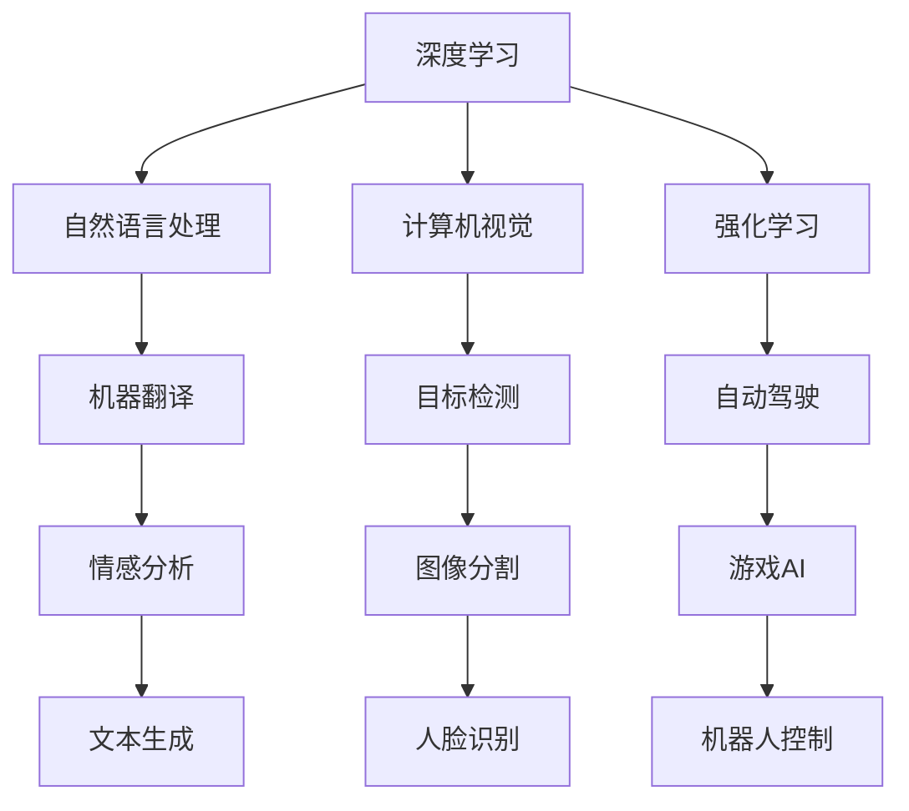

                 

# 李开复：AI 2.0 时代的市场前景

在AI 2.0的时代，人工智能已经从技术的探索转向了实际应用的落地，这个转变带来了巨大的市场机遇和挑战。本文将深入探讨AI 2.0时代的市场前景，从背景介绍、核心概念、核心算法、应用场景、工具资源等方面进行全面剖析，并提出未来的发展趋势和挑战。

## 1. 背景介绍

### 1.1 人工智能的进化

人工智能经历了多次浪潮，从最初的符号推理到深度学习，再到当前的AI 2.0时代。AI 2.0时代，人工智能技术已经发展到了一个新的阶段，它不仅在技术上取得了突破，而且在实际应用中也展现出了强大的潜力。

**1.1.1 从符号推理到深度学习**

早期的AI系统主要使用符号推理和专家系统的技术。这些系统试图通过规则和知识库来模拟人类的推理和决策过程。然而，这种基于规则的方法存在许多限制，如知识获取的困难和缺乏自学习能力。

深度学习技术的出现，尤其是神经网络的引入，使得AI系统能够自动学习数据中的特征和模式。这种技术不需要人工设计规则和特征，而是通过大量数据进行训练，逐渐提升性能。

**1.1.2 从深度学习到AI 2.0**

AI 2.0时代的到来，标志着人工智能技术的成熟和应用落地。AI 2.0不仅包括深度学习，还包括了更广泛的技术，如自然语言处理、计算机视觉、强化学习等。这些技术使得AI系统能够处理更多类型的输入，如文本、图像、声音等，并在实际应用中展现出了更强的表现力。

## 2. 核心概念与联系

### 2.1 核心概念概述

AI 2.0时代涉及多个核心概念，包括深度学习、自然语言处理、计算机视觉、强化学习等。这些概念之间存在着密切的联系和相互作用。

**2.1.1 深度学习**

深度学习是AI 2.0时代最为重要的技术之一。它通过多层神经网络对数据进行学习，自动提取特征，进而实现分类、回归、生成等任务。深度学习技术的应用范围非常广泛，包括图像识别、语音识别、自然语言处理等。

**2.1.2 自然语言处理**

自然语言处理（NLP）是AI 2.0时代的重要分支。它主要研究如何让计算机理解和处理人类语言。自然语言处理技术可以用于机器翻译、情感分析、文本生成等任务。

**2.1.3 计算机视觉**

计算机视觉是另一个重要的AI分支。它主要研究如何让计算机“看”和理解图像和视频数据。计算机视觉技术可以用于目标检测、图像分割、人脸识别等任务。

**2.1.4 强化学习**

强化学习是一种通过与环境交互来学习最优策略的技术。它广泛应用于自动驾驶、游戏AI、机器人控制等领域。强化学习通过不断的试错，逐步优化策略，以实现更好的性能。

这些核心概念之间存在着密切的联系和相互作用。例如，深度学习可以用于提取图像特征，自然语言处理可以用于理解文本描述，计算机视觉可以用于处理视觉数据，强化学习可以用于优化策略选择。

### 2.2 核心概念之间的联系

这些核心概念之间的联系可以通过以下Mermaid流程图来展示：



这个流程图展示了一个AI 2.0系统可能涉及到的核心技术及其相互关系。例如，自然语言处理技术可以用于机器翻译（E）和情感分析（H），计算机视觉技术可以用于目标检测（F）和图像分割（I），强化学习技术可以用于自动驾驶（G）和机器人控制（M）。

## 3. 核心算法原理 & 具体操作步骤

### 3.1 算法原理概述

AI 2.0时代的核心算法原理主要基于深度学习和强化学习。这些算法原理可以总结如下：

**3.1.1 深度学习算法原理**

深度学习算法主要基于神经网络的结构和优化方法。神经网络通过多层非线性变换，自动提取数据特征。深度学习算法通过反向传播算法更新网络参数，以最小化预测误差。

**3.1.2 强化学习算法原理**

强化学习算法主要基于策略优化和环境交互。算法通过与环境交互，获取奖励和惩罚信号，逐步优化策略，以实现最优的决策和行为。

### 3.2 算法步骤详解

AI 2.0时代的算法步骤通常包括以下几个关键步骤：

**3.2.1 数据准备**

数据准备是AI 2.0系统的第一步。需要收集、标注和预处理数据，以供后续的模型训练使用。数据准备通常包括数据清洗、特征工程和数据增强等步骤。

**3.2.2 模型训练**

模型训练是AI 2.0系统的核心步骤。在模型训练阶段，需要选择合适的算法和超参数，利用标注数据对模型进行训练，以优化模型的性能。

**3.2.3 模型评估**

模型评估是AI 2.0系统的关键步骤。在模型训练完成后，需要对模型进行评估，以验证其性能是否满足要求。模型评估通常包括准确率、召回率、F1值等指标。

**3.2.4 模型部署**

模型部署是将AI 2.0系统应用于实际场景的过程。模型部署通常包括模型封装、接口设计、数据传输等步骤。

### 3.3 算法优缺点

AI 2.0时代的算法具有以下优点：

- 自动化：AI 2.0算法能够自动学习数据特征，减少了人工干预的环节，提高了效率。
- 高精度：AI 2.0算法通常具有较高的预测精度，能够在复杂的任务中取得优异表现。
- 泛化能力强：AI 2.0算法具有较强的泛化能力，能够在不同场景中表现良好。

然而，AI 2.0算法也存在一些缺点：

- 数据需求量大：AI 2.0算法需要大量的标注数据进行训练，数据获取成本高。
- 模型复杂：AI 2.0算法通常具有复杂的结构和大量的参数，需要高性能计算资源进行训练。
- 可解释性差：AI 2.0算法通常被认为是“黑箱”系统，难以解释其内部工作机制和决策逻辑。

### 3.4 算法应用领域

AI 2.0算法广泛应用于各个领域，包括医疗、金融、智能制造等。以下是一些典型的应用场景：

**3.4.1 医疗**

在医疗领域，AI 2.0算法可以用于疾病诊断、治疗方案推荐、药物研发等任务。例如，IBM Watson Health利用深度学习算法，结合临床数据和文献信息，帮助医生制定个性化的治疗方案。

**3.4.2 金融**

在金融领域，AI 2.0算法可以用于风险评估、交易策略优化、欺诈检测等任务。例如，JP Morgan Chase利用深度学习算法，构建了智能投顾平台，帮助客户进行资产配置和投资管理。

**3.4.3 智能制造**

在智能制造领域，AI 2.0算法可以用于生产计划优化、故障诊断、质量控制等任务。例如，Siemens利用计算机视觉和深度学习算法，开发了智能制造平台，帮助企业实现智能化生产。

## 4. 数学模型和公式 & 详细讲解 & 举例说明

### 4.1 数学模型构建

AI 2.0算法的数学模型主要基于神经网络的结构和优化方法。神经网络通常由输入层、隐藏层和输出层组成，其中隐藏层可以通过多个非线性变换提取数据特征。

### 4.2 公式推导过程

以下是深度学习算法中常用的数学公式：

**4.2.1 前向传播**

前向传播是深度学习算法的核心步骤。在给定输入 $x$ 的情况下，前向传播计算过程可以表示为：

$$
h = f(Wx + b)
$$

其中 $f$ 为激活函数，$W$ 和 $b$ 分别为权重和偏置项。

**4.2.2 反向传播**

反向传播是深度学习算法的优化步骤。在给定损失函数 $L$ 的情况下，反向传播算法可以计算每个神经元的梯度，进而更新权重和偏置项。反向传播算法的核心公式为：

$$
\frac{\partial L}{\partial W} = \frac{\partial L}{\partial z} \frac{\partial z}{\partial h} \frac{\partial h}{\partial W}
$$

其中 $\frac{\partial L}{\partial z}$ 为损失函数对隐藏层输出的梯度，$\frac{\partial z}{\partial h}$ 为隐藏层输出对隐藏层输入的梯度，$\frac{\partial h}{\partial W}$ 为隐藏层输入对权重的梯度。

### 4.3 案例分析与讲解

以机器翻译为例，深度学习算法可以通过神经网络实现端到端的机器翻译。在训练过程中，将源语言文本和目标语言文本作为输入，利用神经网络进行编码和解码，得到目标语言文本。训练过程中，通过最小化翻译误差，优化神经网络参数。

## 5. 项目实践：代码实例和详细解释说明

### 5.1 开发环境搭建

在进行AI 2.0项目开发时，需要搭建高性能的计算环境。以下是一些常用的开发环境：

**5.1.1 GPU/TPU环境**

GPU/TPU环境是AI 2.0项目开发的基础。需要安装相应的GPU/TPU驱动程序和开发工具，如NVIDIA CUDA、TensorFlow、PyTorch等。

**5.1.2 分布式环境**

分布式环境可以提高AI 2.0项目的计算效率。需要搭建多机分布式计算环境，如Hadoop、Spark等，以实现分布式计算。

### 5.2 源代码详细实现

以下是一个简单的AI 2.0项目，使用深度学习算法实现图像分类。项目主要包括以下几个关键步骤：

**5.2.1 数据准备**

数据准备是图像分类的第一步。需要收集、标注和预处理数据，以供后续的模型训练使用。数据准备通常包括数据清洗、特征工程和数据增强等步骤。

```python
import numpy as np
import os

# 加载数据
def load_data(data_dir):
    data = []
    for filename in os.listdir(data_dir):
        img = cv2.imread(os.path.join(data_dir, filename))
        data.append(img)
    return data

# 数据增强
def augment_data(data):
    augmented_data = []
    for img in data:
        augmented_data.append(cv2.flip(img, 1))
        augmented_data.append(cv2.rotate(img, cv2.ROTATE_90_CLOCKWISE))
    return augmented_data
```

**5.2.2 模型训练**

模型训练是图像分类的核心步骤。在模型训练阶段，需要选择合适的算法和超参数，利用标注数据对模型进行训练，以优化模型的性能。

```python
from tensorflow.keras.models import Sequential
from tensorflow.keras.layers import Conv2D, MaxPooling2D, Flatten, Dense

# 定义模型
model = Sequential()
model.add(Conv2D(32, (3, 3), activation='relu', input_shape=(64, 64, 3)))
model.add(MaxPooling2D((2, 2)))
model.add(Conv2D(64, (3, 3), activation='relu'))
model.add(MaxPooling2D((2, 2)))
model.add(Conv2D(128, (3, 3), activation='relu'))
model.add(MaxPooling2D((2, 2)))
model.add(Flatten())
model.add(Dense(64, activation='relu'))
model.add(Dense(10, activation='softmax'))

# 编译模型
model.compile(optimizer='adam', loss='categorical_crossentropy', metrics=['accuracy'])

# 训练模型
model.fit(x_train, y_train, epochs=10, batch_size=32)
```

**5.2.3 模型评估**

模型评估是图像分类的关键步骤。在模型训练完成后，需要对模型进行评估，以验证其性能是否满足要求。模型评估通常包括准确率、召回率、F1值等指标。

```python
from sklearn.metrics import classification_report

# 评估模型
y_pred = model.predict(x_test)
y_pred = np.argmax(y_pred, axis=1)
print(classification_report(y_test, y_pred))
```

### 5.3 代码解读与分析

在上述代码中，我们首先定义了数据加载和数据增强函数，用于处理图像数据。接着，我们定义了一个简单的卷积神经网络模型，并使用adam优化器和交叉熵损失函数进行训练。在模型训练完成后，我们使用了sklearn的classification_report函数进行模型评估，输出准确率、召回率、F1值等指标。

## 6. 实际应用场景

### 6.1 智能客服系统

智能客服系统是AI 2.0技术的一个重要应用场景。智能客服系统利用自然语言处理和机器学习技术，实现自动回答客户咨询，提高客户满意度和响应速度。

**6.1.1 技术架构**

智能客服系统的技术架构通常包括以下几个关键组件：

- **自然语言处理引擎**：用于理解客户咨询，提取文本特征。
- **对话管理系统**：用于管理对话流程，生成应答策略。
- **知识库**：用于存储和检索知识库内容。
- **用户界面**：用于展示对话过程和应答结果。

**6.1.2 技术实现**

智能客服系统的技术实现通常包括以下几个关键步骤：

1. 收集和标注客服对话数据。
2. 训练自然语言处理模型，提取客户咨询的文本特征。
3. 训练对话管理系统，生成应答策略。
4. 存储和检索知识库内容。
5. 部署智能客服系统，实现客户咨询自动应答。

### 6.2 金融舆情监测

金融舆情监测是AI 2.0技术在金融领域的重要应用。金融舆情监测利用自然语言处理和机器学习技术，实时监测金融市场舆论动向，帮助金融机构及时应对风险。

**6.2.1 技术架构**

金融舆情监测系统的技术架构通常包括以下几个关键组件：

- **数据采集系统**：用于采集金融市场的新闻、报道、评论等文本数据。
- **自然语言处理引擎**：用于理解文本数据，提取舆情信息。
- **情感分析模型**：用于分析文本情感，识别舆情倾向。
- **风险预警系统**：用于生成舆情预警信息，帮助金融机构及时应对风险。

**6.2.2 技术实现**

金融舆情监测系统的技术实现通常包括以下几个关键步骤：

1. 收集和标注金融市场舆情数据。
2. 训练自然语言处理模型，提取舆情信息。
3. 训练情感分析模型，识别舆情倾向。
4. 部署金融舆情监测系统，实时监测金融市场舆情。
5. 生成舆情预警信息，帮助金融机构及时应对风险。

### 6.3 个性化推荐系统

个性化推荐系统是AI 2.0技术在电商领域的重要应用。个性化推荐系统利用自然语言处理和机器学习技术，根据用户行为和偏好，推荐符合用户需求的商品。

**6.3.1 技术架构**

个性化推荐系统的技术架构通常包括以下几个关键组件：

- **用户行为记录系统**：用于记录用户浏览、点击、购买等行为数据。
- **商品描述系统**：用于存储和检索商品描述信息。
- **推荐算法引擎**：用于生成个性化推荐结果。
- **推荐结果展示系统**：用于展示推荐结果。

**6.3.2 技术实现**

个性化推荐系统的技术实现通常包括以下几个关键步骤：

1. 收集和标注用户行为数据。
2. 训练推荐算法模型，提取用户行为特征和商品描述特征。
3. 训练推荐算法引擎，生成个性化推荐结果。
4. 部署个性化推荐系统，实现个性化推荐。
5. 展示推荐结果，提高用户购物体验。

### 6.4 未来应用展望

AI 2.0技术在未来的应用前景非常广阔，以下是一些可能的未来应用：

**6.4.1 自动驾驶**

自动驾驶是AI 2.0技术在交通领域的重要应用。自动驾驶利用计算机视觉、深度学习和强化学习技术，实现自动驾驶汽车。

**6.4.2 机器人控制**

机器人控制是AI 2.0技术在工业和家庭领域的重要应用。机器人控制利用计算机视觉、深度学习和强化学习技术，实现机器人的自主导航和操作。

**6.4.3 虚拟助手**

虚拟助手是AI 2.0技术在智能家居和办公领域的重要应用。虚拟助手利用自然语言处理和机器学习技术，实现与用户的自然交互。

## 7. 工具和资源推荐

### 7.1 学习资源推荐

为了帮助开发者系统掌握AI 2.0技术，以下是一些优质的学习资源：

**7.1.1 TensorFlow和PyTorch官方文档**

TensorFlow和PyTorch是当前最流行的深度学习框架，它们的官方文档详细介绍了如何使用这些框架进行模型训练和推理。

**7.1.2 深度学习入门书籍**

深度学习入门书籍，如《深度学习》（Goodfellow et al.）、《神经网络与深度学习》（Michael Nielsen），可以帮助初学者系统掌握深度学习的基本概念和应用。

**7.1.3 在线课程**

在线课程，如Coursera上的《深度学习专项课程》（Deep Learning Specialization），可以帮助开发者系统学习深度学习技术，并在实践中掌握相关技能。

### 7.2 开发工具推荐

在AI 2.0项目开发中，常用的开发工具包括：

**7.2.1 Jupyter Notebook**

Jupyter Notebook是Python开发的交互式笔记本，可以方便地进行代码编写、数据可视化和结果展示。

**7.2.2 TensorBoard**

TensorBoard是TensorFlow配套的可视化工具，可以实时监测模型训练状态，并提供丰富的图表呈现方式，是调试模型的得力助手。

**7.2.3 PyTorch Lightning**

PyTorch Lightning是一个轻量级的深度学习框架，可以简化模型训练和部署过程，并支持分布式训练。

### 7.3 相关论文推荐

以下是几篇经典的AI 2.0相关论文，推荐阅读：

**7.3.1 AlphaGo论文**

AlphaGo是DeepMind开发的一个围棋程序，利用深度学习和强化学习技术，击败了世界围棋冠军李世石，展示了AI 2.0技术的强大能力。

**7.3.2 GAN论文**

GAN（Generative Adversarial Networks）是一种生成对抗网络，利用深度学习和强化学习技术，生成高质量的图像、音频和视频内容。

**7.3.3 AlphaStar论文**

AlphaStar是DeepMind开发的一个星际争霸程序，利用深度学习和强化学习技术，击败了世界星际争霸冠军，展示了AI 2.0技术在策略游戏中的应用。

## 8. 总结：未来发展趋势与挑战

### 8.1 总结

本文对AI 2.0时代的市场前景进行了全面系统的探讨。从背景介绍、核心概念、核心算法、应用场景、工具资源等方面，详细介绍了AI 2.0技术在各个领域的应用和发展趋势。通过本文的系统梳理，可以看到AI 2.0技术正在成为各行各业的重要工具，其市场前景广阔。

### 8.2 未来发展趋势

AI 2.0技术在未来将呈现以下几个发展趋势：

**8.2.1 更加智能**

AI 2.0技术将变得更加智能，能够理解和处理更加复杂的任务。未来的AI 2.0系统将具备更加强大的自然语言处理、计算机视觉和强化学习能力，能够更好地适应现实世界的复杂性。

**8.2.2 更加高效**

AI 2.0技术将变得更加高效，能够在大规模数据上进行训练和推理。未来的AI 2.0系统将具备更加高效的计算能力和数据处理能力，能够更快地进行模型训练和推理。

**8.2.3 更加人性化**

AI 2.0技术将变得更加人性化，能够更好地与人类进行交互。未来的AI 2.0系统将具备更加自然、流畅的语音和文字交互能力，能够更好地理解人类需求和提供服务。

### 8.3 面临的挑战

尽管AI 2.0技术已经取得了瞩目成就，但在迈向更加智能化、普适化应用的过程中，它仍面临着诸多挑战：

**8.3.1 数据需求**

AI 2.0技术需要大量的标注数据进行训练，数据获取成本高。如何降低数据需求，提高数据利用效率，是未来的一大挑战。

**8.3.2 计算资源**

AI 2.0技术需要高性能的计算资源进行模型训练和推理，计算资源成本高。如何提高计算效率，降低计算成本，是未来的一大挑战。

**8.3.3 可解释性**

AI 2.0技术通常被认为是“黑箱”系统，难以解释其内部工作机制和决策逻辑。如何提高模型的可解释性，使其更加透明和可信，是未来的一大挑战。

### 8.4 研究展望

未来的AI 2.0技术需要在以下几个方面进行研究：

**8.4.1 更加智能**

未来的AI 2.0技术需要更加智能，能够理解和处理更加复杂的任务。研究更加智能的算法和模型，提升AI 2.0系统的表现力。

**8.4.2 更加高效**

未来的AI 2.0技术需要更加高效，能够在大规模数据上进行训练和推理。研究更加高效的算法和模型，提升AI 2.0系统的计算效率。

**8.4.3 更加人性化**

未来的AI 2.0技术需要更加人性化，能够更好地与人类进行交互。研究更加人性化的算法和模型，提升AI 2.0系统的用户体验。

**8.4.4 更加可解释**

未来的AI 2.0技术需要更加可解释，能够更好地理解人类需求和决策依据。研究更加可解释的算法和模型，提升AI 2.0系统的透明性和可信度。

总之，AI 2.0技术需要在智能化、高效化、人性化、可解释化等方面不断突破，才能真正实现人工智能技术在各行各业的落地应用。只有勇于创新、敢于突破，才能使AI 2.0技术在未来的发展中发挥更大的作用。

## 9. 附录：常见问题与解答

**Q1: AI 2.0技术是否适合所有领域？**

A: AI 2.0技术可以应用于多个领域，包括医疗、金融、智能制造等。但不同领域的应用场景和需求不同，需要根据具体情况进行优化和调整。

**Q2: 数据需求如何降低？**

A: 数据需求可以通过以下方法降低：

- **数据增强**：利用数据增强技术，生成更多的训练数据。
- **迁移学习**：利用预训练模型，降低数据需求。
- **主动学习**：利用主动学习技术，有选择地标注数据。

**Q3: 计算资源如何优化？**

A: 计算资源可以通过以下方法优化：

- **分布式训练**：利用分布式训练技术，提升计算效率。
- **模型压缩**：利用模型压缩技术，减少计算资源需求。
- **硬件优化**：利用GPU/TPU等高性能计算硬件，提升计算效率。

**Q4: 如何提高模型的可解释性？**

A: 提高模型的可解释性可以通过以下方法：

- **可视化**：利用可视化技术，展示模型内部工作机制。
- **解释模型**：利用解释模型技术，生成可解释的模型结果。
- **人工干预**：利用人工干预和审核，确保模型的透明性和可信度。

---

作者：禅与计算机程序设计艺术 / Zen and the Art of Computer Programming

