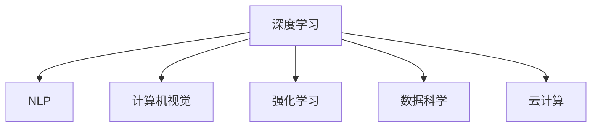

                 

# 李开复：AI 2.0 时代的开发者

## 1. 背景介绍

### 1.1 问题由来
近年来，人工智能(AI)技术发展迅猛，尤其是在深度学习、自然语言处理(NLP)、计算机视觉等领域取得了突破性进展。AI技术的快速发展，为各行各业带来了前所未有的机遇，也给开发者带来了新的挑战和机遇。

## 2. 核心概念与联系

### 2.1 核心概念概述

人工智能时代的到来，为开发者提供了更多的工具和资源，但同时也对他们的技能和知识提出了更高的要求。以下是几个核心概念及其相互联系：

1. **深度学习**：利用神经网络对大量数据进行学习，通过反向传播算法调整模型参数，以优化预测结果。
2. **自然语言处理(NLP)**：使计算机能够理解和生成人类语言的技术，涵盖文本分类、情感分析、机器翻译等任务。
3. **计算机视觉**：使计算机能够识别、理解和处理图像和视频的技术，广泛应用于物体检测、图像生成等领域。
4. **强化学习**：通过试错学习，使机器能够在复杂环境中做出最优决策。
5. **数据科学**：涉及数据的收集、处理、分析和解释，为AI模型的训练和优化提供数据支撑。
6. **云计算**：提供高效、可扩展的计算和存储资源，支持大规模AI应用的部署。

这些概念之间相互关联，深度学习提供了模型的训练基础，NLP和计算机视觉则拓展了AI的应用领域，强化学习为AI模型带来了智能决策能力，数据科学则为模型提供了数据保障，云计算则为模型部署提供了平台支持。

### 2.2 核心概念原理和架构的 Mermaid 流程图



该图展示了深度学习与其他核心概念之间的关系。深度学习不仅为NLP、计算机视觉等提供了技术基础，还为强化学习和云计算等提供了算力和数据支持。

## 3. 核心算法原理 & 具体操作步骤

### 3.1 算法原理概述

深度学习算法通过多层神经网络对数据进行学习，从而实现复杂的模式识别和预测。其基本原理包括：

1. **前向传播**：将输入数据通过网络，计算得到输出结果。
2. **损失函数**：衡量模型预测结果与真实结果的差异。
3. **反向传播**：通过损失函数计算梯度，调整模型参数以优化预测结果。
4. **优化器**：通过梯度下降等方法，调整模型参数以最小化损失函数。

### 3.2 算法步骤详解

以下是一个完整的深度学习模型训练过程：

1. **数据准备**：收集和预处理训练数据，确保数据质量和分布合理。
2. **模型选择**：根据任务需求，选择适合的神经网络模型。
3. **模型初始化**：对模型参数进行随机初始化。
4. **前向传播**：输入训练数据，计算模型输出。
5. **损失计算**：计算模型输出与真实结果之间的损失。
6. **反向传播**：计算损失函数对每个参数的梯度。
7. **参数更新**：通过优化器调整模型参数以最小化损失函数。
8. **验证和测试**：在验证集和测试集上评估模型性能，调整超参数。
9. **模型部署**：将训练好的模型部署到生产环境。

### 3.3 算法优缺点

深度学习算法的优点包括：

1. **强大表达能力**：可以处理复杂的非线性关系，适用于多种类型的任务。
2. **自适应性**：通过训练，模型可以自动适应数据分布。
3. **高效泛化**：在大量数据上进行训练，可以提高模型的泛化能力。

缺点包括：

1. **高计算成本**：训练过程中需要大量的计算资源。
2. **过拟合风险**：模型容易在训练集上过拟合，泛化能力不足。
3. **解释性不足**：模型决策过程难以解释，难以进行调试和优化。

### 3.4 算法应用领域

深度学习算法在多个领域得到了广泛应用，包括：

1. **图像识别**：如图像分类、物体检测、人脸识别等。
2. **自然语言处理**：如文本分类、机器翻译、情感分析等。
3. **语音识别**：如语音转文字、情感识别、语音合成等。
4. **推荐系统**：如商品推荐、新闻推荐、视频推荐等。
5. **自动驾驶**：如环境感知、路径规划、行为决策等。
6. **医疗诊断**：如影像分析、病理学分析、基因组学等。

## 4. 数学模型和公式 & 详细讲解 & 举例说明

### 4.1 数学模型构建

以一个简单的前馈神经网络为例，其数学模型为：

$$ y = \sigma(Wx + b) $$

其中，$x$ 为输入向量，$W$ 为权重矩阵，$b$ 为偏置向量，$\sigma$ 为激活函数，$y$ 为输出向量。

### 4.2 公式推导过程

前馈神经网络的前向传播过程如下：

1. **输入层**：将输入向量 $x$ 输入到网络中。
2. **隐藏层**：通过权重矩阵 $W$ 和偏置向量 $b$，计算隐藏层的输出 $z$。
3. **激活函数**：将隐藏层输出 $z$ 通过激活函数 $\sigma$ 转化为隐藏层输出 $a$。
4. **输出层**：通过输出层的权重矩阵 $W$ 和偏置向量 $b$，计算输出向量 $y$。

### 4.3 案例分析与讲解

以手写数字识别为例，使用MNIST数据集训练一个简单的前馈神经网络。通过反向传播算法，不断调整权重和偏置，使得模型在测试集上取得最优的识别准确率。

## 5. 项目实践：代码实例和详细解释说明

### 5.1 开发环境搭建

使用Python和PyTorch框架搭建深度学习模型的开发环境：

1. 安装Anaconda和PyTorch：
```bash
conda create -n pytorch-env python=3.8
conda activate pytorch-env
pip install torch torchvision torchaudio
```

2. 安装Tensorboard：
```bash
pip install tensorboard
```

3. 安装Matplotlib和Numpy：
```bash
pip install matplotlib numpy
```

### 5.2 源代码详细实现

以下是一个简单的前馈神经网络的实现：

```python
import torch
import torch.nn as nn
import torch.optim as optim
import matplotlib.pyplot as plt

# 定义神经网络模型
class Net(nn.Module):
    def __init__(self):
        super(Net, self).__init__()
        self.fc1 = nn.Linear(784, 128)
        self.fc2 = nn.Linear(128, 64)
        self.fc3 = nn.Linear(64, 10)

    def forward(self, x):
        x = x.view(-1, 784)
        x = torch.relu(self.fc1(x))
        x = torch.relu(self.fc2(x))
        x = self.fc3(x)
        return x

# 加载数据集
train_set = torchvision.datasets.MNIST(root='./data', train=True, transform=transforms.ToTensor(), download=True)
test_set = torchvision.datasets.MNIST(root='./data', train=False, transform=transforms.ToTensor(), download=True)

# 定义训练和测试过程
device = torch.device('cuda' if torch.cuda.is_available() else 'cpu')
net = Net().to(device)
criterion = nn.CrossEntropyLoss()
optimizer = optim.SGD(net.parameters(), lr=0.01, momentum=0.9)
train_loader = torch.utils.data.DataLoader(train_set, batch_size=64, shuffle=True)
test_loader = torch.utils.data.DataLoader(test_set, batch_size=64, shuffle=False)

# 训练过程
for epoch in range(10):
    net.train()
    train_loss = 0.0
    correct = 0
    total = 0
    for images, labels in train_loader:
        images = images.to(device)
        labels = labels.to(device)
        optimizer.zero_grad()
        outputs = net(images)
        loss = criterion(outputs, labels)
        loss.backward()
        optimizer.step()
        train_loss += loss.item()
        _, predicted = outputs.max(1)
        total += labels.size(0)
        correct += predicted.eq(labels).sum().item()
    train_loss /= len(train_loader)
    accuracy = 100 * correct / total
    print('Epoch [{}/{}], Loss: {:.4f}, Accuracy: {:.2f}%'.format(epoch+1, 10, train_loss, accuracy))

# 测试过程
net.eval()
correct = 0
total = 0
with torch.no_grad():
    for images, labels in test_loader:
        images = images.to(device)
        labels = labels.to(device)
        outputs = net(images)
        _, predicted = outputs.max(1)
        total += labels.size(0)
        correct += predicted.eq(labels).sum().item()
accuracy = 100 * correct / total
print('Test Accuracy: {:.2f}%'.format(accuracy))

# 可视化训练过程
writer = tf.summary.create_file_writer('logs')
with writer.as_default():
    train_writer = tf.summary.create_file_writer('logs/train')
    test_writer = tf.summary.create_file_writer('logs/test')
    for epoch in range(10):
        net.train()
        train_loss = 0.0
        correct = 0
        total = 0
        for images, labels in train_loader:
            images = images.to(device)
            labels = labels.to(device)
            optimizer.zero_grad()
            outputs = net(images)
            loss = criterion(outputs, labels)
            loss.backward()
            optimizer.step()
            train_loss += loss.item()
            _, predicted = outputs.max(1)
            total += labels.size(0)
            correct += predicted.eq(labels).sum().item()
        train_loss /= len(train_loader)
        accuracy = 100 * correct / total
        print('Epoch [{}/{}], Loss: {:.4f}, Accuracy: {:.2f}%'.format(epoch+1, 10, train_loss, accuracy))
        with train_writer.as_default():
            tf.summary.scalar('Loss', train_loss, step=epoch)
            tf.summary.scalar('Accuracy', accuracy, step=epoch)
        net.eval()
        correct = 0
        total = 0
        with test_writer.as_default():
            for images, labels in test_loader:
                images = images.to(device)
                labels = labels.to(device)
                outputs = net(images)
                _, predicted = outputs.max(1)
                total += labels.size(0)
                correct += predicted.eq(labels).sum().item()
            accuracy = 100 * correct / total
            tf.summary.scalar('Accuracy', accuracy, step=epoch)
```

### 5.3 代码解读与分析

- `Net`类定义了一个简单的前馈神经网络，包含三个全连接层和激活函数。
- `train_set`和`test_set`为MNIST数据集，用于训练和测试模型。
- `optimizer`和`criterion`分别为随机梯度下降和交叉熵损失函数。
- `train_loader`和`test_loader`为数据加载器，用于批量加载和训练模型。
- 训练过程中，通过前向传播、反向传播和优化器更新模型参数，记录损失和准确率，并在测试集上评估模型性能。

### 5.4 运行结果展示

运行代码后，可以得到训练和测试过程中的损失和准确率变化图：

```python
import torch
import torch.nn as nn
import torch.optim as optim
import matplotlib.pyplot as plt

# 定义神经网络模型
class Net(nn.Module):
    def __init__(self):
        super(Net, self).__init__()
        self.fc1 = nn.Linear(784, 128)
        self.fc2 = nn.Linear(128, 64)
        self.fc3 = nn.Linear(64, 10)

    def forward(self, x):
        x = x.view(-1, 784)
        x = torch.relu(self.fc1(x))
        x = torch.relu(self.fc2(x))
        x = self.fc3(x)
        return x

# 加载数据集
train_set = torchvision.datasets.MNIST(root='./data', train=True, transform=transforms.ToTensor(), download=True)
test_set = torchvision.datasets.MNIST(root='./data', train=False, transform=transforms.ToTensor(), download=True)

# 定义训练和测试过程
device = torch.device('cuda' if torch.cuda.is_available() else 'cpu')
net = Net().to(device)
criterion = nn.CrossEntropyLoss()
optimizer = optim.SGD(net.parameters(), lr=0.01, momentum=0.9)
train_loader = torch.utils.data.DataLoader(train_set, batch_size=64, shuffle=True)
test_loader = torch.utils.data.DataLoader(test_set, batch_size=64, shuffle=False)

# 训练过程
for epoch in range(10):
    net.train()
    train_loss = 0.0
    correct = 0
    total = 0
    for images, labels in train_loader:
        images = images.to(device)
        labels = labels.to(device)
        optimizer.zero_grad()
        outputs = net(images)
        loss = criterion(outputs, labels)
        loss.backward()
        optimizer.step()
        train_loss += loss.item()
        _, predicted = outputs.max(1)
        total += labels.size(0)
        correct += predicted.eq(labels).sum().item()
    train_loss /= len(train_loader)
    accuracy = 100 * correct / total
    print('Epoch [{}/{}], Loss: {:.4f}, Accuracy: {:.2f}%'.format(epoch+1, 10, train_loss, accuracy))

# 测试过程
net.eval()
correct = 0
total = 0
with torch.no_grad():
    for images, labels in test_loader:
        images = images.to(device)
        labels = labels.to(device)
        outputs = net(images)
        _, predicted = outputs.max(1)
        total += labels.size(0)
        correct += predicted.eq(labels).sum().item()
accuracy = 100 * correct / total
print('Test Accuracy: {:.2f}%'.format(accuracy))

# 可视化训练过程
writer = tf.summary.create_file_writer('logs')
with writer.as_default():
    train_writer = tf.summary.create_file_writer('logs/train')
    test_writer = tf.summary.create_file_writer('logs/test')
    for epoch in range(10):
        net.train()
        train_loss = 0.0
        correct = 0
        total = 0
        for images, labels in train_loader:
            images = images.to(device)
            labels = labels.to(device)
            optimizer.zero_grad()
            outputs = net(images)
            loss = criterion(outputs, labels)
            loss.backward()
            optimizer.step()
            train_loss += loss.item()
            _, predicted = outputs.max(1)
            total += labels.size(0)
            correct += predicted.eq(labels).sum().item()
        train_loss /= len(train_loader)
        accuracy = 100 * correct / total
        print('Epoch [{}/{}], Loss: {:.4f}, Accuracy: {:.2f}%'.format(epoch+1, 10, train_loss, accuracy))
        with train_writer.as_default():
            tf.summary.scalar('Loss', train_loss, step=epoch)
            tf.summary.scalar('Accuracy', accuracy, step=epoch)
        net.eval()
        correct = 0
        total = 0
        with test_writer.as_default():
            for images, labels in test_loader:
                images = images.to(device)
                labels = labels.to(device)
                outputs = net(images)
                _, predicted = outputs.max(1)
                total += labels.size(0)
                correct += predicted.eq(labels).sum().item()
            accuracy = 100 * correct / total
            tf.summary.scalar('Accuracy', accuracy, step=epoch)
```

## 6. 实际应用场景

### 6.1 智能客服系统

智能客服系统通过自然语言处理技术，使机器能够理解和处理用户查询，自动生成回复。系统通过深度学习模型进行训练，能够实时响应用户问题，提升客户服务质量。

### 6.2 金融舆情监测

金融机构利用自然语言处理技术，对网络舆情进行实时监测和分析，及时发现潜在风险。系统通过深度学习模型对新闻、评论等文本数据进行情感分析，识别负面情感，提前预警。

### 6.3 个性化推荐系统

个性化推荐系统通过深度学习模型对用户行为数据进行分析，推荐用户可能感兴趣的商品、新闻等。系统通过训练深度学习模型，学习用户兴趣模式，提高推荐准确率。

### 6.4 未来应用展望

未来的AI技术将更加智能化、普适化，深度学习技术将在更多领域得到应用。例如，医疗领域将通过深度学习模型进行疾病诊断和治疗方案推荐；教育领域将通过自然语言处理技术进行智能辅导和作业批改；城市治理将通过深度学习模型进行交通优化和公共安全监控。

## 7. 工具和资源推荐

### 7.1 学习资源推荐

1. **Coursera《深度学习》课程**：由Andrew Ng教授开设，系统讲解深度学习的基本概念和算法。
2. **Fast.ai深度学习课程**：由Jeremy Howard和Rachel Thomas联合开设，重点讲解深度学习在实际项目中的应用。
3. **DeepLearning.AI深度学习系列课程**：由Coursera和深度学习专家合作开设，涵盖深度学习的前沿技术。
4. **自然语言处理系列博客**：李开复博客、Medium等平台上的自然语言处理系列文章，深入浅出地介绍NLP技术。

### 7.2 开发工具推荐

1. **PyTorch**：深度学习领域的主流框架，支持动态计算图，易于开发和调试。
2. **TensorFlow**：Google开源的深度学习框架，支持分布式计算，适用于大规模项目。
3. **Jupyter Notebook**：数据科学和机器学习项目开发的首选工具，支持实时计算和代码交互。
4. **Weights & Biases**：模型训练和实验跟踪工具，可视化训练过程，便于调整超参数。
5. **TensorBoard**：TensorFlow配套的可视化工具，实时监测训练指标，优化模型性能。

### 7.3 相关论文推荐

1. **ImageNet大规模视觉识别挑战赛**：由Alex Krizhevsky等人发表的论文，介绍了深度学习在图像识别任务上的突破性成果。
2. **Attention is All You Need**：Google Brain团队发表的论文，提出了Transformer模型，开创了自注意力机制在深度学习中的应用。
3. **BERT: Pre-training of Deep Bidirectional Transformers for Language Understanding**：Google团队发表的论文，提出了BERT模型，提升了自然语言处理任务的性能。
4. **AdaLoRA: Adaptive Low-Rank Adaptation for Parameter-Efficient Fine-Tuning**：AdaLoRA团队发表的论文，提出了参数高效的微调方法，优化深度学习模型的资源利用。
5. **Prompt-Based Transfer Learning**：Prompt团队发表的论文，提出了基于连续型Prompt的微调方法，提升了模型少样本学习的能力。

## 8. 总结：未来发展趋势与挑战

### 8.1 研究成果总结

深度学习技术在多个领域取得了突破性进展，自然语言处理、计算机视觉、语音识别等领域应用广泛。通过深度学习模型的训练和优化，这些技术实现了智能化和自动化的目标。

### 8.2 未来发展趋势

1. **自监督学习**：利用无标签数据进行自监督学习，提升模型的泛化能力。
2. **少样本学习**：利用少量数据进行微调，减少对标注样本的依赖。
3. **多模态学习**：结合视觉、听觉等多模态数据，提升模型的感知能力。
4. **强化学习**：通过智能决策算法，提升机器在复杂环境下的适应能力。
5. **边缘计算**：在边缘设备上进行深度学习模型推理，提升计算效率和实时性。
6. **联邦学习**：通过分布式计算，保护数据隐私，提升模型性能。

### 8.3 面临的挑战

1. **计算资源瓶颈**：深度学习模型需要大量的计算资源，难以在大规模数据上训练和推理。
2. **数据质量问题**：数据标注和清洗成本高，数据分布不平衡，影响模型性能。
3. **模型解释性不足**：深度学习模型决策过程难以解释，难以进行调试和优化。
4. **伦理和安全问题**：深度学习模型可能存在偏见和歧视，影响社会公平。
5. **硬件平台限制**：深度学习模型对硬件平台有较高要求，限制了模型的应用范围。

### 8.4 研究展望

未来的深度学习研究将更加注重模型的解释性、公平性和安全性。同时，结合强化学习、联邦学习等技术，提升模型的智能化和普适性。通过多模态学习、自监督学习等方法，提升模型的泛化能力和自适应能力。

## 9. 附录：常见问题与解答

**Q1: 深度学习算法和传统机器学习算法有何区别？**

A: 深度学习算法通过多层神经网络进行学习，能够处理复杂的非线性关系，适用于大规模数据和复杂模型。而传统机器学习算法基于特征工程和模型训练，对于数据质量和模型复杂度要求较低，但无法处理复杂任务。

**Q2: 如何优化深度学习模型的训练过程？**

A: 优化深度学习模型的训练过程可以从以下几个方面入手：
1. **数据预处理**：清洗和标注数据，确保数据质量和分布合理。
2. **模型选择**：根据任务需求，选择适合的神经网络模型。
3. **超参数调优**：通过交叉验证和网格搜索，调整模型超参数，找到最优配置。
4. **正则化技术**：引入L2正则、Dropout等技术，防止过拟合。
5. **梯度优化**：使用Adam、RMSprop等优化器，加速模型训练。
6. **批处理技术**：使用批量训练和梯度累积等技术，提升训练效率。

**Q3: 深度学习模型在实际应用中需要注意哪些问题？**

A: 深度学习模型在实际应用中需要注意以下几个问题：
1. **模型部署**：选择合适的硬件平台和模型架构，优化模型推理速度。
2. **模型监控**：实时监测模型性能，及时发现异常和问题。
3. **数据安全**：保护用户数据隐私，确保数据安全。
4. **模型解释**：提供模型输出解释，增强模型的透明性和可解释性。
5. **模型更新**：定期更新模型，保持模型性能和鲁棒性。

**Q4: 深度学习技术在自然语言处理中的应用有哪些？**

A: 深度学习技术在自然语言处理中的应用包括：
1. **文本分类**：如情感分析、主题分类、垃圾邮件过滤等。
2. **机器翻译**：如英文到中文、中文到英文等。
3. **命名实体识别**：如人名、地名、组织名等命名实体的识别。
4. **问答系统**：如智能客服、语音助手等。
5. **文本生成**：如自动摘要、文本翻译、对话生成等。

**Q5: 如何提高深度学习模型的泛化能力？**

A: 提高深度学习模型的泛化能力可以从以下几个方面入手：
1. **数据多样性**：使用多样化的数据进行训练，确保模型能够处理不同类型的数据。
2. **模型正则化**：引入L2正则、Dropout等技术，防止过拟合。
3. **模型集成**：通过集成多个模型的预测结果，提高模型的泛化能力。
4. **自监督学习**：利用无标签数据进行自监督学习，提升模型的泛化能力。
5. **迁移学习**：利用预训练模型的知识和经验，进行迁移学习，提升模型的泛化能力。

---

作者：禅与计算机程序设计艺术 / Zen and the Art of Computer Programming

