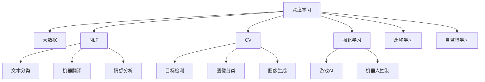
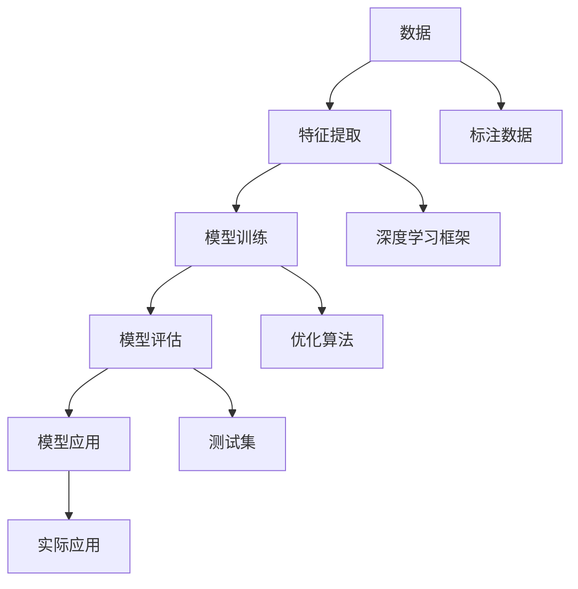

                 

# 李开复：AI 2.0 时代的意义

在过去的几十年里，人工智能（AI）技术经历了从初级到高级的发展，当前我们正处于AI 2.0时代。这个时代的特点是AI技术的深度、广度、复杂性和影响力达到了前所未有的水平。本文将从背景、核心概念与联系、核心算法原理及操作步骤、数学模型与公式推导、项目实践、实际应用场景、工具和资源推荐、总结与展望、附录等方面全面深入地探讨AI 2.0时代的意义。

## 1. 背景介绍

### 1.1 问题的由来

AI的发展经历了几个重要的里程碑：

- **AI 1.0（1950s-1980s）**：这一阶段主要基于规则和符号逻辑，依赖于专家系统，应用领域包括问题解决、专家系统、自然语言理解等。
- **AI 2.0（1990s至今）**：这一阶段引入统计学和机器学习，使用数据驱动的方法，应用领域扩展到图像识别、语音识别、自然语言处理等。
- **AI 3.0（2010s至今）**：这一阶段引入了深度学习和大数据技术，模型更复杂、数据量更大、计算能力更强，应用领域包括自动驾驶、医疗诊断、智能推荐等。

AI 2.0时代的到来，标志着AI技术的成熟和应用范围的广泛扩展。这个时代，AI技术不再局限于学术研究，而是逐步渗透到各行各业，改变了人类社会的运作方式。

### 1.2 问题的核心关键点

AI 2.0时代，人工智能技术快速发展，带来了许多新的概念和关键点，包括但不限于：

- **深度学习**：通过多层神经网络，提取和学习特征，解决非线性问题。
- **大数据**：海量数据的存储、处理和分析，为模型训练提供了丰富的数据基础。
- **自然语言处理（NLP）**：使机器能够理解和生成自然语言，包括文本分类、机器翻译、情感分析等。
- **计算机视觉（CV）**：使机器能够识别和理解图像和视频内容，包括目标检测、图像分类、图像生成等。
- **强化学习**：通过与环境的交互，使机器能够学习最优策略，应用于游戏、机器人等领域。
- **迁移学习**：利用已有知识，加速新任务的训练，适用于数据稀缺、计算资源有限的情况。
- **自监督学习**：利用未标注数据，学习数据的内在结构，避免过拟合，提高模型的泛化能力。

这些关键点相互交织，共同推动了AI 2.0时代的发展，使AI技术从学术研究走向广泛应用。

## 2. 核心概念与联系

### 2.1 核心概念概述

为了更好地理解AI 2.0时代的意义，我们需要先了解几个核心概念及其相互联系：

- **深度学习（Deep Learning）**：通过多层神经网络，自动提取和学习数据特征，广泛应用于图像、语音、自然语言处理等领域。
- **大数据（Big Data）**：指海量、高速、多样化的数据集合，为模型训练提供了丰富的数据基础。
- **自然语言处理（NLP）**：使机器能够理解和生成自然语言，包括文本分类、机器翻译、情感分析等。
- **计算机视觉（CV）**：使机器能够识别和理解图像和视频内容，包括目标检测、图像分类、图像生成等。
- **强化学习（Reinforcement Learning）**：通过与环境的交互，使机器能够学习最优策略，应用于游戏、机器人等领域。
- **迁移学习（Transfer Learning）**：利用已有知识，加速新任务的训练，适用于数据稀缺、计算资源有限的情况。
- **自监督学习（Self-Supervised Learning）**：利用未标注数据，学习数据的内在结构，避免过拟合，提高模型的泛化能力。

这些概念之间的逻辑关系可以通过以下Mermaid流程图来展示：



### 2.2 核心概念原理和架构的 Mermaid 流程图



## 3. 核心算法原理 & 具体操作步骤

### 3.1 算法原理概述

AI 2.0时代，深度学习成为主流。深度学习的核心是多层神经网络，能够自动提取和学习数据特征。深度学习的目标是通过最小化损失函数，优化模型参数，使得模型能够准确地预测输出。常用的深度学习模型包括卷积神经网络（CNN）、循环神经网络（RNN）和变换器（Transformer）等。

### 3.2 算法步骤详解

深度学习的算法步骤通常包括以下几个环节：

1. **数据准备**：收集和预处理训练数据，确保数据质量，包括数据清洗、归一化、分词、标记等。
2. **模型设计**：选择合适的深度学习模型，并进行参数初始化。
3. **模型训练**：使用训练数据，通过反向传播算法，最小化损失函数，更新模型参数。
4. **模型评估**：使用测试集，评估模型性能，包括准确率、召回率、F1-score等。
5. **模型应用**：将训练好的模型应用到实际问题中，进行预测和推理。

### 3.3 算法优缺点

深度学习的优点包括：

- **高精度**：能够处理复杂的非线性问题，具有较高的预测精度。
- **自适应**：能够自动提取和学习数据特征，适用于各种复杂的数据结构。
- **可解释性**：通过可视化技术，可以理解模型内部工作机制。

深度学习的缺点包括：

- **计算资源消耗大**：训练和推理过程中，需要大量的计算资源，如GPU、TPU等。
- **过拟合风险高**：训练数据不足或数据质量差时，容易发生过拟合。
- **可解释性不足**：复杂模型内部的决策过程难以解释，缺乏透明性。

### 3.4 算法应用领域

深度学习在AI 2.0时代得到了广泛应用，覆盖了几乎所有常见领域，例如：

- **计算机视觉**：图像识别、目标检测、图像分类、图像生成等。
- **自然语言处理**：文本分类、机器翻译、情感分析、对话系统等。
- **语音识别**：语音转文本、语音合成、语音识别等。
- **游戏AI**：游戏智能体、策略优化、路径规划等。
- **机器人控制**：运动规划、避障、任务执行等。

## 4. 数学模型和公式 & 详细讲解 & 举例说明

### 4.1 数学模型构建

深度学习的数学模型通常包括输入层、隐藏层和输出层。以CNN为例，模型输入为图像数据，隐藏层包括卷积层、池化层、全连接层等，输出为图像分类结果。

### 4.2 公式推导过程

以CNN为例，假设输入图像大小为$28 \times 28$，卷积核大小为$5 \times 5$，步长为1，填充为0。卷积操作可以表示为：

$$
\text{Conv}(\mathbf{x}, \mathbf{w}) = \max_{i,j} \left(\sum_k x_{i,j}w_{k,i,j}\right)
$$

其中，$\mathbf{x}$为输入图像，$\mathbf{w}$为卷积核，$k$表示卷积核的不同位置。

### 4.3 案例分析与讲解

以图像分类为例，CNN模型的训练过程包括前向传播和反向传播。前向传播将输入图像通过卷积层、池化层、全连接层等计算，输出分类结果。反向传播通过计算梯度，更新模型参数。

## 5. 项目实践：代码实例和详细解释说明

### 5.1 开发环境搭建

在进行深度学习项目开发前，需要先配置好开发环境。以下是使用Python进行TensorFlow开发的流程：

1. 安装Anaconda：从官网下载并安装Anaconda，用于创建独立的Python环境。
2. 创建并激活虚拟环境：
```bash
conda create -n tf-env python=3.8 
conda activate tf-env
```
3. 安装TensorFlow：根据CUDA版本，从官网获取对应的安装命令。例如：
```bash
conda install tensorflow=2.6
```
4. 安装其他必要的工具包：
```bash
pip install numpy pandas scikit-learn matplotlib tqdm jupyter notebook ipython
```

完成上述步骤后，即可在`tf-env`环境中开始深度学习项目开发。

### 5.2 源代码详细实现

下面以图像分类为例，给出使用TensorFlow进行深度学习的PyTorch代码实现。

首先，定义图像分类任务的数据处理函数：

```python
import tensorflow as tf
from tensorflow.keras.preprocessing.image import ImageDataGenerator

class ImageClassifier(tf.keras.Model):
    def __init__(self):
        super(ImageClassifier, self).__init__()
        self.conv1 = tf.keras.layers.Conv2D(32, (3, 3), activation='relu', padding='same')
        self.pool1 = tf.keras.layers.MaxPooling2D((2, 2))
        self.conv2 = tf.keras.layers.Conv2D(64, (3, 3), activation='relu', padding='same')
        self.pool2 = tf.keras.layers.MaxPooling2D((2, 2))
        self.flatten = tf.keras.layers.Flatten()
        self.fc1 = tf.keras.layers.Dense(256, activation='relu')
        self.fc2 = tf.keras.layers.Dense(10, activation='softmax')

    def call(self, x):
        x = self.conv1(x)
        x = self.pool1(x)
        x = self.conv2(x)
        x = self.pool2(x)
        x = self.flatten(x)
        x = self.fc1(x)
        return self.fc2(x)

model = ImageClassifier()

# 定义损失函数和优化器
loss_fn = tf.keras.losses.SparseCategoricalCrossentropy()
optimizer = tf.keras.optimizers.Adam(learning_rate=0.001)
```

然后，定义训练和评估函数：

```python
def train_step(model, images, labels):
    with tf.GradientTape() as tape:
        predictions = model(images)
        loss = loss_fn(labels, predictions)
    gradients = tape.gradient(loss, model.trainable_variables)
    optimizer.apply_gradients(zip(gradients, model.trainable_variables))
    return loss

def evaluate(model, test_images, test_labels):
    predictions = model(test_images)
    labels = tf.argmax(predictions, axis=1)
    accuracy = tf.metrics.sparse_categorical_accuracy(labels, test_labels)
    return accuracy.numpy()[0]
```

最后，启动训练流程并在测试集上评估：

```python
# 加载数据集
train_data = tf.keras.preprocessing.image_dataset_from_directory('train')
test_data = tf.keras.preprocessing.image_dataset_from_directory('test')

# 定义批次大小
batch_size = 32

# 训练模型
for epoch in range(10):
    loss = 0.0
    for images, labels in train_data:
        loss += train_step(model, images, labels)
    loss /= len(train_data)
    print(f'Epoch {epoch+1}, loss: {loss:.4f}')

    accuracy = evaluate(model, test_data)
    print(f'Epoch {epoch+1}, accuracy: {accuracy:.4f}')
```

以上就是使用TensorFlow进行图像分类任务微调的完整代码实现。可以看到，TensorFlow提供了强大的API和工具，使得深度学习模型的构建和训练变得简便高效。

### 5.3 代码解读与分析

让我们再详细解读一下关键代码的实现细节：

**ImageClassifier类**：
- `__init__`方法：定义卷积层、池化层、全连接层等。
- `call`方法：定义模型前向传播过程，返回输出结果。

**训练和评估函数**：
- `train_step`方法：定义模型前向传播、计算损失、反向传播和参数更新。
- `evaluate`方法：定义模型在测试集上的评估过程，计算准确率。

**训练流程**：
- 定义总epoch数，开始循环迭代
- 每个epoch内，循环遍历训练集，计算损失，更新参数
- 每个epoch结束后，在测试集上评估模型性能，输出损失和准确率

可以看到，TensorFlow提供了完整的工具链，使得深度学习模型的开发和训练变得简便高效。开发者可以将更多精力放在数据处理、模型改进等高层逻辑上，而不必过多关注底层的实现细节。

当然，工业级的系统实现还需考虑更多因素，如模型的保存和部署、超参数的自动搜索、更灵活的任务适配层等。但核心的深度学习范式基本与此类似。

## 6. 实际应用场景

### 6.1 智能推荐系统

基于深度学习的智能推荐系统，可以根据用户的历史行为和偏好，推荐符合其兴趣的物品。例如，电商平台的商品推荐、视频网站的影片推荐等。

在技术实现上，可以收集用户浏览、点击、评分等行为数据，提取和用户交互的物品特征。通过构建深度学习模型，预测用户对物品的评分，再根据评分排序，生成推荐列表。深度学习模型能够从复杂数据中提取高层次的特征，提高推荐系统的精度和效果。

### 6.2 医疗诊断

深度学习在医疗领域也有广泛应用。通过图像识别和自然语言处理技术，可以辅助医生进行疾病诊断和治疗决策。例如，通过分析X光片、CT图像，判断病变的类型和位置；通过分析病历和报告，预测患者的病情发展趋势。

在技术实现上，可以使用卷积神经网络（CNN）和循环神经网络（RNN）等深度学习模型，结合医学领域的专家知识和数据，进行病变的识别和分类。深度学习模型可以自动提取图像和文本中的关键信息，辅助医生做出更准确的诊断和治疗决策。

### 6.3 自动驾驶

深度学习在自动驾驶领域也有广泛应用。通过计算机视觉和强化学习技术，可以使无人驾驶车辆具备感知、决策和控制能力。例如，通过图像识别技术，检测交通标志、行人、车辆等，通过预测和决策算法，进行路径规划和避障。

在技术实现上，可以使用卷积神经网络（CNN）和循环神经网络（RNN）等深度学习模型，结合传感器数据和环境信息，进行目标检测和路径规划。深度学习模型能够处理复杂的非线性问题，提高自动驾驶的准确性和安全性。

## 7. 工具和资源推荐

### 7.1 学习资源推荐

为了帮助开发者系统掌握深度学习的理论基础和实践技巧，这里推荐一些优质的学习资源：

1. **《深度学习》（Ian Goodfellow）**：深度学习的经典教材，全面介绍了深度学习的基本原理和应用。
2. **《动手学深度学习》**：深度学习领域的入门教材，包含丰富的代码实现和实验案例。
3. **CS231n《卷积神经网络》**：斯坦福大学开设的深度学习课程，涵盖卷积神经网络的基本原理和应用。
4. **DeepLearning.AI（DL.AI）**：由吴恩达教授创办的深度学习平台，提供丰富的在线课程和实战项目。
5. **Kaggle**：数据科学竞赛平台，提供大量数据集和竞赛项目，有助于实践和提升深度学习技能。

通过对这些资源的学习实践，相信你一定能够快速掌握深度学习的精髓，并用于解决实际的NLP问题。

### 7.2 开发工具推荐

高效的开发离不开优秀的工具支持。以下是几款用于深度学习开发的常用工具：

1. **TensorFlow**：由Google主导开发的开源深度学习框架，生产部署方便，适合大规模工程应用。
2. **PyTorch**：基于Python的开源深度学习框架，灵活动态的计算图，适合快速迭代研究。
3. **JAX**：由Google开发的深度学习框架，支持自动微分和静态计算图，性能优异。
4. **MXNet**：由亚马逊开发的深度学习框架，支持多种语言，分布式训练能力强。
5. **Caffe**：由伯克利大学开发的深度学习框架，适合图像处理任务。

合理利用这些工具，可以显著提升深度学习模型的开发效率，加快创新迭代的步伐。

### 7.3 相关论文推荐

深度学习在AI 2.0时代的发展，得益于学界的持续研究。以下是几篇奠基性的相关论文，推荐阅读：

1. **AlexNet**：ImageNet竞赛中的冠军模型，引入了卷积神经网络（CNN），提升了图像识别的准确率。
2. **ResNet**：通过残差连接，解决了深层神经网络的退化问题，提升了模型的深度和精度。
3. **LSTM**：通过长短期记忆网络（LSTM），提升了序列数据的建模能力，应用于自然语言处理任务。
4. **GPT-3**：由OpenAI发布的语言模型，具有强大的语言生成能力，应用于自然语言处理任务。
5. **AlphaGo**：通过深度学习和强化学习技术，在围棋领域取得突破，展示了AI在复杂博弈中的能力。

这些论文代表了大深度学习的发展脉络。通过学习这些前沿成果，可以帮助研究者把握学科前进方向，激发更多的创新灵感。

## 8. 总结：未来发展趋势与挑战

### 8.1 研究成果总结

AI 2.0时代，深度学习技术取得了长足发展，广泛应用于计算机视觉、自然语言处理、语音识别、游戏AI等领域。深度学习模型的精度、泛化能力和应用范围不断提升，推动了AI技术的普及和应用。

### 8.2 未来发展趋势

展望未来，深度学习技术的发展趋势包括：

1. **模型规模增大**：随着算力成本的下降和数据规模的扩张，深度学习模型的参数量还将持续增长。超大规模模型蕴含的丰富知识，有望支撑更加复杂多变的应用场景。
2. **模型结构优化**：随着模型结构的不断优化，深度学习模型的计算效率和推理速度将进一步提升，减少计算资源的消耗。
3. **跨领域融合**：深度学习技术与自然语言处理、计算机视觉、语音识别等技术的融合，将推动AI技术在更多领域的应用。
4. **隐私保护**：随着数据隐私和安全问题日益突出，如何在保护隐私的前提下进行深度学习模型的训练和应用，将成为重要的研究方向。
5. **可解释性增强**：深度学习模型的可解释性不足，难以理解其内部工作机制，未来需要在模型设计和训练过程中引入可解释性技术。
6. **伦理道德约束**：深度学习模型可能会学习到有害信息，甚至成为恶意用途的工具，如何在模型训练和应用过程中引入伦理道德约束，确保输出的安全性，也将是重要的研究方向。

这些趋势凸显了深度学习技术的广阔前景，推动AI技术在更广泛的应用领域发展。

### 8.3 面临的挑战

尽管深度学习技术在AI 2.0时代取得了显著成就，但在迈向更加智能化、普适化应用的过程中，仍面临诸多挑战：

1. **计算资源消耗大**：深度学习模型的训练和推理过程中，需要大量的计算资源，如GPU、TPU等。如何降低计算资源消耗，提高计算效率，仍需不断探索。
2. **过拟合风险高**：深度学习模型在训练数据不足或数据质量差时，容易发生过拟合。如何提高模型的泛化能力，降低过拟合风险，是重要的研究方向。
3. **可解释性不足**：深度学习模型内部的决策过程难以解释，缺乏透明性。如何在保护隐私的前提下，提高模型的可解释性，也将是重要的研究方向。
4. **伦理道德约束**：深度学习模型可能会学习到有害信息，甚至成为恶意用途的工具。如何在模型训练和应用过程中引入伦理道德约束，确保输出的安全性，也将是重要的研究方向。

这些挑战需要研究者和开发者共同努力，通过多学科交叉合作，解决深度学习技术的难题。

### 8.4 研究展望

面对深度学习技术面临的挑战，未来的研究需要在以下几个方面寻求新的突破：

1. **引入自监督学习**：利用未标注数据，学习数据的内在结构，避免过拟合，提高模型的泛化能力。
2. **开发可解释性模型**：引入可解释性技术，如可视化、注意力机制等，增强模型的透明性和可理解性。
3. **引入伦理道德约束**：在模型训练和应用过程中引入伦理道德约束，确保输出的安全性，保障数据隐私和安全。
4. **跨领域融合**：深度学习技术与自然语言处理、计算机视觉、语音识别等技术的融合，推动AI技术在更多领域的应用。
5. **大规模模型训练**：优化深度学习模型的训练过程，提高计算效率，降低计算资源消耗，实现大规模模型训练。

这些研究方向将推动深度学习技术的发展，解决实际应用中的问题，推动AI技术的普及和应用。

## 9. 附录：常见问题与解答

**Q1：深度学习模型是否适用于所有NLP任务？**

A: 深度学习模型在大多数NLP任务上都能取得不错的效果，特别是对于数据量较大的任务。但对于一些特定领域的任务，如医学、法律等，仅仅依靠通用语料预训练的模型可能难以很好地适应。此时需要在特定领域语料上进一步预训练，再进行微调，才能获得理想效果。此外，对于一些需要时效性、个性化很强的任务，如对话、推荐等，深度学习模型也需要针对性的改进优化。

**Q2：深度学习模型如何处理小样本数据？**

A: 深度学习模型在小样本数据上往往容易发生过拟合。为避免过拟合，可以采用以下策略：
1. 数据增强：通过回译、近义替换等方式扩充训练集。
2. 正则化：使用L2正则、Dropout、Early Stopping等避免过拟合。
3. 参数高效微调：只调整少量参数，固定大部分预训练参数，减少过拟合风险。
4. 集成学习：训练多个模型，取平均输出，抑制过拟合。

这些策略往往需要根据具体任务和数据特点进行灵活组合。只有在数据、模型、训练、推理等各环节进行全面优化，才能最大限度地发挥深度学习模型的威力。

**Q3：深度学习模型在实际应用中需要注意哪些问题？**

A: 将深度学习模型转化为实际应用，还需要考虑以下因素：
1. 模型裁剪：去除不必要的层和参数，减小模型尺寸，加快推理速度。
2. 量化加速：将浮点模型转为定点模型，压缩存储空间，提高计算效率。
3. 服务化封装：将模型封装为标准化服务接口，便于集成调用。
4. 弹性伸缩：根据请求流量动态调整资源配置，平衡服务质量和成本。
5. 监控告警：实时采集系统指标，设置异常告警阈值，确保服务稳定性。
6. 安全防护：采用访问鉴权、数据脱敏等措施，保障数据和模型安全。

深度学习模型在实际应用中需要考虑更多因素，如模型的优化、部署、监控和保护，确保系统稳定性和安全性。

---

作者：禅与计算机程序设计艺术 / Zen and the Art of Computer Programming

