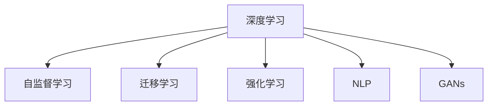
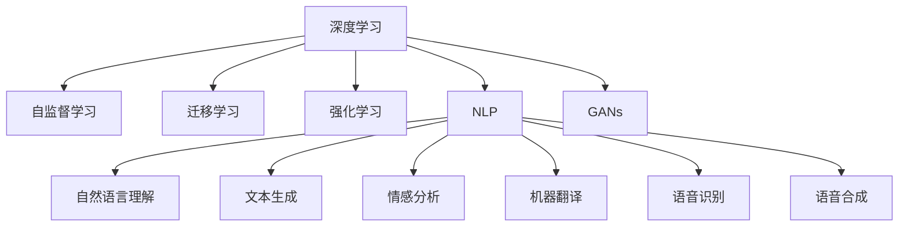
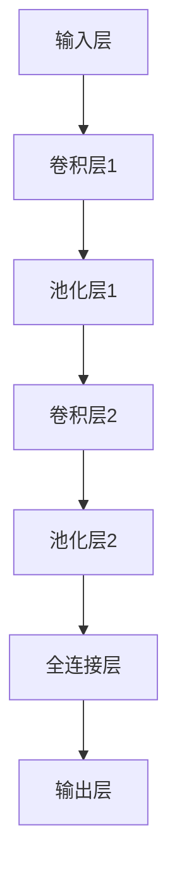

                 

# 李开复：AI 2.0 时代的投资价值

## 1. 背景介绍

### 1.1 问题由来
AI 2.0时代已经到来，这是一个全方位、深层次的变革期，其内涵远超过去几十年AI发展的广度和深度。我们正处于一个数据、算法、计算资源和应用场景高度发展的历史节点。在AI 2.0时代，AI不仅仅是一个技术工具，更是一种全新的思维方式和商业模型，能够极大地影响各个行业。

### 1.2 问题核心关键点
理解AI 2.0时代的投资价值，需要把握以下几个核心关键点：
1. AI 2.0 的突破点在于深度学习和数据量的指数级增长，使得AI在图像、语音、自然语言处理等领域达到新的高度。
2. AI 2.0 时代的AI不再只是技术的简单堆砌，而是具有自主学习能力的系统，能够自适应新数据和新场景。
3. AI 2.0 带来的商业变革，不仅仅是自动化的优化，更在于新的商业模型和业务流程的创新，如推荐系统、智能客服、智能制造等。
4. AI 2.0 时代的AI技术和应用发展迅猛，但是否能够长期持续增长、保持竞争优势，需要深入分析其背后的驱动因素和市场竞争格局。

## 2. 核心概念与联系

### 2.1 核心概念概述

AI 2.0时代的核心概念包括以下几个：

- **深度学习(Deep Learning)**：一种通过多层次神经网络实现的模式识别和学习算法，擅长处理非结构化数据，如图像、声音、文本等。
- **自监督学习(Self-Supervised Learning)**：利用未标记数据进行模型训练，提升模型的泛化能力。
- **迁移学习(Transfer Learning)**：将一个领域学到的知识迁移到另一个领域，提高模型在新场景下的适应性。
- **强化学习(Reinforcement Learning)**：通过与环境的交互，使智能体学习最优策略以达到特定目标。
- **自然语言处理(Natural Language Processing, NLP)**：使计算机能够理解、处理和生成自然语言，实现人机交互。
- **生成对抗网络(GANs, Generative Adversarial Networks)**：通过两个网络的对抗训练，生成具有真实感的图像、音频等数据。

这些核心概念之间的逻辑关系可以通过以下Mermaid流程图来展示：



这个流程图展示了大语言模型的核心概念及其之间的关系：

1. 深度学习作为基础，通过自监督学习提高模型泛化能力。
2. 迁移学习可以将特定领域的经验迁移到新场景。
3. 强化学习利用实时反馈，训练最优策略。
4. NLP结合语言学和计算机科学，实现自然语言处理。
5. GANs生成高质量数据，支持更多类型的学习任务。

这些概念共同构成了AI 2.0时代的技术基础，为人工智能的发展提供了坚实的理论支撑。

### 2.2 核心概念原理和架构的 Mermaid 流程图



此流程图进一步细化了NLP的核心应用，展示了深度学习在各子领域的具体应用：

1. **自然语言理解(NLU)**：理解文本内容，包括命名实体识别、句法分析等。
2. **文本生成**：如自动摘要、对话生成等。
3. **情感分析**：分析文本中的情感倾向。
4. **机器翻译**：将一种语言翻译成另一种语言。
5. **语音识别**：将语音转换为文本。
6. **语音合成**：将文本转换为语音。

这些子领域共同推动了NLP技术的不断发展，使得机器能够更加自然地与人类进行交互。

## 3. 核心算法原理 & 具体操作步骤

### 3.1 算法原理概述

AI 2.0时代的算法原理主要包括：

1. **深度学习算法**：如卷积神经网络(CNNs)、循环神经网络(RNNs)、长短期记忆网络(LSTMs)、Transformer等。
2. **自监督学习算法**：如自编码器(AEs)、变分自编码器(VAEs)、对比学习(Contrastive Learning)等。
3. **迁移学习算法**：如微调(Fine-Tuning)、多任务学习(Multi-Task Learning)等。
4. **强化学习算法**：如Q-learning、策略梯度(SPG)、深度强化学习(DRL)等。
5. **自然语言处理算法**：如词向量模型(Word Embeddings)、序列到序列模型(Seq2Seq)、注意力机制(Attention Mechanism)等。

这些算法在实际应用中往往相互结合，形成复杂的技术体系。以Transformer为例，其结合了深度学习和自注意力机制，广泛应用于自然语言处理领域。

### 3.2 算法步骤详解

AI 2.0时代的大语言模型微调步骤：

1. **数据预处理**：收集、清洗和标注数据，划分训练集、验证集和测试集。
2. **模型选择与初始化**：选择预训练模型(如BERT、GPT等)，并进行参数初始化。
3. **模型微调**：在标注数据集上训练模型，使用优化器(如AdamW)进行参数更新。
4. **模型评估与调优**：在验证集上评估模型性能，使用早停法(Early Stopping)防止过拟合。
5. **模型部署与应用**：将微调后的模型部署到生产环境中，进行实际应用。

### 3.3 算法优缺点

AI 2.0时代的算法具有以下优点：

1. **高泛化能力**：深度学习模型具有强大的泛化能力，可以适应各种复杂场景。
2. **高效优化**：自监督学习和迁移学习能够利用少量标注数据高效训练模型。
3. **智能决策**：强化学习模型通过与环境交互，进行自主决策。

然而，也存在以下缺点：

1. **数据依赖**：深度学习模型需要大量高质量标注数据进行训练。
2. **模型复杂性**：深度学习模型参数量大，训练时间长。
3. **鲁棒性差**：对抗样本可能使模型输出不稳定。
4. **可解释性不足**：深度学习模型的决策过程难以解释，缺乏透明性。

### 3.4 算法应用领域

AI 2.0时代的算法在以下领域有广泛应用：

- **自然语言处理**：自动摘要、机器翻译、问答系统、情感分析等。
- **计算机视觉**：图像分类、目标检测、图像生成、语义分割等。
- **语音识别与合成**：自动语音识别、语音生成、语音转换等。
- **智能制造**：工业机器人控制、设备监测、供应链优化等。
- **金融科技**：风险评估、信用评分、量化交易等。
- **医疗健康**：病历分析、影像诊断、药物研发等。
- **智能家居**：智能音箱、智能安防、智能家电等。

这些领域的应用展示了AI 2.0时代的广泛性和深度。

## 4. 数学模型和公式 & 详细讲解 & 举例说明

### 4.1 数学模型构建

AI 2.0时代的主要数学模型包括：

1. **卷积神经网络(CNN)**：应用于图像处理任务，结构为多个卷积层和池化层，提取局部特征。
2. **循环神经网络(RNN)**：应用于序列数据处理任务，结构为循环连接的神经元，能够捕捉序列的上下文信息。
3. **长短期记忆网络(LSTM)**：一种特殊的RNN，能够解决梯度消失和梯度爆炸问题，适用于长时间序列数据的处理。
4. **Transformer**：一种基于自注意力机制的神经网络，用于自然语言处理任务，能够捕捉文本中的全局语义信息。
5. **自编码器(AEs)**：一种无监督学习算法，用于降维和特征提取。
6. **生成对抗网络(GANs)**：由生成器和判别器两个网络构成，通过对抗训练生成高质量数据。

### 4.2 公式推导过程

以Transformer模型为例，其自注意力机制的公式推导如下：

$$
\text{Attention}(Q,K,V) = \text{Softmax}(\frac{QK^T}{\sqrt{d_k}})V
$$

其中，$Q$、$K$、$V$分别为查询向量、键向量和值向量，$d_k$为键向量的维度。该公式的推导过程可以参考相关文献或网络教程。

### 4.3 案例分析与讲解

以图像分类为例，使用CNN模型进行分类任务，其结构如图：



CNN模型通过多层卷积和池化操作提取图像特征，最终经过全连接层和softmax函数进行分类输出。

## 5. 项目实践：代码实例和详细解释说明

### 5.1 开发环境搭建

以下是使用Python进行TensorFlow开发的环境配置流程：

1. 安装Anaconda：从官网下载并安装Anaconda，用于创建独立的Python环境。
2. 创建并激活虚拟环境：
```bash
conda create -n tf-env python=3.8 
conda activate tf-env
```
3. 安装TensorFlow：根据CUDA版本，从官网获取对应的安装命令。例如：
```bash
conda install tensorflow -c tf -c conda-forge
```
4. 安装相关工具包：
```bash
pip install numpy pandas scikit-learn matplotlib tqdm jupyter notebook ipython
```
5. 安装Transformer库：
```bash
pip install transformers
```
6. 安装Weights & Biases：
```bash
pip install weights-and-biases-nightly
```

### 5.2 源代码详细实现

以下是一个使用TensorFlow进行图像分类任务的代码实现：

```python
import tensorflow as tf
from tensorflow.keras import layers

# 定义模型结构
model = tf.keras.Sequential([
    layers.Conv2D(32, (3, 3), activation='relu', input_shape=(28, 28, 1)),
    layers.MaxPooling2D((2, 2)),
    layers.Conv2D(64, (3, 3), activation='relu'),
    layers.MaxPooling2D((2, 2)),
    layers.Flatten(),
    layers.Dense(64, activation='relu'),
    layers.Dense(10, activation='softmax')
])

# 编译模型
model.compile(optimizer='adam',
              loss='sparse_categorical_crossentropy',
              metrics=['accuracy'])

# 加载数据集
(x_train, y_train), (x_test, y_test) = tf.keras.datasets.mnist.load_data()
x_train = x_train.reshape(-1, 28, 28, 1) / 255.0
x_test = x_test.reshape(-1, 28, 28, 1) / 255.0

# 训练模型
model.fit(x_train, y_train, epochs=10, validation_data=(x_test, y_test))

# 评估模型
model.evaluate(x_test, y_test)
```

### 5.3 代码解读与分析

让我们再详细解读一下关键代码的实现细节：

**Sequential模型**：
- `Sequential`类用于创建顺序连接的神经网络模型，按照顺序添加卷积层、池化层、全连接层和输出层。
- 每个层的参数通过`layers`模块配置，包括卷积核大小、激活函数、输入形状等。

**编译模型**：
- 使用`compile`方法设置优化器、损失函数和评估指标，如Adam优化器、交叉熵损失函数和准确率评估指标。

**加载数据集**：
- 使用`tf.keras.datasets.mnist.load_data`加载MNIST数据集，将其转换为4D张量，并进行归一化处理。

**训练模型**：
- 使用`fit`方法训练模型，指定训练集和验证集，设置迭代轮数。
- 在每个epoch结束时，计算训练集和验证集上的损失和准确率。

**评估模型**：
- 使用`evaluate`方法评估模型在测试集上的性能，返回损失和准确率。

## 6. 实际应用场景

### 6.1 智能客服系统

基于AI 2.0时代的深度学习和自然语言处理技术，智能客服系统能够自动理解用户意图，快速响应问题，并提供精准的答案。智能客服系统具有以下优势：

1. **全天候服务**：不受时间和地域限制，提高服务效率。
2. **高准确率**：通过深度学习和迁移学习，系统能够快速适应新问题，提高回答准确率。
3. **个性化服务**：通过用户交互数据，系统能够学习用户偏好，提供个性化的服务体验。
4. **降低成本**：减少人力成本，提高运营效率。

### 6.2 金融科技

AI 2.0时代的AI技术在金融科技领域具有广泛应用，如信用评分、量化交易、风险评估等。AI 2.0技术帮助金融企业实现智能化转型，提高业务效率和风险控制能力。具体应用如下：

1. **信用评分**：通过分析用户的历史行为数据，智能评分模型能够准确评估用户的信用风险。
2. **量化交易**：使用机器学习算法进行高频交易，提高交易效率和收益。
3. **风险评估**：通过分析市场数据和用户行为数据，智能评估模型的风险敞口，降低损失。

### 6.3 医疗健康

AI 2.0时代的AI技术在医疗健康领域也有广泛应用，如影像诊断、病历分析、药物研发等。AI 2.0技术帮助医疗机构实现智能化转型，提高诊疗效率和诊断准确率。具体应用如下：

1. **影像诊断**：使用深度学习算法分析医学影像，快速诊断疾病。
2. **病历分析**：通过自然语言处理技术，自动分析病历数据，提取关键信息。
3. **药物研发**：使用深度学习算法预测药物效果和副作用，加速新药研发。

## 7. 工具和资源推荐

### 7.1 学习资源推荐

为了帮助开发者系统掌握AI 2.0时代的深度学习理论基础和实践技巧，这里推荐一些优质的学习资源：

1. **《深度学习》系列课程**：由李开复教授领衔，涵盖了深度学习的理论基础、实践技巧和最新研究进展。
2. **《TensorFlow 2.0实战》书籍**：详细介绍TensorFlow 2.0的使用技巧和实践案例，是TensorFlow开发者的必备资料。
3. **《自然语言处理综述》论文**：由斯坦福大学李飞飞教授领衔，全面综述了自然语言处理领域的最新进展和技术趋势。
4. **《AI 2.0》系列报告**：由OpenAI发布，探讨了AI 2.0时代的技术发展方向和应用前景。

通过对这些资源的学习实践，相信你一定能够快速掌握AI 2.0时代的深度学习技术和应用，并将其应用于实际开发中。

### 7.2 开发工具推荐

高效的开发离不开优秀的工具支持。以下是几款用于深度学习和AI 2.0开发的常用工具：

1. **TensorFlow**：由Google主导开发的开源深度学习框架，支持多种编程语言和硬件平台，生产部署方便。
2. **PyTorch**：由Facebook主导开发的开源深度学习框架，灵活动态的计算图，适合快速迭代研究。
3. **Jupyter Notebook**：用于数据科学和机器学习的交互式编程环境，支持Python、R等多种编程语言。
4. **Weights & Biases**：用于模型训练的实验跟踪工具，可以记录和可视化模型训练过程中的各项指标。
5. **TensorBoard**：TensorFlow配套的可视化工具，可实时监测模型训练状态，并提供丰富的图表呈现方式。

合理利用这些工具，可以显著提升深度学习和AI 2.0任务的开发效率，加快创新迭代的步伐。

### 7.3 相关论文推荐

AI 2.0时代的AI技术发展迅速，以下是几篇奠基性的相关论文，推荐阅读：

1. **ImageNet大规模视觉识别挑战赛（ILSVRC）**：展示了深度学习在图像识别领域的应用潜力，推动了深度学习技术的发展。
2. **AlphaGo与围棋挑战赛**：展示了深度强化学习在复杂决策问题中的应用，推动了AI技术在智能游戏中的应用。
3. **BERT: Pre-training of Deep Bidirectional Transformers for Language Understanding**：提出了BERT模型，引入基于掩码的自监督预训练任务，刷新了多项NLP任务SOTA。
4. **GPT-3: Language Models are Unsupervised Multitask Learners**：展示了深度学习模型在无监督和少样本学习中的强大能力，推动了AI技术在自然语言处理中的应用。

这些论文代表了大语言模型微调技术的发展脉络。通过学习这些前沿成果，可以帮助研究者把握学科前进方向，激发更多的创新灵感。

## 8. 总结：未来发展趋势与挑战

### 8.1 研究成果总结

AI 2.0时代的深度学习技术在多个领域取得了显著进展，从图像、语音、自然语言处理到医疗、金融、制造等多个垂直行业，深度学习技术的应用范围和深度不断拓展。

### 8.2 未来发展趋势

展望未来，AI 2.0时代的深度学习技术将呈现以下几个发展趋势：

1. **模型规模持续增大**：随着算力成本的下降和数据规模的扩张，深度学习模型的参数量还将持续增长，模型复杂度不断提升。
2. **模型泛化能力增强**：通过自监督学习和迁移学习，深度学习模型能够更好地适应新场景和数据分布。
3. **实时性提升**：通过模型压缩、量化加速等技术，深度学习模型能够在实时性要求更高的场景中得到应用。
4. **跨领域融合**：深度学习技术与传统学科的融合，如计算机视觉与机器人技术、自然语言处理与智能客服等。
5. **伦理和社会影响**：AI 2.0时代需要更加关注AI技术的伦理和社会影响，如隐私保护、公平性、透明度等。

### 8.3 面临的挑战

尽管AI 2.0时代的深度学习技术取得了瞩目成就，但在迈向更加智能化、普适化应用的过程中，仍面临以下挑战：

1. **数据质量和多样性**：深度学习模型的训练需要高质量、多样化的数据，但现实中的数据往往存在噪声、偏差等问题。
2. **模型复杂性**：深度学习模型参数量大，训练复杂度高，资源消耗大。
3. **模型鲁棒性**：深度学习模型在对抗样本和噪声干扰下，表现不稳定。
4. **可解释性**：深度学习模型的决策过程难以解释，缺乏透明性，需要开发更多可解释性强的模型。

### 8.4 研究展望

未来，AI 2.0时代的深度学习技术需要在以下几个方向进行深入研究：

1. **无监督学习和自监督学习**：探索更多无监督和自监督学习方法，降低对标注数据的依赖。
2. **跨领域迁移学习**：研究跨领域迁移学习的理论和技术，提升模型的通用性和泛化能力。
3. **模型压缩和量化**：开发更高效的模型压缩和量化技术，提高模型的实时性和资源利用率。
4. **可解释性和透明性**：开发更多可解释性强的深度学习模型，提升系统的透明度和可理解性。
5. **伦理和社会影响**：研究AI技术的伦理和社会影响，制定相关法规和标准，确保AI技术的公平性和安全性。

这些研究方向和创新将推动AI 2.0时代的技术发展，为AI技术的广泛应用提供坚实的基础。

## 9. 附录：常见问题与解答

**Q1：AI 2.0时代的深度学习技术是否具有通用性？**

A: AI 2.0时代的深度学习技术在不同领域有广泛应用，但具有一定局限性。例如，在医学领域，深度学习模型需要经过专门的训练和验证，才能达到实际应用的效果。

**Q2：AI 2.0时代的深度学习技术是否容易过拟合？**

A: AI 2.0时代的深度学习模型具有强大的泛化能力，但过拟合问题仍然存在。常见解决方法包括数据增强、正则化、早停法等。

**Q3：AI 2.0时代的深度学习技术是否需要大量计算资源？**

A: AI 2.0时代的深度学习模型参数量大，需要高性能的计算资源进行训练和推理。通过模型压缩、量化加速等技术，可以降低资源消耗。

**Q4：AI 2.0时代的深度学习技术是否存在伦理和社会问题？**

A: AI 2.0时代的深度学习技术需要关注伦理和社会问题，如隐私保护、公平性、透明度等。研究和制定相关法规和标准，确保技术的安全性和公平性。

**Q5：AI 2.0时代的深度学习技术是否需要大量标注数据？**

A: AI 2.0时代的深度学习技术可以通过自监督学习和迁移学习等方法，在少量标注数据上进行训练。例如，BERT模型就是通过自监督预训练任务获得良好表现。

通过对这些问题的解答，相信你能够更好地理解AI 2.0时代的深度学习技术，并为其未来的发展提供更多思考和见解。

---

作者：禅与计算机程序设计艺术 / Zen and the Art of Computer Programming

