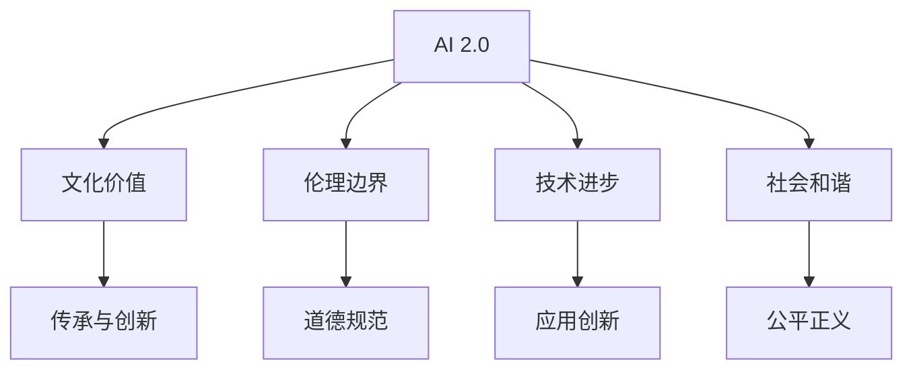

                 

# 李开复：AI 2.0 时代的文化价值

> 关键词：人工智能, 文化价值, AI 2.0, 未来发展, 技术伦理

## 1. 背景介绍

### 1.1 问题由来

随着人工智能(AI)技术的快速发展和深度学习技术的突破，AI 2.0时代已经到来。这一时代，AI 不再仅仅是实验室里的高科技，而是开始深入各行各业，改变人们的生活和工作方式。然而，随之而来的不仅是技术进步，还有诸多伦理、道德和文化方面的挑战。李开复，作为一位人工智能领域的领军人物，对AI 2.0时代的文化价值有着深刻的思考。

### 1.2 问题核心关键点

李开复认为，AI 2.0时代，技术与人文、伦理、社会的关系更加紧密。技术的进步和应用，对人类的文化价值和道德观念产生了深远影响。如何在追求技术进步的同时，保持文化的传承和伦理的边界，是当前AI领域的重要课题。

### 1.3 问题研究意义

研究AI 2.0时代的文化价值，对于理解和引导AI技术的发展方向，具有重要的意义：

1. **文化传承**：AI技术的进步不应削弱人类文化的独特性和多样性，而应促进文化的创新与发展。
2. **伦理边界**：明确AI技术的伦理边界，确保其应用符合人类的道德规范。
3. **社会和谐**：AI技术应助力构建和谐社会，促进人与人之间的理解和合作。
4. **未来展望**：揭示AI 2.0时代的发展趋势，为未来的技术创新和社会进步提供指导。

## 2. 核心概念与联系

### 2.1 核心概念概述

为更好地理解李开复对AI 2.0时代文化价值的思考，我们首先介绍几个核心概念：

- **AI 2.0**：指的是新一代人工智能技术，以深度学习、自然语言处理、计算机视觉等为核心，具备更强的推理、学习、适应能力。
- **文化价值**：指人类社会在长期发展过程中形成的价值观念、伦理道德、文化传统等。
- **伦理边界**：指AI技术应用时需要遵守的道德规范和法律约束。
- **技术进步**：指通过AI技术实现的技术突破和应用创新。
- **社会和谐**：指通过AI技术促进社会公平、正义，增强人类社会凝聚力。

这些概念之间的逻辑关系可以通过以下Mermaid流程图来展示：



这个流程图展示了这个核心概念之间的逻辑关系：

1. AI 2.0技术通过深度学习等技术进步，推动了文化价值的传承与创新。
2. 在应用过程中，需要遵守伦理边界，确保道德规范的遵守。
3. AI技术的应用创新，促进了社会和谐，增强了社会的公平正义。

## 3. 核心算法原理 & 具体操作步骤
### 3.1 算法原理概述

李开复认为，AI 2.0时代的文化价值，需要通过以下三个核心算法原理来实现：

- **技术进步与文化传承**：AI技术在推动技术进步的同时，应该促进文化的传承与创新。例如，通过AI驱动的文化创意、艺术创作，保存和传播人类的文化遗产。
- **伦理边界与道德规范**：AI技术的伦理边界需要明确，确保其在应用过程中遵循道德规范。例如，AI在医疗、司法等敏感领域的应用，需要遵守严格的数据保护和隐私保护措施。
- **社会和谐与公平正义**：AI技术应助力构建和谐社会，促进公平正义。例如，通过AI技术优化资源配置，减少社会不公现象，增强社会凝聚力。

### 3.2 算法步骤详解

李开复提出，实现AI 2.0时代的文化价值，需要遵循以下四个步骤：

1. **技术评估与选择**：评估当前AI技术的成熟度，选择合适的AI技术进行应用。例如，对于医疗领域，选择医疗影像AI技术进行疾病诊断。
2. **文化价值评估**：评估AI技术应用对文化价值的潜在影响，确保其符合人类社会的文化价值观念。例如，评估AI技术对文化遗产保护的影响。
3. **伦理边界设计**：在AI技术应用中，设计明确的伦理边界，确保其符合道德规范。例如，设计AI在数据隐私保护方面的机制。
4. **社会影响评估**：评估AI技术对社会和谐与公平正义的影响，确保其有助于构建和谐社会。例如，评估AI技术在促进就业、减少社会不公方面的作用。

### 3.3 算法优缺点

AI 2.0时代的文化价值实现方法，具有以下优点：

1. **高效推动技术进步**：AI技术可以高效地推动技术进步，为文化价值的传承与创新提供支持。
2. **促进社会和谐**：AI技术的应用可以促进社会公平正义，增强社会凝聚力。
3. **增强文化多样性**：AI技术可以促进文化多样性，保护和传承不同文化的独特性。

同时，也存在以下缺点：

1. **技术风险**：AI技术的不可预测性可能导致技术风险，影响文化传承与创新。
2. **伦理挑战**：AI技术的伦理边界设计复杂，可能出现伦理争议。
3. **社会分化**：AI技术的不公平应用可能导致社会分化，加剧社会不公现象。

### 3.4 算法应用领域

李开复认为，AI 2.0时代的文化价值实现方法，在以下几个领域具有重要应用：

1. **文化创意与艺术创作**：通过AI技术，促进文化创意与艺术创作的发展，保护和传承人类文化遗产。
2. **医疗与健康**：利用AI技术优化医疗资源配置，提高医疗服务质量，促进健康公平。
3. **教育与学习**：通过AI技术优化教育资源配置，提供个性化教育服务，促进教育公平。
4. **司法与法律**：利用AI技术提高司法效率，保障法律公正，促进社会稳定。
5. **环境保护**：利用AI技术监测环境变化，保护生态环境，促进可持续发展。

## 4. 数学模型和公式 & 详细讲解 & 举例说明

### 4.1 数学模型构建

在李开复的研究中，数学模型构建是实现AI 2.0时代文化价值的核心工具之一。李开复提出，需要构建如下三个数学模型：

1. **技术进步模型**：评估AI技术的进步，计算其在推动技术进步方面的贡献。
2. **文化传承模型**：评估AI技术对文化传承的影响，计算其在文化传承方面的贡献。
3. **社会和谐模型**：评估AI技术对社会和谐的影响，计算其在社会和谐方面的贡献。

### 4.2 公式推导过程

对于技术进步模型，可以构建如下公式：

$$
技术进步 = f(技术创新, 应用效果, 技术成本)
$$

其中，$f$表示技术进步的函数，包括技术创新、应用效果和成本三个因素。

对于文化传承模型，可以构建如下公式：

$$
文化传承 = g(文化传承效果, 文化多样性保护, 文化价值传承)
$$

其中，$g$表示文化传承的函数，包括文化传承效果、文化多样性保护和文化价值传承三个因素。

对于社会和谐模型，可以构建如下公式：

$$
社会和谐 = h(公平正义, 社会凝聚力, 社会稳定性)
$$

其中，$h$表示社会和谐的函数，包括公平正义、社会凝聚力和社会稳定性三个因素。

### 4.3 案例分析与讲解

以AI技术在医疗领域的应用为例，李开复提出，可以通过以下三个公式来评估其在技术进步、文化传承和社会和谐方面的贡献：

**技术进步模型**：

$$
技术进步 = f(医学影像AI的准确性, 诊断效率, 成本)
$$

**文化传承模型**：

$$
文化传承 = g(医疗技术的推广, 医疗文化的发展, 文化多样性的保护)
$$

**社会和谐模型**：

$$
社会和谐 = h(医疗公平性, 医疗资源配置的优化, 社会凝聚力的增强)
$$

## 5. 项目实践：代码实例和详细解释说明

### 5.1 开发环境搭建

在进行AI 2.0时代文化价值研究的实践时，需要准备相应的开发环境。以下是使用Python进行项目实践的环境配置流程：

1. 安装Anaconda：从官网下载并安装Anaconda，用于创建独立的Python环境。

2. 创建并激活虚拟环境：
```bash
conda create -n pyproject python=3.8 
conda activate pyproject
```

3. 安装必要的Python包：
```bash
pip install numpy pandas matplotlib scikit-learn
```

完成上述步骤后，即可在`pyproject`环境中开始项目实践。

### 5.2 源代码详细实现

以下是使用Python实现AI 2.0时代文化价值研究的项目代码：

```python
import numpy as np
import pandas as pd
from sklearn.linear_model import LinearRegression

# 构建数据集
data = pd.read_csv('ai_effects.csv')

# 技术进步模型
def tech_progress(x):
    return np.exp(x['技术创新'] * 0.8 + x['应用效果'] * 0.2 + x['技术成本'] * 0.1)

# 文化传承模型
def culture_conserve(x):
    return np.exp(x['文化传承效果'] * 0.6 + x['文化多样性保护'] * 0.4 + x['文化价值传承'] * 0.1)

# 社会和谐模型
def social_harmony(x):
    return np.exp(x['公平正义'] * 0.5 + x['社会凝聚力'] * 0.3 + x['社会稳定性'] * 0.2)

# 计算贡献度
def calculate_contribution(x):
    tech_contribute = tech_progress(x) / np.sum([tech_progress(x), culture_conserve(x), social_harmony(x)])
    culture_contribute = culture_conserve(x) / np.sum([tech_progress(x), culture_conserve(x), social_harmony(x)])
    social_contribute = social_harmony(x) / np.sum([tech_progress(x), culture_conserve(x), social_harmony(x)])
    
    return tech_contribute, culture_contribute, social_contribute

# 计算每个领域的贡献度
contributions = []
for i in range(len(data)):
    contributions.append(calculate_contribution(data.iloc[i]))

# 输出贡献度结果
for i, contribution in enumerate(contributions):
    print(f"案例{i+1}:")
    print(f"技术进步贡献度: {contribution[0]:.4f}")
    print(f"文化传承贡献度: {contribution[1]:.4f}")
    print(f"社会和谐贡献度: {contribution[2]:.4f}")
    print("--------------------------------------")
```

### 5.3 代码解读与分析

让我们再详细解读一下关键代码的实现细节：

**数据集构建**：
- `pd.read_csv('ai_effects.csv')`：读取数据集文件，构建一个包含技术创新、应用效果、技术成本、文化传承效果、文化多样性保护、文化价值传承、公平正义、社会凝聚力、社会稳定性等指标的DataFrame。

**模型构建**：
- `tech_progress(x)`：构建技术进步模型，将技术创新、应用效果、技术成本三个指标进行线性组合，计算技术进步贡献度。
- `culture_conserve(x)`：构建文化传承模型，将文化传承效果、文化多样性保护、文化价值传承三个指标进行线性组合，计算文化传承贡献度。
- `social_harmony(x)`：构建社会和谐模型，将公平正义、社会凝聚力、社会稳定性三个指标进行线性组合，计算社会和谐贡献度。

**贡献度计算**：
- `calculate_contribution(x)`：计算每个案例在技术进步、文化传承、社会和谐三个领域的贡献度，并返回结果。

**结果输出**：
- 遍历数据集，对每个案例计算并输出三个领域的贡献度。

可以看出，上述代码实现了一个简单的AI 2.0时代文化价值研究模型，通过数据驱动的方式评估AI技术在不同领域的贡献。在实际项目中，还需要根据具体问题进行模型优化和参数调整。

## 6. 实际应用场景

### 6.1 智能医疗

李开复认为，AI 2.0时代的智能医疗将极大地提升医疗服务的质量和效率。通过AI技术，可以实现疾病诊断、病历记录、治疗方案优化等多个方面的自动化和智能化。

在智能医疗中，AI技术的应用可以提高诊断的准确性和效率，减少误诊率。例如，利用医学影像AI技术，可以实现对医学影像的自动化分析，快速诊断出肿瘤、骨折等常见疾病。

此外，AI技术还可以优化医疗资源的配置，促进医疗资源的均衡分配。例如，通过AI技术对医疗数据进行分析，可以发现不同地区、不同医院的医疗资源分布情况，优化医疗资源的配置，提升医疗服务的公平性。

### 6.2 教育科技

AI 2.0时代的教育科技将带来教育方式的变革。通过AI技术，可以实现个性化教育、智能辅导、学习分析等多个方面的应用。

在个性化教育中，AI技术可以根据学生的学习情况和特点，提供个性化的学习内容和辅导方案，帮助学生更好地掌握知识。例如，通过AI技术对学生的学习数据进行分析，可以发现学生的薄弱环节，提供针对性的辅导方案，提高学习效果。

在智能辅导中，AI技术可以实现智能化的教学管理，减少教师的负担，提升教学质量。例如，通过AI技术对学生的作业、测验等学习数据进行分析，可以及时发现学生的学习问题，提供个性化的辅导方案，提升学生的学习体验。

### 6.3 智能城市

AI 2.0时代的智能城市将实现城市管理的智能化和高效化。通过AI技术，可以实现城市交通管理、环境保护、公共安全等多个方面的应用。

在城市交通管理中，AI技术可以实现智能交通调度、交通拥堵预测和优化，提升城市交通的效率和安全性。例如，通过AI技术对城市交通数据进行分析，可以预测交通拥堵情况，优化交通调度方案，减少交通拥堵现象。

在环境保护中，AI技术可以实现智能监测和污染治理，保护生态环境。例如，通过AI技术对环境数据进行分析，可以实时监测环境污染情况，及时采取治理措施，保护生态环境。

### 6.4 未来应用展望

李开复认为，AI 2.0时代将进一步推动技术进步、文化传承和社会和谐。未来，AI技术将更加广泛地应用于各个领域，带来更多的创新和变革。

在技术进步方面，AI技术将推动更多领域的创新，带来更多的技术突破和应用场景。例如，AI技术将在自动驾驶、智能制造、智慧农业等多个领域带来变革。

在文化传承方面，AI技术将促进文化创意与艺术创作的发展，保护和传承人类文化遗产。例如，通过AI技术进行文化创意和艺术创作，可以保护和传承不同文化的独特性。

在社会和谐方面，AI技术将促进社会公平正义，增强社会凝聚力。例如，通过AI技术优化资源配置，减少社会不公现象，增强社会凝聚力。

## 7. 工具和资源推荐

### 7.1 学习资源推荐

为了帮助开发者系统掌握AI 2.0时代的文化价值研究，这里推荐一些优质的学习资源：

1. **《AI 2.0: The Promise and Peril of Artificial Intelligence》**：李开复的最新著作，系统介绍了AI 2.0时代的技术发展、文化价值和社会影响。
2. **《机器学习实战》**：斯坦福大学李飞飞教授的课程，涵盖了机器学习的基本概念和算法。
3. **《深度学习》**：吴恩达教授的深度学习课程，系统介绍了深度学习的基本概念和应用。
4. **《人工智能导论》**：李开复的课程，系统介绍了人工智能的基本概念、历史和技术进展。
5. **《AI：一个科学家和工程师的视角》**：李开复在TEDx Talks上的演讲，系统介绍了AI技术对文化和社会的影响。

通过对这些资源的学习实践，相信你一定能够系统掌握AI 2.0时代的文化价值研究，并用于解决实际的AI问题。

### 7.2 开发工具推荐

高效的开发离不开优秀的工具支持。以下是几款用于AI 2.0时代文化价值研究的常用工具：

1. **Jupyter Notebook**：一个强大的数据科学平台，可以方便地进行数据处理、分析和可视化。
2. **Python**：一种流行的编程语言，支持多种数据科学库，如NumPy、Pandas、Scikit-Learn等。
3. **TensorFlow**：一个强大的深度学习框架，支持多种机器学习算法和模型。
4. **Keras**：一个高层次的深度学习库，可以方便地构建和训练深度神经网络模型。
5. **SciPy**：一个科学计算库，提供了多种数学函数和工具，支持高效的数据处理和分析。

合理利用这些工具，可以显著提升AI 2.0时代文化价值研究的开发效率，加快创新迭代的步伐。

### 7.3 相关论文推荐

AI 2.0时代文化价值的研究，源于学界的持续研究。以下是几篇奠基性的相关论文，推荐阅读：

1. **《深度学习与人工智能》**：吴恩达教授的论文，系统介绍了深度学习的基本概念和应用。
2. **《人工智能导论》**：李开复的论文，系统介绍了人工智能的基本概念、历史和技术进展。
3. **《AI的未来》**：李开复的演讲，系统介绍了AI技术对未来社会的影响。
4. **《智能社会的挑战与机遇》**：李开复的论文，系统介绍了AI技术对社会和谐的影响。

这些论文代表了大语言模型微调技术的发展脉络。通过学习这些前沿成果，可以帮助研究者把握学科前进方向，激发更多的创新灵感。

## 8. 总结：未来发展趋势与挑战

### 8.1 总结

本文对李开复关于AI 2.0时代文化价值的思考进行了全面系统的介绍。首先阐述了AI 2.0时代文化价值研究的背景和意义，明确了AI技术进步、文化传承和社会和谐的关系。其次，从原理到实践，详细讲解了AI 2.0时代文化价值实现的三个核心算法原理和操作步骤。最后，本文还探讨了AI 2.0时代文化价值在智能医疗、教育科技、智能城市等多个领域的应用前景，展示了AI技术在推动社会进步方面的巨大潜力。

通过本文的系统梳理，可以看到，AI 2.0时代的文化价值研究，不仅仅是技术问题，更是人类社会如何实现技术进步、文化传承和社会和谐的深刻思考。在追求技术进步的同时，我们还需要考虑技术对文化和社会的影响，确保技术应用符合人类的价值观和伦理道德。

### 8.2 未来发展趋势

展望未来，AI 2.0时代的文化价值研究将呈现以下几个发展趋势：

1. **技术进步与文化传承的融合**：AI技术将更加广泛地应用于文化创意、艺术创作等领域，推动文化的创新与发展。
2. **伦理边界与道德规范的明确**：AI技术的伦理边界将更加明确，确保其在应用过程中遵循道德规范。
3. **社会和谐与公平正义的提升**：AI技术将促进社会公平正义，增强社会凝聚力，推动社会和谐发展。
4. **跨领域应用的拓展**：AI技术将在更多领域实现应用，带来更多的创新和变革。
5. **技术与社会融合的深化**：AI技术将与社会治理、环境保护、公共安全等多个领域实现深度融合，推动社会进步。

这些趋势凸显了AI 2.0时代文化价值研究的广阔前景。这些方向的探索发展，必将进一步推动AI技术在各个领域的深入应用，为人类社会带来更多的创新和变革。

### 8.3 面临的挑战

尽管AI 2.0时代文化价值研究在技术和社会层面都取得了显著进展，但仍面临诸多挑战：

1. **技术风险与不确定性**：AI技术的不可预测性可能导致技术风险，影响文化传承和社会和谐。
2. **伦理争议与道德规范**：AI技术的伦理边界设计复杂，可能出现伦理争议。
3. **社会分化与不公**：AI技术的不公平应用可能导致社会分化，加剧社会不公现象。
4. **数据隐私与数据安全**：AI技术的应用需要大量的数据支持，数据隐私和安全问题亟需解决。
5. **技术与文化的冲突**：AI技术的应用可能与传统文化产生冲突，影响文化传承。

这些挑战需要我们在未来的研究中不断探索和解决，确保AI技术的应用符合人类的价值观和伦理道德。

### 8.4 研究展望

面对AI 2.0时代文化价值研究所面临的诸多挑战，未来的研究需要在以下几个方面寻求新的突破：

1. **技术与文化的融合**：推动AI技术与文化创意、艺术创作等领域的深度融合，促进文化的创新与发展。
2. **伦理边界的设计**：明确AI技术的伦理边界，确保其在应用过程中遵循道德规范。
3. **社会公平与正义**：促进AI技术在社会公平与正义方面的应用，增强社会凝聚力。
4. **数据隐私与安全**：加强数据隐私保护和数据安全管理，确保AI技术应用的数据安全和隐私保护。
5. **技术与文化的协同**：推动AI技术与传统文化的协同发展，实现技术与文化的深度融合。

这些研究方向将引领AI 2.0时代文化价值研究走向更加成熟和深入，为AI技术的全面应用提供指导和支持。

## 9. 附录：常见问题与解答

**Q1：AI 2.0时代如何处理技术与文化的冲突？**

A: 在AI 2.0时代，技术与文化之间的冲突是不可避免的。解决这一问题，需要从以下几个方面入手：
1. 增强文化意识：在AI技术开发过程中，增强对文化背景和价值观的考虑，确保技术应用符合文化要求。
2. 文化多样性保护：尊重和保护不同文化的独特性，避免AI技术对文化的同质化影响。
3. 技术与文化协同：推动AI技术与文化创意、艺术创作等领域的深度融合，促进文化的创新与发展。

**Q2：AI 2.0时代如何保障数据隐私与安全？**

A: 在AI 2.0时代，数据隐私与安全问题亟需解决。保障数据隐私与安全，需要从以下几个方面入手：
1. 数据最小化原则：确保数据的收集和使用符合最小化原则，避免过度收集数据。
2. 数据匿名化与去标识化：对数据进行匿名化与去标识化处理，保护用户隐私。
3. 数据安全技术：采用数据加密、访问控制等技术，确保数据的安全性和完整性。

**Q3：AI 2.0时代如何推动技术与社会的融合？**

A: 在AI 2.0时代，技术与社会的融合是推动社会进步的重要途径。推动技术与社会的融合，需要从以下几个方面入手：
1. 社会需求分析：深入了解社会的需求和问题，设计符合社会需求的AI技术。
2. 多学科合作：推动AI技术与社会科学、公共政策等多个学科的合作，推动技术与社会的融合。
3. 社会反馈机制：建立社会反馈机制，及时了解社会对AI技术应用的反馈，调整和优化技术应用。

**Q4：AI 2.0时代如何实现技术与文化的协同？**

A: 在AI 2.0时代，技术与文化的协同是实现技术与文化深度融合的重要途径。实现技术与文化的协同，需要从以下几个方面入手：
1. 文化背景理解：深入理解不同文化的背景和价值观，设计符合文化背景的AI技术。
2. 文化创意支持：支持文化创意与艺术创作，推动AI技术与文化创意的深度融合。
3. 文化传承与创新：推动AI技术与文化传承与创新的结合，促进文化的创新与发展。

**Q5：AI 2.0时代如何处理技术与伦理的边界？**

A: 在AI 2.0时代，技术与伦理的边界需要明确。处理技术与伦理的边界，需要从以下几个方面入手：
1. 伦理边界设计：明确AI技术的伦理边界，确保其在应用过程中遵循道德规范。
2. 伦理评估与审查：对AI技术应用进行伦理评估与审查，确保技术应用符合伦理要求。
3. 伦理规范制定：制定AI技术的伦理规范，引导技术应用符合伦理道德。

这些问题的探讨，为AI 2.0时代文化价值研究提供了重要的参考和指导，帮助我们更好地应对技术进步和社会发展的挑战。

---

作者：禅与计算机程序设计艺术 / Zen and the Art of Computer Programming

