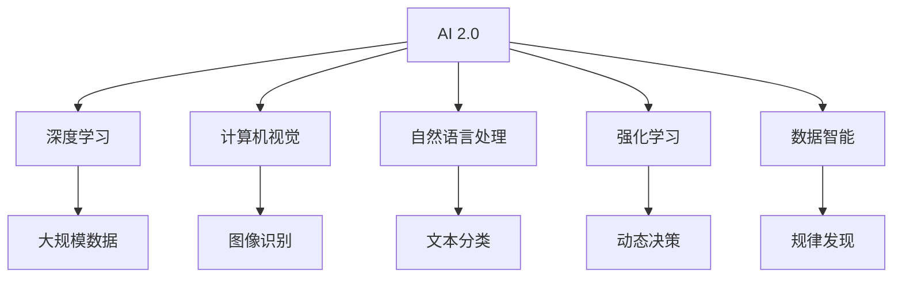

                 

# 李开复：AI 2.0 时代的未来

> 关键词：人工智能, AI 2.0, 未来技术, 创新驱动, 数据智能, 人类协作, 伦理责任

## 1. 背景介绍

### 1.1 问题由来
进入21世纪以来，人工智能(AI)技术在各领域取得了飞速进展，深度学习、计算机视觉、自然语言处理等前沿技术不断突破，推动了AI技术从实验室走向工业应用。AI 1.0时代主要依赖特征工程和手工规则，依赖大量的人工干预，难以应对复杂多变的数据和任务。而AI 2.0时代的到来，则标志着自动化与数据智能的兴起，通过机器学习和大规模数据驱动，能够实现任务自动化和智能化决策，极大地提升了数据处理和分析的能力。

### 1.2 问题核心关键点
AI 2.0时代的核心是“数据智能”，即通过大规模数据驱动，利用机器学习模型自动发现数据中的规律和模式，从而实现高效的自动化决策。AI 2.0的核心技术包括：

1. **深度学习**：利用多层神经网络结构，通过反向传播算法优化模型参数，实现对复杂数据的有效处理。
2. **计算机视觉**：通过图像识别、目标检测等技术，实现对视觉数据的自动理解和处理。
3. **自然语言处理**：通过语言模型和文本分类等技术，实现对文本数据的自动理解和生成。
4. **强化学习**：通过试错和奖励机制，训练模型在动态环境中进行智能决策。
5. **数据增强**：通过对原始数据进行变换和扩充，增加模型对新数据的泛化能力。

AI 2.0时代的目标是构建一个智能化的社会，通过自动化和数据智能实现各种任务的高效执行，提升人类的生产力和生活质量。

### 1.3 问题研究意义
研究AI 2.0时代的未来，对于推进科技创新和社会进步具有重要意义：

1. **推动产业升级**：AI 2.0技术可以应用于各行业，优化生产流程，提升效率，促进产业转型。
2. **解决社会问题**：AI 2.0技术可以应用于医疗、教育、交通等领域，解决社会痛点，提高公共服务质量。
3. **促进人类协作**：AI 2.0技术可以通过人机协作，增强人类创造力，提升创新能力。
4. **保障数据安全**：AI 2.0技术可以用于数据加密和隐私保护，保障数据安全。
5. **应对伦理挑战**：AI 2.0技术需要在开发和应用中考虑伦理问题，避免技术滥用。

## 2. 核心概念与联系

### 2.1 核心概念概述

为更好地理解AI 2.0时代的未来，本节将介绍几个密切相关的核心概念：

- **AI 2.0**：人工智能的2.0时代，标志着从AI 1.0的规则驱动向数据智能驱动的转变，通过大数据和机器学习实现自动化决策。
- **深度学习**：利用多层神经网络结构，通过反向传播算法优化模型参数，实现对复杂数据的有效处理。
- **计算机视觉**：通过图像识别、目标检测等技术，实现对视觉数据的自动理解和处理。
- **自然语言处理**：通过语言模型和文本分类等技术，实现对文本数据的自动理解和生成。
- **强化学习**：通过试错和奖励机制，训练模型在动态环境中进行智能决策。
- **数据智能**：利用大规模数据驱动，通过机器学习模型自动发现数据中的规律和模式，实现高效的自动化决策。

这些核心概念之间的逻辑关系可以通过以下Mermaid流程图来展示：



这个流程图展示AI 2.0时代的核心概念及其之间的关系：

1. AI 2.0通过深度学习、计算机视觉、自然语言处理和强化学习等技术实现数据智能。
2. 深度学习处理大规模数据，提取数据中的特征和模式。
3. 计算机视觉实现图像数据的自动理解和处理。
4. 自然语言处理实现文本数据的自动理解和生成。
5. 强化学习训练模型在动态环境中进行智能决策。
6. 数据智能利用自动化决策，提升AI 2.0的技术应用能力。

## 3. 核心算法原理 & 具体操作步骤
### 3.1 算法原理概述

AI 2.0时代的核心算法原理主要基于深度学习模型和大规模数据驱动，其核心在于通过机器学习模型自动发现数据中的规律和模式，从而实现高效的自动化决策。具体来说，AI 2.0模型的训练和应用过程包括以下几个关键步骤：

1. **数据准备**：收集和预处理大规模数据集，确保数据质量和多样性。
2. **模型构建**：选择合适的深度学习模型架构，如卷积神经网络、循环神经网络、Transformer等。
3. **模型训练**：利用反向传播算法优化模型参数，最小化模型预测与真实标签之间的差距。
4. **模型评估**：在验证集上评估模型性能，选择最优的模型进行下一步应用。
5. **模型应用**：将训练好的模型应用于实际任务中，进行自动决策和预测。

### 3.2 算法步骤详解

AI 2.0时代的算法步骤主要包括以下几个关键步骤：

**Step 1: 数据准备**
- 收集和预处理大规模数据集，包括图像、文本、时序数据等。
- 进行数据清洗和归一化处理，去除噪声和异常值。
- 对数据进行扩充和增强，如旋转、缩放、翻转等，以增加模型的泛化能力。

**Step 2: 模型构建**
- 选择合适的深度学习模型架构，如卷积神经网络、循环神经网络、Transformer等。
- 设置模型的超参数，如学习率、批大小、迭代轮数等。
- 定义损失函数和优化器，如交叉熵损失、Adam等。

**Step 3: 模型训练**
- 将数据集划分为训练集、验证集和测试集。
- 使用反向传播算法优化模型参数，最小化模型预测与真实标签之间的差距。
- 在验证集上评估模型性能，选择最优的模型进行下一步应用。

**Step 4: 模型评估**
- 在测试集上评估模型性能，如准确率、召回率、F1值等。
- 分析模型的错误类型和原因，进一步优化模型。

**Step 5: 模型应用**
- 将训练好的模型应用于实际任务中，进行自动决策和预测。
- 不断迭代和优化模型，提升模型的性能和泛化能力。

### 3.3 算法优缺点

AI 2.0时代的算法具有以下优点：

1. **高效自动化**：通过深度学习和数据智能，实现了任务的自动化和智能化决策。
2. **泛化能力强**：利用大规模数据和模型增强，提升了模型的泛化能力和鲁棒性。
3. **可解释性**：通过特征提取和模型可视化，增强了模型的可解释性和透明度。
4. **适用性广**：可以应用于图像、语音、文本等多种数据类型的任务。

同时，该算法也存在一些缺点：

1. **数据需求高**：需要大量高质量的数据进行训练，数据收集和预处理成本较高。
2. **模型复杂**：深度学习模型结构复杂，需要较高的计算资源和时间成本。
3. **过拟合风险**：大规模数据和复杂模型可能导致过拟合，需要额外的正则化和增强技术。
4. **伦理问题**：AI 2.0技术在应用过程中需要考虑伦理问题，避免技术滥用。

### 3.4 算法应用领域

AI 2.0时代的算法已经广泛应用于各领域，例如：

- **计算机视觉**：如图像识别、目标检测、人脸识别等。
- **自然语言处理**：如文本分类、情感分析、机器翻译等。
- **智能推荐系统**：如商品推荐、新闻推荐等。
- **自动驾驶**：如自动驾驶汽车、智能交通系统等。
- **医疗诊断**：如医学影像分析、基因分析等。
- **金融分析**：如风险评估、股票预测等。

AI 2.0技术的广泛应用，正在推动各行各业的数字化转型，带来巨大的经济效益和社会价值。

## 4. 数学模型和公式 & 详细讲解 & 举例说明

### 4.1 数学模型构建

AI 2.0时代的数学模型主要基于深度学习模型和大规模数据驱动，其核心在于通过机器学习模型自动发现数据中的规律和模式，从而实现高效的自动化决策。

记深度学习模型为 $M_{\theta}$，其中 $\theta$ 为模型参数。假设训练集为 $D=\{(x_i,y_i)\}_{i=1}^N$，其中 $x_i$ 为输入，$y_i$ 为标签。

定义模型的损失函数为 $\ell(M_{\theta}(x_i),y_i)$，则经验风险为：

$$
\mathcal{L}(\theta) = \frac{1}{N}\sum_{i=1}^N \ell(M_{\theta}(x_i),y_i)
$$

在训练过程中，利用梯度下降等优化算法，不断更新模型参数 $\theta$，最小化经验风险 $\mathcal{L}(\theta)$。

### 4.2 公式推导过程

以下我们以图像识别任务为例，推导卷积神经网络模型的损失函数和梯度计算公式。

假设模型 $M_{\theta}$ 在输入 $x$ 上的输出为 $\hat{y}=M_{\theta}(x) \in [0,1]$，表示样本属于正类的概率。真实标签 $y \in \{0,1\}$。则二分类交叉熵损失函数定义为：

$$
\ell(M_{\theta}(x),y) = -[y\log \hat{y} + (1-y)\log (1-\hat{y})]
$$

将其代入经验风险公式，得：

$$
\mathcal{L}(\theta) = -\frac{1}{N}\sum_{i=1}^N [y_i\log M_{\theta}(x_i)+(1-y_i)\log(1-M_{\theta}(x_i))]
$$

根据链式法则，损失函数对参数 $\theta_k$ 的梯度为：

$$
\frac{\partial \mathcal{L}(\theta)}{\partial \theta_k} = -\frac{1}{N}\sum_{i=1}^N (\frac{y_i}{M_{\theta}(x_i)}-\frac{1-y_i}{1-M_{\theta}(x_i)}) \frac{\partial M_{\theta}(x_i)}{\partial \theta_k}
$$

其中 $\frac{\partial M_{\theta}(x_i)}{\partial \theta_k}$ 可进一步递归展开，利用自动微分技术完成计算。

### 4.3 案例分析与讲解

以ImageNet数据集为例，展示深度学习模型的图像识别过程。

**Step 1: 数据准备**
- 收集ImageNet数据集，包括1400万张图像和1000个类别标签。
- 进行数据清洗和预处理，如去噪、归一化、扩充等。

**Step 2: 模型构建**
- 构建卷积神经网络模型，包括卷积层、池化层、全连接层等。
- 设置模型的超参数，如学习率、批大小、迭代轮数等。
- 定义损失函数和优化器，如交叉熵损失、Adam等。

**Step 3: 模型训练**
- 将数据集划分为训练集、验证集和测试集。
- 利用反向传播算法优化模型参数，最小化模型预测与真实标签之间的差距。
- 在验证集上评估模型性能，选择最优的模型进行下一步应用。

**Step 4: 模型评估**
- 在测试集上评估模型性能，如准确率、召回率、F1值等。
- 分析模型的错误类型和原因，进一步优化模型。

**Step 5: 模型应用**
- 将训练好的模型应用于实际任务中，进行自动决策和预测。
- 不断迭代和优化模型，提升模型的性能和泛化能力。

## 5. 项目实践：代码实例和详细解释说明
### 5.1 开发环境搭建

在进行AI 2.0技术实践前，我们需要准备好开发环境。以下是使用Python进行TensorFlow开发的环境配置流程：

1. 安装Anaconda：从官网下载并安装Anaconda，用于创建独立的Python环境。

2. 创建并激活虚拟环境：
```bash
conda create -n pytorch-env python=3.8 
conda activate pytorch-env
```

3. 安装TensorFlow：根据CUDA版本，从官网获取对应的安装命令。例如：
```bash
conda install tensorflow -c pytorch -c conda-forge
```

4. 安装Keras和TensorBoard：
```bash
pip install keras tensorflow-estimator tensorflow-hub tensorflow-model-optimization
```

5. 安装各类工具包：
```bash
pip install numpy pandas scikit-learn matplotlib tqdm jupyter notebook ipython
```

完成上述步骤后，即可在`pytorch-env`环境中开始AI 2.0技术实践。

### 5.2 源代码详细实现

下面我们以图像分类任务为例，给出使用TensorFlow对卷积神经网络模型进行训练和微调的PyTorch代码实现。

首先，定义模型架构和损失函数：

```python
from tensorflow.keras import layers, models
import tensorflow as tf

# 定义模型架构
model = models.Sequential([
    layers.Conv2D(32, (3,3), activation='relu', input_shape=(32,32,3)),
    layers.MaxPooling2D((2,2)),
    layers.Conv2D(64, (3,3), activation='relu'),
    layers.MaxPooling2D((2,2)),
    layers.Conv2D(128, (3,3), activation='relu'),
    layers.MaxPooling2D((2,2)),
    layers.Flatten(),
    layers.Dense(128, activation='relu'),
    layers.Dense(10, activation='softmax')
])

# 定义损失函数
loss_fn = tf.keras.losses.CategoricalCrossentropy()

# 编译模型
model.compile(optimizer='adam',
              loss=loss_fn,
              metrics=['accuracy'])
```

然后，加载数据集并进行预处理：

```python
# 加载数据集
(train_images, train_labels), (test_images, test_labels) = tf.keras.datasets.mnist.load_data()

# 预处理数据
train_images = train_images / 255.0
test_images = test_images / 255.0
train_images = train_images.reshape(-1, 32, 32, 1)
test_images = test_images.reshape(-1, 32, 32, 1)
```

接着，训练模型并在测试集上评估：

```python
# 训练模型
model.fit(train_images, train_labels, epochs=10, batch_size=64, validation_data=(test_images, test_labels))

# 评估模型
test_loss, test_acc = model.evaluate(test_images, test_labels, verbose=2)
print('Test accuracy:', test_acc)
```

以上就是使用TensorFlow对卷积神经网络模型进行图像分类任务训练和微调的完整代码实现。可以看到，TensorFlow提供了丰富的深度学习组件，使得模型的构建和训练过程变得简单易用。

### 5.3 代码解读与分析

让我们再详细解读一下关键代码的实现细节：

**model.compile方法**：
- 用于编译模型，设置优化器、损失函数和评估指标。
- 设置优化器时，可以选择SGD、Adam等常见优化器，并设置学习率等超参数。
- 设置损失函数时，可以选择交叉熵损失、均方误差等常见损失函数。
- 设置评估指标时，可以选择准确率、精确率、召回率等指标，用于评估模型性能。

**model.fit方法**：
- 用于训练模型，指定训练数据集、标签集、迭代轮数和批次大小。
- 在训练过程中，模型会在训练集上前向传播计算预测，并反向传播更新模型参数。
- 在每个epoch的末尾，模型会在验证集上评估性能，并根据评估结果调整学习率等超参数。

**model.evaluate方法**：
- 用于评估模型，指定测试数据集和标签集。
- 在测试过程中，模型会在测试集上前向传播计算预测，并计算评估指标。
- 最后，打印模型在测试集上的评估结果，如准确率、精确率、召回率等。

**代码示例**：

```python
from tensorflow.keras import layers, models
import tensorflow as tf

# 定义模型架构
model = models.Sequential([
    layers.Conv2D(32, (3,3), activation='relu', input_shape=(32,32,3)),
    layers.MaxPooling2D((2,2)),
    layers.Conv2D(64, (3,3), activation='relu'),
    layers.MaxPooling2D((2,2)),
    layers.Conv2D(128, (3,3), activation='relu'),
    layers.MaxPooling2D((2,2)),
    layers.Flatten(),
    layers.Dense(128, activation='relu'),
    layers.Dense(10, activation='softmax')
])

# 定义损失函数
loss_fn = tf.keras.losses.CategoricalCrossentropy()

# 编译模型
model.compile(optimizer='adam',
              loss=loss_fn,
              metrics=['accuracy'])

# 加载数据集
(train_images, train_labels), (test_images, test_labels) = tf.keras.datasets.mnist.load_data()

# 预处理数据
train_images = train_images / 255.0
test_images = test_images / 255.0
train_images = train_images.reshape(-1, 32, 32, 1)
test_images = test_images.reshape(-1, 32, 32, 1)

# 训练模型
model.fit(train_images, train_labels, epochs=10, batch_size=64, validation_data=(test_images, test_labels))

# 评估模型
test_loss, test_acc = model.evaluate(test_images, test_labels, verbose=2)
print('Test accuracy:', test_acc)
```

可以看到，TensorFlow的组件设计使得模型的构建和训练过程变得非常直观和高效。开发者可以通过简单的代码实现复杂的深度学习模型，并进行高效训练和评估。

## 6. 实际应用场景
### 6.1 智能医疗系统

AI 2.0技术在医疗领域的应用前景广阔，可以通过图像识别、自然语言处理等技术实现智能诊断和辅助决策。例如，在医学影像分析中，利用卷积神经网络模型自动识别和标注肿瘤、病变等关键部位，提升医生诊断的准确性和效率。

在电子病历分析中，通过自然语言处理技术自动提取和分类病历信息，辅助医生进行病情分析和治疗方案制定。例如，利用BERT模型对病历文本进行情感分析，判断患者的情绪状态，提供个性化的心理支持和治疗建议。

### 6.2 智能交通系统

AI 2.0技术在智能交通领域的应用前景广阔，可以通过计算机视觉和自然语言处理技术实现智能交通管理。例如，在自动驾驶中，利用计算机视觉技术进行目标检测和行为预测，提升车辆的安全性和稳定性。

在智能交通控制中，通过自然语言处理技术自动分析和预测交通流量，生成智能交通信号灯控制系统，优化交通流量和减少拥堵。例如，利用BERT模型对交通数据分析和预测，生成实时交通控制策略，提升交通管理效率。

### 6.3 智能金融系统

AI 2.0技术在金融领域的应用前景广阔，可以通过自然语言处理和强化学习技术实现智能风险控制和投资决策。例如，在金融舆情分析中，利用自然语言处理技术自动分析和预测股票市场动向，提升投资决策的准确性和效率。

在信用评估中，通过强化学习技术训练信用评分模型，自动评估用户的信用风险，提升贷款审批的效率和准确性。例如，利用DQN模型对用户数据进行分析，生成实时信用评分，提升贷款审批的效率和准确性。

### 6.4 未来应用展望

随着AI 2.0技术的不断进步，未来将迎来更多领域的智能化应用，例如：

- **智能制造**：通过机器视觉和自然语言处理技术实现智能制造和质量控制，提升生产效率和产品质量。
- **智能客服**：利用自然语言处理技术实现智能客服系统，提升客户咨询体验和满意度。
- **智能农业**：通过图像识别和计算机视觉技术实现智能农业管理，提升农业生产效率和产量。
- **智能城市**：通过自然语言处理和计算机视觉技术实现智能城市管理，提升城市治理效率和居民生活质量。

AI 2.0技术的广泛应用，将推动各行各业的数字化转型，带来巨大的经济效益和社会价值。

## 7. 工具和资源推荐
### 7.1 学习资源推荐

为了帮助开发者系统掌握AI 2.0技术的基础知识和发展趋势，这里推荐一些优质的学习资源：

1. 《深度学习》（Ian Goodfellow等著）：介绍深度学习的基本原理和常见算法，是深度学习领域的经典教材。

2. 《Python深度学习》（Francois Chollet著）：详细介绍TensorFlow和Keras等深度学习框架的使用，适合初学者入门。

3. 《动手学深度学习》（李沐等著）：提供完整的深度学习课程和代码实现，涵盖卷积神经网络、循环神经网络等常见模型。

4. CS231n《卷积神经网络》课程：斯坦福大学开设的计算机视觉课程，涵盖图像分类、目标检测等前沿技术。

5. CS224n《自然语言处理》课程：斯坦福大学开设的自然语言处理课程，涵盖语言模型、机器翻译等前沿技术。

6. 《强化学习》（Richard S. Sutton等著）：介绍强化学习的原理和算法，是强化学习领域的经典教材。

通过对这些资源的学习实践，相信你一定能够快速掌握AI 2.0技术的基础知识和应用技巧，并在实际开发中取得优异成果。

### 7.2 开发工具推荐

高效的开发离不开优秀的工具支持。以下是几款用于AI 2.0技术开发的常用工具：

1. TensorFlow：由Google主导开发的深度学习框架，生产部署方便，适合大规模工程应用。
2. PyTorch：由Facebook开发的深度学习框架，灵活动态，适合研究实验和快速迭代。
3. Keras：高层次深度学习框架，易于上手，支持多种深度学习组件。
4. TensorBoard：TensorFlow配套的可视化工具，可实时监测模型训练状态，并提供丰富的图表呈现方式。
5. Jupyter Notebook：交互式编程环境，支持多种编程语言和组件，适合数据科学和机器学习开发。
6. PyCharm：Python开发工具，提供丰富的代码编辑、调试和分析功能。

合理利用这些工具，可以显著提升AI 2.0技术的开发效率，加速创新迭代的步伐。

### 7.3 相关论文推荐

AI 2.0技术的发展源于学界的持续研究。以下是几篇奠基性的相关论文，推荐阅读：

1. ImageNet Large Scale Visual Recognition Challenge：展示了大规模图像识别数据集和模型的应用效果。

2. Transformer Architectures for Learning to Play Go：提出Transformer结构，用于解决复杂博弈问题。

3. AlphaGo Zero：展示利用强化学习训练的AlphaGo Zero模型在围棋中的应用效果。

4. DeepMind GPT-3：介绍GPT-3大模型的应用效果和技术细节。

5. BERT: Pre-training of Deep Bidirectional Transformers for Language Understanding：提出BERT模型，通过掩码自监督学习进行预训练。

这些论文代表了大模型和AI 2.0技术的发展脉络。通过学习这些前沿成果，可以帮助研究者把握学科前进方向，激发更多的创新灵感。

## 8. 总结：未来发展趋势与挑战
### 8.1 总结

本文对AI 2.0时代的未来进行了全面系统的介绍。首先阐述了AI 2.0技术的发展背景和应用前景，明确了数据智能驱动的自动化决策能力。其次，从原理到实践，详细讲解了AI 2.0技术的核心算法和操作步骤，给出了AI 2.0技术在医疗、交通、金融等领域的实际应用案例。最后，讨论了AI 2.0技术的未来发展趋势和面临的挑战，给出了未来研究的方向和突破点。

通过本文的系统梳理，可以看到，AI 2.0技术正在成为各行业的数字化转型关键，推动各行各业的智能化升级。未来，AI 2.0技术将继续拓展其应用边界，带来更高效、智能的决策支持系统，为社会带来巨大的经济效益和价值。

### 8.2 未来发展趋势

展望未来，AI 2.0技术将呈现以下几个发展趋势：

1. **算法智能化**：通过深度学习、强化学习等算法，进一步提升模型的智能化水平，实现更精准的决策和预测。
2. **数据规模化**：随着数据量的不断增长，AI 2.0技术将利用更大规模的数据进行训练，提升模型的泛化能力和鲁棒性。
3. **多模态融合**：AI 2.0技术将融合图像、语音、文本等多种模态数据，实现更全面、准确的信息整合能力。
4. **可解释性增强**：通过特征提取和模型可视化，增强模型的可解释性和透明度，满足各领域对模型输出解释的需求。
5. **伦理道德约束**：AI 2.0技术将在开发和应用中考虑伦理问题，避免技术滥用，保障用户隐私和数据安全。

以上趋势凸显了AI 2.0技术的广阔前景。这些方向的探索发展，必将进一步提升AI 2.0技术的应用能力，推动智能化社会的构建。

### 8.3 面临的挑战

尽管AI 2.0技术已经取得了瞩目成就，但在迈向更加智能化、普适化应用的过程中，它仍面临诸多挑战：

1. **数据隐私和安全**：大规模数据的使用和存储带来数据隐私和安全问题，如何保障数据隐私和安全成为重要课题。
2. **算法透明性**：AI 2.0模型往往具有复杂结构，难以解释其内部工作机制和决策逻辑，需要进一步提升模型可解释性。
3. **模型鲁棒性**：AI 2.0模型在面对未知数据和噪声时，鲁棒性有待提高，需要加强模型泛化能力和抗干扰能力。
4. **技术普及**：AI 2.0技术需要跨行业、跨领域的普及和应用，需要制定统一的技术标准和规范。
5. **伦理道德**：AI 2.0技术在应用过程中需要考虑伦理问题，避免技术滥用，保障用户权益和社会公平。

这些挑战需要在技术、政策、伦理等多个方面进行协同解决，才能确保AI 2.0技术在实际应用中发挥其应有的价值。

### 8.4 研究展望

面对AI 2.0技术面临的挑战，未来的研究需要在以下几个方面寻求新的突破：

1. **数据安全技术**：开发更加安全、可靠的数据存储和传输技术，保障数据隐私和安全。
2. **模型可解释性**：通过特征提取和模型可视化，提升模型的可解释性和透明度，满足各领域对模型输出解释的需求。
3. **算法鲁棒性**：通过正则化、对抗训练等技术，增强AI 2.0模型的鲁棒性和泛化能力，提升其抗干扰和噪声能力。
4. **技术标准**：制定统一的技术标准和规范，促进AI 2.0技术在各行业的普及和应用。
5. **伦理道德**：在AI 2.0技术的开发和应用中，引入伦理导向的评估指标，过滤和惩罚有偏见、有害的输出倾向，保障技术应用的安全性和公平性。

这些研究方向的探索，必将引领AI 2.0技术迈向更高的台阶，为构建安全、可靠、可解释、可控的智能系统铺平道路。面向未来，AI 2.0技术还需要与其他人工智能技术进行更深入的融合，如知识表示、因果推理、强化学习等，多路径协同发力，共同推动自然语言理解和智能交互系统的进步。

## 9. 附录：常见问题与解答

**Q1：什么是AI 2.0技术？**

A: AI 2.0技术是一种基于深度学习和数据智能驱动的自动化决策技术，通过机器学习模型自动发现数据中的规律和模式，实现高效的自动化决策。

**Q2：AI 2.0技术的主要应用领域有哪些？**

A: AI 2.0技术可以应用于图像识别、自然语言处理、智能推荐、自动驾驶、智能医疗等领域，提升各行业的智能化水平。

**Q3：AI 2.0技术在开发和应用过程中需要注意哪些问题？**

A: AI 2.0技术在开发和应用过程中需要注意数据隐私和安全、算法透明性、模型鲁棒性、技术普及、伦理道德等问题，确保技术应用的安全性和公平性。

**Q4：未来AI 2.0技术的发展趋势是什么？**

A: AI 2.0技术将向算法智能化、数据规模化、多模态融合、可解释性增强、伦理道德约束等方向发展，推动智能化社会的构建。

**Q5：如何克服AI 2.0技术面临的挑战？**

A: 通过数据安全技术、模型可解释性、算法鲁棒性、技术标准、伦理道德等研究方向，克服AI 2.0技术面临的挑战，确保其应用的安全性和公平性。

---

作者：禅与计算机程序设计艺术 / Zen and the Art of Computer Programming

