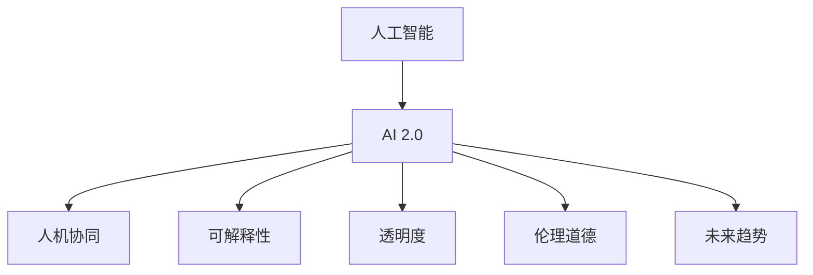

                 

# 李开复：AI 2.0 时代的用户

> 关键词：人工智能, 用户研究, 李开复, AI 2.0, 人机协同, 技术与社会, 未来趋势

## 1. 背景介绍

### 1.1 问题的由来
在过去的几十年里，人工智能（AI）技术取得了巨大的进步，特别是随着深度学习和自然语言处理的突破，AI 技术已经能够处理复杂任务，如图像识别、语音识别、自然语言理解等。然而，这些技术往往被认为是一种"黑箱"系统，用户很难理解其内部工作机制和决策过程。这种技术透明度和可解释性的缺失，使得用户对AI技术的接受度和信任度受到了影响。

李开复，作为科技界的重要人物，一直致力于推动人工智能技术的发展，并倡导在AI 2.0时代，将AI技术与人类活动更好地融合，提升用户对AI技术的理解和信任。本文将从用户研究的角度，探讨AI 2.0时代用户的需求和挑战，并提出相应的解决方案。

### 1.2 问题核心关键点
AI 2.0时代的用户研究主要关注以下几个关键点：

- **透明度**：用户对AI技术决策过程的理解和信任。
- **可解释性**：用户能够理解AI技术的决策依据和推理过程。
- **人机协同**：AI技术如何更好地与人类协作，提升人类工作效率和生活质量。
- **伦理道德**：AI技术在应用过程中，如何保障用户的隐私和安全。
- **未来趋势**：AI技术如何适应社会和技术的发展，满足用户不断变化的需求。

这些关键点构成了AI 2.0时代用户研究的核心，将帮助开发者和决策者更好地理解用户需求，设计更高效、可接受、安全的技术系统。

## 2. 核心概念与联系

### 2.1 核心概念概述

为更好地理解AI 2.0时代的用户研究，本节将介绍几个密切相关的核心概念：

- **人工智能（AI）**：利用计算机模拟人脑思考和行动的智能技术。
- **AI 2.0**：强调AI技术的人性化和智能化，将AI技术融入更广泛的人类活动，如医疗、教育、娱乐等。
- **人机协同（Human-AI Collaboration）**：AI技术与人类在各自优势领域的协作，实现更高效的任务完成。
- **可解释性（Explainability）**：用户能够理解AI系统的决策依据和推理过程，增加信任。
- **透明度（Transparency）**：AI系统的决策过程公开、可审计，便于用户监督和理解。
- **伦理道德（Ethics）**：AI技术在应用过程中，遵守社会伦理和道德规范，保障用户权益。
- **未来趋势（Future Trends）**：AI技术的发展方向，以及如何应对未来社会和技术的变化。

这些核心概念之间的逻辑关系可以通过以下Mermaid流程图来展示：



这个流程图展示了许多核心概念之间的相互关系：

1. AI 2.0时代的AI技术强调人机协同，在各个领域与人类协作，提升效率。
2. 可解释性和透明度是AI 2.0时代AI技术的核心要求，帮助用户理解和信任AI系统。
3. 伦理道德是AI系统应用的基础，保障用户权益。
4. 未来趋势指导AI技术的未来发展方向，满足用户不断变化的需求。

## 3. 核心算法原理 & 具体操作步骤
### 3.1 算法原理概述

AI 2.0时代的用户研究涉及多个领域的算法和原理，包括可解释性、透明度、人机协同等。本节将从这些角度，概述相关算法原理。

**可解释性算法**：通过多种技术手段，如模型可视化、可解释性模型、规则模型等，帮助用户理解AI系统的决策过程。

**透明度算法**：记录AI系统的决策过程，包括输入、输出、中间步骤等，提供给用户进行审计和监督。

**人机协同算法**：设计用户界面和交互方式，使AI系统和人类更自然地协作，提升用户体验和效率。

### 3.2 算法步骤详解

以下是AI 2.0时代用户研究的详细步骤：

**Step 1: 数据收集与分析**
- 收集用户行为数据、反馈数据、使用日志等，分析用户的痛点、需求和偏好。

**Step 2: 构建用户画像**
- 使用数据分析技术，构建用户画像，描述不同用户的特征和行为模式。

**Step 3: 设计用户研究任务**
- 设计用户体验调查、用户访谈、用户测试等任务，获取用户对AI系统的评价和建议。

**Step 4: 模型训练与验证**
- 使用机器学习技术，训练用户画像模型、需求预测模型等，进行模型验证和调优。

**Step 5: 反馈循环**
- 将用户研究结果反馈到AI系统的设计和开发中，不断迭代优化，提升用户体验。

### 3.3 算法优缺点

AI 2.0时代的用户研究方法具有以下优点：

- **系统性**：通过数据分析和用户画像，能够全面了解用户需求和行为。
- **及时性**：及时反馈用户研究结果，优化AI系统设计。
- **可操作性**：用户研究结果可以直接应用于AI系统的开发和改进。

同时，该方法也存在一些局限性：

- **成本高**：数据收集和用户研究需要大量时间和资源。
- **用户偏差**：用户反馈和行为数据可能存在偏差，影响研究结果的准确性。
- **隐私问题**：用户数据可能涉及隐私和安全问题，需严格保护。

### 3.4 算法应用领域

AI 2.0时代的用户研究方法在多个领域都有广泛应用：

- **医疗领域**：通过用户研究，了解患者的医疗需求，设计更符合用户需求的健康管理软件。
- **教育领域**：收集学生的学习数据，设计个性化学习路径，提升学习效果。
- **娱乐领域**：分析用户对娱乐产品的喜好，优化推荐系统，提升用户体验。
- **金融领域**：研究用户对金融产品的需求，设计更符合用户需求的服务。
- **智慧城市**：收集居民的使用数据，设计更智能、便捷的城市管理服务。

## 4. 数学模型和公式 & 详细讲解  
### 4.1 数学模型构建

本节将使用数学语言对AI 2.0时代用户研究的数学模型进行更加严格的刻画。

设用户行为数据集为 $D=\{(x_i,y_i)\}_{i=1}^N$，其中 $x_i$ 为用户的行为数据，$y_i$ 为用户对AI系统的评价。目标是对用户进行分类，了解不同用户的需求和偏好。

定义用户画像模型为 $f(x)$，则模型训练的目标是最小化经验风险：

$$
\mathcal{L}(f) = \frac{1}{N}\sum_{i=1}^N \ell(f(x_i),y_i)
$$

其中 $\ell$ 为损失函数，通常使用交叉熵损失。

### 4.2 公式推导过程

以用户分类任务为例，推导交叉熵损失函数的计算公式。

设用户画像模型为 $f(x)$，输入 $x_i$，输出 $y_i$，则交叉熵损失函数为：

$$
\ell(f(x),y) = -[y\log f(x_i)+(1-y)\log(1-f(x_i))]
$$

将其代入经验风险公式，得：

$$
\mathcal{L}(f) = -\frac{1}{N}\sum_{i=1}^N [y_i\log f(x_i)+(1-y_i)\log(1-f(x_i))]
$$

在得到损失函数的梯度后，即可带入模型训练公式，完成用户画像的迭代优化。重复上述过程直至收敛，最终得到适合用户需求的用户画像模型。

## 5. 项目实践：代码实例和详细解释说明
### 5.1 开发环境搭建

在进行用户研究项目前，我们需要准备好开发环境。以下是使用Python进行用户画像研究的开发环境配置流程：

1. 安装Python和必要的第三方库，如numpy、pandas、scikit-learn等。

2. 获取用户行为数据，并进行预处理，如去噪、标准化等。

3. 使用pandas进行数据分析，构建用户画像。

4. 使用scikit-learn进行模型训练和验证。

5. 部署用户画像模型，进行实时预测和反馈。

完成上述步骤后，即可在Python环境中开始用户研究项目。

### 5.2 源代码详细实现

下面以用户分类任务为例，给出使用scikit-learn进行用户画像模型训练的Python代码实现。

首先，准备数据集：

```python
from sklearn.datasets import load_iris
from sklearn.model_selection import train_test_split

# 加载鸢尾花数据集
iris = load_iris()

# 划分训练集和测试集
X_train, X_test, y_train, y_test = train_test_split(iris.data, iris.target, test_size=0.2, random_state=42)
```

然后，构建用户画像模型：

```python
from sklearn.ensemble import RandomForestClassifier
from sklearn.metrics import classification_report

# 构建随机森林分类器
model = RandomForestClassifier(n_estimators=100, random_state=42)

# 训练模型
model.fit(X_train, y_train)

# 预测测试集
y_pred = model.predict(X_test)

# 评估模型性能
print(classification_report(y_test, y_pred))
```

接着，进行模型优化和验证：

```python
from sklearn.model_selection import GridSearchCV

# 设定超参数搜索范围
param_grid = {
    'n_estimators': [50, 100, 200],
    'max_depth': [None, 5, 10]
}

# 进行超参数搜索
grid_search = GridSearchCV(model, param_grid, cv=5, scoring='accuracy')
grid_search.fit(X_train, y_train)

# 输出最优参数
print("Best parameters:", grid_search.best_params_)
```

最后，部署模型并进行实时预测：

```python
from sklearn.pipeline import make_pipeline

# 创建管道，包含标准化和分类器
pipeline = make_pipeline(StandardScaler(), RandomForestClassifier())

# 训练管道
pipeline.fit(X_train, y_train)

# 实时预测
real_test = [[5, 3, 2, 2]]
print("预测结果:", pipeline.predict(real_test))
```

以上就是使用scikit-learn进行用户画像模型训练的完整代码实现。可以看到，得益于scikit-learn的强大封装，我们可以用相对简洁的代码完成用户画像的建模和训练。

### 5.3 代码解读与分析

让我们再详细解读一下关键代码的实现细节：

**加载数据集**：
- 使用sklearn.datasets的load_iris函数，加载鸢尾花数据集。

**划分数据集**：
- 使用sklearn.model_selection的train_test_split函数，将数据集划分为训练集和测试集。

**构建分类器**：
- 使用sklearn.ensemble的RandomForestClassifier函数，构建随机森林分类器。

**训练模型**：
- 使用分类器的fit方法，对训练集进行训练。

**预测和评估**：
- 使用模型在测试集上进行预测，并使用sklearn.metrics的classification_report函数，打印模型性能指标。

**超参数优化**：
- 使用GridSearchCV函数，进行超参数搜索，找到最优的模型参数组合。

**管道构建**：
- 使用sklearn.pipeline的make_pipeline函数，构建标准化-分类器的管道。

**实时预测**：
- 使用管道在新的测试样本上进行预测。

可以看到，scikit-learn使得用户画像的建模和训练过程变得简洁高效。开发者可以将更多精力放在数据处理、模型改进等高层逻辑上，而不必过多关注底层的实现细节。

当然，工业级的系统实现还需考虑更多因素，如模型的保存和部署、超参数的自动搜索、更灵活的任务适配层等。但核心的用户画像建模和训练基本与此类似。

## 6. 实际应用场景
### 6.1 智能医疗

在智能医疗领域，基于用户研究的用户画像技术，可以应用于健康管理、疾病预测、个性化治疗等方面。通过分析用户的健康数据，如运动数据、饮食习惯、基因信息等，构建用户画像，设计更加符合用户需求的健康管理软件。

例如，某智能手表可以分析用户的心率、步数、睡眠数据，预测用户的健康风险，并提供个性化健身计划和饮食建议。在实际应用中，系统会根据用户的健康数据，自动更新用户画像，并动态调整健康管理方案。

### 6.2 个性化教育

在个性化教育领域，用户画像技术可以应用于学习路径设计、学习资源推荐、学习效果评估等方面。通过分析学生的学习数据，如学习时间、做题情况、学习风格等，构建用户画像，设计更加个性化的学习路径和资源推荐。

例如，某在线学习平台可以根据学生的学习数据，自动推荐适合的学习资源，并根据学生的学习效果，动态调整学习路径。在实际应用中，系统会根据学生的学习数据，不断更新用户画像，并优化学习资源推荐和路径设计。

### 6.3 娱乐推荐

在娱乐推荐领域，用户画像技术可以应用于电影推荐、音乐推荐、游戏推荐等方面。通过分析用户的娱乐偏好，如电影偏好、音乐风格、游戏偏好等，构建用户画像，设计更加个性化的推荐系统。

例如，某音乐平台可以根据用户的听歌历史和听歌习惯，推荐适合的音乐，并根据用户的反馈，动态调整推荐列表。在实际应用中，系统会根据用户的听歌数据，不断更新用户画像，并优化推荐算法。

### 6.4 智慧城市

在智慧城市领域，用户画像技术可以应用于交通管理、公共服务、环境监测等方面。通过分析居民的使用数据，如出行数据、环保行为、公共服务使用情况等，构建用户画像，设计更加智能的城市管理服务。

例如，某智慧城市平台可以根据居民的出行数据，优化交通管理方案，减少拥堵，提升通行效率。在实际应用中，系统会根据居民的使用数据，不断更新用户画像，并优化城市管理方案。

### 6.5 金融服务

在金融服务领域，用户画像技术可以应用于风险评估、个性化服务、客户管理等方面。通过分析用户的金融数据，如消费行为、信用记录、理财需求等，构建用户画像，设计更加个性化的金融服务。

例如，某金融平台可以根据用户的消费行为和信用记录，评估其信用风险，并提供个性化的贷款和理财建议。在实际应用中，系统会根据用户的金融数据，不断更新用户画像，并优化金融服务方案。

## 7. 工具和资源推荐
### 7.1 学习资源推荐

为了帮助开发者系统掌握用户画像的研究方法，这里推荐一些优质的学习资源：

1. 《Python数据科学手册》：介绍Python在数据科学中的应用，包括数据分析、机器学习等。

2. 《数据科学与统计》课程：斯坦福大学开设的数据科学课程，涵盖数据分析、统计学、机器学习等内容。

3. 《用户画像设计指南》：用户研究领域的经典著作，介绍用户画像的构建方法和应用场景。

4. 《用户研究方法论》：详细介绍用户研究的多种方法，如用户体验调查、用户访谈、用户测试等。

5. 《机器学习实战》：讲解机器学习算法和实践的书籍，提供丰富的代码示例。

通过对这些资源的学习实践，相信你一定能够快速掌握用户画像的研究方法和技术要点。

### 7.2 开发工具推荐

高效的开发离不开优秀的工具支持。以下是几款用于用户画像研究的常用工具：

1. Python：简单易学的脚本语言，适合快速迭代研究。

2. pandas：强大的数据处理库，支持多种数据格式和操作。

3. scikit-learn：机器学习库，包含多种模型和算法，支持快速建模和调参。

4. TensorBoard：TensorFlow配套的可视化工具，用于实时监测模型训练状态。

5. Weights & Biases：实验跟踪工具，记录和可视化模型训练过程中的各项指标。

6. Jupyter Notebook：交互式开发环境，支持多种语言和库，方便进行实验记录和分享。

合理利用这些工具，可以显著提升用户画像的研究效率，加快创新迭代的步伐。

### 7.3 相关论文推荐

用户画像技术的研究源于学界的持续研究。以下是几篇奠基性的相关论文，推荐阅读：

1. "User Profiling in Multi-user Interaction Systems"（用户画像在多用户交互系统中的应用）：探讨了用户画像在多用户交互系统中的建模和应用方法。

2. "User Profiling for Personalized Recommendation"（用户画像在个性化推荐中的应用）：研究了基于用户画像的个性化推荐算法。

3. "A Survey on User Profiling in Recommender Systems"（推荐系统中的用户画像研究综述）：综述了推荐系统中的用户画像研究进展和应用。

4. "User Profiling: A Survey"（用户画像研究综述）：全面介绍了用户画像的多种建模方法和应用场景。

5. "Personalization and Privacy: An Exploration of User Profiling in the context of e-Commerce"（电子商务中的用户画像研究）：研究了电子商务中的用户画像建模和隐私保护问题。

这些论文代表了大语言模型微调技术的发展脉络。通过学习这些前沿成果，可以帮助研究者把握学科前进方向，激发更多的创新灵感。

## 8. 总结：未来发展趋势与挑战

### 8.1 总结

本文对AI 2.0时代的用户研究方法进行了全面系统的介绍。首先阐述了AI 2.0时代用户的需求和挑战，明确了可解释性、透明度、人机协同等核心要求。其次，从原理到实践，详细讲解了用户研究方法的数学模型和关键步骤，给出了用户研究任务的完整代码实例。同时，本文还广泛探讨了用户画像技术在智能医疗、个性化教育、娱乐推荐、智慧城市等多个行业领域的应用前景，展示了用户研究技术的巨大潜力。

通过本文的系统梳理，可以看到，用户画像技术正在成为AI 2.0时代的重要研究范式，极大地拓展了AI系统的应用边界，提升了用户体验和信任度。未来，伴随用户画像技术的不断演进，相信AI系统将在更广泛的应用领域发挥作用，为人类活动带来更深刻的变革。

### 8.2 未来发展趋势

展望未来，用户画像技术将呈现以下几个发展趋势：

1. **深度学习和大数据应用**：利用深度学习和大数据技术，构建更加准确、全面的用户画像，提升用户画像的预测能力和应用效果。

2. **跨领域融合**：用户画像技术将与其他AI技术，如自然语言处理、计算机视觉、机器人学等进行更深入的融合，实现更全面的用户建模和智能应用。

3. **实时性和动态性**：实时更新用户画像，动态调整AI系统的输出，提升系统的灵活性和适应性。

4. **隐私保护和伦理道德**：用户画像技术将更加注重隐私保护和伦理道德问题，确保用户数据的保密和安全。

5. **多模态数据融合**：将文本、语音、图像等多种模态数据进行融合，构建更加全面、立体的用户画像。

这些趋势凸显了用户画像技术的广阔前景。这些方向的探索发展，必将进一步提升AI系统的性能和用户体验，满足用户不断变化的需求。

### 8.3 面临的挑战

尽管用户画像技术已经取得了瞩目成就，但在迈向更加智能化、普适化应用的过程中，它仍面临着诸多挑战：

1. **数据隐私问题**：用户数据的隐私保护和伦理问题，需要严格的数据管理和隐私保护机制。

2. **数据质量问题**：用户数据的质量和完整性可能存在问题，影响用户画像的准确性。

3. **计算资源问题**：构建全面、精确的用户画像，需要大量的计算资源和数据处理能力。

4. **用户接受度问题**：用户对AI系统的信任度和接受度可能存在差异，需要引导用户理解和接受。

5. **技术实现问题**：用户画像技术的技术实现复杂度较高，需要跨学科的协同努力。

这些挑战需要学术界和产业界共同努力，不断突破技术瓶颈，优化用户体验。只有从数据、算法、伦理、社会等多个维度进行全面优化，才能真正实现用户画像技术的广泛应用。

### 8.4 研究展望

面向未来，用户画像技术需要在以下几个方面寻求新的突破：

1. **跨领域数据融合**：将不同领域的数据进行融合，构建更加全面、立体的用户画像。

2. **实时动态建模**：利用实时数据更新用户画像，动态调整AI系统的输出。

3. **隐私保护技术**：研究隐私保护技术，确保用户数据的保密和安全。

4. **模型优化技术**：优化用户画像模型的训练和优化方法，提高模型的准确性和效率。

5. **人机协同研究**：研究人机协同技术，提升AI系统与人类协作的效果。

这些研究方向将推动用户画像技术的进一步发展，为构建更智能、更可靠、更可信的AI系统提供有力支持。

## 9. 附录：常见问题与解答

**Q1：如何构建用户画像？**

A: 构建用户画像主要包括以下步骤：

1. 收集用户数据：包括行为数据、消费数据、社交数据等。

2. 数据清洗和预处理：去除噪声和缺失值，标准化数据格式。

3. 数据分析和建模：使用机器学习算法，如聚类、分类、回归等，构建用户画像。

4. 模型验证和调优：使用交叉验证等方法，验证模型的准确性和泛化能力，进行参数调优。

5. 实时更新和优化：根据新的数据，实时更新用户画像，动态调整AI系统的输出。

**Q2：用户画像技术在实际应用中需要注意哪些问题？**

A: 用户画像技术在实际应用中需要注意以下问题：

1. 数据隐私保护：确保用户数据的保密和安全，遵守相关法律法规。

2. 用户接受度：引导用户理解和接受AI系统，提升用户信任度。

3. 计算资源：构建全面、精确的用户画像，需要大量的计算资源和数据处理能力。

4. 数据质量：用户数据的质量和完整性可能存在问题，影响用户画像的准确性。

5. 模型优化：优化用户画像模型的训练和优化方法，提高模型的准确性和效率。

6. 跨领域融合：将不同领域的数据进行融合，构建更加全面、立体的用户画像。

这些问题的处理需要综合考虑技术、伦理、法律等多个方面，确保用户画像技术在实际应用中能够充分发挥其价值。

**Q3：未来用户画像技术的发展方向是什么？**

A: 未来用户画像技术的发展方向包括：

1. 深度学习和大数据应用：利用深度学习和大数据技术，构建更加准确、全面的用户画像。

2. 跨领域融合：将不同领域的数据进行融合，构建更加全面、立体的用户画像。

3. 实时性和动态性：实时更新用户画像，动态调整AI系统的输出，提升系统的灵活性和适应性。

4. 隐私保护和伦理道德：研究隐私保护技术，确保用户数据的保密和安全。

5. 多模态数据融合：将文本、语音、图像等多种模态数据进行融合，构建更加全面、立体的用户画像。

6. 持续学习和自适应：用户画像技术将更加注重持续学习和自适应，根据用户行为和反馈不断优化。

这些方向将推动用户画像技术的进一步发展，为构建更智能、更可靠、更可信的AI系统提供有力支持。

---

作者：禅与计算机程序设计艺术 / Zen and the Art of Computer Programming

