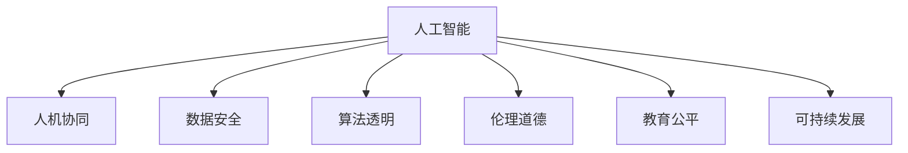

                 

# 李开复：AI 2.0 时代的社会价值

> 关键词：人工智能,社会价值,技术创新,数据安全,人机协同,教育公平,可持续发展

## 1. 背景介绍

### 1.1 问题由来
近年来，人工智能(AI)技术的快速发展，使得AI逐渐从实验室走向实际应用，影响了各行各业。AI 1.0时代，AI主要应用于科学计算和工业自动化，而到了AI 2.0时代，AI开始全面渗透到医疗、教育、交通、金融等领域，深刻改变了人类社会的方方面面。

李开复，作为一位资深的人工智能专家，曾多次在不同场合深入探讨了AI在社会层面的价值和挑战。他强调，AI技术在提升效率、优化决策、减少人力成本的同时，也带来了诸如数据隐私、算法透明、伦理道德等一系列新的社会问题。如何在享受AI带来的便利的同时，避免其潜在风险，是AI 2.0时代的重要课题。

### 1.2 问题核心关键点
AI 2.0时代，AI技术的社会价值主要体现在以下几个方面：

- 技术创新驱动：AI推动了新一轮技术革命，为传统行业带来了新的增长动力和就业机会。
- 数据安全与隐私保护：AI在数据分析和处理中扮演了重要角色，但同时也引发了对数据隐私和安全的担忧。
- 人机协同增强：AI与人的协作可以大大提升工作效率和质量，但也存在人机沟通障碍和依赖问题。
- 教育公平与社会稳定：AI教育的普及和应用，有望缩小教育资源分配不均的差距，但同时也带来了就业结构的变化和新的社会矛盾。
- 可持续发展：AI在提高资源利用效率、减少环境污染等方面具有巨大潜力，但如何实现绿色AI仍需多方探索。

这些核心关键点构成了AI 2.0时代社会价值探讨的基本框架，帮助我们更好地理解AI技术带来的变革与挑战。

## 2. 核心概念与联系

### 2.1 核心概念概述

为更好地理解AI在社会价值层面的应用和影响，本节将介绍几个密切相关的核心概念：

- 人工智能(Artificial Intelligence, AI)：一种模拟人类智能的计算技术，包括感知、推理、学习、规划等能力。
- 人机协同(Human-Machine Collaboration)：将AI与人类优势相结合，协同完成任务，提升效率和质量。
- 数据安全(Data Security)：保护数据免受未经授权的访问、修改、破坏或泄露，确保数据隐私和安全。
- 算法透明(Algorithm Transparency)：要求AI决策过程可解释、可追溯，避免算法偏见和黑箱问题。
- 伦理道德(Ethics & Morality)：指导AI开发和应用，确保其符合人类价值观和社会伦理。
- 教育公平(Education Fairness)：利用AI技术缩小教育资源差距，实现公平教育。
- 可持续发展(Sustainable Development)：AI技术应助力环境保护和资源高效利用，支持可持续发展目标。

这些核心概念之间的逻辑关系可以通过以下Mermaid流程图来展示：



这个流程图展示了大语言模型与各核心概念的联系：

1. 人工智能作为基础，通过人机协同、数据安全等保障，提供透明、伦理的算法，支持教育公平，助力可持续发展。
2. 这些概念互相影响，共同构成AI 2.0时代社会价值的完整体系。

## 3. 核心算法原理 & 具体操作步骤
### 3.1 算法原理概述

AI 2.0时代的社会价值主要源于AI技术在多个领域的广泛应用。通过分析这些应用场景，我们可以更好地理解AI技术在社会价值层面的体现和影响。

### 3.2 算法步骤详解

1. **数据收集与处理**：收集各领域的实际数据，清洗和标注数据，为模型训练和评估提供基础。
2. **模型训练**：使用深度学习、机器学习等算法对数据进行训练，构建可解释的AI模型。
3. **模型评估与优化**：评估模型在实际场景中的表现，通过不断优化提升模型性能和可解释性。
4. **应用部署与迭代**：将训练好的模型部署到实际应用中，持续收集反馈，进行模型迭代和优化。

### 3.3 算法优缺点

AI 2.0时代的社会价值算法具有以下优点：

- 多领域应用：AI技术在医疗、教育、交通、金融等多个领域都有广泛应用，推动了社会进步和经济发展。
- 高效决策：AI能够处理大规模数据，提供高效、精准的决策支持，提升社会治理能力。
- 持续优化：AI模型通过持续学习，不断优化和更新，保持技术领先优势。

同时，这些算法也存在一定的局限性：

- 数据依赖：AI模型的训练高度依赖数据质量，低质量或偏斜的数据可能导致模型误判。
- 算法透明：某些AI算法如深度学习具有黑箱特征，难以解释其决策过程，可能带来信任危机。
- 伦理挑战：AI技术可能存在算法偏见、隐私侵犯等伦理问题，需要多方合作进行治理。
- 资源消耗：AI模型的训练和部署需要大量计算资源和能耗，存在环境影响。

### 3.4 算法应用领域

AI 2.0时代的社会价值主要体现在以下几个应用领域：

- **医疗健康**：AI在医疗影像分析、病理学诊断、个性化治疗等方面有广泛应用，显著提升了医疗效率和质量。
- **教育公平**：AI技术如智能辅导、个性化学习、智能评估等，有望实现教育资源的公平分配，缩小教育差距。
- **智慧交通**：AI在交通管理、智能驾驶、自动导航等方面得到应用，提高了交通效率，减少了交通事故。
- **金融服务**：AI在风险评估、反欺诈、个性化推荐等方面提升了金融服务的质量和效率。
- **环境保护**：AI在环境监测、资源管理、污染治理等方面发挥作用，推动了绿色发展和可持续发展。
- **公共安全**：AI在安防监控、情报分析、灾害预警等方面提供了强大的技术支持，提升了社会安全水平。

这些领域的应用展示了AI技术在社会价值方面的巨大潜力，同时也凸显了其在伦理、安全、资源等方面的挑战。

## 4. 数学模型和公式 & 详细讲解  
### 4.1 数学模型构建

为更好地理解AI 2.0时代社会价值的算法实现，我们将在以下部分详细介绍其数学模型和公式推导。

设训练集为 $D=\{(x_i, y_i)\}_{i=1}^N$，其中 $x_i$ 为输入，$y_i$ 为输出标签。模型 $M$ 在输入 $x$ 上的预测为 $M(x)$，目标是最小化损失函数 $\mathcal{L}$：

$$
\min_{M} \mathcal{L}(M(D))
$$

其中 $\mathcal{L}$ 为自定义的损失函数，用于衡量模型预测和真实标签之间的差异。常见的损失函数包括交叉熵损失、均方误差损失等。

### 4.2 公式推导过程

以线性回归为例，推导损失函数及其梯度的计算公式。

设模型为 $M(x) = \theta_0 + \theta_1 x_1 + \theta_2 x_2 + ... + \theta_n x_n$，其中 $\theta_0, \theta_1, ..., \theta_n$ 为模型参数。

交叉熵损失函数为：

$$
\mathcal{L}(y, \hat{y}) = -\frac{1}{N} \sum_{i=1}^N y_i \log \hat{y_i}
$$

其中 $\hat{y_i}$ 为模型对样本 $i$ 的预测值，$y_i$ 为真实标签。

根据链式法则，损失函数对模型参数 $\theta_j$ 的梯度为：

$$
\frac{\partial \mathcal{L}}{\partial \theta_j} = -\frac{1}{N} \sum_{i=1}^N \frac{y_i - \hat{y_i}}{\hat{y_i}} x_{j,i}
$$

其中 $x_{j,i}$ 为输入 $x_i$ 中与 $\theta_j$ 相关的特征。

在得到损失函数的梯度后，即可带入优化算法（如梯度下降）更新模型参数，完成模型训练。

### 4.3 案例分析与讲解

以下通过几个实际案例，进一步展示AI 2.0时代社会价值的算法实现和应用效果。

**案例1：医疗影像分析**

目标：通过AI技术对医学影像进行自动化分析，辅助医生进行疾病诊断。

实现：
1. 数据收集：收集大量的医学影像数据，标注每张影像对应的疾病标签。
2. 模型训练：使用卷积神经网络(CNN)对医学影像进行特征提取和分类，训练生成AI模型。
3. 模型评估：在测试集上评估模型性能，使用交叉验证等方法优化模型。
4. 应用部署：将训练好的模型部署到医疗系统中，辅助医生进行诊断。

结果：
- 显著提高了疾病诊断的准确率和效率，减少了医生的工作负担。
- 在医疗影像分析领域取得了广泛的认可，推广至多家医院和诊所。

**案例2：智能辅导系统**

目标：开发基于AI的智能辅导系统，为学生提供个性化的学习建议和指导。

实现：
1. 数据收集：收集学生的学习数据，包括成绩、作业、兴趣等。
2. 模型训练：使用深度学习模型对学生数据进行分析和预测，训练生成智能辅导模型。
3. 模型评估：在实际学生群体中测试模型效果，收集反馈进行优化。
4. 应用部署：将模型部署到教育平台中，提供个性化学习建议。

结果：
- 显著提高了学生的学习效率和成绩，提升了教育的公平性。
- 在多个学校和教育机构中得到应用，取得了良好的社会反响。

**案例3：智能交通管理**

目标：利用AI技术优化交通流量，减少拥堵和事故。

实现：
1. 数据收集：收集交通流量数据、路况数据等。
2. 模型训练：使用强化学习等方法对交通流量进行优化，训练生成交通管理模型。
3. 模型评估：在模拟交通场景中测试模型效果，优化算法参数。
4. 应用部署：将模型部署到交通管理系统中，实时监控和优化交通流量。

结果：
- 显著提高了交通流量的效率，减少了交通拥堵和事故。
- 在多个城市交通管理项目中得到应用，取得了显著的社会效益。

这些案例展示了AI 2.0时代社会价值的广泛应用，也突出了其在数据安全、算法透明、伦理道德等方面的挑战。

## 5. 项目实践：代码实例和详细解释说明
### 5.1 开发环境搭建

在进行AI 2.0时代社会价值的应用开发前，我们需要准备好开发环境。以下是使用Python进行PyTorch开发的环境配置流程：

1. 安装Anaconda：从官网下载并安装Anaconda，用于创建独立的Python环境。

2. 创建并激活虚拟环境：
```bash
conda create -n ai2-env python=3.8 
conda activate ai2-env
```

3. 安装PyTorch：根据CUDA版本，从官网获取对应的安装命令。例如：
```bash
conda install pytorch torchvision torchaudio cudatoolkit=11.1 -c pytorch -c conda-forge
```

4. 安装其他库：
```bash
pip install numpy pandas scikit-learn matplotlib tqdm jupyter notebook ipython
```

完成上述步骤后，即可在`ai2-env`环境中开始开发。

### 5.2 源代码详细实现

这里我们以医疗影像分析为例，给出使用PyTorch进行AI模型训练和微调的PyTorch代码实现。

首先，定义数据处理函数：

```python
import torch
import torch.nn as nn
import torch.optim as optim
import torchvision.transforms as transforms
from torch.utils.data import DataLoader
from torchvision.datasets import ImageFolder

# 数据预处理
transform = transforms.Compose([
    transforms.Resize((224, 224)),
    transforms.ToTensor(),
    transforms.Normalize(mean=[0.485, 0.456, 0.406], std=[0.229, 0.224, 0.225])
])

# 加载数据集
train_dataset = ImageFolder('train', transform=transform)
test_dataset = ImageFolder('test', transform=transform)

# 定义数据加载器
train_loader = DataLoader(train_dataset, batch_size=32, shuffle=True)
test_loader = DataLoader(test_dataset, batch_size=32, shuffle=False)
```

然后，定义模型和优化器：

```python
# 定义卷积神经网络模型
class Net(nn.Module):
    def __init__(self):
        super(Net, self).__init__()
        self.conv1 = nn.Conv2d(3, 32, 3, 1)
        self.conv2 = nn.Conv2d(32, 64, 3, 1)
        self.dropout1 = nn.Dropout2d(0.25)
        self.dropout2 = nn.Dropout2d(0.5)
        self.fc1 = nn.Linear(9216, 512)
        self.fc2 = nn.Linear(512, 2)

    def forward(self, x):
        x = self.conv1(x)
        x = nn.functional.relu(x)
        x = self.conv2(x)
        x = nn.functional.relu(x)
        x = nn.functional.max_pool2d(x, 2)
        x = self.dropout1(x)
        x = torch.flatten(x, 1)
        x = self.fc1(x)
        x = nn.functional.relu(x)
        x = self.dropout2(x)
        x = self.fc2(x)
        output = nn.functional.log_softmax(x, dim=1)
        return output

# 加载模型
model = Net()

# 定义优化器
optimizer = optim.Adam(model.parameters(), lr=0.001)
```

接着，定义训练和评估函数：

```python
# 训练函数
def train(model, device, train_loader, optimizer, epoch):
    model.train()
    for batch_idx, (data, target) in enumerate(train_loader):
        data, target = data.to(device), target.to(device)
        optimizer.zero_grad()
        output = model(data)
        loss = nn.functional.nll_loss(output, target)
        loss.backward()
        optimizer.step()
        if batch_idx % 10 == 0:
            print('Train Epoch: {} [{}/{} ({:.0f}%)]\tLoss: {:.6f}'.format(
                epoch, batch_idx * len(data), len(train_loader.dataset),
                100. * batch_idx / len(train_loader), loss.item()))

# 评估函数
def evaluate(model, device, test_loader):
    model.eval()
    test_loss = 0
    correct = 0
    with torch.no_grad():
        for data, target in test_loader:
            data, target = data.to(device), target.to(device)
            output = model(data)
            test_loss += nn.functional.nll_loss(output, target, reduction='sum').item()
            pred = output.argmax(dim=1, keepdim=True)
            correct += pred.eq(target.view_as(pred)).sum().item()

    test_loss /= len(test_loader.dataset)
    print('\nTest set: Average loss: {:.4f}, Accuracy: {}/{} ({:.0f}%)\n'.format(
        test_loss, correct, len(test_loader.dataset),
        100. * correct / len(test_loader.dataset)))
```

最后，启动训练流程并在测试集上评估：

```python
# 选择设备
device = torch.device("cuda" if torch.cuda.is_available() else "cpu")

# 定义训练参数
num_epochs = 10
learning_rate = 0.001

# 开始训练
for epoch in range(num_epochs):
    train(model, device, train_loader, optimizer, epoch)

# 在测试集上评估
evaluate(model, device, test_loader)
```

以上就是使用PyTorch对医疗影像分析模型进行训练的完整代码实现。可以看到，通过PyTorch和TensorFlow等深度学习框架，我们可以相对简单地实现AI 2.0时代社会价值的算法模型训练和评估。

### 5.3 代码解读与分析

让我们再详细解读一下关键代码的实现细节：

**定义数据处理函数**：
- `transforms.Compose`用于定义数据预处理流程，包括图像缩放、归一化等操作。
- `ImageFolder`用于加载图像数据集，自动构建索引。
- `DataLoader`用于批量加载数据，支持数据增强、打乱等操作。

**定义模型和优化器**：
- 定义了包含多个卷积层、池化层、Dropout层的卷积神经网络模型。
- 使用Adam优化器进行模型训练，设置了合适的学习率。

**训练和评估函数**：
- `train`函数定义了模型的前向传播、损失计算、反向传播和参数更新。
- `evaluate`函数定义了模型在测试集上的前向传播和准确率计算。

**训练流程**：
- 定义总的训练轮数和初始学习率，开始循环迭代
- 每个epoch内，在训练集上训练，输出损失和准确率
- 在测试集上评估，输出测试集上的损失和准确率

可以看到，PyTorch使得AI 2.0时代社会价值的算法模型训练变得简洁高效。开发者可以将更多精力放在模型改进、数据预处理等高层逻辑上，而不必过多关注底层的实现细节。

当然，工业级的系统实现还需考虑更多因素，如模型的保存和部署、超参数的自动搜索、更灵活的任务适配层等。但核心的AI 2.0时代社会价值的算法模型训练流程基本与此类似。

## 6. 实际应用场景
### 6.1 智能客服系统

基于AI 2.0时代社会价值的应用开发，智能客服系统构建成为现实。传统客服往往需要配备大量人力，高峰期响应缓慢，且一致性和专业性难以保证。而使用基于AI技术的智能客服系统，可以7x24小时不间断服务，快速响应客户咨询，用自然流畅的语言解答各类常见问题。

在技术实现上，可以收集企业内部的历史客服对话记录，将问题和最佳答复构建成监督数据，在此基础上对预训练模型进行微调。微调后的模型能够自动理解用户意图，匹配最合适的答案模板进行回复。对于客户提出的新问题，还可以接入检索系统实时搜索相关内容，动态组织生成回答。如此构建的智能客服系统，能大幅提升客户咨询体验和问题解决效率。

### 6.2 金融舆情监测

金融机构需要实时监测市场舆论动向，以便及时应对负面信息传播，规避金融风险。传统的人工监测方式成本高、效率低，难以应对网络时代海量信息爆发的挑战。基于AI 2.0时代社会价值的文本分类和情感分析技术，为金融舆情监测提供了新的解决方案。

具体而言，可以收集金融领域相关的新闻、报道、评论等文本数据，并对其进行主题标注和情感标注。在此基础上对预训练语言模型进行微调，使其能够自动判断文本属于何种主题，情感倾向是正面、中性还是负面。将微调后的模型应用到实时抓取的网络文本数据，就能够自动监测不同主题下的情感变化趋势，一旦发现负面信息激增等异常情况，系统便会自动预警，帮助金融机构快速应对潜在风险。

### 6.3 个性化推荐系统

当前的推荐系统往往只依赖用户的历史行为数据进行物品推荐，无法深入理解用户的真实兴趣偏好。基于AI 2.0时代社会价值的推荐系统，可以利用用户浏览、点击、评论、分享等行为数据，提取和用户交互的物品标题、描述、标签等文本内容。将文本内容作为模型输入，用户的后续行为（如是否点击、购买等）作为监督信号，在此基础上微调预训练语言模型。微调后的模型能够从文本内容中准确把握用户的兴趣点。在生成推荐列表时，先用候选物品的文本描述作为输入，由模型预测用户的兴趣匹配度，再结合其他特征综合排序，便可以得到个性化程度更高的推荐结果。

### 6.4 未来应用展望

随着AI 2.0时代社会价值的不断深入研究，AI技术将在更多领域得到应用，为传统行业带来变革性影响。

在智慧医疗领域，基于AI 2.0时代的医疗问答、病历分析、个性化治疗等应用将提升医疗服务的智能化水平，辅助医生诊疗，加速新药开发进程。

在智能教育领域，AI 2.0时代的应用如智能辅导、个性化学习、智能评估等，有望实现教育资源的公平分配，缩小教育差距。

在智慧城市治理中，AI 2.0时代的应用如交通管理、智能安防、智能服务等，提高了城市管理的自动化和智能化水平，构建更安全、高效的未来城市。

此外，在企业生产、社会治理、文娱传媒等众多领域，AI 2.0时代的应用也将不断涌现，为NLP技术带来了新的突破。相信随着预训练语言模型和微调方法的持续演进，AI 2.0时代社会价值必将在构建人机协同的智能时代中扮演越来越重要的角色。

## 7. 工具和资源推荐
### 7.1 学习资源推荐

为了帮助开发者系统掌握AI 2.0时代社会价值的理论基础和实践技巧，这里推荐一些优质的学习资源：

1. 《深度学习》系列书籍：由斯坦福大学教授Andrew Ng等人编写，系统讲解了深度学习的基本原理和应用。

2. 《Python深度学习》系列书籍：由Francois Chollet等人编写，介绍了TensorFlow和Keras等深度学习框架的使用方法。

3. 《AI SuperBook》：由Google Brain团队编写，提供深度学习算法、模型和应用方面的全面学习资源。

4. DeepLearning.AI：由Andrew Ng创办的在线学习平台，提供深度学习、计算机视觉、自然语言处理等领域的课程和实战项目。

5. AI for Everyone：由吴恩达教授主讲的在线课程，适合对AI技术感兴趣的非技术背景人士。

通过对这些资源的学习实践，相信你一定能够快速掌握AI 2.0时代社会价值的精髓，并用于解决实际的NLP问题。

### 7.2 开发工具推荐

高效的开发离不开优秀的工具支持。以下是几款用于AI 2.0时代社会价值开发常用的工具：

1. Jupyter Notebook：一个交互式的笔记本环境，方便快速迭代实验，支持Python、R等多种编程语言。

2. Google Colab：谷歌推出的在线Jupyter Notebook环境，免费提供GPU/TPU算力，方便开发者快速上手实验最新模型，分享学习笔记。

3. PyTorch：基于Python的开源深度学习框架，灵活动态的计算图，适合快速迭代研究。

4. TensorFlow：由Google主导开发的开源深度学习框架，生产部署方便，适合大规模工程应用。

5. Weights & Biases：模型训练的实验跟踪工具，可以记录和可视化模型训练过程中的各项指标，方便对比和调优。

6. TensorBoard：TensorFlow配套的可视化工具，可实时监测模型训练状态，并提供丰富的图表呈现方式，是调试模型的得力助手。

合理利用这些工具，可以显著提升AI 2.0时代社会价值的开发效率，加快创新迭代的步伐。

### 7.3 相关论文推荐

AI 2.0时代社会价值的研究源于学界的持续研究。以下是几篇奠基性的相关论文，推荐阅读：

1. AlphaGo Zero: Mastering the Game of Go without Human Knowledge：展示了深度强化学习的强大自适应能力，标志着AI在复杂决策问题上的新突破。

2. AlphaStar: Playing StarCraft II with Deep Reinforcement Learning：通过自监督学习和强化学习，实现了在复杂游戏上的超级智能。

3. GANs Trained by a Two-Player Minimum Maximax Game Theory：通过引入博弈论思想，设计了生成对抗网络(GANs)的训练策略，提高了GANs的稳定性和生成效果。

4. Explainable AI: Interpretable Machine Learning for Humans and Artificial Intelligence：探讨了可解释性AI的重要性，提出了多种解释方法和应用场景。

5. AI for Social Good: Opportunities and Challenges：由联合国等机构联合发布的报告，系统分析了AI在社会价值方面的应用前景和挑战。

这些论文代表了大语言模型微调技术的发展脉络。通过学习这些前沿成果，可以帮助研究者把握学科前进方向，激发更多的创新灵感。

## 8. 总结：未来发展趋势与挑战

### 8.1 研究成果总结

本文对AI 2.0时代社会价值的算法实现和应用进行了全面系统的介绍。首先阐述了AI技术在多个领域的广泛应用，展示了AI在提升效率、优化决策、减少人力成本等方面的巨大潜力。其次，从原理到实践，详细讲解了AI 2.0时代社会价值的算法实现和应用流程，给出了基于PyTorch的代码实例，并详细解释了每一步的实现细节。同时，本文还广泛探讨了AI 2.0时代社会价值在智能客服、金融舆情、个性化推荐等多个行业领域的应用前景，展示了AI技术在社会价值方面的广阔前景。

### 8.2 未来发展趋势

展望未来，AI 2.0时代社会价值的应用将呈现以下几个发展趋势：

1. 技术创新驱动：AI技术将推动新一轮技术革命，为传统行业带来新的增长动力和就业机会。
2. 数据安全与隐私保护：AI在数据分析和处理中扮演重要角色，但同时也引发了对数据隐私和安全的担忧，数据安全和隐私保护将成为未来的重要课题。
3. 人机协同增强：AI与人的协作可以大大提升工作效率和质量，但也存在人机沟通障碍和依赖问题，需要找到平衡点。
4. 教育公平与社会稳定：AI技术将缩小教育资源差距，提升教育公平性，但也带来了就业结构的变化和新的社会矛盾，需要多方协作进行治理。
5. 可持续发展：AI在提高资源利用效率、减少环境污染等方面具有巨大潜力，但如何实现绿色AI仍需多方探索。

这些趋势凸显了AI 2.0时代社会价值的广阔前景，同时也提出了新的挑战和要求。

### 8.3 面临的挑战

尽管AI 2.0时代社会价值的应用前景广阔，但在迈向更加智能化、普适化应用的过程中，仍面临诸多挑战：

1. 数据依赖：AI模型的训练高度依赖数据质量，低质量或偏斜的数据可能导致模型误判。
2. 算法透明：某些AI算法具有黑箱特征，难以解释其决策过程，可能带来信任危机。
3. 伦理挑战：AI技术可能存在算法偏见、隐私侵犯等伦理问题，需要多方合作进行治理。
4. 资源消耗：AI模型的训练和部署需要大量计算资源和能耗，存在环境影响。
5. 安全防护：AI系统可能存在漏洞，如模型攻击、数据泄露等，需要加强安全防护。

### 8.4 研究展望

面对AI 2.0时代社会价值所面临的种种挑战，未来的研究需要在以下几个方面寻求新的突破：

1. 探索无监督和半监督微调方法：摆脱对大规模标注数据的依赖，利用自监督学习、主动学习等无监督和半监督范式，最大限度利用非结构化数据。
2. 研究参数高效和计算高效的微调范式：开发更加参数高效的微调方法，在固定大部分预训练参数的同时，只更新极少量的任务相关参数。
3. 融合因果和对比学习范式：引入因果推断和对比学习思想，增强AI模型建立稳定因果关系的能力，学习更加普适、鲁棒的语言表征。
4. 引入更多先验知识：将符号化的先验知识，如知识图谱、逻辑规则等，与神经网络模型进行巧妙融合，引导AI模型学习更准确、合理的语言模型。
5. 结合因果分析和博弈论工具：将因果分析方法引入AI模型，识别出模型决策的关键特征，增强输出解释的因果性和逻辑性。

这些研究方向的探索，必将引领AI 2.0时代社会价值的不断突破，为构建安全、可靠、可解释、可控的智能系统铺平道路。面向未来，AI 2.0时代社会价值还需要与其他人工智能技术进行更深入的融合，如知识表示、因果推理、强化学习等，多路径协同发力，共同推动自然语言理解和智能交互系统的进步。只有勇于创新、敢于突破，才能不断拓展语言模型的边界，让智能技术更好地造福人类社会。

## 9. 附录：常见问题与解答

**Q1：AI 2.0时代社会价值的应用场景有哪些？**

A: AI 2.0时代社会价值的应用场景非常广泛，涉及医疗、教育、交通、金融、公共安全等多个领域。具体应用场景包括：

1. **医疗健康**：AI在医疗影像分析、病理学诊断、个性化治疗等方面有广泛应用。
2. **教育公平**：AI技术如智能辅导、个性化学习、智能评估等，有助于实现教育资源的公平分配。
3. **智慧交通**：AI在交通管理、智能驾驶、自动导航等方面得到应用，提高了交通效率。
4. **金融服务**：AI在风险评估、反欺诈、个性化推荐等方面提升了金融服务的质量和效率。
5. **环境保护**：AI在环境监测、资源管理、污染治理等方面发挥作用，推动了绿色发展和可持续发展。
6. **公共安全**：AI在安防监控、情报分析、灾害预警等方面提供了强大的技术支持。

**Q2：AI 2.0时代社会价值面临的主要挑战是什么？**

A: AI 2.0时代社会价值的应用面临以下主要挑战：

1. 数据依赖：AI模型的训练高度依赖数据质量，低质量或偏斜的数据可能导致模型误判。
2. 算法透明：某些AI算法具有黑箱特征，难以解释其决策过程，可能带来信任危机。
3. 伦理挑战：AI技术可能存在算法偏见、隐私侵犯等伦理问题，需要多方合作进行治理。
4. 资源消耗：AI模型的训练和部署需要大量计算资源和能耗，存在环境影响。
5. 安全防护：AI系统可能存在漏洞，如模型攻击、数据泄露等，需要加强安全防护。

**Q3：如何提高AI 2.0时代社会价值的可解释性？**

A: 提高AI 2.0时代社会价值的可解释性可以从以下几个方面入手：

1. 引入可解释模型：如LIME、SHAP等，通过局部模型或模型平均来解释AI决策过程。
2. 优化模型设计：引入可解释性约束，如决策路径约束、规则约束等，指导模型设计。
3. 数据标注和解释：通过人工标注数据，解释模型预测的依据。
4. 透明算法设计：设计可解释的算法，如决策树、线性回归等，保证模型透明性。
5. 多模型集成：通过组合多个可解释模型，提升整体可解释性。

**Q4：AI 2.0时代社会价值如何应用于智慧医疗？**

A: AI 2.0时代社会价值在智慧医疗中的应用主要体现在以下几个方面：

1. **医疗影像分析**：使用卷积神经网络等深度学习模型，对医疗影像进行自动化分析，辅助医生进行疾病诊断。
2. **病理学诊断**：利用自然语言处理技术，从病理报告中提取信息，辅助病理学家进行诊断。
3. **个性化治疗**：通过分析患者基因、病史等数据，提供个性化治疗方案。
4. **药物研发**：利用AI技术加速药物发现和筛选，提高新药研发效率。

**Q5：AI 2.0时代社会价值如何在智能客服系统中得到应用？**

A: AI 2.0时代社会价值在智能客服系统中的应用主要体现在以下几个方面：

1. **对话机器人**：使用自然语言处理技术，构建对话机器人，自动解答客户咨询。
2. **情感分析**：通过情感分析技术，识别客户情绪，提供个性化服务。
3. **知识图谱**：构建知识图谱，提供丰富的知识支持，提升服务质量。
4. **智能推荐**：根据客户历史行为，提供智能推荐，提升客户满意度。

---

作者：禅与计算机程序设计艺术 / Zen and the Art of Computer Programming

